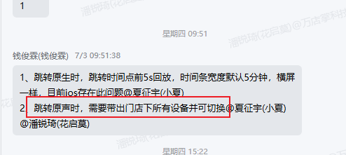
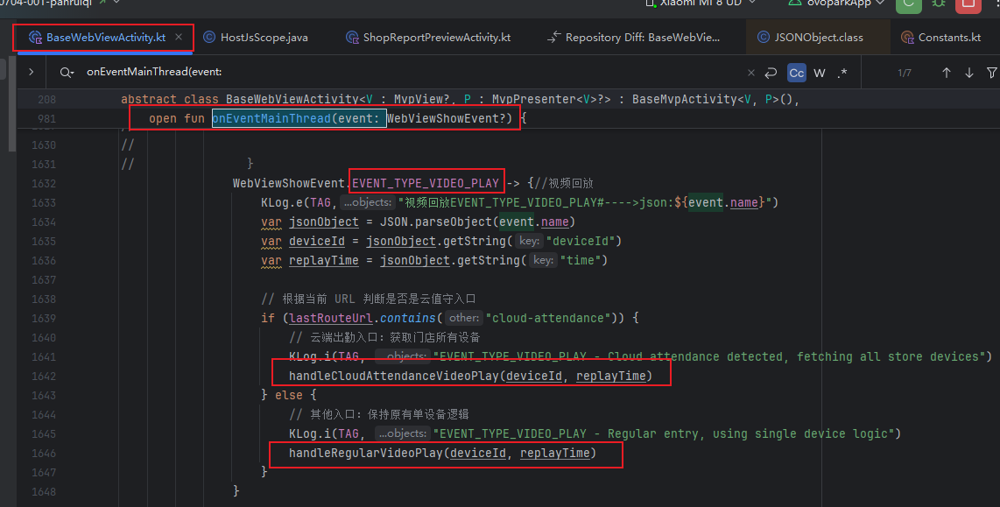
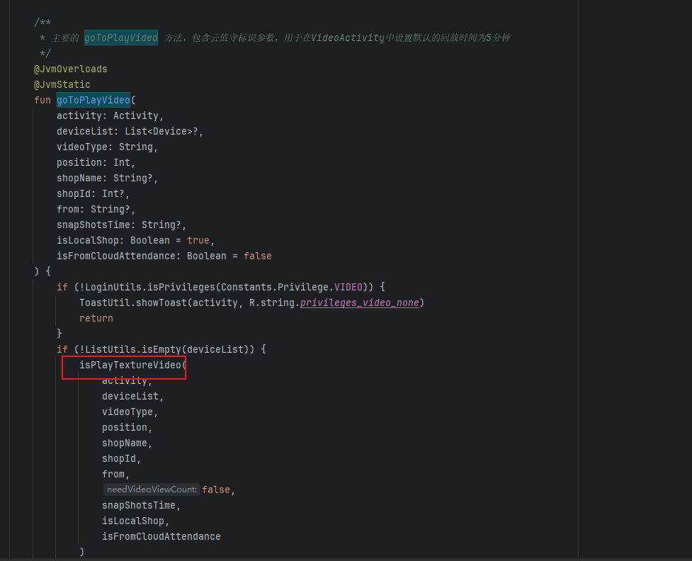
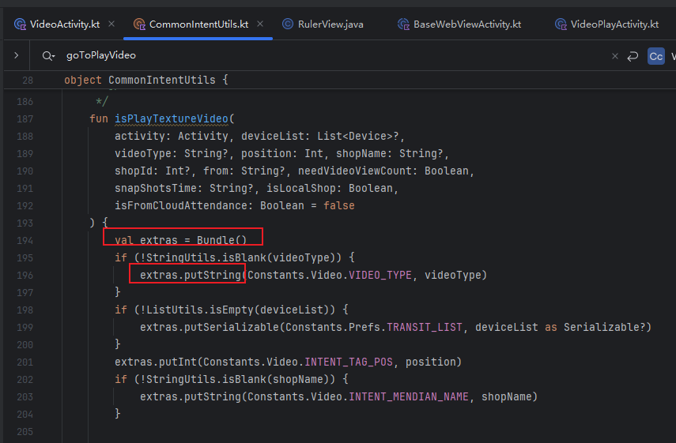
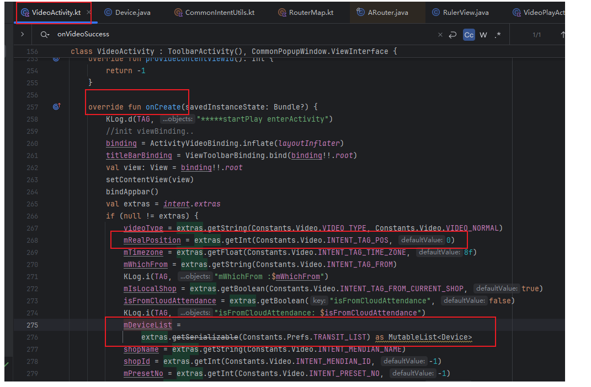

[toc]

## 前言

> 学习要符合如下的标准化链条：了解概念->探究原理->深入思考->总结提炼->底层实现->延伸应用"

## 01.学习概述

- **学习主题**：ovopark中云值守部分视频播放逻辑
- **知识类型**：
  - [ ] **知识类型**：
    - [ ] ✅Android/ 
      - [ ] ✅01.基础组件
      - [ ] ✅02.IPC机制
      - [ ] ✅03.消息机制
      - [ ] ✅04.View原理
      - [ ] ✅05.事件分发机制
      - [ ] ✅06.Window
      - [ ] ✅07.复杂控件
      - [ ] ✅08.性能优化
      - [ ] ✅09.流行框架
      - [ ] ✅10.数据处理
      - [ ] ✅11.动画
      - [ ] ✅12.Groovy
    - [ ] ✅音视频开发/
      - [ ] ✅01.基础知识
      - [ ] ✅02.OpenGL渲染视频
      - [ ] ✅03.FFmpeg音视频解码
    - [ ] ✅ Java/
      - [ ] ✅01.基础知识
      - [ ] ✅02.Java设计思想
      - [ ] ✅03.集合框架
      - [ ] ✅04.异常处理
      - [ ] ✅05.多线程与并发编程
      - [ ] ✅06.JVM
    - [ ] ✅ Kotlin/
      - [ ] ✅01.基础语法
      - [ ] ✅02.高阶扩展
      - [ ] ✅03.协程和流
- **学习来源**：
- **重要程度**：⭐⭐⭐⭐⭐（核心基础）  
- **学习日期**：
- **记录人**：@panruiqi

### 1.1 学习目标

- 了解概念->探究原理->深入思考->总结提炼->底层实现->延伸应用"

### 1.2 前置知识

- JSBridge 

## 02.核心概念

### 2.1 是什么？

区别于门店中门店视频的播放逻辑，他是云值守中视频播放逻辑，他采用的是WebView Js端进行的触发调用，通过 JSBridge 或事件机制，发送 EVENT_TYPE_VIDEO_PLAY 事件到原生。

同时他不仅仅是视频播放逻辑，还涉及到视频源的获取等整个流程。

### 2.2 解决什么问题？

云值守中视频播放部分门店下设备无法切换

### 2.3 基本特性

## 03.原理机制

### 3.1 前端触发

- WebView JS 端：调用 goVideoPlay({ deviceId, ... })

- 通过 JSBridge 或事件机制，发送 EVENT_TYPE_VIDEO_PLAY 事件到原生

- 

### 3.2 原生事件响应并进行分支处理

事件响应：

- BaseWebViewActivity.onEventMainThread(event: WebViewShowEvent)中

- 

分支处理

- 云值守入口（多设备）：handleCloudAttendanceVideoPlay(deviceId, replayTime)

  -  先用 deviceId 调用 VideoApi.getVideoRVCInfo 获取设备详情（拿到 depId/门店ID）
     - VideoApi.getVideoRVCInfo(params, callback)
  -  拿到 depId 后，调用 fetchAllStoreDevicesForCloudAttendance(depId, deviceId, replayTime)
     - CruiseShopApi.getShopDeviceListNew(depId, callback)

  -  拿到门店所有设备后，调用 handleDeviceListSuccess(devicesSets, deviceId, depId, replayTime)
     - 转换设备列表，查找当前选中设备索引
     - 设置回放时间（如有）
     - 跳转播放页面
     - CommonIntentUtils.goToPlayVideo(context, deviceList, videoType, selectedIndex, depName, depId, intentType, replayTime)
- 其他入口（单设备）

  - handleRegularVideoPlay(deviceId, replayTime)
    - 直接用 deviceId 调用 VideoApi.getVideoRVCInfo
  - 成功后调用 getDeviceInfoSuccess(data, replayTime)
    - 转换为 Device
    - 跳转播放页面（只传一个设备）
    - CommonIntentUtils.goToPlayVideo(...)
- 不管如何，调用CommonIntentUtils.goToPlayVideo(...)尝试进行播放操作

### 3.3 跳转播放页

CommonUtils

- goToPlayVideo
  - 
- isPlayTextureVideo
  - 组装 Bundle（extras）参数，用于存放所有需要传递到下一个页面的数据。这里的数据集，也就是从网络API获取到的数据集被存放在Bundle中
  - 
  - 网络环境判断和跳转逻辑
  - 移动网络（CMNET/CMWAP）：弹出提示框，询问用户是否继续播放。用户同意后设置 AppDataAttach.mWapPlay = true 并跳转
  - 

- navigationToVideo(extras, activity)：真正执行页面跳转的方法，把组装好的参数传递过去。
  - 
  - build(RouterMap.Video.ACTIVITY_URL_VIDEO)：指定要跳转的目标页面，这里是视频播放页面的路由地址
  - 

### 3.4 播放页进行播放

获取数据源和起始播放位置

- 

### 3.5 视频播放页初始化

 [04. 云值守_云值守视频播放流程.md](04. 云值守_云值守视频播放流程.md) 

## 04.底层原理

## 05.深度思考

### 5.1 关键问题探究

### 5.2 设计对比

## 06.实践验证

### 6.1 行为验证代码

### 6.2 性能测试

## 07.应用场景

### 7.1 最佳实践

### 7.2 使用禁忌

## 08.总结提炼

### 8.1 核心收获

### 8.2 知识图谱

### 8.3 延伸思考

## 09.参考资料

1. 
2. 
3. 

