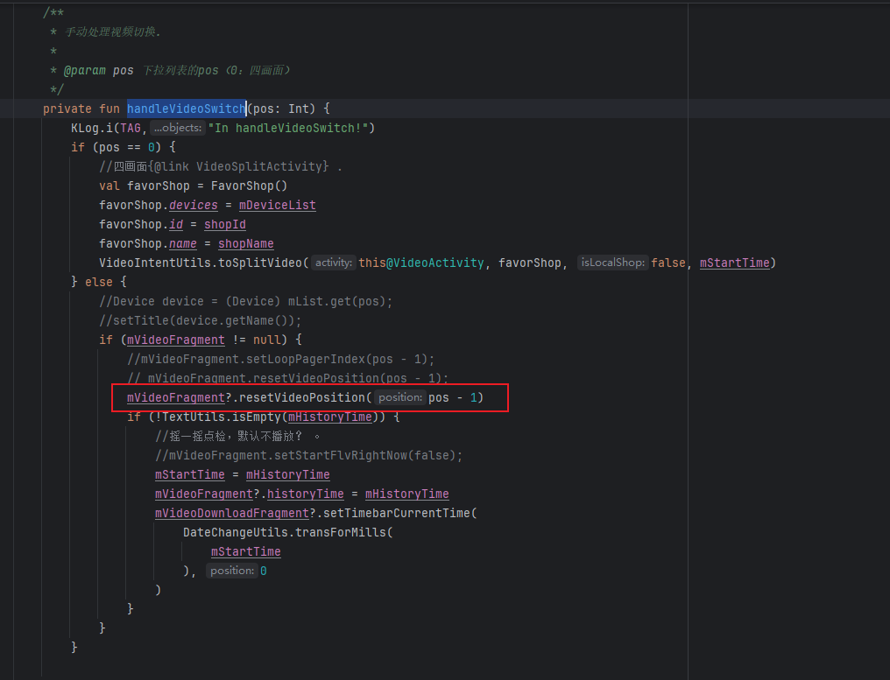
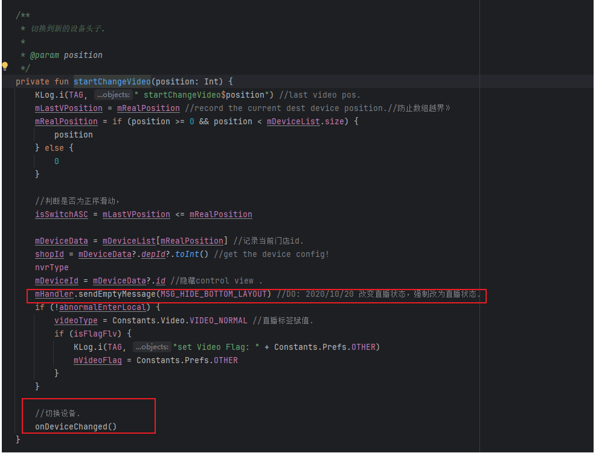
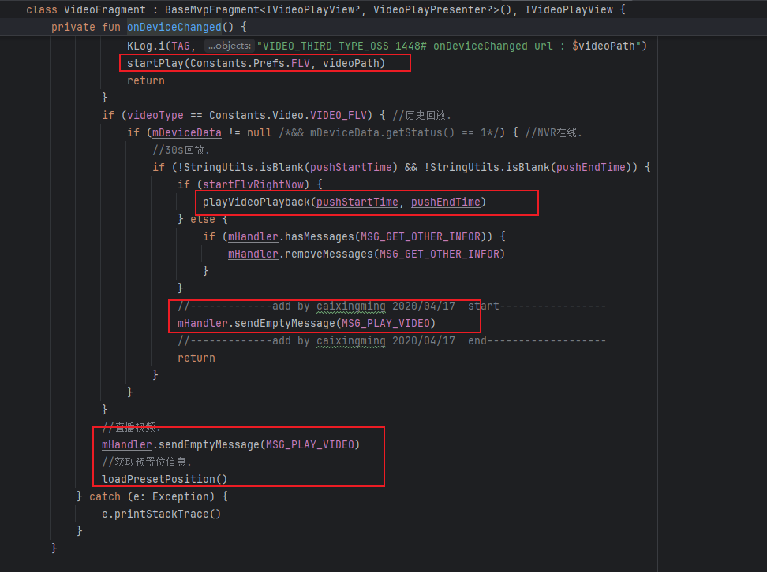
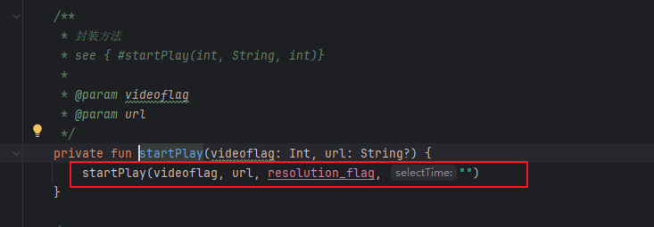
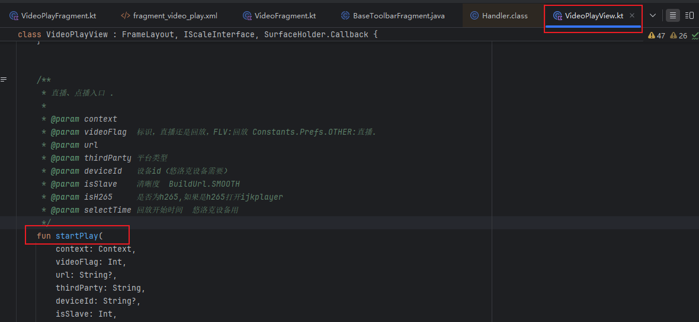
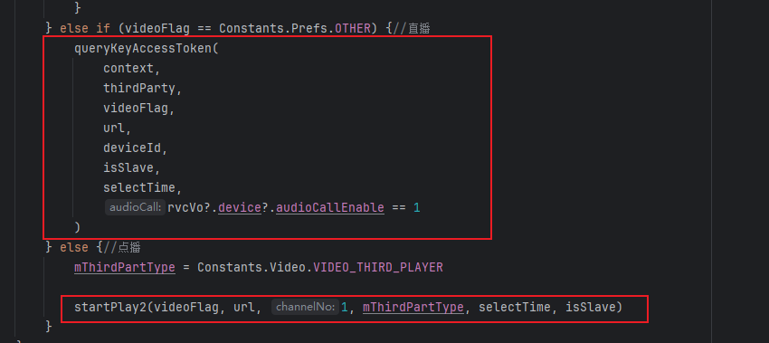
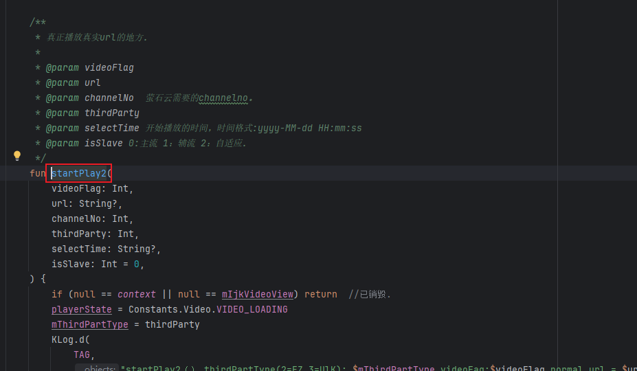
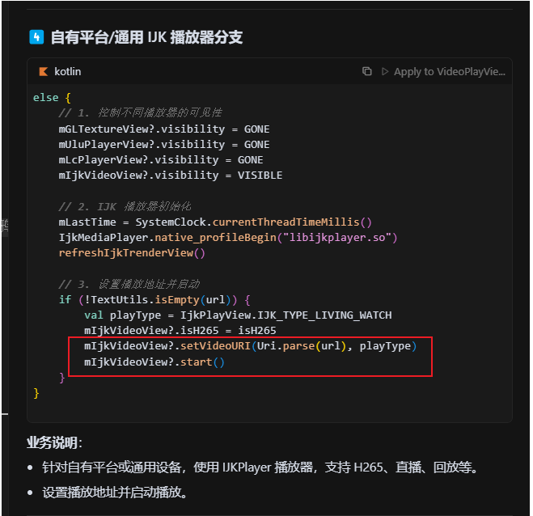

[toc]

## 前言

> 学习要符合如下的标准化链条：了解概念->探究原理->深入思考->总结提炼->底层实现->延伸应用"

## 01.学习概述

- **学习主题**：ovopark中门店视频播放逻辑
- **知识类型**：
  - [ ] **知识类型**：
    - [ ] ✅Android/ 
      - [ ] ✅01.基础组件
      - [ ] ✅02.IPC机制
      - [ ] ✅03.消息机制
      - [ ] ✅04.View原理
      - [ ] ✅05.事件分发机制
      - [ ] ✅06.Window
      - [ ] ✅07.复杂控件
      - [ ] ✅08.性能优化
      - [ ] ✅09.流行框架
      - [ ] ✅10.数据处理
      - [ ] ✅11.动画
      - [ ] ✅12.Groovy
    - [ ] ✅音视频开发/
      - [ ] ✅01.基础知识
      - [ ] ✅02.OpenGL渲染视频
      - [ ] ✅03.FFmpeg音视频解码
    - [ ] ✅ Java/
      - [ ] ✅01.基础知识
      - [ ] ✅02.Java设计思想
      - [ ] ✅03.集合框架
      - [ ] ✅04.异常处理
      - [ ] ✅05.多线程与并发编程
      - [ ] ✅06.JVM
    - [ ] ✅ Kotlin/
      - [ ] ✅01.基础语法
      - [ ] ✅02.高阶扩展
      - [ ] ✅03.协程和流
- **学习来源**：
- **重要程度**：⭐⭐⭐⭐⭐（核心基础）  
- **学习日期**：
- **记录人**：@panruiqi

### 1.1 学习目标

- 了解概念->探究原理->深入思考->总结提炼->底层实现->延伸应用"

### 1.2 前置知识


## 02.核心概念

### 2.1 是什么？

门店中门店视频的播放逻辑


### 2.2 解决什么问题？

业务流程理解薄弱

### 2.3 基本特性


## 03.原理机制

### 3.1 视频任务下发给Handler

从handleVideoSwitch开始

- 执行流快速过一遍如下：
  - 
  - 
  - 
  - 

视频播放出现分支了，他的分支是什么样的？

- 如果是 OSS 第三方设备，直接用 startPlay 播放指定 URL，不走后续分支。
- 如果当前是“历史回放”模式，并且有合法的回放时间区间：
  - 如果 startFlvRightNow 为 true，直接调用 playVideoPlayback 播放回放视频。
  - 否则，清理相关消息。
  - 最后无论哪种情况，都会发送 MSG_PLAY_VIDEO 消息，触发后续播放流程，并 return
- 如果不是 OSS 设备，也不是历史回放模式，默认就是直播模式，直接发送 MSG_PLAY_VIDEO，让 Handler 统一调度播放流程

### 3.2 Handler处理视频任务

好，视频最终通过mHandler发送一个MSG_PLAY_VIDEO消息委托出去进行播放任务，那他的过程是什么样的呢？

- 首先是bind2Play()
  - 
  - 
- 好，接着是播放直播方法
  - 
  - 
  - 
  - 

进入到这一块

- startPlay进入到这一块
  - 
- 
- 自有平台直播，先查询 AccessToken，再发起播放。
- 其他情况（如回放），直接调用 startPlay2() 播放。

最终的真实播放位置

- 
- 
- 

### 3.3 这个Handler设计的巧妙之处

这里的mHandler是什么？

- 应当是继承自BaseToolbarFragment

  - 
  - 
  - 
  - 

这个Handler设计的巧妙之处

- 代码块如下：

  - 

- 普通Handler存在内存泄漏的问题

  - ```
    // ❌ 传统写法 - 会造成内存泄漏
    private Handler mHandler = new Handler() {
        @Override
        public void handleMessage(Message msg) {
            // 这里隐式持有外部类的强引用
            // 如果有延迟消息，会阻止 Activity/Fragment 被 GC 回收
        }
    };
    ```

  - 问题：Handler 作为内部类，隐式持有外部类的强引用，导致：

  - Activity/Fragment 无法被垃圾回收

  - 造成内存泄漏

  - 特别是有延迟消息时更严重

- 内存泄漏？比如：

  - Fragment/Activity 明明已经退出，但因为 Handler 还持有它的强引用，导致它一直留在内存中，这就是内存泄漏。

- 当前Handler的优异之处？

  - ```
    public static class UnLeakHandler extends Handler {
        // 🎯 关键1: static 静态类，不持有外部类引用
        
        WeakReference<BaseToolbarFragment> mWeakReferenceFragment;
        // 🎯 关键2: WeakReference 弱引用，不阻止 GC
    
        public UnLeakHandler(BaseToolbarFragment fragment) {
            mWeakReferenceFragment = new WeakReference<>(fragment);
            // 🎯 关键3: 显式传入 Fragment 引用并包装为弱引用
        }
    
        @Override
        public void handleMessage(Message msg) {
            super.handleMessage(msg);
            if (null != mWeakReferenceFragment.get()) {
                // 🎯 关键4: 检查引用是否还存在
                BaseToolbarFragment fragment = mWeakReferenceFragment.get();
                fragment.handleMessage(msg);
                // 🎯 关键5: 委托给 Fragment 处理
            }
            // 🎯 关键6: 如果 Fragment 已被回收，消息自动丢弃
        }
    }
    ```

  - 为什么是静态类？

    - 普通类内部存在隐式引用的问题

    - ```
      public class MyFragment extends Fragment {
          private Handler mHandler = new Handler() {
              @Override
              public void handleMessage(Message msg) { ... }
          };
      }
      ```

    - 这种写法，Handler 是 MyFragment 的非静态内部类，会自动持有外部类（MyFragment）的强引用。

    - 只要 Handler 活着，MyFragment 就不会被 GC 回收，导致内存泄漏。

  - 通过弱引用，构造时传入 fragment，并用 WeakReference 包裹。这样，Handler 只持有 Fragment 的弱引用，不会阻止 Fragment 被 GC

- 好，消息的处理流程呢？

  - 当有消息到达 Handler 时，系统会调用 UnLeakHandler.handleMessage(msg)

  - ```
    @Override
    public void handleMessage(Message msg) {
        if (null != mWeakReferenceFragment.get()) {
            BaseToolbarFragment fragment = mWeakReferenceFragment.get();
            fragment.handleMessage(msg); // 让 fragment 处理消息
        }
    }
    ```

  - 也就是说，Handler 收到消息后，转手又交给 Fragment 的 handleMessage 方法处理

- 他的设计思想本质就是一个转交的过程，其实就是防止持有Fragment的强引用，用于防止内存泄漏，尤其适合 Fragment/Activity 这种生命周期短、容易被回收的组件。

### 3.4 这个Handler处理的过程

我们new了一个UnLeakHandler ，可是为什么任务会发给他？而不是发给其他的Handler？

- 主线程只有一个 Looper，但可以有很多 Handler

- Handler 是你 new 出来的，你可以 new 普通 Handler，也可以 new UnLeakHandler。

- 消息发给谁，完全取决于你代码里用的是哪个 Handler发送任务。

- ```
  Handler handlerA = new Handler();
  Handler handlerB = new Handler();
  
  handlerA.sendEmptyMessage(1); // 这条消息只会被 handlerA 处理
  handlerB.sendEmptyMessage(2); // 这条消息只会被 handlerB 处理
  ```

- 谁发消息，谁收消息。你用哪个 Handler 发，消息就进哪个 Handler 的队列。

那么，假如你通过他发送消息

- ```
  mHandler.sendEmptyMessage(MSG_PLAY_VIDEO);
  ```

- 首先，他会被放到主线程的looper中，然后经过looper.loop，找到mHandler，由你自己处理

- ```
  public void handleMessage(Message msg) {
         super.handleMessage(msg);
         if (null != mWeakReferenceFragment.get()) {
             // 🎯 关键4: 检查引用是否还存在
             BaseToolbarFragment fragment = mWeakReferenceFragment.get();
             fragment.handleMessage(msg);
             // 🎯 关键5: 委托给 Fragment 处理
         }
         // 🎯 关键6: 如果 Fragment 已被回收，消息自动丢弃
     }
  ```

- 通过检查，交给Fragment的handleMessage方法处理

### 3.5 这个Handler有什么问题吗？有没有更优越的方案

UnLeakHandler 的优缺点

- 优点
  - 彻底解决 Handler 导致的内存泄漏（只要页面被回收，消息自动丢弃）
  - 兼容性好，适用于所有 Android 版本
  - 实现简单，易于理解和维护
- 缺点
  - 消息丢失：如果 Fragment/Activity 被回收，Handler 收到消息时会直接丢弃，不会有任何提示，有些业务场景下可能导致“消息丢失”。
- 代码冗余：每个页面都要写一遍类似的 Handler 代码，维护成本高。
- 业务逻辑分散：消息处理逻辑分散在 Fragment/Activity 和 Handler 之间，不够直观。
- 仍需手动管理：你需要自己判断页面是否还活着，自己决定是否处理消息。

更好的方案：

- 使用 ViewModel + LiveData（推荐）
- 使用协程（Kotlin Coroutine）+ 生命周期感知

## 04.底层原理


## 05.深度思考

### 5.1 关键问题探究


### 5.2 设计对比


## 06.实践验证

### 6.1 行为验证代码


### 6.2 性能测试


## 07.应用场景

### 7.1 最佳实践


### 7.2 使用禁忌


## 08.总结提炼

### 8.1 核心收获


### 8.2 知识图谱


### 8.3 延伸思考


## 09.参考资料

1. []()
2. []()
3. []()

