[toc]

## 前言

> 学习要符合如下的标准化链条：了解概念->探究原理->深入思考->总结提炼->底层实现->延伸应用"

## 01.学习概述

- **学习主题**：极光推送
- **知识类型**：
  - [ ] **知识类型**：
    - [ ] ✅Android/ 
      - [ ] ✅01.基础组件
      - [ ] ✅02.IPC机制
      - [ ] ✅03.消息机制
      - [ ] ✅04.View原理
      - [ ] ✅05.事件分发机制
      - [ ] ✅06.Window
      - [ ] ✅07.复杂控件
      - [ ] ✅08.性能优化
      - [ ] ✅09.流行框架
      - [ ] ✅10.数据处理
      - [ ] ✅11.动画
      - [ ] ✅12.Groovy
    - [ ] ✅音视频开发/
      - [ ] ✅01.基础知识
      - [ ] ✅02.OpenGL渲染视频
      - [ ] ✅03.FFmpeg音视频解码
    - [ ] ✅ Java/
      - [ ] ✅01.基础知识
      - [ ] ✅02.Java设计思想
      - [ ] ✅03.集合框架
      - [ ] ✅04.异常处理
      - [ ] ✅05.多线程与并发编程
      - [ ] ✅06.JVM
    - [ ] ✅ Kotlin/
      - [ ] ✅01.基础语法
      - [ ] ✅02.高阶扩展
      - [ ] ✅03.协程和流
    - [ ] ✅ 故障分析与处理/
      - [ ] ✅01.基础知识
    - [ ] ✅ 自我管理/
      - [ ] ✅01.内观
    - [ ] ✅ 业务逻辑/
      - [ ] ✅01.启动
      - [ ] ✅02.首页
      - [ ] ✅03.巡店
      - [ ] ✅04.云值守
      - [x] ✅05.消息中心
      - [ ] ✅06.智控平台
- **学习来源**：
- **重要程度**：⭐⭐⭐⭐⭐
- **学习日期**：2025.
- **记录人**：@panruiqi

### 1.1 学习目标

- 了解概念->探究原理->深入思考->总结提炼->底层实现->延伸应用"

### 1.2 前置知识

- [ ] 

## 02.核心概念

### 2.1 业务痛点与需求

### 2.2 解决方案

### 2.3 基本特性

## 03.业务逻辑流

### 3.0 极光推送原理介绍

我们的ovopark会启动一个后台的service运行在一个独立的进程上，负责运行极光的SDK。其会和极光推送服务提供商保持一个长连接。

我们公司的后端调用极光的后端，极光的后端通过设备长连接通道将数据发送到我们的手机上，手机上的servcie收到数据后跟系统交互弹出通知。

- 类似下图：对于像设备3这种无网络连接或是没有成功建立长连接通道的设备，会在设备3连网且推送消息没有过期的情况下自动收到由第三方推送服务提供商推送过来的消息，保证消息不会丢失。
  - 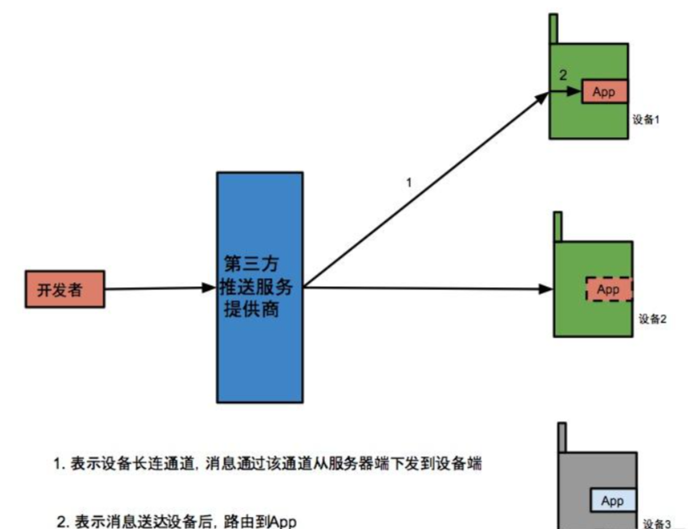

然后，系统通知的点击事件通过广播发送给我们ovopark接收。

### 3.1 极光推送环境配置

ok，我们先来看看极光推送的环境的初始化，首先是后台独立的servcie进程

- 创建pushService进程，运行在pushcore进程上。
  - 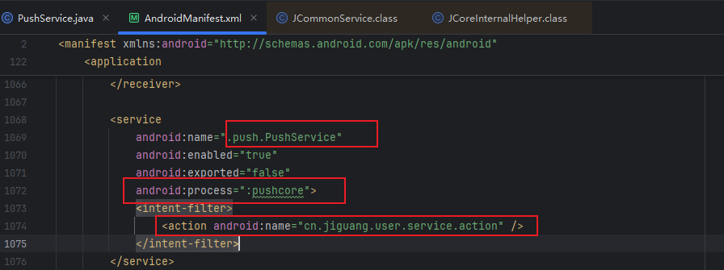

接着是我们的ovopark中的极光推送的广播接收者，负责接收 消息到来 和 消息点击 的事件

- 创建极光推送广播接收者
  - 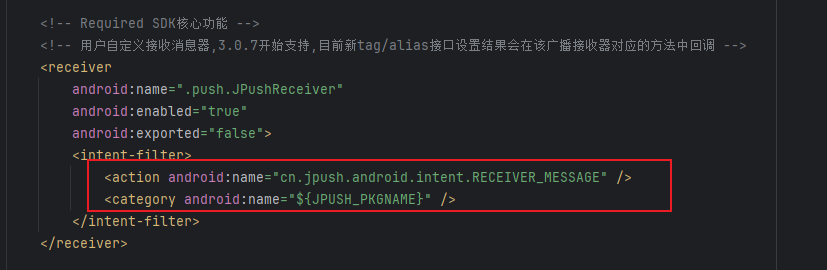

### 3.2  消息推送接收流程

消息推送到来时有三个重要的方法

- 分别是onMessage透传消息（不显示通知，直接传给App）;onNotifyMessageUnShow通知未显示时（比如被系统拦截）；以及最关键的onNotifyMessageArrived：消息到达但还未点击时触发，此时通知已经显示在通知栏了
  - 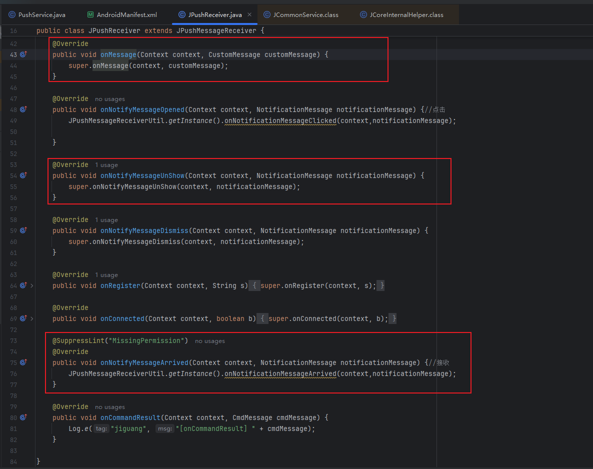

好，我们来看看JPushMessageReceiverUtil.getInstance().onNotificationMessageArrived方法

- 首先他接收并传递NotificationMessage 数据类型，核心是这里的msgId，和Extras字段
  - 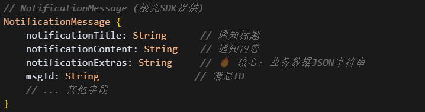
- 然后我们来看看他的单例模式
  - 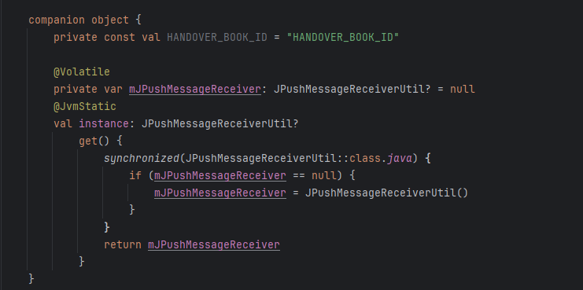
- 好了，我们现在要来看重点了，消息的接收方法
- 首先是数据的解析
  - 通过forwardActivityName获取前台activity的名称
  - 解析notificationExtras字段获取推送数据data
  - 再从data中解析BDMessage
  - 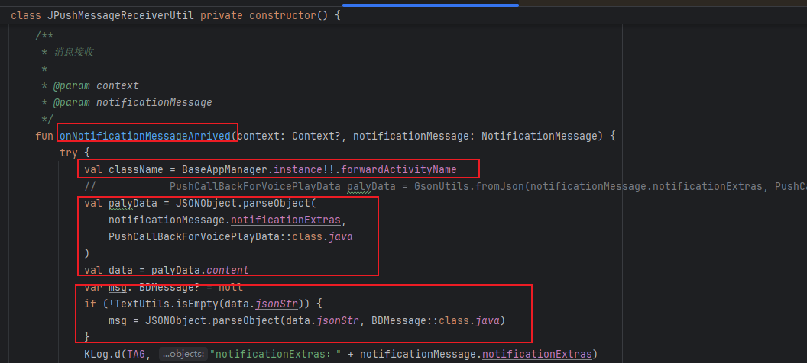
- 然后是数据的发送,挑选部分来说
  - 如果类型是6，通知用户密码需要重置，通过EventBus广播给UI层
  - 类型是10，判读如果用户正在抓拍页面，刷新任务列表（这里页面通过上面的forwardActivityName获取到的activity名称）
  - 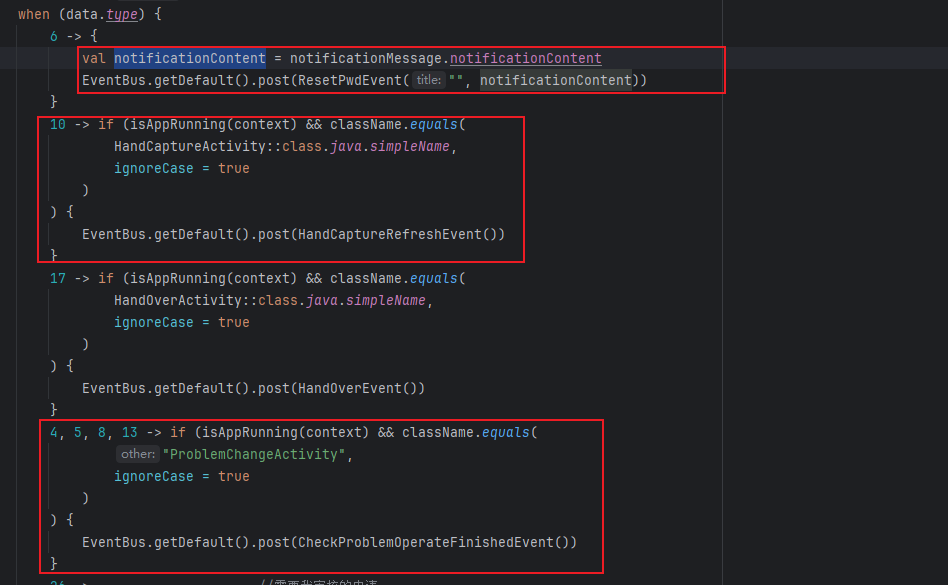

### 3.3 消息推送点击流程

消息推送的点击流程就是一个核心方法

- onNotifyMessageOpened方法
  - 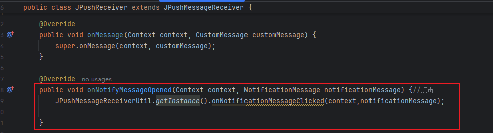
- 好的，仍旧是这里的两段式数据解析，这里通过JPushClickHelp.pushMsgClick方法进行处理
  - 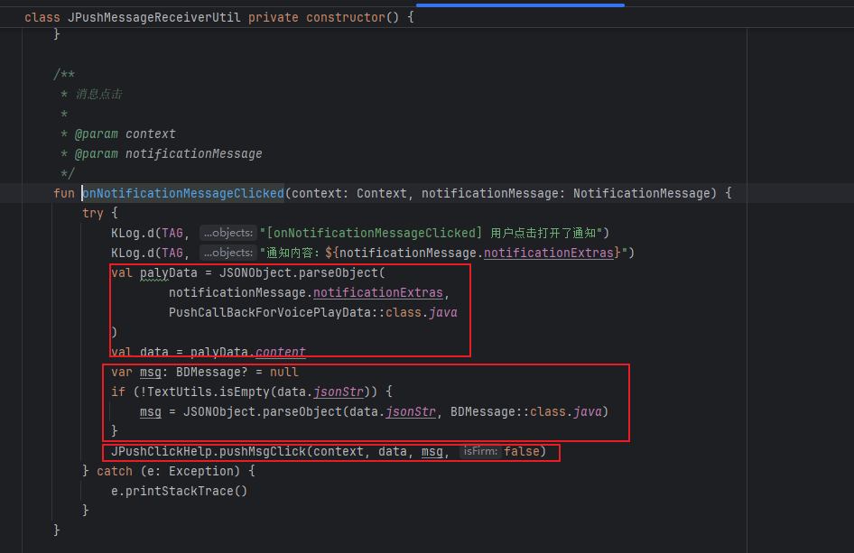
- 那我们来看看JPushClickHelp.pushMsgClick这个方法吧
  - 没啥好说的，从data中获取type，然后根据type执行对应的操作，比如：ARouter页面路由，EventBus发出，WebView跳转等。
  - 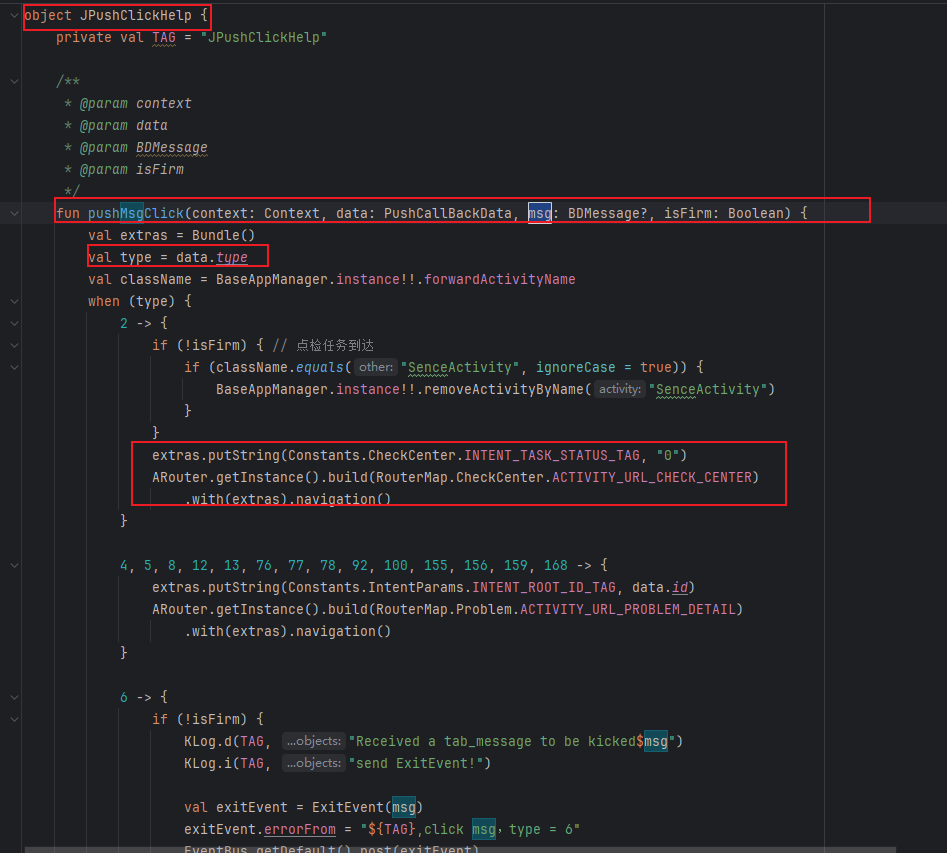

好，至此极光推送相关的逻辑已经说完了

### 3.4 

### 3.5 

### 3.6 

## 04.底层原理

## 05.深度思考

### 5.1 关键问题探究

### 5.2 设计对比

## 06.实践验证

### 6.1 行为验证代码

### 6.2 性能测试

## 07.应用场景

### 7.1 最佳实践

### 7.2 使用禁忌

## 08.总结提炼

### 8.1 核心收获

### 8.2 知识图谱

### 8.3 延伸思考

## 09.参考资料

1. 
2. 
3. 

## 其他介绍

### 01.关于我的博客

- csdn：http://my.csdn.net/qq_35829566

- 掘金：https://juejin.im/user/499639464759898

- github：https://github.com/jjjjjjava

- 邮箱：[934137388@qq.com]

