[toc]

## 前言

> 学习要符合如下的标准化链条：了解概念->探究原理->深入思考->总结提炼->底层实现->延伸应用"

## 01.学习概述

- **学习主题**：
- **知识类型**：
  - [ ] **知识类型**：
    - [ ] ✅Android/ 
      - [ ] ✅01.基础组件
      - [ ] ✅02.IPC机制
      - [ ] ✅03.消息机制
      - [ ] ✅04.View原理
      - [ ] ✅05.事件分发机制
      - [ ] ✅06.Window
      - [ ] ✅07.复杂控件
      - [ ] ✅08.性能优化
      - [ ] ✅09.流行框架
      - [ ] ✅10.数据处理
      - [ ] ✅11.动画
      - [ ] ✅12.Groovy
    - [ ] ✅音视频开发/
      - [ ] ✅01.基础知识
      - [ ] ✅02.OpenGL渲染视频
      - [ ] ✅03.FFmpeg音视频解码
    - [ ] ✅ Java/
      - [ ] ✅01.基础知识
      - [ ] ✅02.Java设计思想
      - [ ] ✅03.集合框架
      - [ ] ✅04.异常处理
      - [ ] ✅05.多线程与并发编程
      - [ ] ✅06.JVM
    - [ ] ✅ Kotlin/
      - [ ] ✅01.基础语法
      - [ ] ✅02.高阶扩展
      - [ ] ✅03.协程和流
    - [ ] ✅ 故障分析与处理/
      - [ ] ✅01.基础知识
    - [ ] ✅ 自我管理/
      - [ ] ✅01.内观
    - [ ] ✅ 业务逻辑/
      - [ ] ✅01.启动
      - [ ] ✅02.首页
      - [ ] ✅03.巡店
      - [ ] ✅04.云值守
      - [ ] ✅05.消息中心
      - [ ] ✅06.智控平台
- **学习来源**：
- **重要程度**：⭐⭐⭐⭐⭐
- **学习日期**：2025.
- **记录人**：@panruiqi

### 1.1 学习目标

- 了解概念->探究原理->深入思考->总结提炼->底层实现->延伸应用"

### 1.2 前置知识

- [ ] 

## 02.核心概念

### 2.1 业务痛点与需求

### 2.2 解决方案

### 2.3 基本特性

## 03.整体设计

### 3.0 从哪来到这的

实际图如下：

- 

- ok，总结一下，我们目前经过了ConversationActivity，内部一个FrameLayout，包含一个NewConversationFragment。
- 然后是二级的View，就是我们的NewConversationFragment。他分为顶部标题栏，然后Tittle栏，以及下面的ViewPager。
- 然后是三级的ViewPager内部的Fragment，它由Tittle栏控制，Tittle分为：全部，巡店，店务，系统。三级Fragment 是ItemConversationFragment，其内部持有一个LinearLayout，包含四个TextView，以及一个RecyclerView。
- RecyclerView内部有三种消息类型，分别是：小秘书消息，系统分组消息，IM会话消息

MessageListActivity：现在用户点击子条目中的系统分组消息，触发其点击事件，会跳转到MessageListActivity，并传递当前分组对象

现在用户点击子条目中的系统分组消息，触发其点击事件，跳转到MessageListActivity，并传递当前分组对象

- 详情如下：
  - 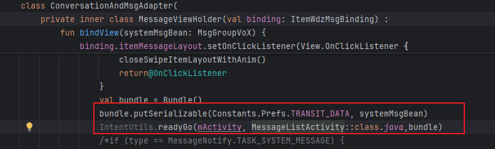

### 3.1 视图层级设计

来，看一下MessageListActivity，其实际视图如下：

- 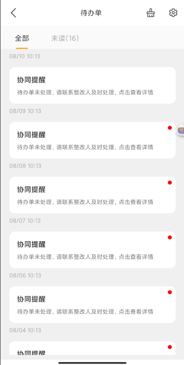

内部拥有一个TabLayout和一个ViewPager

- 这是TabLayout，会和ViewPager关联
  - 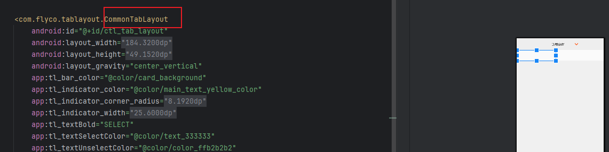

- ViewPager内部，存放两个SecondMessageFragment，也就是上面的全部 和 未读
  - 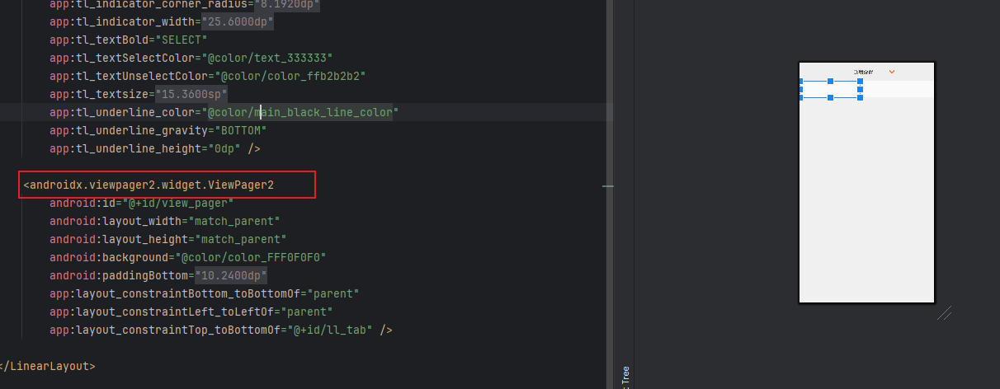
  - 两个Fragment：全部和未读
  - 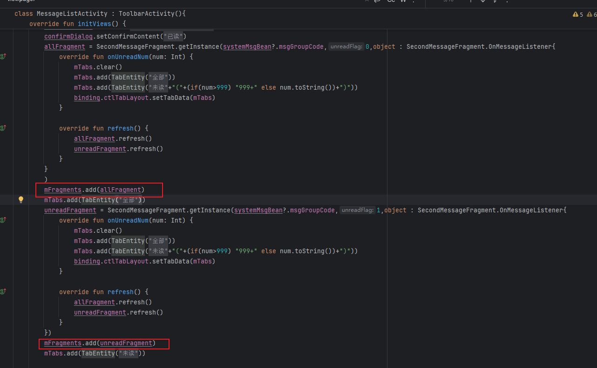

好，我们来看一下这两个Fragment，他们都是SecondMessageFragment类型，我们会传递msgGroupCode

- 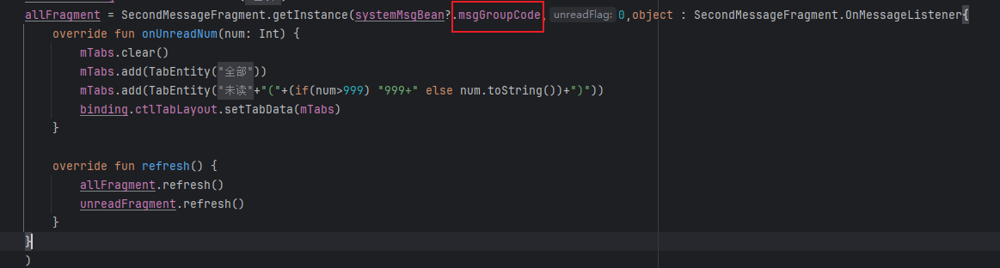

SecondMessageFragment内部包含一个RecyclerView。

- 这是我们自定义的RecyclerView，可以支持内部子条目的左右滑动操作
  - 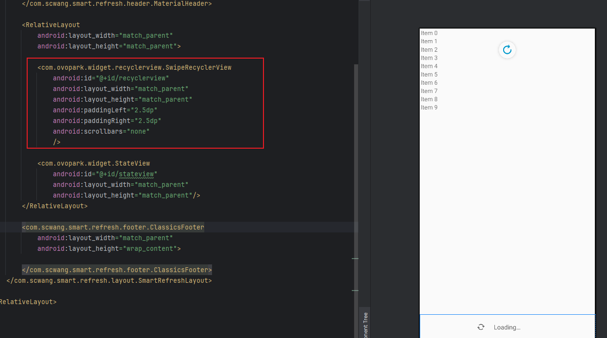

我们来看看他的点击事件，由这个决定

- 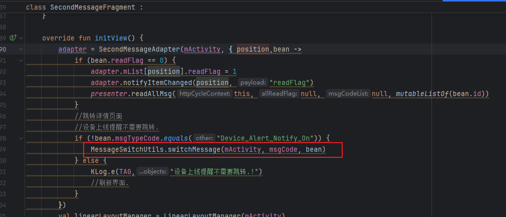

- 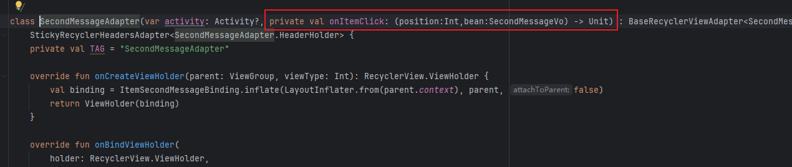

ok，我们来看看MessageSwitchUtils，其是系统分组消息点击后的跳转分发工具类

- 首先是特殊处理
  - 三方URL：如果bean.linkUrl不为空，直接打开WebView。
  - 审批中心：如果bean.approveFlag == 1，直接打开审批中心WebView。
  - 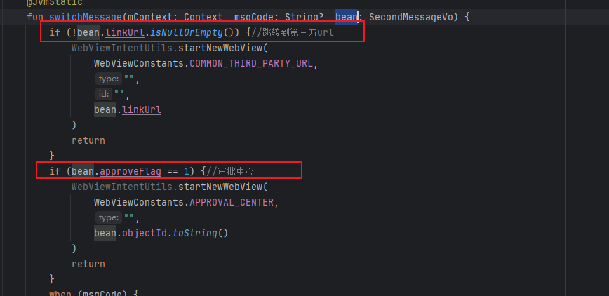
- 然后是实际的跳转操作，依赖于msgGroupCode和msgTypeCode，也就是大类和小类。
  - 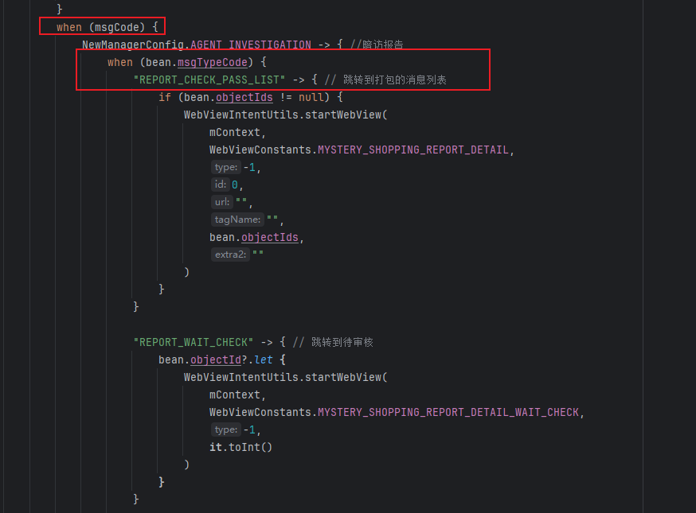

### 3.2 数据处理

MessageListActivity中获取初始化的分组数据

- 从intent中获取数据
  - 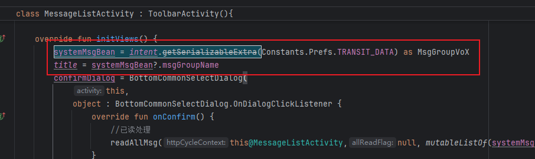
- 那么这个数据从哪来的？
  - adapter中点击事件传递进来的
  - 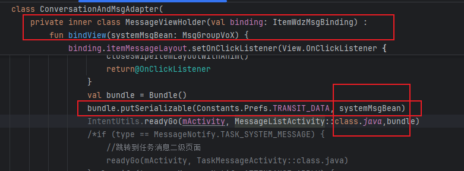
  - adapter中数据从哪来的？
  - 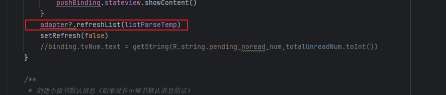
  - listParseTemp呢
  - 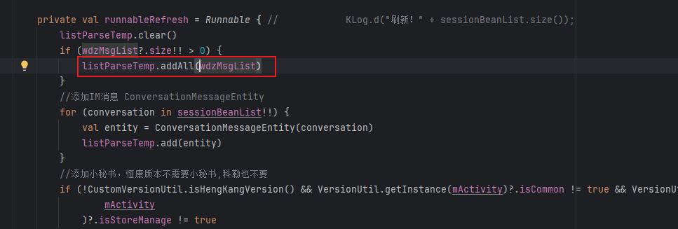
  - wdzMsgList呢？API成功后的接口回调，将获取的网络数据的List部分放入
  - 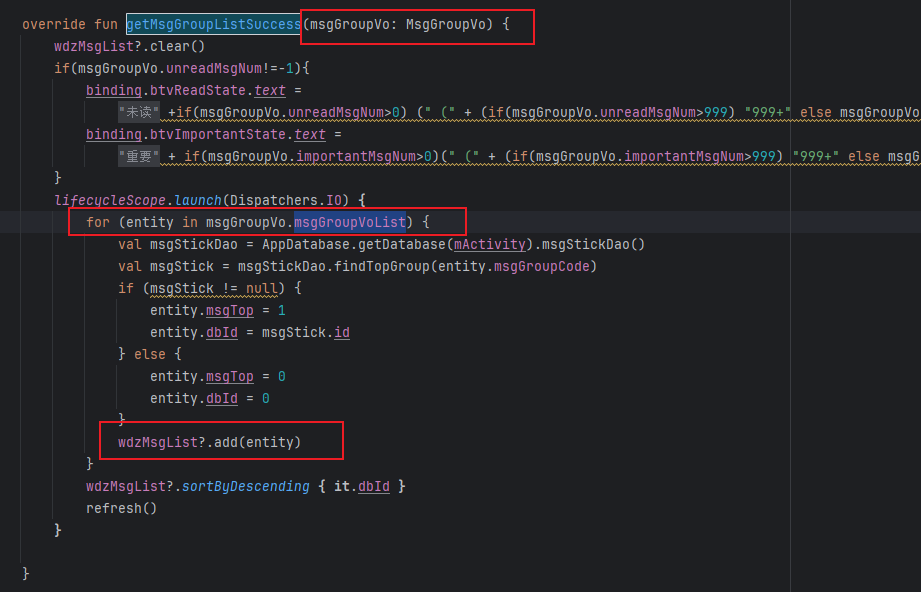
  - 网络数据接口呢？
  - 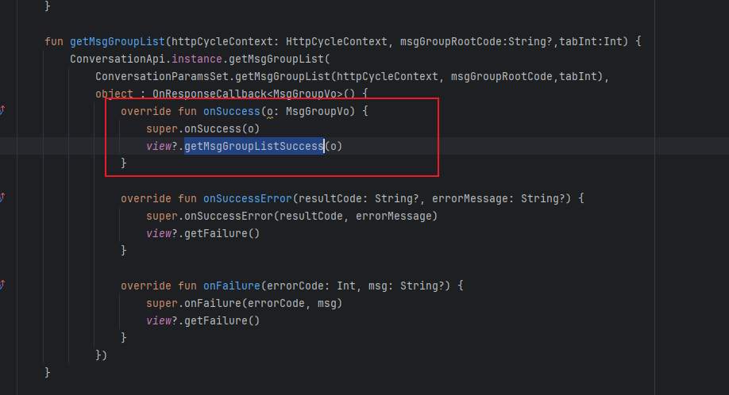
  - 对应的数据类型呢？
  - 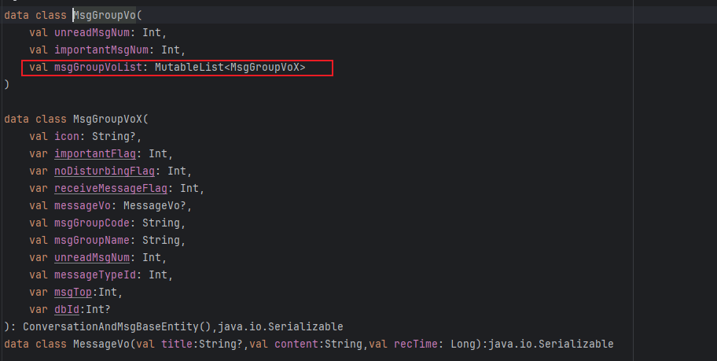

- 好，接着创建Fragment
  - 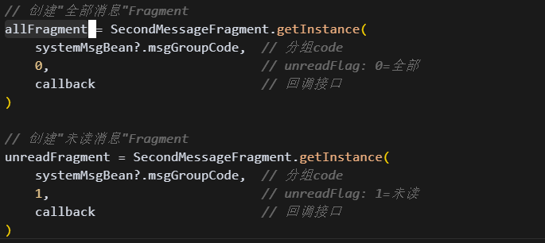

SecondMessageFragment中数据如何获取呢？

- requestDataRefresh钟调用下面的接口
  - 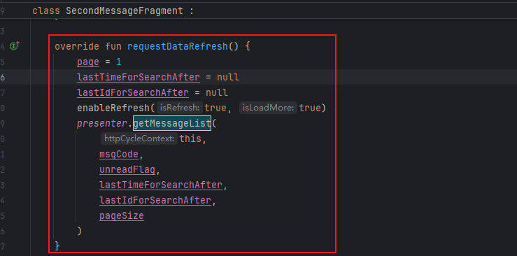
  - 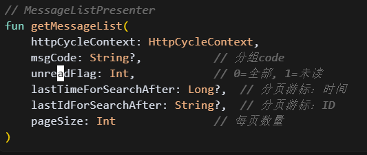
- 数据展示逻辑
  - 网络请求成功后调用下面的
  - 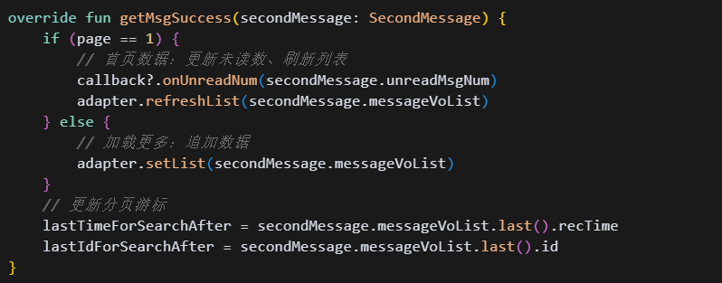

### 3.3 那我们拿到数据后如何处理他呢？

### 3.4 具体的业务场景是什么样的？

### 3.5 进一步思考

### 3.6 总结一下，整个数据的流转过程是什么样的?

## 04.底层原理

## 05.深度思考

### 5.1 关键问题探究

### 5.2 设计对比

## 06.实践验证

### 6.1 行为验证代码

### 6.2 性能测试

## 07.应用场景

### 7.1 最佳实践

### 7.2 使用禁忌

## 08.总结提炼

### 8.1 核心收获

### 8.2 知识图谱

### 8.3 延伸思考

## 09.参考资料

1. 
2. 
3. 

## 其他介绍

### 01.关于我的博客

- csdn：http://my.csdn.net/qq_35829566

- 掘金：https://juejin.im/user/499639464759898

- github：https://github.com/jjjjjjava

- 邮箱：[934137388@qq.com]

