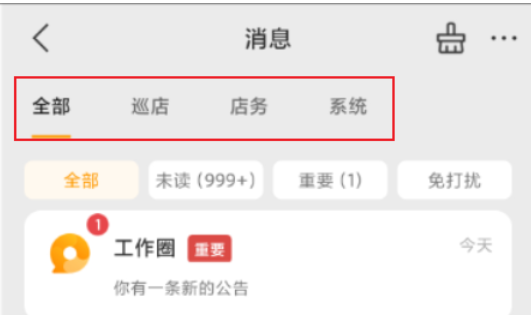

[toc]

## 前言

> 学习要符合如下的标准化链条：了解概念->探究原理->深入思考->总结提炼->底层实现->延伸应用"

## 01.学习概述

- **学习主题**：
- **知识类型**：
  - [ ] **知识类型**：
    - [ ] ✅Android/ 
      - [ ] ✅01.基础组件
      - [ ] ✅02.IPC机制
      - [ ] ✅03.消息机制
      - [ ] ✅04.View原理
      - [ ] ✅05.事件分发机制
      - [ ] ✅06.Window
      - [ ] ✅07.复杂控件
      - [ ] ✅08.性能优化
      - [ ] ✅09.流行框架
      - [ ] ✅10.数据处理
      - [ ] ✅11.动画
      - [ ] ✅12.Groovy
    - [ ] ✅音视频开发/
      - [ ] ✅01.基础知识
      - [ ] ✅02.OpenGL渲染视频
      - [ ] ✅03.FFmpeg音视频解码
    - [ ] ✅ Java/
      - [ ] ✅01.基础知识
      - [ ] ✅02.Java设计思想
      - [ ] ✅03.集合框架
      - [ ] ✅04.异常处理
      - [ ] ✅05.多线程与并发编程
      - [ ] ✅06.JVM
    - [ ] ✅ Kotlin/
      - [ ] ✅01.基础语法
      - [ ] ✅02.高阶扩展
      - [ ] ✅03.协程和流
    - [ ] ✅ 故障分析与处理/
      - [ ] ✅01.基础知识
    - [ ] ✅ 自我管理/
      - [ ] ✅01.内观
    - [ ] ✅ 业务逻辑/
      - [ ] ✅01.启动
      - [ ] ✅02.首页
      - [ ] ✅03.巡店
      - [ ] ✅04.云值守
      - [ ] ✅05.消息中心
      - [ ] ✅06.智控平台
- **学习来源**：
- **重要程度**：⭐⭐⭐⭐⭐
- **学习日期**：2025.
- **记录人**：@panruiqi

### 1.1 学习目标

- 了解概念->探究原理->深入思考->总结提炼->底层实现->延伸应用"

### 1.2 前置知识

- [ ] 

### 1.3 这个过程中可学到的知识

消息中心的NoScrollViewPager:

- 在这个位置
  
  - 
- 他对应如下：
  
- 
  
- 介绍：自定义控件 NoScrollViewPager，继承自 Android 的 ViewPager，其主要作用是控制 ViewPager 是否可以滑动，通过重写事件分发机制实现

- 这个过程中可以学到的知识

  - | 知识点           | 归属体系           | 典型应用/说明              |
    | :--------------- | :----------------- | :------------------------- |
    | ViewPager        | UI组件、页面架构   | Fragment容器、页面滑动     |
    | ViewPager2       | UI组件、页面架构   | 新一代页面滑动控件         |
    | RecyclerView     | UI组件、列表/网格  | 高性能列表、ViewPager2底层 |
    | 事件分发机制     | Android基础        | 控件滑动、点击、拦截       |
    | Fragment管理     | 页面架构           | 多页面管理、懒加载         |
    |                  |                    |                            |
    | Koin依赖注入     | 现代架构、最佳实践 | 解耦依赖、提升可测试性     |
    |                  |                    |                            |
    | 控件自定义与优化 | 进阶开发           | 扩展原生控件、优雅实现     |
    | 控件选择与迁移   | 项目架构、技术选型 | 何时用新控件、如何迁移     |

  - Android UI 组件体系

    - ViewPager
      - 作用：实现页面左右滑动切换，常用于引导页、Tab页等。
      - 适配器：PagerAdapter、FragmentPagerAdapter、FragmentStatePagerAdapter
      - 常用场景：容纳 Fragment 或 View，实现多页面滑动。
      - 事件分发机制：如何通过重写 onInterceptTouchEvent、onTouchEvent 控制滑动行为。
      - 自定义控件：如何继承 ViewPager 实现自定义功能（如禁止滑动）。

    - ViewPager2
      - 作用：ViewPager 的升级版，基于 RecyclerView 实现，功能更强大。
      - 适配器：RecyclerView.Adapter、FragmentStateAdapter
      - 新特性：支持纵向滑动、DiffUtil、ItemAnimator、嵌套 RecyclerView、RTL 布局等。
      - 滑动控制：通过 isUserInputEnabled 控制滑动。
      - 推荐使用场景：新项目、需要更强大页面滑动功能时。

    - RecyclerView
      - 作用：高性能列表/网格/瀑布流控件，适合展示大量数据。
      - 适配器：RecyclerView.Adapter
      - 布局管理器：LinearLayoutManager、GridLayoutManager、StaggeredGridLayoutManager
      - 高级特性：ViewHolder 复用、动画、拖拽、滑动删除等。
      - 与 ViewPager2 的关系：ViewPager2 底层就是基于 RecyclerView 实现的。

  - Android 事件分发机制

    - 事件分发流程：dispatchTouchEvent → onInterceptTouchEvent（ViewGroup）→ onTouchEvent

    - 事件拦截与消费：如何通过重写相关方法控制事件的传递、拦截和消费。

    - 自定义控件事件处理：如何在自定义控件中优雅地处理滑动、点击等事件。

  - Android Fragment 管理与页面架构

    - Fragment 生命周期与管理：如何在 ViewPager/ViewPager2 中管理 Fragment。

    - FragmentPagerAdapter vs FragmentStatePagerAdapter：两者的区别与适用场景。

    - Fragment 懒加载：如何优化页面加载性能。

  - Android 现代架构与最佳实践

    - MVVM 架构：View（Activity/Fragment）、ViewModel、Model 的分层与职责。

    - ViewBinding：类型安全的视图访问方式，替代 findViewById。

    - Koin 依赖注入：如何解耦依赖关系，提升代码可测试性和可维护性。

    - StateFlow/Livedata：UI 状态的响应式管理。

    - 自定义控件开发：如何扩展和定制 Android 原生控件。

  - 控件选择与迁移建议

    - ViewPager vs ViewPager2：何时选择新控件，如何迁移。

    - RecyclerView 的通用性：不仅仅是列表，还能实现轮播、分页、复杂布局等。

  - 实际开发中的应用场景

    - 禁止滑动的场景：如表单填写、广告页、特殊交互需求等。

    - 多页面切换的场景：如首页 Tab、引导页、内容浏览等。

## 02.核心概念

### 2.1 业务痛点与需求

### 2.2 解决方案

### 2.3 基本特性

## 03.整体设计

### 3.1 视图层级设计

实际图如下：

- 

好，我们现在拆分一下，他的View层级现在是这样的。在首先一级View是我们的ConversationActivity，内部一个FrameLayout，包含一个NewConversationFragment。

- 

ok，然后是二级的View，就是我们的NewConversationFragment。他分为顶部标题栏，然后Tittle栏，以及下面的ViewPager。

- 

然后是三级的ViewPager内部的Fragment，它由上一级Fragment的Tittle栏控制，Tittle分为：全部，巡店，店务，系统。

- 

该三级Fragment 是ItemConversationFragment，其内部持有一个LinearLayout，包含四个TextView，以及一个RecyclerView。

- 
- 

RecyclerView内部有三种消息类型，分别是：小秘书消息，系统分组消息，IM会话消息

- 

对应的子条目视图分别是

- 小秘书和系统分组好像共有一个消息：ItemWdzMsgBinding

- 小秘书消息

  - 

    

- 系统分组消息

  - 

- IM会话消息（什么勾八，放着先不管）

点击事件分别是：

- 小秘书消息
  - 
  - 任务类消息
  - 
  - 
  - 其他类型消息
  - 权限校验：先查找category对应的权限码，判断当前用户是否有权限，无权限则Toast提示并return。
  - 类型分发：根据type（如Check_Notify、Problem_Notify、Device_Notify等）跳转到不同的页面，
  - 

- 系统分组消息点击事件
  - 跳转到该分组的消息二级列表页 MessageListActivity，并传递当前分组对象。
  - 
- IM会话消息点击事件
  - 调用回调
  - 
  - 在外面创建adapter时传递进来，区分群聊和单聊，跳转到聊天页面 ImChatActivity。
  - 

ok，总结一下

- 我们目前经过了ConversationActivity，内部一个FrameLayout，包含一个NewConversationFragment。

- 然后是二级的View，就是我们的NewConversationFragment。他分为顶部标题栏，然后Tittle栏，以及下面的ViewPager。
- 然后是三级的ViewPager内部的Fragment，它由Tittle栏控制，Tittle分为：全部，巡店，店务，系统。三级Fragment 是ItemConversationFragment，其内部持有一个LinearLayout，包含四个TextView，以及一个RecyclerView。
- RecyclerView内部有三种消息类型，分别是：小秘书消息，系统分组消息，IM会话消息

### 3.2 数据获取设计

ConversationActivity：主要负责页面容器和生命周期管理，不直接处理数据。

NewConversationFragment：初始化时，调用Presenter获取分组信息和总未读数。

- 分组信息用于动态生成ViewPager的Tab（全部、巡店、店务、系统）。
  - 获取分组信息
  - 
  - 数据类型如下：name 和 code
  - 
  - 分组信息先手动增加一个全部，然后动态生成ViewPager的Tab（全部、巡店、店务、系统）以及对应的Fragment。
  - 
  - 

- 总未读数用于顶部角标显示
  - 获取逻辑
  - 
  - 显示逻辑
  - 
  - 包是对应Fragment内部的未读

ItemConversationFragment，它复杂一点，包括了接口和WebSocket两种获取方式，我感觉接口是主要获取，WebSocket是补充

首次进入或下拉刷新时：

- 调用Presenter的getMsgGroupList获取系统分组消息。如果是“全部”Tab，还会调用getSessionList获取IM会话消息
  - 

- 调用Presenter的getMsgGroupList获取系统分组消息。
  - 获取逻辑
  - 
  - 数据处理逻辑，进行排序：
    - 遍历服务器返回的每个分组消息（entity）。
    - 查询本地数据库（Room/SQLite）判断该分组是否被用户“置顶”。
      - 如果置顶，设置msgTop=1，并记录数据库ID（dbId），用于排序。
      - 否则，msgTop=0，dbId=0。
    - 把处理后的分组消息加入本地分组消息列表wdzMsgList。
    - 按dbId倒序排序，置顶的分组排在前面（dbId越大越靠前）
  - 
  - 没搞懂这个排序逻辑：
    - msgStick.id 表示的是本地数据库中“置顶分组”表（或叫“消息置顶表”）的主键ID，它的存在就代表该分组被用户置顶了
    - 他有一个问题，只能确保置顶的排在未置顶的前面，不能保证置顶的内部的顺序，以及未置顶的内部的顺序。
- 如果是“全部”Tab，还会调用getSessionList获取IM会话消息
  - 这个暂时不看
- WebSocket推送：
  - 监听EventBus事件，收到新消息/已读/删除等事件时，自动调用对应的API‘刷新对应数据。
  - 
  - 比如：创建群消息，调用presenter的getGroupInfo。
  - 

RecyclerView适配器

- 数据来源：ItemConversationFragment 会从网络/本地获取三类消息数据：小秘书消息、系统分组消息、IM会话消息。（小秘书消息并没有单独的网络接口，而是作为“系统分组消息”中的一种特殊分组，和其他分组（如巡店、店务、系统）一起被 getMsgGroupList 返回。）

- 数据合并：Fragment 会将这三类消息合并到一个统一的列表（如 listParseTemp），保证所有类型的消息都能在同一个 RecyclerView 中展示。
  - refresh方法post一个runnableRefresh方法执行
  - 
  - runnableRefresh方法将wdzMsgList和sessionBeanList，也就是：（小秘书消息、系统分组消息） 和 IM会话消息进行数据合并。
  - 

- 适配器渲染：RecyclerView 的适配器（如 ConversationAndMsgAdapter）会遍历这个合并后的列表，根据每条数据的类型（SecretaryMessageEntity、MsgGroupVoX、ConversationMessageEntity），选择不同的 ViewHolder 和布局进行渲染。

- 多类型支持：适配器通过 getItemViewType 方法区分不同的数据类型，实现多种消息样式的混合展示。

## 04.底层原理

## 05.深度思考

### 5.1 关键问题探究

### 5.2 设计对比

## 06.实践验证

### 6.1 行为验证代码

### 6.2 性能测试

## 07.应用场景

### 7.1 最佳实践

### 7.2 使用禁忌

## 08.总结提炼

### 8.1 核心收获

### 8.2 知识图谱

### 8.3 延伸思考

## 09.参考资料

1. 
2. 
3. 

## 其他介绍

### 01.关于我的博客

- csdn：http://my.csdn.net/qq_35829566

- 掘金：https://juejin.im/user/499639464759898

- github：https://github.com/jjjjjjava

- 邮箱：[934137388@qq.com]

