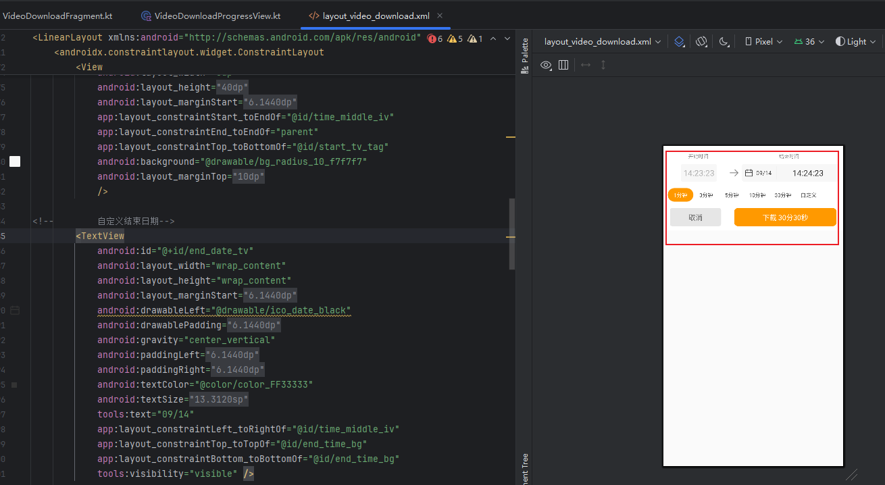

[toc]


# 录像下载完整执行流 - 逐步代码追踪教学

> 本文档将带您一步步追踪录像下载从点击按钮到完成的每一行关键代码

------

## 🎯 教学目标

理解录像下载功能的完整代码执行流程，包括：

1. 用户点击下载按钮
2. UI 变化与时间选择
3. 网络请求获取视频URL
4. FFmpeg 下载处理
5. 进度回调更新
6. 下载完成处理

------

## 第一步：用户点击录像下载切换按钮

### 📍 代码位置


VideoActivity.kt:L1812-1818


### 💻 执行代码

```
binding?.videoMendianVideoDownload?.setOnCheckedChangeListener { buttonView, isChecked ->

    if (isChecked) {

        mVideoDownloadFragment?.showOrHideDownLoadView(true)  // 显示下载UI

    } else {

        mVideoDownloadFragment?.showOrHideDownLoadView(false) // 隐藏下载UI

    }

}
```

### 📖 详细讲解

1. **触发时机**：用户**点击**录像下载按钮（toggle button）时触发
2. 参数说明：
   - `buttonView`: 被点击的按钮视图
   - `isChecked`: 按钮是否被选中（true=打开下载UI，false=关闭）
3. 执行逻辑：
   - 如果 isChecked == true：调用showOrHideDownLoadView(true) 显示下载UI
   - 如果isChecked == false：调用showOrHideDownLoadView(false) 隐藏下载UI

------

## 第二步：显示下载UI

### 📍 代码位置

VideoDownloadFragment.kt:L2766-2779

### 💻 执行代码

```
fun showOrHideDownLoadView(toShow: Boolean) {

    if (toShow) {

        // 显示下载UI布局

        binding?.layoutVideoDownloadLayout?.layoutVideoDownloadLayout?.visibility = View.VISIBLE

        // 隐藏POS小票布局

        hidePosLayout()

    } else {

        // 隐藏下载UI布局

        binding?.layoutVideoDownloadLayout?.layoutVideoDownloadLayout?.visibility = View.GONE

        // 根据来源决定是否显示POS小票

        if (Constants.Video.INTENT_FROM_PARK != mfrom && 

            Constants.Video.INTENT_FROM_PROBLEM != mfrom && 

            Constants.Video.INTENT_AI_AUDIT != mfrom) {

            showPosLayout()

        }

    }

}
```

### 📖 详细讲解

1. **下载UI包含的元素**（参考布局文件 layout_video_download.xml）：
   - **开始时间**显示 (`start_tv`)
   - **结束时间**显示 (`end_tv` 和 `end_date_tv`)
   - **时长选择** Radio按钮组（1/3/5/10/30分钟、自定义）
   - **取消按钮** (`video_cancel_btn`)
   - **下载按钮** (`video_download_btn`)
2. 这是UI图
   - 
3. **布局互斥**：
   - 显示下载UI时，隐藏POS小票布局
   - 隐藏下载UI时，根据页面来源（`mfrom`）决定是否显示POS小票

------

## 第三步：用户选择下载时长

### 📍 代码位置

layout_video_download.xml:L149-183

### 💻 布局代码

```
<RadioGroup
    android:id="@+id/layout_video_select_time_group"
    android:orientation="horizontal">
    <RadioButton android:id="@+id/layout_video_select_time_one"
                 android:checked="true"
                 android:text="@string/one_minute" />  <!-- 1分钟 -->

    <RadioButton android:id="@+id/layout_video_select_time_three"
                 android:text="@string/three_minute" /> <!-- 3分钟 -->

    <RadioButton android:id="@+id/layout_video_select_time_five"
                 android:text="@string/five_minute" />  <!-- 5分钟 -->
    

    <RadioButton android:id="@+id/layout_video_select_time_ten"
                 android:text="@string/ten_minute" />   <!-- 10分钟 -->


    <RadioButton android:id="@+id/period_30_rb"
                 android:text="@string/half_hour" />     <!-- 30分钟 -->

    
    <RadioButton android:id="@+id/period_handle_rb"
                 android:text="@string/workcircle_report_custom" /> <!-- 自定义 -->
</RadioGroup>
```

### 📖 详细讲解

1. **默认时长**：默认选中1分钟 (`android:checked="true"`)

2. 时长选项：

   - 固定时长：1/3/5/10/30分钟
   - 自定义：用户可以手动选择开始和结束时间（最长30分钟）

3. 关键变量（在VideoDownloadFragment中）：

   ```
   private var selectMinutes = 1  // 选中的时长（分钟）
   
   // selectMinutes = -1 表示自定义时长
   
   private var mAlongTime: Long = 0  // 实际下载时长（秒）
   ```

------

## 第四步：计算下载时间范围

### 📍 代码位置

VideoDownloadFragment.kt:L2644-2663

### 💻 执行代码

```
fun changeSelectTime(time: String?) {

    KLog.i(TAG, "changeSelectTime time :#$time")

    if (time != null) {
        // 1. 记录下载开始时间 (格式: "2025-12-01 10:12:55")
        downloadStartTime = time

        // 2. 提取时分秒部分 "HH:mm:ss"
        val hms = time.subSequence(11, time.length)  // "10:12:55"
        
        // 3. 更新UI显示
        binding?.layoutVideoDownloadLayout?.startTv?.text = hms   // 开始时间显示
        binding?.btvTimeSelect?.text = hms                        // 快捷时间选择显示
        binding?.layoutVideoProgressView?.setStartTime(time)      // 进度条开始时间

        // 4. 开启时间条自动移动
        binding?.timeBarView?.openMove()
    }

    

    // 5. 计算并设置结束时间
    setDownloadEndTime()

    // 6. 更新快进按钮状态
    updateForwardEnable()

}
```

### 📍 计算结束时间

VideoDownloadFragment.kt:L2668-2713

```
private fun setDownloadEndTime() {

    // 根据选中的时长计算结束时间

    var endTime = this.downloadStartTime?.let {
        DateChangeUtils.addMinute(it, selectMinutes)
    }

    downloadStartTime?.let {
        if (selectMinutes == -1) {  // 自定义时长

            // 使用用户设定的自定义时长

            val newTime = zeroTimeFormat.parse(downloadStart Time).time + mAlongTime * 1000
            endTime = DateChangeUtils.getTime(Date(newTime))
            endCalendar.time = Date(newTime)
        } else {  // 固定时长 (1/3/5/10/30分钟)

            // 开始时间 + 选择的分钟数
            val newTime = zeroTimeFormat.parse(downloadStartTime).time + selectMinutes * 60 * 1000
            endCalendar.time = Date(newTime)
        }

        

        // 显示结束日期和时间

        if (endTime?.length ?: 0 > 10) {

            binding?.layoutVideoDownloadLayout?.endDateTv?.text = 

                endTime?.subSequence(5, 10)?.replace(Regex("-"), "/")  // "12/01"

            endTime = endTime?.substring(11)  // "HH:mm:ss"

        }

        binding?.layoutVideoDownloadLayout?.endTv?.text = endTime  // 显示结束时间

        

        // 计算总下载秒数

        if (selectMinutes == -1) {

            mAlongTime = (endCalendar.timeInMillis - startCalendar.timeInMillis) / 1000

        } else {

            mAlongTime = (selectMinutes * 60).toLong()

        }

        

        // 更新下载按钮文本 "下载 3分30秒"

        updateDownloadText()

    }

}
```

### 📖 详细讲解

**时间计算流程**：

1. **获取开始时间**：从录像条当前位置获取（`downloadStartTime`）
2. 计算结束时间：
   - **固定时长**：`结束时间 = 开始时间 + selectMinutes分钟`
   - **自定义时长**：`结束时间 = 开始时间 + mAlongTime秒`
3. **时长限制**：最大30分钟（1800秒）
4. **UI更新**：显示开始时间、结束时间、下载时长

**关键变量**：

```
downloadStartTime = "2025-12-01 10:12:55"  // 开始时间
selectMinutes = 3                           // 选择3分钟
mAlongTime = 180                            // 180秒 = 3分钟
endCalendar.time = "2025-12-01 10:15:55"   // 结束时间
```

------

## 第五步：用户点击"下载"按钮

### 📍 按钮注册监听器

VideoDownloadFragment.kt:L790

```
binding?.layoutVideoDownloadLayout?.videoDownloadBtn?.setOnClickListener(this)
```

### 📍 onClick处理方法

VideoDownloadFragment.kt:L1416-1430

### 💻 执行代码

```
override fun dealClickAction(view: View) {

    when (view.id) {

        R.id.video_download_btn -> {  // 下载按钮点击
            // 1. 防抖处理（600ms内重复点击无效）
            if (CommonUtils.isFastRepeatClick(600, TAG)) {
                return
            }         

            // 2. 权限检查：是否有录像下载权限

            if (!LoginUtils.isPrivileges(Constants.Privilege.RECORD_DOWNLOAD)) {
                CommonUtils.showToast(activity, getString(R.string.privileges_none))
                return
            }

            // 3. 存储权限检查
            if (PermissionUtil.instance?.requestStorageComm(mActivity) != true) {
                ToastUtil.showToast(requireActivity(), R.string.no_permission_r_w)
            } else {
                // 4. 所有检查通过，开始下载
                startDownload()
            }

        }

    }

}
```

### 📖 详细讲解

**执行检查顺序**：

1. ✅ **防抖检查**：防止用户快速重复点击
2. ✅ **业务权限检查**：用户是否有`RECORD_DOWNLOAD`权限
3. ✅ **系统权限检查**：App是否有存储读写权限
4. ✅开始下载：调用startDownload()方法

如果任何一步检查失败，都会终止流程并提示用户。

------

## 第六步：startDownload() - 准备下载

### 📍 代码位置

VideoDownloadFragment.kt:L1546-1752

### 💻 执行代码

```
private fun startDownload() {

    KLog.i(TAG, "startDownload()~")

    // 1. 检查是否已有下载任务在执行
    if (ServiceUtils.isServiceWorking(requireContext(), DownloadVideoService::class.java)) {

        // 提示用户已有下载任务，询问是否查看
        AlertDialog.Builder(activity)
            .setTitle(R.string.prompt)
            .setMessage(R.string.download_waiting)  // "已有下载任务，请取消后下载"
            .setNegativeButton(R.string.cancel) { dialog, which -> dialog.dismiss() }
            .setPositiveButton(R.string.device_see) { dialog, which ->
                dialog.dismiss()
                DownloadVideoService.floatViewClick()  // 打开浮窗查看下载进度
            }.show()

        return

    }


    // 2. 检查是否有开始时间
    if (binding?.layoutVideoDownloadLayout?.startTv?.text == null) {
        initDialog()
        mDialogBuilder?.setMessage(R.string.video_no_start_time)
            ?.setNegativeButton("", null)
            ?.setPositiveButton(R.string.commit) { dialog, which -> dialog.dismiss() }
            ?.show()

        return
    }    

    // 3. 准备下载参数
    if (mDeviceData != null) {
        // 计算视频总时长（秒）
        if (selectMinutes == -1) {  // 自定义时长
            mAlongTime = (endCalendar.timeInMillis - startCalendar.timeInMillis) / 1000
        } else {  // 固定时长
            mAlongTime = (selectMinutes * 60).toLong()
        }

        // 设置进度View的下载时长
        binding?.layoutVideoProgressView?.setAlongTime(mAlongTime)

        // 计算结束时间字符串
        var endDate = DateChangeUtils.StringToString(
            DateUtils.getDateTime(endCalendar.timeInMillis),
            DateChangeUtils.DateStyle.YYYY_MM_DD
        )

        val endTime = endDate + " ${binding?.layoutVideoDownloadLayout?.endTv?.text.toString()}"

        KLog.i(TAG, "start download ~ alongTime:$mAlongTime , endTime:$endTime")

        // 4. 设置VideoInfoCache（下载信息缓存）
        binding?.layoutVideoProgressView?.setVideoInfoCache(
            userId, mDeviceData?.depId, "",
            mDeviceData?.id, mDeviceData?.name, downloadStartTime, mAlongTime.toInt(), 0
        )

        

        // 5. 根据设备类型选择下载方式
        if (VideoViewUtils.isEZUIPlayerPart(mDeviceData?.thirdpartType ?: "")) {    
            // 萤石设备：使用萤石SDK下载
            
            startDownloadEZVideo(mDeviceRecordInfo)            
        } else if (VideoViewUtils.isLCUIPlayerPart("${mDeviceData?.thirdpartType}")) {

            // 乐橙设备：使用乐橙SDK下载
            LCOpenSDK_Download.startDeviceDownload(mDownloadParameter)
        } else {

            // 6. 普通设备：调用标准下载流程
            binding?.layoutVideoProgressView?.startRecReqPlay(
                activity,
                this,
                mDeviceData?.id,
                downloadStartTime,
                endTime,
                isCloudRecord  // 是否云端录像
            )

        }

    }

}
```

### 📖 详细讲解

**下载前检查**：

1. ✅ **并发检查**：确保同时只有一个下载任务
2. ✅ **参数检查**：确保有开始时间
3. ✅ **设备检查**：确保设备信息存在

**关键参数准备**：

```
downloadStartTime = "2025-12-01 10:12:55"  // 开始时间

endTime = "2025-12-01 10:15:55"            // 结束时间

mAlongTime = 180L                            // 总时长180秒

userId = "xxx"                               // 用户ID

deviceId = "xxx"                             // 设备ID
```

**设备类型判断**：

- **萤石设备**：调用萤石SDK的`EZDeviceStreamDownload`
- **乐橙设备**：调用乐橙SDK的`LCOpenSDK_Download`
- **普通设备**：调用标准OVO平台下载流程（最常见）

------

## 第七步：网络请求获取视频URL

### 📍 代码位置

VideoDownloadProgressView.kt:L337-409

### 💻 执行代码

```
fun startRecReqPlay(

    activity: Activity?, 

    httpCycleContext: HttpCycleContext?, 

    deviceId: String?, 

    startTime: String?, 

    endTime: String?,

    isCloudRecord: Boolean? = null

) {

    // 1. 校验VideoInfoCache

    if (mVideoInfoCache == null) {

        if (activity != null) {

            ToastUtil.showToast(activity, R.string.video_download_error_invalid)

        }

        return

    }

    

    // 2. 构建网络请求参数

    val params = OkHttpRequestParams(activity as HttpCycleContext?)

    val jsonObject = JSONObject()

    jsonObject["deviceId"] = deviceId

    jsonObject["startTime"] = startTime   // "2025-12-01 10:12:55"

    jsonObject["endTime"] = endTime       // "2025-12-01 10:15:55"

    

    // 云录像标识

    if (isCloudRecord == true) {

        jsonObject["isCloudRecord"] = 1

        jsonObject["playCloudMediaFlag"] = 1

    }

    params.applicationJson(jsonObject)

    

    // 3. 发起网络请求

    OkHttpApiManager.Builder()

        .setUrl(DataManager.Urls.START_RECREQ_PLAY)  // "ovopark-device/video/downloadVideo"

        .setParams(params)

        .setCallback(object : StringHttpRequestCallback() {

            override fun onSuccess(result: String?) {

                super.onSuccess(result)

                try {

                    val jsonObject = org.json.JSONObject(result)

                    

                    // 4. 解析响应数据

                    if (null != jsonObject && !jsonObject.optBoolean("isError")) {

                        val data = jsonObject.optJSONObject("data")

                        if (null != data) {

                            // 解析视频下载URL信息

                            val videoDownLoadResult = JSONObject.parseObject(

                                data.toString(), 

                                VideoDownLoadResult::class.java

                            )

                            

                            callback!!.onGetUrlSuccess(videoDownLoadResult)

                            

                            // 5. 判断视频编码格式

                            val isH265 = videoDownLoadResult.isH265

                            

                            // 准备缓存路径（用于添加水印）

                            val cachePath = Constants.Path.DOWNLOAD_VIDEO_PATH + 

                                VideoUtils.getSaveVideoTempPath(

                                    System.currentTimeMillis(), 

                                    mVideoInfoCache!!.userId, 

                                    deviceId!!

                                )

                            mVideoInfoCache?.cachePath = cachePath

                            

                            if (isH265) {

                                val name = VideoUtils.getSaveVideoPath(

                                    System.currentTimeMillis(), 

                                    mVideoInfoCache!!.userId, 

                                    deviceId!!

                                )

                                val path = Constants.Path.DOWNLOAD_VIDEO_PATH + name

                                FileUtil.checkFileDirectorySafe(path)

                                mVideoInfoCache?.name = name

                                mVideoInfoCache?.path = path

                            }

                            

                            // 6. 选择视频URL（优先级：fmp4 > rtsp/flv）

                            var url = videoDownLoadResult.fmp4

                            if (url?.isEmpty() == true) {

                                url = if (isH265) 

                                    videoDownLoadResult.rtsp 

                                else 

                                    videoDownLoadResult.url

                            }

                            

                            // 7. 启动下载服务

                            val bundle = Bundle()

                            bundle.putString(Constants.Prefs.TRANSIT_MSG, url)

                            bundle.putBoolean(Constants.Prefs.EXTRA_INTENT_H265, isH265)

                            bundle.putParcelable(Constants.Prefs.TRANSIT_DATA, mVideoInfoCache)

                            

                            KLog.i(TAG, "video download path:${mVideoInfoCache?.path}")

                            

                            // 启动DownloadVideoService

                            ServiceUtils.startService(

                                context, 

                                DownloadVideoService::class.java, 

                                bundle

                            )

                        } else {

                            callback!!.onGetUrlError(null, null)

                        }

                    } else {

                        val msg = jsonObject.optString("message")

                        callback?.onGetUrlError(

                            RetrofitConstant.ERROR_RESPONSE_DATA_PARSE_EXCEPTION.toString(), 

                            msg

                        )

                    }

                } catch (e: JSONException) {

                    e.printStackTrace()

                }

            }

        }).build().start()

}
```

### 📖 详细讲解

**网络请求**：

- **接口**: `ovopark-device/video/downloadVideo`

- **方法**: POST

- 参数:

  ```
  {
  
    "deviceId": "4925961",
  
    "startTime": "2025-12-01 10:12:55",
  
    "endTime": "2025-12-01 10:15:55",
  
    "isCloudRecord": 1  // 可选，云录像标识
  
  }
  ```

**响应数据结构**（对应日志第2行）：

```
{

  "isError": false,

  "data": {

    "url": "http://14.103.133.95:5581/rtsp/xxx.flv",      // FLV流地址

    "rtsp": "rtsp://14.103.133.95:5555/rtsp/xxx",         // RTSP流地址

    "fmp4": "http://14.103.133.95:7781/rtsp/xxx.mp4",     // MP4流地址

    "tlsFmp4": "https://...xxx.mp4",                       // HTTPS MP4

    "flv": "http://14.103.133.95:5581/rtsp/xxx.flv",

    "tlsflv": "https://...xxx.flv",                        // HTTPS FLV

    "vencodingName": "H264",                               // 视频编码

    "dtype": 21

  },

  "code": "0",

  "message": "SUCCESS"

}
```

**URL选择优先级**：

1. **优先使用** `fmp4`（MP4格式URL）
2. **H265编码** 使用 `rtsp`
3. **其他情况** 使用 `url`/`flv`

------

## 第八步：启动下载服务 DownloadVideoService

### 📍 代码位置

DownloadVideoService.kt:L292-339

### 💻 执行代码

```
override fun onHandleIntent(intent: Intent?) {

    KLog.i(TAG,"onHandleIntent()~")

    if (intent != null) {

        // 1. 获取传递的参数

        mVideoInfoCache = intent.getParcelableExtra(Constants.Prefs.TRANSIT_DATA)

        val url = intent.getStringExtra(Constants.Prefs.TRANSIT_MSG)

        cloudVideo = intent.getBooleanExtra(Constants.Prefs.TRANSIT_BOOLEAN, false)

        isH265 = intent.getBooleanExtra(Constants.Prefs.EXTRA_INTENT_H265, isH265)

        startTime = intent.getStringExtra(EXTRA_START_TIME)

        endTime = intent.getStringExtra(EXTRA_END_TIME)

        isPicToVideo = intent.getBooleanExtra(EXTRA_PIC_TO_VIDEO, false)

        

        // 2. 参数校验

        if (mVideoInfoCache == null || url == null || mVideoInfoCache?.path == null) {

            EventBus.getDefault().post(VideoDownloadActionEvent(-1, isBackground))

            return

        }

        path = mVideoInfoCache?.path

        

        KLog.i(TAG,"onHandlerIntent~video cachePath:${mVideoInfoCache?.cachePath}")

        

        // 3. 根据录像类型选择下载方式

        if (cloudVideo) {

            // 云录像：使用流利说HTTP下载库

            try {

                latch = CountDownLatch(1)

                downloadFileWithLLS(url, path)

                latch?.await()

            } catch (e: Exception) {

                e.printStackTrace()

            }

        } else {

            // SD卡录像：使用FFmpeg下载

            // 估算文件大小（用于进度计算）

            totalSize = when (mVideoInfoCache?.alongTime) {

                1 * 60 -> (3 * 1024 * 1024).toDouble()    // 1分钟 ≈ 3MB

                5 * 60 -> (14 * 1024 * 1024).toDouble()   // 5分钟 ≈ 14MB

                10 * 60 -> (32 * 1024 * 1024).toDouble()  // 10分钟 ≈ 32MB

                else -> 0.2 * 1024 * 1024

            }

            

            KLog.w(TAG,"create new download file:$path")

            try {
                latch = CountDownLatch(1)

                // 核心：调用FFmpeg下载
                downloadFileWithFFmpeg(url, mVideoInfoCache?.path)

                latch?.await()

            } catch (e: Exception) {

                e.printStackTrace()

            }

        }

    }

}
```

### 📖 详细讲解

**下载服务是IntentService**：

- 在后台线程执行，不阻塞主线程
- 自动管理生命周期，下载完成后自动停止
- 使用`CountDownLatch`确保下载完成前服务不退出

**两种下载方式**：

1. 云录像 →

   downloadFileWithLLS()

   使用流利说HTTP下载库

2. SD卡录像→

   downloadFileWithFFmpeg()

   使用FFmpeg下载（最常见）

------

## 第九步：FFmpeg 下载执行

### 📍 代码位置

DownloadVideoService.kt:L461-588

### 💻 执行代码

```
private fun downloadFileWithFFmpeg(urlStr: String, path: String?) {

    KLog.i(TAG,"downloadFileWithFFmpeg($urlStr->$path)")

    if (path != null) {

        // 1. 检查是否开启水印

        val isWaterOpen = (WaterMarkUtils.getChildrenBean(

            WaterMarkUtils.VIDEO_DOWNLOAD_WATER_MARK, 

            AppDataAttach.cacheWatermark

        ) != null)

        KLog.i(TAG,"isWaterOpen~:$isWaterOpen, urlStr:$urlStr")

        

        // 2. 根据URL后缀判断视频格式

        if (urlStr.endsWith(".mp4")) {

            // MP4 → MP4 直接下载

            isComplete = false

            var commands = FFWdzUtil.buildMp42Mp4(

                urlStr, 

                if(isWaterOpen) mVideoInfoCache?.cachePath else path

            )

            KLog.d(TAG, "MP4下载 cmd: ${commands.joinToString()}")

            

            // 3. 调用FFmpegUtil入队任务

            FFmpegUtil.getInstance().enQueueTask(

                commands, 

                (mVideoInfoCache!!.alongTime * 1000 * 95 / 100).toLong(),  // 超时时间

                object : onCallBack {

                    override fun onStart() {

                        KLog.i(TAG, "onStart()")

                    }

                    

                    override fun onFailure() {

                        KLog.i(TAG, "onFailure()")

                        updateProgress(-1)

                        EventBus.getDefault().post(

                            VideoDownloadActionEvent(-1, isBackground)

                        )

                        stopSelf()

                    }

                    

                    override fun onComplete() {

                        KLog.i(TAG, "onComplete()")

                        if (!isWaterOpen) {

                            // 无水印：直接完成

                            isComplete = true

                            if (mVideoInfoCache != null) {

                                mVideoInfoCache?.downloadTime = System.currentTimeMillis()

                            }

                            VideoUtils.updateMedia(

                                AppDataAttach.getApplicationContext(), 

                                mVideoInfoCache!!.path

                            )

                            saveVideoThumb()  // 保存视频缩略图

                            releaseLatch()

                        } else {

                            // 有水印：还需添加水印处理（90%-100%）

                            mProgress = 90

                            KLog.i(TAG,"下载完成准备添加水印~")

                            scope.launch {

                                addWaterWithFFmpeg(mVideoInfoCache?.cachePath!!, path)

                            }

                        }

                    }

                    

                    override fun onProgress(progress: Float) {

                        var currentProgress = (progress * 100).toInt()

                        KLog.i(TAG, "onProgress()#$progress, currentProgress:$currentProgress")

                        

                        if (currentProgress > old && !isComplete) {

                            // 水印模式：最多显示99%

                            if (isWaterOpen && currentProgress >= 99) {

                                currentProgress = 99

                            }

                            

                            // 发送进度事件

                            EventBus.getDefault().post(

                                VideoDownloadActionEvent(currentProgress, isBackground)

                            )

                            updateProgress(currentProgress)

                            

                            // 更新进度UI

                            mCircleProgressView?.progress = currentProgress

                            downloadProgressView?.setProgressBar(currentProgress)

                        }

                        old = currentProgress.toLong()

                    }

                }

            )

            

        } else if (urlStr.endsWith(".flv") || urlStr.contains(".flv?")) {

            // FLV → MP4 转码下载

            isComplete = false

            var commands = FFmpegFactory.buildFlv2Mp4(

                urlStr, 

                if(isWaterOpen) mVideoInfoCache?.cachePath else path

            )

            KLog.d(TAG, "FLV->MP4下载 cmd: ${commands.joinToString()}")

            

            // 入队FFmpeg任务（回调逻辑同上）

            FFmpegUtil.getInstance().enQueueTask(

                commands,

                (mVideoInfoCache!!.alongTime * 1000 * 95 / 100).toLong(),

                object : onCallBack {

                    // ... 相同的回调处理

                }

            )

        }

    }

}
```

### 📖 详细讲解

**FFmpeg命令构建**：

- **MP4 → MP4**: `["ffmpeg", "-i", "input.mp4", "-c", "copy", "output.mp4"]`
- **FLV → MP4**: `["ffmpeg", "-i", "input.flv", "-c:v", "libx264", "output.mp4"]`

**超时时间计算**：

```
timeout = alongTime * 1000 * 95 / 100

// 例如：3分钟 = 180秒

timeout = 180 * 1000 * 0.95 = 171000ms = 171秒
```

设置为95%是为了留有余地，防止正常下载被误判超时。

**进度回调机制**（对应日志第5-70行）：

```
FFmpegCmd.onProgress(原始值)  → 6.3E-5, 12.259063, 29.390062, 41.810062

        ↓

FFmpegUtil.onProgress(格式化) → 处理数据

        ↓  

Handler切换到主线程

        ↓

转换为百分比进度  → 0.0001%, 20.43%, 48.98%, 69.68%

        ↓

UI更新 (EventBus)
```

**水印处理**：

- **开启水印**：先下载到`cachePath`，然后添加水印到最终`path`
- **无水印**：直接下载到最终`path`

------

## 第十步：下载完成处理

### 📍 onComplete回调


DownloadVideoService.kt:L461-588


### 💻 执行代码

```
override fun onComplete() {

    KLog.i(TAG, "onComplete()")  // 对应日志第64行

    

    if (!isWaterOpen) {

        // 1. 标记下载完成

        isComplete = true

        

        // 2. 记录下载完成时间

        if (mVideoInfoCache != null) {

            mVideoInfoCache?.downloadTime = System.currentTimeMillis()

        }

        

        // 3. 更新媒体库（让系统相册能看到视频）

        VideoUtils.updateMedia(

            AppDataAttach.getApplicationContext(), 

            mVideoInfoCache!!.path

        )

        

        // 4. 保存视频缩略图

        saveVideoThumb()

        

        // 5. 释放CountDownLatch，允许Service结束

        releaseLatch()

        

        // 6. 发送100%完成事件

        EventBus.getDefault().post(

            VideoDownloadActionEvent(100, mVideoInfoCache?.path, false)

        )

    } else {

        // 有水印：执行水印添加（90%-100%）

        mProgress = 90

        scope.launch {

            addWaterWithFFmpeg(mVideoInfoCache?.cachePath!!, path)

        }

    }

}
```

### 📖 详细讲解

**下载完成后的处理流程**：

1. **保存视频缩略图** (`saveVideoThumb()`)

   ```
   // 从视频中提取第一帧作为缩略图
   
   val picUrl = Constants.Path.BASE_VIDEO_PIC_PATH + System.nanoTime() + ".jpg"
   
   videoInfoCache.picUrl = picUrl
   
   StorageUtils.saveBitmap(picUrl, VideoUtils.getVideoThumbnail(videoInfoCache.path))
   ```

2. **保存到数据库**（在

   

   VideoDownloadFragment

   的EventBus监听中）

   

   ```
   DbService.getInstance(context).insertVideoInfoCache(videoInfoCache)
   ```

3. **更新媒体库**

   ```
   VideoUtils.updateMedia(context, videoPath)
   
   // 让系统相册能识别到新下载的视频
   ```

4. **发送完成事件**

   ```
   EventBus.getDefault().post(VideoDownloadActionEvent(100, path, false))
   ```

**文件存储位置**：

```
path = "/storage/emulated/0/Android/data/com.kedacom.ovopark/files/video/xxx.mp4"

cachePath = "/storage/emulated/0/Android/data/com.kedacom.ovopark/files/video/cache_xxx.mp4"
```

------

## 🎯 完整流程总结

### 执行链路图

```
用户点击录像下载按钮

       ↓

videoMendianVideoDownload.setOnCheckedChangeListener (VideoActivity)

       ↓

showOrHideDownLoadView(true) (VideoDownloadFragment)

       ↓

用户选择时长 (1/3/5/10/30分钟 or 自定义)

       ↓

changeSelectTime() + setDownloadEndTime() 计算时间范围

       ↓

用户点击"下载"按钮

       ↓

dealClickAction() → 权限检查 (VideoDownloadFragment)

       ↓

startDownload() 准备下载参数

       ↓

startRecReqPlay() 发起网络请求 (VideoDownloadProgressView)

       ↓

POST /ovopark-device/video/downloadVideo

       ↓

获取视频URL (flv/mp4/rtsp)

       ↓

启动 DownloadVideoService 后台服务

       ↓

downloadFileWithFFmpeg() 执行下载

       ↓

FFmpegUtil.enQueueTask() 入队FFmpeg任务

       ↓

onProgress() 进度回调 → UI更新 (0%-100%)

       ↓

onComplete() 下载完成

       ↓

保存缩略图 + 更新媒体库 + 数据库记录
```

### 关键时间节点（参考日志）

| 时间         | 事件         | 说明                                   |
| :----------- | :----------- | :------------------------------------- |
| 10:12:55.588 | 发起网络请求 | `sendRequestRaw:downloadVideo?`        |
| 10:12:55.949 | 收到响应     | 获取视频URL                            |
| 10:12:56.013 | FFmpeg入队   | `enQueueTask()`                        |
| 10:12:56.013 | 开始执行     | `exec() ~FFmpegCmd.exec`               |
| 10:12:57.412 | 首次进度     | `onProgress # 6.3E-5` (0.0001%)        |
| 10:12:57.907 | 进度更新     | `onProgress # 12.259063` (20.43%)      |
| 10:12:59.478 | 进度更新     | `onProgress # 29.390062` (48.98%)      |
| 10:13:20.654 | 下载完成     | `onComplete ()# action done!` (69.68%) |

**总耗时**: 约 25秒（对应日志中的录像时长）

------

## 📝 学习总结

通过这个完整的代码追踪，您现在应该理解了：

1. ✅ **UI交互流程**：从按钮点击到UI变化的完整链路
2. ✅ **参数计算逻辑**：如何计算开始时间、结束时间和总时长
3. ✅ **权限检查机制**：业务权限和系统权限的双重校验
4. ✅ **网络请求流程**：接口调用、参数构建、响应解析
5. ✅ **下载服务架构**：IntentService后台执行、CountDownLatch同步
6. ✅ **FFmpeg使用方式**：命令构建、任务入队、回调处理
7. ✅ **进度回调机制**：从底层到UI的三层回调传递
8. ✅ **文件存储管理**：路径生成、缓存处理、水印添加
9. ✅ **完成后处理**：缩略图保存、媒体库更新、数据库记录

**恭喜！您已经完全掌握了录像下载的完整执行流程！** 🎉