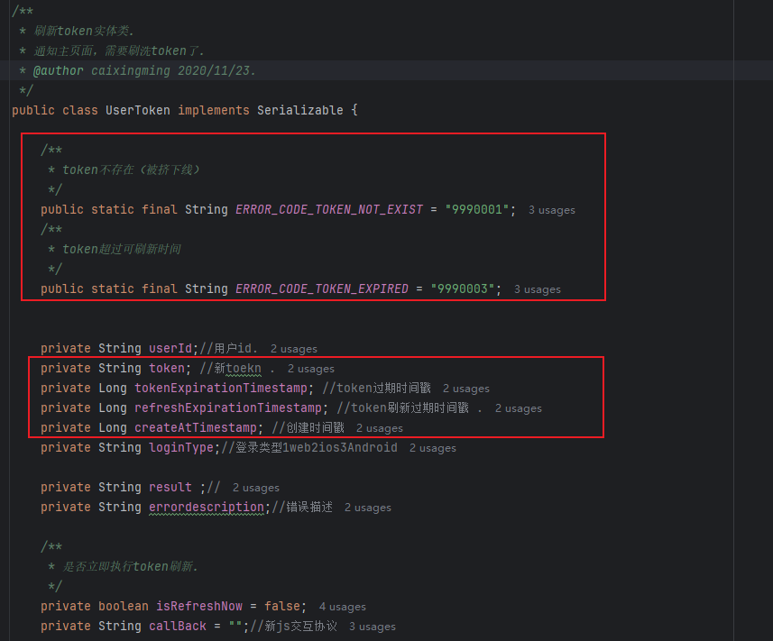
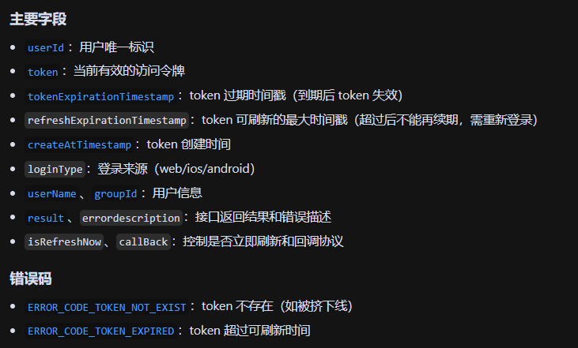
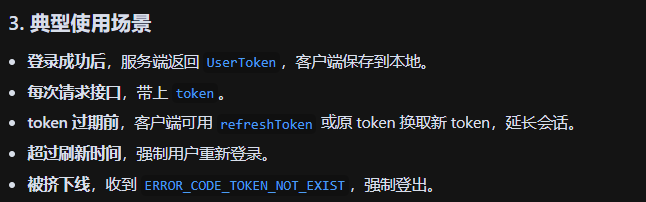
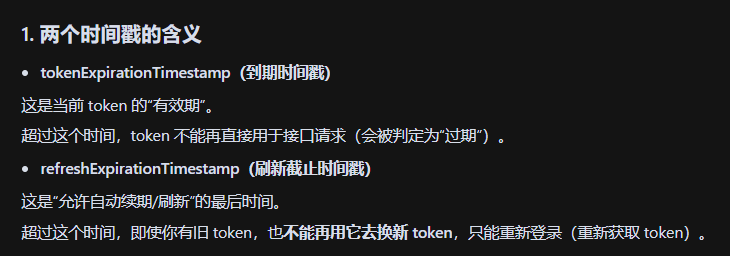
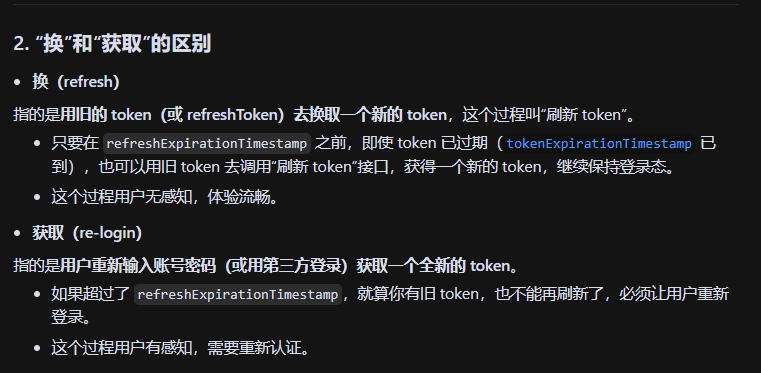

- 
- 
- 

怎么理解：token 过期前，客户端可用 refreshToken 或原 token 换取新 token，延长会话。  现在有两个时间戳，一个是到期时间戳，一个是刷新截止时间戳，在刷新截止时间戳之前可以执行：到期时间戳到期后去换新的token。而如果刷新截止时间戳到期，那么无法去换新的token，只能重新获取token？  这个换和获取是什么意思？

- 

- 

- 为什么要这样设计？

  - 安全性：防止用户长期不登录，token 一直自动续期，增加被盗用风险。

  - 体验：允许短期内自动续期，减少频繁登录，但长期还是要重新认证。

- \> “换”是自动续期，无感知；“获取”是重新登录，有感知。两个时间戳共同保证了安全和体验的平衡。

