[toc]

## 前言

> 学习要符合如下的标准化链条：了解概念->探究原理->深入思考->总结提炼->底层实现->延伸应用"

## 01.学习概述

- **学习主题**：ovopark启动流程快速走一遍
- **知识类型**：
  - [ ] **知识类型**：
    - [ ] ✅Android/ 
      - [ ] ✅01.基础组件
      - [ ] ✅02.IPC机制
      - [ ] ✅03.消息机制
      - [ ] ✅04.View原理
      - [ ] ✅05.事件分发机制
      - [ ] ✅06.Window
      - [x] ✅07.复杂控件
      - [ ] ✅08.性能优化
      - [ ] ✅09.流行框架
      - [ ] ✅10.数据处理
      - [ ] ✅11.动画
      - [ ] ✅12.Groovy
    - [ ] ✅音视频开发/
      - [ ] ✅01.基础知识
      - [ ] ✅02.OpenGL渲染视频
      - [ ] ✅03.FFmpeg音视频解码
    - [ ] ✅ Java/
      - [ ] ✅01.基础知识
      - [ ] ✅02.Java设计思想
      - [ ] ✅03.集合框架
      - [ ] ✅04.异常处理
      - [ ] ✅05.多线程与并发编程
      - [ ] ✅06.JVM
    - [ ] ✅ Kotlin/
      - [ ] ✅01.基础语法
      - [ ] ✅02.高阶扩展
      - [ ] ✅03.协程和流
    - [ ] ✅ ovopark主线/
      - [x] ✅01.启动模块
- **学习来源**：ovopark主线
- **重要程度**：⭐⭐⭐⭐⭐（核心基础）  
- **学习日期**：2025.07.10
- **记录人**：@panruiqi

### 1.1 学习目标

- 了解概念->探究原理->深入思考->总结提炼->底层实现->延伸应用"

### 1.2 前置知识


## 02.核心概念

### 2.1 是什么？

快速掌握ovopark的大致启动流程


### 2.2 解决什么问题？

对启动流程整体脉络有一个印象

### 2.3 基本特性


## 03.原理机制

### 3.1 进一步思考

这个项目的入口代码在哪？也就是最开始的启动过程？对应的AndroidManifest在哪？

- 项目的启动入口代码在哪？

  - 主入口Application 是  com.kedacom.ovopark.BaseApplication。
  - 主入口 Activity 是 com.kedacom.ovopark.ui.SplashActivity。
  
- 这是在 ovoparkApp/src/main/AndroidManifest.xml 里通过 <intent-filter> 配置的 MAIN + LAUNCHER，即应用启动时第一个被系统启动的 Activity。
  
-  对应的 AndroidManifest.xml 在哪？

  - 主工程的 AndroidManifest.xml 路径是：ovoparkApp/src/main/AndroidManifest.xml

- 启动流程简述

  - 应用启动时，系统会启动 Application，
  - 然后启动SplashActivity。

  - SplashActivity 负责初始化、处理跳转参数、权限弹窗等，之后会根据业务跳转到主页面或登录等。

### 3.2 进一步思考

看看AndroidManifest，他做了什么？

总结就一句话：Manifest 主要内容就是：组件声明，权限声明，三方SDK配置

- 权限声明（<uses-permission>、<uses-feature>）

  - 用途：声明应用需要用到的硬件和系统权限。

  - 常见内容：相机、定位、存储、网络、蓝牙、录音、悬浮窗等权限

  - 例如：android.permission.CAMERA、android.permission.ACCESS_FINE_LOCATION、android.permission.INTERNET 等。

  - <uses-feature android:name="android.hardware.camera" /> 表示需要相机硬件。

  > 特别的，这里有通过<queries>声明你的 App 允许查询哪些其他 App 或 Intent，这样可以让你的 App 检查这些三方 App 是否安装，保证分享、跳转、地图导航等功能正常
  >
  > 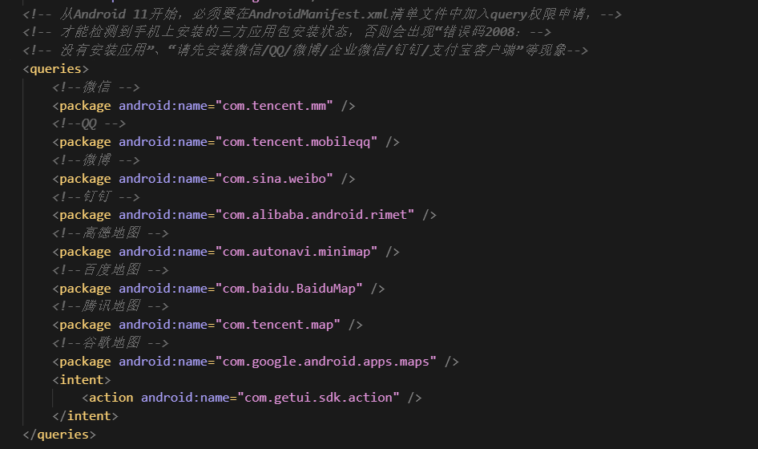

- 组件声明：

  - Application（<application>）

  - Activity 声明（<activity>）

    - 用途：声明所有页面（Activity），并配置其属性。

    - ```
          <activity android:name=".ui.SplashActivity" ...>
              <intent-filter>
                  <action android:name="android.intent.action.MAIN" />
                  <category android:name="android.intent.category.LAUNCHER" />
              </intent-filter>
          </activity>
      ```

  - Service 声明（<service>）

  -  BroadcastReceiver 声明（<receiver>）

  - Provider 声明（<provider>）

- 三方SDK配置

  - 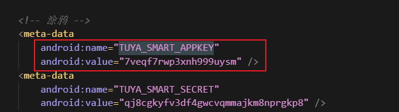
  - 这里的 "7veqf7rwp3xnh999uysm" 是你在涂鸦智能开发者平台注册应用后获得的唯一 AppKey。
  - 这种 <meta-data> 配置通常用于第三方SDK的初始化。

  - 当应用启动或 SDK 初始化时，SDK 会自动从 AndroidManifest.xml 里读取这些 <meta-data>，获取到开发者配置的 key、secret、渠道号等信息。

  - 这样做的好处是不用把敏感信息硬编码在 Java/Kotlin 代码里，而是集中在 Manifest 文件中，便于管理和修改。


### 3.3 进一步思考

Application呢？给我出来，你丫的做了什么？

- BaseApplication 是你项目的全局 Application 类，主要负责编译优化，全局环境搭建和三方SDK和工具初始化。

- 编译优化：

  - BaseApplication继承自 DBApplication， DBApplication 继承自 MultiDexApplication
  - 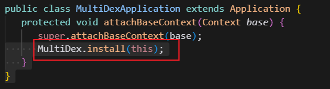
  - Android 应用的 dex 文件（即 Dalvik Executable，包含所有 Java 字节码）有一个 64K 方法数的限制（即单个 dex 文件最多只能包含 65536 个方法）。

  - 当你的项目和依赖库方法数总和超过 64K 时，单个 dex 文件装不下，编译时就会报错。

  - 这时就需要启用 MultiDex，把方法分散到多个 dex 文件中。

- 全局环境搭建

  - 全局变量保存

    - 

  - 注册   Activity 和应用  生命周期监听器

    - 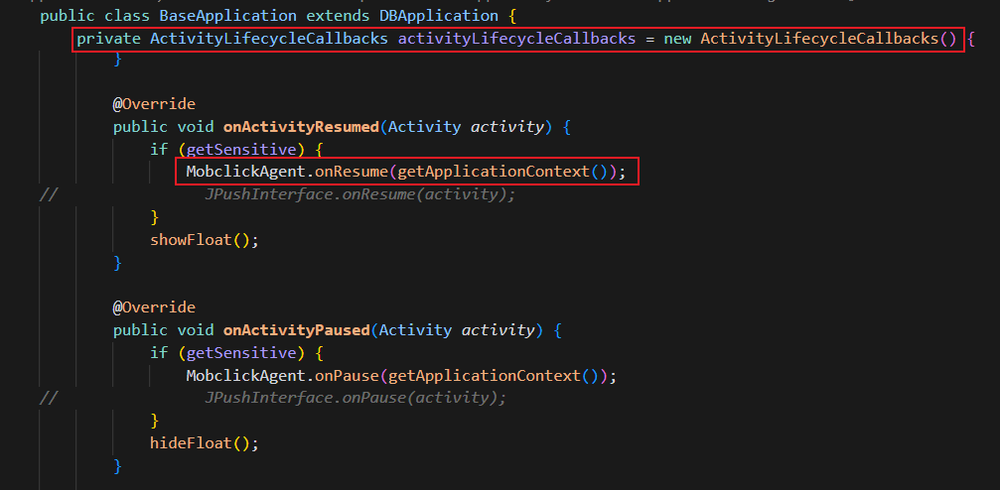
    - onActivityResumed(Activity activity)：当某个 Activity 进入“前台可交互”状态时被调用。
    - onActivityPaused(Activity activity)：当某个 Activity 进入“暂停”状态（即即将失去焦点）时被调用。
  - 如果 getSensitive 为 true，调用友盟统计的 MobclickAgent.onResume()，用于统计页面访问、活跃时长等
    - 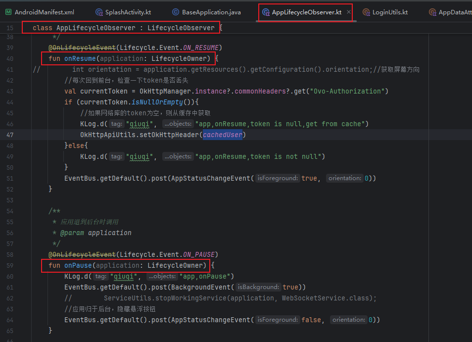
    - 应用归于前台，归于后台时发送对应的事件
    - 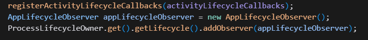

- 三方SDK和工具初始化

  - 数据库环境搭建
    - 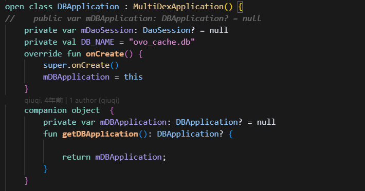
    - 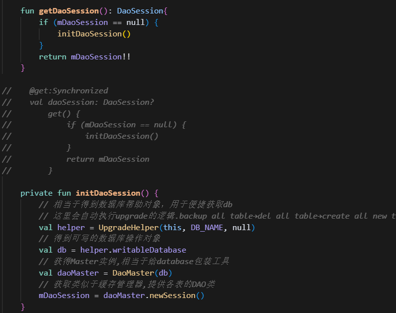
  - 崩溃日志捕获
    - 
  - 初始化 ARouter（路由）、MMKV（高性能 KV 存储）、EasyDataStore、ScheduleConfig
    - 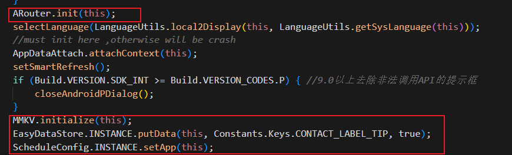
  - 初始化阿里云 OSS、Fresco（图片库）、DownloadManager、VideoCompressManager 等
    - 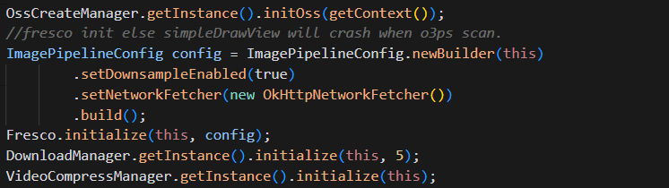
  - 友盟、极光推送等三方服务的预初始化
    - 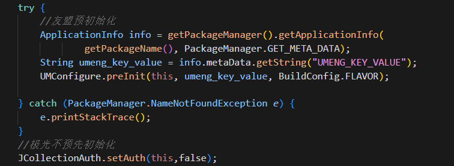
  - 埋点数据清理
    - 

### 3.3 进一步思考

Splash的流程是什么样的？

启动入口：onCreate()中作为应用的第一个页面，负责初始化 UI、解析外部跳转参数（如三方 App/H5/推送等），并在启动后立即进入权限/隐私协议检测流程。

- 初始化UI
  - 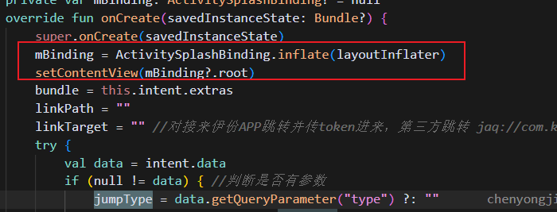
- 解析外部跳转参数
  - 这里从Bundle中取出type赋值给jumpType，然后putString保存一些参数
  - 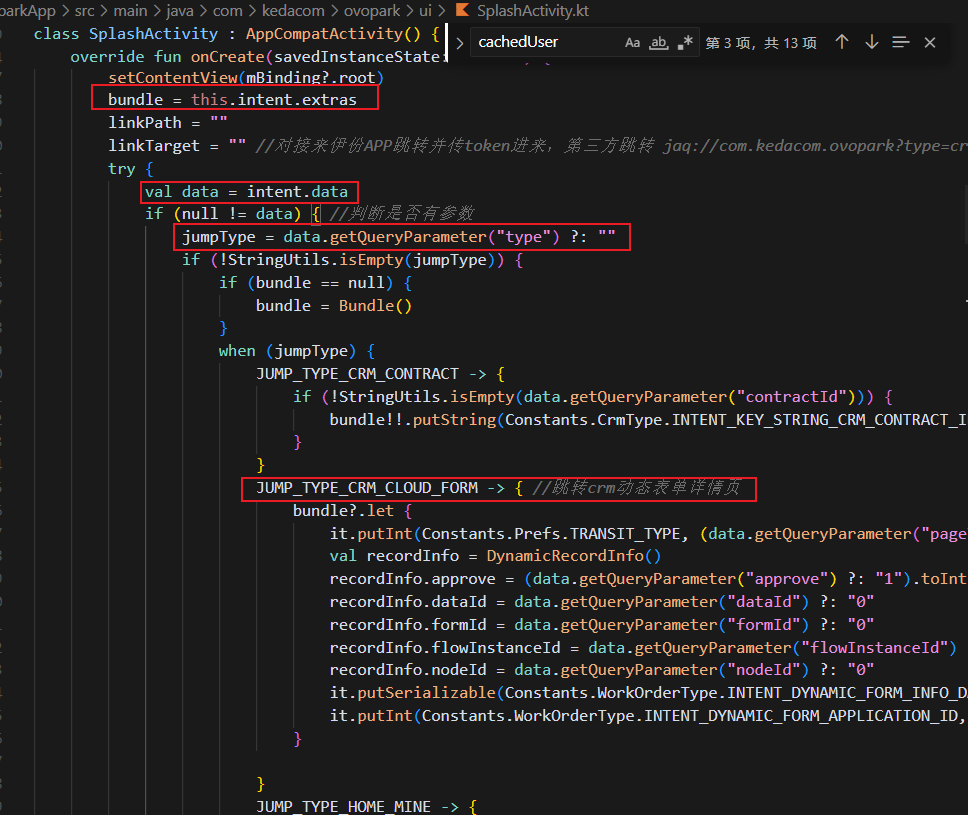
  - 比如：
    - 当外部 URI 的 type 参数为 crm_contract 时（即 JUMP_TYPE_CRM_CONTRACT），
    - 检查 URI 里是否有 contractId 参数，如果有，就把 contractId 放进 bundle，key 是 Constants.CrmType.INTENT_KEY_STRING_CRM_CONTRACT_ID
    - 在 severAddress 逻辑中,如果 type=crm_contract，且 bundle 里有 contractId，最终会跳转到合同详情页面，并把 contractId 传递过去
    - 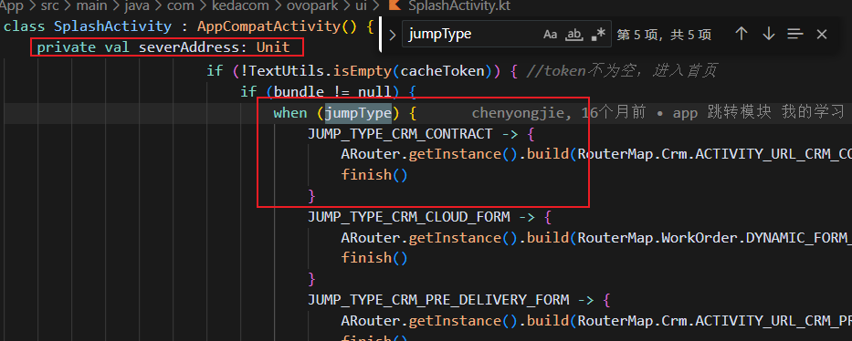

- 解析外部用户信息参数，并刷新用户数据
  - 场景：App 被外部 URI（如 H5、第三方 App、推送等）唤起，URI 里可能带有 userToken、targetJumpTag 等参数
  - 逻辑：
    - 如果 path 是 /jump，则尝试获取 userToken 和 targetJumpTag 参数。
    - userToken：如果有，解析为 UserToken 对象，并调用 updateUserInfo(user)。
    - targetJumpTag：如果有，保存到 linkTarget，用于后续跳转。
    - 如果 path 不是 /jump，但有 query 参数，则直接把 query 解析为 UserToken，并调用 updateUserInfo(user)
  - 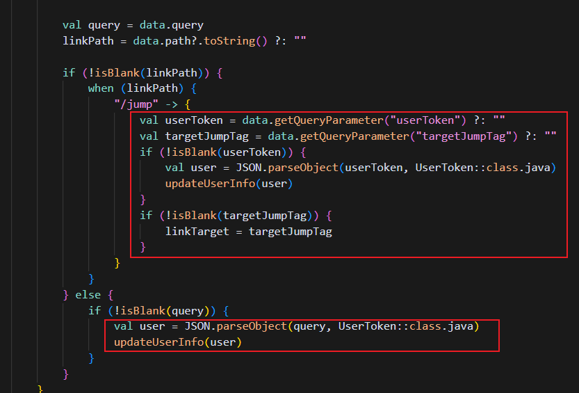
  - 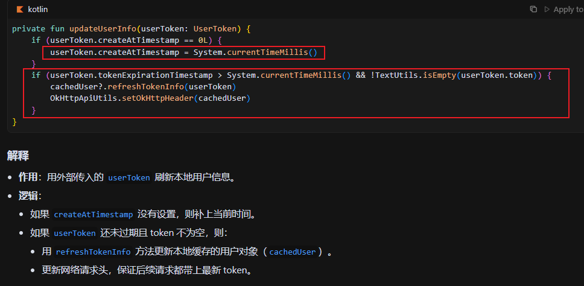

用户隐私授权检测及隐私SDK初始化逻辑

- onCreate中post这个

  - 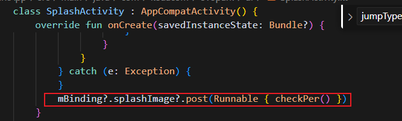

- 对应这个

  - 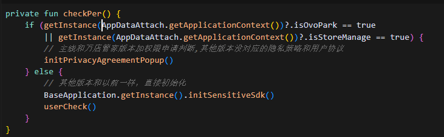
  - 如果是主线或万店管家版本，调用 initPrivacyAgreementPopup()。

  - 该方法会弹出隐私协议弹窗，用户同意后才会继续初始化敏感 SDK 并进入用户校验流程。

  - 如果不是上述两个版本，说明没有隐私协议合规要求，直接初始化敏感 SDK（如统计、推送等），然后进入用户校验流程（userCheck()）。

- initPrivacyAgreementPopup

  - 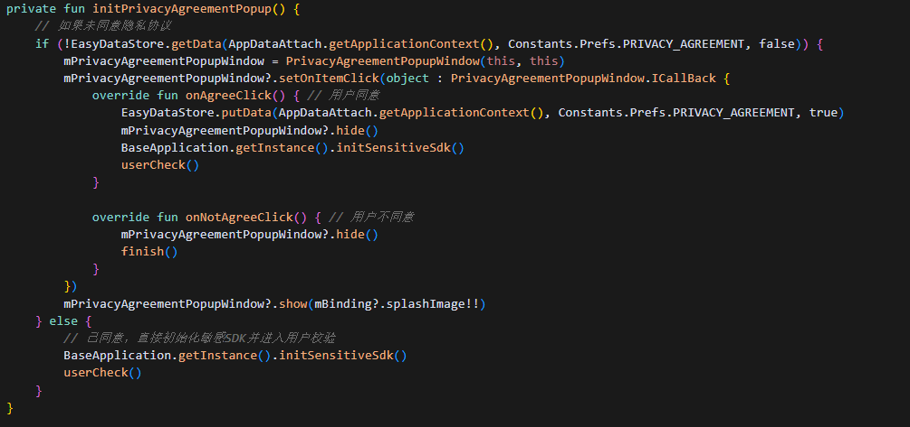
  - 判断是否已同意隐私协议
    - 通过 EasyDataStore 查询本地是否有“已同意隐私协议”的标记（Constants.Prefs.PRIVACY_AGREEMENT）。
    - 如果没有同意，进入弹窗流程。

  - 弹出隐私协议弹窗
    - 创建 PrivacyAgreementPopupWindow 弹窗，并设置回调接口 ICallBack。
    - 弹窗显示在启动页图片上（mBinding?.splashImage!!）。

  - 用户操作回调
    - 同意（onAgreeClick）：
      - 记录同意状态到本地（EasyDataStore.putData(...)）。
      - 隐藏弹窗。
      - 初始化敏感SDK（如统计、推送等）。
      - 进入用户校验流程（userCheck()）。

    - 不同意（onNotAgreeClick）：
      - 隐藏弹窗。
      - 直接关闭当前 Activity（finish()），即退出 App。
    
  - 已同意的情况
    - 如果用户已经同意过隐私协议，直接初始化敏感SDK并进入用户校验流程，无需再弹窗
    - 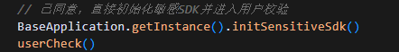

- BaseApplication.getInstance()

  - 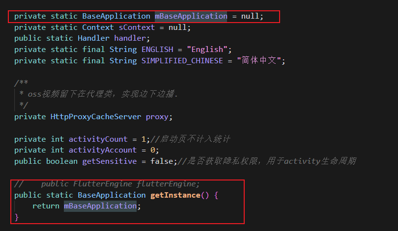
  - 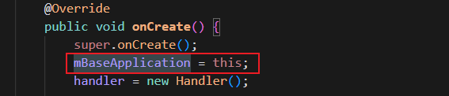

- initSensitiveSdk()

  - 没啥好说的，初始化敏感SDK
  - 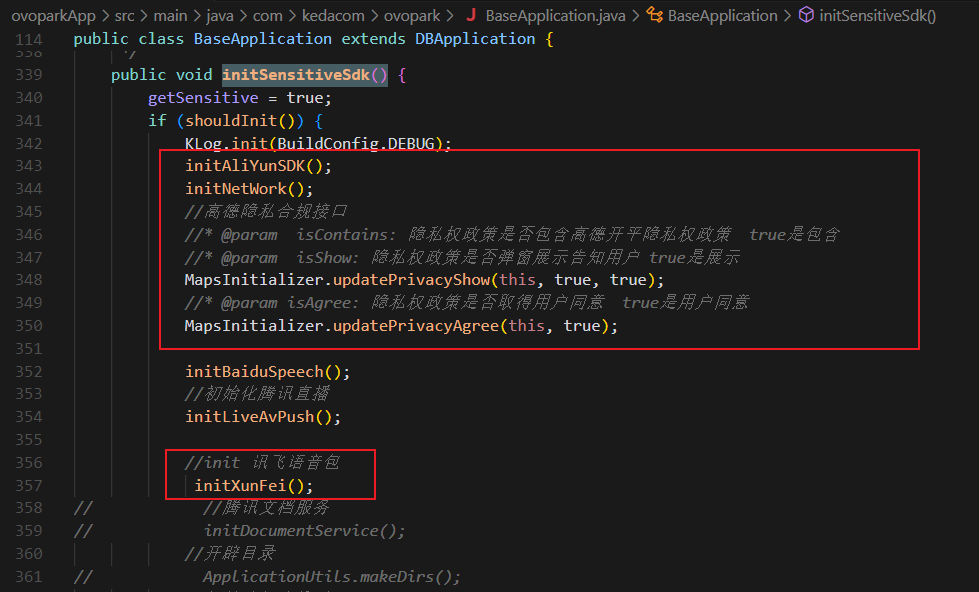

定制化Splash图显示逻辑

- userCheck()
  - 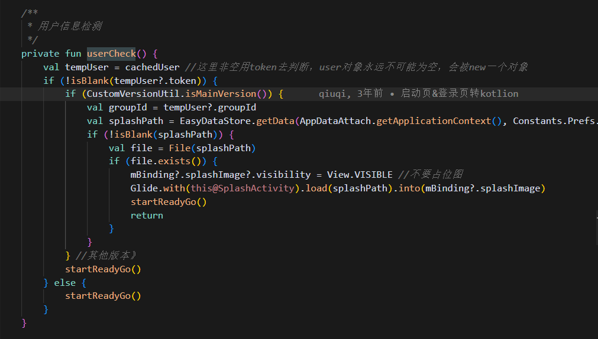
- 说白了，就是一个显示定制splash图的逻辑，已登录用户 & 主线版本， 通过groupId去本地拿定制splash图，然后通过Glide设置
- 不管如何，他们都会执行startReadyGo，不会被卡住

启动准备与分支处理

- 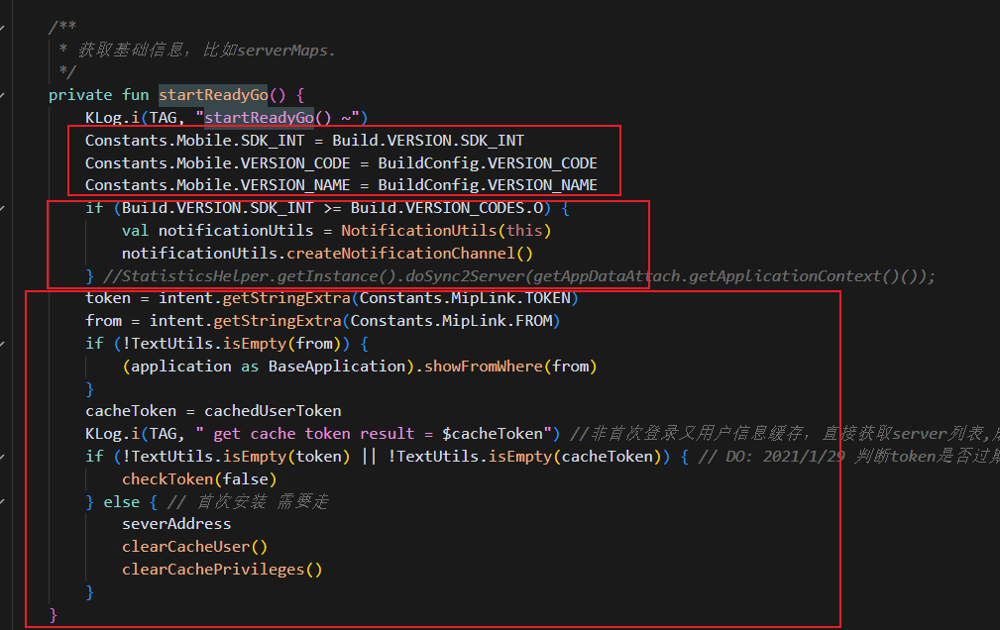

- 他分为三个部分逻辑

  - 把当前设备的系统版本、App 版本号、版本名保存到全局常量，供后续使用

  - Android 8.0 及以上，必须先创建通知渠道，否则无法正常推送通知

  - 解析外部传入的 token 和 from 字段（如三方 App 跳转、H5 跳转等）。如果有 from 字段，调用 showFromWhere(from)

    - 有 token（本地或外部传入）：说明用户已登录或有登录态，调用 checkToken(false) 检查 token 是否有效，必要时刷新。

    - 没有 token：说明是首次安装或已登出，走初始化流程：
      - severAddress：获取服务器地址（如多环境、多域名支持）。
      - clearCacheUser()：清理本地用户信息。
      - clearCachePrivileges()：清理本地权限信息

非首次登录有用户信息缓存分支

- 如果 token 已彻底失效（如被服务器判定为无效、被挤下线、刷新窗口已过），直接跳转到登录页并结束当前页面

  - 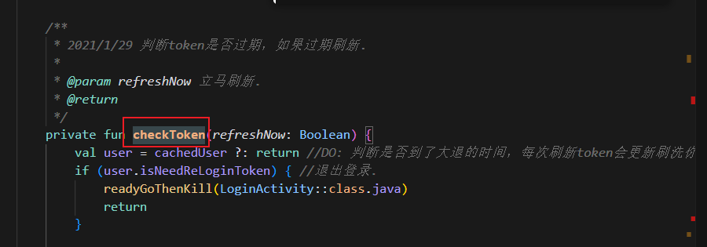

- token未失效，判断是否需要刷新token

  - 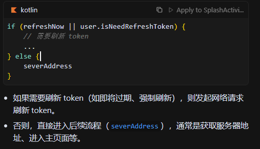

- 刷新token的网络请求

  - onSuccess：刷新成功，解析返回的新 token 信息，更新本地用户对象、保存新 token、更新网络请求头，然后进入后续流程（severAddress）。

    - 解析返回的 JSON，判断是否有错误（isError）。

    - 如果没有错误，提取新的 token 信息，更新本地用户对象（refreshTokenInfo），保存到本地，更新网络请求头，然后进入后续流程。

    - 如果有错误，根据错误码判断：
      - ERROR_CODE_TOKEN_NOT_EXIST、ERROR_CODE_TOKEN_EXPIRED：token 不存在或已过期，跳转到登录页。
      - 其他错误：弹出错误提示，跳转到登录页。

    - 捕获所有异常，防止崩溃，异常时也跳转到登录页。

  - onSuccessError/onFailure：刷新失败或异常，弹出提示并跳转到登录页。

  - 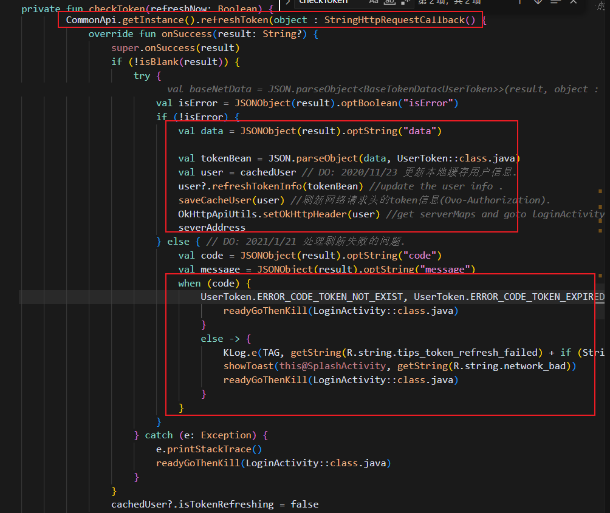

- 一句话：自动判断和刷新用户 token，保证只有有效用户才能进入主页面，过期或异常时自动跳转到登录页

获取服务器地址与最终跳转分支

- 获取服务器的配置信息
  - 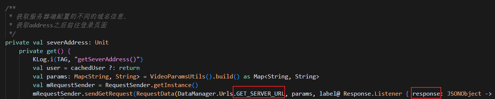
- 解析和保存服务器信息
  - 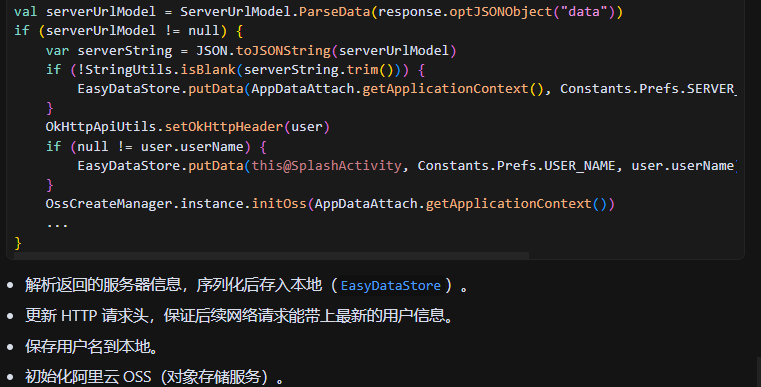
- 判断是否需要进入引导页
  - 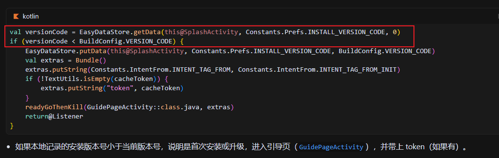、
- 跳转到首页/业务页/登陆页
  - 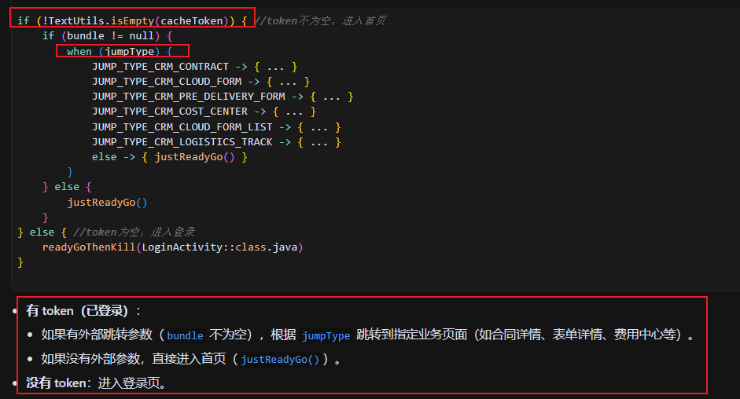

readyGoThenKill

- 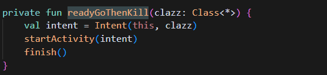


### 3.4 进一步思考

提问：我现在没网的时候会弹出：当前网络存在问题，请重试，然后进入登陆页。这是什么执行流？

- 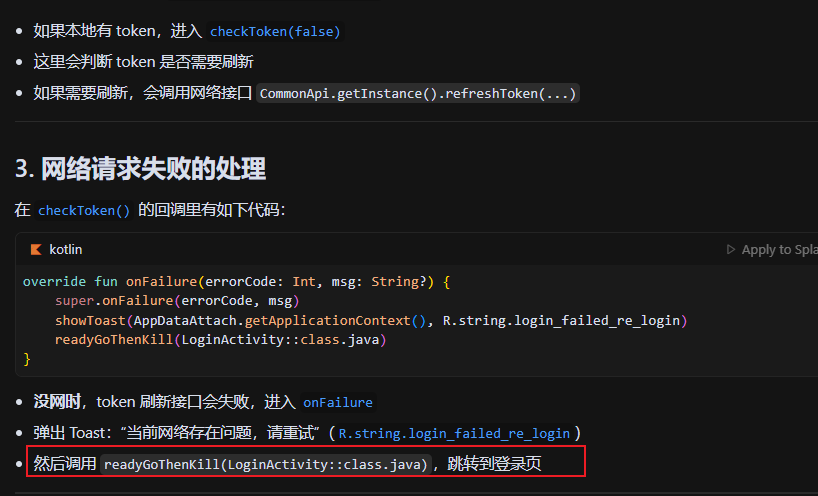

## 04.底层原理


## 05.深度思考

### 5.1 关键问题探究


### 5.2 设计对比


## 06.实践验证

### 6.1 行为验证代码


### 6.2 性能测试


## 07.应用场景

### 7.1 最佳实践


### 7.2 使用禁忌


## 08.总结提炼

### 8.1 核心收获


### 8.2 知识图谱


### 8.3 延伸思考


## 09.参考资料

1. []()
2. []()
3. []()

## 其他介绍

### 01.关于我的博客

- csdn：http://my.csdn.net/qq_35829566

- 掘金：https://juejin.im/user/499639464759898

- github：https://github.com/jjjjjjava

- 邮箱：[934137388@qq.com]

