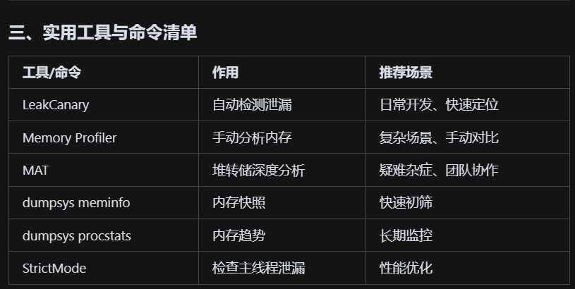

[toc]

## 前言

> 学习要符合如下的标准化链条：了解概念->探究原理->深入思考->总结提炼->底层实现->延伸应用"

## 01.学习概述

- **学习主题**：
- **知识类型**：
  - [ ] **知识类型**：
    - [ ] ✅Android/ 
      - [ ] ✅01.基础组件
      - [ ] ✅02.IPC机制
      - [ ] ✅03.消息机制
      - [ ] ✅04.View原理
      - [ ] ✅05.事件分发机制
      - [ ] ✅06.Window
      - [ ] ✅07.复杂控件
      - [ ] ✅08.性能优化
      - [ ] ✅09.流行框架
      - [ ] ✅10.数据处理
      - [ ] ✅11.动画
      - [ ] ✅12.Groovy
    - [ ] ✅音视频开发/
      - [ ] ✅01.基础知识
      - [ ] ✅02.OpenGL渲染视频
      - [ ] ✅03.FFmpeg音视频解码
    - [ ] ✅ Java/
      - [ ] ✅01.基础知识
      - [ ] ✅02.Java设计思想
      - [ ] ✅03.集合框架
      - [ ] ✅04.异常处理
      - [ ] ✅05.多线程与并发编程
      - [ ] ✅06.JVM
    - [ ] ✅ Kotlin/
      - [ ] ✅01.基础语法
      - [ ] ✅02.高阶扩展
      - [ ] ✅03.协程和流
    - [ ] ✅ 故障分析与处理/
      - [ ] ✅01.基础知识
    - [ ] ✅ 自我管理/
      - [ ] ✅01.内观
    - [ ] ✅ 业务逻辑/
      - [ ] ✅01.启动逻辑
      - [ ] ✅02.云值守
      - [ ] ✅03.智控平台
- **学习来源**：
- **重要程度**：⭐⭐⭐⭐⭐
- **学习日期**：2025.
- **记录人**：@panruiqi

### 1.1 学习目标

- 了解概念->探究原理->深入思考->总结提炼->底层实现->延伸应用"

### 1.2 前置知识

- [ ] 

## 02.核心概念

### 2.1 是什么？


### 2.2 解决什么问题？


### 2.3 基本特性


## 03. 分级处理方案

### 3.1 快速排查（5-10分钟）

目的：初步筛查，判断是否有存在内存泄漏的可能性

流程：

- 现象判断：

  - 询问现象：卡顿、崩溃、OOM、内存持续增长？

  - 复现路径：能否稳定复现？

- dumpsys：

  - adb shell dumpsys meminfo <包名> 观察PSS、RSS、Objects等是否异常

  - adb shell dumpsys procstats --hours 3 <包名> 看内存峰值、增长趋势

- 重启/GC 

  - 杀进程重启，看内存是否恢复

  - 手动GC（开发者选项/代码），看内存是否下降

- 初步结论

  - 明显异常：进入Level 2

  - 无异常/偶发：建议持续监控

dumpsys这两个命令的意义？

- adb shell dumpsys meminfo <包名>

  - 作用：看当前时刻App的内存使用情况

  - 重点关注：
    - PSS（实际用的内存）：是不是异常大？（比如几百MB甚至1GB+）
    - RSS（常驻内存）：是不是异常大？
    - Objects（Views、Activities等对象数量）：是不是异常多？（比如Activity数量远大于实际页面数，说明有泄漏）

-  adb shell dumpsys procstats --hours 3 <包名>

  - 作用：看一段时间内（如3小时）App的内存变化趋势

  - 重点关注：
    - 最大内存峰值：有没有出现极高的峰值？（比如2GB+）
    - 平均内存：是不是一直很高？
    - 内存是否持续增长：如果一直涨不降，才要警惕
    - 前台/后台内存：前台高、后台低是正常的

怎么理解：重启和GC

- 重启后，再次用dumpsys meminfo查看内存

  - ```
      adb shell dumpsys meminfo com.kedacom.ovopark
    ```

  - 如果内存明显下降，说明之前的内存是可以回收的，不是泄漏。

- GC相同的原理

### 3.2 工具辅助定位（30分钟-2小时）

适用：问题可复现，需进一步定位

- 集成LeakCanary（推荐）
  - 5分钟集成，自动检测Activity/Fragment/自定义对象泄漏
  - 观察通知和泄漏报告，定位泄漏链
- Android Studio Memory Profiler
  - 录制内存快照，执行可疑操作
  - 强制GC，观察内存是否回收
  - Dump Hprof，分析大对象、引用链
- 堆转储+MAT分析
  - adb shell am dumpheap <pid> /sdcard/heap.hprof
  - 用MAT打开，查找“泄漏疑似对象”（Dominator Tree、Reference Chain）
- 协程/线程/Handler/观察者检查
  - 检查是否有未取消的协程、线程、Handler、LiveData、Flow等

### 3.3 代码审查与专项测试（1天+）

适用：疑难杂症、复杂业务、团队协作

- 专项代码审查
  - 静态分析工具（如Lint、SonarQube）
  - 重点关注：单例、静态变量、匿名内部类、长生命周期对象
- 单元测试+压力测试
  - 编写自动化测试，反复进出页面、切换场景
  - 监控内存曲线
- 分模块排查
  - 逐步注释/隔离模块，缩小泄漏范围
- 团队协作复盘
  - 组织技术分享，沉淀经验

## 04. 标准化操作流程（可直接用作团队SOP）

一个标准化的操作流程应当是什么样的？

- 问题描述与复现
  - 记录现象、影响范围、复现步骤、截图/日志
- 数据采集
  - dumpsys meminfo/procstats
  - 内存快照（Memory Profiler/LeakCanary/MAT）
- 泄漏定位
  - LeakCanary自动检测
  - Profiler手动分析
  - MAT深度分析
- 代码排查
  - 检查静态/单例/匿名类/Handler/协程/观察者
  - 检查资源释放（onDestroy/onCleared等）
- 修复与验证
  - 修复泄漏点
  - 重复测试，确保内存回收
  - 代码Review
- 总结与预防
  - 编写分析报告
  - 沉淀最佳实践
  - 持续集成内存监控

补充：实用命令清单：

- 

标准化报告模板：

- ```
  【内存泄漏分析报告】
  
  1. 问题描述
  2. 复现步骤
  3. 数据采集
     - dumpsys meminfo/procstats
     - LeakCanary/Profiler/MAT截图
  4. 泄漏定位过程
     - 工具/方法
     - 关键发现
  5. 泄漏点与修复
     - 代码位置
     - 修复方法
  6. 验证与回归
  7. 经验总结与预防建议
  ```

  

## 05.深度思考

### 5.1 关键问题探究

最佳实践建议：

- 开发阶段集成LeakCanary，随时发现问题

- 所有长生命周期对象（单例、全局管理器）都要有清理方法

- 协程/线程/观察者/Handler等必须在生命周期结束时取消/解绑

- 定期做内存压力测试，关注内存曲线

- 团队定期技术分享，沉淀经验

### 5.2 设计对比


## 06.实践验证

### 6.1 行为验证代码


### 6.2 性能测试


## 07.应用场景

### 7.1 最佳实践


### 7.2 使用禁忌


## 08.总结提炼

### 8.1 核心收获


### 8.2 知识图谱


### 8.3 延伸思考


## 09.参考资料

1. []()
2. []()
3. []()

## 其他介绍

### 01.关于我的博客

- csdn：http://my.csdn.net/qq_35829566

- 掘金：https://juejin.im/user/499639464759898

- github：https://github.com/jjjjjjava

- 邮箱：[934137388@qq.com]

