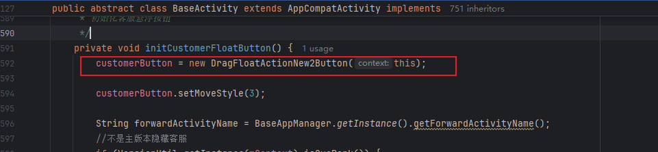
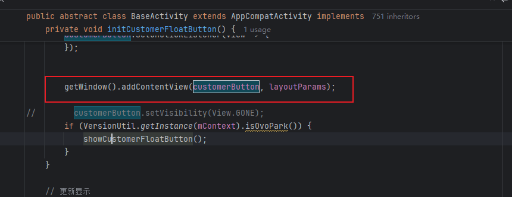

[toc]

# 内存泄漏分析报告

## 01. 影响概述

- **[优先级]**
  - [ ] ⚠️ 阻断 (Blocker)：系统崩溃、核心功能完全不可用
  - [ ] 🔴 严重 (Critical)：核心功能受损，无可用替代方案
  - [ ] 🟠 高 (High)：主要功能受影响，但有临时解决方案
  - [ ] 🟡 中 (Medium)：次要功能问题，影响用户体验
  - [ ] 🟢 低 (Low)：界面问题或轻微异常，不影响功能
- **问题简要描述**
  - **Bug ID**：`BUG-20240801-001`
  - **影响版本**：v5.26.01
  - **提交人**：@panruiqi
  - **状态**：
    - [x] ⌛ 修复中 /
    - [ ] ✅ 已解决 /
    - [ ] ❌ 无法复现
- **问题现象**
  - 
- **环境特征**
  - 设备型号/系统版本/网络环境/特殊配置等

## 02.复现步骤

1. 
2. 
3. 
4. 

## 03.数据采集

### 3.1 相关数据

- [ ] dumpsys meminfo/procstats
- [ ] LeakCanary/Profiler/MAT截图
- [ ] 日志截图
  - [ ] 
- [ ] 关键日志/堆栈
- [ ] 相关配置/环境信息

### 3.1 预分析

关键日志片段：

相关异常堆栈/内存快照/警告信息：

- 从上到下可以发现RetainedSize绝大多数是RecyclerView和ScrollImageView持有他的引用所导致的


## 04. 泄漏定位过程

### 4.1 关键发现

发现的泄漏对象、引用链、GC Root等

- 泄漏对象：DlqInfoActivity被ScrollImageView持有引用

### 4.2 代码位置

具体类/方法/行号/调用链

- ```
  DlqInfoActivity (需要被回收)
      ↓ 继承
  BaseMvpBindingActivity 
      ↓ 继承  
  BaseActivity
      ↓ 创建并持有
  DragFloatActionNew2Button (传入 this = Activity Context)
      ↓ 内部包含
  ScrollImageView (持有 Context 引用)
  ```

关键代码详细介绍

- BaseActivity中创建ScrollImageView类型customerButton
  - 
- BaseActivity中通过getWindow.addContentView将customerButton
  - 

泄漏原因说明：

- ```
  // Activity 销毁时
  Activity.finish()
      ↓
  Activity.onDestroy() // Activity 生命周期结束
      ↓  
  Window 仍然存在！// ❌ Window 不会自动清理通过 addContentView() 添加的 View
      ↓
  customerButton 仍然在 Window 中
      ↓
  customerButton 持有 Activity Context
      ↓  
  ❌ Activity 无法被 GC 回收
  ```

真的是这样的吗？

- getWindow.addContentView到底做了什么？

  - 把 View 加到 DecorView（顶层 FrameLayout）里，DecorView 是 Activity 界面的根节点。
  - 这个 View 会一直存在于界面上，直到你手动移除它（比如 removeView()），或者 Activity 被销毁。

- ok，那DecorView和Activity什么关系？

  - DecorView 是每个 Activity 界面的顶级 View，本质是一个 FrameLayout。

  - DecorView 结构大致如下（简化）：

    - ```
      DecorView(FrameLayout)
      ├── TitleBar（可选）
      └── ContentParent(FrameLayout)  ← id=android.R.id.content
          └── 你 setContentView() 设置的布局
      ```

  - setContentView() 实际上是把你的布局添加到 ContentParent（id=content）这个 FrameLayout 里。

  - Activity持有DecorView

- 那目前的GC 引用链应该是什么样的？

  - ```
    [GC Root]
       ↓
    [WindowManager]  // 系统服务，GC Root
       ↓
    [Window]         // Activity 的 Window
       ↓
    [DecorView]      // Activity 的顶级 View
       ↓
    [customerButton] // 你 addContentView() 加进去的
       ↓
    [mContext]       // customerButton 持有的 Context，其实就是 Activity
       ↓
    [DlqInfoActivity]// 你想被回收的 Activity
       ↑
       └─────────────(环)─────────────┘
    ```

- 好，现在问题来了，你使用finish，理论上DecorView会被清除掉，所以剩下的是

  - ```
    [GC Root]
       ↓
    [WindowManager] → [Window]（已无 DecorView 引用）
    ```

  - 这时 DecorView 及其子 View（包括 addContentView 添加的 View）如果没有被其他地方引用，GC 就会回收它们。

- 那为什么没有按照我们期望的走？

  - 如果 DecorView 或其子 View（比如 customerButton）有“异步任务、全局回调、静态变量、线程、Handler、动画”等引用链，或者被其他地方（比如全局单例、静态集合）引用，GC 就无法回收它们。

  - 只要有一条链能从 GC Root 走到 DecorView 或其子 View，整个链上的对象都不会被回收。

### 4.3 进一步思考

所以，这还是不是根本原因，根本原因是Activityfinish时，尝试销毁decorView时，内部的你某个View因为被某个回调执行，导致GC无法回收。导致暂时性的产生了内存泄漏。

- 看看引用链

  - 

- 他的流程是什么样的？

  - ```
    GC Root (ThreadLocal)
        ↓
    AnimationHandler (全局动画调度器)
        ↓  
    ValueAnimator (动画对象)
        ↓
    ViewPropertyAnimator$AnimatorEventListener (动画监听器)
        ↓
    ViewPropertyAnimator (属性动画)
        ↓
    mView (ScrollImageView)
        ↓
    mContext (Activity)
    ```

- ok，我们来仔细看看代码构成：

  - 问题代码的构成：

    - ```
      // ScrollImageView 中
      private ValueAnimator mAnimator; // 成员变量
      
      // 在 startScrollAnimation() 方法中
      mAnimator = ValueAnimator.ofFloat(0, currentBitmap.getWidth());
      
      // 🚨 问题核心：这个 lambda 表达式
      mAnimator.addUpdateListener(animation -> {
          mUnrolledWidth = (float) animation.getAnimatedValue(); // 访问外部类字段
          invalidate(); // 调用外部类方法
      });
      
      mAnimator.start();
      ```

  - Lambda 表达式的隐藏陷阱，当你写这个 lambda 时

    - ```
      animation -> {
          mUnrolledWidth = (float) animation.getAnimatedValue(); // 访问 this.mUnrolledWidth
          invalidate(); // 调用 this.invalidate()
      }
      ```

    - 编译器实际上会生成类似这样的代码：

    - ```
      // 编译器生成的匿名类，持有外部类引用
      new ValueAnimator.AnimatorUpdateListener() {
          @Override
          public void onAnimationUpdate(ValueAnimator animation) {
              ScrollImageView.this.mUnrolledWidth = (float) animation.getAnimatedValue();
              ScrollImageView.this.invalidate();
          }
      }
      ```

  - 强引用链的形成：

    - ```
      [GC Root: ThreadLocal$ThreadLocalMap]
          ↓
      [AnimationHandler] (全局动画调度器，管理所有动画)
          ↓
      [ArrayList: mAnimationCallbacks] (动画回调列表)
          ↓
      [ValueAnimator: mAnimator] (你的动画对象)
          ↓
      [ArrayList: mUpdateListeners] (更新监听器列表)
          ↓
      [AnimatorUpdateListener] (你的 lambda 生成的匿名类)
          ↓
      [ScrollImageView.this] (lambda 持有的外部类引用)
          ↓
      [Context mContext] (Activity)
      ```

    

## 05. 修复方案

- ScrollImageView中创建2个bitmap

  - 

- onDraw时直接使用已有的bitmap,避免bitmap的重绘

  - 

  


## 06. 验证与回归

### 6.1 关键性能指标

测试场景：点击AI助手

测试环境：测试服，Android 10，小米 8，使用分支如下：

- 

测试方式：使用adb命令 `adb shell dumpsys meminfo 包名` 监控内存使用情况

刚启动时的初始化状态

- 第一次：

  - 
  - 

- 第二次：

  - 
  - 

- 第三次

  - 
  - 

- 关键数据统计

  - | 指标                   | 启动测试1 | 启动测试2 | 启动测试3 | 平均值  | 变化范围 |
    | :--------------------- | :-------- | :-------- | :-------- | :------ | :------- |
    | Java Heap (KB)         | 50,608    | 42,336    | 35,572    | 42,839  | -15,036  |
    | Dalvik Heap Size (KB)  | 50,127    | 50,810    | 49,586    | 50,174  | ±612     |
    | Dalvik Heap Alloc (KB) | 25,551    | 26,234    | 25,010    | 25,598  | ±612     |
    | Dalvik Heap Free (KB)  | 24,576    | 24,576    | 24,576    | 24,576  | 0        |
    | Native Heap (KB)       | 124,740   | 124,584   | 124,072   | 124,465 | -668     |

优化前数据记录

- 采用点击0， 15， 30， 45次

- 📊 点击测试数据对比

  | 测试   | 点击次数 | Java Heap (KB) | Dalvik Alloc (KB) | Views数量 | Activities |
  | :----- | :------- | :------------- | :---------------- | :-------- | :--------- |
  | 基准线 | 0        | 55,360         | 39,463            | ~3,000    | ~8         |
  | 测试1  | 15次     | 76,864         | 58,458            | 6,021     | 17         |
  | 测试2  | 30次     | 120,692        | 94,387            | 10,800    | 32         |
  | 测试3  | 45次     | 144,020        | 132,245           | 15,589    | 47         |

- 🔴 严重内存泄漏迹象

  - Java Heap爆炸式增长: 从55MB → 144MB（+160%）

  - Views数量失控: 从3,000 → 15,589（+420%）

  - Activities堆积: 从8 → 47个未回收

- 📈 内存增长与点击次数强相关

  - 15次点击 → 76MB   (+38%)
    30次点击 → 120MB  (+117%)
    45次点击 → 144MB  (+160%)

优化后数据

- 采用点击0， 15， 30， 45次

- 📊点击测试数据对比

  | 测试   | 点击次数 | Java Heap (KB) | Dalvik Alloc (KB) | Views数量 | Activities |
  | :----- | :------- | :------------- | :---------------- | :-------- | :--------- |
  | 基准线 | 0        | 34,948         | 25,598            | 1,236     | 2          |
  | 测试1  | 15次     | 106,176        | 67,028            | 6,040     | 17         |
  | 测试2  | 30次     | 109,064        | 98,029            | 10,808    | 32         |
  | 测试3  | 45次     | 193,168        | 138,172           | 15,605    | 47         |

- - 🔴 严重内存泄漏迹象

  - Java Heap爆炸式增长: 从35MB → 193MB（+453%）

  - Views数量失控: 从1,236 → 15,605（+1,162%）

  - Activities堆积: 从2 → 47个未回收（+2,250%）

  - Dalvik分配激增: 从26MB → 138MB（+439%）

- 📈 内存增长与点击次数强相关

  - 15次点击 → 106MB (+203%)

  - 30次点击 → 109MB (+212%)

  - 45次点击 → 193MB (+453%)

- ⚠️ 泄漏模式分析

  - Activity泄漏规律: 每15次点击泄漏约15个Activity

  - View泄漏加速: Views数量呈指数级增长

  - 内存回收失效: Dalvik Free空间固定24,576KB，但分配持续增长

  - 严重程度: 45次点击后内存使用接近700MB总量，存在OOM风险

### 6.2 修复后验证方式（自动化/手动/专项测试）


### 6.3 回归结果（是否彻底解决，是否有副作用）

## 07. 经验总结与预防建议

### 7.1 技术原理

- 相关内存管理机制、GC原理、Android生命周期等

### 7.2 预防措施

- 代码规范、工具接入、review要点、专项测试建议

### 7.3 卸载规范

- 资源释放、解绑监听、弱引用使用等

### 7.4 调试技巧

- 常用分析命令、工具使用心得、排查思路


