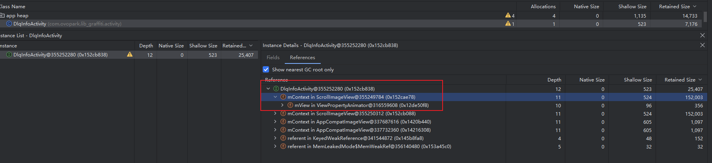

- 

- ```
  DlqInfoActivity (需要被回收)
      ↓ 继承
  BaseMvpBindingActivity 
      ↓ 继承  
  BaseActivity
      ↓ 创建并持有
  DragFloatActionNew2Button (传入 this = Activity Context)
      ↓ 内部包含
  ScrollImageView (持有 Context 引用)
  ```

  