[toc]

## 01.优化概述

- **功能ID**：`perf-20250828-001`  
- **功能名称**：
- **目标版本**：v0.2.0
- **提交人**：@panruiqi  
- **状态**：
  - [x] ⌛ 设计中 /
  - [ ] ⌛ 开发中 / 
  - [ ] ✅ 已完成 / 
  - [ ] ❌ 已取消  
- **价值评估**：  
  - [ ] ⭐⭐⭐⭐⭐ 核心业务功能  
  - [x] ⭐⭐⭐⭐ 用户体验优化  
  - [ ] ⭐⭐⭐ 辅助功能增强  
  - [ ] ⭐⭐ 技术债务清理  
- **功能描述** 
  - 清除用户缓存

- git记录：feat_wdz126779

## 02.需求分析

### 2.1 用户场景

- **主要场景**：  

  - 用户使用一段时间后，内部的缓存较多，手机较卡，需要去清除缓存

- **边界场景**：  

### 2.2 功能范围

- ✅ 包含：
- ❌ 不包含：

## 03.技术方案

### 3.0 预分析

原有的实现方案

- 1个IO协程执行4个任务（2个EasyDataStore写入、1个Glide清缓存、1个递归删除文件）。
  - 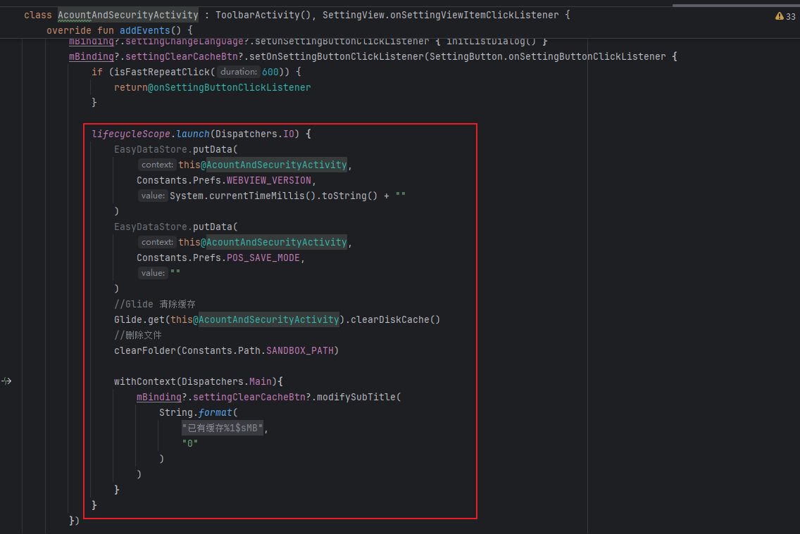
- 递归删除文件操作
  - 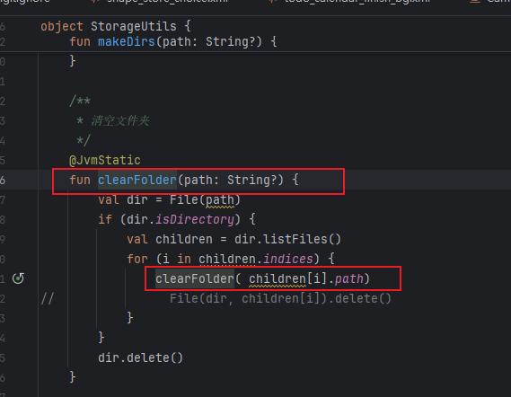

存在的问题：

- 并没有真正的利用多线程执行异步，只是简单的将IO操作放到协程中，调度到IO线程池中执行，执行完成后将结果post会主线程更新UI，只是简单的利用了协程的特性

### 3.1 方案一

实现思路：开启多个协程

- IO协程作用域中通过async开启4个协程，分别执行上面的4个任务，通过awaitAll等待他们执行完成，然后withContext调度回UI线程中更新UI
  - 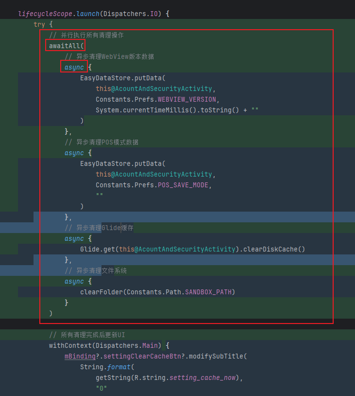

存在的问题：

- 过度并发：轻量级的I/O操作（两个EasyDataStore + Glide缓存）被拆分成3个async。
- 文件删除操作是clearFolder使用递归，深层目录可能导致栈溢出，递归调用创建大量栈帧。
- 文件删除这个重量化的操作内部没有并发处理。 

### 3.2 方案二

实现思路：轻量任务合并到1个IO协程，避免调度开销。文件删除改为迭代+栈记录，避免递归栈溢出，并控制协程并发。

- 开启两个协程，轻量任务合并到1个IO协程，避免调度开销。另一个协程执行重量化的文件并发清除的任务
  - 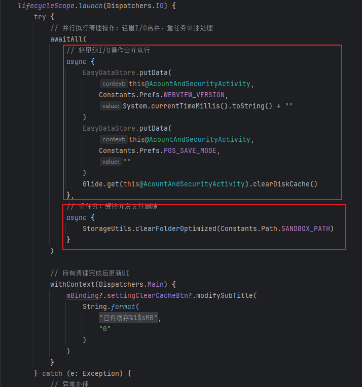

- 首先通过栈进行树的遍历算法，通过迭代的方式记录文件树中的文件节点。然后对于已经被处理完成的父节点，我们启用协程尝试进行删除操作
  - 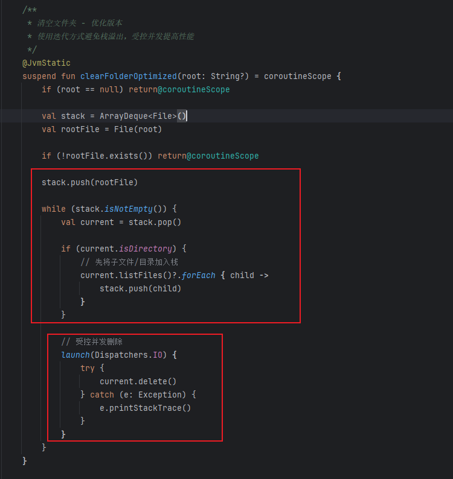

存在的问题：他适用于小型的文件清除，设想一下有1000个文件节点，他存在下面的问题

- 挂起函数每次挂起时会在堆中生成状态机对象，你这样每个都开，000个文件 → 1000个状态机 → 内存压力巨大。
- 协程调度压力：协程调度器需要同时管理1000个协程，虽然协程轻量，但数量过多仍会影响性能
- 操作系统文件句柄问题：1000个File对象同时持有引用，操作系统文件句柄数量有限制（通常几千个），可能触发系统限制

### 3.3 方案三

实现思路：预遍历 + 分级处理，通过预遍历获取文件数量，再根据文件数量选择处理方法

- 预遍历过程
  - 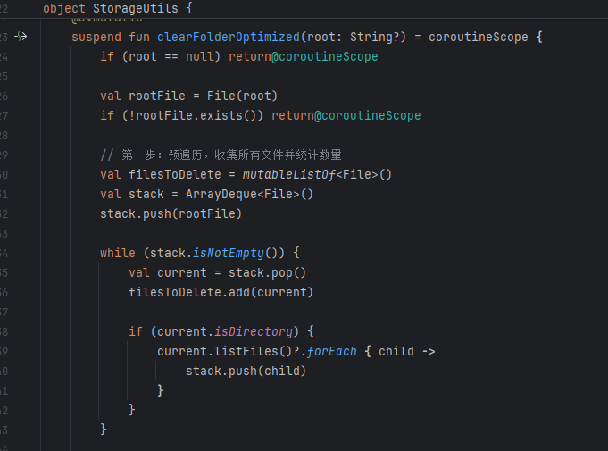
- 分级处理_小于100，直接并发，充分发挥协程优势
  - 
- 分级处理_大于100,
  - 开启一个信号量，拥有16个许可计数器，
  - `withPermit` 语义：
    - **尝试获取一个许可**。如果还有剩余（<16），立刻进入代码块；
    - 如果许可用完（≥16 个任务在运行），**当前协程会挂起**，直到有许可被释放；
    - **执行完成后自动释放许可**。
  - 通过yield给出挂起点，每处理完50个文件后允许被挂起，如果你的循环遍历速度很快，又不 `yield()`，这个调度线程就会一直执行当前协程的遍历逻辑，其它协程可能迟迟得不到运行机会；他让长循环变得更公平。
  - 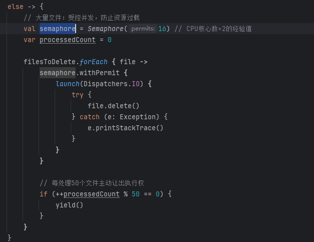

可能存在的问题：yield不够智能，

- 空闲时：yield()检查发现没有其他协程排队 → 几乎零成本继续执行

- 繁忙时：yield()发现有其他协程等待 → 真正挂起让出执行权
- 因此我们应该在可能空闲的时候，减少yield，繁忙时频繁yield，至于是否需要真正的让出执行权，交给yield执行。

优化：

- 我们通过batchSize控制步长，然后再让步时，尝试根据remaining判断负载，调整步长
  - 

但是实际，低阶段的时候

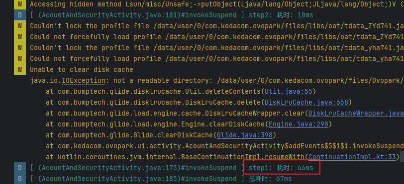

- 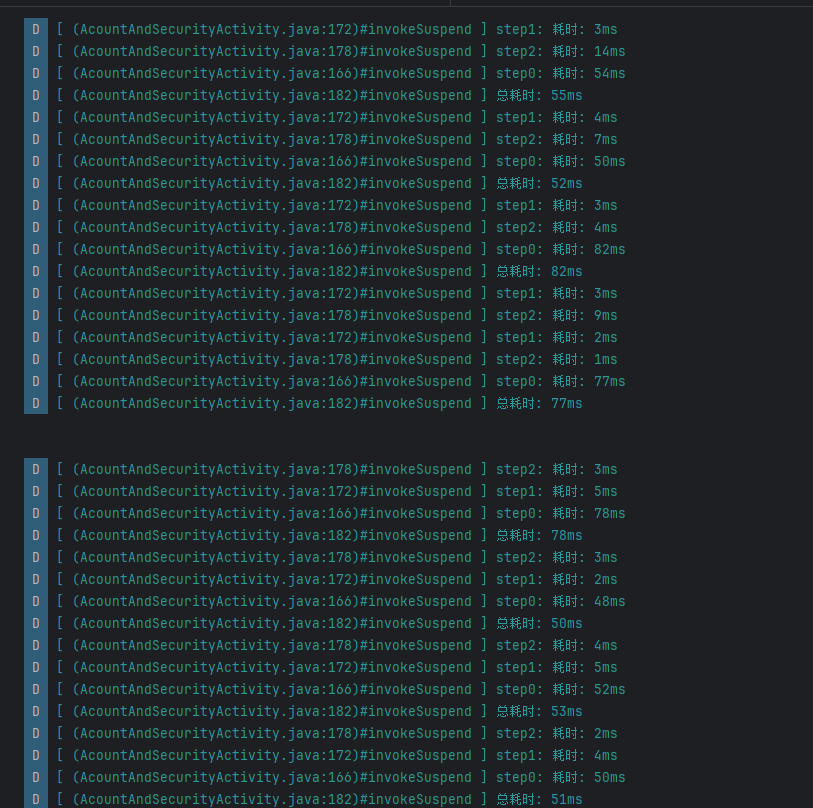

## 04.性能验证

### 4.1 验证思路

首先是：我该用什么方法统计的我的耗时，来确定我的执行结果呢？同时他还存在handler post 的延迟？好难啊

其次：我该设计什么方式去验证我的优化的结果呢？因为对每台手机，他们的存在的缓存在每个时间都是不一样的，你没法很好的确认

我能否通过注入文件夹的形式处理呢？就是对每台手机注入相似的文件夹，ok，那么问题来了，这个使用的文件夹是什么样的？

### 4.2 任务拆解

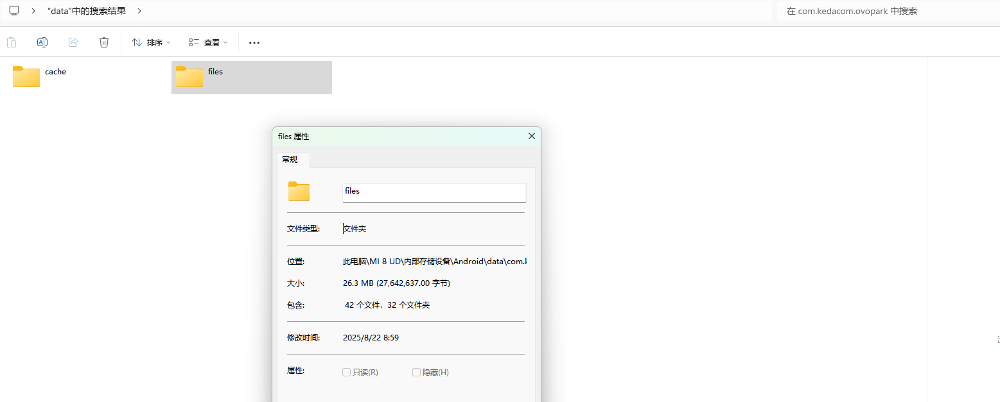

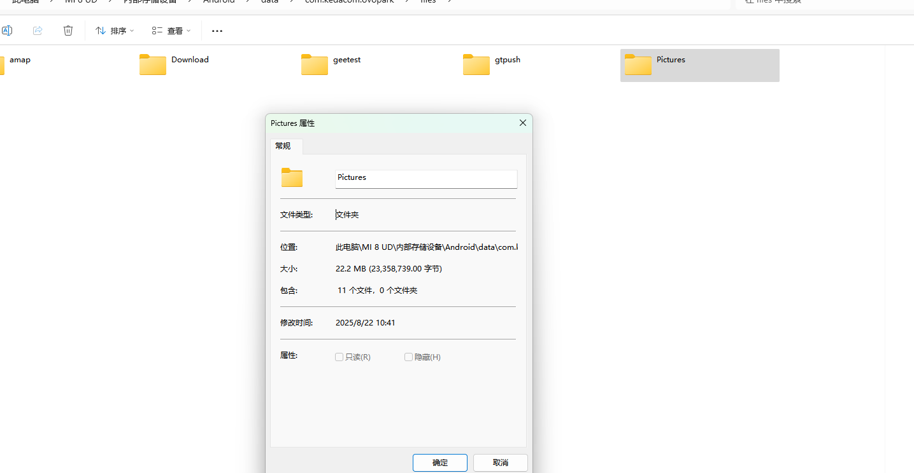

### 4.3 代码路径

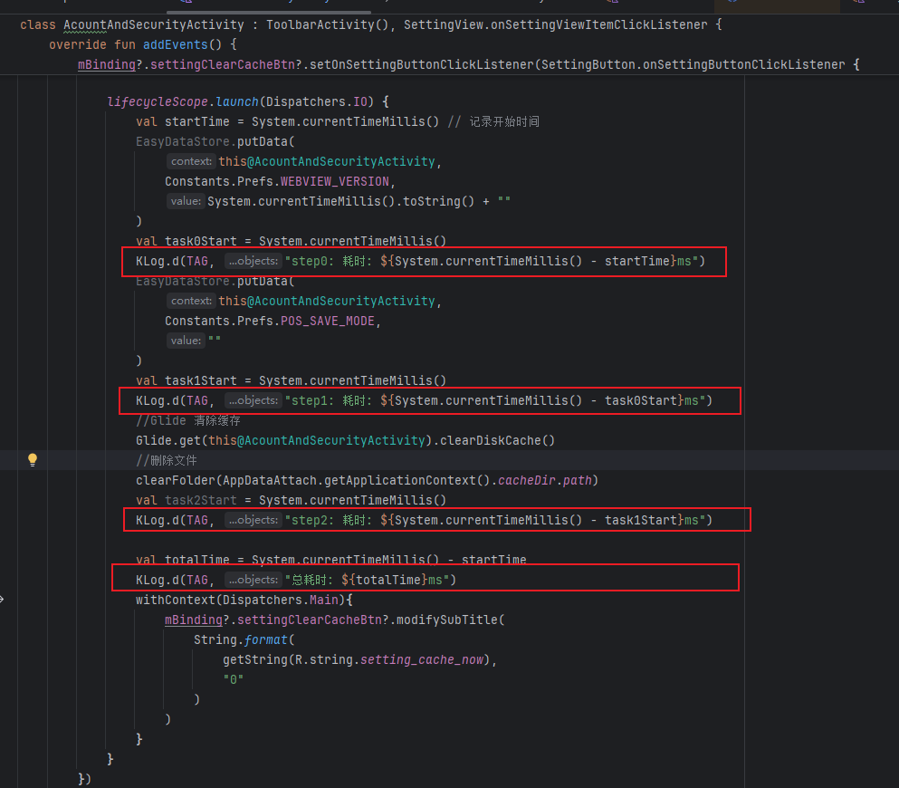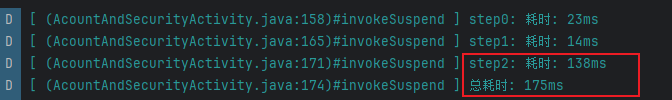

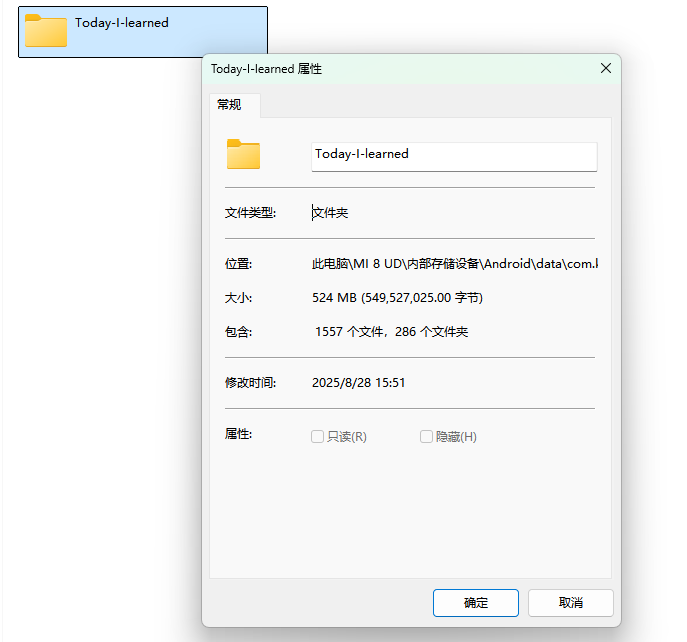

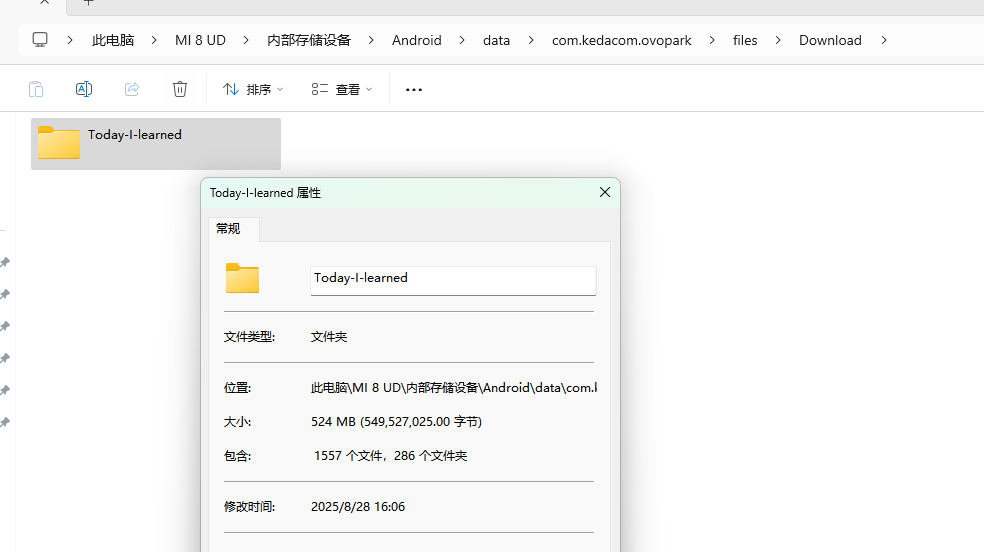

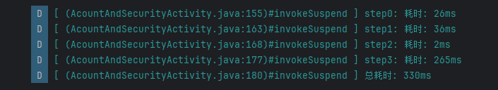

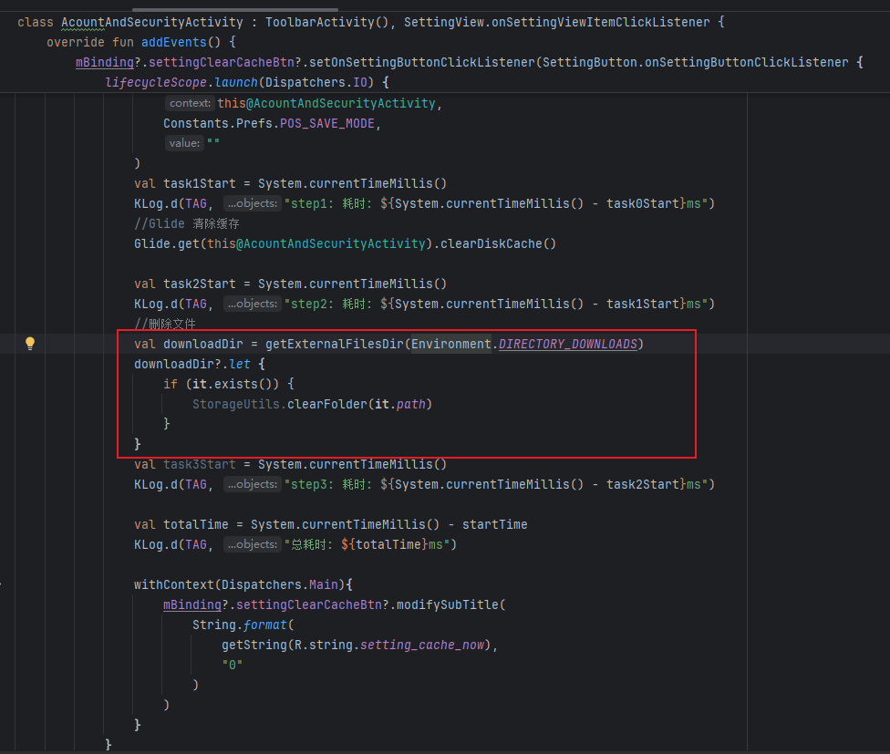

## 05.兼容性设计

### 5.1 设备适配

### 5.2 冲突检查

## 06.测试方案

### 6.1 核心用例

### 6.2 性能指标

## 07.发布计划

### 7.1 阶段发布

### 7.2 回滚方案

## 08.文档记录

### 8.1 技术文档

### 8.2 用户文档

### 8.3 监控埋点

