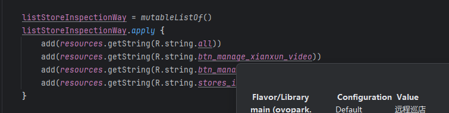
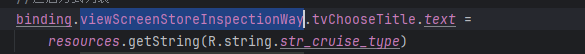
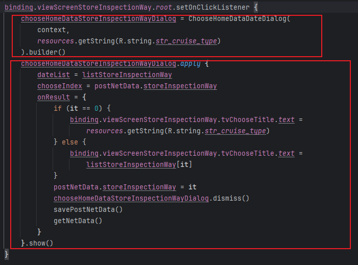
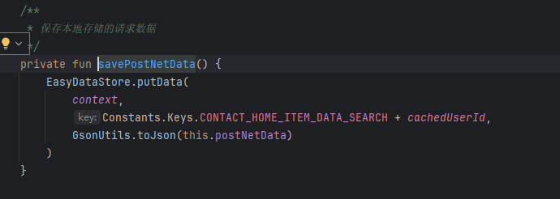
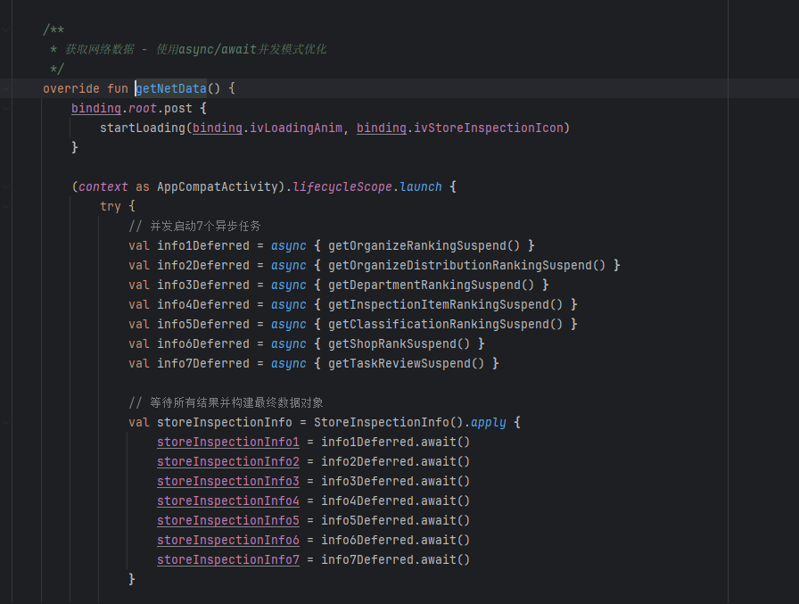
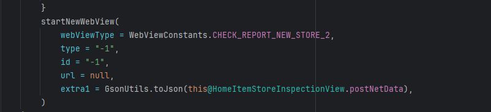
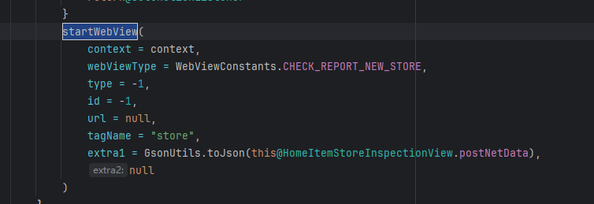
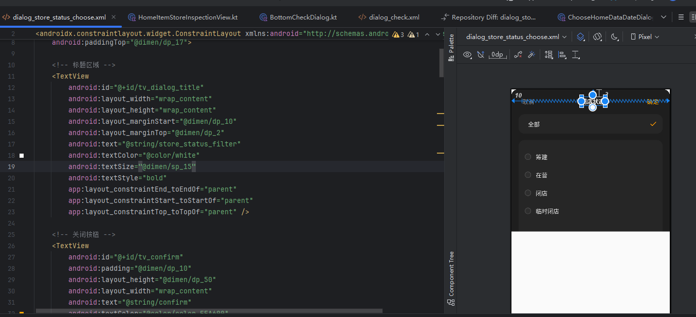
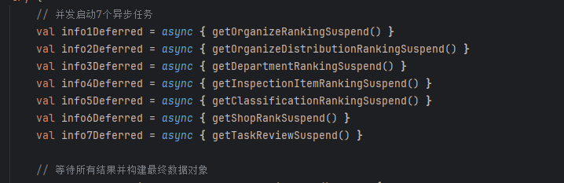
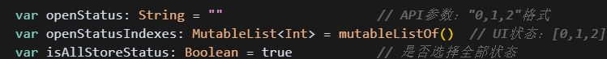

[toc]

## 01.功能概述

- **功能ID**：`FEAT-20250609-001`  
- **功能名称**：
- **目标版本**：v0.2.0
- **提交人**：@panruiqi  
- **状态**：
  - [x] ⌛ 设计中 /
  - [ ] ⌛ 开发中 / 
  - [ ] ✅ 已完成 / 
  - [ ] ❌ 已取消  
- **价值评估**：  
  - [x] ⭐⭐⭐⭐⭐ 核心业务功能  
  - [ ] ⭐⭐⭐⭐ 用户体验优化  
  - [ ] ⭐⭐⭐ 辅助功能增强  
  - [ ] ⭐⭐ 技术债务清理  
- **功能描述** 
  - 

## 02.需求分解

目的：深度理解需求，拆分出功能点

### 2.1 用户场景

- **主要场景**：  哪些用户，在哪些位置，查看什么的时候，点击了什么，期望获得了什么？
  - 举例：
  - 
  - 某些用户在首屏看板的巡店概览界面中查看巡店数据时，希望可以通过多选下拉的筛选器筛选门店状态，排除掉闭店等门店影响指标以获取准确的巡店数据。
  - 同时点击各个位置跳转到H5可以带上之前的 巡店数据

### 2.2 功能需求提取

- 核心功能
  - 门店状态多选。影响所有门店相关API。跳转带参
- 辅助功能
  - 记忆上次选择，显示选中状态。
- 举例：
  - 

## 03.依赖分析（分析拥有的支持和技术架构）

如果没有任何依赖可以支持，那么对于困难的要做一个最小化验证方案

### 3.1 现有系统分析

- 发现

  - 存在巡店方式列表
  - 存在跳转逻辑

- 内部代码逻辑_巡店方式列表

  - 列表中名称

  - 

  - UI初始化

    - 

  - 设置点击事件

    - 

    - 点击后会创建一个Dialog。Tittl是：R.string.str_cruise_type

    - 通过apply配置其对话框内容

      - dateList也就是上面的列表
      - chooseIndex：当前选中的选项索引，用于在对话框中高亮显示

      - onResult：用户选择后的回调函数
      - 回调中设置了postNetData，让dialog小时，同时savePostNetData将其保存到本地。getNetData则是获取网络数据重新刷新。

  - save保存本地

    - 
    - 没啥好说的，easydata保存一个key，value。value是postNetData转JSON

  - getNetData

    - 重新进行网络请求
    - 

- 抽象其模式

  - Dialog选择，回调更新，本地保存，刷新数据

- 内部代码逻辑_跳转

  - 两种跳转方式
  - 
  - 

- 举例：
  - 

### 3.2 技术栈评估

- 可用组件
  - 找不出来，缺少经验，下次可以请教姚老板
  - 因为是回过头来看的，我们可以已经开发完的
  - 
- 可用API
  - 就是这7个，因为每次刷新数据都是他们
  - 
- 可用工具
  - 没啥好说的
  - 
  - 跳转就是startWebView
- 举例：
  - 

### 3.3 影响面识别

- 预分析：
  - 影响API，所以数据层需要修改，PostNetData需要新增字段，新增几个呢？
  - 存储层，本地保存逻辑和恢复逻辑，好像直接复用就行，毕竟是以整个数据结构的形式存放的
  - UI层需要新的Dialog，同时主界面要有其入口和定义，参考上面的。
  - 业务逻辑层：7个方法需要新增相关的参数，同时跳转H5要带上参数

- 数据层
  - PostNetData需要新增字段，新增几个呢？
  - 新增3个
  - 
- 存储层
  - 基于PostNetData整体序列化存储，无需修改
- UI层
  - 参考上面的现有实现分析中的模式抽象
- 业务逻辑层
  - 扩展getLocalPostNetData()和refreshSearchView()方法
  - 扩展H5,带上跳转参数

- 举例
  - 

### 3.4 技术风险评估（如果没可用要在这里说出来，评估风险）

- 低风险
  - UI，有集成的
- 中风险
  - 多选逻辑处理
- 高风险
  - API集成
- 举例
  - 

## 04.任务拆分（从分析结果转化为具体的、合理的任务拆分）

### 4.1 数据层

- 数据层任务：PostNetData需要3个新字段
- 任务转换
  - 任务一：扩展PostNetData数据模型，添加门店状态相关字段

### 4.2 存储层

- 存储层任务：本地保存/恢复逻辑需要扩展
- 任务转换
  - 任务一：扩展本地数据保存逻辑
  - 任务二：展本地数据恢复逻辑
  - 任务三：实现UI状态显示逻辑

### 4.3 UI层

- UI层任务：需要新Dialog + 主界面入口
- 任务转换
  - 任务1: 添加字符串资源定义（UI基础）
  - 任务2: 创建多选对话框布局文件
  - 任务3: 实现ChooseStoreStatusDialog多选组件
  - 任务4: 在主界面添加门店状态筛选器入口
  - 任务5: 实现筛选器点击事件和回调处理

### 4.4 业务逻辑层

- 业务逻辑层任务：7个API方法需要新增openStatus参数
- 任务转换
  - 任务1: 更新HomePageParamsSet方法签名
  - 任务2: 更新所有API调用点，传递门店状态参数
  - 任务3：

## 05.代码优化

### 5.1 代码重构和规范检查

目的：移除冗余代码和注释；统一命名规范和代码风格；添加必要的文档注释

### 5.2 代码性能优化

目的：检查是否有不必要的重复计算；优化内存使用（避免内存泄漏）；优化UI渲染性能

### 5.3 安全性检查 

目的： 输入参数验证；异常边界处理；数据安全性检查

## 06.设计方案优化

### 6.1 检查是否有更优雅的实现方式

### 6.2 评估是否可以进一步复用现有组件

### 6.3 考虑未来扩展性（如果要加新的筛选条件）

### 6.4 检查用户体验的改进空间

## 07.测试验证

### 7.1 性能基准

- 页面加载时间：不超过原有基准+200ms
- 筛选响应时间：UI操作响应 < 100ms  
- 内存使用：新增功能内存占用 < 5MB
- 网络请求：不增加额外的API调用次数

### 7.2 风险控制

快速回滚预案：

- 功能开关：可以快速关闭新功能
- 数据回滚：本地存储格式向下兼容
- 代码回滚：保留可工作的上一版本

监控告警：

- API错误率异常告警
- 页面崩溃率监控
- 用户行为异常检测

数据埋点：

- 

## 08.文档记录

### 8.1 技术文档

### 8.2 用户文档

