[toc]

## 前言

> 学习要符合如下的标准化链条：了解概念->探究原理->深入思考->总结提炼->底层实现->延伸应用"

## 01.学习概述

- **学习主题**：
- **知识类型**：
  - [ ] ✅Android/ 
    - [ ] ✅01.基础组件与机制 
      - [ ] ✅四大组件
      - [ ] ✅IPC机制
      - [ ] ✅消息机制
      - [ ] ✅事件分发机制
      - [ ] ✅View与渲染体系（含Window、复杂控件、动画）
      - [ ] ✅存储与数据安全（SharedPreferences/DataStore/Room/Scoped Storage）
    - [ ] ✅02. 架构与工程化
      - [ ] ✅架构模式（MVC/MVP/MVVM/MVI）
      - [ ] ✅依赖注入（Koin/Hilt/Dagger）
      - [x] ✅路由与模块化（ARouter、Navigation）
      - [ ] ✅Gradle与构建优化
      - [ ] ✅插件化与动态化
      - [ ] ✅插桩与监控框架
    - [ ] ✅03.性能优化与故障诊断
      - [ ] ✅ANR分析与优化
      - [ ] ✅启动耗时优化
      - [ ] ✅内存泄漏监控
      - [ ] ✅监控与诊断工具
    - [ ] ✅04.Jetpack与生态框架
      - [ ] ✅Room
      - [ ] ✅Paging
      - [ ] ✅WorkManager
      - [ ] ✅Compose
    - [ ] ✅05.Framework与系统机制
      - [ ] ✅ActivityManagerService (含ANR触发机制)
      - [ ] ✅Binder机制
  - [ ] ✅音视频开发/
    - [ ] ✅01.基础知识
    - [ ] ✅02.OpenGL渲染视频
    - [ ] ✅03.FFmpeg音视频解码
  - [ ] ✅ Java/
    - [ ] ✅01.基础知识
    - [ ] ✅02.集合框架
    - [ ] ✅03.异常处理
    - [ ] ✅04.多线程与并发
    - [ ] ✅06.JVM
  - [ ] ✅ Kotlin/
    - [ ] ✅01.基础语法
    - [ ] ✅02.高阶扩展
    - [ ] ✅03.协程和流
  - [ ] ✅ Flutter/
    - [ ] ✅01.基础基础语法
    - [ ] ✅02.状态管理
    - [ ] ✅03.路由与依赖注入
    - [ ] ✅04.原生通信
  - [ ] ✅ 自我管理/
    - [ ] ✅01.内观
  - [ ] ✅ 项目经验/
    - [ ] ✅01.启动逻辑
    - [ ] ✅02.云值守
    - [ ] ✅03.智控平台
- **学习来源**：
- **重要程度**：⭐⭐⭐⭐⭐
- **学习日期**：2025.
- **记录人**：@panruiqi

### 1.1 学习目标

- 了解概念->探究原理->深入思考->总结提炼->底层实现->延伸应用"

### 1.2 前置知识

- [ ] 

## 02.核心概念

### 2.1 是什么？

ARouter 是阿里巴巴开源的 Android 路由框架。它为 Android 应用提供页面（Activity/Fragment）和服务的统一路由管理。它通过注解生成路由表，ARouter 实现了页面/服务的解耦跳转和参数传递


### 2.2 解决什么问题？

为什么需要ARouter？这就从他的特性说起了，ARouter 的特点是`灵活性强`还能`帮助项目解耦`。

灵活性强指的是在一些复杂的业务场景下，很多功能都是运营人员动态配置的。比如电商系统需要下发一个活动页面，App 事先不知道该活动具体的目标页面，但如果提前做好了页面映射，就可以`自由配置`了。

帮助解耦指的是，随着业务量增长，我们项目代码会越来越多，开发人员之间的协作也会变得越来越复杂，而解决这个问题的常见方案是插件化和组件化。`插件化和组件化的前提是代码解耦`，解耦后还要保持页面之间的依赖关系，这时就要一套路由机制了。

### 2.3 基本特性


## 03.原理机制

### 3.1 ARouter原理概述

ARouter分为三个部分：生成路由表，加载路由表，路由跳转；跳转是基于路由表 `RouterMap` 实现的，负责`生成路由表`的是 `RouteProcessor` ，负责`加载路由表`的是 `LogisticsCenter`或 `RegisterTransform` 。


ARouter 的`路由`、`参数`和`拦截器`都是用注解来标注的。

- 注解分为`运行时注解`和`编译时注解`，`编译时注解`是依赖注解处理工具 `APT`（Annotation Processing Tool，注解处理工具）实现的
- APT是编译时（compile-time）处理工具，他会在编译时扫描源码中的注解（如 @Inject、@Entity），并检查 `AbstractProcessor` 的子类，并调用 AbstractProcessor 的子类的 process() 方法，然后把添加了注解的元素都传到 process() 方法中，这样我们就可以在 process() 函数中生成新的 Java 类文件。
- 常见的 Dagger、ButterKnife、Room、Koin 等依赖注入或数据绑定框架，都会用到 APT 生成大量样板代码。


我们来看看ARouter的整体流程吧

RouteProcessor生成路由表:

- `RouteProcessor` 是一个注解处理器，是 `AbstractProcessor` 的子类。
- 在 RouteProcessor 的 process() 方法中，会调用 `parseRoutes()` 方法，parseRoutes() 方法会用 `JavaPoet` API 来生成 Java 代码，具体的代码就是 Activity 等类的 Class 信息。
- 除了 RouteProcessor ，ARouter 中还有参数注解处理器 `AutowiredProcessor` 和拦截器注解处理器 `InterceptorProcessor` ，它们的原理和 RouteProcessor 是一样的。


路由加载：ARouter 加载路由表的方式有两种，一种是`运行时反射`，另一种是`编译时插入`

- 在 ARouter 的 init() 方法中会调用到 LogisticsCenter 的 init() 方法，LogisticsCenter 的 init() 方法会根据 registerByPlugin 的值判断路由表是否已经在编译时插入，如果不是的话，就通过运行时反射注册路由表的信息。

- `运行时反射`就是在 LogisticsCenter 的 init() 方法中，通过 `ClassUtils` 加载 `dex` 文件中的 Class 信息，查找特定包名下的 class（比如 com.alibaba.android.arouter.routes），然后再通过反射初始化这些类，并保存到内存仓库 `Warehouse` 中。

  - `Dex` 文件是 Android 平台的可执行文件，类似于 Windows 中的 `exec` 文件，每个 APK 安装包中都有 dex 文件，dex 文件中包含了 app 的`所有源码`，反编译后能看到对应的 java 源码

- `编译时插入`就是由 `RegisterTransform` 从 `Jar` 文件中读取路由表的信息。 RegisterTransform 继承了 `Transform`  类，Transform API 是 Android Gradle 插件提供的一个编译期字节码处理接口，每个 Transform 实例就是一个 Gradle 任务，按顺序执行，能读取和处理 jar、aar 和 resource 等资源，并对他们进行扫描，修改，插桩。用户自定义的 Transform 会插在 Transform 队列的最前面

  - `Transform API` 可以做很多的事情，比如在所有的 class 文件中插桩，做 UI 、内存和网络方面的性能监控。还可以通过修改某个第三方库的 class 文件的内容调整它的逻辑。还可以在 Log 中插入当前代码行数，这样更容易定位问题。还可以对任何类进行动态代理。还可以实现打印出某个方法的入参和出参的代码。

    


路由跳转

- 当我们调用 ARouter 的 `build()` 方法后，会获取到一个 `Postcard` 对象，我们调用的 navigation() 方法就是 Postcard 的 navigation() 方法，Postcard 的 navigation() 方法会调用到  _ARoute 的 `navigation()` 方法中

- 在这方法中，首先会处理`预处理服务`，然后会让 `LogisticsCenter` 填充 `Postcard` 中的信息，如果 LogisticsCenter 没有找到对应的路由信息的话，就会走`降级策略`的逻辑，如果 LogisticsCenter 找到对应的路由信息的话，就会判断是不是走`绿色通道`，如果不走绿色通道的话就由`拦截器链`决定要不要跳转。如果走绿色通道的话，就直接按 Fragment 和 Activity 等不同的类型进行跳转，在跳转完成后，如果设置了`跳转回调`， LogisticsCenter 就会调用这个回调。

  - `预处理服务`具体就是一个 `PretreatmentService` 接口，只要定义一个实现了这个接口的类，并给这个类加一个 `@Route` 注解就可以使用了，预处理服务的作用，是做一些跳转的时候，在加载路由表前的判断。
  - `降级策略`的作用是跳转路由的信息缺失的时候，要做的事情，比如说给用户弹一个错误提示或记录错误日志等，降级策略对应的是一个 DegradeService 接口，定义一个实现这个接口的类，并添加上 @Route 注解就可以使用降级策略了。
  - `绿色通道`的作用就是判断要不要走拦截器链，比如说我们定义了一个登陆拦截器，但是某个页面不需要做这个判断，就可以走绿色通道，走绿色通道只要在调用 `build()` 方法后调用 `greenChannel()` 方法就可以了。
  - `拦截器`具体就是一个添加了 `@Interceptor` 注解并实现了 `IInterceptor` 接口的类，通过拦截器我们能做一些类似登录态判断等逻辑。
  - `跳转回调`具体就是一个传到 navigation() 方法中的 NavigationCallback 接口或 NavCallback 抽象类。

  

### 3.2 ARouter基础用法

添加依赖和配置

- 没啥好说的
  - kotlin-kapt，是启用 Kotlin 的注解处理工具（KAPT：Kotlin APT工具），用于处理如 ARouter 这类依赖注解的库。
  - kapt - arguments， 为 ARouter 注解处理器传递参数，指定当前模块的名字（AROUTER_MODULE_NAME），这样 ARouter 能正确生成路由表
  - ARouter 的运行时库，提供路由跳转等功能。
  - ARouter 的注解处理器，编译时生成路由表。
  - 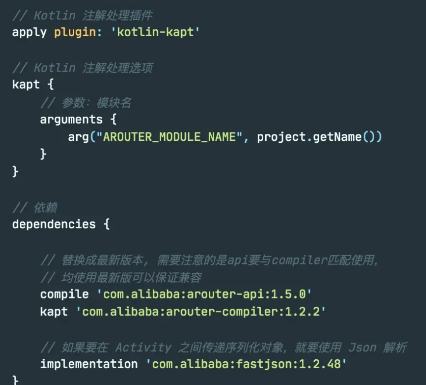

声明路径

- 使用 ARouter 要用 `@Route` 注解声明跳转目标的路径，在这里要注意，最前面的斜杠是不能少的，而且路径至少有两级。
- group 是可选的，ARouter 内部会对 path 进行分组，以下面这段代码为例，如果不传 group 的话，那 ARouter 会把 goods 作为该路径的 group ，否则 taobao 就是该路径所属的 group 。
  - 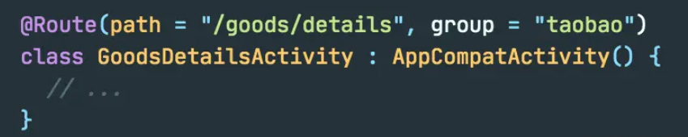

初始化ARouter

- 打印日志和开启调试模式必须写 在init() 之前，否则这些配置在初始化过程中将无效
  - 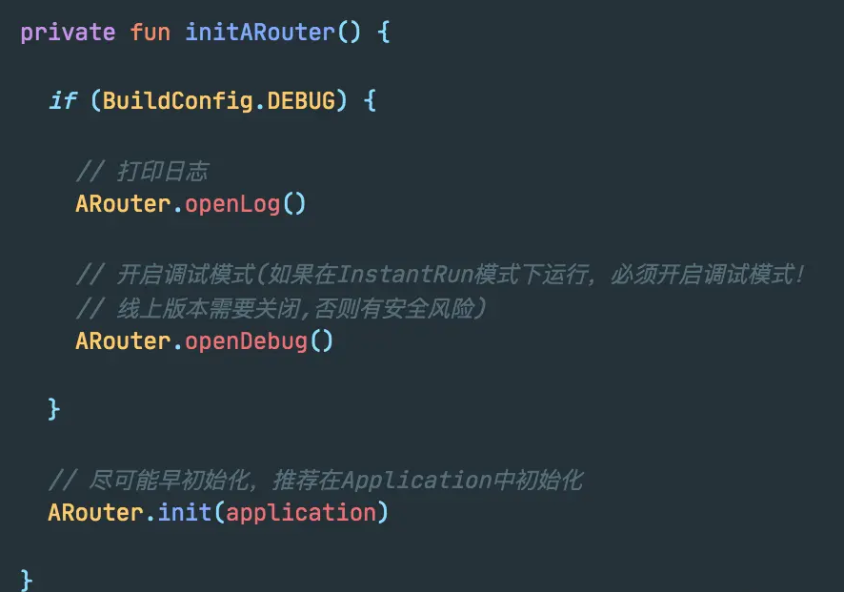

跳转

- 在跳转时，我们也可以传 group，比如这个例子中传了 taobao，那就会跳转到 taobao 分组下的商品详情页，不传的话，就会跳到 goods 分组下的详情页。
  - 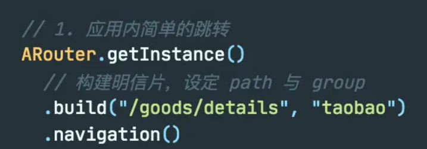

传参

- 跳转并携带参数
  - 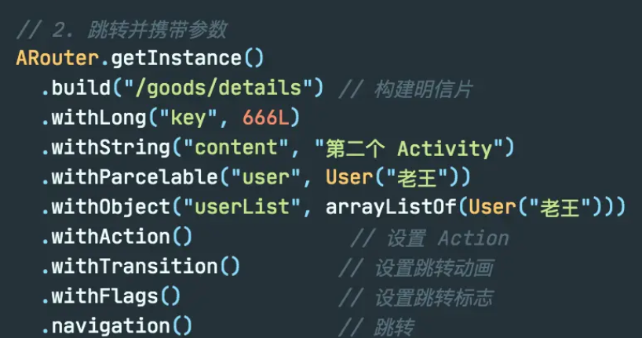

解析参数

- 使用 @Autowired 注解，

  - 需要注意：如果 Activity 或 Fragment 是用 Kotlin 写的，那字段就要加上 `@JvmField`以提供 getter() 和 setter() 给 ARouter 使用。原因：Kotlin 默认的属性是私有的，ARouter 通过反射访问字段时需要 Java 的 getter/setter 或 public 字段。
  - 使用 `withObject()` 传递 List 和 Map 时，接收该对象的地方`不能标注具体的实现类类型`，应声明为 List 或 Map，否则会影响序列化中类型的判断, 其他类似情况需要同样处理。原因：ARouter 反序列化时只认接口类型（如 List/Map），如果你写成 ArrayList/HashMap 可能类型不匹配

  - 

设置专场动画

- ARouter 提供了 withTransition() 方法来设置跳转的转场动画
- 下面是两种方式
  - 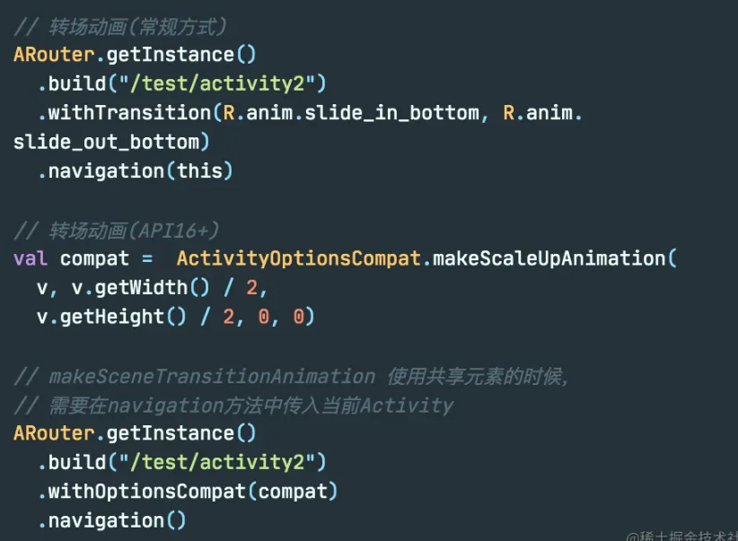

获取Fragment

- 获取 Fragment 时要注意，当找不到对应路径的 Fragment 时，会返回 null，所以这里用空安全的 as? 。
  - 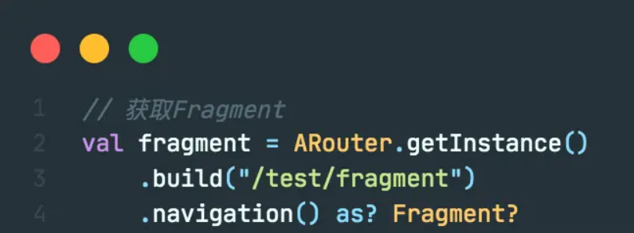

编译失败，或参数异常

- 如果参数注入失败，可以在 ARouter 的源码 AutowiredServiceImpl 的 autowired() 方法打断点，调试具体原因。
-  如果在使用 ARouter 的过程中，出现了编译失败但是不知道原因时，可以用命令查看详细的编译日志 gradle assembleDebug --stacktrace。


### 3.3 基础知识介绍

在讲 ARouter 的路由表生成原理前，我们先来看下在路由表生成和加载过程中非常重要的 `RouteMeta` 与 `Postcard` 。当我们调用 `ARouter.getinstance().build()` 时，其实是在`创建一个明信片 Postcard` 对象，withXXX() 和 navigation() 等方法就是它的方法，Postcard 的 navigation() 方法最终调用的是 _ARouter 的 navigation() 方法，关于 _ARouter 的实现后面会讲

- 我们可以看到这个build方法返回值是一个Postcard对象
  - 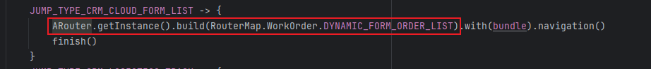
  - 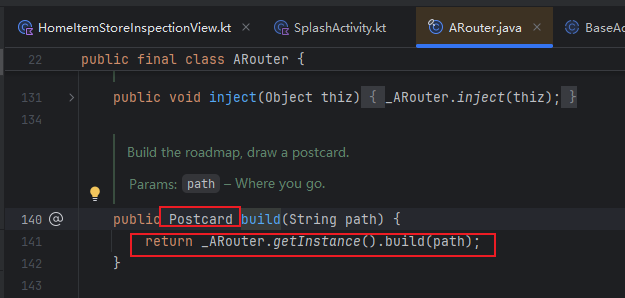

Postcard 包含了在跳转时的传参和动画等信息，它并不继承 RouteMeta，RouteMeta 是路由表的内容。他内部持有 RouteMeta 的信息（通常是通过字段拷贝或引用）。并在其基础上扩展了跳转参数、动画、序列化等功能

好，我们来先看看RouteMeta相关参数

-  参数如下：
  - 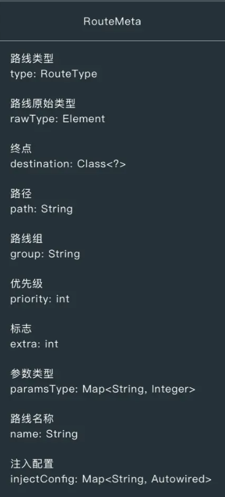
- 路线类型 RouteType 是一个枚举类，有下面几种类型
  - Activity，Service，Provider也就是自定义服务 IProvider；ContentProvider，Fragment等
  - 对应如下：
  - 
-  路由原始类型 rawType 的类型为 Element，关于 Element ，在后面会进一步讲解，这里只需要知道RouteProcessor 通过获取Element去在编译期操作我们的源码
-  终点 destination 就是声明了 @Route 的跳转目标的 Class ，比如目标 Activity 和 Fragment 的 Class
-  路径和路线组：对于 path = /goods/details  ， group = taobao 。路径存放为： /goods/details。 路线组为：taobao
-  优先级在 @Route 中无法设定，是给拦截器用的，priority 的值越小，拦截器的优先级就越高。拦截器链的实现类为 InterceptorServiceImpl，它在调用拦截器的 onInteceptor() 方法时，就是按照 priority 的顺序来获取拦截器，然后逐个调用的。
-  这个 extra 是路由文档 RouteDoc 的标志，可以通过配置他生成路由文档
-  paramsType 也就是参数类型，用来确定我们跳转时传递的参数类型，是一个Map<String, Integer>，前面的String用来存放参数的名称，后面的Integer就是参数类型的标志，比如下面
   -  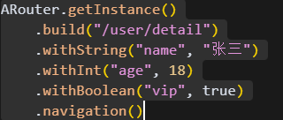
   -  那么他对应的paramsType也就是
   -  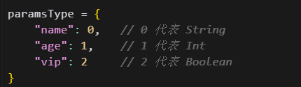
   -  这里的 key 是参数名，value 是类型的枚举值（int）。
-  ok，来看一个我们项目中的
   -  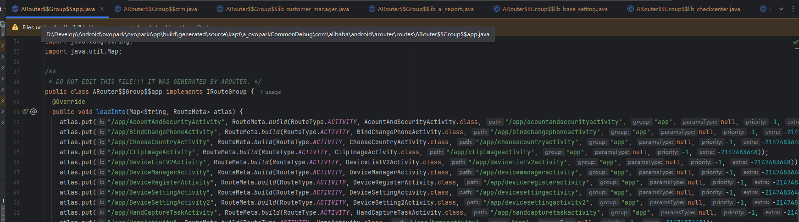
   -  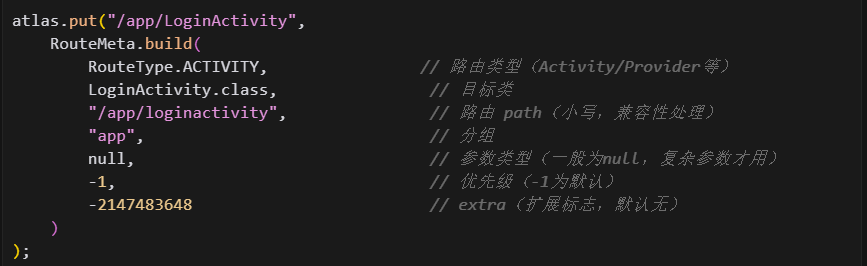

好，接下来我们来看看PostCard

- 参数如下：

  - 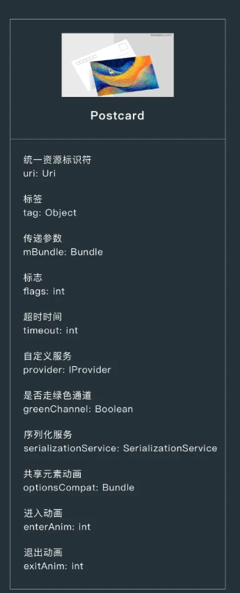

- uri：可以作为路径跳转，但是其实没啥用，不会像你想的那样直接跳转到WebView页

  - 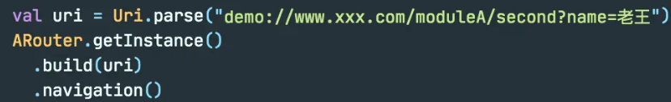
  - 对于我们上面的这个，ARouter 默认情况下只会对路径和参数进行解析，在上面的例子中，路径就是 moduleA/second ，参数为 name=老王。

  > 好，那假如我们想跳转到H5呢？
  >
  > 1.直接传递url参数
  >
  > ```
  > ARouter.getInstance()
  >     .build("/web/common")
  >     .withString("url", "https://www.baidu.com")
  >     .navigation()
  > ```
  >
  > 2.用URI形式
  >
  > 比如你有个H5协议：app://web?url=https://www.baidu.com
  >
  > 你可以自定义 PathReplaceService，把 app://web?url=xxx 映射到 /web/common 路由，并提取 url 参数，不好玩。

- tag ：tag 字段就是用来传递拦截器中断时的异常信息的。

  - 拦截器中断时传递的异常信息，最终会通过 Postcard 的 tag 字段传递到跳转回调里，你可以用它来做错误提示、埋点、日志等

- mBundle：我们调用 withString() 等方法设置要传递给跳转目标的数据时，这个数据就是放在 mBundle 中的。

- flags：我们调用 withFlag() 设定 Activity 的启动标志时，这个标志就会赋值给 flags 字段

- timeout：超时时间，拦截器链处理跳转事件是放在 CountDownLatch 中执行的，超时时间默认为 300 秒，也就是 5 分钟，所以我们在拦截器中不要进行时间太长的耗时操作

- provider：Provider其实就是服务接口

  - 比如：这里定义了服务接口

  - ```
    / 定义服务接口
    interface IUserService : IProvider {
        fun getUserName(): String
    }
    
    // 实现服务并注册路由
    @Route(path = "/service/userA")
    class UserServiceImpl : IUserService {
        override fun getUserName() = "张三"
        override fun init(context: Context?) {}
    }
    
    // 实现服务并注册路由
    @Route(path = "/service/userB")
    class UserServiceImpl : IUserService {
        override fun getUserName() = "李四"
        override fun init(context: Context?) {}
    }
    ```

  - 然后其他模块使用

  - ```
    val userService = ARouter.getInstance().build("/service/userA").navigation() as IUserService
    val name = userService?.getUserName()
    ```

  - 他本质上是：创建了一个实例，然后通过Postcard传送引用

  - ARouter 在 navigation 过程中，发现目标是 Provider 类型时，会通过反射创建（或复用单例）Provider 实例。

  - 这个实例会被设置到 Postcard 的 provider 字段。

  - Postcard 作为“跳转请求”的载体，把 Provider 实例传递到需要的地方（比如自动注入、回调等）。

  > 我们来看看普通的回调接口：通常是你发起一个操作（如网络请求），传入一个回调接口（Callback），等操作完成后回调通知你，此时需要逐层传递，A调B，B调C，每一层都要传递回调对象。
  >
  > 当你定义一个服务接口（如 IUserService），在任意地方通过 ARouter 获取实现，无需逐层传递，他高度解耦，因为它自己去找，去生成，去传递，相当于从一个中间仓库中拿到了。

- greenChannel：绿色通道，就是不会被拦截器链处理的通道，如果我们想让某个跳转操作跳过拦截器，可以在 navigation() 前调用 greenChannel() 方法。

- SerializationService：全局唯一的JSON转换服务实例

  - 在 ARouter 跳转时，通常只能通过 withString()、withInt() 等方法传递基本类型或字符串。
  - 如果你想传递自定义对象（比如 List、Map、Bean），就需要用 withObject() 方法。
  - 发送页
    - 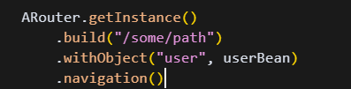
  - 接收页
    - 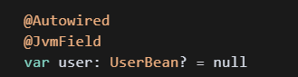
  - SerializationService实例
    - 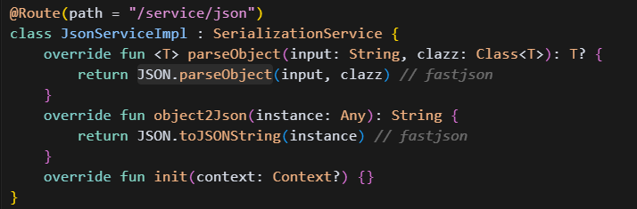
    - 接收一个JSON，通过反射将其转换为对应的类。to JSOn则是很容易，正常转换就行，不需要其类信息进行反射
  - 他等价于你在传递的位置用 JSON.toJSONString转换对象为JSON，然后传递 userBean 的类型，然后接收的位置用 JSON.parseObject，解析为userBean，他的作用是自动化转换，不用你手搓。
  - 把一个对象（如 UserBean）转成 JSON 字符串。只需要对象本身，不需要额外的类型信息。因为对象里已经包含了所有字段和值
  - 把 JSON 字符串还原成对象。则必须知道目标对象的类型（如 UserBean::class.java），否则无法确定要生成什么类型的对象。因为JSON 字符串只是数据，没有类型信息，反射时需要告诉 JSON 库“我要还原成哪个类”

好，我看了这么多，现在我不理解了：

- 你说：Postcard 包含了在跳转时的传参和动画等信息，它并不继承 RouteMeta，RouteMeta 是路由表的内容。他内部持有 RouteMeta 的信息（通常是通过字段拷贝或引用）。并在其基础上扩展了跳转参数、动画、序列化等功能 。      
- 我看见了跳转参数，动画，序列化等功能，但是我没看见的是：他怎么有RouteMeta路由信息，也就是路径信息呢？
- 这是因为：Postcard 在跳转流程中会被“补全”路由信息，
- 在 ARouter 跳转流程中，会调用 LogisticsCenter.completion(postcard)。这个方法会根据 path 查找路由表，找到 RouteMeta。然后会把 RouteMeta 里的 destination（目标 class）、type（类型）等信息赋值到 Postcard 的内部字段（有的实现是直接加字段，有的实现是通过 setDestination、setType 等方法


### 3.4 ARouter 路由表生成原理

首先是注解的处理流程？我们进行编译，何时到了处理注解的时候？

- 来看这张图，首先是由 Android Gradle 的 AndroidJavaCompiler 来发起编译操作，然后让 Javac 去调用 RouteProcessor 等注解处理器对注解进行处理的。
  - 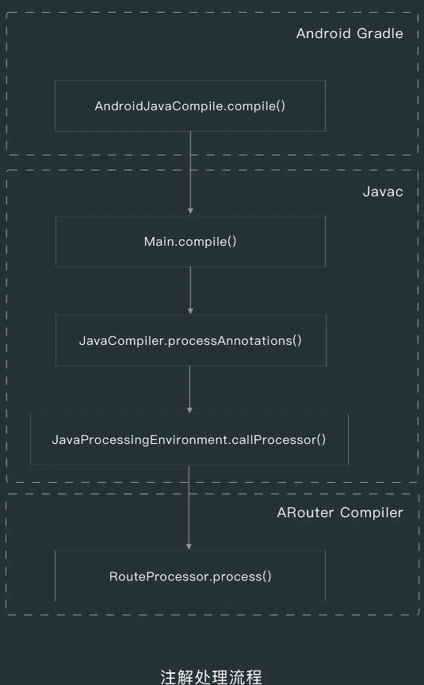

然后是路由解析流程，也就是 RouteProcessor 注解处理器调用process的处理流程

- 可以看到，分为下面四个流程：获取路由元素Element，创建路由元信息，把路由元信息进行分组，通过JavaPoet生成路由文件
  - 

- 好，首先是获取路由元素
  - 这里的元素指的是 javax 包中的 Element ，Element 就是 Java 编译器在“理解”你的代码时，对每个结构（类、方法、字段等）做的一个“代表对象”
  - process() 方法会接收到 annotations 和 roundEnv 两个参数，RouteProcessor 在处理注解时可以通过roundEnv.getElementsAnnotatedWith(annotation ) 方法正确获取元素。
  - 像是下面的代码
  - 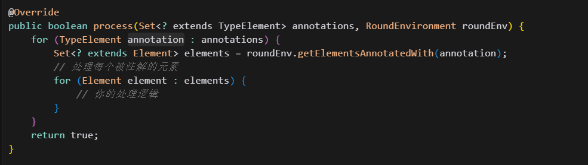
- 然后是创建路由元信息RoutMeta，我们可以看到下面的按照对应的类型创建路由元信息
  - 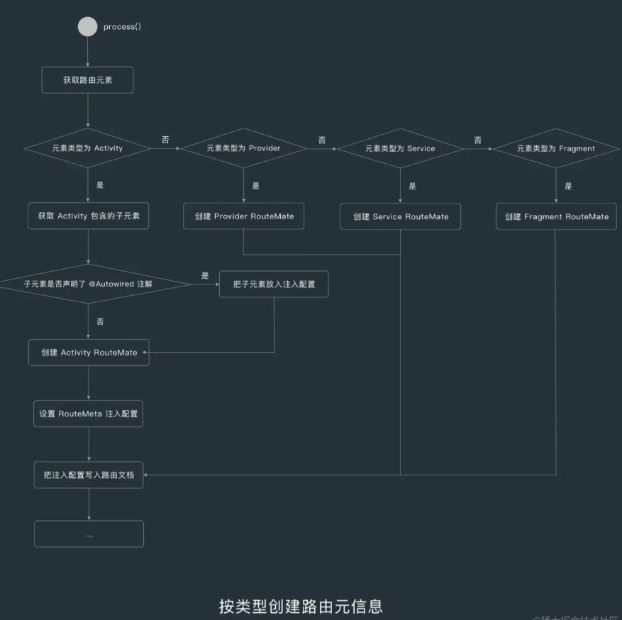
  - 这里说的路由元信息指的是 RouteMeta，每找到一个被 @Route 注解的类，就创建一个对应的 RouteMeta 实例，把这个类的信息填进去
  - 如果这个类是 Activity，RouteProcessor 会遍历它的成员变量（比如字段），把需要注入的参数收集起来，放到 RouteMeta 的 injectConfig 字段里。
- 接着是把路由元信息放入分组
  - 在 RouteProcessor 中有一个 groupMap，在 RouteMeta 创建好后，RouteProcessor 会把不同的 RouteMeta 进行分组，放入到 groupMap 中（没懂）
- 最后是生成路由表，我们可以看到执行下面的任务，生成三种类型的类文件
  - 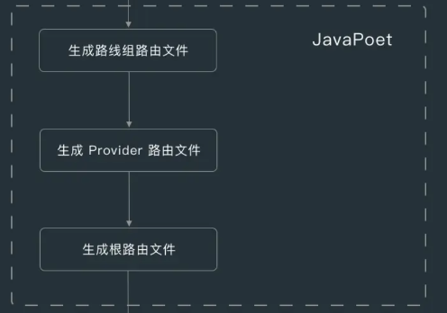
  - 当 RouteProcessor 把 RouteMeta 分组好后，就会用 JavaPoet 生成 Group、Provider 和 Root 路由文件，路由表就是由这些文件组成的，JavaPoet 是 Square 开源的代码生成框架。
  - 生成路由文件后，物流中心 LogisticsCenter 需要用这些文件来填充仓库 Warehouse 中的 routes 和 providerIndex 等索引，然后在跳转时根据 routes 和索引来跳转。这个具体我们后面再说。
  - 我们先来看看这些路由文件
  - 首先是Group路由文件：
    - 其实就是一堆 Java 类，实现了特定接口（比如 IRouteGroup），在类的 loadInto(Map<String, RouteMeta> atlas) 方法里，把所有路由信息注册到 Map 里
    - 
    - 这里创建RouteMeta，参数如下
    - 
  - 然后来看看root路由文件，每个模块/分组会生成一个 Root 文件，类名一般是 ARouter$$Root$$分组名
    - 看看项目中的这个
    - 这行代码的意思是：把分组名和分组路由表类注册到 Map 里。
    - 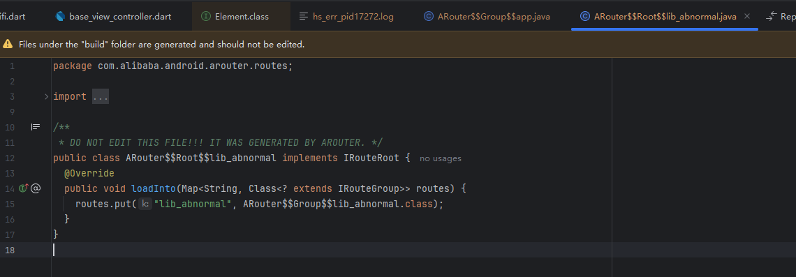
  - 然后来看看provider路由文件
    - 是把本分组下所有 Provider 注册到 providers 这个 Map 里。
    - 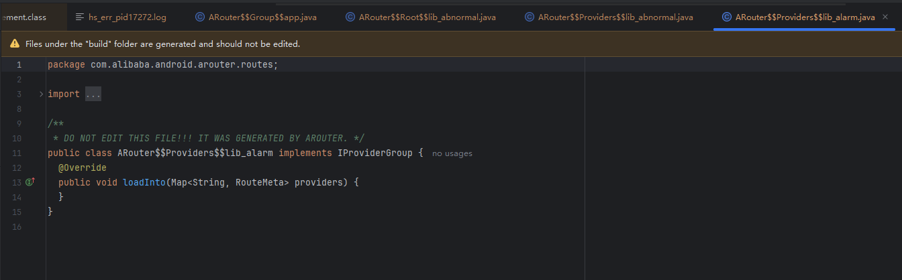

### 3.5 路由表加载原理

路由表是由注解处理器（RouteProcessor）在编译期生成的类文件，加载路由表，其实就是`加载 RouteProcessor 生成的类文件`。路由表的加载有两种方式：插件加载和 Dex 加载。

ARouter.init() → LogisticsCenter.init()，在 LogisticsCenter 的 init() 方法中，会判断当前路由表加载方式是否为插件，不是的话则`从 Dex 中加载路由表`，是的话则`由插件从 Jar 中加载路由表`。

> 这个判断，我们过会再说

好，现在我们先来看看Dex加载路由表

- 原理：在运行时调用ClassUtils 扫描 apk 的 dex 文件，找到所有 ARouter 注解处理器生成的路由表类，然后通过反射加载创建这些类，把路由信息注册保存到索引中
  - 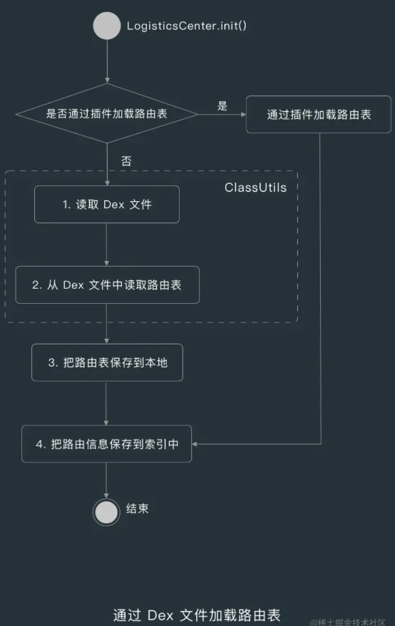
- 读取 Dex 文件：通过 applicationInfo.sourceDir 获取 apk 路径；用 DexFile(path) 读取 apk 的 dex 文件。
- 从 Dex 文件中读取路由表：使用ClassUtils扫描dex文件，遍历 dex 中所有类名；找出包名为 com.alibaba.android.arouter.routes 的类（这些是注解处理器生成的路由表类）；收集所有匹配的类名，返回给 LogisticsCenter。

> Dex文件如下：将apk文件后缀名改为zip并解压后可以看到很多dex文件
>
> - 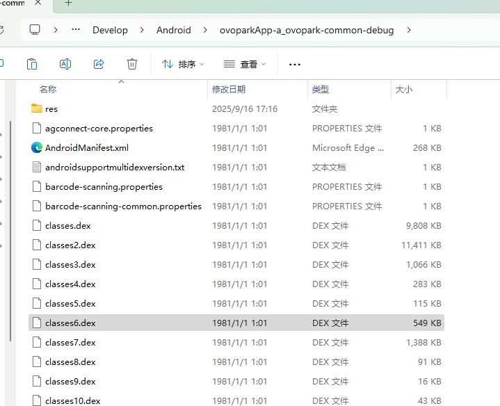
>
> - 他们是二进制文件
>
>   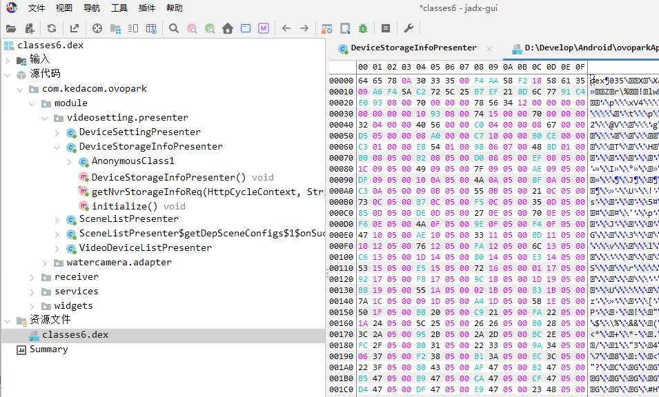
>
> - 我们可以通过jadx反编译他，可以看到里面实际的代码
>
> - 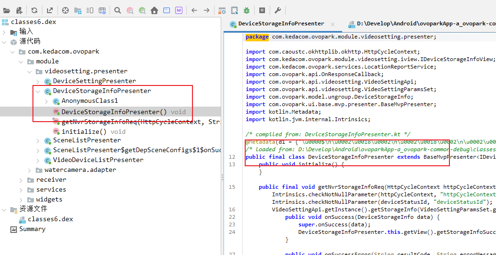
>
> - 可以看到，这里没有包名为 com.alibaba.android.arouter.routes 。
>
> - 我们可以看到dex最多60多个，文件还不少，应该包含了我们项目中的所有的类，可以想象，如果加载中使用ClassUtils 一个个扫描，得有多慢。
>
> - 

- 把路由表保存到本地：将这些类名保存到 SharedPreferences；下次启动时，如果 app 版本没变，直接从本地加载，无需再遍历 dex
- 把路由信息保存到索引中：
  - 遍历所有类名，根据类名后缀判断类型（如 IRouteRoot、IInterceptorGroup、IProviderGroup）
  - 通过反射实例化这些类，并将其内容加载到 ARouter 的全局索引（如路由表、拦截器表、Provider 表）中
- 部分细节：
  - ClassUtils 作用：负责 dex 文件的读取和类名筛选。
  - 缓存优化：第一次启动时会扫描 dex，后续启动直接用 SharedPreferences 缓存，提升性能

那么如果是插件模式加载，它是如何处理的呢？

- 插件加载路由表本质是：借由ARouter Register 插件在编译期扫描+插桩，把所有路由表类名写死到初始化代码，避免运行时扫描，极大提升性能。
- 首先引入插件：apply plugin: 'com.alibaba.arouter'，并添加 arouter-register 依赖
  - 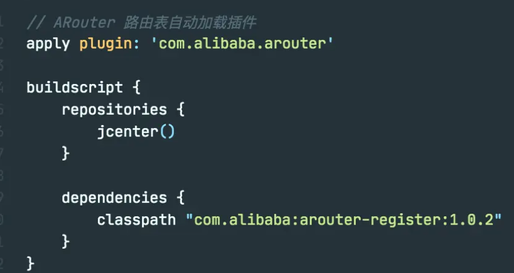

- 这是执行过程

  - 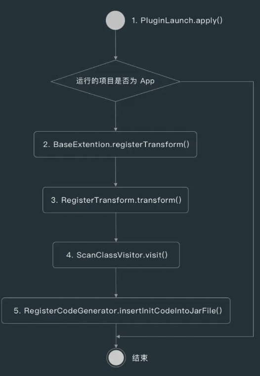

- 插件执行入口

  - Gradle 构建时，PluginLaunch.apply() 被调用，判断当前项目是否为 Application 类型，只有 App 模块才会执行后续流程

- 注册Transform

  - 插件调用 BaseExtention.registerTransform() 注册了一个自定义的 Transform（RegisterTransform）。

  - Transform 是 Android Gradle Plugin 提供的编译期字节码处理扩展点

- Transform执行

  - Gradle 执行到 TransformTask 时，调用 RegisterTransform.transform()。

  - 这里会拿到所有编译产物（包括 jar 和 class 文件）

- 字节码扫描

  - RegisterTransform.transform()会调用ScanClassVisitor.visit() 遍历所有 class 文件的字节码。

  - 找到所有实现了 IRouteRoot、IInterceptorGroup、IProviderGroup 接口的类（即注解处理器生成的路由表类）。

  - 把这些类名收集到 ScanSetting.classList

- 字节码插桩

  - RegisterCodeGenerator.insertInitCodeIntoJarFile() 把收集到的路由表类名插入到 LogisticsCenter 的 loadRouterMap() 方法中。

  - 这样，ARouter 初始化时直接调用 loadRouterMap()，就能一次性注册所有路由表，无需再扫描 dex

- 最后的产物

  - 插桩后的 jar 路径一般在 build/intermediates/transforms/com.alibaba.arouter/debug/xxx.jar

### 3.6 ARouter跳转原理

当我们调用 Postcard 的 `navigation()` 方法时，Postcard 会调用 _ARouter 的 navigation() 方法，然后 _ARouter 才会去`加载路由表`，下面看下 navigation() 的处理流程。

- 对应下面的navigation
  - 

navigation概览

- _ARouter 的 navigation() 首先会根据我们实现的`预处理服务`，判断是否继续往下处理，不往下处理则中断跳转流程。
- 如果预处理服务返回的是 `true` ，那么 navigation() 方法就会`加载路由表`，把 `RouteMeta` 的信息填充到 Postcard 中来完善明信片，比如终点 `destination` 等信息，这个操作是由物流中心 `LogisticsCenter` 做的。
- 假如 LogisticsCenter 在完善明信片的过程中`遇到了异常`，比如找不到路径对应的目标，那么就会`调用降级策略`，我们可以在降级策略中显示错误提示等信息。
- 在明信片完善信息后，navigation() 就会把跳转事件交给拦截器链处理；
- 在拦截器链处理完成，并且没有中断跳转时，navigation() 就会按照路径类型跳转到不同的页面或调用自定义服务；
  - 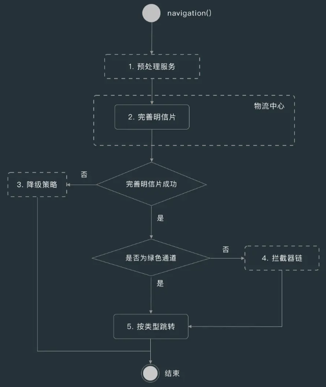

ok，我们来看第一步：预处理服务

- 在 navigation() 中，首先会调用预处理服务的 onPretreamtn() 方法，判断是否要继续往下处理，如果返回结果为 false ，则不再往下处理，也就是不会进行跳转等操作。
  - 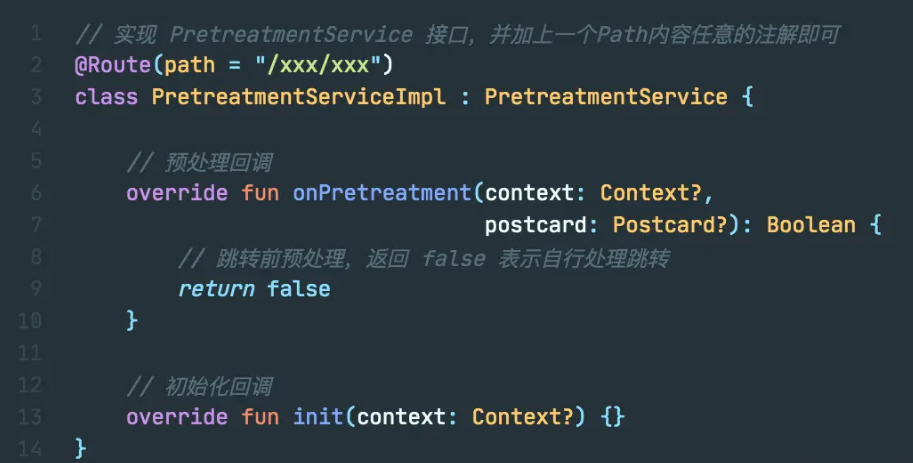

看看第二步：完善明信片

- 调用完预处理服务后，_ARouter 会尝试先获取路由信息来完善明信片。

> 好，这里要用RouteMeta完善明信片，因此我们首先要去仓库的routes中找到对应的RouteMeta。但是ARouter为了节省内存和初始化时间，只有在用到RouteMeta的时候才会去加载。我们该怎么理解这个机制？
>
> 首先，这是仓库
>
> - 我们只用看关键的两个：groupIndex（Map<String, Class<? extends IRouteGroup>>）和routes（Map<String, RouteMeta>），他们一个存放实现IRouteGroup接口的类的映射，一个存放RouteMeta的映射
>   - 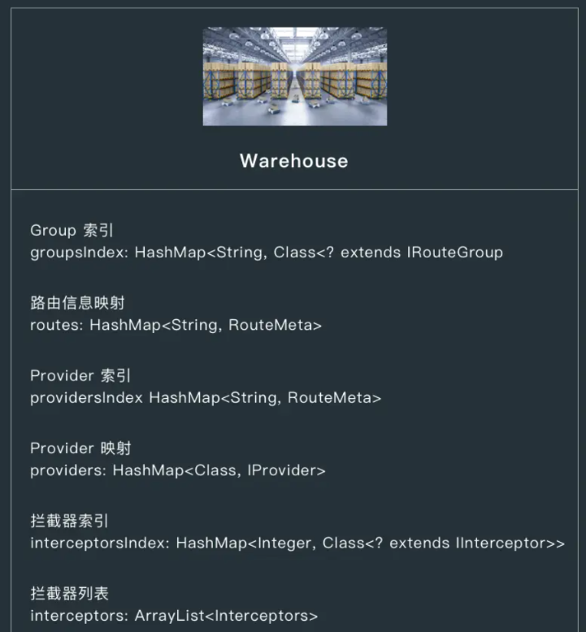
>
> 要理解这两个，我们得回过头去看路由表加载的过程
>
> - 我们可以看到这是 ARouter 注解处理器为 group "app" 生成的路由表类，实现了 IRouteGroup 接口。里面的 loadInto 方法会把本 group 下所有 path 的路由元信息（RouteMeta）填充到传入的 Map 里
>
>   - 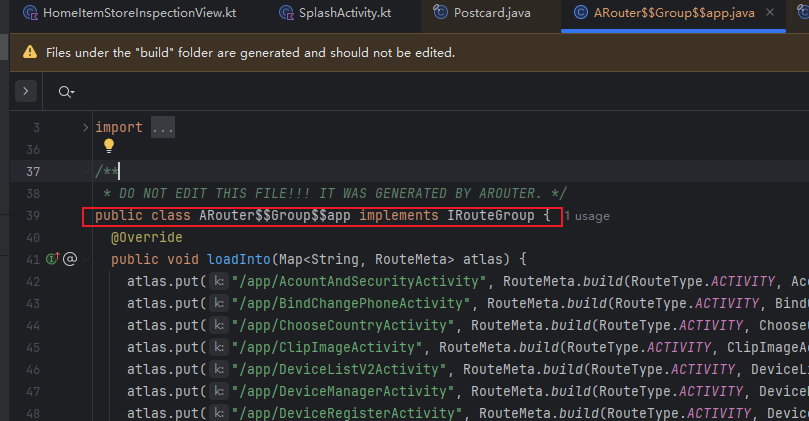
>
> - 初始化时，ARouter 只会把所有 group 路由表类注册到 groupIndex（比如 "app" -> ARouter$$Group$$app.class）
>
> - 路由跳转时
>
>   - 比如你跳转到 /app/acountandsecurityactivity，ARouter 首先会在 routes 里查找这个 path。
>
>   - 如果没有命中，就会根据 path 得到 group（这里是 "app"），然后在 groupIndex 里查找 "app" 对应的 class（即 ARouter$$Group$$app.class）。
>
>   - 通过反射实例化这个 class，得到 IRouteGroup 实例。
>
>   - 调用其 loadInto(routes) 方法，把该 group 下所有 path 的 RouteMeta 都填充到 routes 里。
>
>   - 之后再查 routes，就能命中 /app/acountandsecurityactivity，拿到对应的 RouteMeta
>
> - 这么处理是因为其懒加载机制，只有用到某个 group 的 path 时，才会实例化并加载该 group 的所有 RouteMeta。这样可以节省内存和初始化时间

- ok，获取到路由信息了，然后是填充明信片
  - 我们在调用 ARouter.getInstance().build() 方法时，就是创建了一张 Postcard，但是这张 Postcard 的信息是不完整的。
  - 比如 Postcard 中有一个 destination 字段，destination 表示跳转目标的 Class 信息，跳转 Activity 要用 Intent，destination 就是 Intent 的构造函数的第二个参数。
  - 而 LogisticsCenter 就要负责把从路由表获取到的 destination 信息填充到这张明信片中，有了一张信息完整的明信片，才能进行后续的跳转操作
- 填充完后是额外处理（没理解，什么是provider？Fragment为什么也是这样创建？）
  - 填充完了 Postcard 的信息后，LogisticsCenter 会根据 Postcard 的类型来做不同的操作，如果是 Provider 的话，就会调用 Provider 的初始化方法，并且把 Postcard 设为绿色通道。
  - 如果是 Fragment 的话，那就只把 Postcard 设为绿色通道，如果是其他类型，则不设为绿色通道，这里说的绿色通道，其实就是说 Provider 和 Fragment 是跳过拦截器链的。

ok，我们来看第三步：降级处理

- 所谓的降级策略，其实就是构建明信片失败时，无法跳转到期待的页面时让我们能够跳转到别的页面，比如一个跳转失败提示页。
- 在构建失败后，会调用DegradeService.lost()方法，最终调用下面的onLost
  - 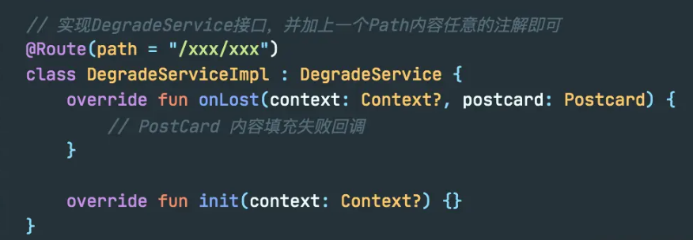

我们再来看看第四步：拦截器

- 拦截器用于在路由跳转前做一些处理，比如：登录校验、埋点、参数校验、权限检查、弹窗等。拦截器可以有多个，按 priority（优先级）从小到大依次执行。

- 实现拦截器：拦截器需要实现 IInterceptor 接口，并用 @Interceptor 注解标记

  - 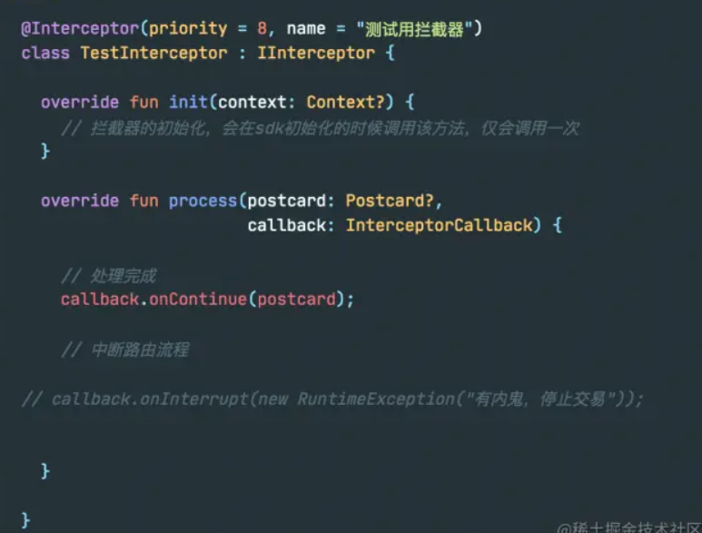
  - init(context: Context?)：拦截器的初始化方法，只会调用一次，通常用于准备资源。

  - process(postcard: Postcard?, callback: InterceptorCallback)：核心处理方法，每次路由跳转都会调用。

  - 你必须在process中调用 callback.onContinue(postcard) 或 callback.onInterrupt(Throwable)，否则路由不会继续
    - onContinue(postcard)：表示拦截器处理完成，继续执行下一个拦截器或最终的路由跳转
    - onInterrupt(Throwable)：表示拦截器中断路由流程，后续拦截器和目标页面都不会执行。可以传递异常信息，供后续处理

- 如果有多个拦截器，只有全部 onContinue 后才会真正跳转；只要有一个 onInterrupt，路由就会被中断

- navigation() 在完善 Postcard 信息后，就会判断该 Postcard 是否通过绿色通道来处理，绿色通道就是不经过拦截器链的通道。在 LogisticsCenter 的 completion() 中会把路由类型为 Provider 和 Fragment 的路线设为绿色通道，如果我们想让目标页面跳过拦截器链，就可以在 navigation() 方法前调用 greenChannel() 方法。

我们来看第五步：按类型跳转

- 当处理完拦截器后，navigation() 中就会调用 _navigation() 方法，这也是具体进行跳转的方法，在这个方法中，会根据 Postcard 的路由类型 RouteType 来判断怎么跳转。
  - 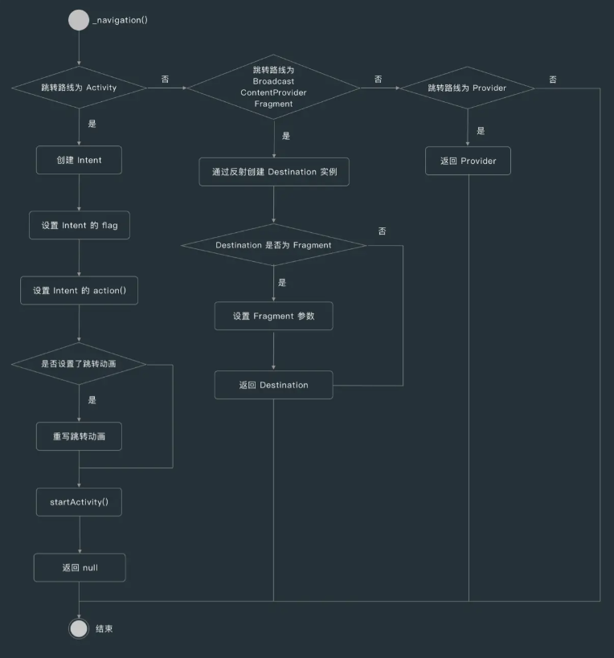
- activity:当 RouteType 为 Activity 时，启动 Activity 的流程和我们平时启动 Activity 的流程是一样的，创建 Intent、传入 destination、设置 fragment 和重写动画等，最终调用 startActivity() 启动目标页面
- 当跳转目标为 Fragment、Broadcast 或 ContentProvider 时，会通过 destination 用反射创建实例，如果是 Framgent ARouter 还会为它设置要传递给目标 Fragment 的参数，然后返回实例
- 如果跳转目标为 Provider，也就是自定义服务的话，就对应了前面讲 ARouter 自定义服务时讲的“通过依赖查找发现服务”

最后是第六步：跳转回调

- 在调用 navigation() 跳转时，我们可以在 navigation() 中传入 NavigationCallback 监听跳转过程中发生的事件。
  - onLost()：无法查找到跳转目标；
  - onFound()：找到了跳转目标；
  - onInterrupt()：拦截器中断了跳转；
  - onArrival()：已打开跳转目标
  - 
- 除了 NavigationCallback ，我们也可以用 NavCallback 监听跳转中发生的事件，NavCallback 是 ARouter 中实现了 NavigationCallback 的一个抽象类，使用 NavCallback 不会强制要求我们重写所有方法，只要求重写 onArrival() 方法
  - 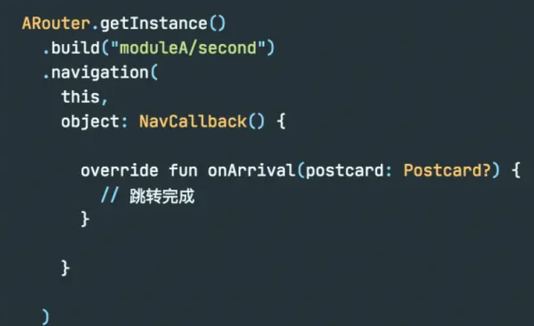
- 好，这是整个的回调的触发时机
  - 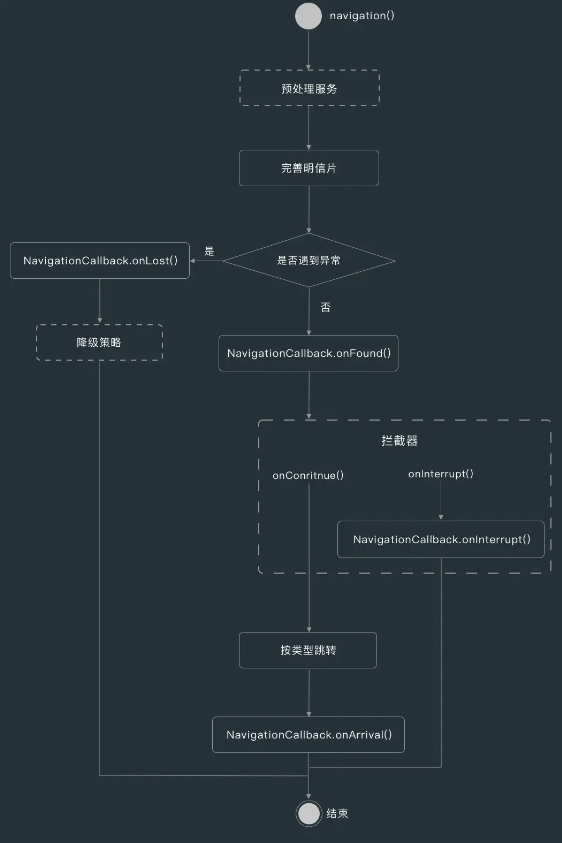

## 04.底层原理


## 05.深度思考

### 5.1 关键问题探究


### 5.2 设计对比


## 06.实践验证

### 6.1 行为验证代码


### 6.2 性能测试


## 07.应用场景

### 7.1 最佳实践


### 7.2 使用禁忌


## 08.总结提炼

### 8.1 核心收获


### 8.2 知识图谱


### 8.3 延伸思考


## 09.参考资料

1. [探索 ARouter 原理](https://juejin.cn/post/6885932290615509000#heading-63)
2. []()
3. []()

## 其他介绍

### 01.关于我的博客

- csdn：http://my.csdn.net/qq_35829566

- 掘金：https://juejin.im/user/499639464759898

- github：https://github.com/jjjjjjava

- 邮箱：[934137388@qq.com]

