[toc]

## 前言

> 学习要符合如下的标准化链条：了解概念->探究原理->深入思考->总结提炼->底层实现->延伸应用"

## 01.学习概述

- **学习主题**：
- **知识类型**：
  - [ ] ✅Android/ 
    - [ ] ✅01.基础组件与机制 
      - [ ] ✅四大组件
      - [ ] ✅IPC机制
      - [ ] ✅消息机制
      - [ ] ✅事件分发机制
      - [ ] ✅View与渲染体系（含Window、复杂控件、动画）
      - [ ] ✅存储与数据安全（SharedPreferences/DataStore/Room/Scoped Storage）
    - [ ] ✅02. 架构与工程化
      - [ ] ✅架构模式（MVC/MVP/MVVM/MVI）
      - [ ] ✅依赖注入（Koin/Hilt/Dagger）
      - [x] ✅路由与模块化（ARouter、Navigation）
      - [ ] ✅Gradle与构建优化
      - [ ] ✅插件化与动态化
      - [ ] ✅插桩与监控框架
    - [ ] ✅03.性能优化与故障诊断
      - [ ] ✅ANR分析与优化
      - [ ] ✅启动耗时优化
      - [ ] ✅内存泄漏监控
      - [ ] ✅监控与诊断工具
    - [ ] ✅04.Jetpack与生态框架
      - [ ] ✅Room
      - [ ] ✅Paging
      - [ ] ✅WorkManager
      - [ ] ✅Compose
    - [ ] ✅05.Framework与系统机制
      - [ ] ✅ActivityManagerService (含ANR触发机制)
      - [ ] ✅Binder机制
  - [ ] ✅音视频开发/
    - [ ] ✅01.基础知识
    - [ ] ✅02.OpenGL渲染视频
    - [ ] ✅03.FFmpeg音视频解码
  - [ ] ✅ Java/
    - [ ] ✅01.基础知识
    - [ ] ✅02.集合框架
    - [ ] ✅03.异常处理
    - [ ] ✅04.多线程与并发
    - [ ] ✅06.JVM
  - [ ] ✅ Kotlin/
    - [ ] ✅01.基础语法
    - [ ] ✅02.高阶扩展
    - [ ] ✅03.协程和流
  - [ ] ✅ Flutter/
    - [ ] ✅01.基础基础语法
    - [ ] ✅02.状态管理
    - [ ] ✅03.路由与依赖注入
    - [ ] ✅04.原生通信
  - [ ] ✅ 自我管理/
    - [ ] ✅01.内观
  - [ ] ✅ 项目经验/
    - [ ] ✅01.启动逻辑
    - [ ] ✅02.云值守
    - [ ] ✅03.智控平台
- **学习来源**：
- **重要程度**：⭐⭐⭐⭐⭐
- **学习日期**：2025.
- **记录人**：@panruiqi

### 1.1 学习目标

- 了解概念->探究原理->深入思考->总结提炼->底层实现->延伸应用"

### 1.2 前置知识

- [ ] 

## 02.核心概念

### 2.1 是什么？

ARouter 是阿里巴巴开源的 Android 路由框架。核心就是用于实现页面跳转

### 2.2 解决什么问题？

问题一：灵活性 —— 运营动态配置页面跳转

- 传统方式：startActivity(Intent(this, GoodsDetailActivity::class.java))
- 问题：代码写死了目标页面，运营无法动态下发
- ARouter 方式：ARouter.build("/goods/detail").navigation()
- 好处：后台下发路径字符串即可，App 不用改代码

问题二：解耦 —— 组件化/插件化的前提

- 传统方式：模块 A 要跳转到模块 B，必须依赖模块 B
- 问题：模块间形成强依赖，无法独立编译、独立运行
- ARouter 方式：模块 A 只需要知道路径 /moduleB/xxx，不需要依赖模块 B
- 好处：模块间通过"路径"通信，彻底解耦

### 2.3 三大核心流程

ARouter 的工作可以拆成三步，你可以把它想象成"快递系统"：

|    阶段    |   快递系统类比   |     核心组件 / 负责人      |       执行时机       |
| :--------: | :--------------: | :------------------------: | :------------------: |
| 生成路由表 | 登记所有收件地址 | RouteProcessor（APT 技术） |        编译时        |
| 加载路由表 | 加载地址簿到内存 |      LogisticsCenter       |      App 启动时      |
|  路由跳转  | 根据地址派送快递 |   _ARouter.navigation()    | 运行时（如用户点击） |

### 2.4 RouteMeta 和 Postcard 的区别与关系

|   概念    |        类比        |                    内容                     |             来源              |
| :-------: | :----------------: | :-----------------------------------------: | :---------------------------: |
| RouteMeta | 地址簿里的一条记录 | path、destination (Class)、type、参数类型等 |   编译时生成，存在路由表里    |
| Postcard  |   你填写的快递单   |     path + 要传的参数 + 动画 + flags 等     | 运行时通过 `build()` 方法创建 |

关系：

- 你调用 ARouter.build("/goods/detail") 创建了一张 Postcard（快递单），此时只有 path + 要传的参数 + 动画 + flags 等
- 调用 navigation() 时，LogisticsCenter 会根据 path 从路由表里查到 RouteMeta
- 然后把 RouteMeta 里的 destination (Class)、type 等信息"填充"到 Postcard 里
- 最后根据完整的 Postcard 进行跳转

## 03.基础使用

### 3.1 ARouter基础用法

#### 1. 添加依赖和配置

- 没啥好说的
  - kotlin-kapt，是启用 Kotlin 的注解处理工具（KAPT：Kotlin APT工具），用于处理如 ARouter 这类依赖注解的库。
  - kapt - arguments， 为 ARouter 注解处理器传递参数，指定当前模块的名字（AROUTER_MODULE_NAME），这样 ARouter 能正确生成路由表
  - arouter-api：ARouter 的运行时库，提供核心api。
  - arouter-compiler：ARouter 的注解处理器，编译时生成路由表。
  - 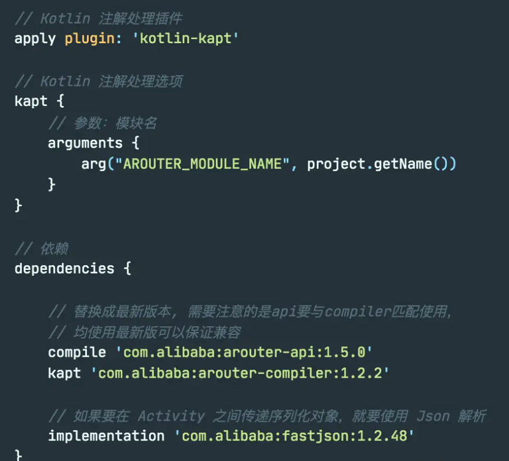

#### 2.声明路径

- 使用 ARouter 要用 `@Route` 注解声明跳转目标的路径，在这里要注意，最前面的斜杠是不能少的，而且路径至少有两级。
- group 是可选的，ARouter 内部会对 path 进行分组，以下面这段代码为例，如果不传 group 的话，那 ARouter 会把 goods 作为该路径的 group ，否则 taobao 就是该路径所属的 group 。
  - 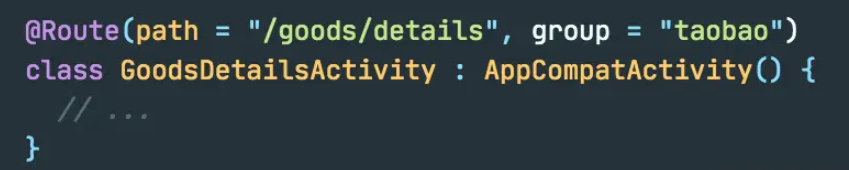

#### 3.初始化ARouter

- 打印日志和开启调试模式必须写 在init() 之前，否则这些配置在初始化过程中将无效
  - 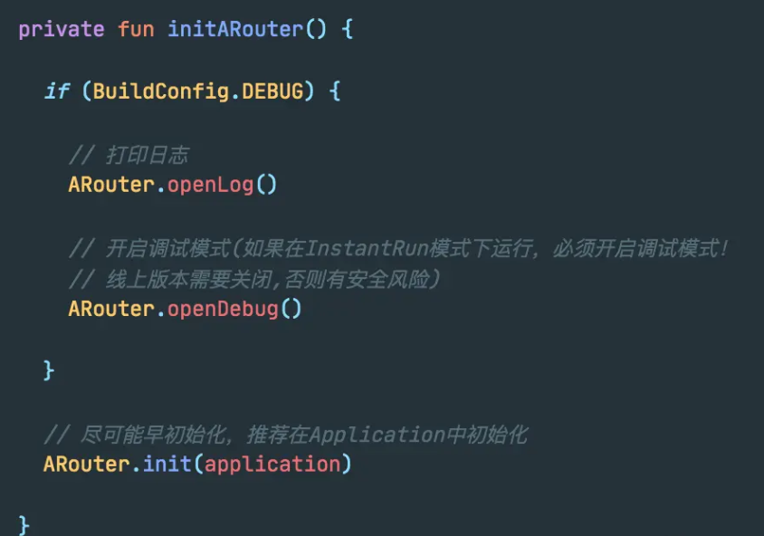

#### 4.跳转

- 在跳转时，我们也可以传 group，比如这个例子中传了 taobao，那就会跳转到 taobao 分组下的商品详情页，不传的话，就会跳到 goods 分组下的详情页。
  - 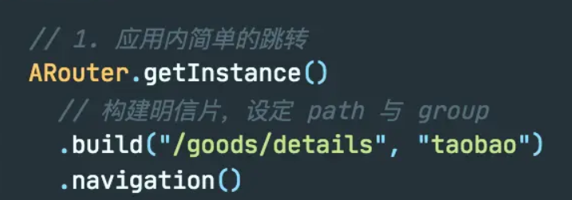

#### 5.传参和解析

- 跳转并携带参数
  
  - 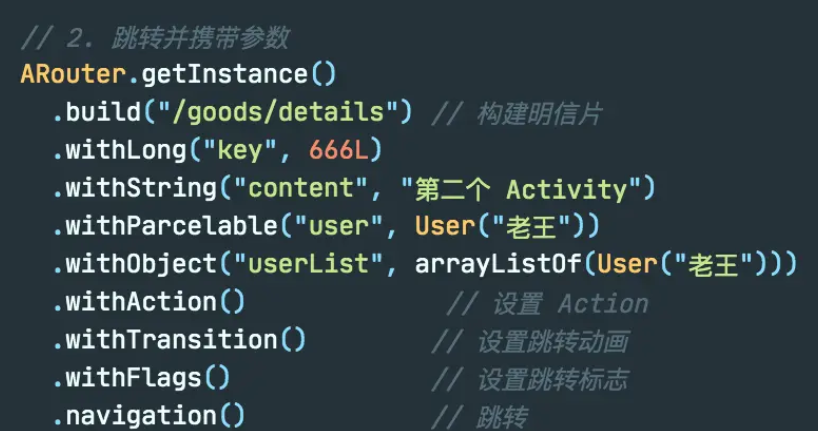
  
  - 但是实际上我们一般直接塞bundle里，如下面
  
  - ```
    val extras = Bundle()
     extras.putString(
        Constants.Prefs.TRANSIT_ID,
        bean.objectId.toString()
     )
    ARouter.getInstance().build(RouterMap.SignModule.ACTIVITY_SIGN_DETAIL)
        .withFlags(Intent.FLAG_ACTIVITY_NEW_TASK).with(extras).navigation()
    ```
  
- 解析参数：直接从bundle中拿

  - ```
     Intent intent = getIntent();
     if (intent != null) {
         Bundle bundle = intent.getExtras();
         if (bundle != null) {
               entityIntent = bundle.getSerializable(KEY_APPLY_ENTITY) as? UserApplyEntity 
         }
     }      
    ```

#### 6.设置转场动画

- ARouter 提供了 withTransition() 方法来设置跳转的转场动画
- 下面是两种方式
  - 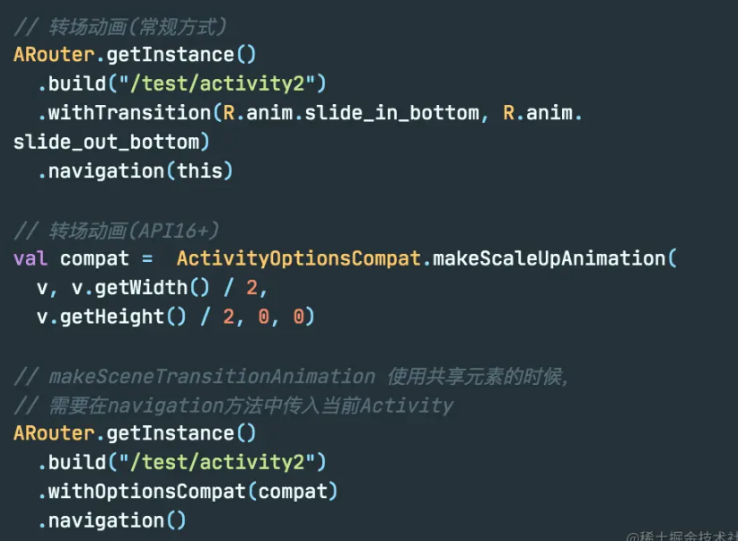

#### 7.获取Fragment

- 获取 Fragment 时要注意，当找不到对应路径的 Fragment 时，会返回 null，所以这里用空安全的 as? 。
  - 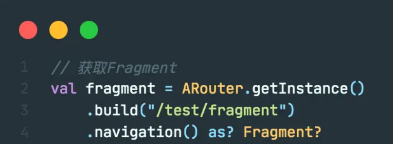


### 3.2 基础知识介绍

在讲 ARouter 的路由表生成原理前，我们先来看下在路由表生成和加载过程中非常重要的 `RouteMeta` 与 `Postcard` 。

#### 1.引子

当我们调用 `ARouter.getinstance().build()` 时，其实是在`创建一个明信片 Postcard` 对象，withXXX() 和 navigation() 等方法就是它的方法，Postcard 的 navigation() 方法最终调用的是 _ARouter 的 navigation() 方法，关于 _ARouter 的实现后面会讲

- 我们可以看到这里调用build方法
  - 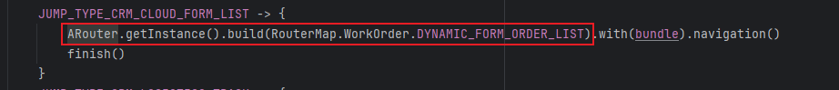
- 这是ARouter中build方法的返回值，是一个Postcard类型对象
  - 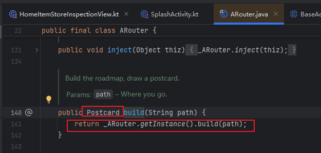

Postcard 包含了在跳转时的传参和动画等信息，它并不继承 RouteMeta，RouteMeta 是路由表的内容。他内部持有 RouteMeta 的信息（通常是通过字段拷贝或引用）。并在其基础上扩展了跳转参数、动画、序列化等功能

#### 2.RouteMeta

好，我们来先看看RouteMeta相关参数

-  参数如下：
   - 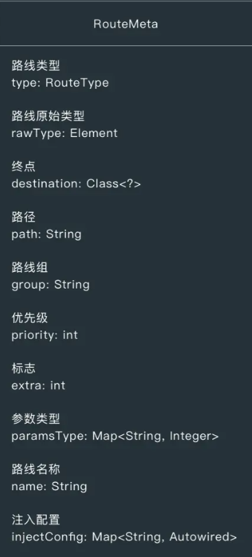
-  路线类型 RouteType 是一个枚举类，有下面几种类型
   - 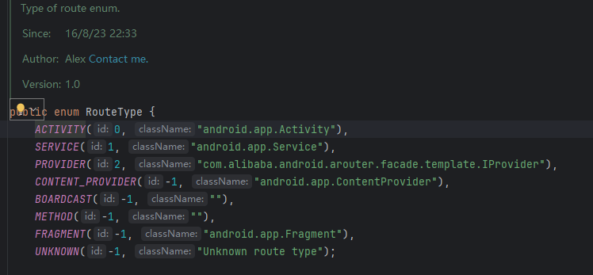
-  路由原始类型 rawType 的类型为 Element，关于 Element ，在后面会进一步讲解，这里只需要知道RouteProcessor 通过获取Element去在编译期操作我们的源码
-  终点 destination ：就是声明了 @Route 的跳转目标的 Class ，比如目标 Activity 和 Fragment 的 Class
-  路径和路线组：对于 path = /goods/details  ， group = taobao 。路径存放为： /goods/details。 路线组为：taobao
-  优先级：在 @Route 中无法设定，是给拦截器用的，priority 的值越小，拦截器的优先级就越高。拦截器链的实现类为 InterceptorServiceImpl，它在调用拦截器的 onInteceptor() 方法时，就是按照 priority 的顺序来获取拦截器，然后逐个调用的。
-  paramsType 参数类型：
-  ok，来看一个我们项目中的
   -  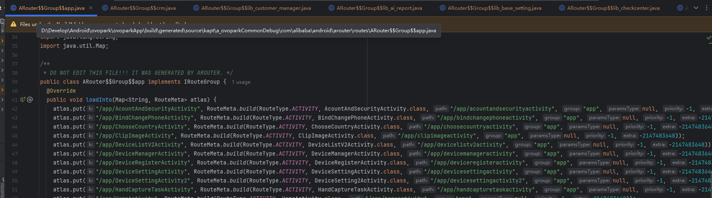
   -  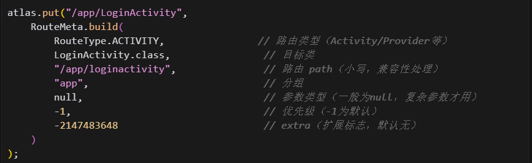

#### 3.PostCard

好，接下来我们来看看PostCard

- 参数如下：

  - 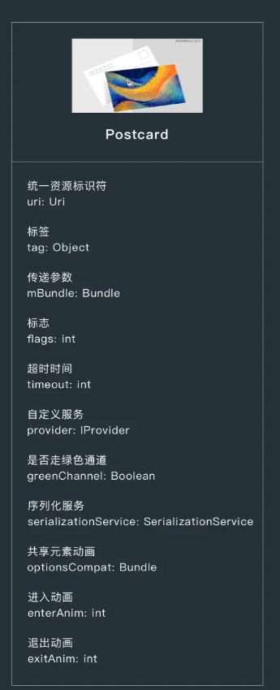

- uri：可以作为路径跳转，但是其实没啥用

- tag ：没用到过

- mBundle：我们调用 withString() 等方法设置要传递给跳转目标的数据时，这个数据就是放在 mBundle 中的。

- flags：我们调用 withFlag() 设定 Activity 的启动标志时，这个标志就会赋值给 flags 字段

- timeout：拦截器超时时间

- provider：没啥意义。

- greenChannel：绿色通道，就是不会被拦截器链处理的通道，如果我们想让某个跳转操作跳过拦截器，可以在 navigation() 前调用 greenChannel() 方法。

- SerializationService：不怎么用

是不是还缺少什么？缺少RouteMeta数据的组装？先往下看吧

## 04.ARouter 路由表生成原理

### 4.1 整体结构概览

#### 1. 编译器什么时候调用 RouteProcessor？

- 这要从 Java 的注解处理机制说起。整个调用链是这样的：

  - ```
    Gradle 构建 → AndroidJavaCompiler → Javac → 注解处理器（RouteProcessor）
    ```

- 关键点在于 RouteProcessor 类上的两个注解：

  - ```
    @AutoService(Processor.class)  // ① 自动注册
    @SupportedAnnotationTypes({ANNOTATION_TYPE_ROUTE, ANNOTATION_TYPE_AUTOWIRED})  // ② 声明处理哪些注解
    public class RouteProcessor extends BaseProcessor {
    ```

  - @AutoService(Processor.class)：这是 Google 的 auto-service 库提供的注解。它会在编译时自动生成 META-INF/services/javax.annotation.processing.Processor 文件，把 RouteProcessor 注册进去。Javac 启动时会通过 SPI 机制发现并加载这个处理器。

  - @SupportedAnnotationTypes：告诉编译器"我只关心 @Route 和 @Autowired 这两个注解"，当源码中出现这些注解时，Javac 就会调用这个处理器。

#### 2.类的继承结构 和 成员变量

- 这是继承结构，其继承自AbstractProcessor，所以才会被调用自身的process方法

  - ```
    AbstractProcessor (Java 标准库)
           ↓
      BaseProcessor (ARouter 封装)
           ↓
      RouteProcessor
    ```

- RouteProcessor 的关键成员变量（这两个存放什么？）

  - ```
    private Map<String, Set<RouteMeta>> groupMap = new HashMap<>();
    private Map<String, String> rootMap = new TreeMap<>();
    ```

  - |   变量   |             类型              |                             作用                             |
    | :------: | :---------------------------: | :----------------------------------------------------------: |
    | groupMap | Map < 分组名，Set<RouteMeta>> | 存储分组后的路由元信息，比如 "test" -> [Test1Activity 的 RouteMeta, Test2Activity 的 RouteMeta] |
    | rootMap  |   Map <分组名，Group 类名>    | 记录分组名到生成的 Group 类名的映射，比如 "test" -> "ARouter$$Group$$test" |

#### 3.process() 方法 —— 入口

```
@Override
public boolean process(Set<? extends TypeElement> annotations, RoundEnvironment roundEnv) {
    if (CollectionUtils.isNotEmpty(annotations)) {
        // 获取所有被 @Route 注解的元素
        Set<? extends Element> routeElements = roundEnv.getElementsAnnotatedWith(Route.class);
        try {
            logger.info(">>> Found routes, start... <<<");
            this.parseRoutes(routeElements);  // 核心处理逻辑
        } catch (Exception e) {
            logger.error(e);
        }
        return true;  // 返回 true 表示这些注解已被处理，其他处理器不用再处理
    }
    return false;
}
```

这个方法是 Javac 调用的入口，它做了两件事：

- 通过 roundEnv.getElementsAnnotatedWith(Route.class) 获取所有被 @Route 标注的元素
- 调用 parseRoutes() 进行核心处理

#### 4.roundEnv 是什么？

RoundEnvironment（简称 roundEnv）是 Javac 传给注解处理器的"当前轮次的编译环境"。

为什么叫"轮次"？因为注解处理可能会进行多轮：

1. 第一轮：处理原始源码中的注解
2. 如果处理器生成了新的 Java 文件，Javac 会再进行一轮编译
3. 新生成的文件如果也有注解，继续处理...直到没有新文件产生

roundEnv 提供的核心能力：

```
// 获取所有被某个注解标注的元素
Set<? extends Element> elements = roundEnv.getElementsAnnotatedWith(Route.class);
```

你可以把 roundEnv 理解为"这一轮编译中，所有源码的注解信息快照"。通过它，你可以查询到哪些类、方法、字段被特定注解标注了。

### 4.2 获取路由元素 Element

#### 1.什么是element

在注解处理器的世界里，Element 是 Java 编译器对源码结构的抽象表示。你写的每一个类、方法、字段，在编译器眼中都是一个 Element：

- 举个例子，对于这段代码：

  - ```
    @Route(path = "/test/activity")
    public class TestActivity extends Activity {
        @Autowired
        String name;
        
        public void onCreate() { }
    }
    
    ```

- 编译器会生成这样的 Element 结构：（Element是什么？）

  - ```
    TypeElement (TestActivity)
    │
    ├── 【自身信息】
    │   ├── 类名: TestActivity
    │   ├── 完整类名: com.example.TestActivity  
    │   ├── 父类: Activity
    │   ├── 实现的接口: [...]
    │   ├── 标注的注解: [@Route(path="/test/activity")]
    │   └── 类型信息(TypeMirror): 可用于判断继承关系
    │
    └── 【内部元素】(通过 getEnclosedElements() 获取)
        ├── VariableElement (userName 字段)
        └── ExecutableElement (onCreate 方法)
    ```

#### 2.如何获取被 @Route 标注的 Element

在 process() 方法中，就一行代码：

```
Set<? extends Element> routeElements = roundEnv.getElementsAnnotatedWith(Route.class);
```

这行代码的意思是："编译器，请把这一轮编译中所有被 @Route 标注的 Element 给我"

因为 @Route 只能标注在类上（@Target(ElementType.TYPE)），所以返回的都是 TypeElement。

如果你的项目里有 3 个类被 @Route 标注：

```
@Route(path = "/test/a") class TestAActivity { }
@Route(path = "/test/b") class TestBActivity { }
@Route(path = "/user/login") class LoginActivity { }
```

那么 routeElements 这个 Set 里就有 3 个 TypeElement，分别代表这 3 个类。

#### 3.从 Element 中获取哪些信息？

拿到 Element 后，RouteProcessor 主要获取这些信息：

```
for (Element element : routeElements) {
    // 1. 获取类型信息（用于判断是 Activity 还是 Fragment）
    TypeMirror tm = element.asType();
    
    // 2. 获取 @Route 注解实例（用于读取 path、group 等属性）
    Route route = element.getAnnotation(Route.class);
    String path = route.path();   // 比如 "/test/activity"
    String group = route.group(); // 比如 "test"
    
    // 3. 获取内部元素（用于收集 @Autowired 字段）
    List<? extends Element> enclosedElements = element.getEnclosedElements();
}

```

### 4.3 创建路由元信息 RouteMeta

#### 1.RouteMeta 是什么？

RouteMeta 是对一个路由的完整描述，它把 Element 中分散的信息整合成一个结构化的对象。

```
Element (编译器的原始数据)  →  RouteMeta (ARouter 的路由描述)
```

RouteMeta字段如下

- ```
  public class RouteMeta {
      private RouteType type;         // Type of route
      private Element rawType;        // Raw type of route
      private Class<?> destination;   // Destination
      private String path;            // Path of route
      private String group;           // Group of route
      private int priority = -1;      // The smaller the number, the higher the priority
      private int extra;              // Extra data
      private Map<String, Integer> paramsType;  // Param type
      private String name;
  
      private Map<String, Autowired> injectConfig;  // Cache inject config.
  
      public RouteMeta() {
      }
  ```

  

- |     字段     |          类型          |                      含义                       |
  | :----------: | :--------------------: | :---------------------------------------------: |
  |     type     |       RouteType        | 路由类型：ACTIVITY、FRAGMENT、PROVIDER、SERVICE |
  |   rawType    |        Element         |          原始的 TypeElement，保留引用           |
  |     path     |         String         |          路由路径，如 `/test/activity`          |
  |    group     |         String         |                分组名，如 `test`                |
  |  paramsType  |  Map<String, Integer>  |           @Autowired 参数的名称和类型           |
  | injectConfig | Map<String, Autowired> |            @Autowired 参数的完整配置            |
  |   priority   |          int           |                     优先级                      |
  |    extra     |          int           |                    额外标记                     |

#### 2.创建 RouteMeta 的流程

看 parseRoutes() 中的核心循环：

- ```
  for (Element element : routeElements) {
      TypeMirror tm = element.asType();
      Route route = element.getAnnotation(Route.class);
      RouteMeta routeMeta;
  
      // 第一步：判断类型，创建对应的 RouteMeta
      if (types.isSubtype(tm, type_Activity) || types.isSubtype(tm, fragmentTm) || types.isSubtype(tm, fragmentTmV4)) {
          // Activity 或 Fragment
          Map<String, Integer> paramsType = new HashMap<>();
          Map<String, Autowired> injectConfig = new HashMap<>();
          injectParamCollector(element, paramsType, injectConfig);  // 收集 @Autowired 参数
  
          if (types.isSubtype(tm, type_Activity)) {
              routeMeta = new RouteMeta(route, element, RouteType.ACTIVITY, paramsType);
          } else {
              routeMeta = new RouteMeta(route, element, RouteType.parse(FRAGMENT), paramsType);
          }
          routeMeta.setInjectConfig(injectConfig);
          
      } else if (types.isSubtype(tm, iProvider)) {
          // Provider
          routeMeta = new RouteMeta(route, element, RouteType.PROVIDER, null);
          
      } else if (types.isSubtype(tm, type_Service)) {
          // Service
          routeMeta = new RouteMeta(route, element, RouteType.parse(SERVICE), null);
          
      } else {
          throw new RuntimeException("@Route 标注在了不支持的类上");
      }
  
      // 第二步：分组（下一部分讲）
      categories(routeMeta);
  }
  
  ```

流程图

- ```
  Element
     │
     ├─ 是 Activity? ──→ 收集 @Autowired 参数 ──→ new RouteMeta(ACTIVITY)
     │
     ├─ 是 Fragment? ──→ 收集 @Autowired 参数 ──→ new RouteMeta(FRAGMENT)
     │
     ├─ 是 Provider? ──→ new RouteMeta(PROVIDER)
     │
     ├─ 是 Service?  ──→ new RouteMeta(SERVICE)
     │
     └─ 都不是? ──→ 抛异常
  
  ```

#### 3.收集 @Autowired 参数

对于 Activity 和 Fragment，还需要收集它们的 @Autowired 字段。看 injectParamCollector() 方法：

- ```
  private void injectParamCollector(Element element, Map<String, Integer> paramsType, Map<String, Autowired> injectConfig) {
      // 遍历类的所有内部元素（字段、方法）
      for (Element field : element.getEnclosedElements()) {
          // 条件：是字段 && 有 @Autowired 注解 && 不是 Provider 类型
          if (field.getKind().isField() && field.getAnnotation(Autowired.class) != null && !types.isSubtype(field.asType(), iProvider)) {
              Autowired paramConfig = field.getAnnotation(Autowired.class);
              String injectName = StringUtils.isEmpty(paramConfig.name()) ? field.getSimpleName().toString() : paramConfig.name();
              
              paramsType.put(injectName, typeUtils.typeExchange(field));  // 参数名 -> 类型编号
              injectConfig.put(injectName, paramConfig);                   // 参数名 -> @Autowired 配置
          }
      }
      
      // 递归处理父类（如果父类也有 @Autowired 字段）
      TypeMirror parent = ((TypeElement) element).getSuperclass();
      if (parent instanceof DeclaredType) {
          Element parentElement = ((DeclaredType) parent).asElement();
          if (parentElement instanceof TypeElement && !((TypeElement) parentElement).getQualifiedName().toString().startsWith("android")) {
              injectParamCollector(parentElement, paramsType, injectConfig);
          }
      }
  }
  
  ```

举例：

- ```
  @Route(path = "/test/activity")
  public class TestActivity extends Activity {
      @Autowired
      String userName;
      
      @Autowired(name = "age")
      int userAge;
  }
  ```

收集后：

- paramsType: {"userName": 8, "age": 3} （8 和 3 是类型编号，代表 String 和 int）
- injectConfig: {"userName": @Autowired实例, "age": @Autowired实例}

#### 4.小结

```
Element
   │
   ├── 判断类型 (Activity/Fragment/Provider/Service)
   │
   ├── 如果是 Activity/Fragment，收集 @Autowired 字段
   │
   └── 创建 RouteMeta，包含：
       - type: 路由类型
       - rawType: 原始 Element
       - path: 从 @Route 获取
       - group: 从 @Route 获取
       - paramsType: @Autowired 参数类型
       - injectConfig: @Autowired 配置

```

有了类名，我们就可以通过intent创建他了

### 4.4 路由元信息分组

#### 1.为什么要分组？

如果把所有路由都放在一个 Map 里，App 启动时就要一次性加载全部路由信息。路由多了会影响启动速度。

分组的好处：按需加载。比如用户只访问了 /test/xxx 的页面，就只加载 test 分组的路由，其他分组不加载。

#### 2. 分组逻辑：categories() 方法

每创建一个 RouteMeta，就调用 categories(routeMeta) 进行分组：

- ```
  private void categories(RouteMeta routeMete) {
      // 第一步：验证并提取分组名
      if (routeVerify(routeMete)) {
          logger.info(">>> Start categories, group = " + routeMete.getGroup() + ", path = " + routeMete.getPath() + " <<<");
          
          // 第二步：放入 groupMap
          Set<RouteMeta> routeMetas = groupMap.get(routeMete.getGroup());
          if (CollectionUtils.isEmpty(routeMetas)) {
              // 该分组还不存在，创建新的 Set
              Set<RouteMeta> routeMetaSet = new TreeSet<>(/* 按 path 排序的比较器 */);
              routeMetaSet.add(routeMete);
              groupMap.put(routeMete.getGroup(), routeMetaSet);
          } else {
              // 该分组已存在，直接添加
              routeMetas.add(routeMete);
          }
      }
  }
  
  ```

#### 3.分组名从哪来？routeVerify() 方法

```
private boolean routeVerify(RouteMeta meta) {
    String path = meta.getPath();

    // 路径必须以 "/" 开头
    if (StringUtils.isEmpty(path) || !path.startsWith("/")) {
        return false;
    }

    // 如果没有指定 group，从 path 中提取
    if (StringUtils.isEmpty(meta.getGroup())) {
        // 比如 path = "/test/activity"，提取出 "test" 作为 group
        String defaultGroup = path.substring(1, path.indexOf("/", 1));
        meta.setGroup(defaultGroup);
        return true;
    }

    return true;
}
```

举例：

|                    @Route 配置                     |      最终 group      |
| :------------------------------------------------: | :------------------: |
|          @Route(path = "/test/activity")           |  "test" (自动提取)   |
| @Route(path = "/test/activity", group = "myGroup") | "myGroup" (手动指定) |
|            @Route(path = "/user/login")            |  "user" (自动提取)   |

#### 4. groupMap 的最终结构

假设项目中有这些路由：

- ```
  @Route(path = "/test/a") class TestAActivity {}
  @Route(path = "/test/b") class TestBActivity {}
  @Route(path = "/user/login") class LoginActivity {}
  ```

分组后 groupMap 的结构：

- ```
  groupMap = {
      "test" -> Set[RouteMeta(TestAActivity), RouteMeta(TestBActivity)],
      "user" -> Set[RouteMeta(LoginActivity)]
  }
  ```

至此，通过roundEnv获取被注解标注的类的element，我们通过对element的处理填充了groupMap。

### 4.5 JavaPoet 生成路由文件

#### 1.生成什么文件

RouteProcessor 注解处理器生成的三种核心 Java 文件

|   文件类型    |          命名规则          |                          作用                          |
| :-----------: | :------------------------: | :----------------------------------------------------: |
|  Group 文件   |   ARouter$$Group$$分组名   | 存储**单个分组**下所有路由的 path → RouteMeta 映射关系 |
|   Root 文件   |   ARouter$$Root$$模块名    |      存储当前模块的**分组名 → Group 类** 映射关系      |
| Provider 文件 | ARouter$$Providers$$模块名 |    存储全局的**Provider 接口 → RouteMeta** 映射关系    |

他们的关系

- ```
  Root 文件 (入口)
      │
      ├── "test" → ARouter$$Group$$test.class
      │                  │
      │                  ├── "/test/a" → RouteMeta(TestAActivity)
      │                  └── "/test/b" → RouteMeta(TestBActivity)
      │
      └── "user" → ARouter$$Group$$user.class
                         │
                         └── "/user/login" → RouteMeta(LoginActivity)
  
  ```

#### 2.生成 Group 文件

遍历 groupMap，为每个分组生成一个 Group 文件：

- ```
  for (Map.Entry<String, Set<RouteMeta>> entry : groupMap.entrySet()) {
      String groupName = entry.getKey();
  
      // 构建 loadInto 方法
      MethodSpec.Builder loadIntoMethodOfGroupBuilder = MethodSpec.methodBuilder(METHOD_LOAD_INTO)
              .addAnnotation(Override.class)
              .addModifiers(PUBLIC)
              .addParameter(groupParamSpec);
  
      // 遍历该分组下的所有 RouteMeta，生成 atlas.put(...) 语句
      Set<RouteMeta> groupData = entry.getValue();
      for (RouteMeta routeMeta : groupData) {
          loadIntoMethodOfGroupBuilder.addStatement(
                  "atlas.put($S, $T.build($T." + routeMeta.getType() + ", $T.class, $S, $S, ...))",
                  routeMeta.getPath(),      // key: "/test/activity"
                  routeMetaCn,              // RouteMeta
                  routeTypeCn,              // RouteType
                  className,                // TestActivity.class
                  routeMeta.getPath(),
                  routeMeta.getGroup());
      }
  
      // 生成 Java 文件
      String groupFileName = NAME_OF_GROUP + groupName;  // "ARouter$$Group$$test"
      JavaFile.builder(PACKAGE_OF_GENERATE_FILE,
              TypeSpec.classBuilder(groupFileName)
                      .addSuperinterface(ClassName.get(type_IRouteGroup))
                      .addModifiers(PUBLIC)
                      .addMethod(loadIntoMethodOfGroupBuilder.build())
                      .build()
      ).build().writeTo(mFiler);
  
      // 记录到 rootMap，供后面生成 Root 文件使用
      rootMap.put(groupName, groupFileName);
  }
  
  ```

生成的 Group 文件长这样：

- ```
  public class ARouter$$Group$$test implements IRouteGroup {
      @Override
      public void loadInto(Map<String, RouteMeta> atlas) {
          atlas.put("/test/a", RouteMeta.build(RouteType.ACTIVITY, TestAActivity.class, "/test/a", "test", null, -1, -2147483648));
          atlas.put("/test/b", RouteMeta.build(RouteType.ACTIVITY, TestBActivity.class, "/test/b", "test", null, -1, -2147483648));
      }
  }
  ```

- 

#### 3.生成Root文件

Root 文件是入口，记录所有分组：

- ```
  if (MapUtils.isNotEmpty(rootMap)) {
      for (Map.Entry<String, String> entry : rootMap.entrySet()) {
          loadIntoMethodOfRootBuilder.addStatement(
              "routes.put($S, $T.class)", 
              entry.getKey(),      // 分组名: "test"
              ClassName.get(PACKAGE_OF_GENERATE_FILE, entry.getValue())  // ARouter$$Group$$test.class
          );
      }
  }
  
  // 生成 Root 文件
  String rootFileName = NAME_OF_ROOT + SEPARATOR + moduleName;  // "ARouter$$Root$$app"
  JavaFile.builder(PACKAGE_OF_GENERATE_FILE,
          TypeSpec.classBuilder(rootFileName)
                  .addSuperinterface(ClassName.get(elementUtils.getTypeElement(ITROUTE_ROOT)))
                  .addModifiers(PUBLIC)
                  .addMethod(loadIntoMethodOfRootBuilder.build())
                  .build()
  ).build().writeTo(mFiler);
  
  ```

生成的 Root 文件长这样：

- ```
  public class ARouter$$Root$$lib_base_webview implements IRouteRoot {
    @Override
    public void loadInto(Map<String, Class<? extends IRouteGroup>> routes) {
      routes.put("lib_base_webview", ARouter$$Group$$lib_base_webview.class);
    }
  }
  ```

- ```
  /**
   * DO NOT EDIT THIS FILE!!! IT WAS GENERATED BY AROUTER. */
  public class ARouter$$Root$$lib_contacts implements IRouteRoot {
    @Override
    public void loadInto(Map<String, Class<? extends IRouteGroup>> routes) {
      routes.put("app_contact", ARouter$$Group$$app_contact.class);
      routes.put("lib_contacts", ARouter$$Group$$lib_contacts.class);
      routes.put("lib_franchisee_contract", ARouter$$Group$$lib_franchisee_contract.class);
    }
  }
  
  ```

- 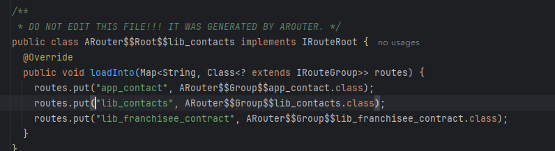

运行时进行合并（在 LogisticsCenter 中）：

- ```
  // 扫描 APK 中所有 com.alibaba.android.arouter.routes 包下的类
  Set<String> routerMap = ClassUtils.getFileNameByPackageName(context, ROUTE_ROOT_PAKCAGE);
  
  for (String className : routerMap) {
      if (className.startsWith(ROUTE_ROOT_PAKCAGE + ".ARouter$$Root$$")) {
          // 找到所有 Root 类，逐个调用 loadInto()，合并到 Warehouse.groupsIndex
          ((IRouteRoot) Class.forName(className).newInstance()).loadInto(Warehouse.groupsIndex);
      }
  }
  ```

#### 4.生成 Provider 文件

Provider 文件单独处理，存储接口到实现类的映射：

- ```
  String providerMapFileName = NAME_OF_PROVIDER + SEPARATOR + moduleName;  // "ARouter$$Providers$$app"
  JavaFile.builder(PACKAGE_OF_GENERATE_FILE,
          TypeSpec.classBuilder(providerMapFileName)
                  .addSuperinterface(ClassName.get(type_IProviderGroup))
                  .addModifiers(PUBLIC)
                  .addMethod(loadIntoMethodOfProviderBuilder.build())
                  .build()
  ).build().writeTo(mFiler);
  ```

生成的 Provider 文件长这样：

- ```
  public class ARouter$$Providers$$app implements IProviderGroup {
      @Override
      public void loadInto(Map<String, RouteMeta> providers) {
          providers.put("com.example.IUserService", RouteMeta.build(RouteType.PROVIDER, UserServiceImpl.class, "/service/user", "service", null, -1, -2147483648));
      }
  }
  ```

至此，我们将数据从groupMap等结构转化为了对应的路由文件形式。

#### 5.总结一下完整流程

```
编译时：
@Route 注解
    ↓
Javac 调用 RouteProcessor.process()
    ↓
从 roundEnv 获取 Element（被注解的类）
    ↓
从 Element 提取信息，创建 RouteMeta（类型、路径、类名）
    ↓
按 group 分组
    ↓
JavaPoet 生成 Root、Group、Provider 文件
    ↓
运行时按需加载，查表跳转


编译时生成：
Root 文件 ──→ Group 文件 ──→ Provider 文件
   │              │
   │              └── path → RouteMeta(包含目标 Class)
   │
   └── 分组名 → Group 类
   
   
运行时跳转：
ARouter.build("/test/a").navigation()
   │
   ├── 1. 从 path 提取分组名 "test"
   │
   ├── 2. 检查该分组是否已加载，没有则加载 ARouter$$Group$$test
   │
   ├── 3. 从 Group 中找到 "/test/a" 对应的 RouteMeta
   │
   ├── 4. 从 RouteMeta 拿到 TestAActivity.class
   │
   └── 5. new Intent(context, TestAActivity.class) → startActivity()
```

路由表构建的本质就是

```
@Route(path = "/alarm/unread") + UnreadAlarmActivity.class
                    ↓
Group 文件中的一条记录：
atlas.put("/alarm/unread", RouteMeta.build(ACTIVITY, UnreadAlarmActivity.class, ...))
```

## 05.路由表加载原理

### 5.1Dex文件加载流程

#### 1. LogisticsCenter.init() 入口分析

当你在 Application 中调用 ARouter.init(this) 时，最终会调用到 LogisticsCenter.init()。我们来看这个方法的完整流程：

- ```java
  // LogisticsCenter.java 第 115 行
  public synchronized static void init(Context context, ThreadPoolExecutor tpe) throws HandlerException {
      mContext = context;
      executor = tpe;
  
      try {
          long startInit = System.currentTimeMillis();
          
          // ========== 关键点 1：先尝试插件加载 ==========
          loadRouterMap();
          
          if (registerByPlugin) {
              // 插件已经注册完成，直接返回
              logger.info(TAG, "Load router map by arouter-auto-register plugin.");
          } else {
              // ========== 关键点 2：插件未注册，走 Dex 加载流程 ==========
              Set<String> routerMap;
  
              // ========== 关键点 3：判断是否需要重新扫描 ==========
              if (ARouter.debuggable() || PackageUtils.isNewVersion(context)) {
                  logger.info(TAG, "Run with debug mode or new install, rebuild router map.");
                  
                  // 扫描 Dex 文件，找到所有路由表类
                  routerMap = ClassUtils.getFileNameByPackageName(mContext, ROUTE_ROOT_PAKCAGE);
                  
                  if (!routerMap.isEmpty()) {
                      // 保存到 SharedPreferences 缓存
                      context.getSharedPreferences(AROUTER_SP_CACHE_KEY, Context.MODE_PRIVATE)
                             .edit()
                             .putStringSet(AROUTER_SP_KEY_MAP, routerMap)
                             .apply();
                  }
  
                  PackageUtils.updateVersion(context);
              } else {
                  // 从缓存读取
                  logger.info(TAG, "Load router map from cache.");
                  routerMap = new HashSet<>(context.getSharedPreferences(AROUTER_SP_CACHE_KEY, Context.MODE_PRIVATE)
                                                   .getStringSet(AROUTER_SP_KEY_MAP, new HashSet<String>()));
              }
  
              logger.info(TAG, "Find router map finished, map size = " + routerMap.size() + ", cost " + (System.currentTimeMillis() - startInit) + " ms.");
              startInit = System.currentTimeMillis();
  
              // ========== 关键点 4：反射加载路由表类 ==========
              for (String className : routerMap) {
                  if (className.startsWith(ROUTE_ROOT_PAKCAGE + DOT + SDK_NAME + SEPARATOR + SUFFIX_ROOT)) {
                      // 加载 Root 类，例如：com.alibaba.android.arouter.routes.ARouter$$Root$$app
                      ((IRouteRoot) (Class.forName(className).getConstructor().newInstance()))
                          .loadInto(Warehouse.groupsIndex);
                          
                  } else if (className.startsWith(ROUTE_ROOT_PAKCAGE + DOT + SDK_NAME + SEPARATOR + SUFFIX_INTERCEPTORS)) {
                      // 加载拦截器，例如：com.alibaba.android.arouter.routes.ARouter$$Interceptors$$app
                      ((IInterceptorGroup) (Class.forName(className).getConstructor().newInstance()))
                          .loadInto(Warehouse.interceptorsIndex);
                          
                  } else if (className.startsWith(ROUTE_ROOT_PAKCAGE + DOT + SDK_NAME + SEPARATOR + SUFFIX_PROVIDERS)) {
                      // 加载 Provider，例如：com.alibaba.android.arouter.routes.ARouter$$Providers$$app
                      ((IProviderGroup) (Class.forName(className).getConstructor().newInstance()))
                          .loadInto(Warehouse.providersIndex);
                  }
              }
          }
  
          logger.info(TAG, "Load root element finished, cost " + (System.currentTimeMillis() - startInit) + " ms.");
      } catch (Exception e) {
          throw new HandlerException(TAG + "ARouter init logistics center exception! [" + e.getMessage() + "]");
      }
  }
  
  ```

关键点 1：loadRouterMap() 为什么是空方法？

- 让我们看看这个方法的定义：

  - ```
    // LogisticsCenter.java 第 48 行
    private static void loadRouterMap() {
        registerByPlugin = false;
        // auto generate register code by gradle plugin: arouter-auto-register
        // looks like below:
        // registerRouteRoot(new ARouter$$Root$$modulejava());
        // registerRouteRoot(new ARouter$$Root$$modulekotlin());
    }
    ```

- 为什么是空的？这是一个插桩占位方法！如果你使用了 arouter-register 插件，插件会在编译期通过 ASM 字节码操作，在这个方法的 return 指令之前插入注册代码。

- 插桩后的效果（字节码层面）：

  - ```
    private static void loadRouterMap() {
        registerByPlugin = false;
        
        // 👇 以下代码是插件在编译期插入的
        register("com.alibaba.android.arouter.routes.ARouter$$Root$$app");
        register("com.alibaba.android.arouter.routes.ARouter$$Root$$module1");
        register("com.alibaba.android.arouter.routes.ARouter$$Interceptors$$app");
        register("com.alibaba.android.arouter.routes.ARouter$$Providers$$app");
    }
    ```

- 最终执行下面的任务：loadInto，是不是很熟悉啊。

  - ```
     /**
         * method for arouter-auto-register plugin to register Routers
         * @param routeRoot IRouteRoot implementation class in the package: com.alibaba.android.arouter.core.routers
         */
        private static void registerRouteRoot(IRouteRoot routeRoot) {
            markRegisteredByPlugin();
            if (routeRoot != null) {
                routeRoot.loadInto(Warehouse.groupsIndex);
            }
        }
      
    ```

关键点 2：为什么要判断 debuggable() 和 isNewVersion()？

- 本质是性能优化：Release + 旧版本，从缓存读取，路由表不变，避免重复扫描。

  - ```
    if (ARouter.debuggable() || PackageUtils.isNewVersion(context)) {
        // 重新扫描 Dex
        routerMap = ClassUtils.getFileNameByPackageName(mContext, ROUTE_ROOT_PAKCAGE);
        // 保存到缓存
        context.getSharedPreferences(...).edit().putStringSet(..., routerMap).apply();
    } else {
        // 从缓存读取
        routerMap = new HashSet<>(context.getSharedPreferences(...).getStringSet(...));
    }
    
    ```

- isNewVersion() 的实现：

  - ```
    // PackageUtils.java
    public static boolean isNewVersion(Context context) {
        PackageInfo packageInfo = context.getPackageManager().getPackageInfo(context.getPackageName(), 0);
        
        // 从 SP 读取上次保存的版本信息
        // public static final String AROUTER_SP_CACHE_KEY = "SP_AROUTER_CACHE";
        SharedPreferences sp = context.getSharedPreferences(AROUTER_SP_CACHE_KEY, Context.MODE_PRIVATE);
        String lastVersionName = sp.getString(LAST_VERSION_NAME, null);
        int lastVersionCode = sp.getInt(LAST_VERSION_CODE, -1);
        
        // 对比版本号
        return !packageInfo.versionName.equals(lastVersionName) 
            || packageInfo.versionCode != lastVersionCode;
    }
    
    ```

问题3：这里的getFileNameByPackageName找的是什么文件？

- 这是路由表类的扫描方法：routerMap = ClassUtils.getFileNameByPackageName(mContext, ROUTE_ROOT_PAKCAGE);

  - ```
    // Consts.java
    public static final String ROUTE_ROOT_PAKCAGE = "com.alibaba.android.arouter.routes";
    
    这是 RouteProcessor 生成的路由表类的固定包名。所有生成的类都在这个包下：
    com.alibaba.android.arouter.routes/
    ├── ARouter$$Root$$app.class
    ├── ARouter$$Root$$module1.class
    ├── ARouter$$Group$$test.class
    ├── ARouter$$Group$$service.class
    ├── ARouter$$Interceptors$$app.class
    └── ARouter$$Providers$$app.class
    
    ```

#### 2.ClassUtils.getFileNameByPackageName() 扫描 Dex

流程概览

- ```
  // ClassUtils.java 第 60 行
  public static Set<String> getFileNameByPackageName(Context context, final String packageName) {
      final Set<String> classNames = new HashSet<>();
  
      // ========== 关键：获取所有 Dex 文件路径 ==========
      List<String> paths = getSourcePaths(context);
      
      // 使用线程池并发扫描（性能优化）
      final CountDownLatch parserCtl = new CountDownLatch(paths.size());
  
      for (final String path : paths) {
          DefaultPoolExecutor.getInstance().execute(new Runnable() {
              @Override
              public void run() {
                  DexFile dexfile = null;
  
                  try {
                      // 加载 Dex 文件
                      if (path.endsWith(EXTRACTED_SUFFIX)) {
                          dexfile = DexFile.loadDex(path, path + ".tmp", 0);
                      } else {
                          dexfile = new DexFile(path);
                      }
  
                      // 遍历 Dex 中的所有类名
                      Enumeration<String> dexEntries = dexfile.entries();
                      while (dexEntries.hasMoreElements()) {
                          String className = dexEntries.nextElement();
                          // 筛选出目标包名的类
                          if (className.startsWith(packageName)) {
                              classNames.add(className);
                          }
                      }
                  } catch (Throwable ignore) {
                      Log.e("ARouter", "Scan map file in dex files made error.", ignore);
                  } finally {
                      if (null != dexfile) {
                          try {
                              dexfile.close();
                          } catch (Throwable ignore) {
                          }
                      }
                      parserCtl.countDown();
                  }
              }
          });
      }
  
      parserCtl.await();  // 等待所有线程完成
      return classNames;
  }
  
  ```

第一步：getSourcePaths() 获取 Dex 路径

- ```
  // ClassUtils.java 第 110 行
  public static List<String> getSourcePaths(Context context) {
      ApplicationInfo applicationInfo = context.getPackageManager()
                                               .getApplicationInfo(context.getPackageName(), 0);
      File sourceApk = new File(applicationInfo.sourceDir);
  
      List<String> sourcePaths = new ArrayList<>();
      
      // ========== 1. 添加主 APK 路径 ==========
      sourcePaths.add(applicationInfo.sourceDir);  
      // 例如：/data/app/com.example.app-1/base.apk
  
      // ========== 2. 添加 MultiDex 的额外 Dex 文件 ==========
      if (!isVMMultidexCapable()) {
          int totalDexNumber = getMultiDexPreferences(context).getInt(KEY_DEX_NUMBER, 1);
          File dexDir = new File(applicationInfo.dataDir, SECONDARY_FOLDER_NAME);
          // 例如：/data/data/com.example.app/code_cache/secondary-dexes/
  
          for (int secondaryNumber = 2; secondaryNumber <= totalDexNumber; secondaryNumber++) {
              String fileName = extractedFilePrefix + secondaryNumber + EXTRACTED_SUFFIX;
              // 例如：base.classes2.zip, base.classes3.zip
              File extractedFile = new File(dexDir, fileName);
              if (extractedFile.isFile()) {
                  sourcePaths.add(extractedFile.getAbsolutePath());
              }
          }
      }
  
      // ========== 3. 添加 Instant Run 的 Dex 文件（仅 Debug 模式） ==========
      if (ARouter.debuggable()) {
          sourcePaths.addAll(tryLoadInstantRunDexFile(applicationInfo));
      }
      
      return sourcePaths;
  }
  ```

- 关键知识点：

  - 主 APK 路径：applicationInfo.sourceDir 指向 APK 文件本身，APK 本质是 ZIP 文件，里面包含 classes.dex
  - MultiDex 机制：
    - Android 5.0 以下，单个 Dex 文件最多 65536 个方法
    - 超过限制后，会生成 classes2.dex、classes3.dex 等
    - 这些额外的 Dex 会被解压到 code_cache/secondary-dexes/ 目录
  - Instant Run：Android Studio 的热更新机制，会生成额外的 Dex 文件

第二步：DexFile.entries() 遍历类名

- ```
  DexFile dexfile = new DexFile(path);
  Enumeration<String> dexEntries = dexfile.entries();
  
  while (dexEntries.hasMoreElements()) {
      String className = dexEntries.nextElement();
      // 例如：com.alibaba.android.arouter.routes.ARouter$$Root$$app
      
      if (className.startsWith(packageName)) {
          classNames.add(className);
      }
  }
  ```

- 为什么扫描很慢？

  - 一个中大型 App 可能有 10+ 个 Dex 文件
  - 每个 Dex 包含数万个类
  - 需要遍历所有类名，进行字符串匹配

#### 3.反射加载与注册

扫描完成后，我们得到了一个类名集合，例如：

- ```
  com.alibaba.android.arouter.routes.ARouter$$Root$$app
  com.alibaba.android.arouter.routes.ARouter$$Root$$module1
  com.alibaba.android.arouter.routes.ARouter$$Interceptors$$app
  com.alibaba.android.arouter.routes.ARouter$$Providers$$app
  ```

现在需要加载这些类，并调用它们的 loadInto() 方法。

第一步：根据类名后缀判断类型

- ```
  for (String className : routerMap) {
      if (className.startsWith(ROUTE_ROOT_PAKCAGE + DOT + SDK_NAME + SEPARATOR + SUFFIX_ROOT)) {
          // 匹配：com.alibaba.android.arouter.routes.ARouter$Root
          ((IRouteRoot) (Class.forName(className).getConstructor().newInstance()))
              .loadInto(Warehouse.groupsIndex);
              
      } else if (className.startsWith(ROUTE_ROOT_PAKCAGE + DOT + SDK_NAME + SEPARATOR + SUFFIX_INTERCEPTORS)) {
          // 匹配：com.alibaba.android.arouter.routes.ARouter$Interceptors
          ((IInterceptorGroup) (Class.forName(className).getConstructor().newInstance()))
              .loadInto(Warehouse.interceptorsIndex);
              
      } else if (className.startsWith(ROUTE_ROOT_PAKCAGE + DOT + SDK_NAME + SEPARATOR + SUFFIX_PROVIDERS)) {
          // 匹配：com.alibaba.android.arouter.routes.ARouter$Providers
          ((IProviderGroup) (Class.forName(className).getConstructor().newInstance()))
              .loadInto(Warehouse.providersIndex);
      }
  }
  
  ```

第二步：理解生成的路由表类

- ```
  // ARouter$$Root$$app.java（由 RouteProcessor 生成）
  package com.alibaba.android.arouter.routes;
  
  public class ARouter$$Root$$app implements IRouteRoot {
      @Override
      public void loadInto(Map<String, Class<? extends IRouteGroup>> routes) {
          // 注册分组：group名 -> Group类
          routes.put("test", ARouter$$Group$$test.class);
          routes.put("service", ARouter$$Group$$service.class);
      }
  }
  
  ```

第三步：Warehouse 全局索引仓库

- ```
  class Warehouse {
      // ========== 第一层：分组索引（Root 注册） ==========
      static Map<String, Class<? extends IRouteGroup>> groupsIndex = new HashMap<>();
      // 存储：groupName -> Group 的 Class 对象
      // 例如：{"test" -> ARouter$$Group$$test.class}
      // 作用：懒加载，只在需要时才实例化 Group
  
      // ========== 第二层：路由索引（Group 注册） ==========
      static Map<String, RouteMeta> routes = new HashMap<>();
      // 存储：path -> RouteMeta
      // 例如：{"/test/activity1" -> RouteMeta(TestActivity.class, ...)}
      // 作用：真正的路由信息，用于跳转
  
      // ========== Provider 索引 ==========
      static Map<Class, IProvider> providers = new HashMap<>();
      // 存储：Provider 接口 -> Provider 实例
      static Map<String, RouteMeta> providersIndex = new HashMap<>();
      // 存储：Provider 路径 -> RouteMeta
  
      // ========== 拦截器索引 ==========
      static Map<Integer, Class<? extends IInterceptor>> interceptorsIndex = new UniqueKeyTreeMap<>();
      // 存储：优先级 -> 拦截器 Class
      static List<IInterceptor> interceptors = new ArrayList<>();
      // 存储：拦截器实例列表
  }
  
  ```

至此，我们通过对dex文件的扫描，获得了对应包 `com.alibaba.android.arouter.routes` 下的文件。通过对类名的判定，对Root类型，通过反射调用其构造方法创建实例，并调用其loadInto方法，将数据存入wareHouse中。

此时只有groupsIndex有记录。存放类似与：  {"test" -> ARouter$$Group$$test.class}

当用户实际使用test/activity1时，检测到routes中没有数据，那么会去groupsIndex中找到ARouter$$Group$$test.class，通过反射调用其loadInto方法，将数据加载进routes中。

完整流程

- ```
  初始化阶段（ARouter.init()）
      ↓
  加载 Root 类
      ↓
  Root.loadInto(Warehouse.groupsIndex)
      ↓
  Warehouse.groupsIndex = {
      "test" -> ARouter$$Group$$test.class,      ← 只存 Class，不实例化
      "service" -> ARouter$$Group$$service.class
  }
  
  ═══════════════════════════════════════════════════════════
  
  首次使用阶段（ARouter.navigation("/test/activity1")）
      ↓
  LogisticsCenter.completion(postcard)
      ↓
  从 Warehouse.routes 查找 "/test/activity1"
      ↓
  找不到！说明 "test" 组还没加载
      ↓
  从 Warehouse.groupsIndex 取出 ARouter$$Group$$test.class
      ↓
  实例化并调用 loadInto(Warehouse.routes)
      ↓
  Warehouse.routes = {
      "/test/activity1" -> RouteMeta,
      "/test/activity2" -> RouteMeta
  }
      ↓
  从 Warehouse.groupsIndex 删除 "test"（已加载，不需要保留）
      ↓
  再次从 Warehouse.routes 查找 "/test/activity1"
      ↓
  找到了！返回 RouteMeta
  
  ```

源码验证：Group 的懒加载

- 让我们看看 LogisticsCenter.completion() 方法：

  - ```
    // LogisticsCenter.java 第 200 行
    public synchronized static void completion(Postcard postcard) {
        RouteMeta routeMeta = Warehouse.routes.get(postcard.getPath());
        
        if (null == routeMeta) {
            // ========== 路由信息不存在，说明 Group 还没加载 ==========
            if (!Warehouse.groupsIndex.containsKey(postcard.getGroup())) {
                throw new NoRouteFoundException("There is no route match the path");
            } else {
                // ========== 动态加载 Group ==========
                try {
                    if (ARouter.debuggable()) {
                        logger.debug(TAG, String.format("The group [%s] starts loading", postcard.getGroup()));
                    }
    
                    // 👇 关键代码：动态加载 Group
                    addRouteGroupDynamic(postcard.getGroup(), null);
    
                    if (ARouter.debuggable()) {
                        logger.debug(TAG, String.format("The group [%s] has already been loaded", postcard.getGroup()));
                    }
                } catch (Exception e) {
                    throw new HandlerException("Fatal exception when loading group meta.");
                }
    
                // 递归调用，重新查找
                completion(postcard);
            }
        } else {
            // 找到了，填充 postcard 信息
            postcard.setDestination(routeMeta.getDestination());
            postcard.setType(routeMeta.getType());
            // ...
        }
    }
    
    ```

  - ```
    // LogisticsCenter.java 第 330 行
    public synchronized static void addRouteGroupDynamic(String groupName, IRouteGroup group) {
        if (Warehouse.groupsIndex.containsKey(groupName)) {
            // ========== 从 groupsIndex 取出 Class 对象 ==========
            Class<? extends IRouteGroup> groupClass = Warehouse.groupsIndex.get(groupName);
            
            // ========== 实例化并加载到 routes ==========
            groupClass.getConstructor().newInstance().loadInto(Warehouse.routes);
            //                                        ↑ 这里调用的是 IRouteGroup.loadInto()
            //                                          参数类型是 Map<String, RouteMeta>
            
            // ========== 删除已加载的 Group ==========
            Warehouse.groupsIndex.remove(groupName);
        }
    
        // 如果传入了自定义 Group，也加载进去
        if (null != group) {
            group.loadInto(Warehouse.routes);
        }
    }
    ```

### 5.2 插件加载方式

我们上面的是dex加载方式，现在看看插件加载方式

#### 1.插件处理逻辑

第一步：让我们从插件入口开始

- ```
  // ARouterPlugin.kt
  class ARouterPlugin : Plugin<Project> {
      override fun apply(project: Project) {
          // ========== 1. 判断是否为 Application 模块 ==========
          if (project.plugins.hasPlugin(AppPlugin::class.java)) {
              
              // ========== 2. 创建配置扩展 ==========
              project.extensions.create(EXTENSION_CONFIG_NAME, ARouterConfig::class.java)
              println("Init ARouterGradlePlugin")
              
              // ========== 3. 获取 AndroidComponentsExtension ==========
              val androidComponents = project.extensions.getByType(AndroidComponentsExtension::class.java)
  
              // ========== 4. 注册 Variant 回调 ==========
              androidComponents.onVariants { variant ->
                  val config = project.extensions.getByType(ARouterConfig::class.java)
  
                  // ========== 5. 检查配置，决定是否跳过 ==========
                  if (config.disableTransform) {
                      println("Skip ARouter Transform! (disableTransform=true) variant=${variant.name}")
                      return@onVariants
                  }
  
                  if (config.disableTransformWhenDebugBuild && variant.name.contains("debug", ignoreCase = true)) {
                      println("Skip ARouter Transform When Debug Build! variant=${variant.name}")
                      return@onVariants
                  }
                  
                  // ========== 6. 注册 Task ==========
                  val taskProviderTransformAllClassesTask = project.tasks.register(
                      "${variant.name}TransformAllClassesTask",
                      TransformAllClassesTask::class.java
                  )
                  
                  // ========== 7. 配置 Artifacts API ==========
                  variant.artifacts.forScope(ScopedArtifacts.Scope.ALL)
                      .use(taskProviderTransformAllClassesTask)
                      .toTransform(
                          ScopedArtifact.CLASSES,
                          TransformAllClassesTask::allJars,
                          TransformAllClassesTask::allDirectories,
                          TransformAllClassesTask::output
                      )
              }
          }
      }
  }
  
  ```

关键点 1：Plugin.apply() 的触发时机

- ```
  Gradle 构建生命周期：
      ↓
  1. Initialization（初始化阶段）
      - 读取 settings.gradle
      - 确定参与构建的项目
      ↓
  2. Configuration（配置阶段）← Plugin.apply() 在这里执行
      - 执行所有 build.gradle
      - 应用所有插件
      - 创建 Task（但不执行）
      ↓
  3. Execution（执行阶段）
      - 执行 Task
      - 生成构建产物
  
  ```

- 我们再apply方法中仅仅创建了Task，并不真正执行耗时任务，也不扫描代码。

关键点 2：AndroidComponentsExtension 是什么？

- AndroidComponentsExtension 是 AGP 7.0+ 提供的新 API，用于访问 Android 构建的各个组件。

  - ```
    val androidComponents = project.extensions.getByType(AndroidComponentsExtension::class.java)
    
    
    //它提供的能力：
    androidComponents {
        // 1. 访问所有 Variant（构建变体）
        onVariants { variant ->
            // variant.name = "debug", "release", "demoDebug" 等
        }
        
        // 2. 访问构建产物
        variant.artifacts
        
        // 3. 访问构建配置
        variant.buildType
        variant.productFlavors
        
        //我们这里只用到了访问构建产物
    }
    
    ```

- 什么是 Variant？

  - ```
    Variant = BuildType × ProductFlavor
    
    例如：
    BuildType: debug, release
    ProductFlavor: demo, full
    
    生成的 Variant:
    - demoDebug
    - demoRelease
    - fullDebug
    - fullRelease
    
    ```

第二步：Artifacts API 核心概念

- 这是新插件最核心的部分！

  - ```
    variant.artifacts.forScope(ScopedArtifacts.Scope.ALL)
        .use(taskProviderTransformAllClassesTask)
        .toTransform(
            ScopedArtifact.CLASSES,
            TransformAllClassesTask::allJars,
            TransformAllClassesTask::allDirectories,
            TransformAllClassesTask::output
        )
    
    ```

- 概念 1：ScopedArtifacts.Scope

  - forScope(ScopedArtifacts.Scope.ALL)

  - Scope 定义了处理的范围：

  - ```
    enum class Scope {
        ALL,           // 所有代码（项目 + 依赖）
        PROJECT,       // 仅项目代码
        EXTERNAL,      // 仅外部依赖
    }
    ```

  - 为什么选择 ALL？我们需要扫描所有代码，包括：当前模块的代码；其他模块的代码（如 module1、module2）；ARouter 自己的代码（arouter-api.jar）

- 概念 2：ScopedArtifact.CLASSES

  - toTransform(ScopedArtifact.CLASSES, ...)

  - ScopedArtifact 定义了处理的产物类型：

  - ```
    enum class ScopedArtifact {
        CLASSES,       // .class 文件和 .jar 文件
        JAVA_RES,      // Java 资源文件
        NATIVE_LIBS,   // .so 文件
    }
    ```

  - 我们选择 CLASSES：因为我们要处理字节码，包括 .class 文件和 .jar 文件

- 概念 3：toTransform() 的参数

  - ```
    toTransform(
        ScopedArtifact.CLASSES,                    // 处理的产物类型
        TransformAllClassesTask::allJars,          // 输入：所有 Jar 文件
        TransformAllClassesTask::allDirectories,   // 输入：所有 Class 目录
        TransformAllClassesTask::output            // 输出：单个 Jar 文件
    )
    ```

  - 其执行流程如下

  - ```
    编译产物
        ├─ module1.jar ────┐
        ├─ module2.jar ────┤
        ├─ arouter-api.jar ┼──> allJars (ListProperty<RegularFile>)
        ├─ gson.jar ───────┤
        └─ okhttp.jar ─────┘
        
        ├─ app/classes/ ───┐
        └─ lib/classes/ ───┴──> allDirectories (ListProperty<Directory>)
        
        ↓
    TransformAllClassesTask.taskAction()
        ├─ 扫描 allJars
        ├─ 扫描 allDirectories
        ├─ 插桩 LogisticsCenter.class
        └─ 输出到 output
        
        ↓
    output (RegularFileProperty)
        └─ transformed-classes.jar ──> 传递给下一个阶段（Dex 转换）
    ```

第三步：Task 注册与执行

- ```
  val taskProviderTransformAllClassesTask = project.tasks.register(
      "${variant.name}TransformAllClassesTask",
      TransformAllClassesTask::class.java
  )
  ```

- 关键点 1：延迟创建机制，register() vs create()：

  - ```
    // 旧方式：立即创建
    val task = project.tasks.create("myTask", MyTask::class.java)
    // Task 对象立即创建，即使不需要执行
    
    // 新方式：延迟创建
    val taskProvider = project.tasks.register("myTask", MyTask::class.java)
    // 返回 TaskProvider，只有在需要时才创建 Task 对象
    
    ```

- 关键点 2：Task 的执行时机

  - ```
    Gradle 执行阶段：
        ↓
    compileDebugJavaWithJavac (编译 Java)
        ↓
    compileDebugKotlin (编译 Kotlin)
        ↓
    debugTransformAllClassesTask ← 我们的 Task 在这里执行
        ↓
    transformClassesWithDexBuilderForDebug (转换为 Dex)
        ↓
    packageDebug (打包 APK)
    
    ```

  - 为什么在这个位置？

    - 在编译之后：已经有了 .class 文件
    - 在 Dex 转换之前：可以修改字节码
    - 在打包之前：修改会生效

#### 2.扫描逻辑深入

第一步：扫描开始

- 参数部分，通过上面的toTransform() 赋值输入。

  - ```
    abstract class TransformAllClassesTask : DefaultTask() {
    
        @get:InputFiles
        abstract val allDirectories: ListProperty<Directory>
    
        @get:InputFiles
        abstract val allJars: ListProperty<RegularFile>
    
        @get:OutputFile
        abstract val output: RegularFileProperty
    ```

第二步：扫描输入的allDirectories

- 这里扫描输入的allDirectories

  - ```
    @TaskAction
    fun taskAction() {
        val targetList = listOf(
            ScanSetting("IRouteRoot"),
            ScanSetting("IInterceptorGroup"),
            ScanSetting("IProviderGroup"),
        )
        
        JarOutputStream(output.asFile.get().outputStream()).use { jarOutput ->
            // ========== 扫描 Directory ==========
            allDirectories.get().forEach { directory ->
                val directoryPath = if (directory.asFile.absolutePath.endsWith(File.separatorChar)) {
                    directory.asFile.absolutePath
                } else {
                    directory.asFile.absolutePath + File.separatorChar
                }
                
                directory.asFile.walk().forEach { file ->
                   // 遍历目录下的所有文件（递归）
                    if (file.isFile) {
                        val entryName = if (leftSlash) {
                            file.path.substringAfter(directoryPath)
                        } else {
                            file.path.substringAfter(directoryPath).replace(File.separatorChar, '/')
                        }
                        
                        if (entryName.isNotEmpty()) {
                            // ========== 扫描 ==========
                            if (ScanUtils.shouldProcessClass(entryName)) {
                                file.inputStream().use { input ->
                                    ScanUtils.scanClass(input, targetList, false)
                                }
                            }
                            
                            // ========== 复制 ==========
                            file.inputStream().use { input ->
                                jarOutput.saveEntry(entryName, input)
                            }
                        }
                    }
                }
            }
        }
    }
    
    ```

- 关键点 1：allDirectories 的数据结构

  - ```
    allDirectories: ListProperty<Directory>
    
    
    //类似如下：
    allDirectories = [
        /path/to/app/build/intermediates/javac/debug/classes/,
        /path/to/module1/build/intermediates/javac/debug/classes/,
    ]
    
    //目录下内容可能如下
    app/build/intermediates/javac/debug/classes/
    ├── com/
    │   └── example/
    │       └── app/
    │           ├── MainActivity.class
    │           └── TestActivity.class
    └── com/
        └── alibaba/
            └── android/
                └── arouter/
                    └── routes/
                        └── ARouter$$Root$$app.class
    
    ```

- 关键点 2：entryName 的计算

  - ```
    val entryName = if (leftSlash) {
        file.path.substringAfter(directoryPath)
    } else {
        file.path.substringAfter(directoryPath).replace(File.separatorChar, '/')
    }
    
    
    
    示例：
    // Windows
    directoryPath = "C:\project\app\build\classes\"
    file.path = "C:\project\app\build\classes\com\example\Test.class"
    entryName = "com/example/Test.class"  // 转换为 /
    
    // Linux/Mac
    directoryPath = "/project/app/build/classes/"
    file.path = "/project/app/build/classes/com/example/Test.class"
    entryName = "com/example/Test.class"  // 已经是 /
    ```

第三步：扫描输入的jar

- 这里扫描Jar

  - ```
    var originInject: ByteArray? = null
    
    val jars = allJars.get().map { it.asFile }
    for (sourceJar in jars) {
        val jar = JarFile(sourceJar)
        val entries = jar.entries()
        
        while (entries.hasMoreElements()) {
            val entry = entries.nextElement()
            
            try {
                if (entry.isDirectory || entry.name.isEmpty()) {
                    continue
                }
                
                if (entry.name != ScanSetting.GENERATE_TO_CLASS_FILE_NAME) {
                    // ========== 扫描 ==========
                    if (ScanUtils.shouldProcessClass(entry.name)) {
                        jar.getInputStream(entry).use { inputs ->
                            ScanUtils.scanClass(inputs, targetList, false)
                        }
                    }
                    
                    // ========== 复制 ==========
                    jar.getInputStream(entry).use { input ->
                        jarOutput.saveEntry(entry.name, input)
                    }
                } else {
                    // ========== 找到 LogisticsCenter.class，保存字节码 ==========
                    jar.getInputStream(entry).use { inputs ->
                        originInject = inputs.readAllBytes()
                    }
                }
            } catch (e: Exception) {
                if (e is ZipException && e.message?.contains("META-INF/MANIFEST.MF") == true) {
                    // Skip META-INF/MANIFEST.MF
                } else {
                    println("[Warning] Merge [jar:entry] ${jar.name}:${entry.name}, error is $e")
                }
            }
        }
        jar.close()
    }
    
    ```

- 关键点1：allJars 的数据结构

  - ```
    allJars: ListProperty<RegularFile>
    
    
    //allJars 包含什么？
    allJars = [
        arouter-api-1.5.2.jar,
        module1.jar,
        module2.jar,
        gson-2.8.9.jar,
        okhttp-4.9.3.jar,
        ...
    ]
    
    ```

- 关键点 2：为什么要跳过 LogisticsCenter.class？

  - ```
    if (entry.name != ScanSetting.GENERATE_TO_CLASS_FILE_NAME) {
        // 正常处理
        jarOutput.saveEntry(entry.name, input)
    } else {
        // 跳过，保存字节码
        originInject = inputs.readAllBytes()
    }
    
    ```

  - 原因：LogisticsCenter.class 需要插桩，因此我们不能直接复制原版交给后续处理。

- 关键点3：这里流的scan和复制是干嘛的？为啥要这样做？

  - 这是因为Transform 的职责：

    - 取输入（所有编译产物）
    - 处理数据（扫描、修改）
    - 写入输出（传递给下一个阶段）

  - 关键点：无论是否修改，都必须把所有文件传递到输出！

  - 这是完整的执行流

  - ```
    编译阶段产物
        ├─ app/classes/com/example/MainActivity.class
        ├─ app/classes/com/example/TestActivity.class
        ├─ module1.jar
        ├─ arouter-api.jar (包含 LogisticsCenter.class)
        └─ gson.jar
        
        ↓ (输入到我们的 Task)
        
    TransformAllClassesTask
        ├─ allDirectories: [app/classes/, ...]
        └─ allJars: [module1.jar, arouter-api.jar, gson.jar, ...]
        
        ↓ (我们的处理)
        
        1. Scan（扫描）
           - 读取文件，查找路由表类
           - 收集类名到 targetList
           - 不修改文件
        
        2. Copy（复制）
           - 把所有文件写入输出 Jar
           - 保持文件内容不变（除了 LogisticsCenter.class）
        
        ↓ (输出)
        
    output: transformed-classes.jar
        ├─ com/example/MainActivity.class
        ├─ com/example/TestActivity.class
        ├─ com/alibaba/android/arouter/routes/ARouter$$Root$$app.class
        ├─ com/alibaba/android/arouter/core/LogisticsCenter.class (已插桩)
        └─ ... (所有其他类)
        
        ↓ (传递给下一个阶段)
        
    Dex 转换
        ↓
    APK 打包
    
    ```

- 关键点4：为什么要分开 Scan 和 Copy？
  - 这是因为InputStream 的特性：
    - 流是单向的，只能读取一次
    - 读取后，指针移到末尾
    - 无法"倒回"重新读取
  - 类比：
    - 就像水龙头的水流，流过就没了
    - 不能让同一股水流过两次

#### 3.ASM 处理

整体逻辑如下：

- 这是真正的扫描逻辑，之前只是打开目录，对目录下的文件调用asm进行处理

  - ```
    // ScanUtils.kt
    fun scanClass(
        inputStream: InputStream, 
        targetList: List<ScanSetting>, 
        autoClose: Boolean = true
    ) {
        // ========== 1. 创建 ClassReader ==========
        val cr = ClassReader(inputStream)
        
        // ========== 2. 创建 ClassWriter ==========
        val cw = ClassWriter(cr, 0)
        
        // ========== 3. 创建自定义 ClassVisitor ==========
        val cv = ScanClassVisitor(Opcodes.ASM9, cw, targetList)
        
        // ========== 4. 触发访问 ==========
        cr.accept(cv, ClassReader.EXPAND_FRAMES)
        
        // ========== 5. 关闭流 ==========
        if (autoClose) {
            inputStream.close()
        }
    }
    
    ```

第一步：ClassReader 读取字节码

- 这是代码

  - ```
    val cr = ClassReader(inputStream)
    ```

- ClassReader 的作用：

  - 读取 .class 文件的字节码
  - 解析字节码结构
  - 提供访问接口

- 字节码结构：

  - ```
    .class 文件结构：
    ├─ Magic Number (0xCAFEBABE)
    ├─ Version (Java 版本)
    ├─ Constant Pool (常量池)
    ├─ Access Flags (访问标志)
    ├─ This Class (当前类)
    ├─ Super Class (父类)
    ├─ Interfaces (接口列表) ← 我们要读取这个
    ├─ Fields (字段列表)
    ├─ Methods (方法列表)
    └─ Attributes (属性列表)
    
    ```

第二步：ClassWriter 准备写入

- 代码如下：

  - ```
    val cw = ClassWriter(cr, 0)
    ```

- 为什么扫描时也需要 ClassWriter？

  - 是占位，不会真正写入

  - ```
    ClassReader → ScanClassVisitor → ClassWriter
        ↓              ↓                  ↓
      读取字节码    检查接口          （不使用）
    ```

第三步：ScanClassVisitor 的实现

- 实现如下：

  - ```
    class ScanClassVisitor(
        api: Int, 
        cv: ClassVisitor, 
        private val targetRegisterList: List<ScanSetting>
    ) : ClassVisitor(api, cv) {
        
        override fun visit(
            version: Int,        // 字节码版本（如 65 = Java 21）
            access: Int,         // 访问标志（public/private/final 等）
            name: String?,       // 类名（如 com/alibaba/android/arouter/routes/ARouter$$Root$$app）
            signature: String?,  // 泛型签名
            superName: String?,  // 父类名
            interfaces: Array<String>?  // 接口列表 ← 关键！
        ) {
            super.visit(version, access, name, signature, superName, interfaces)
            
            // ========== 遍历 3 个 ScanSetting ==========
            targetRegisterList.forEach { ext ->
                // ext.interfaceName = "com/alibaba/android/arouter/facade/template/IRouteRoot"
                
                // ========== 遍历当前类实现的接口 ==========
                interfaces?.forEach { itName ->
                    // itName = "com/alibaba/android/arouter/facade/template/IRouteRoot"
                    
                    // ========== 判断是否匹配 ==========
                    if (itName == ext.interfaceName) {
                        // 匹配成功！
                        if (name != null && !ext.classList.contains(name)) {
                            ext.classList.add(name)
                            // 添加类名到收集列表
                        }
                    }
                }
            }
        }
    }
    
    ```

- 详细执行示例

  - 假设我们正在扫描这个类：

  - ```
    // ARouter$$Root$$app.java
    package com.alibaba.android.arouter.routes;
    
    public class ARouter$$Root$$app implements IRouteRoot {
        @Override
        public void loadInto(Map<String, Class<? extends IRouteGroup>> routes) {
            routes.put("test", ARouter$$Group$$test.class);
        }
    }
    ```

  - 字节码信息

  - ```
    version: 52 (Java 8)
    access: ACC_PUBLIC
    name: "com/alibaba/android/arouter/routes/ARouter$$Root$$app"
    superName: "java/lang/Object"
    interfaces: ["com/alibaba/android/arouter/facade/template/IRouteRoot"]
    ```

  - 执行流程：

  - ```
    // visit() 被调用
    visit(
        version = 52,
        access = ACC_PUBLIC,
        name = "com/alibaba/android/arouter/routes/ARouter$$Root$$app",
        signature = null,
        superName = "java/lang/Object",
        interfaces = ["com/alibaba/android/arouter/facade/template/IRouteRoot"]
    )
    
    // 遍历 targetRegisterList
    targetRegisterList = [
        ScanSetting(interfaceName="com/alibaba/android/arouter/facade/template/IRouteRoot"),
        ScanSetting(interfaceName="com/alibaba/android/arouter/facade/template/IInterceptorGroup"),
        ScanSetting(interfaceName="com/alibaba/android/arouter/facade/template/IProviderGroup")
    ]
    
    // 第 1 次循环
    ext = ScanSetting(interfaceName="com/alibaba/android/arouter/facade/template/IRouteRoot")
        interfaces.forEach { itName ->
            itName = "com/alibaba/android/arouter/facade/template/IRouteRoot"
            
            if (itName == ext.interfaceName) {  // ✅ 匹配成功！
                ext.classList.add("com/alibaba/android/arouter/routes/ARouter$$Root$$app")
            }
        }
    
    // 第 2 次循环
    ext = ScanSetting(interfaceName="com/alibaba/android/arouter/facade/template/IInterceptorGroup")
        interfaces.forEach { itName ->
            itName = "com/alibaba/android/arouter/facade/template/IRouteRoot"
            
            if (itName == ext.interfaceName) {  // ❌ 不匹配
                // 跳过
            }
        }
    
    // 第 3 次循环
    ext = ScanSetting(interfaceName="com/alibaba/android/arouter/facade/template/IProviderGroup")
        interfaces.forEach { itName ->
            itName = "com/alibaba/android/arouter/facade/template/IRouteRoot"
            
            if (itName == ext.interfaceName) {  // ❌ 不匹配
                // 跳过
            }
        }
    
    ```

- 问题：这里的targetRegisterList是什么？

  - 在 Task 中创建

  - ```
    // TransformAllClassesTask.kt
    @TaskAction
    fun taskAction() {
        println("Welcome to use ArouterGradlePlugin for AGP8")
        println("ArouterGradlePlugin task start:")
        
        // ========== 创建 targetList ==========
        val targetList: List<ScanSetting> = listOf(
            ScanSetting("IRouteRoot"),           // ← 传入简短名称
            ScanSetting("IInterceptorGroup"),
            ScanSetting("IProviderGroup"),
        )
        
        val start = System.currentTimeMillis()
        JarOutputStream(output.asFile.get().outputStream()).use { jarOutput ->
            // 扫描 Directory
            allDirectories.get().forEach { directory ->
                // ...
                if (ScanUtils.shouldProcessClass(entryName)) {
                    file.inputStream().use { input ->
                        ScanUtils.scanClass(input, targetList, false)
                        //                          ↑ 传递给 scanClass
                    }
                }
            }
        }
    }
    
    ```

  - ScanSetting 的构造函数

  - ```
    // ScanSetting.kt
    class ScanSetting(_interfaceName: String) {
        val interfaceName: String
    
        init {
            // ========== 拼接完整路径 ==========
            interfaceName = INTERFACE_PACKAGE_NAME + _interfaceName
            //              ↑                        ↑
            //              "com/alibaba/android/arouter/facade/template/"
            //                                       "IRouteRoot"
            //              = "com/alibaba/android/arouter/facade/template/IRouteRoot"
            最终 interfaceName = "com/alibaba/android/arouter/facade/template/IRouteRoot"
        }
    
        val classList = mutableListOf<String>()
    
        companion object {
            /**
             * The package name of the interfaces
             */
            private const val INTERFACE_PACKAGE_NAME = "com/alibaba/android/arouter/facade/template/"
            
            // ... 其他常量
        }
    }
    	
    ```

  - 创建后的 targetList 状态

  - ```
    targetList = [
        ScanSetting(
            interfaceName = "com/alibaba/android/arouter/facade/template/IRouteRoot",
            classList = []  // 初始为空
        ),
        ScanSetting(
            interfaceName = "com/alibaba/android/arouter/facade/template/IInterceptorGroup",
            classList = []
        ),
        ScanSetting(
            interfaceName = "com/alibaba/android/arouter/facade/template/IProviderGroup",
            classList = []
        )
    ]
    
    ```

  - 传递给 ScanUtils.scanClass()

  - ```
    // TransformAllClassesTask.kt
    file.inputStream().use { input ->
        ScanUtils.scanClass(input, targetList, false)
        //                          ↑ 传递 targetList
    }
    
    // ScanUtils.kt
    fun scanClass(
        inputStream: InputStream, 
        targetList: List<ScanSetting>,  // ← 接收 targetList
        autoClose: Boolean = true
    ) {
        val cr = ClassReader(inputStream)
        val cw = ClassWriter(cr, 0)
        val cv = ScanClassVisitor(Opcodes.ASM9, cw, targetList)
        //                                              ↑ 传递给 ClassVisitor
        cr.accept(cv, ClassReader.EXPAND_FRAMES)
        if (autoClose) {
            inputStream.close()
        }
    }
    
    // ScanUtils.kt
    class ScanClassVisitor(
        api: Int, 
        cv: ClassVisitor, 
        private val targetRegisterList: List<ScanSetting>  // ← 保存为成员变量
    ) : ClassVisitor(api, cv) {
        
        override fun visit(
            version: Int,
            access: Int,
            name: String?,
            signature: String?,
            superName: String?,
            interfaces: Array<String>?
        ) {
            super.visit(version, access, name, signature, superName, interfaces)
            
            // ========== 使用 targetRegisterList ==========
            targetRegisterList.forEach { ext ->
                // ext.interfaceName = "com/alibaba/android/arouter/facade/template/IRouteRoot"
                
                interfaces?.forEach { itName ->
                    // itName = 当前类实现的接口名
                    
                    if (itName == ext.interfaceName) {
                        // 匹配成功！
                        if (name != null && !ext.classList.contains(name)) {
                            ext.classList.add(name)
                        }
                    }
                }
            }
        }
    }
    
    ```

第四步：触发访问

- `cr.accept(cv, ClassReader.EXPAND_FRAMES)`

- ccept() 的作用：

  - 触发 ClassVisitor 的回调方法
  - 遍历字节码的所有结构
  - 调用对应的 visit 方法

- 回调顺序

  - ```
    cr.accept(cv, flags)
        ↓
    cv.visit()           ← 访问类声明
        ↓
    cv.visitField()      ← 访问字段（如果有）
        ↓
    cv.visitMethod()     ← 访问方法（如果有）
        ↓
    cv.visitEnd()        ← 访问结束
    
    ```

- 扫描结果：扫描完所有类后，targetList 的状态

  - ```
    targetList = [
        ScanSetting(
            interfaceName = "com/alibaba/android/arouter/facade/template/IRouteRoot",
            classList = [
                "com/alibaba/android/arouter/routes/ARouter$$Root$$app",
                "com/alibaba/android/arouter/routes/ARouter$$Root$$module1",
                "com/alibaba/android/arouter/routes/ARouter$$Root$$module2"
            ]
        ),
        ScanSetting(
            interfaceName = "com/alibaba/android/arouter/facade/template/IInterceptorGroup",
            classList = [
                "com/alibaba/android/arouter/routes/ARouter$$Interceptors$$app"
            ]
        ),
        ScanSetting(
            interfaceName = "com/alibaba/android/arouter/facade/template/IProviderGroup",
            classList = [
                "com/alibaba/android/arouter/routes/ARouter$$Providers$$app"
            ]
        )
    ]
    
    ```

#### 4.字节码插桩

触发流程

- 在上面扫描和赋值完jar和class文件后，对LogisticsCenter.class进行插桩

  - ```
    // TransformAllClassesTask.kt
    // ========== 1. 检查是否找到 LogisticsCenter.class ==========
    if (originInject == null) {
        error("Can not find ARouter inject point, Do you import ARouter?")
    }
    
    // ========== 2. 插桩 ==========
    println("Start inject byte code")
    val resultByteArray = InjectUtils.referHackWhenInit(
        ByteArrayInputStream(originInject), 
        targetList
    )
    
    // ========== 3. 写入修改后的字节码 ==========
    jarOutput.saveEntry(
        ScanSetting.GENERATE_TO_CLASS_FILE_NAME,
        ByteArrayInputStream(resultByteArray)
    )
    println("Inject byte code successful")
    ```

看看插桩核心逻辑

- ```
  // InjectUtils.kt
  fun referHackWhenInit(inputStream: InputStream, targetList: List<ScanSetting>): ByteArray {
      // ========== 1. 读取字节码 ==========
      val cr = ClassReader(inputStream)
      
      // ========== 2. 创建 ClassWriter（自动计算栈帧） ==========
      val cw = ClassWriter(cr, ClassWriter.COMPUTE_FRAMES)
      
      // ========== 3. 创建插桩 ClassVisitor ==========
      val cv = InjectClassVisitor(Opcodes.ASM9, cw, targetList)
      
      // ========== 4. 触发访问 ==========
      cr.accept(cv, ClassReader.EXPAND_FRAMES)
      
      // ========== 5. 返回修改后的字节码 ==========
      return cw.toByteArray()
  }
  
  ```

- 关键点一：COMPUTE_FRAMES模式：该模式会自动计算所有栈帧

  - ```
    // 原始方法
    private static void loadRouterMap() {
        registerByPlugin = false;
        return;
    }
    
    // 插入代码后
    private static void loadRouterMap() {
        registerByPlugin = false;
        register("com.alibaba.android.arouter.routes.ARouter$$Root$$app");  // ← 新增
        register("com.alibaba.android.arouter.routes.ARouter$$Root$$module1");  // ← 新增
        return;
    }
    
    
    
    //栈帧变化：
    原始字节码：
    0: iconst_0           // 栈: [0]
    1: putstatic #10      // 栈: []
    4: return             // 栈: []
    
    插入后的字节码：
    0: iconst_0           // 栈: [0]
    1: putstatic #10      // 栈: []
    4: ldc #20            // 栈: [String] ← 新增
    6: invokestatic #30   // 栈: [] ← 新增
    9: ldc #40            // 栈: [String] ← 新增
    11: invokestatic #30  // 栈: [] ← 新增
    14: return            // 栈: []
    
    ```

  - COMPUTE_FRAMES 会自动：

    - 重新计算每条指令的栈状态
    - 插入必要的栈帧信息
    - 确保字节码验证通过

InjectClassVisitor 的实现

- ```
  private class InjectClassVisitor(
      api: Int,
      cv: ClassVisitor,
      val targetList: List<ScanSetting>? = null
  ) : ClassVisitor(api, cv) {
  
      override fun visit(
          version: Int,
          access: Int,
          name: String,
          signature: String?,
          superName: String?,
          interfaces: Array<String>?
      ) {
          super.visit(version, access, name, signature, superName, interfaces)
          // 这里不需要做任何事，只是传递给下一个 Visitor
      }
  
      override fun visitMethod(
          access: Int,
          name: String,
          desc: String,
          signature: String?,
          exceptions: Array<String>?
      ): MethodVisitor {
          var mv = super.visitMethod(access, name, desc, signature, exceptions)
          
          // ========== 找到 loadRouterMap() 方法 ==========
          if (name == ScanSetting.GENERATE_TO_METHOD_NAME) {
              // GENERATE_TO_METHOD_NAME = "loadRouterMap"
              mv = RouteMethodVisitor(Opcodes.ASM9, mv, targetList)
          }
          return mv
      }
  }
  
  ```

- 在visitMethod方法中遍历类的所有方法，找到目标方法（loadRouterMap），返回自定义的 MethodVisitor 来修改方法

- 参数说明

  - ```
    visitMethod(
        access = ACC_PRIVATE | ACC_STATIC,  // private static
        name = "loadRouterMap",             // 方法名
        desc = "()V",                       // 方法签名：无参数，返回 void
        signature = null,                   // 泛型签名
        exceptions = null                   // 异常列表
    )
    ```

RouteMethodVisitor 的实现

- ```
  private class RouteMethodVisitor(
      api: Int,
      mv: MethodVisitor,
      val targetList: List<ScanSetting>? = null
  ) : MethodVisitor(api, mv) {
  
      override fun visitInsn(opcode: Int) {
          // ========== 在 return 指令之前插入代码 ==========
          if (opcode in Opcodes.IRETURN..Opcodes.RETURN) {
              // 检测到 return 指令！
              
              // ========== 遍历所有 ScanSetting ==========
              targetList?.forEach { scanSetting ->
                  // scanSetting.classList = ["com/.../ARouter$$Root$$app", ...]
                  
                  // ========== 遍历所有收集到的类名 ==========
                  scanSetting.classList.forEach { name ->
                      // name = "com/alibaba/android/arouter/routes/ARouter$$Root$$app"
                      
                      // ========== 转换为点分隔 ==========
                      val className = name.replace("/", ".")
                      // className = "com.alibaba.android.arouter.routes.ARouter$$Root$$app"
                      
                      // ========== 插入字节码指令 ==========
                      
                      // 1. 压入字符串常量
                      mv.visitLdcInsn(className)
                      // 字节码：ldc "com.alibaba.android.arouter.routes.ARouter$$Root$$app"
                      
                      // 2. 调用静态方法
                      mv.visitMethodInsn(
                          Opcodes.INVOKESTATIC,                           // 调用类型：静态方法
                          ScanSetting.GENERATE_TO_CLASS_NAME,             // 类名：com/alibaba/android/arouter/core/LogisticsCenter
                          ScanSetting.REGISTER_METHOD_NAME,               // 方法名：register
                          "(Ljava/lang/String;)V",                       // 方法签名：(String)void
                          false                                           // 不是接口方法
                      )
                      // 字节码：invokestatic LogisticsCenter.register(Ljava/lang/String;)V
                  }
              }
          }
          
          // ========== 调用原始的 visitInsn（写入 return 指令） ==========
          super.visitInsn(opcode)
      }
  
      override fun visitMaxs(maxStack: Int, maxLocals: Int) {
          // ========== 增加栈深度 ==========
          super.visitMaxs(maxStack + 4, maxLocals)
          // 因为我们插入了额外的指令，需要更大的栈空间
      }
  }
  ```

详细的字节码插入过程

- 原始字节码

  - ```
    private static void loadRouterMap() {
        registerByPlugin = false;
    }
    ```

- 对应的字节码：

  - ```
    0: iconst_0                    // 把 0 压入栈（false）
    1: putstatic registerByPlugin  // 赋值给 registerByPlugin
    4: return                      // 返回
    ```

- 假设我们收集到了 2 个类：

  - com.alibaba.android.arouter.routes.ARouter$$Root$$app
  - com.alibaba.android.arouter.routes.ARouter$$Root$$module1

- visitInsn() 的执行：

  - ```
    // 第 1 次调用：iconst_0
    visitInsn(Opcodes.ICONST_0)
        ↓
        opcode != RETURN，直接写入
        ↓
        super.visitInsn(Opcodes.ICONST_0)
        ↓
        字节码：iconst_0
    
    // 第 2 次调用：putstatic
    visitInsn(Opcodes.PUTSTATIC)
        ↓
        opcode != RETURN，直接写入
        ↓
        super.visitInsn(Opcodes.PUTSTATIC)
        ↓
        字节码：putstatic registerByPlugin
    
    // 第 3 次调用：return
    visitInsn(Opcodes.RETURN)
        ↓
        opcode == RETURN，插入代码！
        ↓
        targetList.forEach { scanSetting ->
            scanSetting.classList.forEach { name ->
                // 第 1 个类
                mv.visitLdcInsn("com.alibaba.android.arouter.routes.ARouter$$Root$$app")
                字节码：ldc "com.alibaba.android.arouter.routes.ARouter$$Root$$app"
                
                mv.visitMethodInsn(INVOKESTATIC, "LogisticsCenter", "register", "(Ljava/lang/String;)V", false)
                字节码：invokestatic LogisticsCenter.register(Ljava/lang/String;)V
                
                // 第 2 个类
                mv.visitLdcInsn("com.alibaba.android.arouter.routes.ARouter$$Root$$module1")
                字节码：ldc "com.alibaba.android.arouter.routes.ARouter$$Root$$module1"
                
                mv.visitMethodInsn(INVOKESTATIC, "LogisticsCenter", "register", "(Ljava/lang/String;)V", false)
                字节码：invokestatic LogisticsCenter.register(Ljava/lang/String;)V
            }
        }
        ↓
        super.visitInsn(Opcodes.RETURN)
        ↓
        字节码：return
    
    ```

- 插入后的字节码

  - ```
    0: iconst_0
    1: putstatic registerByPlugin
    4: ldc "com.alibaba.android.arouter.routes.ARouter$$Root$$app"
    6: invokestatic LogisticsCenter.register(Ljava/lang/String;)V
    9: ldc "com.alibaba.android.arouter.routes.ARouter$$Root$$module1"
    11: invokestatic LogisticsCenter.register(Ljava/lang/String;)V
    14: return
    ```

- 等价的 Java 代码：

  - ```
    private static void loadRouterMap() {
        registerByPlugin = false;
        register("com.alibaba.android.arouter.routes.ARouter$$Root$$app");
        register("com.alibaba.android.arouter.routes.ARouter$$Root$$module1");
    }
    ```

最后写入修改后的字节码

- ```
  jarOutput.saveEntry(
      ScanSetting.GENERATE_TO_CLASS_FILE_NAME,
      ByteArrayInputStream(resultByteArray)
  )
  
  //saveEntry的实现
  private fun JarOutputStream.saveEntry(entryName: String, inputStream: InputStream) {
      this.putNextEntry(JarEntry(entryName))  // 创建 Jar 条目
      IOUtils.copy(inputStream, this)         // 复制数据
      this.closeEntry()                       // 关闭条目
  }
  
  //最终的输出 Jar：
  transformed-classes.jar
  ├── com/example/app/MainActivity.class
  ├── com/example/app/TestActivity.class
  ├── com/alibaba/android/arouter/routes/ARouter$$Root$$app.class
  ├── com/alibaba/android/arouter/routes/ARouter$$Root$$module1.class
  ├── com/alibaba/android/arouter/core/LogisticsCenter.class ← 已插桩
  └── ... (其他所有类)
  ```

#### 5.为什么只有用ASM才能进行字节码的阅读和修改

引子：想象一个场景，假设你有一部电影的蓝光光盘，你想在第 10 分钟的位置插入一段 5 秒的广告。

- 方法 1：用记事本打开光盘文件？ ❌

  - 打开后你看到的是：�PNG\r \x1a \x00\x00\x00 IHDR... 乱码

  - 你根本不知道哪里是第 10 分钟，哪里是视频数据，哪里是音频数据

  - 即使你瞎改几个字节，光盘就损坏了，播放器会报错

- 方法 2：用视频编辑软件（比如 Premiere）？ ✅

  - 软件能"读懂"光盘的格式（MP4、MKV 等）

  - 它知道：这段是视频轨道，那段是音频轨道，这里是时间戳

  - 你可以精确地在第 10 分钟插入广告
  - 保存后，光盘仍然是合法的格式

对应到 .class 文件

- .class 文件 = 蓝光光盘

  - 都是二进制格式，人类看不懂

  - 都有严格的结构规范（Java 虚拟机规范 vs 视频编码规范）

  - 都需要专门的工具才能正确解析和修改

- ASM = Premiere 视频编辑软件

  - 能"读懂" .class 文件的结构

  - 知道哪里是类信息、哪里是方法、哪里是指令

  - 可以精确地插入、修改、删除字节码指令

  - 保证修改后的 .class 文件仍然合法

好的，我们现在要理解以下问题：

问题 1：什么叫"读懂"字节码？

- 让我们实际看看：用记事本打开 LogisticsCenter.class： 这是十六进制的二进制数据，你完全看不懂

  - ```
    CA FE BA BE 00 00 00 34 01 2F 0A 00 3C 00 E8 09 ...
    ```

- ASM "读懂"后看到的：

  - ```
    类名: com/alibaba/android/arouter/core/LogisticsCenter
    方法:
      - 方法名: loadRouterMap
      - 访问修饰符: private static
      - 指令:
        1. ICONST_0          // 把 0 压入栈
        2. PUTSTATIC registerByPlugin  // 赋值给 registerByPlugin
        3. RETURN            // 返回
    ```

- 类比：

  - 记事本看到的 = 光盘的原始二进制数据

  - ASM 看到的 = Premiere 显示的时间轴、视频轨道、音频轨道

问题 2：没有 ASM 能不能修改？

- 方法 1：直接改源码 ❌

  - ```
    // 直接在 LogisticsCenter.java 里写
    private static void loadRouterMap() {
        registerByPlugin = false;
        register("ARouter$$Root$$app"); // 直接加这行
    }
    ```

  - 问题：不知道编译后会生成什么文件啊？你确定就只有 ARouter$$Root$$app 吗？

- 方法 2：用文本编辑器改 .class 文件 ❌

  - ```
    // 你想在这堆乱码里找到 loadRouterMap 方法？
    CA FE BA BE 00 00 00 34 01 2F 0A 00 3C 00 E8 09 ...
    ```

  - 什么不行？

    - 你根本不知道哪个字节对应哪个方法

    - 即使你瞎猫碰死耗子找到了，你也不知道怎么插入指令

    - 插入后，你需要更新：
      - 常量池索引
      - 方法的字节码长度
      - 栈的最大深度
      - 局部变量表大小

    - 改错一个字节，整个 .class 文件就废了

- ASM 解决的问题： 让我们能够安全、精确地修改已编译的 .class 文件，而不需要手动处理复杂的二进制格式和 JVM 规范细节。

#### 6.完整流程梳理

```
Gradle 编译
    ↓
TransformAllClassesTask.taskAction()
    ↓
扫描阶段
    ├─ 扫描 allDirectories
    │   ├─ 遍历所有 .class 文件
    │   ├─ 使用 ASM 读取接口信息
    │   └─ 收集到 targetList
    │
    ├─ 扫描 allJars
    │   ├─ 遍历所有 Jar 文件
    │   ├─ 使用 ASM 读取接口信息
    │   ├─ 收集到 targetList
    │   └─ 保存 LogisticsCenter.class 的字节码到 originInject
    │
    └─ 复制所有文件到输出 Jar（除了 LogisticsCenter.class）
    ↓
插桩阶段
    ├─ 检查 originInject 是否存在
    ├─ 使用 ASM 读取 LogisticsCenter.class
    ├─ 找到 loadRouterMap() 方法
    ├─ 在 return 指令前插入 register() 调用
    ├─ 使用 COMPUTE_FRAMES 自动计算栈帧
    └─ 写入修改后的字节码到输出 Jar
    ↓
输出
    └─ transformed-classes.jar（包含所有类 + 插桩后的 LogisticsCenter.class）
    ↓
传递给下一个阶段（Dex 转换）

```

### 5.3 小结

#### 1.Dex 扫描加载流程

```
【运行时 - App 启动】
    ↓
ARouter.init(context)
    ↓
LogisticsCenter.init()
    ↓
loadRouterMap() ← 空方法，插件未启用
    ↓
registerByPlugin == false
    ↓
判断是否需要扫描
    ├─ Debug 模式 or 新版本 → 重新扫描
    └─ Release + 旧版本 → 从 SP 缓存读取
    ↓
【扫描 Dex】
ClassUtils.getFileNameByPackageName(context, "com.alibaba.android.arouter.routes")
    ├─ 获取所有 Dex 文件路径（主 APK + MultiDex）
    ├─ 遍历每个 Dex 文件
    │   └─ DexFile.entries() 获取所有类名
    ├─ 筛选 "com.alibaba.android.arouter.routes" 包下的类
    └─ 返回类名集合
    ↓
保存到 SharedPreferences（缓存）
    ↓
【反射加载】
for (String className : routerMap) {
    if (className.startsWith("...ARouter$Root")) {
        // 反射创建实例
        IRouteRoot root = (IRouteRoot) Class.forName(className).newInstance();
        // 调用 loadInto 方法
        root.loadInto(Warehouse.groupsIndex);
        // 存储：groupName -> Group 的 Class 对象
    }
    else if (className.startsWith("...ARouter$Interceptors")) {
        IInterceptorGroup interceptor = (IInterceptorGroup) Class.forName(className).newInstance();
        interceptor.loadInto(Warehouse.interceptorsIndex);
    }
    else if (className.startsWith("...ARouter$Providers")) {
        IProviderGroup provider = (IProviderGroup) Class.forName(className).newInstance();
        provider.loadInto(Warehouse.providersIndex);
    }
}
    ↓
【存储到 Warehouse】
Warehouse.groupsIndex = {
    "test" -> ARouter$$Group$$test.class,
    "service" -> ARouter$$Group$$service.class
}

```

关键点：

- ✅ 打开 Dex 文件（DexFile）
- ✅ 扫描特定包名下的类
- ✅ 通过反射调用 loadInto()
- ✅ 存入 Warehouse.groupsIndex（只存 Class，不存 RouteMeta）

#### 2.插件加载流程

【编译期 - Gradle 构建】

- ```
  javac 编译完成
      ↓
  【Gradle Plugin 执行】
  TransformAllClassesTask.taskAction()
      ↓
  创建扫描目标
  targetList = [
      ScanSetting("IRouteRoot"),
      ScanSetting("IInterceptorGroup"),
      ScanSetting("IProviderGroup")
  ]
      ↓
  【扫描 Class 文件】
  allDirectories.forEach { directory ->
      directory.walk().forEach { file ->
          if (file.name.endsWith(".class")) {
              // 判断是否在 com/alibaba/android/arouter/routes/ 包下
              if (shouldProcessClass(entryName)) {
                  // 第 1 次打开流：扫描
                  file.inputStream().use { input ->
                      ScanUtils.scanClass(input, targetList, false)
                      // ↓
                      // ClassReader 读取字节码
                      // ScanClassVisitor.visit() 访问类信息
                      // 检查 interfaces 数组
                      // 如果实现了 IRouteRoot 等接口
                      // 添加类名到 targetList.classList
                  }
              }
              // 第 2 次打开流：复制
              file.inputStream().use { input ->
                  jarOutput.saveEntry(entryName, input)
              }
          }
      }
  }
      ↓
  【扫描 Jar 文件】
  allJars.forEach { jar ->
      JarFile(jar).entries().forEach { entry ->
          if (entry.name.startsWith("com/alibaba/android/arouter/routes/")) {
              // 扫描
              jar.getInputStream(entry).use { input ->
                  ScanUtils.scanClass(input, targetList, false)
              }
              // 复制
              jar.getInputStream(entry).use { input ->
                  jarOutput.saveEntry(entry.name, input)
              }
          }
          else if (entry.name == "com/alibaba/android/arouter/core/LogisticsCenter.class") {
              // 特殊处理：保存字节码，不复制
              jar.getInputStream(entry).use { input ->
                  originInject = input.readAllBytes()
              }
          }
          else {
              // 其他文件直接复制
              jar.getInputStream(entry).use { input ->
                  jarOutput.saveEntry(entry.name, input)
              }
          }
      }
  }
      ↓
  【扫描结果】
  targetList = [
      ScanSetting(
          interfaceName = "com/alibaba/android/arouter/facade/template/IRouteRoot",
          classList = [
              "com/alibaba/android/arouter/routes/ARouter$$Root$$app",
              "com/alibaba/android/arouter/routes/ARouter$$Root$$module1"
          ]
      ),
      // ... 其他
  ]
      ↓
  【字节码插桩】
  InjectUtils.referHackWhenInit(ByteArrayInputStream(originInject), targetList)
      ↓
  ClassReader 读取 LogisticsCenter.class
      ↓
  InjectClassVisitor.visitMethod("loadRouterMap", ...)
      ↓
  RouteMethodVisitor.visitInsn(RETURN)
      ↓
  在 return 指令前插入代码：
      targetList.forEach { scanSetting ->
          scanSetting.classList.forEach { className ->
              // 插入字节码指令
              mv.visitLdcInsn("com.alibaba.android.arouter.routes.ARouter$$Root$$app")
              mv.visitMethodInsn(INVOKESTATIC, "LogisticsCenter", "register", "(Ljava/lang/String;)V", false)
          }
      }
      ↓
  ClassWriter.toByteArray() 返回修改后的字节码
      ↓
  写入输出 Jar
  jarOutput.saveEntry("com/alibaba/android/arouter/core/LogisticsCenter.class", modifiedBytes)
      ↓
  【编译产物】
  transformed-classes.jar
      ├─ 所有原始类
      └─ LogisticsCenter.class（已插桩）
  
  ```

插桩后的代码：

- ```
  // 插桩前
  private static void loadRouterMap() {
      registerByPlugin = false;
  }
  
  // 插桩后
  private static void loadRouterMap() {
      registerByPlugin = false;
      register("com.alibaba.android.arouter.routes.ARouter$$Root$$app");
      register("com.alibaba.android.arouter.routes.ARouter$$Root$$module1");
      register("com.alibaba.android.arouter.routes.ARouter$$Interceptors$$app");
      register("com.alibaba.android.arouter.routes.ARouter$$Providers$$app");
  }
  
  ```

【运行时 - App 启动】

- ```
  ARouter.init(context)
      ↓
  LogisticsCenter.init()
      ↓
  loadRouterMap() ← 已被插桩
      ↓
  registerByPlugin = false
  register("com.alibaba.android.arouter.routes.ARouter$$Root$$app")
  register("com.alibaba.android.arouter.routes.ARouter$$Root$$module1")
  register("com.alibaba.android.arouter.routes.ARouter$$Interceptors$$app")
  register("com.alibaba.android.arouter.routes.ARouter$$Providers$$app")
      ↓
  【register() 方法】
  private static void register(String className) {
      // 反射加载类
      Class<?> clazz = Class.forName(className);
      Object obj = clazz.getConstructor().newInstance();
      
      if (obj instanceof IRouteRoot) {
          registerRouteRoot((IRouteRoot) obj);
          // ↓
          markRegisteredByPlugin();  // 设置 registerByPlugin = true
          routeRoot.loadInto(Warehouse.groupsIndex);
      }
      else if (obj instanceof IInterceptorGroup) {
          registerInterceptor((IInterceptorGroup) obj);
      }
      else if (obj instanceof IProviderGroup) {
          registerProvider((IProviderGroup) obj);
      }
  }
      ↓
  registerByPlugin == true ← 标记为插件加载
      ↓
  跳过 Dex 扫描
      ↓
  【存储到 Warehouse】
  Warehouse.groupsIndex = {
      "test" -> ARouter$$Group$$test.class,
      "service" -> ARouter$$Group$$service.class
  }
  
  ```

关键点：

- ✅ 编译期通过 ASM 扫描字节码
- ✅ 找到实现特定接口的类名
- ✅ 插桩到 loadRouterMap() 方法
- ✅ 运行时直接调用 register()，避免 Dex 扫描
- ⚠️ 仍然使用反射（但只反射几个类，不是扫描所有 Dex）

## 06.ARouter 跳转原理

- 整体流程图

  - ```
    用户调用 Postcard.navigation()
        ↓
    _ARouter.navigation() [入口]
        ↓
    ① 预处理服务检查
        ↓
    ② LogisticsCenter.completion() [完善明信片 - 核心]
        ├─ 从 Warehouse.routes 查找 RouteMeta
        ├─ 未命中 → 懒加载 group
        └─ 填充 destination、type 等信息
        ↓
    ③ 降级处理 (找不到路由时)
        ↓
    ④ 拦截器链处理 (非绿色通道)
        ↓
    ⑤ _navigation() [按类型跳转]
        ↓
    ⑥ 回调 onArrival
    
    ```

### 6.1 关键代码片段清单

#### 1.片段1：navigation() 入口 - 预处理

位置： _ARouter.java 第 289-296 行

- ```
  protected Object navigation(final Context context, final Postcard postcard, 
                             final int requestCode, final NavigationCallback callback) {
      // ① 预处理服务
      PretreatmentService pretreatmentService = ARouter.getInstance().navigation(PretreatmentService.class);
      if (null != pretreatmentService && !pretreatmentService.onPretreatment(context, postcard)) {
          // 预处理失败，取消跳转
          return null;
      }
      
      postcard.setContext(null == context ? mContext : context);
  
  ```

关键点：

- 如果预处理服务返回 false，直接返回 null，不再往下执行
- 这是整个跳转流程的第一道关卡

#### 2.片段2：完善明信片 - 核心逻辑

位置： _ARouter.java 第 301-327 行

- ```
  try {
      // ② 完善明信片
      LogisticsCenter.completion(postcard);
  } catch (NoRouteFoundException ex) {
      logger.warning(Consts.TAG, ex.getMessage());
      
      // Debug 模式显示 Toast
      if (debuggable()) {
          runInMainThread(new Runnable() {
              @Override
              public void run() {
                  Toast.makeText(mContext, "There's no route matched!\n" +
                          " Path = [" + postcard.getPath() + "]\n" +
                          " Group = [" + postcard.getGroup() + "]", Toast.LENGTH_LONG).show();
              }
          });
      }
      
      // ③ 降级处理
      if (null != callback) {
          callback.onLost(postcard);
      } else {
          // 没有回调，使用全局降级服务
          DegradeService degradeService = ARouter.getInstance().navigation(DegradeService.class);
          if (null != degradeService) {
              degradeService.onLost(context, postcard);
          }
      }
      return null;
  }
  ```

关键点：

- completion() 抛出异常时，会触发降级逻辑
- 优先使用 callback，没有则使用全局 DegradeService

#### 3.片段3：LogisticsCenter.completion() - 懒加载机制

位置： LogisticsCenter.java 第 180-220 行

- ```
  public synchronized static void completion(Postcard postcard) {
      if (null == postcard) {
          throw new NoRouteFoundException(TAG + "No postcard!");
      }
  
      // 🔍 第一步：从 routes 中查找 RouteMeta
      RouteMeta routeMeta = Warehouse.routes.get(postcard.getPath());
      
      if (null == routeMeta) {
          // 🔍 第二步：routes 中没有，检查 groupsIndex
          if (!Warehouse.groupsIndex.containsKey(postcard.getGroup())) {
              // group 都不存在，抛出异常
              throw new NoRouteFoundException(TAG + "There is no route match the path [" 
                  + postcard.getPath() + "], in group [" + postcard.getGroup() + "]");
          } else {
              // 🔍 第三步：懒加载 group
              try {
                  if (ARouter.debuggable()) {
                      logger.debug(TAG, String.format(Locale.getDefault(), 
                          "The group [%s] starts loading, trigger by [%s]", 
                          postcard.getGroup(), postcard.getPath()));
                  }
  
                  addRouteGroupDynamic(postcard.getGroup(), null);
  
                  if (ARouter.debuggable()) {
                      logger.debug(TAG, String.format(Locale.getDefault(), 
                          "The group [%s] has already been loaded, trigger by [%s]", 
                          postcard.getGroup(), postcard.getPath()));
                  }
              } catch (Exception e) {
                  throw new HandlerException(TAG + "Fatal exception when loading group meta. [" 
                      + e.getMessage() + "]");
              }
  
              // 🔍 第四步：递归调用，重新查找
              completion(postcard);   // Reload
          }
      }
  
  ```

关键点：

- 懒加载核心：只有访问某个 path 时，才加载对应 group 的所有路由
- 查找顺序：routes → groupsIndex → 加载 group → 递归查找

#### 4.片段4：addRouteGroupDynamic() - 加载 group

位置： LogisticsCenter.java 第 330-342 行

- ```
  public synchronized static void addRouteGroupDynamic(String groupName, IRouteGroup group) 
      throws NoSuchMethodException, IllegalAccessException, InvocationTargetException, InstantiationException {
      
      if (Warehouse.groupsIndex.containsKey(groupName)){
          // 🔍 关键：通过反射实例化 IRouteGroup，调用 loadInto()
          Warehouse.groupsIndex.get(groupName)
              .getConstructor()
              .newInstance()
              .loadInto(Warehouse.routes);  // 把 RouteMeta 填充到 routes
          
          // 🔍 加载完后，从 groupsIndex 中移除（避免重复加载）
          Warehouse.groupsIndex.remove(groupName);
      }
  
      // 动态添加的 group（可选）
      if (null != group) {
          group.loadInto(Warehouse.routes);
      }
  }
  ```

关键点：

- 反射创建 ARouter$$Group$$xxx 实例
- 调用 loadInto(routes) 把该 group 的所有 RouteMeta 填充到 routes
- 加载后从 groupsIndex 移除，避免重复加载

#### 5.片段5：completion() - 填充明信片信息

位置： LogisticsCenter.java 第 221-260 行

- ```
  } else {
      // 🔍 找到 RouteMeta，开始填充 Postcard
      postcard.setDestination(routeMeta.getDestination());  // 目标 Class
      postcard.setType(routeMeta.getType());                // 类型（Activity/Fragment等）
      postcard.setPriority(routeMeta.getPriority());
      postcard.setExtra(routeMeta.getExtra());
  
      // 🔍 处理 URI 参数
      Uri rawUri = postcard.getUri();
      if (null != rawUri) {
          Map<String, String> resultMap = TextUtils.splitQueryParameters(rawUri);
          Map<String, Integer> paramsType = routeMeta.getParamsType();
  
          if (MapUtils.isNotEmpty(paramsType)) {
              // 根据类型设置参数值
              for (Map.Entry<String, Integer> params : paramsType.entrySet()) {
                  setValue(postcard,
                          params.getValue(),
                          params.getKey(),
                          resultMap.get(params.getKey()));
              }
              // 保存需要自动注入的参数名
              postcard.getExtras().putStringArray(ARouter.AUTO_INJECT, 
                  paramsType.keySet().toArray(new String[]{}));
          }
          postcard.withString(ARouter.RAW_URI, rawUri.toString());
      }
  
      // 🔍 根据类型做特殊处理
      switch (routeMeta.getType()) {
          case PROVIDER:  // Provider 需要初始化并缓存
              // ... (忽略 Provider 逻辑)
              break;
          case FRAGMENT:
              postcard.greenChannel();    // Fragment 跳过拦截器
          default:
              break;
      }
  }
  
  ```

关键点：

- 填充 destination（目标 Class）是最重要的，后续跳转需要它
- Fragment 自动设为绿色通道（跳过拦截器）
- URI 参数会被解析并填充到 Bundle

#### 6.片段6：拦截器处理

位置： _ARouter.java 第 329-348 行

- ```
  if (null != callback) {
      callback.onFound(postcard);
  }
  
  // ④ 拦截器链
  if (!postcard.isGreenChannel()) {   // 非绿色通道才走拦截器
      interceptorService.doInterceptions(postcard, new InterceptorCallback() {
          @Override
          public void onContinue(Postcard postcard) {
              // 拦截器通过，继续跳转
              _navigation(postcard, requestCode, callback);
          }
  
          @Override
          public void onInterrupt(Throwable exception) {
              // 拦截器中断
              if (null != callback) {
                  callback.onInterrupt(postcard);
              }
              logger.info(Consts.TAG, "Navigation failed, termination by interceptor : " 
                  + exception.getMessage());
          }
      });
  } else {
      // 绿色通道，直接跳转
      return _navigation(postcard, requestCode, callback);
  }
  
  ```

关键点：

- 绿色通道（Fragment/Provider）跳过拦截器	
- 拦截器是异步执行的，通过回调通知结果
- 只有 onContinue 才会执行 _navigation()

#### 7.片段7：_navigation() - Activity 跳转

位置： _ARouter.java 第 350-380 行

- ```
  private Object _navigation(final Postcard postcard, final int requestCode, 
                            final NavigationCallback callback) {
      final Context currentContext = postcard.getContext();
  
      switch (postcard.getType()) {
          case ACTIVITY:
              // ⑤ 构建 Intent
              final Intent intent = new Intent(currentContext, postcard.getDestination());
              intent.putExtras(postcard.getExtras());
  
              // 设置 flags
              int flags = postcard.getFlags();
              if (0 != flags) {
                  intent.setFlags(flags);
              }
  
              // 非 Activity Context 需要 FLAG_ACTIVITY_NEW_TASK
              if (!(currentContext instanceof Activity)) {
                  intent.addFlags(Intent.FLAG_ACTIVITY_NEW_TASK);
              }
  
              // 设置 Action
              String action = postcard.getAction();
              if (!TextUtils.isEmpty(action)) {
                  intent.setAction(action);
              }
  
              // 🔍 在主线程启动 Activity
              runInMainThread(new Runnable() {
                  @Override
                  public void run() {
                      startActivity(requestCode, currentContext, intent, postcard, callback);
                  }
              });
              break;
  
  ```

关键点：

- 使用 postcard.getDestination() 作为目标 Class
- 自动处理非 Activity Context 的情况
- 强制在主线程执行

#### 8.片段8：_navigation() - Fragment 跳转

位置： _ARouter.java 第 383-398 行

- ```
          case FRAGMENT:
              Class<?> fragmentMeta = postcard.getDestination();
              try {
                  // 🔍 反射创建 Fragment 实例
                  Object instance = fragmentMeta.getConstructor().newInstance();
                  
                  // 🔍 设置参数（支持 v4 和原生 Fragment）
                  if (instance instanceof Fragment) {
                      ((Fragment) instance).setArguments(postcard.getExtras());
                  } else if (instance instanceof android.support.v4.app.Fragment) {
                      ((android.support.v4.app.Fragment) instance).setArguments(postcard.getExtras());
                  }
        
                  return instance;  // 返回 Fragment 实例
              } catch (Exception ex) {
                  logger.error(Consts.TAG, "Fetch fragment instance error, " 
                      + TextUtils.formatStackTrace(ex.getStackTrace()));
              }
        
  ```

关键点：

- Fragment 不是启动，而是返回实例
- 自动设置 Arguments
- 支持原生和 v4 包的 Fragment

#### 9.片段9：startActivity() - 最终启动

位置： _ARouter.java 第 420-438 行

- ```
  private void startActivity(int requestCode, Context currentContext, Intent intent, 
                            Postcard postcard, NavigationCallback callback) {
      if (requestCode >= 0) {  // startActivityForResult
          if (currentContext instanceof Activity) {
              ActivityCompat.startActivityForResult((Activity) currentContext, intent, 
                  requestCode, postcard.getOptionsBundle());
          } else {
              logger.warning(Consts.TAG, "Must use [navigation(activity, ...)] to support [startActivityForResult]");
          }
      } else {
          ActivityCompat.startActivity(currentContext, intent, postcard.getOptionsBundle());
      }
  
      // 🔍 设置转场动画
      if ((-1 != postcard.getEnterAnim() && -1 != postcard.getExitAnim()) 
          && currentContext instanceof Activity) {
          ((Activity) currentContext).overridePendingTransition(
              postcard.getEnterAnim(), postcard.getExitAnim());
      }
  
      // ⑥ 跳转完成回调
      if (null != callback) {
          callback.onArrival(postcard);
      }
  }
  
  ```

关键点：

- 支持 startActivityForResult
- 支持转场动画
- 最后触发 onArrival 回调


## 04.底层原理


## 05.深度思考

### 5.1 关键问题探究


### 5.2 设计对比


## 06.实践验证

### 6.1 行为验证代码


### 6.2 性能测试


## 07.应用场景

### 7.1 最佳实践


### 7.2 使用禁忌


## 08.总结提炼

### 8.1 核心收获


### 8.2 知识图谱


### 8.3 延伸思考


## 09.参考资料

1. [探索 ARouter 原理](https://juejin.cn/post/6885932290615509000#heading-63)
2. []()
3. []()

## 其他介绍

### 01.关于我的博客

- csdn：http://my.csdn.net/qq_35829566

- 掘金：https://juejin.im/user/499639464759898

- github：https://github.com/jjjjjjava

- 邮箱：[934137388@qq.com]

