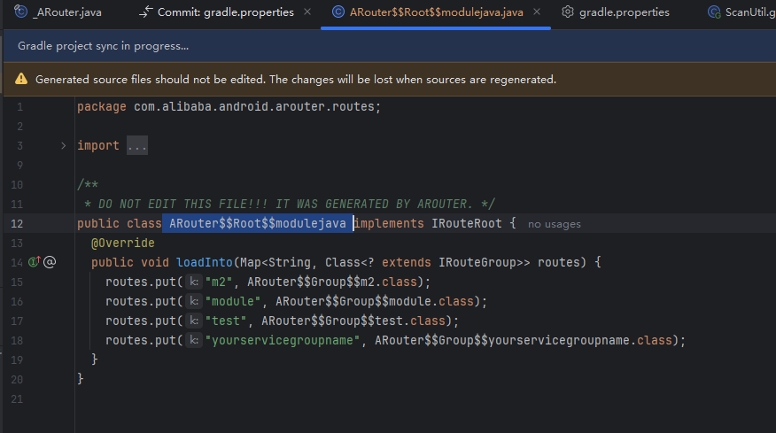
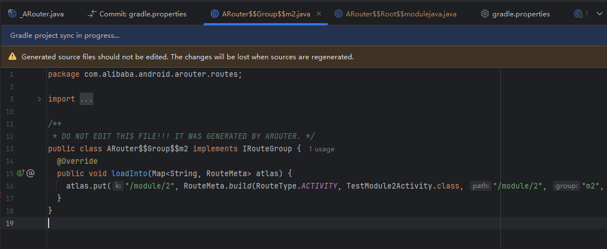
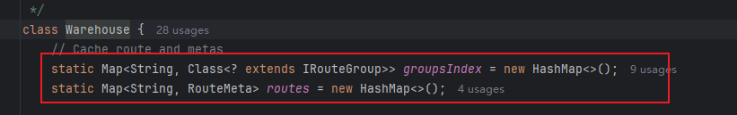
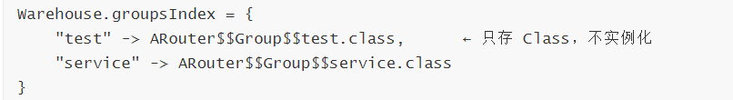
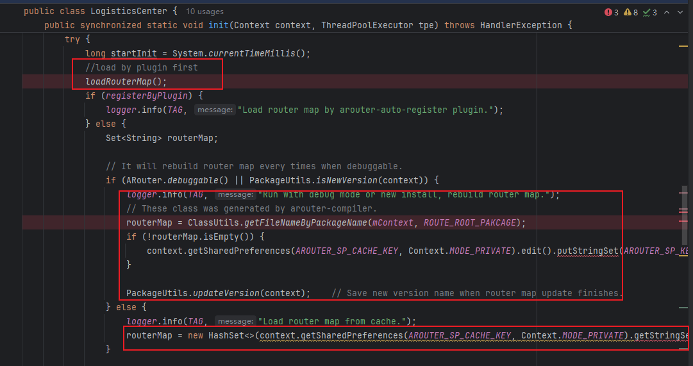
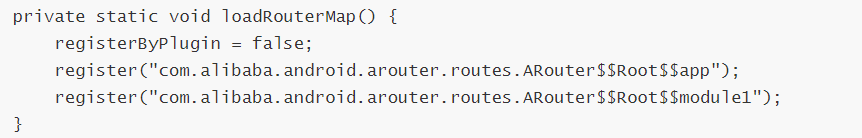
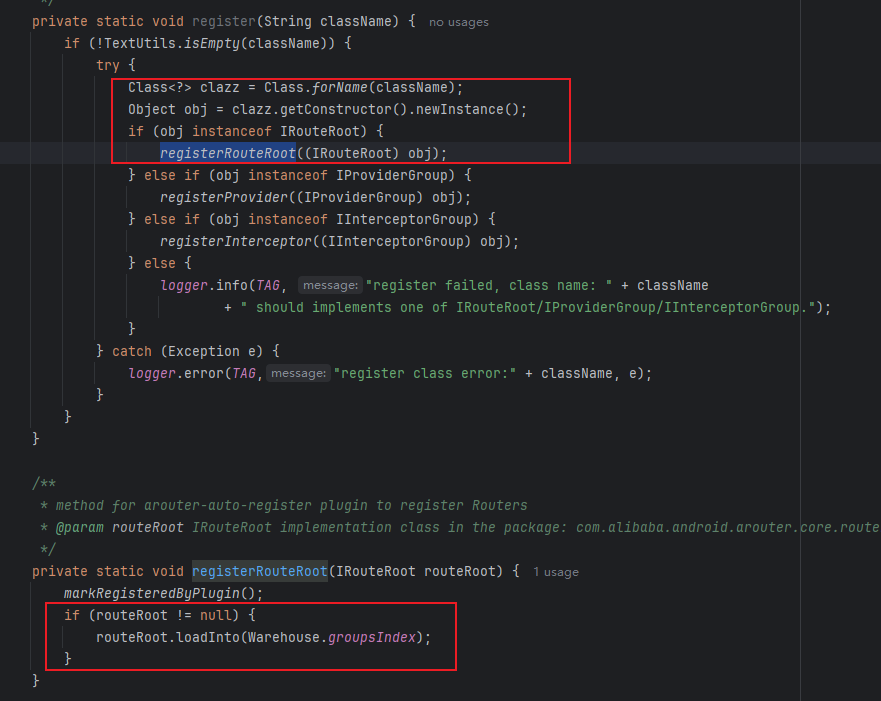
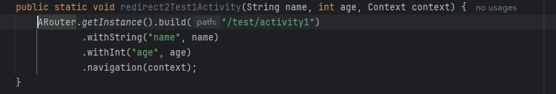
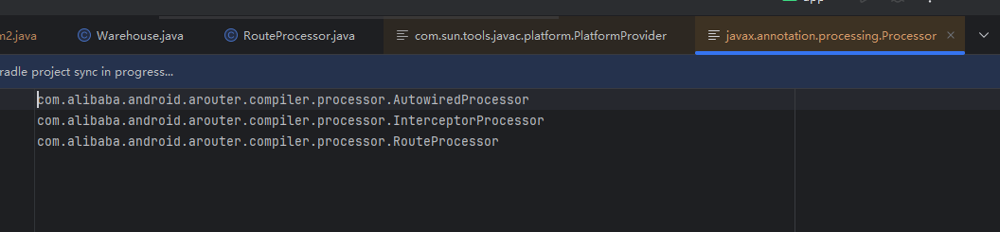

[toc]

## 前言

> 学习要符合如下的标准化链条：了解概念->探究原理->深入思考->总结提炼->底层实现->延伸应用"

## 01.学习概述

- **学习主题**：
- **知识类型**：
  - [ ] ✅Android/ 
    - [ ] ✅01.基础组件与机制 
      - [ ] ✅四大组件
      - [ ] ✅IPC机制
      - [ ] ✅消息机制
      - [ ] ✅事件分发机制
      - [ ] ✅View与渲染体系（含Window、复杂控件、动画）
      - [ ] ✅存储与数据安全（SharedPreferences/DataStore/Room/Scoped Storage）
    - [ ] ✅02. 架构与工程化
      - [ ] ✅架构模式（MVC/MVP/MVVM/MVI）
      - [ ] ✅依赖注入（Koin/Hilt/Dagger）
      - [x] ✅路由与模块化（ARouter、Navigation）
      - [ ] ✅Gradle与构建优化
      - [ ] ✅插件化与动态化
      - [ ] ✅插桩与监控框架
    - [ ] ✅03.性能优化与故障诊断
      - [ ] ✅ANR分析与优化
      - [ ] ✅启动耗时优化
      - [ ] ✅内存泄漏监控
      - [ ] ✅监控与诊断工具
    - [ ] ✅04.Jetpack与生态框架
      - [ ] ✅Room
      - [ ] ✅Paging
      - [ ] ✅WorkManager
      - [ ] ✅Compose
    - [ ] ✅05.Framework与系统机制
      - [ ] ✅ActivityManagerService (含ANR触发机制)
      - [ ] ✅Binder机制
  - [ ] ✅音视频开发/
    - [ ] ✅01.基础知识
    - [ ] ✅02.OpenGL渲染视频
    - [ ] ✅03.FFmpeg音视频解码
  - [ ] ✅ Java/
    - [ ] ✅01.基础知识
    - [ ] ✅02.集合框架
    - [ ] ✅03.异常处理
    - [ ] ✅04.多线程与并发
    - [ ] ✅06.JVM
  - [ ] ✅ Kotlin/
    - [ ] ✅01.基础语法
    - [ ] ✅02.高阶扩展
    - [ ] ✅03.协程和流
  - [ ] ✅ Flutter/
    - [ ] ✅01.基础基础语法
    - [ ] ✅02.状态管理
    - [ ] ✅03.路由与依赖注入
    - [ ] ✅04.原生通信
  - [ ] ✅ 自我管理/
    - [ ] ✅01.内观
  - [ ] ✅ 项目经验/
    - [ ] ✅01.启动逻辑
    - [ ] ✅02.云值守
    - [ ] ✅03.智控平台
- **学习来源**：
- **重要程度**：⭐⭐⭐⭐⭐
- **学习日期**：2025.
- **记录人**：@panruiqi

### 1.1 学习目标

- 了解概念->探究原理->深入思考->总结提炼->底层实现->延伸应用"

### 1.2 前置知识

- [ ] 

## 02. 概念和结构化理解

### 2.1 是什么

ARouter 是阿里巴巴开源的路由框架，核心是实现页面跳转间的解耦和解依赖。

比如：我们常见的startActivity(Intent(this, GoodsDetailActivity::class.java))。他存在两个问题：

1. 写死：GoodsDetailActivity
2. 必须引入：GoodsDetailActivity的依赖。导致我们模块A跳转模块B，必须依赖于模块B。

如果是ARouter，那么就是简单的：ARouter.build("/goods/detail").navigation()。他解决了上面的问题，同时可以支持动态索引，比如：后端传递新的路径，他就可以直接跳转到新的路径。如果是intent，会因为缺少对应路径的依赖而跳转失败。

### 2.2 结构化理解

ARouter分为两个部分：ARouter库 和 开发者使用的部分。

ARouter库，如果拉下来看过源码，会发现他分为四个部分：

1. arouter-annotation，也就是ARouter的注解定义部分
2. arouter-api，也就是ARouter的核心api，包含：LogisticsCenter.java 和 Warehouse，用于处理用户的调用并实现实际跳转的地方
3. arouter-compiler，也就是注解处理器，在编译时javac调用，用于生成路由表，生成的路由表是.java文件。包含：RouteProcessor。
4. arouter-gradle-plugin，也就是 gradle task，这个用于优化路由表的加载，提高加载效率，如果开启了这个插件，那么会进行字节码扫描和插桩，填充字节码到logisticsCenter的loadRouterMap方法中。

### 2.3 我的处理

我在项目中做过 **ARouter Gradle Plugin 的兼容和性能优化**。

阿里官方的插件在 2021 年后就不再维护，仍然基于 **Transform API**，在 **Gradle 8.0** 下已经无法使用。

我最初尝试了社区适配 Gradle 8 的版本，但它在编译时 **不支持 Java 21 的 class 文件（major version 65）**，构建会直接失败。

所以我选择 **直接修改插件源码**，升级并适配 ASM，使其同时支持 **Gradle 8 + Java 21**，并将修改后的插件发布到 **JitPack** 供项目使用，首次启动时间由7.9s降低至5ms，后续启动时间从300ms降低至5ms。

后续发现插件引入后 **整体编译时间增加了将近 2 分钟**，在老机器上影响较大，于是又对插件做了 **本地缓存和扫描范围优化**，明显降低了构建耗时。


### 2.4 整体流程介绍

ARouter的过程分为3个阶段：路由表生成，路由表加载，路由跳转。

先大致介绍一下整体流程吧。

#### 1.路由表生成

路由表生成的核心就是生成2种类型的class文件。root 和 group

- 这是root，包含一个loadInto方法，内部是rotes.put(string, classPath)
  - 

- 这是 group，包含一个loadInto方法，内部是atlas.put(string, RouteMeta)
  - 

这些产物的作用是：

- ARouter在运行时，会有一个warehouse，包含两个hashMap。一个是groupsIndex，一个是routes。
  - 
- 在路由表加载时，就是将root这个类，通过反射调用其loadInto方法，将group 到 classpath的映射填充进groupIndex中。
- 在路由跳转时，会先去routes中判断有没有这个RouteMeta，如果没有，那么回去groupIndex中查找，找到对应的classpath，然后通过反射调用其loadInto方法，将其 root 到RouteMeta的映射填充进 routes中。
- 然后会从RouteMeta中提取对应的要跳转的class名称和类型。比如：Activity，将其名称放入Intent中，进行跳转，如果是Fragment类型，那么会创建对应的实例

那么路由表生成的过程是什么样的呢？

1. 获取Element：路由表生成就是在编译器的javac的环节，调用注解处理器，从roundenv中获取被对应注解标准的类，这里是以Element的形式存在的
2. 创建RouteMeta：从Element中获取3个关键信息：类的type，Activity还是Fragment； 注解信息，也就是包含path 和group； 类的全包名，反射要用到他。 创建对应的RouteMeta
3. RouteMeta分组：每创建一个 RouteMeta，就调用 categories(routeMeta) 进行分组。这里有一个  `private Map<String, Set<RouteMeta>> groupMap = new HashMap<>(); `用于存放分组和对应的set<RouteMeta>信息。其提取group，然后放入对应group的set<RouteMeta>中。
4. 生成 Group 文件：再重复1,2,3。完成对所有路由信息的扫描后，我们得到了最终的groupMap，其存放所有的group， set<RouteMeta>信息。接下来我们会遍历 groupMap，通过JavaPoet技术，为每个分组生成一个 Group 文件。
5. 生成root文件：上面生成了group文件，接下来他哦那哥哥JavaPoet技术生成root文件。最后的文件结果在上面介绍过，在此不做过多赘述。

#### 2.路由表的加载

路由表加载的意义就是处理路由表生成阶段产生的root文件，通过反射调用其loadInto方法，将group 到 classpath的映射填充进groupIndex中。

- 最终结果如下：
  - 

路由表加载的过程呢？分为3种不同的方式，如果有看过logistics的Init方法源码，就会知道

- 整体如下：
  - 

- 首先尝试调用loadRouterMap方法，这个方法是插件通过字节码插桩填充的，最后插桩的结果如下，最终也会通过反射调用其loadInto方法
  - 
  - 
  - 如果说没有插件，那么loadRouterMap为空，调用不到register方法，那么这个标志：registerByPlugin就是false，表示插件方法不生效，就要走默认方法了。
- Dex文件加载：
  - 默认方法如果是debug模式或者是新包（判断包的版本，通过sp打开本地缓存进行比对），那么会走到Dex文件加载流程。
  - 扫描 Dex：其会打开所有的dex文件，遍历里面所有的类，如果这些类的类名startWith   com.alibaba.android.arouter.routes那么会把他们加入到classNames这个集合中、
  - 反射与加载：根据类名区分，如果匹配：com.alibaba.android.arouter.routes.ARouter$Root。那么通过反射调用其loadInto方法。
- Dex加载优化：
  - 如果是release并且非新包，那么会从sp中读取类名缓存，然后进行反射与加载流程。也就是把扫描dex文件优化为sp缓存获取。
- 这里loadRouterMap方法因为是插件在编译时插桩生成，既不需要打开dex，也不需要读取sp。所以速度最快，实测执行大概5ms，sp是300ms，dex是最慢，普遍7.9s左右。

#### 3.路由表的跳转

路由表的跳转逻辑，其目的很简单，处理用户调用的api，补全路径。然后根据类型创建fragment，或者通过系统api跳转到对应的activity

- 如下：
  - 

就是完善Postcard，如果postcard.getType()是ACTIVITY，那么构建Intent，进行相关设置，然后startActivity。如果是Fragment，那么创建对应的实例。最多加个拦截器链和跳转相关的回调。

## 03. 路由表生成逻辑

路由表生成的核心就是生成2种类型的class文件。root 和 group

### 3.1 RouteProcessor的调用

RouteProcessor是注解处理器，在Gradle 构建，调用到Javac时，会调用到这个注解处理器（RouteProcessor），生成Java代码。

#### 1.Javac调用RouteProcessor

关键点在于：Javac如何去调用这个RouteProcessor，核心在于 `@AutoService(Processor.class)` 注解。

- 第1步：添加@AutoService注解

  - ```
    @AutoService(Processor.class)  // ← 加这个注解
    public class RouteProcessor extends AbstractProcessor {
        // 你的注解处理逻辑
    }
    ```

- 第 2 步：编译时自动生成文件：@AutoService 会在编译时生成这个文件：

  - ```
    arouter-compiler/build/classes/java/main/
    └── META-INF/
        └── services/
            └── javax.annotation.processing.Processor
    ```

  - 文件内容：

  - 

- 第 3 步：Javac 启动时自动加载，当你编译项目时，Javac 会：

  - 扫描 classpath 下所有 jar 包
  - 查找 META-INF/services/javax.annotation.processing.Processor 文件
  - 读取文件内容，找到 RouteProcessor 类
  - 实例化并运行这个处理器

核心： Javac 不会主动扫描你的代码找注解处理器，它只认 META-INF/services/ 下的配置文件。这是 Java 的 SPI（服务发现）机制。

#### 2.RouteProcessor匹配对应注解

RouteProcessor是我们的ARouter的注解处理器，不可能处理所有的注解。那么他该怎么声明和匹配自己的业务范围呢？

- 第 1 步：处理器声明自己的"业务范围"

  - ```
    @SupportedAnnotationTypes({
        "com.alibaba.android.arouter.facade.annotation.Route",
        "com.alibaba.android.arouter.facade.annotation.Autowired"
    })
    public class RouteProcessor extends AbstractProcessor {
        // ...
    }
    ```

  - 该注解会存储配置，AbstractProcessor 的默认实现会读取这个注解

  - ```
    // 实际上 AbstractProcessor 已经实现了这个方法：
    public Set<String> getSupportedAnnotationTypes() {
        SupportedAnnotationTypes sat = this.getClass()
            .getAnnotation(SupportedAnnotationTypes.class);
        if (sat == null) {
            return Collections.emptySet();
        }
        return Set.of(sat.value());  // 读取注解的值
    }
    
    
    
    //类似效果如下：
    @Override
    public Set<String> getSupportedAnnotationTypes() {
        return Set.of(
            "com.alibaba.android.arouter.facade.annotation.Route",
            "com.alibaba.android.arouter.facade.annotation.Autowired"
        );
    }
    ```

- 第 2 步：Javac 生成映射表

  - Javac通过 SPI 加载所有注解处理器（通过 META-INF/services）
  - 调用每个处理器的 getSupportedAnnotationTypes()
  - 建立映射表：{"@Route" → [RouteProcessor], "@Autowired" → [RouteProcessor, ...]}

- 第 3 步：Javac 扫描源码

  - ```
    @Route(path = "/test/activity")  // ← 这里有个 @Route
    public class Test1Activity extends Activity {
        @Autowired  // ← 这里有个 @Autowired
        String name;
    }
    
    ```

  - 查映射表：哪些处理器声明了支持 @Route?

  - 找到 RouteProcessor

  - 调用 RouteProcessor.process(annotations, roundEnv)

### 3.2 RouteProcessor的处理过程

#### 1.看看核心入口：process() 方法


## 04.能的提问

 1.为什么不直接移除 ARouter？

> 项目路由体系和模块解耦已经深度依赖 ARouter，短期内重构成本和风险都比较高，所以选择从 **构建工具层面解决兼容问题**。

2.为什么选择 JitPack？

> 主要是为了 **快速托管自定义插件版本**，避免维护私服，同时对业务代码零侵入，后续如果官方恢复维护也可以随时切回。

3.你在这里的角色是什么？

> 主要是 **问题分析 + 技术方案决策 + 核心代码修改**，不是简单的“改配置”。


## 05.深度思考

### 5.1 关键问题探究


### 5.2 设计对比


## 06.实践验证

### 6.1 行为验证代码


### 6.2 性能测试


## 07.应用场景

### 7.1 最佳实践


### 7.2 使用禁忌


## 08.总结提炼

### 8.1 核心收获


### 8.2 知识图谱


### 8.3 延伸思考


## 09.参考资料

1. [探索 ARouter 原理](https://juejin.cn/post/6885932290615509000#heading-63)
2. []()
3. []()

## 其他介绍

### 01.关于我的博客

- csdn：http://my.csdn.net/qq_35829566

- 掘金：https://juejin.im/user/499639464759898

- github：https://github.com/jjjjjjava

- 邮箱：[934137388@qq.com]


