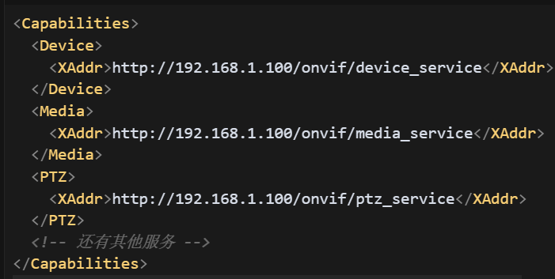
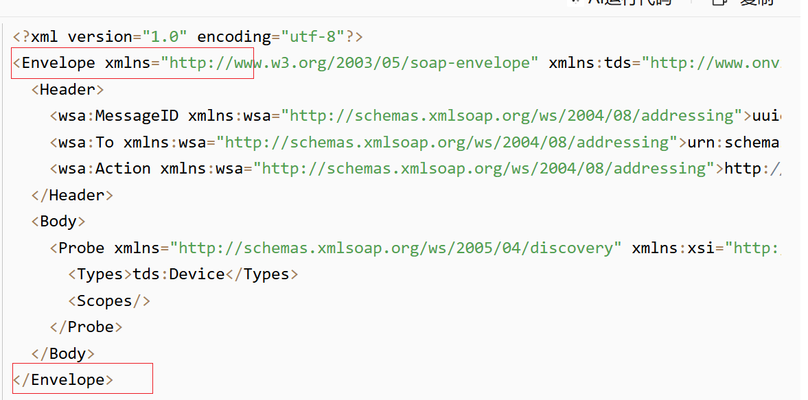
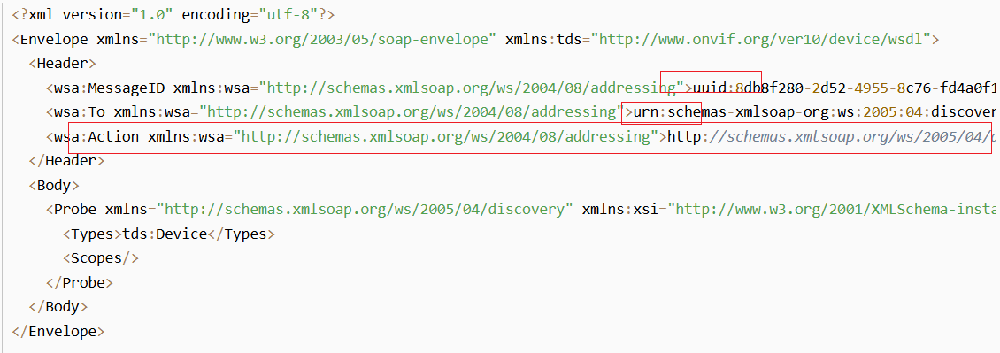
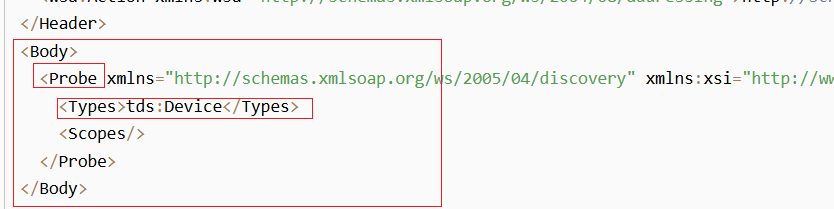
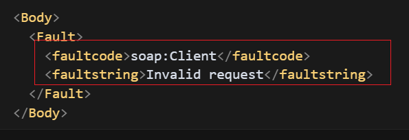

[toc]

## 前言

> 学习要符合如下的标准化链条：了解概念->探究原理->深入思考->总结提炼->底层实现->延伸应用"

## 01.学习概述

- **学习主题**：
- **知识类型**：
  - [ ] ✅Android/ 
    - [ ] ✅01.基础组件与机制 
      - [ ] ✅四大组件
      - [ ] ✅IPC机制
      - [ ] ✅消息机制
      - [ ] ✅事件分发机制
      - [ ] ✅View与渲染体系（含Window、复杂控件、动画）
      - [ ] ✅存储与数据安全（SharedPreferences/DataStore/Room/Scoped Storage）
    - [ ] ✅02. 架构与工程化
      - [ ] ✅架构模式（MVC/MVP/MVVM/MVI）
      - [ ] ✅依赖注入（Koin/Hilt/Dagger）
      - [ ] ✅路由与模块化（ARouter、Navigation）
      - [ ] ✅Gradle与构建优化
      - [ ] ✅插件化与动态化
      - [ ] ✅插桩与监控框架
    - [ ] ✅03.性能优化与故障诊断
      - [ ] ✅ANR分析与优化
      - [ ] ✅启动耗时优化
      - [ ] ✅内存泄漏监控
      - [ ] ✅监控与诊断工具
    - [ ] ✅04.Jetpack与生态框架
      - [ ] ✅Room
      - [ ] ✅Paging
      - [ ] ✅WorkManager
      - [ ] ✅Compose
    - [ ] ✅05.Framework与系统机制
      - [ ] ✅ActivityManagerService (含ANR触发机制)
      - [ ] ✅Binder机制
  - [ ] ✅音视频开发/
    - [ ] ✅01.基础知识
    - [ ] ✅02.OpenGL渲染视频
    - [ ] ✅03.FFmpeg音视频解码
  - [ ] ✅ Java/
    - [ ] ✅01.基础知识
    - [ ] ✅02.集合框架
    - [ ] ✅03.异常处理
    - [ ] ✅04.多线程与并发
    - [ ] ✅06.JVM
  - [ ] ✅ Kotlin/
    - [ ] ✅01.基础语法
    - [ ] ✅02.高阶扩展
    - [ ] ✅03.协程和流
  - [ ] ✅ Flutter/
    - [ ] ✅01.基础基础语法
    - [ ] ✅02.状态管理
    - [ ] ✅03.路由与依赖注入
    - [ ] ✅04.原生通信
  - [ ] ✅ 自我管理/
    - [ ] ✅01.内观
  - [ ] ✅ 项目经验/
    - [ ] ✅01.启动逻辑
    - [ ] ✅02.云值守
    - [ ] ✅03.智控平台
- **学习来源**：
- **重要程度**：⭐⭐⭐⭐⭐
- **学习日期**：2025.
- **记录人**：@panruiqi

### 1.1 学习目标

- 了解概念->探究原理->深入思考->总结提炼->底层实现->延伸应用"

### 1.2 前置知识

- [ ] 

## 02.核心概念

### 2.1 是什么？

ONVIF：Open Network Video Interface Forum。开放网络视频接口协议。

### 2.2 解决什么问题？

早期，每个厂家都有自己的私有协议，这些私有协议其实就是设备和平台之间的“沟通语言”。他们实现了下面的功能：

- 如何在局域网内找到自家摄像头
- 如何获取实时视频流（RTSP/HTTP/自定义流）
- 如何配置设备参数
- 如何远程控制设备

厂商希望用户买了自家摄像头、NVR、平台后，后续只能继续买自家的产品，形成“生态圈”，因此每家都有自己的协议。

这导致了一个问题：每个摄像头厂商都有自己的私有协议，互不兼容，开发者很难做通用的管理和接入。不利于行业发展，因此ONVIF 联盟由安防行业巨头（如安讯士、索尼、博世等）发起，目的是统一网络视频设备的通信标准。

### 2.3 基本特性

它本质上是一套基于 Web Service（SOAP+HTTP）的通信协议，规定了网络摄像头、NVR 等设备的发现、配置、控制、流媒体获取等标准接口

Web Service + SOAP

- ONVIF 的所有接口都是 Web Service，基于 HTTP 协议，数据格式是 XML（SOAP 协议）
- 每个功能（如获取设备信息、获取流地址、控制云台等）都是一个 Web Service 接口

> 好啊，我们这里该怎么理解呢？
>
> - Web Service相当于是接口，也就是url。我们跟接口通信要发送的是http请求，数据格式是xml，也就是soap协议。然后我们的获取能力和信息，控制和配置等功能，其实就是向对应的webService（url）发送http请求，参数是xml（soap）。
>
> 那发现设备呢？
>
> - 发现设备不是 HTTP，而是用 WS-Discovery（基于 UDP 组播）协议在局域网内广播，自动发现摄像头。摄像头收到广播后，会回复自己的 Web Service 地址（URL）。
>
>  获取能力、信息、流地址、控制，修改IP呢？
>
> - 你拿到摄像头的 Web Service URL（比如 http://10.0.0.47/onvif/device_service）。
>
> - 你要做什么操作（比如获取流地址），就向这个 URL 发送一个 HTTP POST 请求。
>
> - 请求体是一个 SOAP（XML） 格式的消息，里面描述了你要调用的功能和参数。
>
> - 摄像头收到请求后，解析 XML，执行操作，然后返回一个 SOAP（XML） 格式的响应
>
> 疑惑：每个服务都有自己的 URL（通常以 /onvif/xxx_service 结尾），那么不同服务的URL如何拿到？
>
> - 首先，通过 WS-Discovery，获取设备的主服务地址（通常是 http://<ip>/onvif/device_service）
> - 然后向主服务地址发送一个标准的 SOAP 请求：GetCapabilities，这个请求不需要参数，只要认证通过即可
> - 设备会返回一个 XML 响应，里面包含了所有支持的服务类型及其对应的 URL。例如，响应中会有 <Media>, <PTZ>, <Events> 等字段，每个字段下有一个 <XAddr>，这就是该服务的 Web Service URL
> - 

## 03.原理机制

### 3.1 基础知识

我们先来看看基础知识。

首先是Web Service 通信的协议栈结构

- SOAP协议：对TCP，UDP的封装，是基于XML的消息协议格式，负责Web Service之间的消息格式和交互。Web Service：最上层，具体的业务接口和功能实现
  - 

WSDL（Web Service Description Language）是用来描述 Web Service 的接口、方法、参数、数据类型等信息的 XML 文档

- 他是说明书，告诉客户端：
  - 你能调用哪些方法（比如 GetDeviceInformation、SetNetworkInterfaces 等）
  - 每个方法需要什么参数、返回什么数据
  - 消息格式、数据类型定义等
- WSDL从哪获取呢？
  - 设备访问：大多数支持 ONVIF 的网络摄像头、NVR 等设备，在其 Web Service 的 URL 后面加 ?wsdl，直接返回 WSDL 文件。
    - 例如: http://192.168.1.100/onvif/device_service?wsdl，你可以在浏览器里直接访问这个地址，通常会看到一份 XML 格式的 WSDL 文件
  - ONVIF 官方标准：ONVIF 官方网站（https://www.onvif.org/profiles/specifications/）提供了所有标准服务的 WSDL 文件下载。这些是通用的标准定义，绝大多数设备都兼容
- 开发建议：优先用设备实际返回的 WSDL，因为有些厂商会在标准基础上做扩展或裁剪。如果设备没有提供 WSDL，可以用 ONVIF 官方的标准 WSDL 文件

SOAP协议：分为四个部分

- Envelope（信封），最外层标签，标识这是一条 SOAP 消息。
  - 
- Header（头部，可选）：包含一些元数据，比如认证信息、消息ID、目标地址、动作类型等。
  - MessageID：本次消息的唯一标识。
  - To：消息要发给谁（目标服务）。
  - Action：本次要执行的操作（比如“发现设备”）
  - 
- Body：包含实际要做的事情和参数（比如调用哪个方法、传什么参数）。这里 <Probe> 表示“发现设备”操作，<Types> 指定要找的设备类型
  - 
- Fault：如果服务端处理出错，会在 Body 里返回一个 <Fault> 元素，说明错误原因
  - 

WSDL和SOAP的关系：SOAP 是实际通信时用的消息格式，SOAP 消息的结构和内容必须符合 WSDL 的定义

gSOAP 工具的作用

- gSOAP 是一个 C/C++ 的 Web Service 框架，可以自动解析 WSDL 文件，生成对应的 C/C++ 代码
- 这样开发者只需要调用自动生成的 API，不用手写繁琐的 XML 和 SOAP 消息，极大提高开发效率，减少出错

### 3.2 进一步思考

## 04.底层原理

## 05.深度思考

### 5.1 关键问题探究

### 5.2 设计对比

## 06.实践验证

### 6.1 行为验证代码

### 6.2 性能测试

## 07.应用场景

### 7.1 最佳实践

### 7.2 使用禁忌

## 08.总结提炼

### 8.1 核心收获

### 8.2 知识图谱

### 8.3 延伸思考

## 09.参考资料

1. 
2. 
3. 

## 其他介绍

### 01.关于我的博客

- csdn：http://my.csdn.net/qq_35829566

- 掘金：https://juejin.im/user/499639464759898

- github：https://github.com/jjjjjjava

- 邮箱：[934137388@qq.com]

