[toc]

[toc]

## 前言

> 学习要符合如下的标准化链条：了解概念->探究原理->深入思考->总结提炼->底层实现->延伸应用"

## 01.学习概述

- **学习主题**：
- **知识类型**：
  - [ ] ✅Android/ 
    - [ ] ✅01.基础组件与机制 
      - [ ] ✅四大组件
      - [ ] ✅IPC机制
      - [ ] ✅消息机制
      - [ ] ✅事件分发机制
      - [ ] ✅View与渲染体系（含Window、复杂控件、动画）
      - [x] ✅存储与数据安全（SharedPreferences/DataStore/Room/Scoped Storage）
    - [ ] ✅02. 架构与工程化
      - [ ] ✅架构模式（MVC/MVP/MVVM/MVI）
      - [ ] ✅依赖注入（Koin/Hilt/Dagger）
      - [ ] ✅路由与模块化（ARouter、Navigation）
      - [ ] ✅Gradle与构建优化
      - [ ] ✅插件化与动态化
      - [ ] ✅插桩与监控框架
    - [ ] ✅03.性能优化与故障诊断
      - [ ] ✅ANR分析与优化
      - [ ] ✅启动耗时优化
      - [ ] ✅内存泄漏监控
      - [ ] ✅监控与诊断工具
    - [ ] ✅04.Jetpack与生态框架
      - [ ] ✅Room
      - [ ] ✅Paging
      - [ ] ✅WorkManager
      - [ ] ✅Compose
    - [ ] ✅05.Framework与系统机制
      - [ ] ✅ActivityManagerService (含ANR触发机制)
      - [ ] ✅Binder机制
  - [ ] ✅音视频开发/
    - [ ] ✅01.基础知识
    - [ ] ✅02.OpenGL渲染视频
    - [ ] ✅03.FFmpeg音视频解码
  - [ ] ✅ Java/
    - [ ] ✅01.基础知识
    - [ ] ✅02.集合框架
    - [ ] ✅03.异常处理
    - [ ] ✅04.多线程与并发
    - [ ] ✅06.JVM
  - [ ] ✅ Kotlin/
    - [ ] ✅01.基础语法
    - [ ] ✅02.高阶扩展
    - [ ] ✅03.协程和流
  - [ ] ✅ Flutter/
    - [ ] ✅01.基础基础语法
    - [ ] ✅02.状态管理
    - [ ] ✅03.路由与依赖注入
    - [ ] ✅04.原生通信
  - [ ] ✅ 自我管理/
    - [ ] ✅01.内观
  - [ ] ✅ 项目经验/
    - [ ] ✅01.启动逻辑
    - [ ] ✅02.云值守
    - [ ] ✅03.智控平台
- **学习来源**：
- **重要程度**：⭐⭐⭐⭐⭐
- **学习日期**：2025.
- **记录人**：@panruiqi

### 1.1 学习目标

- 了解概念->探究原理->深入思考->总结提炼->底层实现->延伸应用"

### 1.2 前置知识

- [ ] 

## 02.核心概念

### 2.1 是什么？

Android的存储结构介绍

### 2.2 解决什么问题？

Android的存储结构是什么样的？

假如让你去设计App内部的清除缓存，你应该清除的是哪些数据？

### 2.3 基本特性

## 03.原理机制

### 3.1 存储划分

Android 4.4之前

- 机身存储全部为内部存储，外部插入的SD卡当作外部存储
  - 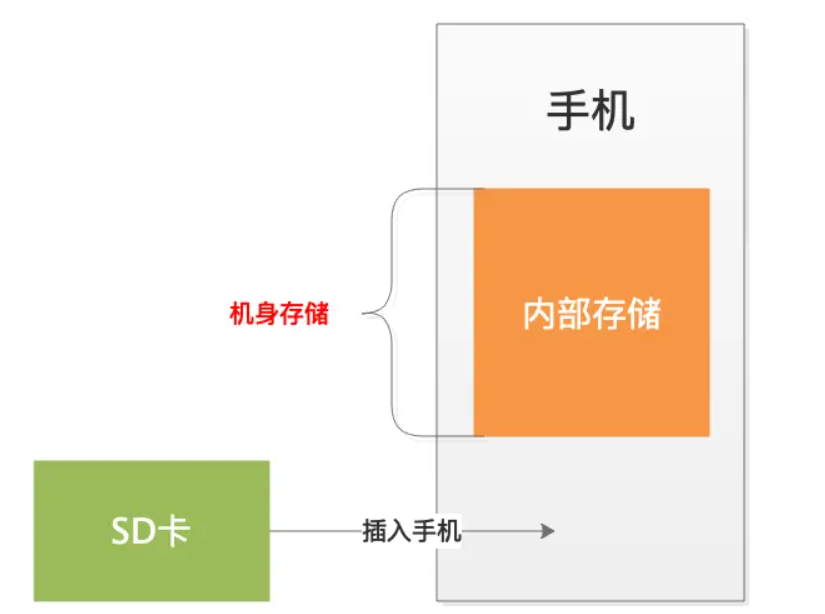

Android 4.4之后，机身存储空间变大

- 机身存储分为内部存储和外部存储，SD卡则被称为扩展的外部存储空间
  - 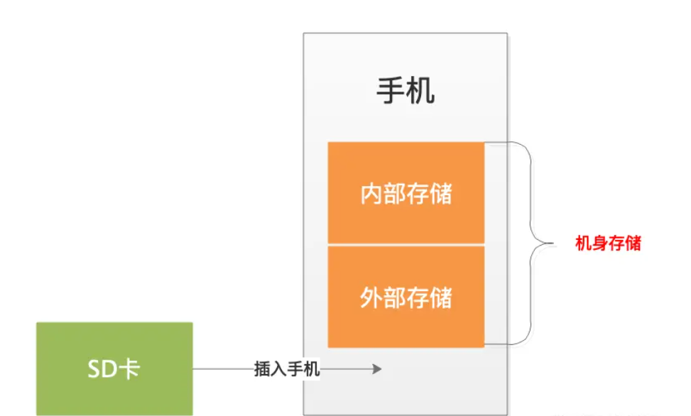

### 3.2 内部存储

存储的位置：

- 假设App的包名为：com.fish.myapplication，那么该文件在内部存储里的目录为： **/data/user/0/com.fish.myapplication/**

  - 第一个"/"表示根目录，其后每个"/"表示目录分割符。 "0" 表示是第一个用户，后续添加了多用户则生成相应的用户目录：
  - 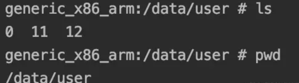

- 而/data/user/0/com.fish.myapplication/ 会将值转换到/data/data/com.fish.myapplication/ 路径下。 

  - 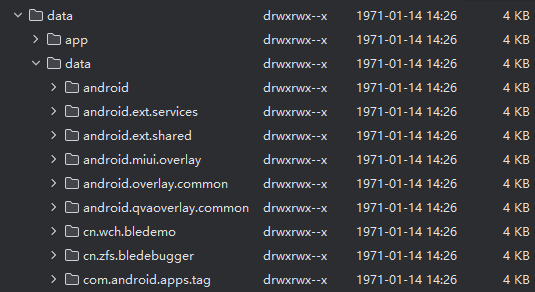

- 这么做的目的是什么呢？

  - /data/user/<userId>/包名/ 结构让每个用户的数据互不干扰，安全隔离。
  - 只有主用户（user 0）为了兼容老应用，才有 /data/data/包名/ 这个“别名”。

  - 其他用户的数据只在 /data/user/1/包名/、/data/user/2/包名/ 等目录下，不会出现在 /data/data/ 下。

- 每个App的内部存储空间仅允许自己访问(除非有更高的权限，如root)，程序卸载后，该目录也会被删除。

存储的内容

- 内部存储存放了哪些文件呢？
  - 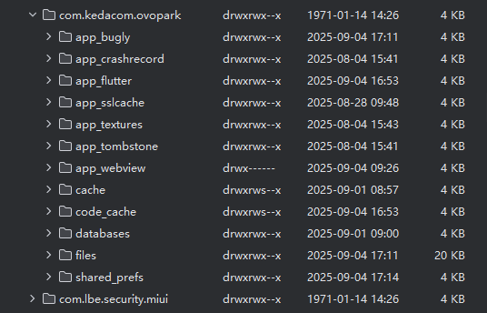
- 怎么理解他们呢？
  - cache-->存放缓存文件
  - code_cache-->存放运行时代码优化等产生的缓存
  - databases-->存放数据库文件
  - files-->存放一般文件
  - shared_prefs-->存放SharedPreferences 文件

访问方式：

- context.getFilesDir()：/data/user/0/com.fish.myapplication/files/
- context.getCacheDir()：    /data/user/0/com.fish.myapplication/cache/
- context.getDir(String name, int mode)：  /data/user/0/com.fish.myapplication/
- context.getCodeCacheDir()：  /data/user/0/com.fish.myapplication/code_cache/

### 3.3 外部存储

存放位置

- 要关注2个位置：/sdcard/， /storage/
  - 其中：sdcard被重定向到/storage/self/primary，又进一步被定向到/storage/emulated/0
  - 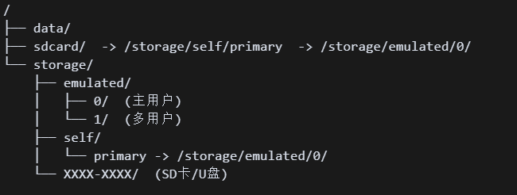
  - 如果插入其他外部SDK卡，那么会有sdcard/1，并且对应storage/xxxx-xxxx/

- 来，我们来验证一下：
  - 这里可以看到storage/self/primary
  - 
  - 和sdcard对应啊，里面内容都有
  - 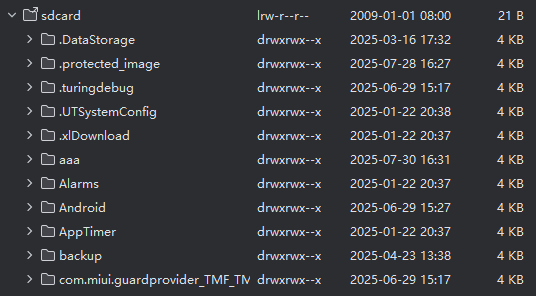

存储内容

- 那么他们的存储内容有哪些呢？
  - 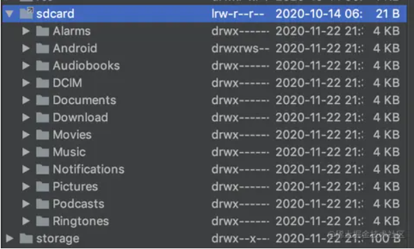

这些子目录分为分为三部分：

- 共享存储空间，也就是所有App共享的部分，比如相册、音乐、铃声、文档等。包含
  - **媒体文件**：
  - 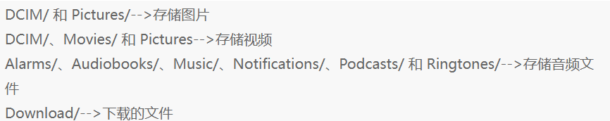
  - **文档和其它文件**：Documents-->存储如.pdf类型等文件
  - 比如：
  - 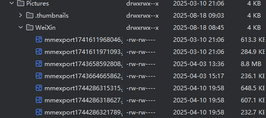
- APP外部私有目录：
  - Android/data/--->存储各个App的外部私有目录，与内部存储类似，命名方式是：Android/data/xx------>xx指应用的包名。
  - 如：/sdcard/Android/data/com.jjjjjjava.myapplication
  - 比如：
  - 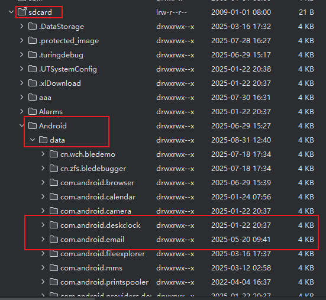
- 其他目录
  - 比如各个App在/sdcard/目录下创建的目录，如支付宝创建的目录：alipy/，微博创建的目录： com.sina.weibo/，qq创建的目录：com.tencent.mobileqq/等
  - 比如：
  - 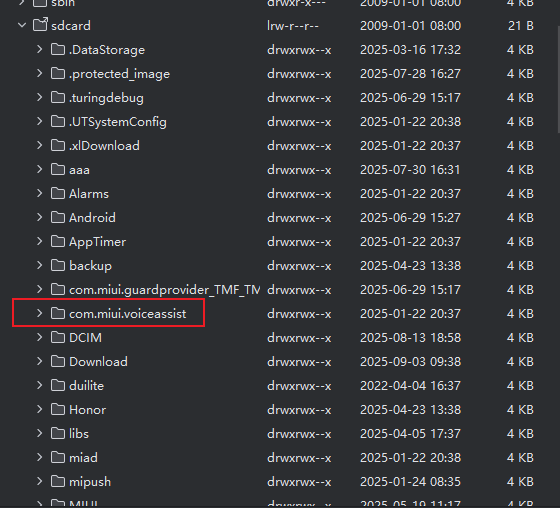

访问方式：

- 4个基本方法  ，这是用来访问外部存储空间中的用户私有目录
  - File fileDir = context.getExternalFilesDir(null);  
  - File[] fileList = context.getExternalFilesDirs(null);         
  - File cacheDir = context.getExternalCacheDir();       
  - File[] cacheList = context.getExternalCacheDirs();
- 看目录树，可以看出再/sdcard/Android/data/目录下生成了com.fish.myapplication/目录，该目录下有两个子目录分别是：files/、cache/。
  - 

- 所以，其实不用管是外部存储还是内部存储，应用都开了自己的私有空间。他们里面都有cache和files

那么提问，如果我们插入了SD卡呢？

- 此时我们如何访问？还记得上面获取外部存储-App私有目录方式吗？
- File**[]** fileList = context.getExternalFilesDirs(null)*;*，返回File对象数组，当有多个外部存储时候，存储在数组里。
- 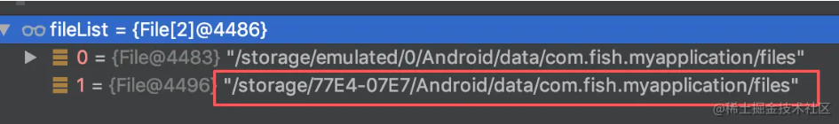
- 返回的数组有两个元素，一个是自带外部存储存储，另一个是刚插入的SD卡。 拿到路径后，当然就可以访问相应的文件了。

### 3.4 小结

简单总结一下：

- 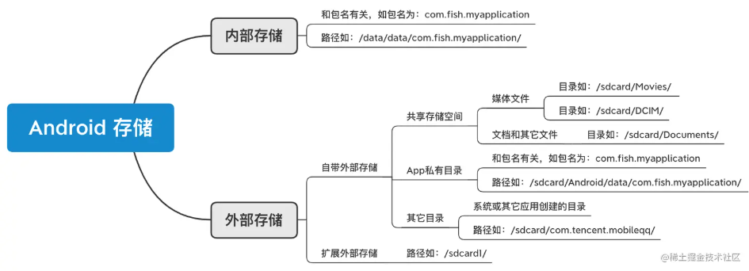

### 3.5 系统缓存清除

好，现在我们回答一个问题：我们这里的清除缓存和清除数据会分别处理哪些？

- 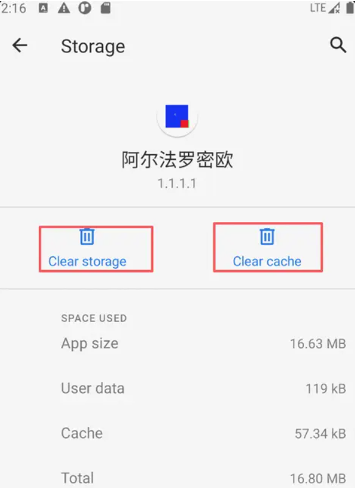

当你点击清除缓存时，你会处理：内部存储的cache和cache_code，以及外部存储的用户私有的cache，他们对应如下目录

- /data/data/com.jjjjjjava.myapplication/cache 被清空
- /data/data/com.jjjjjjava.myapplication/cache_code 被清空
- /sdcard/Android/data/com.jjjjjjava.myapplication/cache 被清空

当你点击清除数据时，你会处理：内部存储的应用私有的所有，以及外部存储的应用私有的所有

- /data/data/com.jjjjjjava.myapplication/，子目录被清空
- /sdcard/Android/data/com.jjjjjjava.myapplication/，子目录被清空

## 04.底层原理

## 05.深度思考

### 5.1 关键问题探究

### 5.2 设计对比

## 06.实践验证

### 6.1 行为验证代码

### 6.2 性能测试

## 07.应用场景

### 7.1 最佳实践

### 7.2 使用禁忌

## 08.总结提炼

### 8.1 核心收获

### 8.2 知识图谱

### 8.3 延伸思考

## 09.参考资料

1. [Android-存储基础](https://juejin.cn/post/7012108220982362149#heading-5)
2. 
3. 

## 其他介绍

### 01.关于我的博客

- csdn：http://my.csdn.net/qq_35829566

- 掘金：https://juejin.im/user/499639464759898

- github：https://github.com/jjjjjjava

- 邮箱：[934137388@qq.com]

