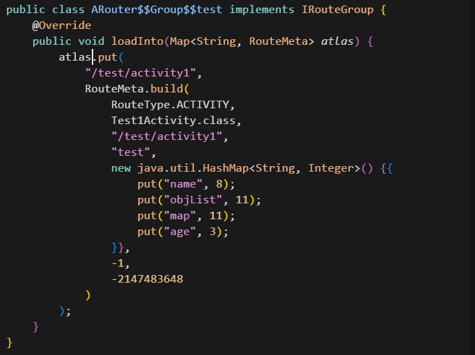
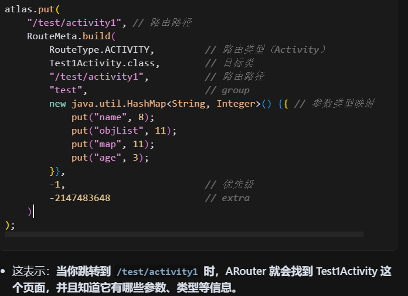
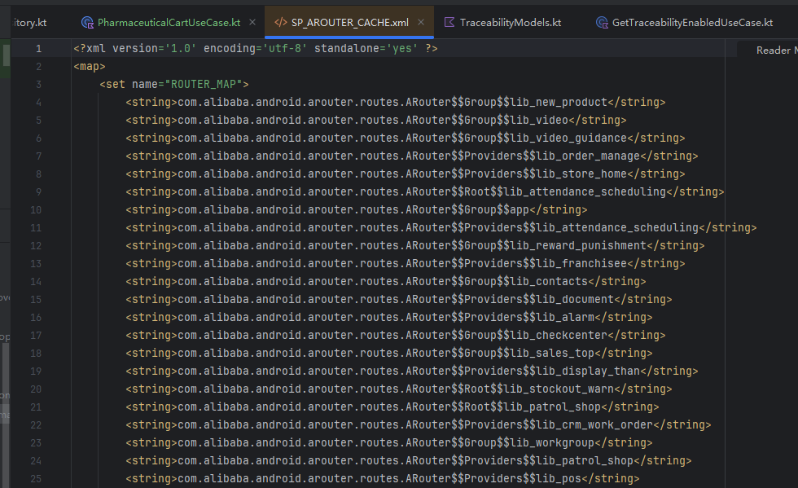

## 流程记录

他分为三个部分：生成路由表，加载路由表，ARouter跳转。

生成本质是在编译器借助Gradle去调用ARouter的注解处理器方法去解析element，然后去封装对应的RouterMeta，这些类本质上就是把 path、group、目标 class 等信息封装成 RouteMeta，静态写入 Java 类中。

加载分为两个种类，一个是：启动时加载，另一个是借助Gradle插件加载

- 启动时加载是指：
  - Dex扫描：用 DexFile 扫描 dex 文件，只读取类名，比如所有以 com.alibaba.android.arouter.routes 开头的类名。
  - 类名缓存：然后存放进SharedPreferences
  - 把路由信息保存到索引： LogisticsCenter 通过类名后缀判断类型（Root/Provider/Interceptor），用反射实例化并调用 loadInto()，把路由信息加载到 Warehouse 的各种索引 Map（groupsIndex、providersIndex、interceptorsIndex）中
- Gradle加载是编译时加载
  - Gradle加载时执行 Transform，Transform 是 Android Gradle Plugin 提供的编译期字节码处理扩展点。这里会遍历所有编译产物（Jar、Class 文件），包括注解处理器生成的路由表类，用 ScanClassVisitor.visit() 访问每个 Class 文件的字节码。判断类是否实现了 IRouteRoot、IInterceptorGroup、IProviderGroup 接口。如果是，把类名加入到 ScanSetting.classList
  - 扫描完所有路由表类名后，RegisterCodeGenerator.insertInitCodeIntoJarFile() 会把这些类名写入到 Jar 包中的 LogisticsCenter.loadRouterMap() 方法里。 
  - 这样，ARouter 初始化时，直接调用 loadRouterMap()，就能拿到所有路由表类名，无需再扫描 Dex 文件

ARouter跳转是指：从navigation开始

- navigation()：发起跳转请求。

- 预处理服务：如参数预处理、服务发现等。

- 完善明信片（Postcard）：调用 LogisticsCenter.completion()，从 Warehouse 索引中查找 RouteMeta，补全 Postcard 的 destination、type 等信息。

- 降级策略：如果找不到路由或跳转失败，执行降级处理（如跳转到错误页）。

- 拦截器链：执行用户自定义的拦截器（如登录校验、埋点等）。

- 真正跳转：
  - Activity：构造 Intent，startActivity。
  - Fragment/Provider：反射创建实例，返回对象。
  - Service：反射获取服务实例

生成路由表

Arouter跳转

- 

## 路由表生成过程

Element？怎么理解：RouteProcessor 通过获取Element去在编译期操作我们的源码？

- 什么是Element？

  - Element 就是 Java 编译器在“理解”你的代码时，对每个结构（类、方法、字段等）做的一个“代表对象”

- Element 是一个接口，它有很多“子接口”，每个子接口代表一种源码结构

  - | 代码结构          | 对应 Element 子接口  | 举例（源码）         |
    | :---------------- | :------------------- | :------------------- |
    | 包                | PackageElement       | package com.example; |
    | 类/接口/枚举/注解 | TypeElement          | class MyClass {}     |
    | 字段              | VariableElement      | int age;             |
    | 方法/构造方法     | ExecutableElement    | void foo() {}        |
    | 方法参数          | VariableElement      | void foo(int a)      |
    | 类型参数          | TypeParameterElement | <T>                  |
    | 局部变量          | VariableElement      | int x = 1;           |

  - 这些子接口都继承自 Element。

  - 你可以通过判断 Element 的类型，知道它代表的是类、方法还是字段。

- 小结：通过对Element的处理，让注解处理器可以在编译期分析和操作你的源码结构。

收集流程是什么样的？

- 在编译期间，Javac 会运行注解处理器（比如 ARouter 的 RouteProcessor），

  注解处理器会调用 getElementsAnnotatedWith(注解类.class) 方法，

  把所有在 Java 文件中被这个注解标记的“Element”都收集起来。

  这些 Element 就是编译器对源码结构（类、方法、字段等）的抽象表示，

创建路由元信息是什么？

- 就是把每个被 @Route 标记的类，分析出它的所有关键信息，封装成 RouteMeta。

- RouteMeta 是什么？

  - RouteMeta 是路由表中的一行数据，是用来描述一条路由的所有关键信息的对象。

  - 它包含了：路由类型（Activity/Provider/Service/Fragment）、目标类、路径、分组、参数类型、注入配置等。

  - 每个被 @Route 标记的类都会生成一个 RouteMeta。

- 创建RouteMeta的流程是什么？

  - 遍历所有被 @Route 标记的类（Element），这些类可能是 Activity、Provider、Service 或 Fragment

  - 根据类型分别处理

    - 如果是 Activity：
      - 还会进一步遍历它的“子元素”，也就是它的成员变量。
      - 如果成员变量上有 @Autowired 注解，说明这个变量需要自动注入（比如页面跳转时自动传参）。
      - 这些需要注入的成员变量信息会被收集，放到 RouteMeta 的 injectConfig 里。
    - 如果是 Provider、Service、Fragment：
      - 直接创建对应类型的 RouteMeta，不需要处理成员变量

  - 生成 RouteMeta 对象：把上面收集到的信息（类型、目标类、路径、分组、injectConfig 等）都封装到一个 RouteMeta 对象里

    

把路由元信息分组？

- 为什么分组

  - 路由表可能有很多条路由（RouteMeta），如果全部放在一起查找会很慢。

  - 分组后，查找时可以先定位到分组，再在分组里查找，效率更高。

  - 分组还方便模块化开发，不同业务模块的路由可以分开管理。

- 分组规则

  - 每个 RouteMeta 都有一个 group 字段，表示它属于哪个分组。

  - group 的来源有两种：

  1. @Route 注解里手动指定 group，比如 @Route(path = "/goods/details", group = "taobao")，那么 group 就是 taobao。

  1. 没有指定 group，就自动用 path 的第一级作为 group，比如 /goods/details，group 就是 goods。

- groupMap是什么？

  - 在 RouteProcessor 里，有一个 groupMap，类型一般是 Map<String, List<RouteMeta>>。

  - key 是 group 名（比如 goods、user、order），value 是属于这个 group 的所有 RouteMeta 列表。

生成路由表？

- 什么是生成路由表？
  - 前面三步（获取路由元素、创建路由元信息、分组）完成后，RouteProcessor 会用 JavaPoet 生成 Java 源文件。
  - 这些文件分为三类：Group 路由文件、Provider 路由文件、Root 路由文件。
  - Group 路由文件，存储每个 group（分组）下所有的路由信息。
  - Provider 路由文件，专门存储所有实现了 IProvider 接口的服务（比如全局服务、跨模块服务）。
  - Root 路由文件，存储所有 group 的索引（即有哪些 group，每个 group 对应哪个 Group 路由文件）。
- ARouter 初始化时先通过 Root 路由表找到所有 group，再按需加载对应的 Group 路由表。使用时，先通过group找到对应的group路由文件，然后依照路径找到对应的RouteMeta

- 来看一个经典的Group路由文件

  - 
  - 它实现了 IRouteGroup 接口，只有一个方法 loadInto。

  - loadInto 方法的参数 atlas 是一个 Map，key 是 path，value 是 RouteMeta。

  - 这段代码的作用是：把本 group 下所有路由条目注册到 atlas 里。
  - 具体下来，路由路径是key，下面的创建的RouteMeta是value
  - 
  - put("name", 8); 这些数字是参数类型的枚举值（比如 8 代表 String，11 代表 List 等），用于后续自动注入参数。

我存在一个问题，为什需要root？如果有root，我们的访问操作是这样的：一次访存获取root文件，然后找到对应的group文件的内存地址，再次访存获取group文件。我感觉可以不用root文件，直接group文件中路径为key，RouteMeta为value，做一个映射，这样访存操作时间复杂度为1，也减少了一次内存访问。

- 主要出于以下几个方面的考虑：

- 模块化

  - 分模块编译：在大型项目中，通常会有多个业务模块（如app、login、main、order等），每个模块都可以独立编译、独立开发。

  - 路由表分散：每个模块只生成自己相关的Group文件（如ARouter$$Group$$login），而不会生成其他模块的路由信息。这样他们彼此隔离

- 启动速度与内存占用的平衡

  - 按需加载：Arouter初始化时只加载Root文件，只有在需要跳转到某个group时，才会去加载对应的Group文件。这样可以避免一次性加载所有路由信息，减少内存占用和启动耗时。

  - 懒加载机制：如果直接用一个大Map，所有路由信息都要在启动时加载进内存，随着业务增长，路由表会越来越大，影响启动性能。

- 编译问题：

  - 新增模块时只需生成自己的Group和Root索引，不需要重新生成和合并整个大Map，提升灵活性和可维护性。

-  你的“大Map”方案适用场景

  - 适合小型、单模块项目，路由表很小，启动时一次性加载完全没问题。

  - 不适合大型、组件化、插件化项目，因为会带来编译依赖膨胀、内存占用增加、灵活性下降等问题。

## ARouter 路由表生成流程小结

### 1. 编译时注解处理启动

- Android Gradle 插件在编译时会调用 Javac。

- Javac 会自动调用所有注册的注解处理器（如 ARouter 的 RouteProcessor）。

------

### 2. 路由解析四大步骤

#### 1）获取路由元素

- RouteProcessor 的 process() 方法会被调用。

- 通过 roundEnv.getElementsAnnotatedWith(Route.class) 获取所有被 @Route 注解标记的类（Element）。

- 这些 Element 可能是 Activity、Provider、Service、Fragment 等。

#### 2）创建路由元信息

- 对每个 Element，RouteProcessor 会根据类型（Activity/Provider/Service/Fragment）创建一个 RouteMeta 实例。

- 如果是 Activity，还会遍历其成员变量，收集带 @Autowired 注解的字段，放入 RouteMeta 的 injectConfig。

- RouteMeta 记录了路由的所有关键信息（类型、目标类、路径、分组、参数类型、注入配置等）。

#### 3）把路由元信息进行分组

- RouteProcessor 会把所有 RouteMeta 按 group 字段分组，存入 groupMap。

- group 的来源：@Route 注解里指定的 group，没有指定时用 path 的第一级作为 group。

#### 4）生成路由表文件

- RouteProcessor 用 JavaPoet 自动生成三类 Java 文件：

- Group 路由文件：每个 group 一个，存储本组下所有路由条目。

- Provider 路由文件：存储所有 Provider 服务。

- Root 路由文件：存储所有 group 的索引，指向对应的 Group 路由文件。

- 这些文件会被编译进 APK，路径一般在 build/generated/source/kapt/(debug/release)/com/alibaba/android/arouter/routes/。

------

### 3. 运行时加载与使用

- 应用启动时，LogisticsCenter 会加载这些路由表文件，把路由信息填充到 Warehouse（仓库）中。

- Warehouse 里维护了所有路由和 Provider 的索引。

- 当你调用 ARouter 跳转时，就会根据这些索引查找目标页面或服务，完成路由跳转。

------

### 4. 总结一句话

\> ARouter 的路由表是在编译期通过注解处理器自动生成的，分为 Group、Provider、Root 三类文件，运行时由 LogisticsCenter 加载到 Warehouse，供路由跳转时高效查找和使用。

怎么理解：当我们调用 Postcard 的 `navigation()` 方法时，Postcard 会调用 _ARouter 的 navigation() 方法，然后 _ARouter 才会去`加载路由表`

我的疑问：Arouter这么晚加载路由表吗？不是启动的时候加载吗？

回复：它只会在初始化时加载Root表（即所有Group的索引），各个Group的路由表是“按需懒加载”的

- 懒加载流程：

  - 当你第一次跳转到某个path时，Arouter会：

  1. 先通过Root表找到该path属于哪个Group。

  1. 检查内存中是否已经加载过该Group的路由表。

  1. 如果没有加载过，就动态加载该Group的路由表（即通过反射实例化Group类，并把它的内容加载到内存）。

  1. 之后再跳转到同一Group下的其他path时，就不需要再加载Group表了，直接查内存即可。

WareHose是用来做什么的？

LogisticsCenter 呢？又是用来做什么的？ 

## 1. Warehouse 结构说明

图片展示了Arouter的核心数据仓库 Warehouse，它包含了如下几个重要的索引和映射：

- groupsIndex：HashMap<String, Class<? extends IRouteGroup>>

存储 group 名到 group 类的映射（Root表的内容）。

- routes：HashMap<String, RouteMeta>

存储 path 到 RouteMeta 的映射（所有已加载的路由元信息）。

- providersIndex、providers、interceptorsIndex、interceptors

分别是 Provider 和拦截器的索引和实例映射，这里我们重点关注 group 和 routes。

------

## 2. LogisticsCenter 初始化流程

- 初始化时，LogisticsCenter.init() 会扫描所有通过注解处理器（RouteProcessor）生成的 Root、Group、Provider 等类，把它们的索引（如 group -> group class）加载到 Warehouse.groupsIndex 里。

- 此时 routes 还没有填充，只是有了 group 的索引。

------

## 3. 路由元信息的获取（completion 流程）

### 步骤详解

1. 跳转时调用 completion()

- 你调用 ARouter.getInstance().build("/main/home").navigation()，最终会走到 LogisticsCenter.completion(Postcard)。

1. 先查 routes

- completion() 首先会在 Warehouse.routes 里查找 path（如 /main/home）对应的 RouteMeta。

- 如果找到了，说明该路由已经被加载过，直接返回。

1. 查不到则懒加载 group

- 如果没找到，说明该 group（如 main）还没有被加载。

- 这时会通过 Warehouse.groupsIndex 拿到 group class（如 ARouter$$Group$$main），通过反射实例化并调用其 loadInto() 方法，把 group 下所有 path -> RouteMeta 加载到 Warehouse.routes 里。

- 加载完后，会把 group 从 groupsIndex 移除，避免重复加载。

1. 再次查 routes

- 现在再查 Warehouse.routes，就能找到对应的 RouteMeta 了，完成 Postcard 的信息填充。

## 1. Postcard是什么？

- Postcard 就是ARouter内部用于描述一次路由跳转的“明信片”对象。

- 它包含了path、group、参数、目标Class（destination）、路由类型等信息。

- 你调用 ARouter.getInstance().build("/main/home") 时，ARouter会先创建一个只包含path和group的Postcard，其它信息（如目标Class）还没有。

------

## 2. 为什么Postcard信息不完整？

- 因为仅凭path，ARouter还不知道你要跳转的是Activity、Fragment还是Provider，也不知道目标Class是什么。

- 这些信息都需要从路由表（RouteMeta）中查出来，填充到Postcard里。

------

## 3. LogisticsCenter的作用

- LogisticsCenter.completion(Postcard) 就是用来“补全明信片信息”的。

- 它会根据Postcard的path，从Warehouse.routes中查找对应的RouteMeta。

- RouteMeta里包含了目标Class（destination）、路由类型、参数等所有元信息。

- LogisticsCenter会把这些信息填充到Postcard对象里。

------

## 4. 填充后的Postcard能做什么？

- 有了完整的Postcard，ARouter就能根据destination字段，构造Intent，发起Activity跳转，或者调用Provider、Fragment等。
  - 这就是ARouter跳转的核心流程。 

