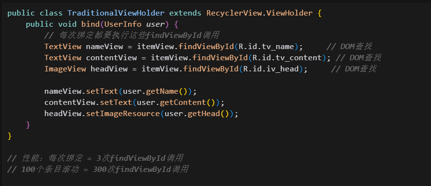
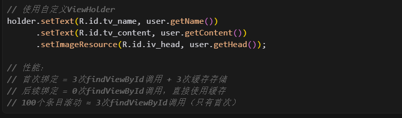

[toc]

## 前言

> 学习要符合如下的标准化链条：了解概念->探究原理->深入思考->总结提炼->底层实现->延伸应用"

## 01.学习概述

- **学习主题**：RecyclerView基础
- **知识类型**：
  - [ ] **知识类型**：
    - [ ] ✅Android/ 
      - [ ] ✅01.基础组件
      - [ ] ✅02.IPC机制
      - [ ] ✅03.消息机制
      - [ ] ✅04.View原理
      - [ ] ✅05.事件分发机制
      - [ ] ✅06.Window
      - [x] ✅07.复杂控件
      - [ ] ✅08.性能优化
      - [ ] ✅09.流行框架
      - [ ] ✅10.数据处理
      - [ ] ✅11.动画
      - [ ] ✅12.Groovy
    - [ ] ✅音视频开发/
      - [ ] ✅01.基础知识
      - [ ] ✅02.OpenGL渲染视频
      - [ ] ✅03.FFmpeg音视频解码
    - [ ] ✅ Java/
      - [ ] ✅01.基础知识
      - [ ] ✅02.Java设计思想
      - [ ] ✅03.集合框架
      - [ ] ✅04.异常处理
      - [ ] ✅05.多线程与并发编程
      - [ ] ✅06.JVM
    - [ ] ✅ Kotlin/
      - [ ] ✅01.基础语法
      - [ ] ✅02.高阶扩展
      - [ ] ✅03.协程和流
    - [ ] ✅ 故障分析与处理/
      - [ ] ✅01.基础知识
    - [ ] ✅ 自我管理/
      - [ ] ✅01.内观
    - [ ] ✅ 业务逻辑/
      - [ ] ✅01.启动逻辑
      - [ ] ✅02.云值守
      - [ ] ✅03.智控平台
- **学习来源**：
- **重要程度**：⭐⭐⭐⭐⭐
- **学习日期**：2025.
- **记录人**：@panruiqi

### 1.1 学习目标

- 了解概念->探究原理->深入思考->总结提炼->底层实现->延伸应用"

### 1.2 前置知识

- [ ] 

## 02.核心概念

### 2.1 是什么？

RecyclerView 是作为 ListView 和 GridView 的加强版出现的，目的是在有限的屏幕之上展示大量的内容，因此 RecyclerView 的复用机制的实现是它的一个核心部分，复用机制可以显著提高性能，改善应用响应能力并降低功耗。


### 2.2 解决什么问题？


### 2.3 基本特性


## 03.概念学习

### 3.1 基础概念

Adapter（适配器）

- 作用：RecyclerView.Adapter 负责将数据集中的每一项数据，转换为可以显示在屏幕上的视图（View）。

- 核心方法：
  - onCreateViewHolder()：创建新的 ViewHolder。
  - onBindViewHolder()：将数据绑定到 ViewHolder。
  - getItemCount()：返回数据项数量。

- 意义：适配器是数据和 UI 的桥梁。

Position（位置）

- 定义：数据项在 Adapter 中的位置（即数据源的下标）。

- 用途：用于数据绑定、事件处理等。

- 注意：Position 可能会因为数据集的变化而改变。

Index（索引）

- 定义：在 ViewGroup.getChildAt(int) 中使用的子视图索引。

- 区别：Index 是 RecyclerView 当前实际持有的子 View 的顺序（通常比 Adapter 的 position 少，因为只持有可见的那部分 View）。

- 举例：如果屏幕上只显示3个item，getChildAt(0)~getChildAt(2)分别对应可见的3个View。

Binding（绑定）

- 定义：将数据和视图进行绑定的过程。

- 过程：Adapter 会把数据集中的某个数据项，绑定到 ViewHolder 上，使其显示正确内容。

- 相关方法：onBindViewHolder()。

Dirty

- Dirty ViewHolder 就是“内容需要刷新”的 ViewHolder，通常是因为你调用了 notifyItemChanged 或 DiffUtil 检测到内容变更。

- 这类 ViewHolder 还在屏幕上，只需要 Adapter 重新绑定数据（onBindViewHolder），有时可以用 payload 实现局部刷新。

Recycle

- Recycle 是指不可见，已经被划出屏幕的，此时放置到回收池中，复用时取出绑定。

- 对应的是你滑出屏幕范围的子条目。这就是 RecyclerView 的回收池机制

Scrap

- Scrap View 是指在 RecyclerView 的布局（layout）或动画过程中，临时被“废弃”但还没有被彻底移除的 ViewHolder。

- 这些 ViewHolder 还在 RecyclerView 的子 View 列表中（getChildAt 能拿到），但暂时不参与当前布局。

- 常见场景：
  - 布局重排时：比如你调用 notifyDataSetChanged、notifyItemMoved、notifyItemInserted 等，RecyclerView 需要重新布局。原有的 ViewHolder 可能暂时被 scrap，等布局完成后决定是否复用、回收或重新绑定。
  - 动画过程中：比如 item 移动、删除、插入时，RecyclerView 需要做动画。动画中的 ViewHolder 可能被 scrap，动画结束后再决定去向。
  - ViewHolder 复用优化：如果某个 ViewHolder 只是位置变了、内容没变，RecyclerView 可以直接把 scrap 的 ViewHolder 重新放回去，无需重新绑定数据。

- Scrap 的意义：他更像是一个暂停状态，保持状态，他倾向于被移除，但是可以被恢复，是一个中间态。
  - 提高布局和动画效率，减少不必要的 add/remove 操作。
  - 让 RecyclerView 能更智能地决定哪些 ViewHolder 需要重新绑定，哪些可以直接复用。

他们的关系类似下面的图

- 

### 3.2 常用方法

- **setLayoutManager**：必选项，设置 RecyclerView 的布局管理器，决定RecyclerView 的显示风格。常用的有线性布局管理器（LinearLayoutManager）、网格布局管理器（GridLayoutManager）、瀑布流布局管理器（StaggeredGridLayoutManager）。
- **setAdapter**：必选项，设置 RecyclerView 的数据适配器。当数据发生改变时，以通知者的身份，通知 RecyclerView 数据改变进行列表刷新操作。
- **addItemDecoration**：非必选项，设置 RecyclerView中 Item 的装饰器，经常用来设置 Item 的分割线。
- **setItemAnimator**：非必选项，设置 RecyclerView中 Item 的动画。

### 3.3 定义Adapter

- 你需要替换三个关键方法：
  - **onCreateViewHolder()**：每当 RecyclerView 需要创建新的 ViewHolder 时，它都会调用此方法。此方法会创建并初始化 ViewHolder 及其关联的 View，但不会填充视图的内容，因为 ViewHolder 此时尚未绑定到具体数据。
  - **onBindViewHolder()**：RecyclerView 调用此方法将 ViewHolder 与数据相关联。此方法会提取适当的数据，并使用该数据填充 ViewHolder 的布局。例如，如果 RecyclerView 显示的是一个名称列表，该方法可能会在列表中查找适当的名称，并填充 ViewHolder 的 TextView widget。
  - **getItemCount()**：RecyclerView 调用此方法来获取数据集的大小。例如，在通讯簿应用中，这可能是地址总数。RecyclerView 使用此方法来确定什么时候没有更多的列表项可以显示。

### 3.4 一段精彩的ViewHolder设计

代码如下：

- ```
  public class RecyclerViewHolder extends RecyclerView.ViewHolder {
      private SparseArray<View> mViews;//集合类，layout里包含的View,以view的id作为key，value是view对象
      private Context mContext;//上下文对象
  
      public RecyclerViewHolder(Context ctx, View itemView) {
          super(itemView);
          mContext = ctx;
          mViews = new SparseArray<View>();
      }
  
      private <T extends View> T findViewById(int viewId) {
          View view = mViews.get(viewId);
          if (view == null) {
              view = itemView.findViewById(viewId);
              mViews.put(viewId, view);
          }
          return (T) view;
      }
  
      public View getView(int viewId) {
          return findViewById(viewId);
      }
  
      public TextView getTextView(int viewId) {
          return (TextView) getView(viewId);
      }
  
      public Button getButton(int viewId) {
          return (Button) getView(viewId);
      }
  
      public ImageView getImageView(int viewId) {
          return (ImageView) getView(viewId);
      }
  
      public ImageButton getImageButton(int viewId) {
          return (ImageButton) getView(viewId);
      }
  
      public EditText getEditText(int viewId) {
          return (EditText) getView(viewId);
      }
  
      public RecyclerViewHolder setText(int viewId, String value) {
          TextView view = findViewById(viewId);
          view.setText(MStringUtils.isNullOrEmpty(value) ? "" : value);
          return this;
      }
  
      public RecyclerViewHolder setVisible(int viewId, int visible) {
          View view = findViewById(viewId);
          view.setVisibility(visible);
          return this;
      }
  
  
      public RecyclerViewHolder setBackground(int viewId, int resId) {
          View view = findViewById(viewId);
          view.setBackgroundResource(resId);
          return this;
      }
  
      public RecyclerViewHolder setImageResource(int viewId, int resId) {
          ImageView view = findViewById(viewId);
          view.setImageResource(resId);
          return this;
      }
  
      public RecyclerViewHolder setClickListener(int viewId, View.OnClickListener listener) {
          View view = findViewById(viewId);
          view.setOnClickListener(listener);
          return this;
      }
  }
  ```

- 我该怎么理解你这一段？我知道你自定义的adpater，使用了自定义的ViewHolder。自定义的ViewHolder中增强了缓存机制，但是你实际是怎么使用的呢？

使用流程演示

- 第一次创建ViewHolder时
  - 
- 第一次绑定数据时
  - 
- RecyclerView回收ViewHolder时
  - 
- ViewHolder被复用时，这是最关键的时候
  - 

ok，我们来进行性能对比，和传统的ViewHolder进行性能对比

- 传统的ViewHolder
  - 
- 缓存的ViewHolder
  - 

关键点

- 缓存的是什么？

  - 不是数据，而是View对象的引用

  - TextView实例、ImageView实例等UI组件的引用

  - 这些引用指向itemView中的实际UI组件

- 什么时候缓存生效？

  - ViewHolder复用时：RecyclerView从回收池中取出已使用过的ViewHolder

  - 不是第一次创建时：第一次还是要执行findViewById

- 性能提升在哪里？

  - 避免重复的DOM树遍历：findViewById需要遍历View树查找指定ID的View

  - 复杂布局收益更大：View层级越深，findViewById越慢，缓存收益越明显

我该如何检测我的提升效果呢？

- 查看对应的cursor，笔记在里面。

## 04.底层原理


## 05.深度思考

### 5.1 关键问题探究


### 5.2 设计对比


## 06.实践验证

### 6.1 行为验证代码


### 6.2 性能测试


## 07.应用场景

### 7.1 最佳实践


### 7.2 使用禁忌


## 08.总结提炼

### 8.1 核心收获


### 8.2 知识图谱


### 8.3 延伸思考


## 09.参考资料

1. []()
2. []()
3. []()

## 其他介绍

### 01.关于我的博客

- csdn：http://my.csdn.net/qq_35829566

- 掘金：https://juejin.im/user/499639464759898

- github：https://github.com/jjjjjjava

- 邮箱：[934137388@qq.com]

