[toc]

## 前言

> 学习要符合如下的标准化链条：了解概念->探究原理->深入思考->总结提炼->底层实现->延伸应用"

## 01.学习概述

- **学习主题**：RecyclerView基础
- **知识类型**：
  - [ ] **知识类型**：
    - [ ] ✅Android/ 
      - [ ] ✅01.基础组件
      - [ ] ✅02.IPC机制
      - [ ] ✅03.消息机制
      - [ ] ✅04.View原理
      - [ ] ✅05.事件分发机制
      - [ ] ✅06.Window
      - [x] ✅07.复杂控件
      - [ ] ✅08.性能优化
      - [ ] ✅09.流行框架
      - [ ] ✅10.数据处理
      - [ ] ✅11.动画
      - [ ] ✅12.Groovy
    - [ ] ✅音视频开发/
      - [ ] ✅01.基础知识
      - [ ] ✅02.OpenGL渲染视频
      - [ ] ✅03.FFmpeg音视频解码
    - [ ] ✅ Java/
      - [ ] ✅01.基础知识
      - [ ] ✅02.Java设计思想
      - [ ] ✅03.集合框架
      - [ ] ✅04.异常处理
      - [ ] ✅05.多线程与并发编程
      - [ ] ✅06.JVM
    - [ ] ✅ Kotlin/
      - [ ] ✅01.基础语法
      - [ ] ✅02.高阶扩展
      - [ ] ✅03.协程和流
    - [ ] ✅ 故障分析与处理/
      - [ ] ✅01.基础知识
    - [ ] ✅ 自我管理/
      - [ ] ✅01.内观
    - [ ] ✅ 业务逻辑/
      - [ ] ✅01.启动逻辑
      - [ ] ✅02.云值守
      - [ ] ✅03.智控平台
- **学习来源**：
- **重要程度**：⭐⭐⭐⭐⭐
- **学习日期**：2025.
- **记录人**：@panruiqi

### 1.1 学习目标

- 了解概念->探究原理->深入思考->总结提炼->底层实现->延伸应用"

### 1.2 前置知识

- [ ] 

## 02.核心概念

### 2.1 是什么？

RecyclerView 是作为 ListView 和 GridView 的加强版出现的，目的是在有限的屏幕之上展示大量数据集合，它本身不直接管理数据，而是通过适配器（Adapter）和视图持有者（ViewHolder）模式来实现数据与视图的绑定。

对于 RecyclerView ，其复用机制的实现是它的一个核心部分，复用机制可以显著提高性能，改善应用响应能力并降低功耗。


### 2.2 解决什么问题？

高效复用视图：RecyclerView 通过“回收”已经滑出屏幕的 item 视图，避免了为每个数据项都创建新视图，极大提升了性能，尤其是在数据量很大时。

灵活的布局管理：支持线性、网格、瀑布流等多种布局方式（通过 LayoutManager），比 ListView 更灵活。

动画和交互扩展性强：内置了 item 增删动画，支持自定义动画和拖拽、滑动等交互。

解耦视图与数据：通过 Adapter 和 ViewHolder 模式，代码结构更清晰，易于维护和扩展。

性能优化：如预取、局部刷新等，进一步提升大数据量场景下的流畅度。

### 2.3 基本特性


## 03.概念学习

### 3.1 基础概念

Adapter（适配器）

- 作用：RecyclerView.Adapter 负责将数据集中的每一项数据，转换为可以显示在屏幕上的视图（View）。

- 核心方法：
  - onCreateViewHolder()：创建新的 ViewHolder。
  - onBindViewHolder()：将数据绑定到 ViewHolder。
  - getItemCount()：返回数据项数量。

- 意义：适配器是数据和 UI 的桥梁。

Binding（绑定）

- 定义：将数据和视图进行绑定的过程。

- 过程：Adapter 会把数据集中的某个数据项，绑定到 ViewHolder 上，使其显示正确内容。

- 相关方法：onBindViewHolder()。

Dirty

- Dirty ViewHolder 就是“内容需要刷新”的 ViewHolder，通常是因为你调用了 notifyItemChanged 或 DiffUtil 检测到内容变更。

- 这类 ViewHolder 还在屏幕上，只需要 Adapter 重新绑定数据（onBindViewHolder），有时可以用 payload 实现局部刷新。

Recycle

- Recycle 是指不可见，已经被划出屏幕的，此时放置到回收池中，复用时取出绑定。

- 对应的是你滑出屏幕范围的子条目。这就是 RecyclerView 的回收池机制

Scrap

- Scrap View 是指在 RecyclerView 的布局（layout）或动画过程中，临时被“废弃”但还没有被彻底移除的 ViewHolder。

- 这些 ViewHolder 还在 RecyclerView 的子 View 列表中（getChildAt 能拿到），但暂时不参与当前布局。

- 常见场景：
  - 布局重排时：比如你调用 notifyDataSetChanged、notifyItemMoved、notifyItemInserted 等，RecyclerView 需要重新布局。原有的 ViewHolder 可能暂时被 scrap，等布局完成后决定是否复用、回收或重新绑定。
  - 动画过程中：比如 item 移动、删除、插入时，RecyclerView 需要做动画。动画中的 ViewHolder 可能被 scrap，动画结束后再决定去向。
  - ViewHolder 复用优化：如果某个 ViewHolder 只是位置变了、内容没变，RecyclerView 可以直接把 scrap 的 ViewHolder 重新放回去，无需重新绑定数据。

- Scrap 的意义：他更像是一个暂停状态，保持状态，他倾向于被移除，但是可以被恢复，是一个中间态。
  - 提高布局和动画效率，减少不必要的 add/remove 操作。
  - 让 RecyclerView 能更智能地决定哪些 ViewHolder 需要重新绑定，哪些可以直接复用。

他们的关系类似下面的图

- 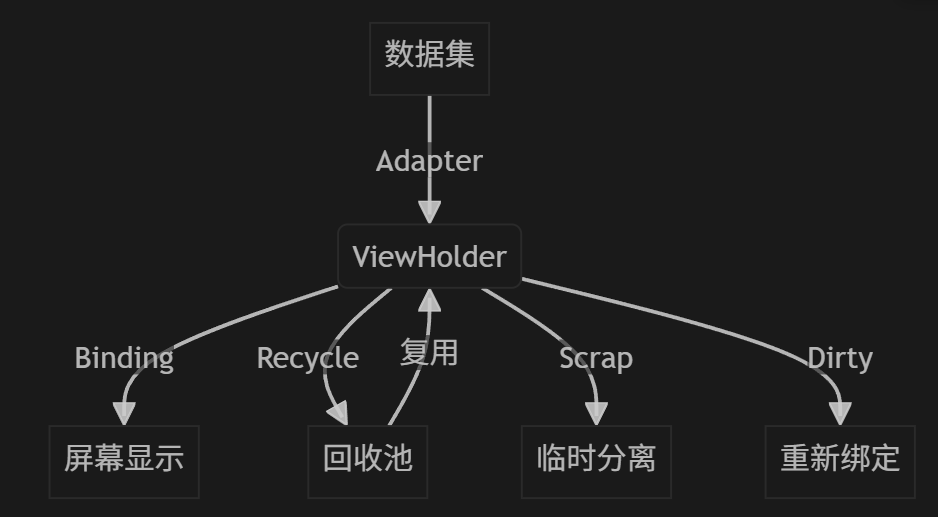

### 3.2 常用方法

- **setLayoutManager**：必选项，设置 RecyclerView 的布局管理器，决定RecyclerView 的显示风格。常用的有线性布局管理器（LinearLayoutManager）、网格布局管理器（GridLayoutManager）、瀑布流布局管理器（StaggeredGridLayoutManager）。
- **setAdapter**：必选项，设置 RecyclerView 的数据适配器。当数据发生改变时，以通知者的身份，通知 RecyclerView 数据改变进行列表刷新操作。
- **addItemDecoration**：非必选项，设置 RecyclerView中 Item 的装饰器，经常用来设置 Item 的分割线。
- **setItemAnimator**：非必选项，设置 RecyclerView中 Item 的动画。

### 3.3 定义Adapter

- 你需要替换三个关键方法：
  - **onCreateViewHolder()**：每当 RecyclerView 需要创建新的 ViewHolder 时，它都会调用此方法。此方法会创建并初始化 ViewHolder 及其关联的 View，但不会填充视图的内容，因为 ViewHolder 此时尚未绑定到具体数据。
  - **onBindViewHolder()**：RecyclerView 调用此方法将 ViewHolder 与数据相关联。此方法会提取适当的数据，并使用该数据填充 ViewHolder 的布局。例如，如果 RecyclerView 显示的是一个名称列表，该方法可能会在列表中查找适当的名称，并填充 ViewHolder 的 TextView widget。
  - **getItemCount()**：RecyclerView 调用此方法来获取数据集的大小。例如，在通讯簿应用中，这可能是地址总数。RecyclerView 使用此方法来确定什么时候没有更多的列表项可以显示。

### 3.4 一段精彩的ViewHolder设计

代码如下：

- 注意看，findViewById需要遍历View树查找指定ID的View，我们使用了mViews存储了对应ID的View的引用，这样不用每次都findViewById了。
  - ```
    public class RecyclerViewHolder extends RecyclerView.ViewHolder {
        private SparseArray<View> mViews;//集合类，layout里包含的View,以view的id作为key，value是view对象
        private Context mContext;//上下文对象
    
        public RecyclerViewHolder(Context ctx, View itemView) {
            super(itemView);
            mContext = ctx;
            mViews = new SparseArray<View>();
        }
    
        private <T extends View> T findViewById(int viewId) {
            View view = mViews.get(viewId);
            if (view == null) {
                view = itemView.findViewById(viewId);
                mViews.put(viewId, view);
            }
            return (T) view;
        }
    
        public View getView(int viewId) {
            return findViewById(viewId);
        }
    
        public TextView getTextView(int viewId) {
            return (TextView) getView(viewId);
        }
    
        public Button getButton(int viewId) {
            return (Button) getView(viewId);
        }
    
        public ImageView getImageView(int viewId) {
            return (ImageView) getView(viewId);
        }
    
        public ImageButton getImageButton(int viewId) {
            return (ImageButton) getView(viewId);
        }
    
        public EditText getEditText(int viewId) {
            return (EditText) getView(viewId);
        }
    
        public RecyclerViewHolder setText(int viewId, String value) {
            TextView view = findViewById(viewId);
            view.setText(MStringUtils.isNullOrEmpty(value) ? "" : value);
            return this;
        }
    
        public RecyclerViewHolder setVisible(int viewId, int visible) {
            View view = findViewById(viewId);
            view.setVisibility(visible);
            return this;
        }
    
    
        public RecyclerViewHolder setBackground(int viewId, int resId) {
            View view = findViewById(viewId);
            view.setBackgroundResource(resId);
            return this;
        }
    
        public RecyclerViewHolder setImageResource(int viewId, int resId) {
            ImageView view = findViewById(viewId);
            view.setImageResource(resId);
            return this;
        }
    
        public RecyclerViewHolder setClickListener(int viewId, View.OnClickListener listener) {
            View view = findViewById(viewId);
            view.setOnClickListener(listener);
            return this;
        }
    }
    ```

- 我该怎么理解你这一段？他的重点是什么呢？

- ViewHolder被复用时，这是最关键的时候
  - 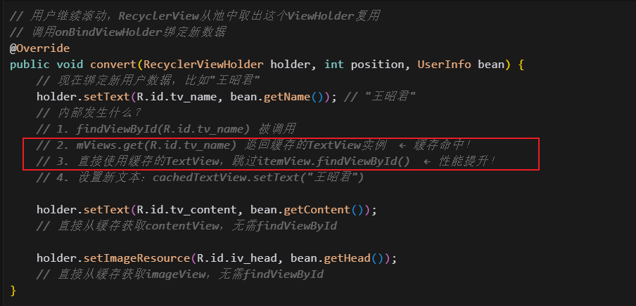

- 这依赖于什么？
  - 他修改了findViewById方法，优先从缓存中查找
    - 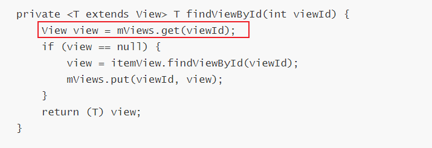
- 这个缓存其实和这个一样：
  - 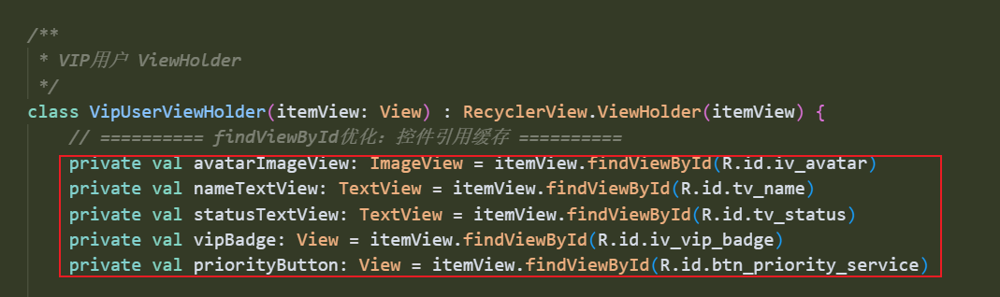

ok，我们来进行性能对比，和传统的ViewHolder进行性能对比

- 传统的ViewHolder
  - 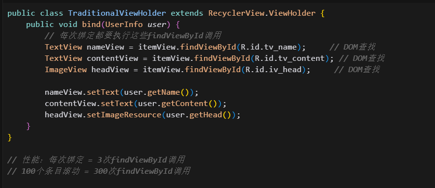
- 缓存的ViewHolder
  - 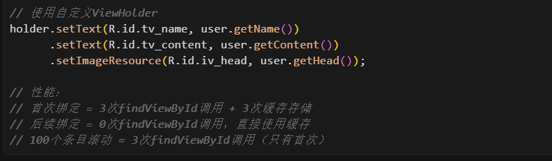

关键点

- 性能提升在哪里？

  - 避免重复的DOM树遍历：findViewById需要遍历View树查找指定ID的View，我们存储了对应ID的View的引用，这样不用每次都findViewById了。


我该如何检测我的提升效果呢？

- 查看对应的cursor，笔记在里面。

### 3.5 adapter的优雅设计

接下来我会展示RecyclerView的六种优化技巧，包含：ViewType分类、findViewById优化、高效onBind、ViewHolder创建优化、payload局部刷新、DiffUtil自动差异计算

ok，我们有一个Adapter，我们从流程出发，来讲解各种优化技巧

首先是onCreateViewHolder

- 能看见，创建时进行了ViewType的分类，这个我们最后再讲，不在这里穿插着讲
  - 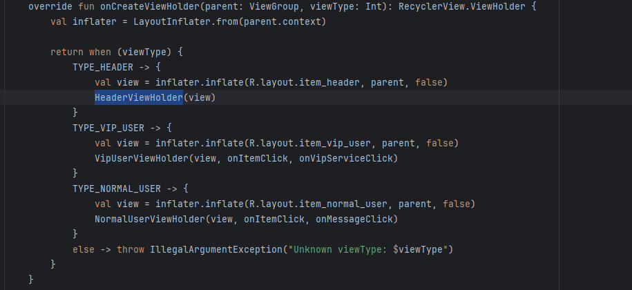
- 这里可以看见findViewById优化，以及ViewHolder创建优化
  - 我们把控件引用，所用资源等都缓存了
  - 同时在创建时设置点击事件，避免Bind中重复设置
  - 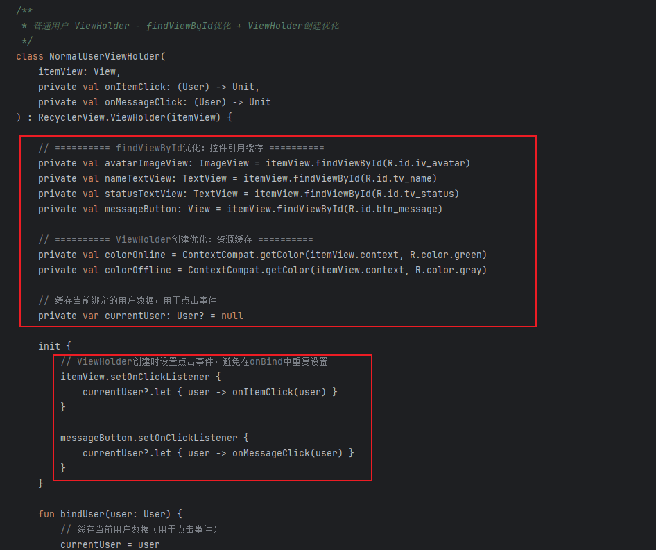

然后是onBindViewHolder

- 调用相关类型ViewHolder 的bind方法
  - 
  - ok，仔看下面的bind，首先缓存User，用于点击事件。然后用之前缓存的View引用进行数据绑定，接着是使用预缓存的颜色资源。太棒了
  - 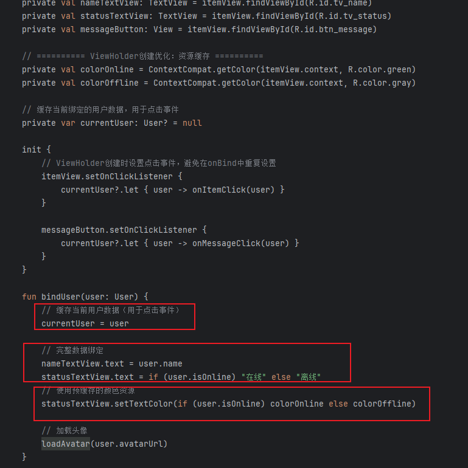

但是现在还有一个问题，我们更新一个子条目时，很多内容有时候是不需要改变的，可能只用改变一张图片，或者一个昵称等，因此我们需要payload进行局部刷新优化

- 如果没有payload，执行完整绑定，然后根据payload中数据类型进行指定位置的数据更新
  - 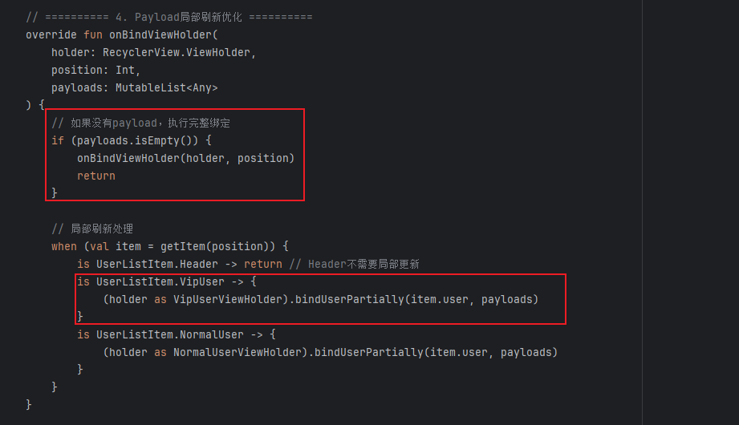
  - 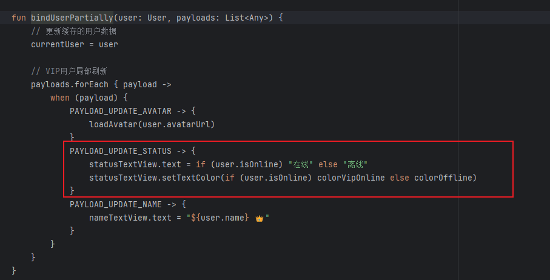
  
  > 我有一个疑问：既然每次都要重新绘制，那么payload局部更新为什么会更高效？
  >
  > 要理解这个，就要理解一个事：Android的View存在绘制复用机制，就是假如你的页面没有直接的修改，那么你View可以跳过测量布局绘制的流程
  >
  > - 大致是 这样，如果没有脏标记，可以跳过重绘。而invalidate则会标记需要重绘。
  >
  > - ```
  >   // Android确实有绘制复用机制：
  >   class MyView : View(context) {
  >       private var needsRedraw = false
  >       
  >       override fun onDraw(canvas: Canvas) {
  >           if (!isDirty()) {
  >               // ✅ 如果View没有"脏"，某些情况下可以跳过重绘
  >               return
  >           }
  >           // 执行实际绘制...
  >       }
  >       
  >       fun updateColor(newColor: Int) {
  >           this.color = newColor
  >           invalidate()  // 🔥 主动标记需要重绘
  >       }
  >   }
  >   ```
  >
  > - 你的UI操作本身就会触发重绘
  >
  > - ```
  >   // 问题：UI操作本身就会触发重绘
  >   class PostViewHolder(view: View) {
  >       fun bindData(item: PostItem) {
  >           // ❌ 这些操作都会主动调用invalidate()
  >           
  >           textView.setText(item.content)        // 内部调用invalidate()
  >           imageView.setImageResource(item.img)  // 内部调用invalidate()  
  >           likeCount.setText(item.likes)         // 内部调用invalidate()
  >           
  >           // 所以即使View有缓存机制，这些操作也会强制重绘！
  >       }
  >   }
  >   ```
  >
  > 所以使用payload，只针对必要的进行UI操作，尽可能避免其他地方进行重绘

ok，这是单个条目内部的优化，现在还有一个问题，我们的数据集发生变化后，常用的方式是：notifydatasetchanged通知整个数据集变化，他存在一个问题，会触发所有显示在屏幕上的ViewHolder重绘。但是，很可能我们只是数据集中部分的内容改变了。此时我们需要DiffUtil进行自动差异计算，计算出需要更新的子条目有哪些。

我们来看看，先假设一个场景

- 假设一个用户列表变化的场景

  - 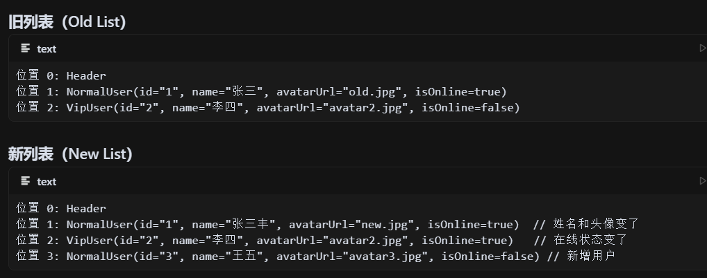

- 我们来看看整个的DifUtil的工作流程

- 首先：areItemsTheSame() - "这是同一个 item 吗？"

  - 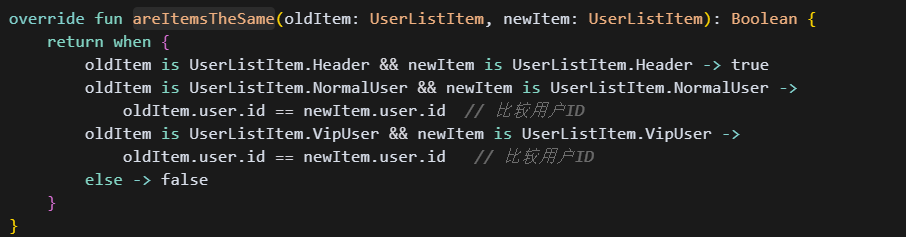

  - DiffUtil 逐个比较，得到下面的结果

  - | 旧位置             | 新位置             | 比较结果 | 解释                         |
    | :----------------- | :----------------- | :------- | :--------------------------- |
    | 位置0 Header       | 位置0 Header       | true     | 都是Header，认为是同一个item |
    | 位置1 User(id="1") | 位置1 User(id="1") | true     | ID相同，是同一个用户         |
    | 位置2 User(id="2") | 位置2 User(id="2") | true     | ID相同，是同一个用户         |
    | 位置2 User(id="2") | 位置3 User(id="3") | false    | ID不同，不是同一个用户       |

- areContentsTheSame() - "内容完全一样吗？"

  - 只有 areItemsTheSame() 返回 true 的item才会调用这个方法！

  - 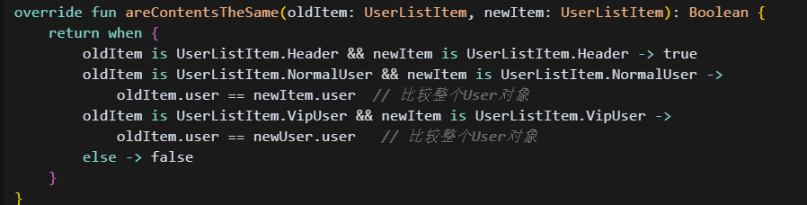

  - 继续比较那些 "是同一个item" 的：

  - | Item         | 内容比较结果 | 解释                                             |
    | :----------- | :----------- | :----------------------------------------------- |
    | Header       | true         | Header内容没变                                   |
    | User(id="1") | false        | 姓名从"张三"→"张三丰"，头像从"old.jpg"→"new.jpg" |
    | User(id="2") | false        | isOnline从false→true                             |

- getChangePayload() - "具体哪些内容变了？"

  - 只有 areContentsTheSame() 返回 false 的item才会调用这个方法！

  - 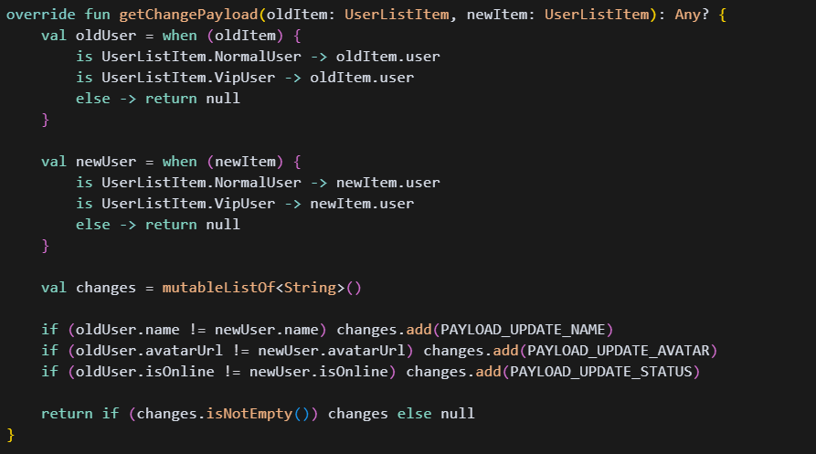

  - 分析具体变化：

  - | Item         | 变化分析                                                     | 返回的Payload                                    |
    | :----------- | :----------------------------------------------------------- | :----------------------------------------------- |
    | User(id="1") | name: "张三"→"张三丰"<br/>avatarUrl: "old.jpg"→"new.jpg"<br/>isOnline: true→true | ["PAYLOAD_UPDATE_NAME", "PAYLOAD_UPDATE_AVATAR"] |
    | User(id="2") | name: "李四"→"李四"<br/>avatarUrl: 无变化<br/>isOnline: false→true | ["PAYLOAD_UPDATE_STATUS"]                        |

- DiffUtil 最终生成的通知
  - 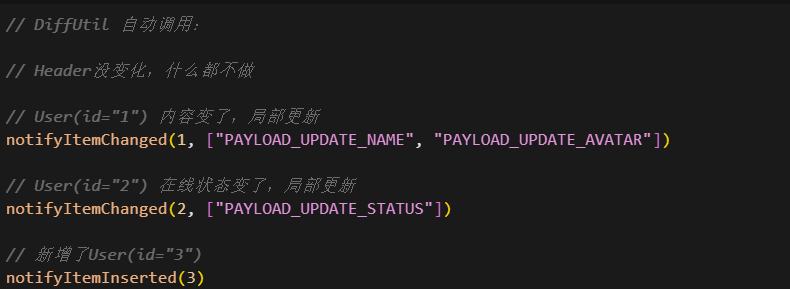
  - 最后触发我们的带payload的OnBindViewHolder
- 整体流程
  - areItemsTheSame()：判断是否是"同一个东西"（通常比较ID）
  - areContentsTheSame()：判断"同一个东西"的内容是否完全相同
  - getChangePayload()：如果内容不同，具体哪些字段不同

ok，补充一下ViewType,我们为什么需要ViewType？

- 我们来模拟一个用户场景，我们的RecyclerView要显示普通，vip，超级vip三种用户，如果我是开发者，我会选择使用一个ViewType，在这个ViewType内部有一个标记位，通过标记位确定用户类型，选择显示或不显示哪些view。

- 他存在什么问题？

  - 普通用户占用了100%的复杂布局内存，但只用了30%的功能

  - 每次 bind 都要设置大量 View 的 visibility

  - ```
    <!-- complex_user_item.xml - 所有用户都要用这个复杂布局 -->
    <LinearLayout>
        <ImageView android:id="@+id/avatar" />           <!-- 所有用户都有 -->
        <TextView android:id="@+id/name" />              <!-- 所有用户都有 -->
        <ImageView android:id="@+id/vip_badge" />        <!-- 普通用户用不到，但要占内存 -->
        <ImageView android:id="@+id/super_vip_badge" />  <!-- 普通用户和VIP都用不到 -->
        <Button android:id="@+id/privilege_btn1" />      <!-- 普通用户用不到 -->
        <Button android:id="@+id/privilege_btn2" />      <!-- 普通用户和VIP都用不到 -->
        <LinearLayout android:id="@+id/special_bg" />    <!-- 只有超级VIP需要 -->
    </LinearLayout>
    ```

    

## 04.底层原理


## 05.深度思考

### 5.1 关键问题探究


### 5.2 设计对比


## 06.实践验证

### 6.1 行为验证代码


### 6.2 性能测试


## 07.应用场景

### 7.1 最佳实践


### 7.2 使用禁忌


## 08.总结提炼

### 8.1 核心收获


### 8.2 知识图谱


### 8.3 延伸思考


## 09.参考资料

1. []()
2. []()
3. []()

## 其他介绍

### 01.关于我的博客

- csdn：http://my.csdn.net/qq_35829566

- 掘金：https://juejin.im/user/499639464759898

- github：https://github.com/jjjjjjava

- 邮箱：[934137388@qq.com]

