[toc]

## 前言

> 学习要符合如下的标准化链条：了解概念->探究原理->深入思考->总结提炼->底层实现->延伸应用"

## 01.学习概述

- **学习主题**：
- **知识类型**：
  - [ ] **知识类型**：
    - [ ] ✅Android/ 
      - [ ] ✅01.基础组件
      - [ ] ✅02.IPC机制
      - [ ] ✅03.消息机制
      - [ ] ✅04.View原理
      - [ ] ✅05.事件分发机制
      - [ ] ✅06.Window
      - [x] ✅07.复杂控件
      - [ ] ✅08.性能优化
      - [ ] ✅09.流行框架
      - [ ] ✅10.数据处理
      - [ ] ✅11.动画
      - [ ] ✅12.Groovy
    - [ ] ✅音视频开发/
      - [ ] ✅01.基础知识
      - [ ] ✅02.OpenGL渲染视频
      - [ ] ✅03.FFmpeg音视频解码
    - [ ] ✅ Java/
      - [ ] ✅01.基础知识
      - [ ] ✅02.Java设计思想
      - [ ] ✅03.集合框架
      - [ ] ✅04.异常处理
      - [ ] ✅05.多线程与并发编程
      - [ ] ✅06.JVM
    - [ ] ✅ Kotlin/
      - [ ] ✅01.基础语法
      - [ ] ✅02.高阶扩展
      - [ ] ✅03.协程和流
    - [ ] ✅ 故障分析与处理/
      - [ ] ✅01.基础知识
    - [ ] ✅ 自我管理/
      - [ ] ✅01.内观
    - [ ] ✅ 业务逻辑/
      - [ ] ✅01.启动逻辑
      - [ ] ✅02.云值守
      - [ ] ✅03.智控平台
- **学习来源**：
- **重要程度**：⭐⭐⭐⭐⭐
- **学习日期**：2025.
- **记录人**：@panruiqi

### 1.1 学习目标

- 了解概念->探究原理->深入思考->总结提炼->底层实现->延伸应用"

### 1.2 前置知识

- [ ] 

## 02.核心概念

### 2.1 是什么？

RecyclerView源码一万多行，想全部读懂学会挺麻烦的，而RecyclerView本质上也是一个自定义控件，因此我们可以分析其 onMeasure -> onLayout -> onDraw 这 3 个方法的路线来深入研究。


### 2.2 解决什么问题？


### 2.3 基本特性


## 03. 绘制流程分析

你难道不好奇，RecyclerView他是怎么进行绘制的吗？

们先理清楚一件事：Measure是什么？View的本质是屏幕上的一个矩形区域。Measure就是判断这个矩形区域在屏幕中的大小。

ok，View分为ViewGroup和View。ViewGroup分为多种模式，对于Exactly，就是mathc_parent，或者确定为500dp，这种。此时可以直接完成自身的测量。如果是at_most，就是wrap_content，要先测量自己的子View大小，才能完成自身的测量。 

这是常见的。但是呢，对于RecyclerView，他存在特殊，他就是一个ViewGroup。内部的子Item就是子View。他还有动画，缓存复用机制。同时她还有LayouManager可以显示3种布局。所以，他是需要依赖于自己的LayoutManager的。他通过委托模式，将测量，布局委托给LayoutManager执行。这个过程中还要兼顾动画效果。他是一个很复杂的存在

### 3.1 没有设置LayoutManager，则进行默认的测量

我们简单的看笔记，看博客是看不明白的，只有对源代码进行阅读，才能搞懂他的概念

首先，如果没有设置LayoutManager，则进行默认的测量

- 我们可以看到，onMeasure中首先判断mLayout是否为空。这个mLayout是LayoutManager类型，他通过setLayoutManager赋值
- 如果是空，那么调用defaultOnMeasure进行默认的测量
  - 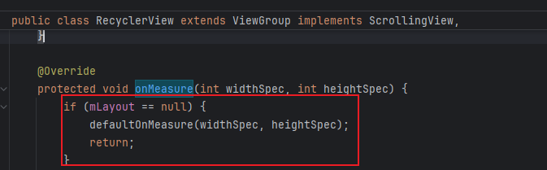
  - 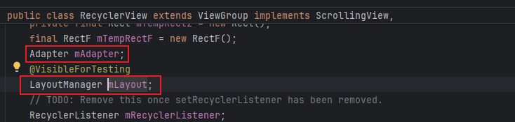
  - 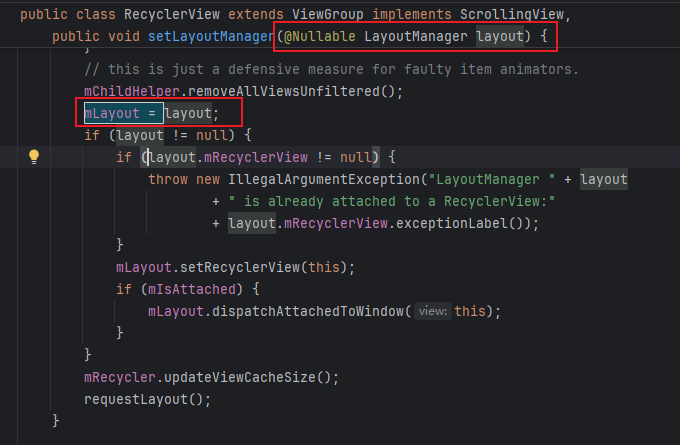

> LayoutManager分为几种类型啊？
>
> - inearLayoutManager - 线性布局管理器
>
>   - ```
>     垂直方向：        水平方向：
>     ┌─────┐          ┌─────┬─────┬─────┬─────┐
>     │Item1│          │Item1│Item2│Item3│Item4│
>     ├─────┤          └─────┴─────┴─────┴─────┘
>     │Item2│
>     ├─────┤
>     │Item3│
>     ├─────┤
>     │Item4│
>     ```
>
> - GridLayoutManager - 网格布局管理器  
>
>   - ```
>     // 自定义跨度
>     gridLayoutManager.spanSizeLookup = object : GridLayoutManager.SpanSizeLookup() {
>         override fun getSpanSize(position: Int): Int {
>             return if (position == 0) 2 else 1  // 第一个item占2列
>         }
>     }
>     ```
>
>     
>
>   - ```
>     2列网格：             
>     ┌─────┬─────┐         ┌───────────┐  
>     │Item1│Item2│         │   Header  │  <- 跨2列
>     ├─────┼─────┤         ├─────┬─────┤
>     │Item3│Item4│         │Item1│Item2│
>     ├─────┼─────┤         ├─────┼─────┤
>     │Item5│Item6│         │Item3│Item4│
>     └─────┴─────┘         └─────┴─────┘
>     ```
>
> - StaggeredGridLayoutManager - 瀑布流布局管理器
>
>   - ```
>     2列瀑布流：
>     ┌─────┬───────┐
>     │Item1│ Item2 │
>     │     │       │
>     ├─────┤       │
>     │Item3│       │
>     ├─────┼───────┤
>     │Item4│ Item5 │
>     │     │       │  <- 高度不同
>     │     │       │
>     └─────┼───────┤
>           │ Item6 │
>           └───────┘
>     ```

### 3.2 自动测量分支_开始

好，如果LayoutManager开启了自动测量模式，也就是自动测量分支

- 对应下面的mLayout.isAutoMeasureEnabled()
  - 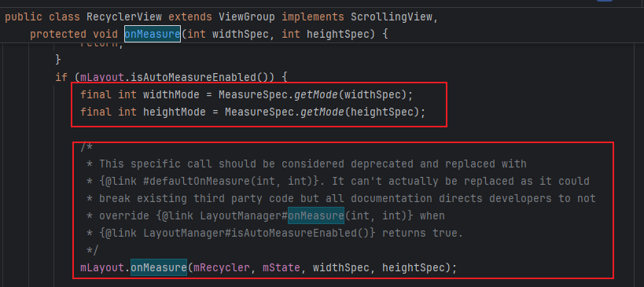

首先获取测量模式同时委托进行默认的测量

- 获取模式：提取MeasureSpec的模式部分（EXACTLY, AT_MOST, UNSPECIFIED）
- 委托调用：先让LayoutManager进行初步测量，这里的注释是说：应该用defaultOnMeasure替换。但不能真的替换，因为会破坏现有的第三方代码
  - 

所以他加了一层封装，这是LayoutManager的onMeasure，其实最终还是调用defaultOnMeasure

- 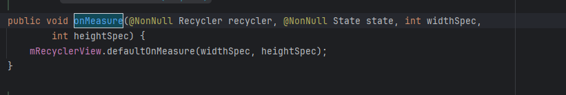

ok，那我们就不看这个onMeasure，来看看这个理论上应该用来进行默认测量的defaultOnMeasure

- 注意看这个width，他调用了LayoutManager.chooseSize方法，传递了MeasureSpec，Padding，MinimumSize
  - 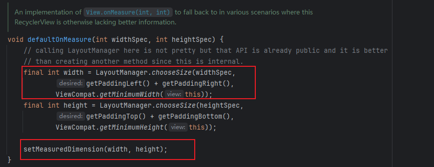

我们来看看LayoutManager.chooseSize这个方法

- 这里接收三个参数：

  - 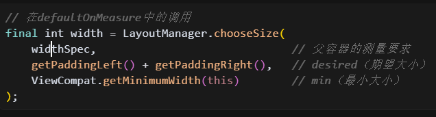

- 然后根据mode计算相关的宽或高的值

  - 如果mode是Exactly，通常是match_parent或者是200dp，那么直接返回父容器的测量要求，也就是200dp。
  - 如果mode是AT_MOST，那么先计算最小大小和期望大小的最大值，然后再与父容器的测量要求比较，获取最小值

- 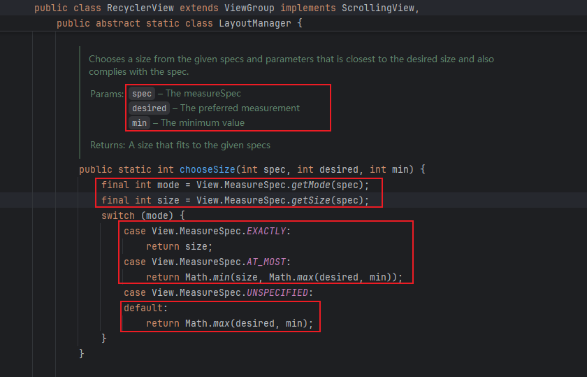

- 我这里有个困惑，padding应该是加到内容大小上的额外空间，所以应该是：最终大小 = max(内容大小, 最小大小) + padding

- 这个困惑很有意思，我们在AT_MOST模式下对于RecyclerView的要求：

  - 至少要能显示padding（否则padding会被挤压）
  - 至少要满足minWidth要求
  - 不能超过父容器的限制

- 所以，在AT_MOST模式下

  - ```
    <RecyclerView
        android:layout_width="wrap_content"    <!-- AT_MOST 1000dp -->
        android:paddingLeft="10dp"
        android:paddingRight="10dp"
        android:minWidth="50dp" />
    ```

- 他应该进行的计算代码为

  - ```
    // chooseSize(AT_MOST|1000dp, 20dp, 50dp)
    return Math.min(1000dp, Math.max(20dp, 50dp))
         = Math.min(1000dp, 50dp)
         = 50dp; // 选择最小宽度，因为它比padding大
    ```

  - 首先确保满足padding，然后确保满足minWidth，最后不能超过父容器的限制

- 我还有一个问题，这里的父容器的测量要求是什么意思？

  - 我们来看不同的场景

  - 如果是确定的200dp，那么他代表父容器可以提供的，那么就是200dp

  - ```
    // 父容器传递：EXACTLY | 200dp
    // 含义：必须是200dp，不能多不能少
    <RecyclerView android:layout_width="200dp" />
    
    // 返回：200dp（忽略其他参数）
    ```

  - 如果是match_parent

  - ```
    // 父容器传递：EXACTLY | 1000dp  
    // 含义：必须填满父容器的1000dp
    <LinearLayout android:layout_width="1000dp">
        <RecyclerView android:layout_width="match_parent" />
    </LinearLayout>
    
    // 返回：1000dp（忽略其他参数）
    ```

  - 如果wrap_content，就是父容器的最大值，就是1000dp

  - ```
    // 父容器传递：AT_MOST | 1000dp
    // 含义：最大可以用1000dp，但你可以根据内容决定实际大小
    <LinearLayout android:layout_width="1000dp">
        <RecyclerView android:layout_width="wrap_content" />
    </LinearLayout>
    
    // 返回：min(1000dp, max(padding, minWidth))
    ```

咦，setMeasuredDimension做了什么？

- 它设置了测量阶段确定的宽高
  - 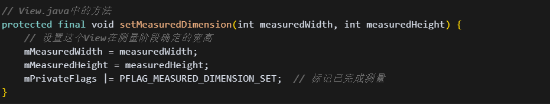
- 我的疑问来了，setMeasuredDimension不是View确定自身测量结果的最终步骤吗？你这里setMeasureDimension了，那么后续为什么还有其他的测量过程呢？最后也调用了setMeasureDimension吗？并对之前的产生了覆盖吗？
- 确实，RecyclerView的测量流程中会多次调用setMeasuredDimension，后面的调用会覆盖前面的结果。这是一次次的精确的过程，因为RecyclerView的测量过程比较复杂。

### 3.3 自动测量分支_尝试跳过后续复杂的测量过程

好的，我们现在回来，他会在mode为EXACTLY的情况下跳过后续的复杂的测量过程

- 宽高都是EXACTLY模式时，直接return，使用上面的Default测量。因为你宽高都确定了啊，那你有什么好处理的呢？
  - 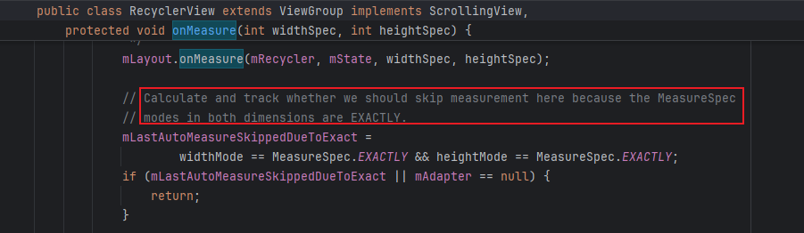

### 3.4 自动测量分支_dispatchLayoutStep1

接着是dispatchLayoutStep1

- 他在mLayoutStep == STEP_START情况下被调用

  - 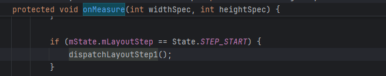

  - 什么时候mLayoutStep == STEP_START

    - RecyclerView首次布局

    - 调用notifyDataSetChanged()后

    - 调用requestLayout()后

    - 从STEP_ANIMATIONS重置后

  - STEP_ANIMATIONS重置的状态流转

    - 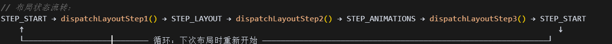

好，我们来看看dispatchLayoutStep1，卧槽，有点多，看不动了，明天看看

### 3.3 **dispatchLayoutStep1**

```
 fun destory() {
        // 清理缓存
        lastAutoRotateCheck = 0L
        cachedAutoRotateEnabled = true
        
        mInstance = null
        mActivity = null
    }
    
    /**
     * 强制刷新Auto-rotate缓存（可选提供给外部调用）
     */
    fun refreshAutoRotateCache() {
        lastAutoRotateCheck = 0L
        KLog.d(TAG, "强制刷新Auto-rotate缓存")
    }
```


## 04.底层原理

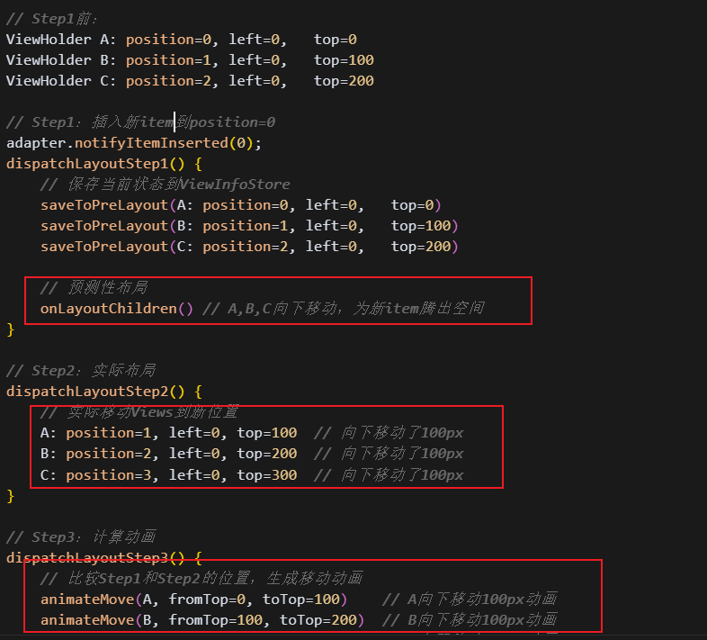

## 05.深度思考

### 5.1 关键问题探究


### 5.2 设计对比


## 06.实践验证

### 6.1 行为验证代码


### 6.2 性能测试


## 07.应用场景

### 7.1 最佳实践


### 7.2 使用禁忌


## 08.总结提炼

### 8.1 核心收获


### 8.2 知识图谱


### 8.3 延伸思考


## 09.参考资料

1. []()
2. []()
3. []()

## 其他介绍

### 01.关于我的博客

- csdn：http://my.csdn.net/qq_35829566

- 掘金：https://juejin.im/user/499639464759898

- github：https://github.com/jjjjjjava

- 邮箱：[934137388@qq.com]

