[toc]

## 前言

> 学习要符合如下的标准化链条：了解概念->探究原理->深入思考->总结提炼->底层实现->延伸应用"

## 01.学习概述

- **学习主题**：
- **知识类型**：
  - [ ] **知识类型**：
    - [ ] ✅Android/ 
      - [ ] ✅01.基础组件
      - [ ] ✅02.IPC机制
      - [ ] ✅03.消息机制
      - [ ] ✅04.View原理
      - [ ] ✅05.事件分发机制
      - [ ] ✅06.Window
      - [ ] ✅07.复杂控件
      - [ ] ✅08.性能优化
      - [ ] ✅09.流行框架
      - [ ] ✅10.数据处理
      - [ ] ✅11.动画
      - [ ] ✅12.Groovy
    - [ ] ✅音视频开发/
      - [ ] ✅01.基础知识
      - [ ] ✅02.OpenGL渲染视频
      - [ ] ✅03.FFmpeg音视频解码
    - [ ] ✅ Java/
      - [ ] ✅01.基础知识
      - [ ] ✅02.Java设计思想
      - [ ] ✅03.集合框架
      - [ ] ✅04.异常处理
      - [ ] ✅05.多线程与并发编程
      - [ ] ✅06.JVM
    - [ ] ✅ Kotlin/
      - [ ] ✅01.基础语法
      - [ ] ✅02.高阶扩展
      - [x] ✅03.协程和流
    - [ ] ✅ 故障分析与处理/
      - [ ] ✅01.基础知识
    - [ ] ✅ 自我管理/
      - [ ] ✅01.内观
    - [ ] ✅ 业务逻辑/
      - [ ] ✅01.启动逻辑
      - [ ] ✅02.云值守
      - [ ] ✅03.智控平台
- **学习来源**：
- **重要程度**：⭐⭐⭐⭐⭐
- **学习日期**：2025.
- **记录人**：@panruiqi

### 1.1 学习目标

- 了解概念->探究原理->深入思考->总结提炼->底层实现->延伸应用"

### 1.2 前置知识

- [ ] 

## 02.核心概念

### 2.1 是什么？

协程是一种异步编程的模型，他期望解决RxJava面临的一样的问题，但是他底层的实现和RxJava不同。

- RxJava是通过线程状态的保存和切换让他们执行不同的任务。
- 协程的“切换”不是线程的切换，而是任务的切换：线程在执行A协程任务时遇到挂起点，线程就去执行B协程任务，A协程的状态被保存，等条件满足再恢复。这种切换通常通过lambda表达式和状态机实现，协程的“暂停点”就是lambda的“断点”


### 2.2 解决什么问题？

他解决了线程切换耗时的问题呢

线程切换耗时是因为其需要从用户态到内核态的切换，这个大约需要几百到几千纳秒（ns），比普通函数调用慢几个数量级

而协程呢？它通过极低开销的任务切换，让少量线程可以高效地并发执行大量任务。协程的切换不是线程切换，而是任务（代码块）在线程上的切换（可以理解为就是函数调用），切换过程只需协程自身通过状态机保存/恢复很少的状态

### 2.3 基本特性


## 03. 协程的关键知识点

### 3.0 引子：我们怎么启动一个协程？

我们有三种方式启动一个协程，分别是runBlocking， launch， async。

- 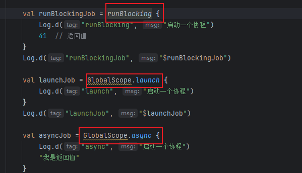

后两种需要在GlobalScope中启动，这个GlobalScope是什么？

- 这里我们可以看到GlobalScope是一个CoroutineScope类型的全局唯一单例，CoroutineScope又是什么？这个我们过会来说
  - 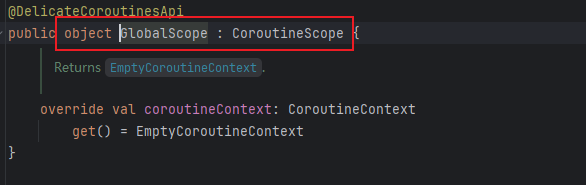

我们回过头来看看这三种启动方法，首先是runBlocking

- 首先看他的参数部分：context: CoroutineContext, block: suspend CoroutineScope.() -> T

  - 

  - context: CoroutineContext，用于指定协程的上下文（比如调度器、Job、异常处理器等），可以传 Dispatchers.Default、Dispatchers.IO、Job()、CoroutineName("xxx") 等，在实际用法中，context 有默认值（通常是 EmptyCoroutineContext），所以你可以只传 block。

  - block: suspend CoroutineScope.() -> T，在 CoroutineScope 上下文中执行的挂起 lambda表达式，返回类型为 T。

  - 对于下面的代码，其返回的类型T，经由类型推断决定为Int。

    - ```
      runBlocking {
          // 这里的 block 返回 Int
          123
      }
      ```

- ok，我们来看他的方法体部分，内部有三个关键的点
  - 事件循环初始化
  - 创建一个Blocking类型协程，并启动他执行我们传入的挂起代码块。
  - 调用joinBlocking阻塞当前线程，等待协程完成执行
  - 
- 我们会有以下几个疑问
  - 事件循环不是Handler里面的吗？为什么协程需要他
  - CoroutineContext协程上下文是什么？
  - Coroutine是什么？为什么需要协程上下文，当前线程，eventLoop三个参数？
  - joinBlocking 是什么？
- 请先保持疑问，不要着急。我们继续看看其他两个的实现。

然后是launch

- 首先是参数部分
  - 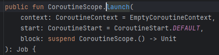
  - 唉，这里我们可以看到，上下文就是默认值（ EmptyCoroutineContext），block是一个lambda表达式，返回值为空的。
  - 这个start是什么？这个是启动模式，指明当前的协程的属性，我们可以看到，有四种启动模式、
    - DEFAULT -- 根据其上下文立即调度协程执行;
    - LAZY -- 仅在需要时才懒惰地启动协程;
    - ATOMIC -- 原子地（以不可取消的方式）根据其上下文调度协程的执行;
    - UNDISPATCHED -- 立即在指定线程执行协程，直到其在当前线程中的第一个挂起点。
  - 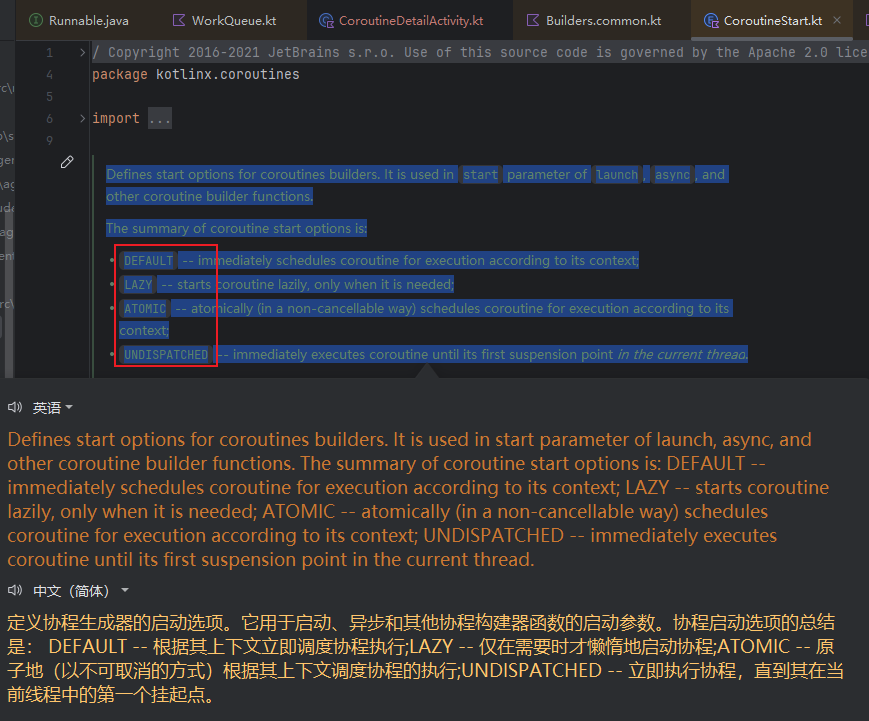
- ok，我们来看他的函数体
  - 一样，创建一个CoroutineContext，然后根据启动模式使用不同的创建方法。然后启动协程执行任务。最后返回这个协程
  - 

- 好，现在我们会有哪些疑问呢？
  - 启动模式代码层面怎么控制协程这个过程中的调度和执行？
  - 不同的启动模式，对应不同的创建方法，这些创建方法又是什么呢？
  - 我们期望返回的是Job类型，这里return 一个 coroutine创建的协程干嘛？
  - EmptyCoroutineContext是空的协程上下文，那他内部是什么样子？还有其他的协程上下文吗？

别急，保持疑问，看看async方法
- 跟上面的launch好相似啊。
  - 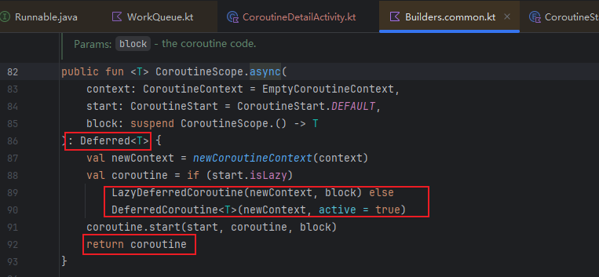
- 好，现在我们会有哪些疑问呢？
  - 咦，返回的是一个Deferred类型，为什么return的还是一个coroutine啊？coroutine既可以是job，也可以是coroutine？越来越困惑了。
  - 还有，这里创建的方法，
    - 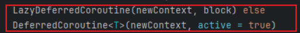
  - 对比launch
    - 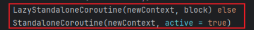
  - 他们都是协程，但是创建方式不同，什么啊？Deferred是什么？job是什么？协程的本质到底是什么？？？？？

要不然放弃？这么复杂？不行，我们要记住一句话：坚钢不可夺其志，万念不可乱其心！

我们先来总结一下要学的知识点吧

1. 协程调度器`CoroutineDispatcher`
2. 协程下上文`CoroutineContext`作用
3. 协程启动模式`CoroutineStart`
4. 协程作用域`CoroutineScope`
5. 挂起函数以及`suspend`关键字的作用

### 3.1 CoroutineContext 和 Element

先说一个结论，他们本质都是CoroutineContext和Element。

- 首先有一个CoroutineContext接口
  - 其本质上是一个“键值对集合”，用于存储和传递协程的各种上下文信息（如调度器、Job、CoroutineName等）。
  - 它定义了 get、fold、plus、minusKey 等方法，用于查找、遍历、合并、删除元素。
  - 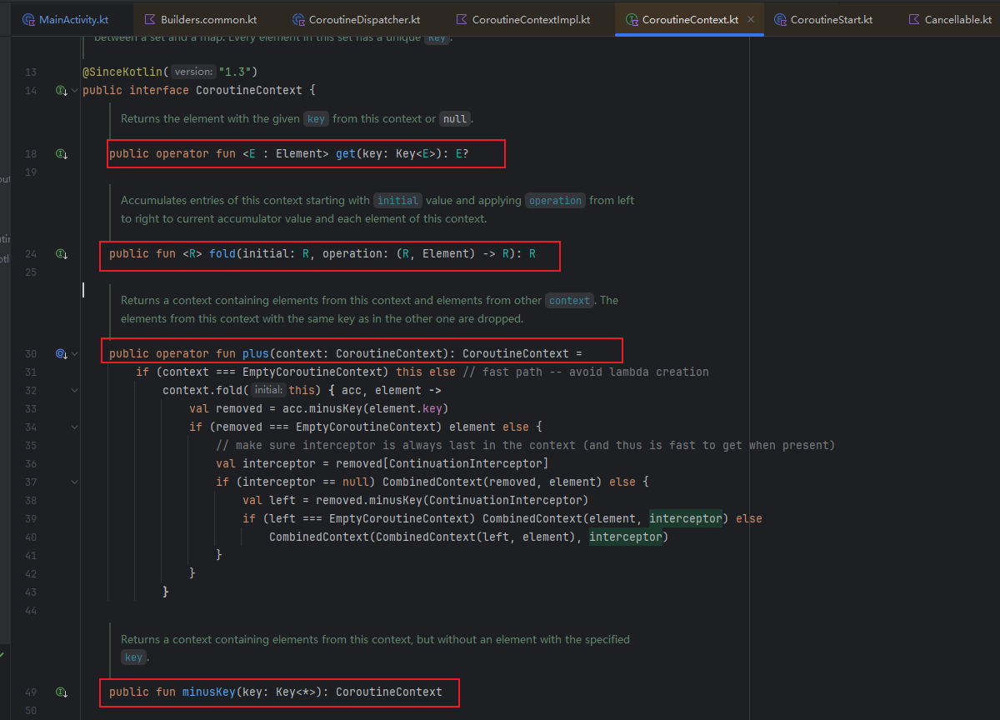

- 这个接口内部还有Key和Element接口（接口内部的接口，就是一种代码归类的方式，只是让相关接口放在一起。它们之间没有自动的能力继承关系。）
- 但是我们这里能看到Element继承了CoroutineContext接口，
  - 其代表上下文中的一个“元素”。
  - 每个 Element 都有一个唯一的 key，用于在上下文中查找和区分不同的元素。
  - Element 需要实现 get、fold、minusKey，并提供自己的 key
  - 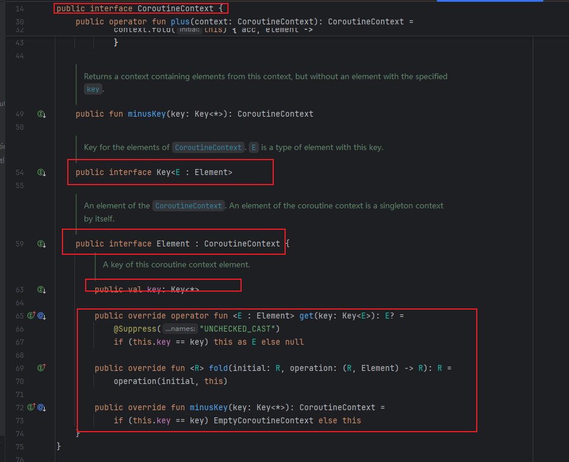

- 因此我们可以理解：CoroutineContext是容器，用来容纳一组Element。Element是元素，每个 Element 都有唯一 key用来标识自身，可以通过Key来查找，组合成上下文。


- 进一步理解：Context类似一个链表，Element就是里面的node，每个node代表不同的能力，比如：名称、调度器、Job、异常处理器等等。他们组合起来，就是一个完整的协程上下文

- 比如

  - ```
    val context = Dispatchers.IO + CoroutineName("MyCoroutine") + Job()
    ```

  - 他对应的是

  - ```
    [Dispatchers.IO] -> [CoroutineName] -> [Job] -> null
          |                   |             |
       调度能力            命名能力      生命周期管理
    ```

### 3.2 CoroutineDispatcher

CoroutineDispatcher是协程调度器，用于确定相关的协程在哪个线程或哪些线程上执行。协程调度器可以将协程限制在一个特定的线程执行，或将它分派到一个线程池，亦或是让它不受限地运行。

官方框架中预置了4个调度器，我们可以通过`Dispatchers`对象直接访问它们:

- 分别是
  - `Default`：默认调度器，CPU密集型任务调度器，适合处理后台计算。通常处理一些单纯的计算任务，或者执行时间较短任务。比如：Json的解析，数据计算等
  - `Main`：UI调度器， 即在主线程上执行，通常用于UI交互，刷新等
  - `Unconfined`：非受限调度器，又或者称为“无所谓”调度器，不要求协程执行在特定线程上。
  - 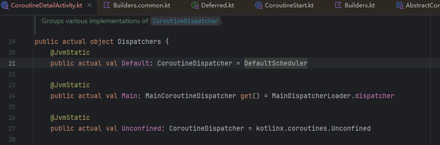
  - 以及`IO`：IO调度器，，IO密集型任务调度器，适合执行IO相关操作。比如：网络处理，数据库操作，文件操作等
  - 

- `Dispatchers.IO`和`Dispatchers.Main`就都很好理解了。这是我们以后在Android开发过程中，打交道最多的2个调度器。
  - 比如后台数据上传，我们就可以使用`Dispatchers.IO`调度器。刷新界面我们就使用`Dispatchers.Main`调度器。
  - 为方便使用官方在Android协程框架库中，已经为我们定义好了几个供我们开发使用，如:`MainScope`、`lifecycleScope`、`viewModelScope`。它们都是使用的`Dispatchers.Main`

- 上面我们通过`launch`启动的时候，因为我们没有传入参数，所有实际上它使用的是默认调度器`Dispatchers.Default`

  - ```
    GlobalScope.launch{
        Log.d("launch", "启动一个协程")
    }
    //等同于
    GlobalScope.launch(Dispatchers.Default){
        Log.d("launch", "启动一个协程")
    }
    ```

根据我们上面使用的方法，我们好像只有在启动协程的时候，才能指定具体使用那个`Dispatchers`调度器。如果我要是想中途切换线程怎么办，比如：

- 现在我们需要通过网络请求获取到数据的时候填充到我们的布局当中，但是网络处理在`IO`线程上，而刷新UI是在`主线程`上，那我们应该怎么办。

- 我们可以通过`withContext`函数来改变协程的上下文，而仍然驻留在相同的协程中，同时`withContext`还携带有一个泛型`T`返回值。

  - ```
    public suspend fun <T> withContext(
        context: CoroutineContext,
        block: suspend CoroutineScope.() -> T
    ): T {
     //......
    }
    ```

  - 所以，我们可以做下面的处理

  - ```
    GlobalScope.launch(Dispatchers.Main) {
        val result = withContext(Dispatchers.IO) {
            //网络请求...
            "请求结果"
        }
        btn.text = result
    }
    ```

但是，有没有疑惑：协程调度器怎么可以做到：协程切换让线程切换任务执行，而不需要进行线程状态的保存和恢复的呢？这个又是很大一块，回头说

### 3.3 CoroutineScope

CoroutineScope的作用是提供作用域和生命周期管理的

他的作用域的提供是基于拓展函数的

- 我们可以看到这里的CoroutineScope.async，他为已有的类CoroutineScope“添加”新函数async，这使得你只能在 CoroutineScope 的上下文中调用他们
  - 

那么生命周期管理呢？生命周期管理是指：子协程会继承父协程的协程上下文中的`Element`，如果父协程被取消，则所有子协程同时也会被取消。

- 关键在于launch方法中

- 首先是MainScope，我们可以看到，他有一个已有的父Job：SupervisorJob

  - 

- 我们来看看launch方法

  - launch 启动协程
  - 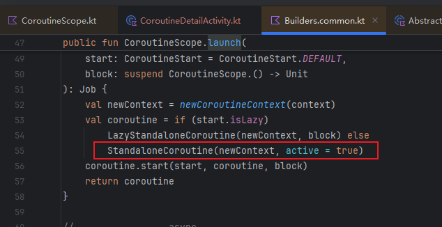
  - launch 内部创建 StandaloneCoroutine
  - 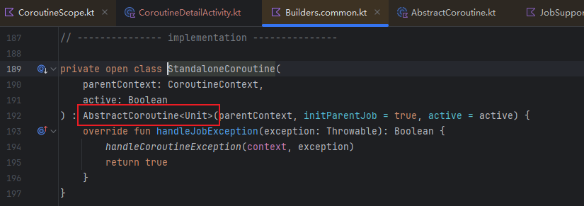
  - StandaloneCoroutine 继承 AbstractCoroutine，其在init代码块中通过parentContext[Job] 从父上下文中提取父Job，并通过调用 initParentJob(parent) 建立父子关系
  - 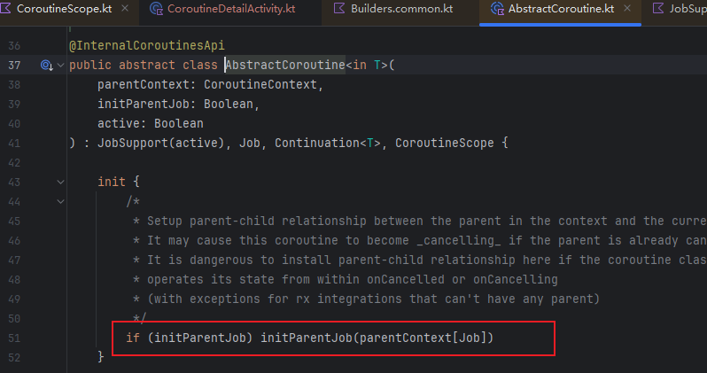
  - 调用父Job的attachChild,建立关系，并保存到parentHandle中。通过isCompleted检查当前协程是否已完成，如果是则立即解除关系
  - 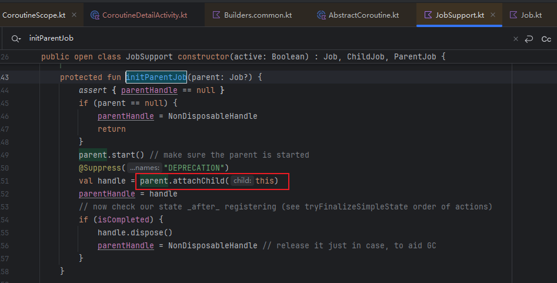

  - 看看attachChild方法，我们可以看到这里的注释
    - 取消传播：父Job取消时，立即取消所有子Job
    - 完成等待：父Job必须等所有子Job完成后才能完成
    - 返回句柄：返回 ChildHandle，用于后续解除父子关系
  - 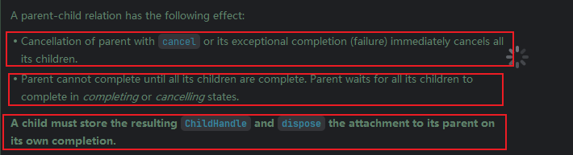
  - 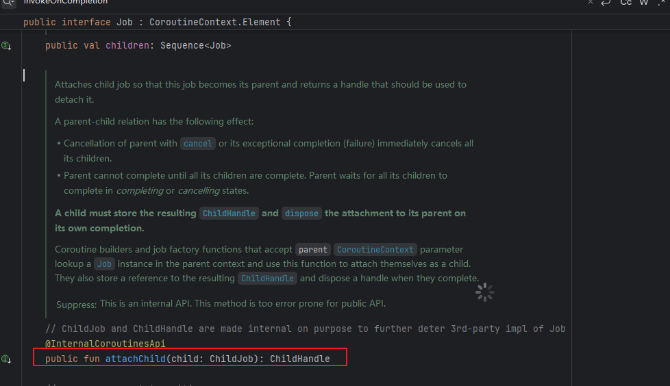

  - 提问：attachChild 是父Job的方法，用于注册子Job，他是怎么做的？是上下文链表中插入子节点？还是？

子协程会继承父协程的协程上下文中的`Element`，如果自身有相同key的成员，则覆盖对应的`key`，覆盖的效果仅限自身范围内有效。

对于下面这段代码：

- 首先我们可以看到有一个父协程，然后内部启动了两个子协程，分别给予了协程Name和Dispatcher

  - 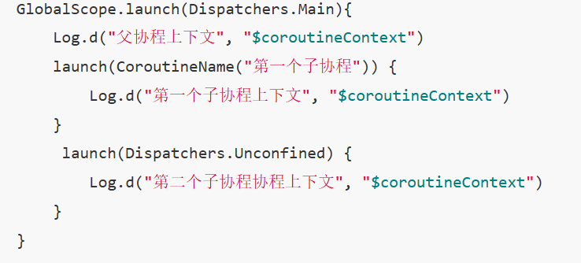

- 他的结果如下：

  - ```
    D/父协程上下文: [StandaloneCoroutine{Active}@81b6e46, Dispatchers.Main]
    D/第一个子协程上下文: [CoroutineName(第一个子协程), StandaloneCoroutine{Active}@bbe6d34, Dispatchers.Main]
    D/第二个子协程协程上下文: [StandaloneCoroutine{Active}@f6b7807, Dispatchers.Unconfined]
    ```

- 可以看到第一个子协程的覆盖了父协程的`coroutineContext`,它继承了父协程的调度器` Dispatchers.Main`，同时也新增了一个`CoroutineName`属性。

- 第二个子协程覆盖了父协程的`coroutineContext`中的`Dispatchers`，也就是将父协程的调度器`Dispatchers.Main`覆盖为`Dispatchers.Unconfined`，但是他没有继承第一个子协程的`CoroutineName`，这就是我们说的覆盖的效果仅限自身范围内有效。

协程作用域分为三种：

- `顶级作用域` --> 没有父协程的协程所在的作用域称之为顶级作用域。
- `协同作用域` --> 在协程中启动一个协程，新协程为所在协程的子协程。子协程所在的作用域默认为协同作用域。此时子协程抛出未捕获的异常时，会将异常传递给父协程处理，其异常退出最终会导致整体都将退出
- `主从作用域` 官方称之为`监督作用域`。与协同作用域一致，区别在于该作用域下的协程取消操作的单向传播性，子协程的异常不会导致其它子协程取消。

好，我们来看两个有关他的例子

首先是协调作用域

- scope1下有scope2和scope3两个子协程。我们在scope2下抛出异常

  - 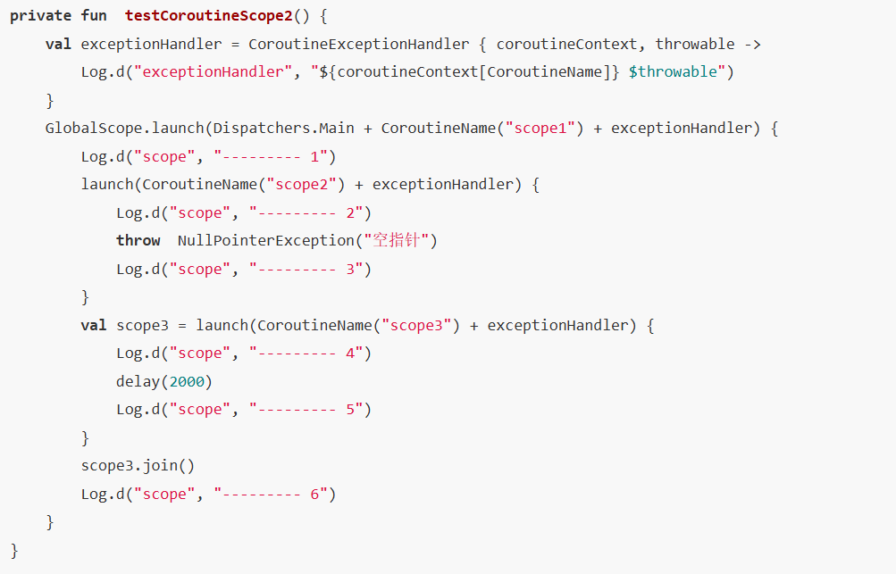

- 结果：可以看到子协程`scope2`抛出了一个异常，将异常传递给父协程`scope1`处理，但是因为任何一个子协程异常退出会导致整体都将退出。所以导致父协程`scope1`未执行完成成就被取消，同时还未执行完子协程`scope3`也被取消了。

  - ```
    D/scope: --------- 1
    D/scope: --------- 2
    D/exceptionHandler: CoroutineName(scope1) java.lang.NullPointerException: 空指针
    ```

`主从(监督)作用域`与`协同作用域`一致，区别在于该作用域下的协程取消操作的单向传播性，子协程的异常不会导致其它子协程取消。分析`主从(监督)作用域`的时候，我们需要用到`supervisorScope`或者`SupervisorJob`，如下代码块：

- 代码如下：

  - 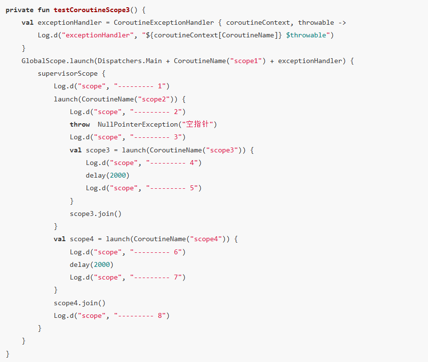

- 结果：可以看到子协程`scope2`抛出了一个异常，并将异常传递给父协程`scope1`处理，同时也结束了自己本身。因为在于`主从(监督)作用域`下的协程取消操作是单向传播性，因此协程`scope2`的异常并没有导致父协程退出，所以`6` `7` `8`都照常输出，而`3` `4` `5`因为在协程`scope2`里面所以没有输出。

  - ```
    D/scope: --------- 1
    D/scope: --------- 2
    D/exceptionHandler: CoroutineName(scope2) java.lang.NullPointerException: 空指针
    D/scope: --------- 6
    D/scope: --------- 7
    D/scope: --------- 8
    ```

### 3.4 挂起函数

挂起韩帅是协程之所以高效的原因，因为“任务本身是可暂停/恢复的状态机”

- 每个suspend函数/协程都被编译成一个状态机对象（Continuation子类），比如：
  - 
- 会被编译为下面的，他有一个resumeWith方法，通过状态机when：label，修改label状态并执行挂起点方法
  - 包含状态机逻辑（label字段记录当前状态）
  - 包含局部变量（作为类的字段保存）
  - 
- 因此其所有的局部变量、执行进度、挂起点都保存在对象里（堆上），
- 那么对于线程来说，其只用保存对象的引用，然后调用对象的方法（resumeWith）来推进任务
- 同时任务切换时，线程无需保存/恢复自己的上下文，状态的保存和恢复完全由对象的状态机实现。我们进行代码的执行时，也不用担心保存代码的执行位置了，这里会将代码分为几个可执行的块，通过状态机中的状态进行指定块的运行。

- 那么我们也该理解线程切换的困难，为什么线程不能“随时暂停/恢复”？

  - 如果你想让线程“暂停”，比如step2还没完成就停下来，线程必须整个栈都保留，不能被别的任务用。

  - 如果要“恢复”，只能让同一个线程继续跑，不能让别的线程来接着跑。

  - 这就导致线程资源浪费，而且不能灵活切换。

## 04.底层原理


## 05.深度思考

### 5.1 关键问题探究


### 5.2 设计对比


## 06.实践验证

### 6.1 行为验证代码


### 6.2 性能测试


## 07.应用场景

### 7.1 最佳实践


### 7.2 使用禁忌


## 08.总结提炼

### 8.1 核心收获


### 8.2 知识图谱


### 8.3 延伸思考


## 09.参考资料

1. []()
2. []()
3. []()

## 其他介绍

### 01.关于我的博客

- csdn：http://my.csdn.net/qq_35829566

- 掘金：https://juejin.im/user/499639464759898

- github：https://github.com/jjjjjjava

- 邮箱：[934137388@qq.com]

