[toc]

## 前言

> 学习要符合如下的标准化链条：了解概念->探究原理->深入思考->总结提炼->底层实现->延伸应用"

## 01.学习概述

- **学习主题**：协程_入门
- **知识类型**：
  - [ ] **知识类型**：
    - [ ] ✅Android/ 
      - [ ] ✅01.基础组件
      - [ ] ✅02.IPC机制
      - [ ] ✅03.消息机制
      - [ ] ✅04.View原理
      - [ ] ✅05.事件分发机制
      - [ ] ✅06.Window
      - [ ] ✅07.复杂控件
      - [ ] ✅08.性能优化
      - [ ] ✅09.流行框架
      - [ ] ✅10.数据处理
      - [ ] ✅11.动画
      - [ ] ✅12.Groovy
    - [ ] ✅音视频开发/
      - [ ] ✅01.基础知识
      - [ ] ✅02.OpenGL渲染视频
      - [ ] ✅03.FFmpeg音视频解码
    - [ ] ✅ Java/
      - [ ] ✅01.基础知识
      - [ ] ✅02.Java设计思想
      - [ ] ✅03.集合框架
      - [ ] ✅04.异常处理
      - [ ] ✅05.多线程与并发编程
      - [ ] ✅06.JVM
    - [ ] ✅ Kotlin/
      - [ ] ✅01.基础语法
      - [ ] ✅02.高阶扩展
      - [x] ✅03.协程和流
    - [ ] ✅ 故障分析与处理/
      - [ ] ✅01.基础知识
    - [ ] ✅ 自我管理/
      - [ ] ✅01.内观
    - [ ] ✅ 业务逻辑/
      - [ ] ✅01.启动逻辑
      - [ ] ✅02.云值守
      - [ ] ✅03.智控平台
- **学习来源**：
- **重要程度**：⭐⭐⭐⭐⭐
- **学习日期**：2025.
- **记录人**：@panruiqi

### 1.1 学习目标

- 了解概念->探究原理->深入思考->总结提炼->底层实现->延伸应用"

### 1.2 前置知识

- [ ] 

## 02.核心概念

### 2.1 是什么？

协程是一种异步编程的模型，他期望解决RxJava面临的一样的问题，但是他底层的实现和RxJava不同。

- RxJava是通过线程状态的保存和切换让他们执行不同的任务。
- 协程的“切换”不是线程的切换，而是任务的切换：线程在执行A协程任务时遇到挂起点，线程就去执行B协程任务，A协程的状态被保存，等条件满足再恢复。这种切换通常通过lambda表达式和状态机实现，协程的“暂停点”就是lambda的“断点”

### 2.2 解决什么问题？

他解决了线程切换耗时的问题呢

线程切换耗时是因为其需要从用户态到内核态的切换，这个大约需要几百到几千纳秒（ns），比普通函数调用慢几个数量级

而协程呢？它通过极低开销的任务切换，让少量线程可以高效地并发执行大量任务。协程的切换不是线程切换，而是任务（代码块）在线程上的切换（可以理解为就是函数调用），切换过程只需协程自身通过状态机保存/恢复很少的状态

### 2.3 基本特性

## 03. 协程的基础介绍

### 3.1 我们怎么启动一个协程？

协程的创建是过`CoroutineScope`创建,协程的启动方式有三种：

- `runBlocking：T` 启动一个新的协程并阻塞调用它的线程，直到里面的代码执行完毕,返回值是泛型`T`，就是你协程体中最后一行是什么类型，最终返回的是什么类型`T`就是什么类型。
- `launch：Job` 启动一个协程但不会阻塞调用线程,必须要在协程作用域(`CoroutineScope`)中才能调用,返回值是一个Job。
- `async:Deferred<T>` 启动一个协程但不会阻塞调用线程,必须要在协程作用域(`CoroutineScope`)中才能调用。以`Deferred`对象的形式返回协程任务。返回值泛型`T`同`runBlocking`类似都是协程体最后一行的类型。

我们会有几个疑问：

- 第一个：上面提到协程体中最后一行是什么类型，最终返回的是什么类型`T`就是什么类型。这是什么意思？返回值不应该是用return吗
  - 学过`kotlin`的会知道，在的`kotlin`高阶函数中，`lambda`表达式如果你没有显式返回一个值，那它将隐式返回最后一个表达式的值。表达式的值的类型通过类型推断自动生成。
- 第二个：`Job`、`Deferred`和`协程作用域`又是些啥玩意。不着急，我们慢慢来。

### 3.2 什么是Job 、Deferred 、协程作用域

Job

- 我们很难定义他是什么，我们现在也不定义他是什么，只需要知道他负责运行一个指定的代码块，并在该代码块完成时完成。我们可以通过`isActive`、`isCompleted`、`isCancelled`来获取到`Job`的当前状态。`Job`的状态如下图所示

- 分为6个状态，new，active，completing，cancelling，cancelled，completed

  - | **State**                        | [isActive] | [isCompleted] | [isCancelled] |
    | -------------------------------- | ---------- | ------------- | ------------- |
    | *New* (optional initial state)   | `false`    | `false`       | `false`       |
    | *Active* (default initial state) | `true`     | `false`       | `false`       |
    | *Completing* (transient state)   | `true`     | `false`       | `false`       |
    | *Cancelling* (transient state)   | `false`    | `false`       | `true`        |
    | *Cancelled* (final state)        | `false`    | `true`        | `true`        |
    | *Completed* (final state)        | `false`    | `true`        | `false`       |

Deferred

- `Deferred`继承自`Job`，我们可以把它看做一个带有返回值的`Job`
- 重点关注`await()`方法，可以看到`await()`方法返回结果是`T`，说明我们可以通过`await()`方法获取执行流的返回值，当然如果出现异常或者被取消执行，则会抛出相对应的异常。
  - 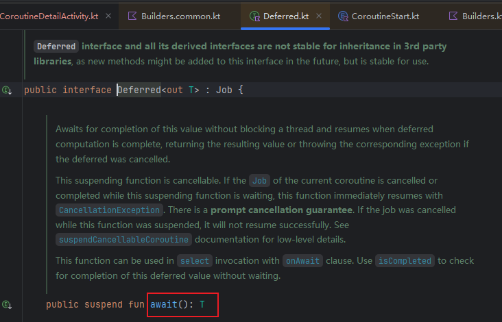

协程作用域

- 协程作用域(`Coroutine Scope`)是协程运行的作用范围。`launch`、`async`都是`CoroutineScope`的扩展函数
  - 我们可以看到这里的CoroutineScope.async，他为已有的类CoroutineScope“添加”新函数async，这使得你只能在 CoroutineScope 的上下文中调用他们
  - 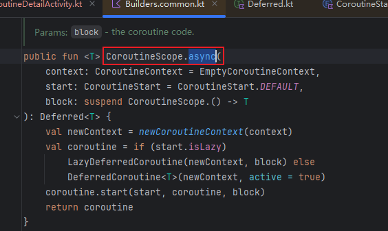
- `CoroutineScope`定义了新启动的协程作用范围，同时会继承了他的`coroutineContext`自动传播其所有的` elements`和取消操作。换句话说，如果这个作用域销毁了，那么里面的协程也随之失效。

### 3.3 Kotlin协程的基础用法

我们先来看一个例子

- 代码如下
  - 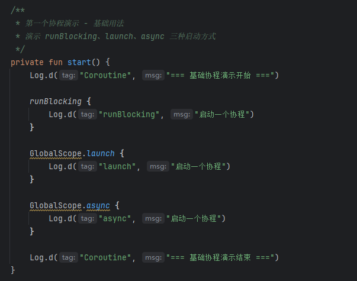

他有下面的现象

- block执行顺序固定，必定在第3个的位置，换句话说，前三段代码执行固定
  - 
  - 这是因为runBlocking 阻塞当前线程直到内部协程完成，因此他可以看作是顺序的。
- launch和sync之间的执行顺序不固定
  - 可以是
  - 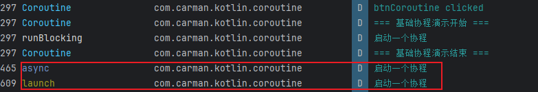
  - 也可以是
  - 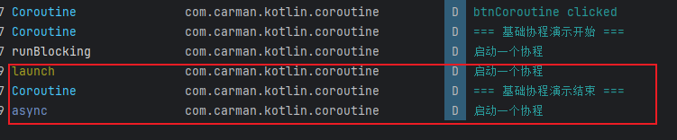
  - 这是因为，这两个协程在不同的后台线程上并发执行，而线程调度是不确定的，哪个线程先获得CPU时间片是随机的
- launch，sync和基础协程演示结束之间的执行顺序不固定
  - 可以是
  - 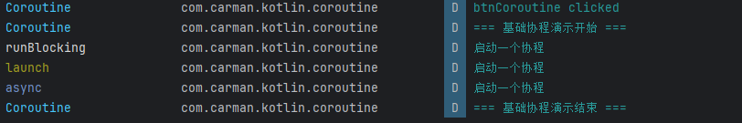
  - 也可以是
  - 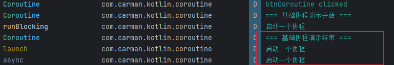
  - 还可以是
  - 
  - 这是因为，协程体在后台线程异步执行，而主线程继续执行，打印 "结束"，此时后台线程和他的执行顺序不固定，日志也不固定

ok，我们来看第二个例子

- 代码如下
  - 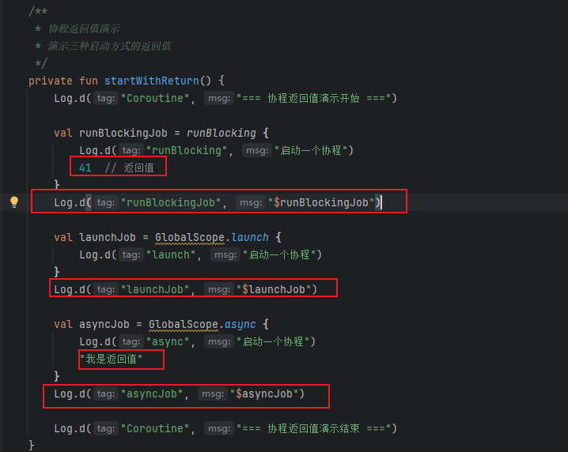
- 我们期望：对于runBlocking，打印的是41.对于launchJob，打印的是其toString，对于asyncJob，打印的是他的toString
- 结果
  - 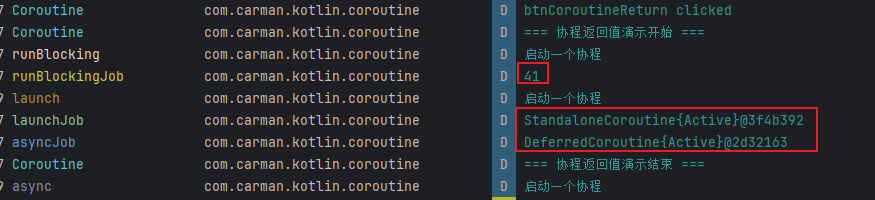
- 为什么呢？
  - block是阻塞的。所以，会等他执行完成，此时state被替换为result。打印的是其lambda表达式返回的结果41。
  - 而launch和async分别返回job和deferred。同时这里打印的是协程的类型 + 协程的状态 + 对象的句柄

那我们现在有新的问题了，为什么返回值是41，就是为什么能够返回41？

- 看代码，runBlockingJob最终是一个state。
  - 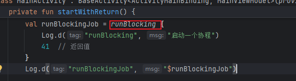
  - 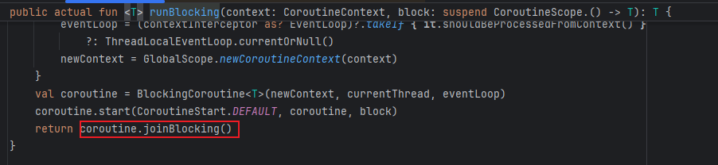
  - 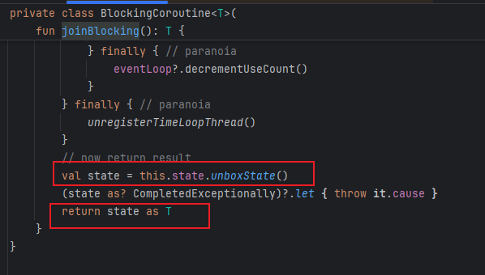

- 不是啊，state不应该是协程的状态吗？怎么理解state被替换为result并被打印出来？因为协程中间会进行返回值的转换
  - 类似这种
  - 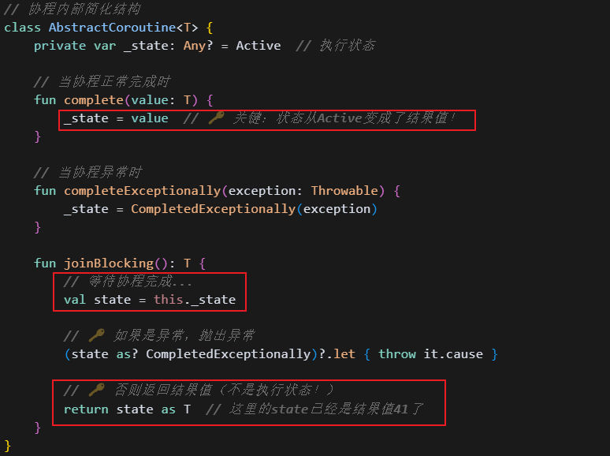

await方法再看

- ok，现在我们看看这个有意思的await方法
  - 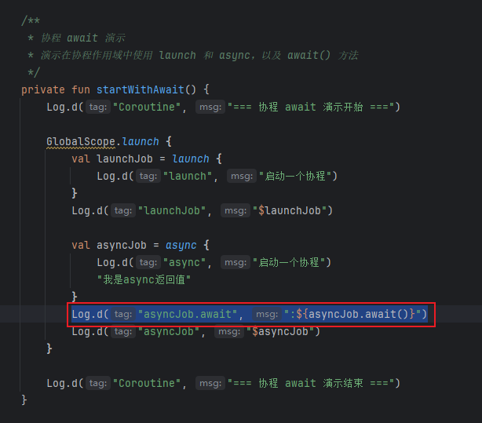
- 猜猜他的结果是什么？
  - 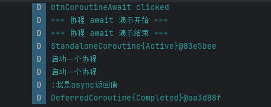
  - 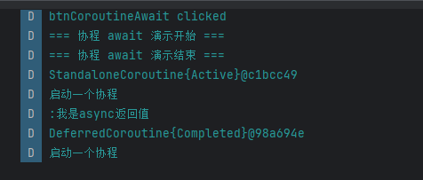
- 多种顺序，但是不管如何，始终是DeferredCoroutine{Completed}@98a694e，也就是返回Completed。也就是说，await会挂起协程，等待其生命周期执行完成后，这个await会被线程再次执行。

### 3.4 Job和Deferred分别是什么？

ok现在是新的问题：我们可以看到，这两个job好像不是同一个类型，分别是StandaloneCoroutine和DeferredCoroutine？那么job和Deferr分别是什么？怎么理解他们？就简单的理解为：Defer就是带返回值的job吗？

- 这个是问题图片
  - 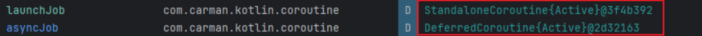
- 我们先来看launch，也就是返回job的协程启动方式
  - 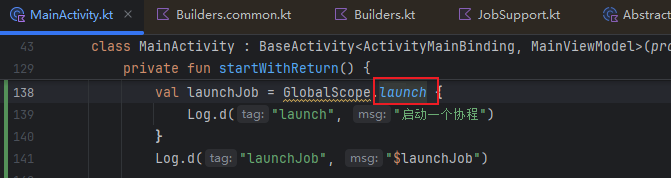
  - return一个StandaloneCoroutine类型的coroutine
  - 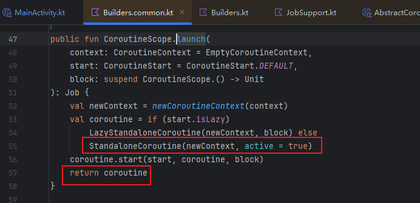
  - 其继承自AbstractCoroutine
  - 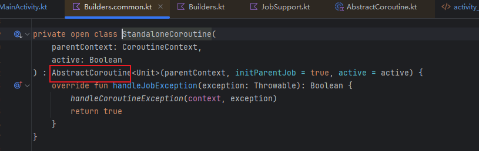
  - AbstractCoroutine实现了Job接口，所以返回的就是一个job
  - 
- ok，继续看async，为什么说他是一个deferr呢？
  - 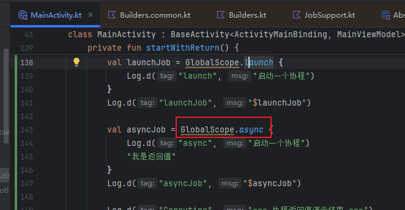
  - 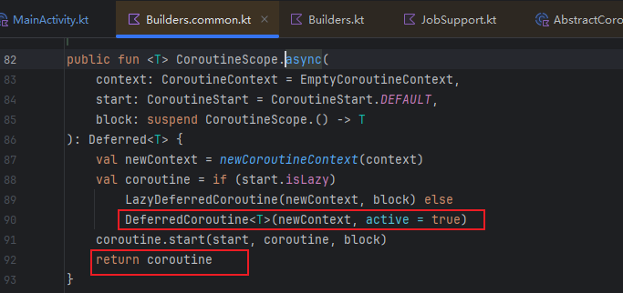
  - 同样继承自AbstractCoroutine，但是额外实现了Deferred接口
  - 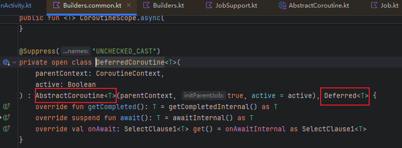
  - Deferred继承自Job，实现了 await方法
  - 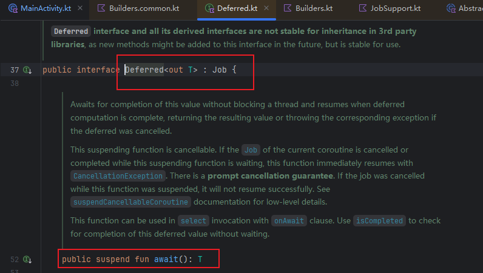
  - 来看看await方法的注释
    - 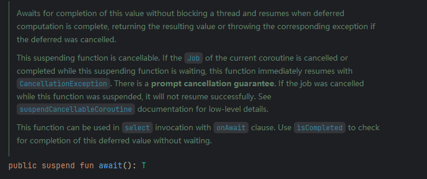
    - 核心点：Awaits for completion of this value without blocking a thread and resumes when deferred computation is complete：不会阻塞线程，而是“挂起”当前协程，等结果好了再恢复。

ok，怎么理解：Awaits for completion of this value without blocking a thread and resumes when deferred computation is complete：不会阻塞线程，而是“挂起”当前协程，等结果好了再恢复。

- 我存在一个疑问：我调用await不是期望获取协程执行的结果吗？为什么协程被挂起？被挂起怎么继续执行？这不是死锁了？
- 这说明你不理解await的执行流程：
  - 你调用await()，想要获取协程的结果。
  - 如果结果还没好，当前协程会“挂起”——也就是暂停自己，线程去干别的事。
  - 后台的任务（比如网络请求、IO等）会在某个线程上继续执行。
  - 等任务完成，结果准备好，调度器会把你“挂起”的协程恢复，在某个 线程上执行，让它继续执行await()后面的代码。
  - 此时await()返回结果，你就拿到了。

那我理解了一些：协程为什么高效？

- 所以协程为什么高效，我们要先看看线程的低效：就在于正常我们处理问题要进行线程间的切换，包含了线程状态的保存和恢复，这个是涉及到内核态和用户态的切换，非常耗时。
- 而协程呢？则是让线程满负荷跑，线程可以不停地“服务”不同的协程任务，极大提升CPU利用率，通过协程切换让线程切换任务执行，而不需要进行线程状态的保存和恢复。协程的状态保持和恢复是消耗很小的。

## 04.底层原理

## 05.深度思考

### 5.1 关键问题探究

### 5.2 设计对比

## 06.实践验证

### 6.1 行为验证代码

### 6.2 性能测试

## 07.应用场景

### 7.1 最佳实践

### 7.2 使用禁忌

## 08.总结提炼

### 8.1 核心收获

### 8.2 知识图谱

### 8.3 延伸思考

## 09.参考资料

1. 
2. 
3. 

## 其他介绍

### 01.关于我的博客

- csdn：http://my.csdn.net/qq_35829566

- 掘金：https://juejin.im/user/499639464759898

- github：https://github.com/jjjjjjava

- 邮箱：[934137388@qq.com]

