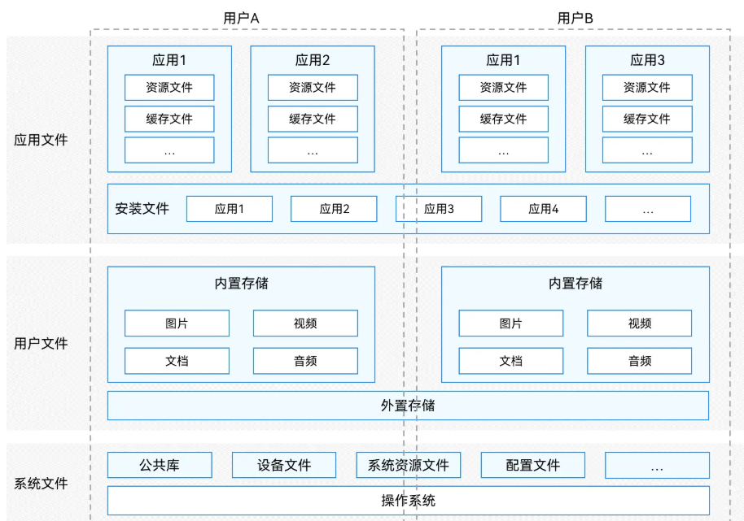
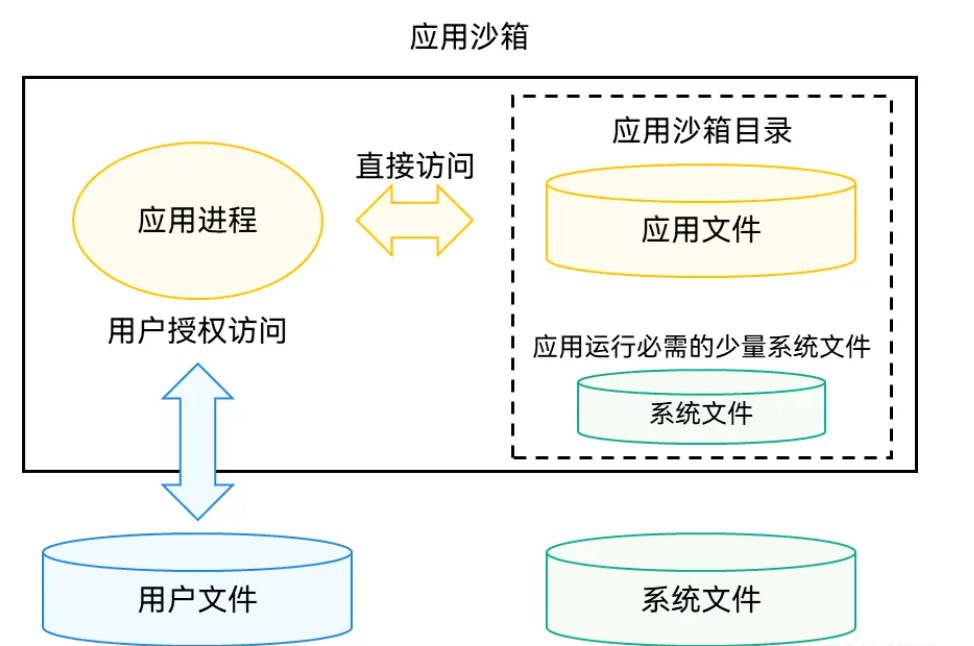
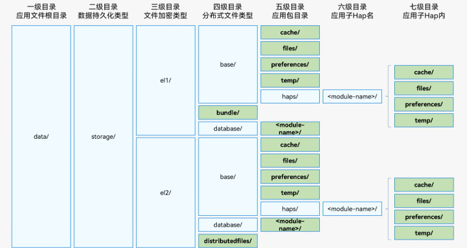
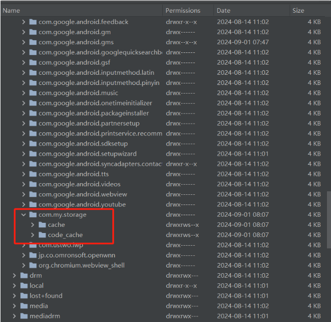
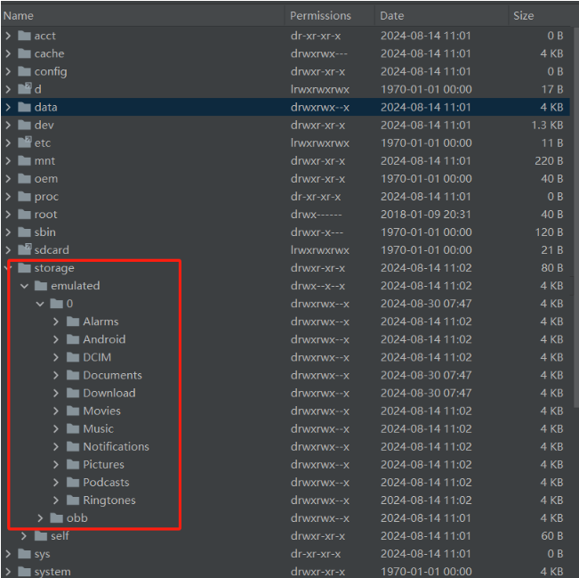
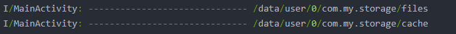
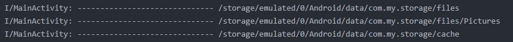

[toc]

## 前言

> 学习要符合如下的标准化链条：了解概念->探究原理->深入思考->总结提炼->底层实现->延伸应用"

## 01.学习概述

- **学习主题**：
- **知识类型**：
  - [ ] **知识类型**：
    - [ ] ✅Android/ 
      - [ ] ✅01.基础组件
      - [ ] ✅02.IPC机制
      - [ ] ✅03.消息机制
      - [ ] ✅04.View原理
      - [ ] ✅05.事件分发机制
      - [ ] ✅06.Window
      - [ ] ✅07.复杂控件
      - [ ] ✅08.性能优化
      - [ ] ✅09.流行框架
      - [ ] ✅10.数据处理
      - [ ] ✅11.动画
      - [ ] ✅12.Groovy
    - [ ] ✅音视频开发/
      - [ ] ✅01.基础知识
      - [ ] ✅02.OpenGL渲染视频
      - [ ] ✅03.FFmpeg音视频解码
    - [ ] ✅ Java/
      - [ ] ✅01.基础知识
      - [ ] ✅02.Java设计思想
      - [ ] ✅03.集合框架
      - [ ] ✅04.异常处理
      - [ ] ✅05.多线程与并发编程
      - [ ] ✅06.JVM
    - [ ] ✅ Kotlin/
      - [ ] ✅01.基础语法
      - [ ] ✅02.高阶扩展
      - [ ] ✅03.协程和流
    - [ ] ✅ 故障分析与处理/
      - [ ] ✅01.基础知识
    - [ ] ✅ 自我管理/
      - [ ] ✅01.内观
    - [ ] ✅ 业务逻辑/
      - [ ] ✅01.启动逻辑
      - [ ] ✅02.云值守
      - [ ] ✅03.智控平台
- **学习来源**：
- **重要程度**：⭐⭐⭐⭐⭐
- **学习日期**：2025.
- **记录人**：@panruiqi

### 1.1 学习目标

- 了解概念->探究原理->深入思考->总结提炼->底层实现->延伸应用"

### 1.2 前置知识

- [ ] 

## 02.核心概念

### 2.1 是什么？

对于鸿蒙上的一个app，他有多级的文件目录，假如我们要给用户提供一个清除缓存的方案，那么请问我们应该清除的是哪些文件目录下的哪些内容呢？


### 2.2 解决什么问题？


### 2.3 基本特性


## 03.原理机制 

### 3.1 认识鸿蒙文件系统

文件系统分类：

- 在最新的Core File Kit套件中，按文件所有者的不同。分为如下三类：
  - `应用文件`：文件所有者为`应用`，包括应用安装文件、应用资源文件、应用缓存文件等。
  - `用户文件`：文件所有者为登录到该终端设备的`用户`，包括用户私有的图片、视频、音频、文档等。
  - `系统文件`：与应用和用户无关的其它文件，包括公共库、设备文件、系统资源文件等。这类文件普通开发者不需要关注。
- 对应如下图
  - 

应用使用的存储空间范围

- 我们的应用缓存目录，实质是系统在`内部存储空间`上映射出一个专属`应用沙箱目录`其中的一部分，它是`应用文件目录`与一部分系统文件（应用运行必需的少量系统文件）所在的目录组成的集合，特性如下：
  - 应用可以在`应用沙箱目录`下保存和处理自己的应用文件；
  - 系统文件及其目录对于应用是只读的；
  - 应用若需访问`用户文件`，则需要通过特定API同时经过用户的相应授权才能进行（即读写权限申请）。
- 下图展示了应用所使用的存储空间范围和方式
  - 

应用文件目录和路径

- 对于一个应用，他的文件目录和路径如下：
  - 
- 包含如下：
  - 一级目录data/：整个应用的根目录，是应用所有数据存储的起点。
  - 二级目录storage/：代表本应用持久化文件目录。
  - 三级目录el1/、el2/：代表不同文件加密类型。
    - el1，设备级加密区：设备开机后即可访问的数据区。无需解锁用户屏幕即可读写。适用于开机前必须可用的数据，例如启动必要信息。
    - el2，用户级加密区：设备开机后，需要至少一次解锁对应用户的锁屏界面（密码、指纹、人脸等方式或无密码状态）后，才能够访问的加密数据区。其具有更高安全性，保护用户隐私数据。（应用如无特殊需要，应将数据存放在el2加密目录下，以尽可能保证数据安全。）
  - 四级目录：分布式文件类型这里按功能区分目录类型：
    - **`base/`**：基础应用数据目录。
    - **`bundle/`**：主要存放应用包相关信息。
    - **`database/`**：数据库文件目录。
    - **`distributedfiles/`**：用于分布式场景的文件共享（例如多设备同步数据）
  - 五级目录：在 `base/` 或 `distributedfiles/` 等四级目录下，会进一步分成具体存储用途：
    - **`cache/`**：缓存文件。
    - **`files/`**：普通文件存储。
    - **`preferences/`**：偏好设置文件。
    - **`temp/`**：临时文件。
    - **`haps/`**：存放 HAP 模块文件。
  - 六级目录：`<module-name>/`
    - 表示应用的某个 HAP 模块名称（如功能模块）。
    - 不同模块各自独立，互不影响。
  - 七级目录：HAP 内部文件，每个模块内部的具体目录结构与五级目录一致：

- 这里的Hap是什么？怎么理解ApplicationContext 与 HAP 级别目录
  - **HAP = Harmony Ability Package**，它是 **鸿蒙应用的基本部署单元**，类似于 Android 的 APK，但更模块化。
  - 一个应用可以包含 **一个或多个 HAP**。每个 HAP 是一个 **功能模块**，可以独立安装、更新、卸载。比如：一个 App 有“基础功能 HAP”+“支付 HAP”+“社区 HAP”，用户只需下载需要的模块。
  - 因此每个 HAP 都有自己的：`cache/`，`files/`，`preferences/`，`temp/`
- 怎么理解ApplicationContext 与 HAP 级别目录
  - ApplicationContext（应用级目录），表示 **整个应用共享的文件目录**。
    - 路径在 **`base/`** 或 **`distributedfiles/`** 下。
    - 特点：全局可见（所有 HAP 模块都可访问）。**HAP 卸载不会影响这里的数据**。适合存放：全局配置、用户数据、数据库等。
  - **HAP 级目录**，每个 HAP 独立拥有的文件目录。
    - 路径在 **`haps/<module-name>/`** 下。
    - 特点：与 HAP 强绑定。**卸载该 HAP 时，其目录和数据会被删除**。适合存放：仅该模块相关的临时数据、缓存、偏好设置。

### 3.2 如何获取APP缓存大小？

缓存目录介绍

- Context属性名称：cacheDir
- 说明：应用在本设备内部存储上，用于缓存下载的文件或可重新生成的缓存文件的路径
  - 用于保存应用的缓存数据，主要包括离线数据、图片缓存、数据库备份以及临时文件等。此路径下存储的数据可能会被系统自动清理，因此不要存储重要数据。

缓存目录路径

- /data/storage/el1/base/cache
- /data/storage/el1/base/haps/entry/cache
- /data/storage/el2/base/cache
- /data/storage/el2/base/haps/entry/cache

缓存目录我们该怎么获取

- el1分区获取：

  - 切换到el1加密分区

  - ```
    context.getApplicationContext().area = contextConstant.AreaMode.EL1;
    context.area = contextConstant.AreaMode.EL1;
    ```

  - 获取其缓存目录

  - ```
    context.getApplicationContext().cacheDir
    context.cacheDir
    ```

  - 通过getApplicationContext().cacheDir获取了应用级目录，通过cacheDir获取了HAP 级目录

  - 结果如下：

  - ```
    /data/storage/el1/base/cache
    /data/storage/el1/base/haps/app/cache
    ```

- el2分区获取，同理el1

  - 切换到el2加密分区

  - ```
    context.getApplicationContext().area = contextConstant.AreaMode.EL2;
    context.area = contextConstant.AreaMode.EL2;
    context.getApplicationContext().cacheDir
    context.cacheDir
    //结果：
    /data/storage/el2/base/cache
    /data/storage/el2/base/haps/app/cache
    ```

获取缓存大小

- ```
  import storageStatistics from "@ohos.file.storageStatistics";
  const bundleStats = await storageStatistics.getCurrentBundleStats()
  return bundleStats.cacheSize
  ```

清除缓存

- ```
  static async cleanAppCache(context: Context): Promise<boolean> {
  context.getApplicationContext().area = contextConstant.AreaMode.EL1;
  context.area = contextConstant.AreaMode.EL1;
  const el1AppCacheDir = context.getApplicationContext().cacheDir
  const el1HapCacheDir = context.cacheDir
  context.getApplicationContext().area = contextConstant.AreaMode.EL2;
  context.area = contextConstant.AreaMode.EL2;
  const el2AppCacheDir = context.getApplicationContext().cacheDir
  const el2HapCacheDir = context.cacheDir
  
  //建立对应目录的缓存任务
    const task = [
      AppInfoUtils.clearCacheTask(el1AppCacheDir),
      AppInfoUtils.clearCacheTask(el1HapCacheDir),
      AppInfoUtils.clearCacheTask(el2AppCacheDir),
      AppInfoUtils.clearCacheTask(el2HapCacheDir)
    ]
  
    await Promise.all(task)
    return true
  }
  
  private static clearCacheTask(dir: string): Promise<boolean> {
    return new Promise((resolve) => {
      fileIo.access(dir).then((exist: boolean) => {
        if (exist) {
          fileIo.rmdir(dir)
        }
        resolve(true)
      })
    })
  }
```
  
  

## 04.底层原理


## 05.深度思考

### 5.1 关键问题探究

Android的文件系统是什么样的？

- 分为公有空间和私有空间
- 私有空间是专门为每个应用程序分配的存储空间，通常具体位于 `/data/data/【应用包名】/`，用于存储该应用程序的私有数据，例如，[数据库文件](https://so.csdn.net/so/search?q=数据库文件&spm=1001.2101.3001.7020)、SharedPreferences 文件、缓存文件等，会随着应用被卸载而消亡如下图：
  - 
- 公共空间是供所有应用程序共享的存储空间，它用于存储公共数据，例如，照片、音频、视频等，公共空间分为内部存储和外部存等
  - 公共空间通常具体位于 `/storage/emulated/0/`（模拟的 SD 卡路径），或位于 `/storage/【external_storage】/`（真实的外部存储介质路径
  - 访问公共空间中的数据需要相应的权限，有 `READ_EXTERNAL_STORAGE` 和 `WRITE_EXTERNAL_STORAGE`
  - 公共空间不会随着应用的消亡而消亡
  - 

内部存储和外部存储是什么？
- 内部存储指位于设备的内部存储空间
- 外部存储指位于设备的外部存储介质，例如，SD 卡

私有空间的目录

- 私有空间的目录

  - /data/data/【应用包名】/：应用的根目录
  - /data/data/【应用包名】/files/：应用存储持久性文件的目录，例如，配置文件
  - /data/data/【应用包名】/cache/：应用存储缓存文件的目录，系统可能会在设备存储空间不足时自动清除这些文件
  - /data/data/【应用包名】/databases/：应用存储数据库文件的目录
  - /data/data/【应用包名】/shared_prefs/：应用存储 SharedPreferences 文件的目录

- 获取内部存储的私有空间的目录

  - ```
    String filesDirPath = getFilesDir().getPath();
    Log.i(TAG, "------------------------------ " + filesDirPath);
    
    String cacheDirPath = getCacheDir().getPath();
    Log.i(TAG, "------------------------------ " + cacheDirPath);
    ```

  - 输出结果如下

  - 

- 获取外部存储的私有空间的目录

  - ```
    String externalFilesDirPath = getExternalFilesDir(null).getPath();
    Log.i(TAG, "------------------------------ " + externalFilesDirPath);
    
    // 可以通过传递 type 参数来获取不同类型的子目录
    String externalFilesPicturesDirPath = getExternalFilesDir(Environment.DIRECTORY_PICTURES).getPath();
    Log.i(TAG, "------------------------------ " + externalFilesPicturesDirPath);
    
    String externalCacheDirPath = getExternalCacheDir().getPath();
    Log.i(TAG, "------------------------------ " + externalCacheDirPath);
    ```

  - 输出结果如下

  - 

公共空间的目录

- 公共空间的目录

  - 图片：通常位于 /storage/emulated/0/Pictures/ 下，用于存储图片，例如，用户拍摄的照片、应用下载的图片
  - 音频：通常位于 /storage/emulated/0/Music/ 或 /storage/emulated/0/Audio/ 下，用于存储音频，例如，用户下载的音频、应用产生的音频
  - 视频：通常位于 /storage/emulated/0/Movies/ 或 /storage/emulated/0/Video/ 下，用于存储，例如，如用户录制的视频、应用下载的视频
  - 下载：通常位于 /storage/emulated/0/Download/ 下，用于存储下载的文件，例如，APK 安装包、文档、压缩包

- 目录获取

  - ```
    String picturesDirPath = Environment.getExternalStoragePublicDirectory(Environment.DIRECTORY_PICTURES).getPath();
    Log.i(TAG, "------------------------------ " + picturesDirPath);
    
    String musicDirPath = Environment.getExternalStoragePublicDirectory(Environment.DIRECTORY_MUSIC).getPath();
    Log.i(TAG, "------------------------------ " + musicDirPath);
    
    String moviesDirPath = Environment.getExternalStoragePublicDirectory(Environment.DIRECTORY_MOVIES).getPath();
    Log.i(TAG, "------------------------------ " + moviesDirPath);
    
    String downloadDirPath = Environment.getExternalStoragePublicDirectory(Environment.DIRECTORY_DOWNLOADS).getPath();
    Log.i(TAG, "------------------------------ " + downloadDirPath);
    ```

  - 结果如下

  - 

### 5.2 设计对比


## 06.实践验证

### 6.1 行为验证代码


### 6.2 性能测试


## 07.应用场景

### 7.1 最佳实践


### 7.2 使用禁忌


## 08.总结提炼

### 8.1 核心收获


### 8.2 知识图谱


### 8.3 延伸思考


## 09.参考资料

1. [【鸿蒙next开发】-如何获取APP缓存大小和清除缓存](https://blog.csdn.net/HarmonyOS_001/article/details/139657936?spm=1001.2101.3001.6650.5&utm_medium=distribute.pc_relevant.none-task-blog-2%7Edefault%7EBlogCommendFromBaidu%7ERate-5-139657936-blog-137970088.235%5Ev43%5Epc_blog_bottom_relevance_base1&depth_1-utm_source=distribute.pc_relevant.none-task-blog-2%7Edefault%7EBlogCommendFromBaidu%7ERate-5-139657936-blog-137970088.235%5Ev43%5Epc_blog_bottom_relevance_base1&utm_relevant_index=9)
2. []()
3. []()

## 其他介绍

### 01.关于我的博客

- csdn：http://my.csdn.net/qq_35829566

- 掘金：https://juejin.im/user/499639464759898

- github：https://github.com/jjjjjjava

- 邮箱：[934137388@qq.com]

