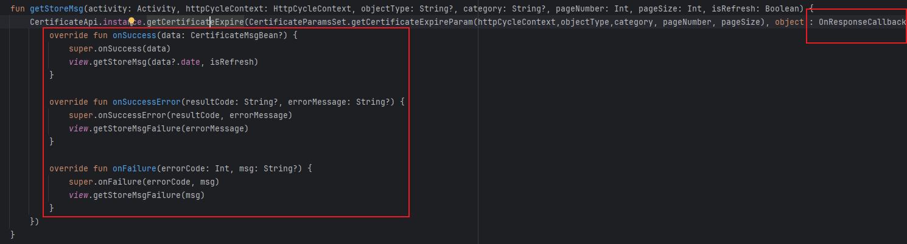
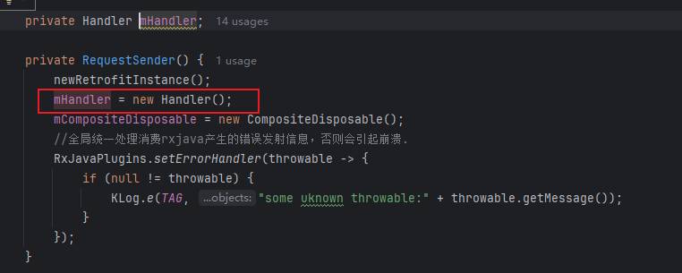
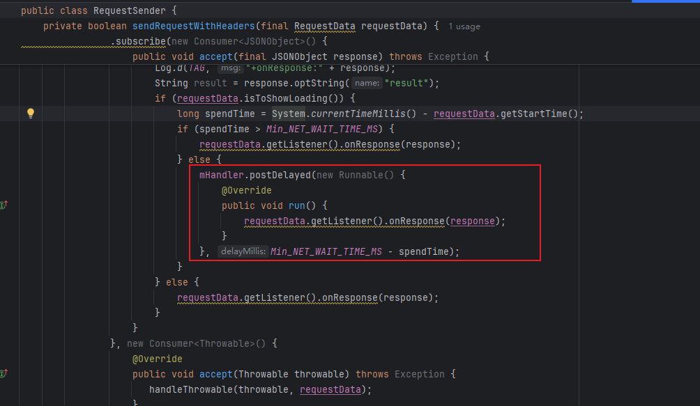
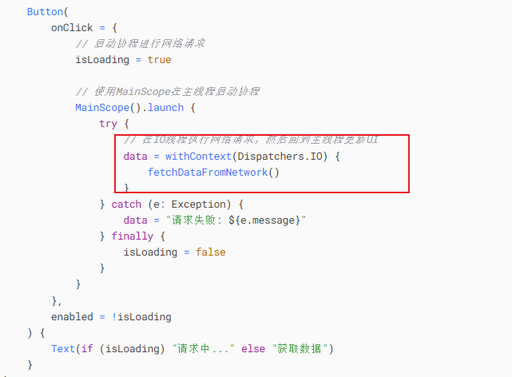
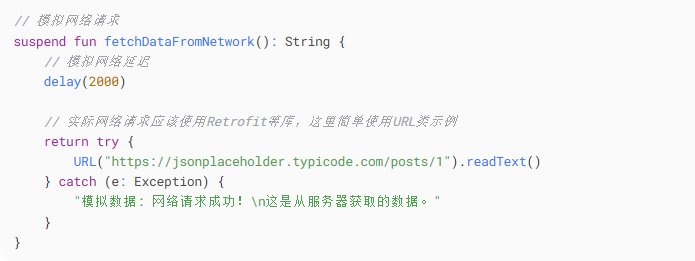
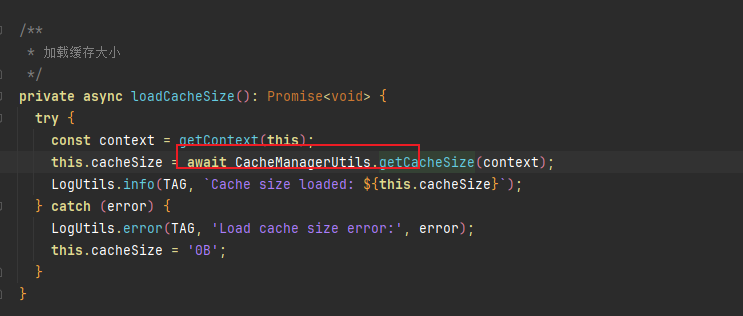

[toc]

## 前言

> 学习要符合如下的标准化链条：了解概念->探究原理->深入思考->总结提炼->底层实现->延伸应用"

## 01.学习概述

- **学习主题**：
- **知识类型**：
  - [ ] **知识类型**：
    - [ ] ✅Android/ 
      - [ ] ✅01.基础组件
      - [ ] ✅02.IPC机制
      - [ ] ✅03.消息机制
      - [ ] ✅04.View原理
      - [ ] ✅05.事件分发机制
      - [ ] ✅06.Window
      - [ ] ✅07.复杂控件
      - [ ] ✅08.性能优化
      - [ ] ✅09.流行框架
      - [ ] ✅10.数据处理
      - [ ] ✅11.动画
      - [ ] ✅12.Groovy
    - [ ] ✅音视频开发/
      - [ ] ✅01.基础知识
      - [ ] ✅02.OpenGL渲染视频
      - [ ] ✅03.FFmpeg音视频解码
    - [ ] ✅ Java/
      - [ ] ✅01.基础知识
      - [ ] ✅02.Java设计思想
      - [ ] ✅03.集合框架
      - [ ] ✅04.异常处理
      - [ ] ✅05.多线程与并发编程
      - [ ] ✅06.JVM
    - [ ] ✅ Kotlin/
      - [ ] ✅01.基础语法
      - [ ] ✅02.高阶扩展
      - [ ] ✅03.协程和流
    - [ ] ✅ 故障分析与处理/
      - [ ] ✅01.基础知识
    - [ ] ✅ 自我管理/
      - [ ] ✅01.内观
    - [ ] ✅ 业务逻辑/
      - [ ] ✅01.启动逻辑
      - [ ] ✅02.云值守
      - [ ] ✅03.智控平台
- **学习来源**：
- **重要程度**：⭐⭐⭐⭐⭐
- **学习日期**：2025.
- **记录人**：@panruiqi

### 1.1 学习目标

- 了解概念->探究原理->深入思考->总结提炼->底层实现->延伸应用"

### 1.2 前置知识

- [ ] 

## 02.核心概念

### 2.1 是什么？

是把耗时的任务放到其他线程中执行，并在执行完成后回调回当前的线程执行

### 2.2 解决什么问题？

### 2.3 基本特性

## 03.原理机制

### 3.1 Android中的callback模式

看代码

- Activity中执行Presenter中的getStoreMsg方法
  - 
- 其本质是通过OkHttp的线程池执行异步网络任务，在执行成功后，将回调，也就是下面的callback类型
  - 
- 他本质是将这个callback回调post到主线程中执行
  - 
  - 

### 3.2 Android中的协程模式

代码如下：

- 通过withContext指定这个suspend方法在IO线程池中执行，跟之前不一样，suspend会生成一个对象，内部有状态机和成员变量保持状态和恢复代码的执行。
  - 首先他会被放入线程的全局任务队列中执行，其在执行成功后会被post到主线程的消息队列中等待执行
  - 
  - 

### 3.3 鸿蒙中的中的await方式

代码如下

- 当 `await` 遇到 Promise：

  - **挂起当前 async 函数**（保存调用栈、局部变量等状态）
  - 主线程空出来继续执行别的任务（不会被阻塞）
  - Promise 在底层线程完成 I/O 操作后，将结果放入**任务队列**（microtask queue）
  - 事件循环调度到该任务时，恢复 async 函数的执行，返回结果给 `this.cacheSize`

  - 

- 所以鸿蒙 ArkTS：底层也有多线程运行时，I/O 不是在主线程里跑。

## 04.底层原理

## 05.深度思考

### 5.1 关键问题探究

### 5.2 设计对比

## 06.实践验证

### 6.1 行为验证代码

### 6.2 性能测试

## 07.应用场景

### 7.1 最佳实践

### 7.2 使用禁忌

## 08.总结提炼

### 8.1 核心收获

### 8.2 知识图谱

### 8.3 延伸思考

## 09.参考资料

1. 
2. 
3. 

## 其他介绍

### 01.关于我的博客

- csdn：http://my.csdn.net/qq_35829566

- 掘金：https://juejin.im/user/499639464759898

- github：https://github.com/jjjjjjava

- 邮箱：[934137388@qq.com]

