协程调度器oroutineDispatcher是什么？他是用于进行任务切换执行，他怎么可以做到：协程切换让线程切换任务执行，而不需要进行线程状态的保存和恢复的呢？

- 看代码：继承自Element，拥有Interceptor以及excutor
  - 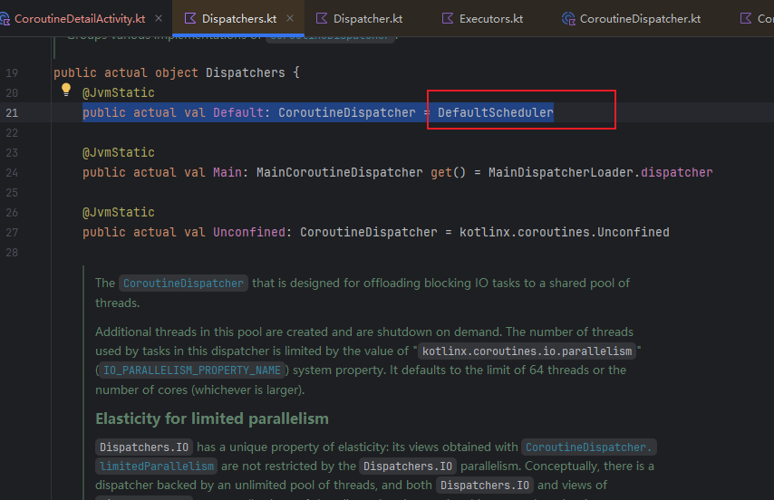
  - 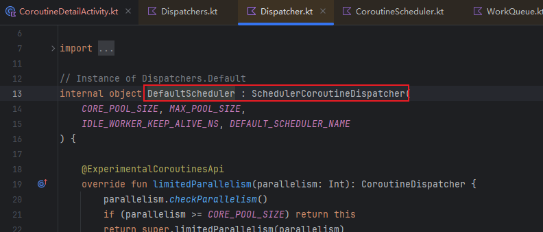
  - 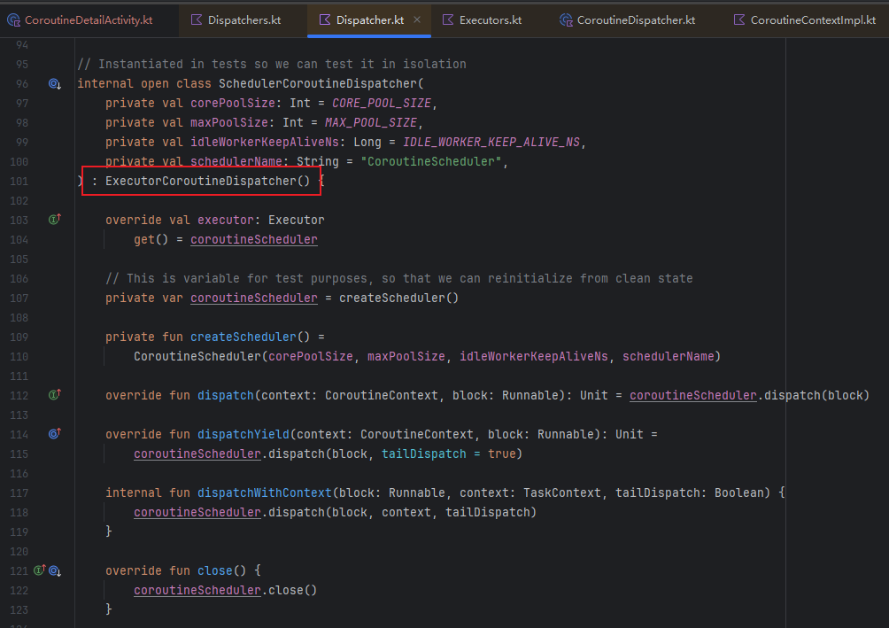
  - 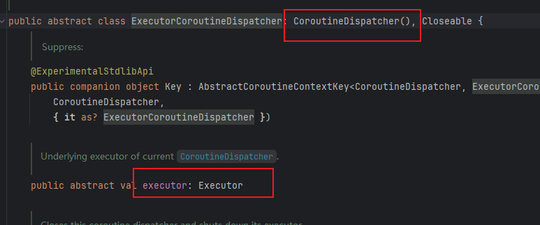
  - 
  - 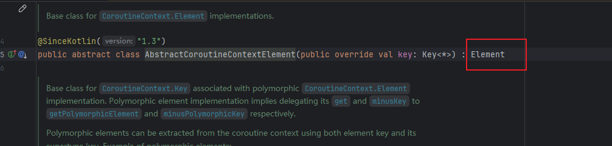
- 那么他是怎么分发的呢？
  - 首先调用CoroutineScheduler构建一个Kotlin协程调度器
  - CoroutineScheduler是Kotlin协程库中用于调度协程任务的线程池实现。
  - 这个函数会用指定的参数（核心线程数、最大线程数、空闲线程存活时间、调度器名称）创建一个新的调度器实例。
  - 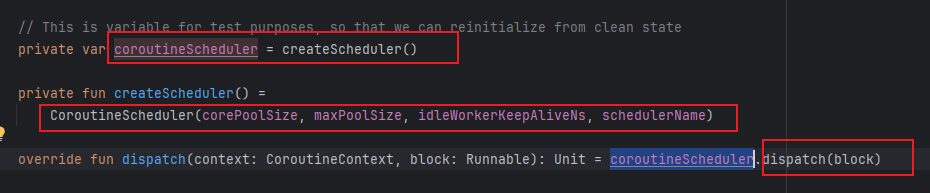
  - 线程池？他不会还有一个消息队列吧？还真他妈有
  - 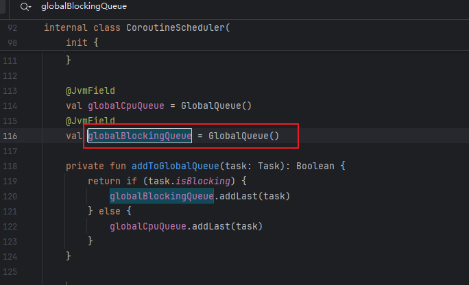
  - 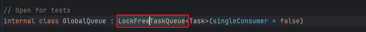

分发是很大的一块，我们来仔细看看、

首先是协程任务的产生和分发

- 协程遇到挂起点
  - 当suspend函数遇到挂起点（如delay、withContext、await），当前协程会暂停，把后续要执行的代码（即Continuation/状态机对象）封装成Runnable（或Task）
- 调用Dispatcher的dispatch
  - 协程调度器（如Dispatchers.Default）会调用dispatch(context, block)，把这个Runnable任务分发出去，可以看到下面传递的block是一个Runnable类型
  - 

CoroutineScheduler的任务入队

- 任务封装和入队

  - 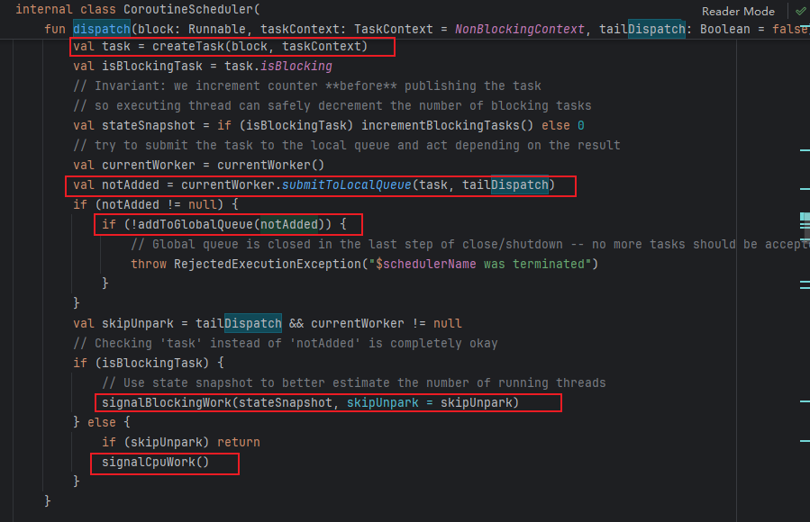
  - 关键点：
  - submitToLocalQueue：优先放到当前worker线程的本地队列（提升局部性）。

  - addToGlobalQueue：本地队列放不下时，放到全局队列。

  - signalCpuWork/signalBlockingWork：有新任务时唤醒worker线程。
  
- Worker线程如何取任务？

  - 尝试调用findTask取出任务，调用executeTask执行
    - 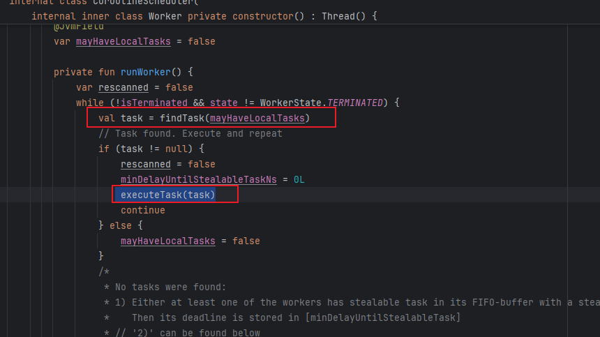
  - 如果没有任务，尝试重新扫描，如果无法重新扫描获取任务，那么释放cpu，进入停靠（park）状态
    - 

- 那么我要问了：你这个find是怎么find 的？

  - 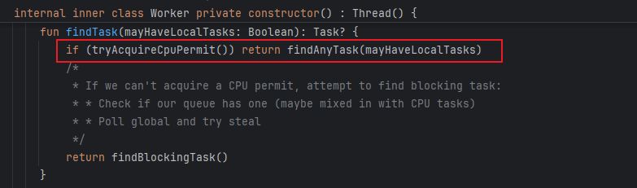
  - 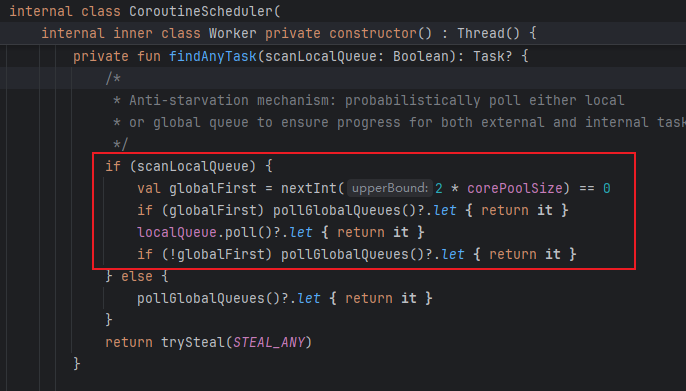
  - 看看注释
  - 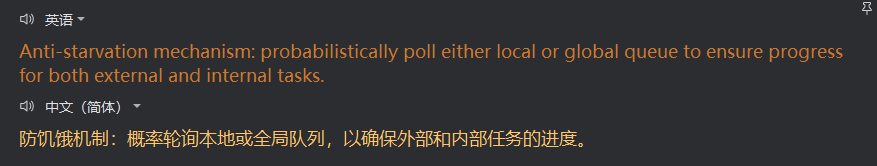
  - 有点神人啊，这个方法，这是一个防饥饿机制，通过val globalFirst = nextInt(2 * corePoolSize) == 0以较低概率（线程数越多，概率越低）先查全局队列，防止全局队列任务饿死。
  - 如果命中概率，先查全局队列，有任务就直接返回。否则查本地队列，有任务就直接返回。如果刚才没查全局队列，现在查一次，有任务就返回。
  - 目的：大部分情况下优先本地队列，但偶尔先查全局队列，保证全局任务不会被饿死。

- ok，别急，看见这个trySteal了吗？Steal是小偷，偷窃的意思，这里是去偷任务

  - 太神人了，我绷不住了，这个方法，他是用于偷窃别人的任务，实现负载均衡的。

  - 首先判断worker数量，通过created判断，只有多个worker时才有意义去“偷”任务

  - 通过var currentIndex = nextInt(created)随机化起点，防止所有线程都从同一个worker开始偷，减少竞争。

  - repeat中尝试遍历从currentIndex 开始的所有worker偷取任务

    - 跳过自己（worker !== this），只偷别人的任务。

    - 调用worker.localQueue.trySteal(...)尝试从别人的本地队列偷任务。

    - 如果偷到任务（stealResult == TASK_STOLEN），直接返回被偷的任务，并把别人的任务清掉

    - 如果没偷到，但有延迟任务，记录最小延迟

  - 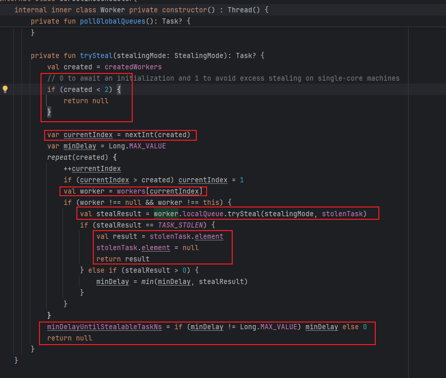

  - 偷窃方法实际实现：唉，太神人了，先放着吧。

  - 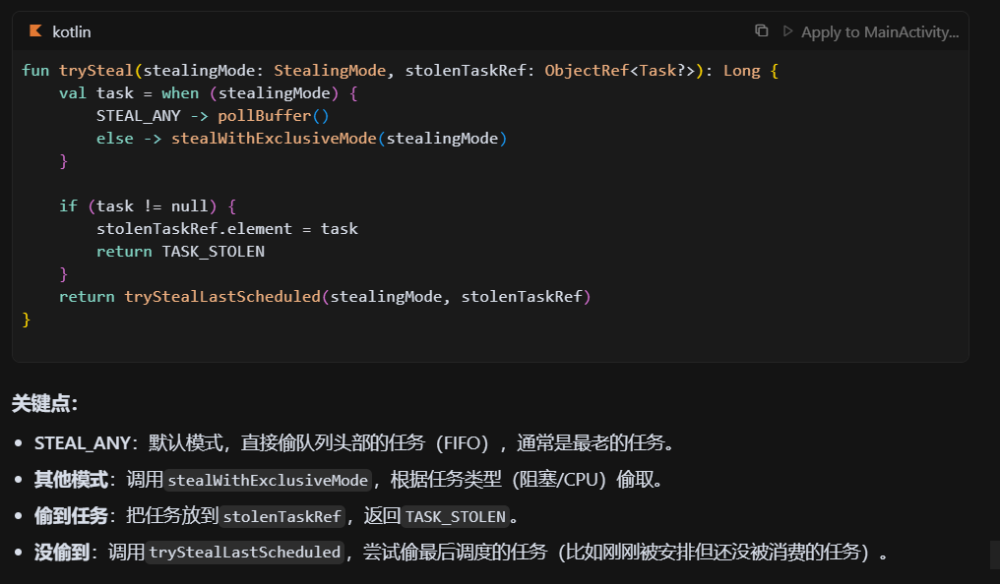

- 那么任务的实际执行流程呢

  - 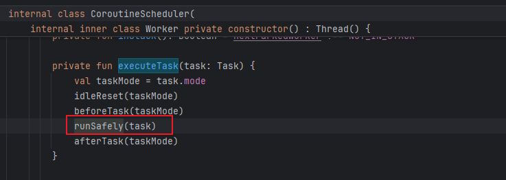
  - 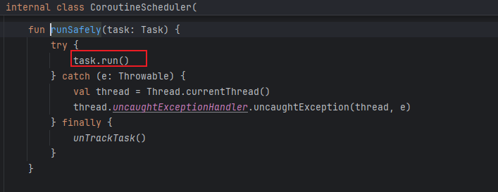
  - 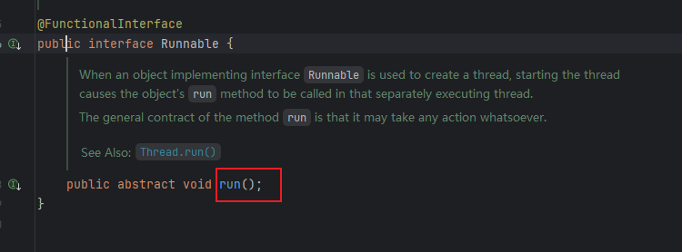
  - task.run()，实际就是调用协程Continuation的resumeWith，推进协程状态机。

这个偷窃任务我不是很理解，按照RxJava和Handler，他们是一个任务队列，多个线程从中取出执行。你这难道不是这样？每个worker拥有自己的本地任务队列，他们公用一个全局的任务队列？偷窃就是偷取其他worker的本地任务队列？那怎么理解这个worker呢？

- 传统的RxJava和Handler模式

  - 单一任务队列：所有任务都放在一个全局队列（如BlockingQueue）中。

  - 多个线程：线程池中的所有线程都从同一个队列中取任务来执行。
  - 缺点：高并发下全局队列会成为竞争瓶颈，影响扩展性和吞吐量。

- 协程调度器（CoroutineScheduler）的任务队列模型

  - 每个worker线程有自己的本地队列（通常是双端队列deque）。

  - 还有一个全局队列，用于存放“外部提交”或“本地队列放不下”的任务。

  - worker线程优先从自己的本地队列取任务，本地队列空了才去全局队列取。

  - work stealing（任务窃取）：如果本地和全局队列都没任务，worker会去“偷”别的worker本地队列的任务，防止自己闲着、别人累死。

ok，我们看到了任务分发和执行的过程了。我们可以看到，这里做了多个处理，一个是：任务类型适配，比如：对于IO类型任务可以让线程被阻塞。第二个：通过偷窃任务实现了负载均衡。

但是协程的高效本质不在于“任务入队”这一步，而在于“任务本身是可暂停/恢复的状态机”

- 我们该怎么理解上面的这句话呢？

  - 每个suspend函数/协程都被编译成一个状态机对象（Continuation子类），比如：
    - 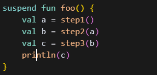
  - 会被编译为下面的，他有要给resumeWith方法，通过状态机when：label，修改label状态并执行挂起点方法
    - 

  - 因此其所有的局部变量、执行进度、挂起点都保存在对象里（堆上），
  - 那么对于线程来说，其只用保存对象的引用，然后调用对象的方法（resumeWith/invokeSuspend）来推进任务
  - 同时任务切换时，线程无需保存/恢复自己的上下文，状态的保存和恢复完全由对象的状态机实现。

- 那么我们也该理解线程切换的困难，为什么线程不能“随时暂停/恢复”？

  - 如果你想让线程“暂停”，比如step2还没完成就停下来，线程必须整个栈都保留，不能被别的任务用。

  - 如果要“恢复”，只能让同一个线程继续跑，不能让别的线程来接着跑。

  - 这就导致线程资源浪费，而且不能灵活切换。

为什么withContext可以改变协程的工作的线程

协程的启动模式

- DEFAULT：立即调度，能被取消，输出顺序不定。

- LAZY：不主动启动，不输出。

- ATOMIC：立即调度，挂起前不能取消，“挂起前”必输出。

- UNDISPATCHED：当前线程立即执行，“挂起前”必输出。

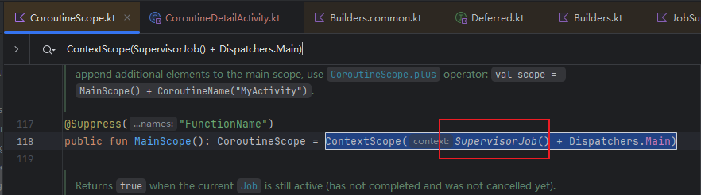

https://juejin.cn/post/6990156937165799454