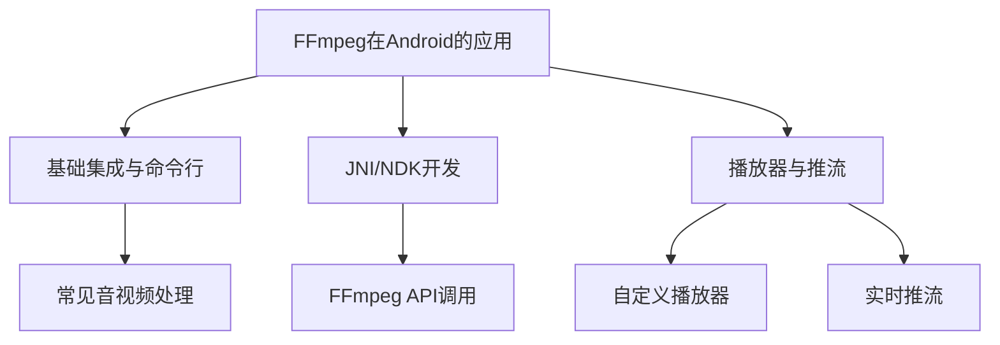

[toc]

## 01.项目概述

- **学习项目ID**：`LEARN-YYYYMMDD-001`
- **项目名称**：
- **学习周期**：YYYY.MM.DD - YYYY.MM.DD (预计X周/月)
- **负责人**：@panruiqi
- **状态**：
  - [x] 📝 规划阶段
  - [ ] 🚀 进行中
  - [ ] ✅ 已完成
  - [ ] ❌ 已终止

- **价值评估**：
  - [ ] ⭐⭐⭐⭐⭐ 核心技术能力
  - [ ] ⭐⭐⭐⭐ 项目关键依赖
  - [ ] ⭐⭐⭐ 效率提升工具
  - [ ] ⭐⭐ 扩展知识储备

- **项目描述**：
  - 系统学习 FFmpeg 在 Android 平台的集成、常见音视频处理功能实现、JNI/NDK 开发、播放器与推流等高级应用，提升音视频开发能力，满足实际项目需求。

- **成果物预期**：
  - [ ] 技术文档
  - [ ] 示例代码
  - [ ] 源码分析
  - [ ] 工具库封装

## 02.知识地图

### 2.1 前置知识评估、

| 知识点              | 掌握程度(1-5) | 是否需要补充学习 | 补充资源链接   |
| :------------------ | :------------ | :--------------- | :------------- |
| Android基础         | 5             | 否               |                |
| Java/Kotlin         | 5             | 否               |                |
| Gradle/依赖管理     | 4             | 否               |                |
| C/C++基础           | 2             | 是               | C语言入门      |
| JNI/NDK开发         | 2             | 是               | NDK官方文档    |
| 音视频基础知识      | 3             | 是               | 音视频开发入门 |
| FFmpeg命令行基础    | 1             | 是               | FFmpeg官方文档 |
| OpenGL/MediaCodec等 | 2             | 是               | OpenGL ES教程  |

### 2.2 核心知识模块

### 2.3 学习路径规划

1. 入门阶段：FFmpeg基础概念 → Android集成与命令行实践
2. 进阶阶段：JNI/NDK开发 → FFmpeg API调用
3. 深入阶段：播放器/推流原理 → 源码分析与定制扩展
4. 实践阶段：实战项目开发 → 问题解决与优化

## 03.阶段规划

### 3.1 第一阶段：概念理解 (2周)

- 目标：掌握FFmpeg基础概念和Android集成方式

- 学习内容：
  - [x] FFmpeg基本原理与应用场景
  - [x] FFmpeg命令行工具（ffmpeg/ffplay/ffprobe）
  - [x] Android集成FFmpeg（FFmpegKit/MobileFFmpeg）

- 实践任务：
  - [x] 完成音视频转码/裁剪/合成等命令行示例
  - [x] 编写学习笔记

- 验收标准：
  - [x] 能解释FFmpeg核心概念
  - [x] 能在Android项目中集成并调用FFmpeg命令

- 输出物：
  - [x] 学习笔记
  - [x] 示例代码

### 3.2 第二阶段：原理探究 (2周)

- 目标：理解FFmpeg在Android下的工作机制与JNI/NDK开发流程

- 学习内容：
  - [x] JNI/NDK基础
  - [x] FFmpeg so库编译与集成
  - [x] FFmpeg API调用流程

- 实践任务：
  - [x] 编译FFmpeg so库
  - [x] 实现JNI调用FFmpeg API的简单功能

- 验收标准：
  - [x] 能分析JNI调用流程
  - [x] 能定位集成常见问题

- 输出物：
  - [x] 原理分析文档
  - [x] 流程图

### 3.3 第三阶段：源码分析 (2周)

- 目标：掌握FFmpeg/ijkplayer等核心实现细节

- 学习内容：
  - [x] FFmpeg源码结构分析
  - [x] ijkplayer/ExoPlayer架构与关键模块
  - [x] 常用音视频算法与扩展点

- 实践任务：
  - [x] 注释关键源码
  - [x] 编写分析报告

- 验收标准：
  - [x] 能解释关键实现
  - [x] 能进行简单功能扩展

- 输出物：
  - [x] 源码分析报告
  - [x] 功能扩展示例

### 3.4 第四阶段：实战应用 (2周)

- 目标：在实际项目中应用所学

- 学习内容：
  - [x] 音视频处理最佳实践
  - [x] 性能优化与问题排查
  - [x] 播放器/推流实战

- 实践任务：
  - [x] 完成实战项目（如短视频编辑器/自定义播放器/推流Demo）
  - [x] 解决实际开发中的问题

- 验收标准：
  - [x] 项目正常运行
  - [x] 代码质量达标

- 输出物：
  - [x] 项目代码
  - [x] 技术总结

## 04.资源清单

### 4.1 学习资料

| 资料类型 | 名称                   | 链接 | 优先级(1-5) |
| :------- | :--------------------- | :--- | :---------- |
| 官方文档 | FFmpeg官方文档         |      | 5           |
| 官方文档 | FFmpegKit文档          |      | 5           |
| 书籍     | 《FFmpeg从入门到精通》 |      | 4           |
| 视频教程 | B站-音视频开发/FFmpeg  |      | 4           |
| 博客文章 | 掘金-Android FFmpeg    |      | 4           |
| 源码仓库 | ijkplayer              |      | 5           |
| 源码仓库 | ExoPlayer              |      | 4           |

### 4.2 工具准备

| 工具类型 | 名称                   | 用途       | 获取方式                   |
| :------- | :--------------------- | :--------- | :------------------------- |
| IDE      | Android Studio         | 开发环境   | 官网下载                   |
| 工具库   | FFmpegKit/MobileFFmpeg | FFmpeg集成 | GitHub                     |
| 工具库   | ijkplayer/ExoPlayer    | 播放器开发 | GitHub                     |
| 工具     | NDK/CMake              | JNI开发    | Android Studio SDK Manager |
| 工具     | Git                    | 版本管理   | 官网下载                   |

## 05.时间安排

### 5.1 总体时间分配

| 阶段     | 计划时间 | 实际时间 | 偏差原因 |
| :------- | :------- | :------- | :------- |
| 第一阶段 | 2周      |          |          |
| 第二阶段 |          |          |          |
| 第三阶段 |          |          |          |
| 第四阶段 |          |          |          |

### 5.2 里程碑计划

| 里程碑               | 预计日期 | 完成标志     | 状态 |
| :------------------- | :------- | :----------- | :--- |
| 完成FFmpeg命令行集成 |          | Demo可运行   |      |
| 完成JNI/NDK开发实践  |          | 简单API调用  |      |
| 完成源码分析与扩展   |          | 分析文档输出 |      |
| 完成实战项目         |          | 项目上线     |      |

### 5.3 每周学习计划

| 周次  | 学习目标      | 学习内容                   | 时间分配 |
| :---- | :------------ | :------------------------- | :------- |
| 第1周 | FFmpeg基础    | 命令行工具、常见参数       | 8h       |
| 第2周 | Android集成   | FFmpegKit/MobileFFmpeg实践 | 8h       |
| 第3周 | JNI/NDK基础   | so库编译、JNI调用          | 8h       |
| 第4周 | FFmpeg API    | 简单API调用                | 8h       |
| 第5周 | 播放器原理    | ijkplayer/ExoPlayer分析    | 8h       |
| 第6周 | 推流/高级功能 | 推流、滤镜、性能优化       | 8h       |
| 第7周 | 项目实战      | 项目开发与问题解决         | 8h       |
| 第8周 | 总结复盘      | 技术总结、文档整理         | 8h       |

## 06.学习追踪

### 6.1 进度记录表

| 日期 | 学习内容 | 学习时长 | 完成度(%) | 问题记录 |
| :--- | :------- | :------- | :-------- | :------- |
|      |          |          |           |          |

### 6.2 知识点掌握评估

| 知识点 | 初始理解(1-5) | 当前掌握(1-5) | 提升方法 |
| :----- | :------------ | :------------ | :------- |
|        |               |               |          |

### 6.3 遇到的难点与解决方案

| 难点描述 | 解决方案 | 参考资料 | 状态 |
| :------- | :------- | :------- | :--- |
|          |          |          |      |

## 07.成果积累

### 7.1 学习笔记索引

| 笔记标题 | 关联知识点 | 创建日期 | 链接 |
| :------- | :--------- | :------- | :--- |
|          |            |          |      |

### 7.2 代码示例索引

| 示例名称 | 演示功能 | 代码路径 | 说明 |
| :------- | :------- | :------- | :--- |
|          |          |          |      |

### 7.3 问题解决记录

| 问题描述 | 解决方案 | 相关知识点 | 日期 |
| :------- | :------- | :--------- | :--- |
|          |          |            |      |

## 08.复盘与优化

### 8.1 阶段复盘

| 阶段 | 预期目标 | 实际成果 | 差距分析 | 改进措施 |
| :--- | :------- | :------- | :------- | :------- |
|      |          |          |          |          |

### 8.2 学习方法评估

| 学习方法 | 效果评分(1-5) | 优点 | 不足 | 改进建议 |
| :------- | :------------ | :--- | :--- | :------- |
|          |               |      |      |          |

### 8.3 知识应用情况

| 应用场景 | 应用效果 | 存在问题 | 解决方案 |
| :------- | :------- | :------- | :------- |
|          |          |          |          |

## 09.项目示例

- 

## 10.附录

### 10.1 学习资源库

### 10.2 常用工具说明

### 10.3 复习计划