[toc]

## 前言

> 学习要符合如下的标准化链条：了解概念->探究原理->深入思考->总结提炼->底层实现->延伸应用"

## 01.学习概述

- **学习主题**：
- **知识类型**：
  - [ ] ✅Android/ 
    - [ ] ✅01.基础组件与机制 
      - [ ] ✅四大组件
      - [ ] ✅IPC机制
      - [ ] ✅消息机制
      - [ ] ✅事件分发机制
      - [ ] ✅View与渲染体系（含Window、复杂控件、动画）
      - [ ] ✅存储与数据安全（SharedPreferences/DataStore/Room/Scoped Storage）
    - [ ] ✅02. 架构与工程化
      - [ ] ✅架构模式（MVC/MVP/MVVM/MVI）
      - [ ] ✅依赖注入（Koin/Hilt/Dagger）
      - [ ] ✅路由与模块化（ARouter、Navigation）
      - [ ] ✅Gradle与构建优化
      - [ ] ✅插件化与动态化
      - [ ] ✅插桩与监控框架
    - [ ] ✅03.性能优化与故障诊断
      - [ ] ✅ANR分析与优化
      - [ ] ✅启动耗时优化
      - [ ] ✅内存泄漏监控
      - [ ] ✅监控与诊断工具
    - [ ] ✅04.Jetpack与生态框架
      - [ ] ✅Room
      - [ ] ✅Paging
      - [ ] ✅WorkManager
      - [ ] ✅Compose
    - [ ] ✅05.Framework与系统机制
      - [ ] ✅ActivityManagerService (含ANR触发机制)
      - [ ] ✅Binder机制
  - [ ] ✅音视频开发/
    - [x] ✅01.基础知识
    - [ ] ✅02.OpenGL渲染视频
    - [ ] ✅03.FFmpeg音视频解码
  - [ ] ✅ Java/
    - [ ] ✅01.基础知识···
    - [ ] ✅02.集合框架
    - [ ] ✅03.异常处理
    - [ ] ✅04.多线程与并发
    - [ ] ✅06.JVM
  - [ ] ✅ Kotlin/
    - [ ] ✅01.基础语法
    - [ ] ✅02.高阶扩展
    - [ ] ✅03.协程和流
  - [ ] ✅ Flutter/
    - [ ] ✅01.基础基础语法
    - [ ] ✅02.状态管理
    - [ ] ✅03.路由与依赖注入
    - [ ] ✅04.原生通信
  - [ ] ✅ 自我管理/
    - [ ] ✅01.内观
  - [ ] ✅ 项目经验/
    - [ ] ✅01.启动逻辑
    - [ ] ✅02.云值守
    - [ ] ✅03.智控平台
- **学习来源**：
- **重要程度**：⭐⭐⭐⭐⭐
- **学习日期**：2025.
- **记录人**：@panruiqi

### 1.1 学习目标

- 了解概念->探究原理->深入思考->总结提炼->底层实现->延伸应用"

### 1.2 前置知识

- [ ] 

## 02.核心概念

### 2.1 是什么？

### 2.2 解决什么问题？

音视频解码的流程

### 2.3 基本特性

## 03.原理机制

### 3.1 什么是音视频解码

解码的含义就是借助MediaCodec将H264解码为YUV，将AAC解码后得到PCM数据。怎么理解：H264到YUV，怎么理解MediaCodec，怎么理解AAC到PCM？

首先要看一些基础概念

- H264 和 YUV
  - H264是一种视频压缩编码格式，它的本质是“把一连串YUV帧用复杂算法压缩成很小的数据流”，他有帧内压缩算法，帧间压缩算法。
  - H264码流体积小，适合存储和传输，但不能直接显示，必须解码还原成YUV帧
  - YUV 是一种色彩空间，一帧YUV数据就是一张未压缩的画面。

  > H264如何压缩YUV帧？分为帧内压缩和帧间压缩
  >
  > - 帧内压缩：只压缩当前帧内部的冗余信息，不考虑前后帧。
  >
  >   - I帧（关键帧）就是用帧内压缩算法生成的。
  >
  >   - 原理：类似于JPEG图片压缩，把一张图片分块、变换、量化、编码，去除空间上的冗余（比如一片蓝天，很多像素颜色很接近）
  >
  > - 帧间压缩：利用前后帧之间的相似性，只记录变化的部分。
  >
  >   - P帧/B帧就是用帧间压缩算法生成的
  >   - 帧间压缩只记录“和前一帧/后一帧的差异”，不重复存储相同的内容，典型算法：帧差法（Frame Differencing），只保存像素的变化量
  >
  > - 所以，解码意思就是：
  >
  >   - 遇到I帧：I帧是完整帧，解码器可以直接把I帧解压缩还原成一张完整的YUV图像（不依赖其他帧）
  >   - 遇到P帧/B帧：先找到最近的I帧（或参考帧）的解压缩后的YUV数据，然后根据P/B帧的差异信息，叠加/修正，生成当前帧的YUV图像

- MediaCodec 

  - 他是 Android 提供的编解码 API，它可以调用硬件加速（硬解码/硬编码），也可以在某些情况下用软件解码。你可以用它来解码视频（如H264、H265）和音频（如AAC），也可以用来编码。
  - MediaCodec的解码过程简述就是：
    - 你（Client）提供H264码流
    - MediaCodec（Codec）解码H264码流，还原成一帧帧YUV数据
    - 你（Client）拿到YUV帧，可以用来直接送给显示模块（如SurfaceView、OpenGL等）渲染、后处理、保存等。
- 同理，音频AAC解码后得到PCM数据
  
  > 那我有一个疑问了，如何抽帧做成显示的封面？
  >
  > 本质是抽出YUV，然后调用API转换为RGB，最终显示为bitmap。图片基本是RGB的样式，看前面，有YUV到RGB的转换

### 3.2 MediaCodec解码流程

好，接着来看MediaCodec进行解码的数据流

- 整体如下：
  - 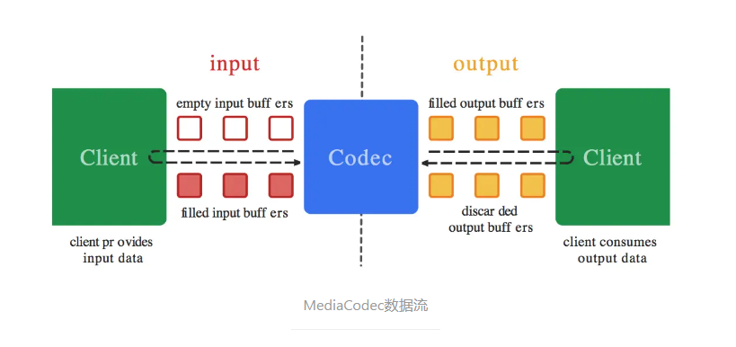
- 图中元素说明：
  - Client（左侧）：你的App代码，负责提供原始数据（比如H264码流、PCM音频等），
  - Codec（中间蓝色块）：MediaCodec硬件/软件编解码器，负责实际的编码/解码工作，
  - Client（右侧）：你的App代码，负责消费解码后的数据（比如YUV帧、AAC帧等）。
- input（输入缓冲区）空的input buffer：MediaCodec分配好一批空缓冲区，等你把待解码/编码的数据填进去。
- output（输出缓冲区）：MediaCodec处理完后，把解码/编码好的数据放到输出缓冲区，等你来取。你用完数据后，必须“释放”缓冲区，否则MediaCodec没法继续输出
- MediaCodec的核心就是“缓冲区队列”机制，你和解码器通过input/output buffer交互数据，通过缓冲区队列，你和MediaCodec各自处理自己的部分，互不阻塞，提高效率。

接着来看看MediaCodec进行解码时的状态。

- 整体如下：

  - 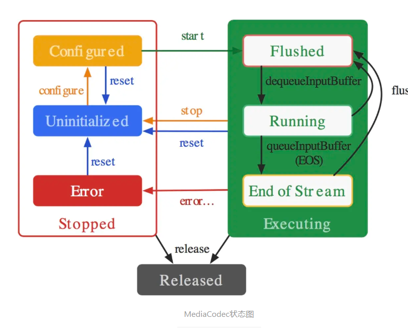

- 我们可以看到有三种状态

- Stopped（停止态）

  - Uninitialized：刚创建MediaCodec对象，还没配置参数。

  - Configured：调用configure()后，参数已设置好，但还没开始解码/编码。

  - Error：出错状态，比如参数错误、解码器崩溃等

-  Executing（执行态）

  - Flushed：调用start()后，解码器已准备好，输入/输出缓冲区已清空，等待数据输入。

  - Running：正在解码/编码，数据在流动。你在不断送入数据、取出结果。

  - End of Stream：输入流结束（你送了EOS标志），解码器处理完所有数据，进入流结束状态，此时你可以安全地关闭解码器或重新开始

-  Released（已释放）

  - 调用release()后，所有资源释放，MediaCodec对象不可再用

好，我们看到了他的数据流向和状态图。接下来看看他的解码流程。

- 整体如下图
  - 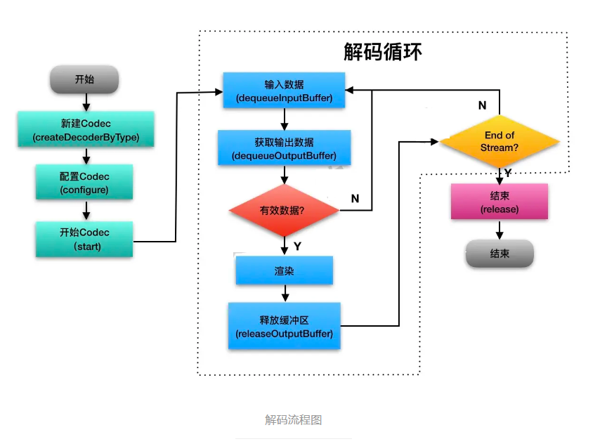
- 分为三个主要的阶段：初始化阶段，解码循环阶段，数据流结束阶段
- 初始化阶段
  - 新建Codec：MediaCodec.createDecoderByType()，创建解码器实例，指定解码类型（如"video/avc"表示H264）
  - 配置Codec：configure()，设置解码参数（如宽高、帧率、输出Surface等）
  - 开始Codec，start()，进入flushed可用状态，准备接收数据
- 解码循环阶段，我们这里以同步模式为例
  - 输入数据：调用dequeueInputBuffer()获取一个空的输入缓冲区index。把待解码的H264（或AAC等）数据写入该缓冲区。用queueInputBuffer()把缓冲区送进解码器
  - MediaCodec处理：这阶段不用我们考虑，由MediaCodec调用底层硬件解码，根据我们配置的解码参数，输出对应的YUV到相关的输出缓冲区中
  - 获取输出数据：调用dequeueOutputBuffer()获取解码后的输出缓冲区index。如果有数据（index >= 0），说明有一帧解码完成。
  - 数据有效性验证：如果有有效数据（Y），进入渲染流程。如果没有有效数据（N），继续循环等待
  - 渲染：将解码后的数据（如YUV帧）渲染到Surface、OpenGL或转成Bitmap显示
  - 释放输出缓冲区：用完输出缓冲区后，必须调用releaseOutputBuffer()，否则解码器会卡住。
  - ok，上面是解码循环的阶段，我们输入数据，MediaCodec自动处理，获取输出数据，渲染，然后释放已使用的输出缓冲区。
- 结束阶段
  -  判断是否结束（End of Stream）：如果检测到输入流结束（EOS），则退出循环，进入结束流程。
  -  结束后可以重新start进行flushed状态，也可以release释放解码器资源，流程结束。

### 3.3 封装基础解码框架_解码器参数部分

根据上面的流程图，可以发现，无论音频还是视频，解码流程基本是一致的，不同的地方只在于【配置】、【渲染】两个部分。

好，我们已经知道解码的基础原理了。我们知道解码是要做什么，我们也知道解码的数据类，状态变化和解码的过程。接下来，请你来自己设计一个解码框架，借助MediaCodec实现解码功能，要求：扩展性好，简洁易用，能实现基础功能。

好，对于这个解码框架，我们首先要定义他的解码框架的参数，有哪些基础的参数？

首先我们将整个解码流程抽象为一个解码基类：BaseDecoder。

这个解码流程，他需要一种能力，解码的能力，这种能力应该是解码的通用能力，不管是硬解/软解、本地/网络、音频/视频，他都要支持，因此我们要抽象出一个标准化的解码器接口IDecoder，抽象出解码的所有的通用的能力。

IDecoder：好，我们来看一下他的代码

- 首先是解码流程控制
  - 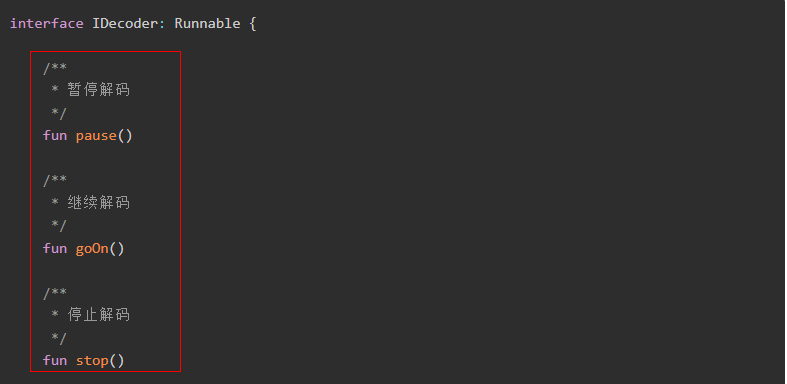
- 然后是解码状态查询和监听，setStateListener(l: IDecoderStateListener?)：设置状态监听器，便于UI层或上层感知解码进度、错误、完成等事件
  - 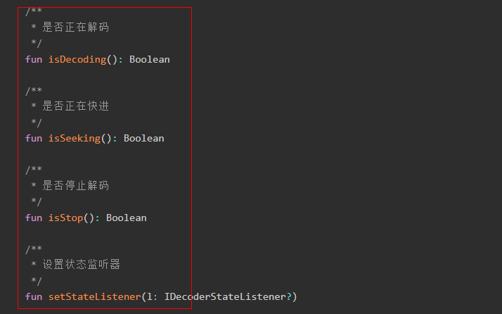
- 最后是媒体信息获取
  - 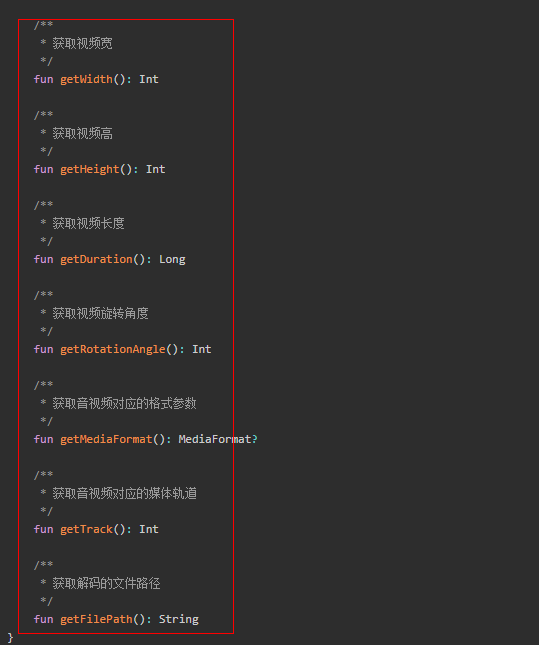

> 为什么继承自Runnable？
>
> - 解码是耗时操作，需要不断循环处理数据（同步模式下），如果放在主线程会卡UI。
> - 继承Runnable后，可以把解码任务丢到线程池或新线程中，异步执行，不会阻塞主线程。
> - 这样也便于后续支持“暂停/恢复/停止”等线程控制操作。
>
> 为什么要先设计一个IDecoder接口？它的目的和业务价值是什么？
>
> - 先举个例子吧：
>   - 我们有抽象类BaseDecoder，然后继承并扩展这个抽象类的SoftVideoDecoder和HardVideoDecoder实现软解码（如FFmpeg）和硬解码（如MediaCodec）。
>   - 我们现在期望进行软硬解切换？此时我们可以依赖于这个接口进行软硬解的切换。
>   - 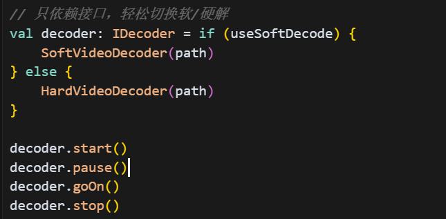
>
> 好，我们看完了一个例子，我们来想一想设计他有什么目的和业务价值？
>
> - 目的：
>   - 抽象解码器的统一“外壳”：你可能有多种解码需求：视频、音频、字幕、软解、硬解、不同数据源（本地、网络、内存），但是这个让所有解码器（无论软解、硬解、音频、视频、不同数据源）都遵循同一套操作规范
>   - 实现“面向接口编程”，让上层业务只依赖接口，不关心具体实现细节。
> - 业务价值：
>   - 统一调用方式，简化业务逻辑，你只需要写一套业务代码（如decoder.start()、decoder.pause()），不用关心底层是软解还是硬解、视频还是音频
>   - 便于做软硬解切换、多路解码、解码器热插拔等高级功能

好，我们定义了解码器的能力了，接着，我们的基础解码器BaseDecoder要实现这个接口IDecoder，也就是说他应该具备解码器的能力，或者更准确的说，其说明这个类BaseDecoder自己就是解码器，所以用“继承接口”。下面还有一个`protected var mExtractor: IExtractor? = null` 思考一下，和我们这有什么不同？

好，我们现在先来看看他的参数。

- 首先是线程相关
  - mIsRunning：标记解码线程是否应该继续运行，用于控制解码循环的退出。
  - mLock：线程同步锁，用于实现“暂停/恢复”功能，挂起/唤醒解码线程，保证线程安全
  - mReadyForDecode：标记是否可以进入解码主循环。用于在暂停、等待数据等场景下，线程可以wait，直到条件满足再继续
  - 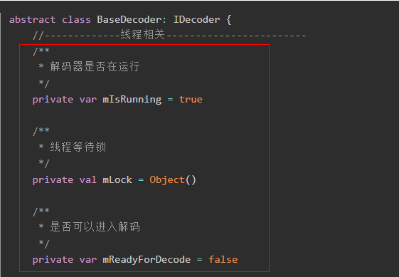
- 然后是解码相关成员
  - mCodec: MediaCodec?，Android原生的音视频编解码器实例
  - mExtractor: IExtractor?,自定义的音视频数据读取器实例。用于读取音视频源。
  - mInputBuffers: Array<ByteBuffer>? / mOutputBuffers: Array<ByteBuffer>?：解码器的输入/输出缓冲区数组（同步模式下用），存放待解码的数据和解码后的数据帧。注意：Buffers中的一个Buffer就存放一个数据帧。
  - mBufferInfo: MediaCodec.BufferInfo：存储解码帧的元数据（如时间戳、flags等），用于判断帧类型、同步音视频、处理EOS等
  - mState: DecodeState：当前解码器的状态（如STOP、DECODING、PAUSE等），便于状态管理和外部监听
  - mStateListener: IDecoderStateListener?：解码状态监听器，让UI或上层感知解码进度、错误、完成等事件，可以通过上面IDecoder接口的set方法设置
  - mIsEOS：标记流数据是否结束（End of Stream），用于控制解码循环的退出和资源释放
  - mVideoWidth / mVideoHeight：视频的宽高，便于渲染、UI展示、后续处理
  - 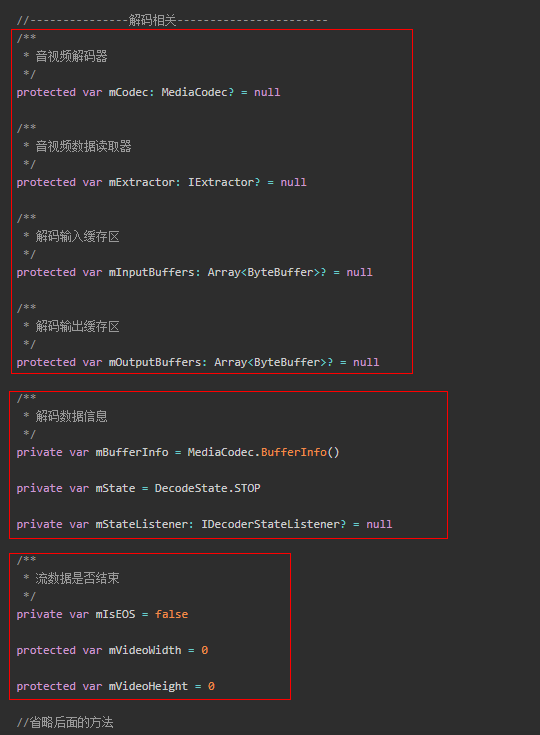
  
  - 解码状态详解
  - 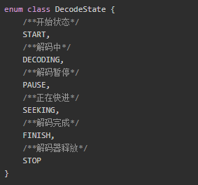

MediaCodec需要我们不断地喂数据给输入缓冲，那么数据从哪里来呢？肯定是音视频文件了，音视频文件从哪来？本地文件、网络流、内存？我们该怎么获取这些音视频数据源呢？

ok，我们这里还要有获取音视频数据源的能力，就像上面的解码器能力一样。我们有IExtractor这个音视频数据读取器接口，解耦数据源和解码器，支持多种数据来源（如本地文件、网络流、内存等）

> 这里看IDecoder 和 IExtractor，分别是类实现接口和成员变量实现接口
>
> - 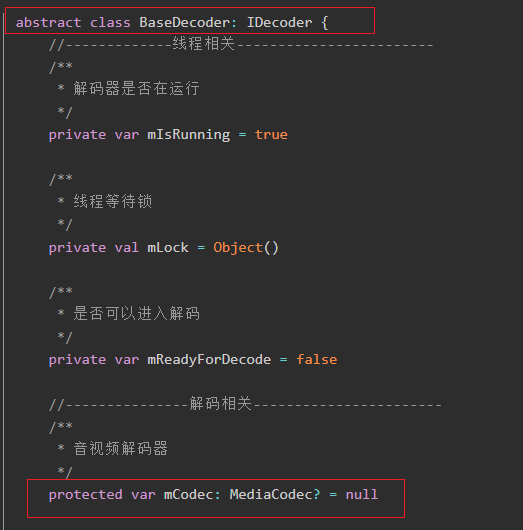
>
> 你用abstract class BaseDecoder: IDecoder，是说“BaseDecoder本身就是一种解码器”，它承诺实现IDecoder规定的所有功能,这是一种“自我能力”的声明：“我能做解码”。
>
> 你用protected var mExtractor: IExtractor? = null，是说“BaseDecoder内部需要依赖一个实现了IExtractor接口的对象，来完成数据读取”,这是一种“协作能力”的声明：“我需要别人帮我做数据提取”.
>
> 他们的差异
>
> - IDecoder：BaseDecoder自己就是解码器（“我是谁”），所以用“继承接口”。
>
> - IExtractor：BaseDecoder需要一个数据提取器（“我需要谁”），所以用“成员变量+接口”。
>
> - 这两种用法分别对应“实现能力”和“依赖能力”
>
> 这里同理上面的，也可以用类似这样的，获取不同的数据提取器，只要把下面的IDecoder相关换成IExtractor相关即可。
>
> - 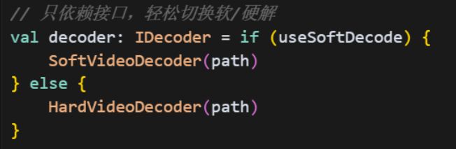

好，我们来看看IExtractor。

- 这是他需要具备的能力
  - getFormat(): MediaFormat?：获取当前音视频流的格式参数（如采样率、分辨率、编码类型等），解码器需要这些参数来正确配置MediaCodec
  - readBuffer(byteBuffer: ByteBuffer): Int：从数据源读取一帧或一段音视频数据，写入byteBuffer，返回实际读取的字节数
  - getCurrentTimestamp(): Long：获取当前帧的时间戳（单位：微秒），用于音视频同步、进度显示、seek等。
  - seek(pos: Long): Long：跳转到指定位置（单位：微秒），返回实际跳转到的帧的时间戳。支持快进、快退、拖动进度条等功能
  - setStartPos(pos: Long)：设置数据读取的起始位置，便于分段播放、断点续播等场景。
  - stop()：停止数据读取，释放资源。便于解码器安全退出，防止内存泄漏
  - 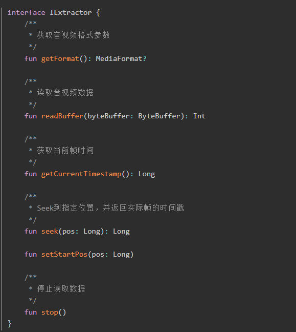

> 我现在好奇一点：快进怎么处理？他的本质是什么？因为我们正常是一帧一帧处理的，快进呢？
>
> - 快进不是“加快速度一帧一帧播放”，而是直接跳到目标时间点附近的关键帧（I帧/GOP起始），然后从那里开始解码和播放。
> - 那么GOP该选哪一个呢？播放器会根据快进速率和目标时间戳，计算应该seek到哪个GOP的I帧

### 3.4 封装基础解码框架_解码器流程之run方法

好了，我们有解码器参数部分的定义了，接下来是解码流程的处理。

还记得我们的解码流程吗？回忆一下，初始化阶段，解码循环阶段，结束阶段。

- 

好，我们继续，我们的IDecoder继承了Runnable，在Runnable中 有run回调方法，这个run回调方法中集成了整个解码流程:

首先是初始化阶段

- 设置初始状态，通知监听器“解码准备”，调用init()做解码器和数据源的初始化（如MediaCodec、Extractor等），init我们稍后再说，先看流程。
  - 

然后是解码主循环

- 具体如下：

  - 前置判断：
    - 非START、DECODING、SEEKING这些执行状态则调用waitDecode挂起
    - 停止状态则中断循环
  - 输入数据：如果还没到流结尾（EOS），从Extractor读取数据，送入解码器输入缓冲区，返回值标记是否已经到达流结尾。
  - 处理数据：这时，MediaCodec会自动处理输入缓冲区，我们从输出缓冲区中读取就行，如果输出缓冲区没数据，我们会被阻塞。当MediaCodec处理完成，输出到输出缓冲区中，我们会被唤醒，从中取出数据。
  - 输出数据：
    - 从解码器输出缓冲区拉取解码好的数据
    - 渲染数据：如果有数据，调用render()进行渲染（抽象方法，子类实现），然后释放输出缓冲区
    - 如果刚开始解码，解完一帧后自动进入PAUSE状态（可选设计，便于单步调试或首帧渲染）

  - 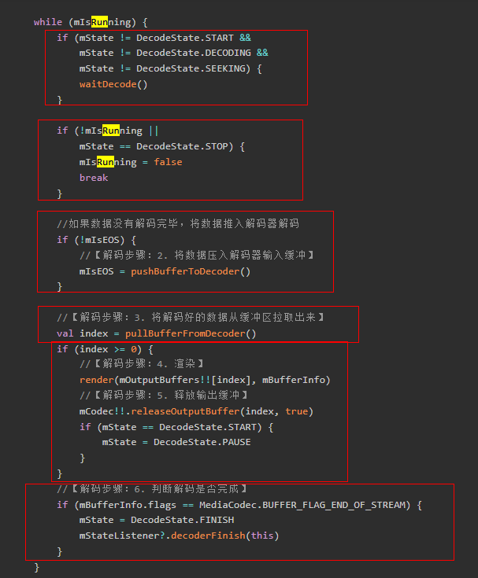

最后是结束阶段

- 具体如下：
  - 解码完成判断：如果输出缓冲区的flag标记为BUFFER_FLAG_END_OF_STREAM，说明解码完成，进入FINISH状态，通知监听器，同时跳出循环。
  - 资源释放：跳出循环后，调用doneDecode()（抽象方法，子类实现），最后释放解码器资源
  - 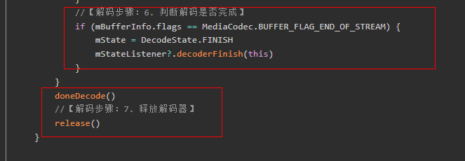

### 3.5 封装基础解码框架_解码器流程之init方法

好，我们上面介绍了整体的流程，但是很多方法的细节我们并没有看

比如这里的init方法。

我们先看看里面数据提取器的初始化

- 先是检查数据源：我们可以看到：检查mFilePath是否为空，mFilePath是我们数据源的地址，防止后续找不到数据源
  
- 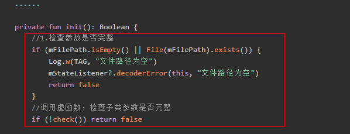
  
- 然后是初始化数据提取器和视频源参数：

  - 调用initExtractor(mFilePath)，传递数据源路径，让子类决定用哪种Extractor（如本地文件、网络流、内存流等）
  - 通过mExtractor获取MediaFormat，提取时长、宽高等通用参数。
  - 调用initParams，并最终调用initSpecParams(format)，让子类提取自己特有的参数（如音频采样率、声道数，视频旋转角度等）
  - 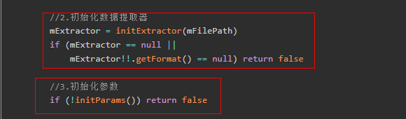
  - 

  > 我好奇的是：Extractor如何知道视频的信息的？比如：我们是网络数据源，他如何获取到视频信息？先下载下来？
  >
  > 本质：Extractor只需读取数据源的头部（本地或网络），就能解析出视频的元数据。
  >
  > - 对于本地文件：本地文件（如MP4、MKV等），Extractor（如MediaExtractor）可以直接打开文件，读取文件头（Header）和元数据区，这些头部信息里包含了时长、宽高、码率、轨道信息、编码类型等，Extractor解析后就能提供MediaFormat等参数。
  > - 对于网络文件：Extractor会先请求网络流的前面一小段数据（通常是文件头和部分元数据），只要拿到足够的头部信息，就能解析出视频的基本参数。

好，接着是我们的渲染器的初始化

- 调用initRender()（抽象方法），让子类初始化自己的渲染器（如视频Surface、音频AudioTrack）
  - 

最后是我们的解码器MediaCodec的初始化

- 具体如下：
  - 通过Extractor获取MediaFormat中的MIME类型（如"video/avc"、"audio/mp4a-latm"），也就是音视频编码格式，根据格式创建对应的MediaCodec实例
  - 调用configCodec(codec, format)，让子类配置解码器（如设置Surface、加密信息等）。有点好奇这里的waitDecode，没事，后续再看。
  - 启动解码器mCodec!!.start()。
  - 获取输入/输出缓冲区，这个是系统为MediaCodec在start()时自动分配的一组ByteBuffer，每个buffer通常可以容纳一帧或一段数据，但不一定严格一帧（有时一帧数据会跨buffer，或一个buffer里有多帧）。
  - 
  - 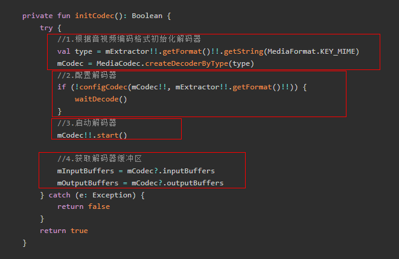

### 3.6 封装基础解码框架_解码器流程之压入数据到输入缓冲

好，我们上面是初始化相关的具体代码。我们现在来看看数据压入输入缓冲的相关代码。

首先是输入缓冲的分配

- 我们创建MediaCodec的时候，系统为MediaCodec在start()时自动分配的一组ByteBuffer，每个buffer通常可以容纳一帧或一段数据，但不一定严格一帧（有时一帧数据会跨buffer，或一个buffer里有多帧）。也就是Buffers缓冲区数组，我们再上面init阶段获取到了其输入缓冲区的引用
  - 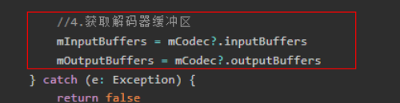
- MediaCodec输入缓冲区是一个Buffers数组，我们申请空缓冲区是从这个Buffers数组中获取一个Buffer。
  - 通过dequeueInputBuffer向MediaCodec申请一个空的输入缓冲区Buffer，这个方法会阻塞最多2000ms，直到有空缓冲区可用，然后返回给我们可用的buffer的索引。
  - 其返回的Index的值表示在mCodec?.inputBuffers的下标，我们可以通过mInputBuffers!![inputBufferIndex]在mInputBuffers数组中取出对应的ByteBuffer。这个ByteBuffer就是你可以写入数据的空间。
  - 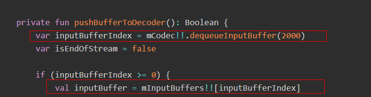

然后是写入数据到输入缓冲

- 具体如下：
  - 用mExtractor从数据源也就是H264数据流中读取一帧（或一段）音视频数据，sampleSize为实际读取的数据字节数。
  - 如果sampleSize<0，说明数据已经读完，那么我们压入一个空buffer，并设置BUFFER_FLAG_END_OF_STREAM标志，同时标记isEndOfStream为true。解码器收到这个标志后，会在输出端返回EOS，整个解码流程结束
  - 否则我们把刚才填充好的数据送进解码器，附带当前帧的时间戳。解码器会异步处理这些数据，解码出YUV帧或PCM帧。
  - 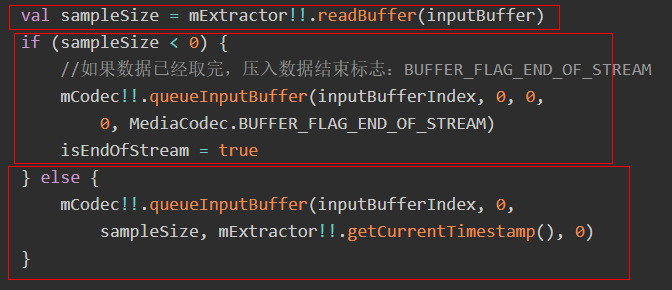

返回是否结束

- 告诉主循环“数据是否已经全部送完”，便于后续流程判断解码是否结束。
  - 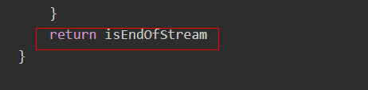

### 3.7 封装基础解码框架_解码器流程之从输出缓冲中获取数据

- 具体如下：
  - 获取Buffers的index，同理上面的。1000：最多等待1000ms（1秒），如果填-1则无限等待
  
  - 不过这里有：mBufferInfo：用于接收输出帧的元数据，也就是说，每次拉取输出缓冲区时，mBufferInfo都被更新，我们可以用他来
  
    - 确定当前帧的数据范围
  
    - 获取当前帧的时间戳（用于同步/渲染）
  
    - 判断帧类型（关键帧、普通帧、流结束等
  
  - 判断index类型：
    - MediaCodec.INFO_OUTPUT_FORMAT_CHANGED：输出格式发生变化（如分辨率、颜色格式等）输出格式发生变化（如分辨率、颜色格式等）
    - MediaCodec.INFO_OUTPUT_BUFFERS_CHANGED：输出缓冲区数组发生变化，需要重新获取mOutputBuffers = mCodec!!.outputBuffers
    - MediaCodec.INFO_TRY_AGAIN_LATER：当前没有可用的输出数据，等会再来，本次不处理，返回-1，主循环下次再试。
    - index >= 0，有可用的解码数据，index为输出缓冲区buffer的下标。返回index，主循环会用这个index去取出解码好的数据（如YUV帧、PCM帧），进行渲染或播放
    
  - 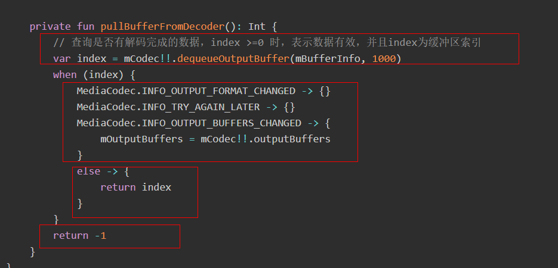

### 3.8 封装基础解码框架_解码器流程之剩余流程

渲染：

- 将解码好的数据（如YUV帧、PCM帧）交给子类处理，通常是把YUV帧渲染到Surface、OpenGL等；把PCM数据写入AudioTrack播放；
  - 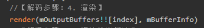

释放输出缓冲区

- 通知MediaCodec“我已经用完这个输出缓冲区了，可以回收再利用”，第二个参数表示是否立即渲染。
  - 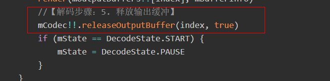

判断解码是否完成

- 看见下面的输入的操作吗？数据取完压入数据结束标志；当你在输入端压入EOS标志后，MediaCodec会在最后一帧输出时也带上这个标志，表示解码流程彻底结束，此时进入FINISH状态，通知监听器“解码完成”。
  - 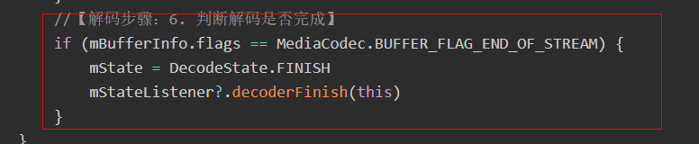
  - 这是当时压入数据到输入缓冲区时的压入数据结束标志的代码。
  - 

然后是release

- 安全释放所有解码相关资源，防止内存泄漏和资源占用
  - 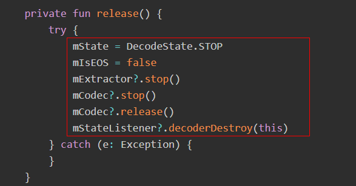

## 04.底层原理

## 05.深度思考

### 5.1 关键问题探究

### 5.2 设计对比

## 06.实践验证

### 6.1 行为验证代码

### 6.2 性能测试

## 07.应用场景

### 7.1 最佳实践

### 7.2 使用禁忌

## 08.总结提炼

### 8.1 核心收获

### 8.2 知识图谱

### 8.3 延伸思考

## 09.参考资料

1. 
2. 
3. 

## 其他介绍

### 01.关于我的博客

- csdn：http://my.csdn.net/qq_35829566

- 掘金：https://juejin.im/user/499639464759898

- github：https://github.com/jjjjjjava

- 邮箱：[934137388@qq.com]

