[toc]

## 前言

> 学习要符合如下的标准化链条：了解概念->探究原理->深入思考->总结提炼->底层实现->延伸应用"

## 01.学习概述

- **学习主题**：
- **知识类型**：
  - [ ] ✅Android/ 
    - [ ] ✅01.基础组件与机制 
      - [ ] ✅四大组件
      - [ ] ✅IPC机制
      - [ ] ✅消息机制
      - [ ] ✅事件分发机制
      - [ ] ✅View与渲染体系（含Window、复杂控件、动画）
      - [ ] ✅存储与数据安全（SharedPreferences/DataStore/Room/Scoped Storage）
    - [ ] ✅02. 架构与工程化
      - [ ] ✅架构模式（MVC/MVP/MVVM/MVI）
      - [ ] ✅依赖注入（Koin/Hilt/Dagger）
      - [ ] ✅路由与模块化（ARouter、Navigation）
      - [ ] ✅Gradle与构建优化
      - [ ] ✅插件化与动态化
      - [ ] ✅插桩与监控框架
    - [ ] ✅03.性能优化与故障诊断
      - [ ] ✅ANR分析与优化
      - [ ] ✅启动耗时优化
      - [ ] ✅内存泄漏监控
      - [ ] ✅监控与诊断工具
    - [ ] ✅04.Jetpack与生态框架
      - [ ] ✅Room
      - [ ] ✅Paging
      - [ ] ✅WorkManager
      - [ ] ✅Compose
    - [ ] ✅05.Framework与系统机制
      - [ ] ✅ActivityManagerService (含ANR触发机制)
      - [ ] ✅Binder机制
  - [ ] ✅音视频开发/
    - [x] ✅01.基础知识
    - [ ] ✅02.OpenGL渲染视频
    - [ ] ✅03.FFmpeg音视频解码
  - [ ] ✅ Java/
    - [ ] ✅01.基础知识
    - [ ] ✅02.集合框架
    - [ ] ✅03.异常处理
    - [ ] ✅04.多线程与并发
    - [ ] ✅06.JVM
  - [ ] ✅ Kotlin/
    - [ ] ✅01.基础语法
    - [ ] ✅02.高阶扩展
    - [ ] ✅03.协程和流
  - [ ] ✅ Flutter/
    - [ ] ✅01.基础基础语法
    - [ ] ✅02.状态管理
    - [ ] ✅03.路由与依赖注入
    - [ ] ✅04.原生通信
  - [ ] ✅ 自我管理/
    - [ ] ✅01.内观
  - [ ] ✅ 项目经验/
    - [ ] ✅01.启动逻辑
    - [ ] ✅02.云值守
    - [ ] ✅03.智控平台
- **学习来源**：
- **重要程度**：⭐⭐⭐⭐⭐
- **学习日期**：2025.
- **记录人**：@panruiqi

### 1.1 学习目标

- 了解概念->探究原理->深入思考->总结提炼->底层实现->延伸应用"

### 1.2 前置知识

- [ ] 

## 02.核心概念

### 2.1 是什么？

如何进行音视频同步

### 2.2 解决什么问题？

### 2.3 基本特性

## 03.原理机制

### 3.1 音视频提取工具类

我们想进行音视频同步。我们要首先理解：音视频资源从哪来的？考量音视频基础，我们知道音视频容器有mp4、rmvb、avi、mkv、mov...等。

考量我们之前已经实现的封装基础解码框架，里面有

- mExtractor，我们来看看哪个地方用到它，或者说作为提取器，它应该有哪些功能？
  - 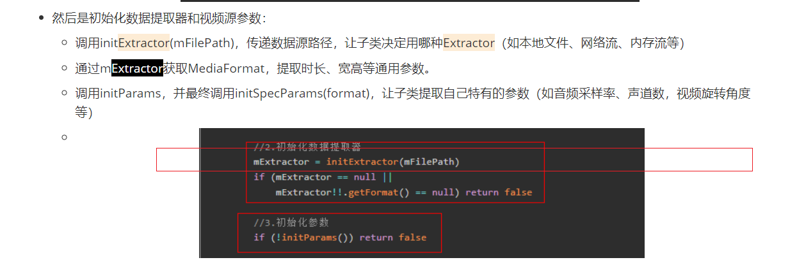
- 我们可以用他将数据压入输入缓冲区中，好不好奇，这个readBuffer操作如何处理的？
  - 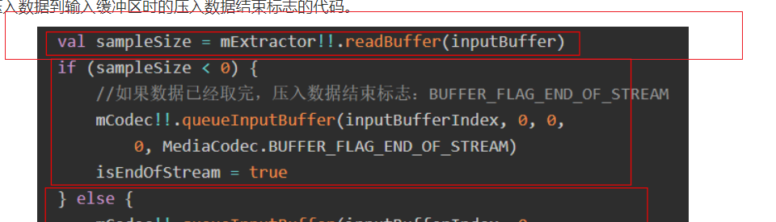

好，其实音视频资源我们传递的只有filepath，具体的解析和加载其实是由Extractor实现的。我们之前给出了IExtractor，但是他只是我们自定义的接口

Android原生自带有一个MediaExtractor，用于音视频数据分离和提取，接来下就基于这个，做一个支持音视频提取的工具类MMExtractor，其使用MediaExtractor：

首先是其初始化操作

- 创建一个MediaExtractor对象，并绑定你的视频/音频文件（本地路径或网络URL），此时MediaExtractor会自动分析文件，识别出里面有多少条轨道（音频、视频、字幕等）。
  - 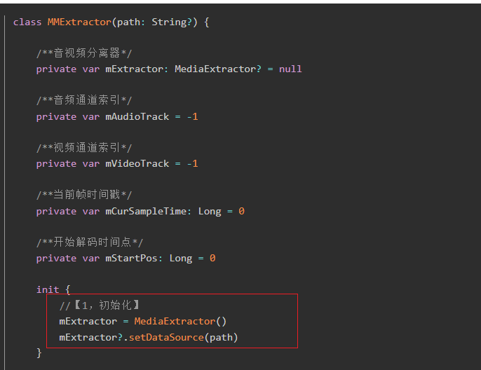

获取音视频格式参数

- getVideoFormat()，遍历所有轨道（track），找到mime类型以"video/"开头的轨道，记录下标，返回该轨道的MediaFormat，里面包含分辨率、编码类型、帧率等信息
- getAudioFormat()，遍历所有轨道，找到mime类型以"audio/"开头的轨道，记录下标，返回该轨道的MediaFormat，里面包含采样率、声道数、编码类型等信息
- 不过我们这里只会找到第一个音频轨道，找到后就 break 退出循环。如果期望有多个音视频轨道，那么首先要遍历所有轨道，把所有mime.startsWith("audio/")的轨道索引都保存下来（比如放到一个List里）。然后用户选择时，切换到对应的音轨索引，重新selectTrack
  - 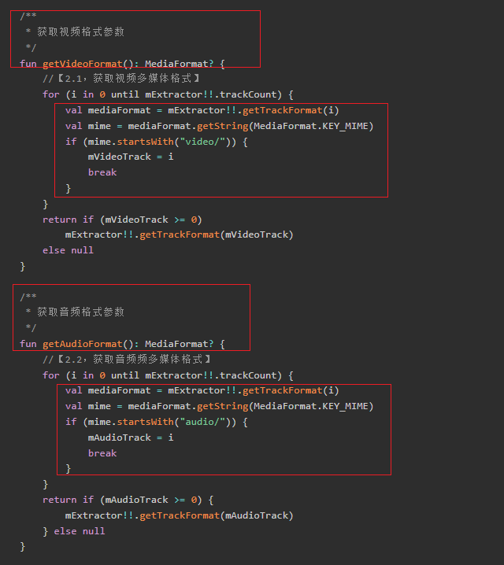

读取数据

- 具体如下：
  - 清空传入的byteBuffer，准备写入新数据
  - 选择当前要读取的轨道（音频或视频）
  - 用mExtractor.readSampleData把一帧（或一段）数据读进byteBuffer，返回实际读取的字节数
  - 如果返回<0，说明数据读完了
  - 记录当前帧的时间戳（微秒），用于同步/渲染
  - advance()让Extractor指针移动到下一帧
  - 

这里还有选择通道

- 告诉Extractor“我要读哪条轨道的数据”（音频或视频），Extractor同一时刻只能选中一条轨道，音视频并行解码时要用两个Extractor实例
  - 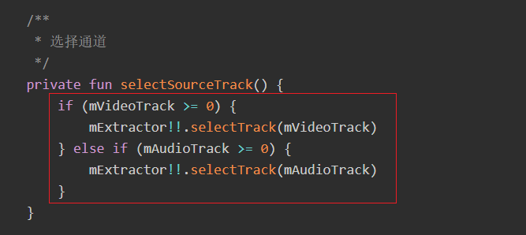

> 好不好奇，我们提到了很多次轨道，什么是音视频的轨道？
>
> - 一个多媒体文件（如 MP4、MKV、MOV、AVI 等）可以包含多条轨道，比如：
>   - 视频轨道（存放视频帧数据，如H264、HEVC等）
>   - 音频轨道（存放音频帧数据，如AAC、MP3等）
>   - 字幕轨道（存放字幕信息，如SRT、ASS等）
>   - 其他轨道（如章节、元数据、歌词等）
> - 轨道包含两个主要部分，一个是存放实际的音视频数据，一个是存放音视频信息，共同组成了一个轨道。
> - 如果你在同一个文件里存放两条完整的视频轨道（比如一条H264、另一条HEVC，内容完全一样），那么文件大小大约等于两条轨道的大小之和，加上一些容器的元数据开销。举例：原本2G的H264视频，加上2G的HEVC视频，文件大约接近4G（略大于4G，因为有容器结构和索引）
> - 多音轨（多国语言配音）和多字幕（多语言字幕）在实际中很常见，因为音频/字幕数据量小，增加几条不会让文件暴涨，多视频轨道很少见，因为视频数据量大，存两条完整视频会让文件体积翻倍。

跳播seek

- 跳到指定时间点附近的关键帧（通常是I帧），返回实际跳到的帧的时间戳。用于实现快进/快退/拖动进度条等功能。注意，只能跳到关键帧，实际跳到的位置可能比你指定的时间早一点。
  - 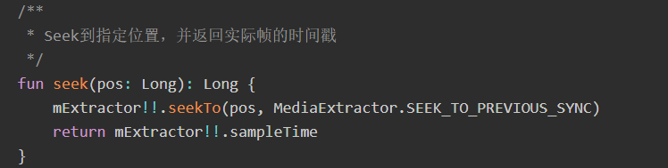

释放资源

- 解码结束后，释放Extractor占用的资源，防止内存泄漏
  - 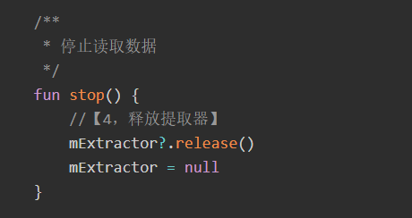

获取当前帧时间戳（getCurrentTimestamp）

- 返回最近一次readBuffer读到的帧的时间戳（微秒），用于音视频同步、渲染等
  - 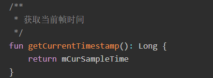

### 3.2 封装 VideoExtractor / AudioExtractor音频和视频提取器

好，我们现在有音视频提取的工具类MMExtractor，也有音视频提取器的接口：IExtractor 。

- 这是他的定义
  - 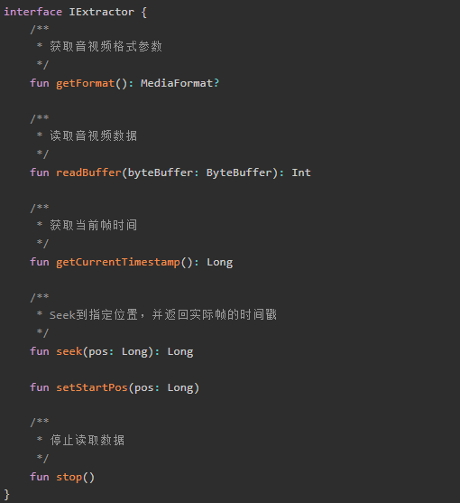

好，我们现在可以创建一个音频提取类和视频提取类，他们实现这个IExtractor接口，此时很简单，使用工具类做一个代理转接就行了。

本质是“代理”或“适配器”模式：内部持有一个 MMExtractor 实例，把 IExtractor 的方法转发给 MMExtractor

- 好，现在是视频提取类，是一个IExtractor，拥有上面的能力，并将任务转接给MMExtractor处理。
  - 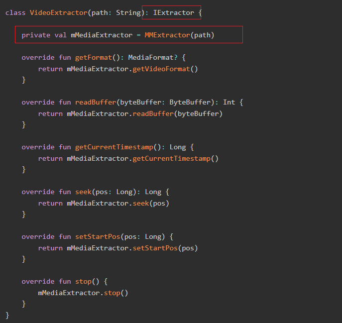

- 然后是音频提取类，一样的处理流程。只不过是getAudioFormat
  - 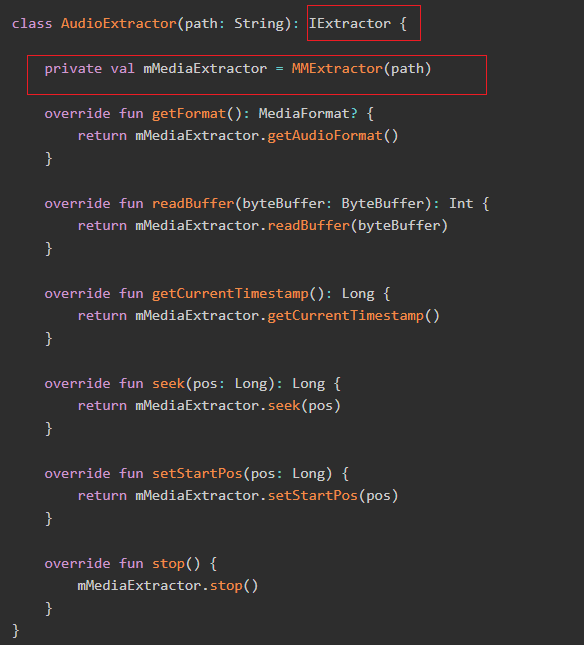

### 3.3 视频播放器

好的，我们有BaseDecoder 封装了解码的通用流程，现在我们需要有一个视频播放器VideoDecoder其 继承自 BaseDecoder，只需关注“视频解码相关的细节”，比如用什么提取器、怎么配置Surface、怎么处理SurfaceView的生命周期。

- check()检查解码器初始化参数是否齐全，要求必须有一个可用的SurfaceView或Surface，否则无法显示视频。
  - 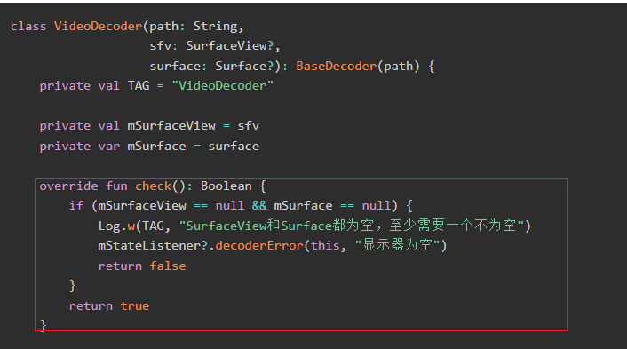

- initExtractor(path: String): IExtractor，返回一个视频数据提取器（VideoExtractor），只负责读取视频轨道的数据。
  - 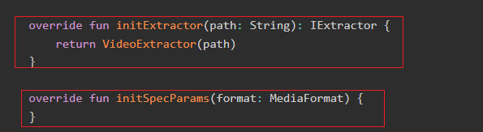
- configCodec(codec: MediaCodec, format: MediaFormat): Boolean，配置解码器，指定解码输出的Surface
  - 如果mSurface已存在（比如OpenGL渲染），直接配置MediaCodec
  - 如果只传了SurfaceView，需要监听其surfaceCreated回调，等SurfaceView真正创建好后再配置MediaCodec
  - 如果Surface还没准备好，返回false，基类会挂起解码线程，等Surface准备好后再唤醒
  - 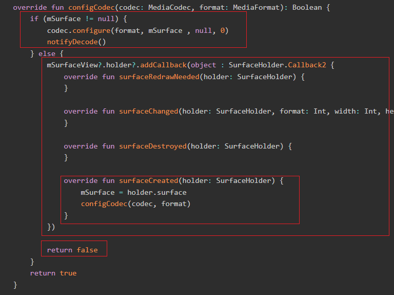
  - 这个位置，如果config失败，会waitDecode
  - 
  - 解码线程进入等待
  - 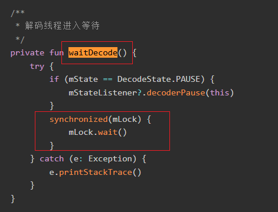
- initRender()，初始化渲染器，这里直接返回true，因为视频渲染交给MediaCodec和Surface处理，不需要额外操作
- render(outputBuffers, bufferInfo),渲染解码后的数据，视频渲染由MediaCodec自动完成，只需在主循环里releaseOutputBuffer(index, true)即可，不需要手动处理
- doneDecode()，解码结束后的清理或通知，这里暂未实现，可根据需要扩展
  - 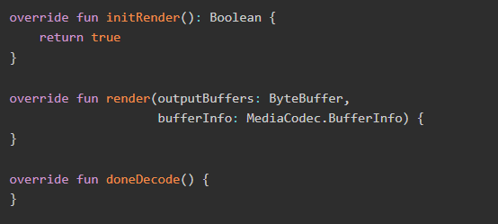

> 注意：这里讲解一下：SurfaceView 和 Surface，以及渲染的自动化
>
> SurfaceView 和 Surface
>
> - SurfaceView
>   - SurfaceView 是 Android 提供的一个特殊的 View，用于高效地显示视频、相机预览、游戏画面等
>   - 它有自己的“绘图表面”（Surface），可以让底层系统或硬件直接在这块区域绘制内容，而不需要经过普通View的绘制流程。
>   - 适合用来做播放器、相机预览、游戏等高性能场景
> - Surface
>   - Surface 是 Android 底层的一个“画布”或“帧缓冲区”对象，代表一块可以被硬件或系统直接写入像素的区域，其是 MediaCodec、MediaPlayer、OpenGL 等底层渲染的“目标”
>
> MediaCodec 的自动渲染原理
>
> - 传统渲染流程（手动）：你解码出一帧 YUV 数据，需要自己写代码把 YUV 转成 RGB，再画到 Canvas 或 ImageView 上，非常麻烦且效率低
> - MediaCodec 自动渲染：
>   - 你在 configure() 时，把 Surface 传给 MediaCodec。
>   - 解码器解码出一帧 YUV 数据后，会自动把这帧数据渲染到 Surface 上。
>   - 你只需要在主循环里调用 releaseOutputBuffer(index, true)释放这个输出，MediaCodec 就会自动显示这一帧。
>   - 你不需要自己处理 YUV 转 RGB、绘制等繁琐操作
> - 对应下面
>   - 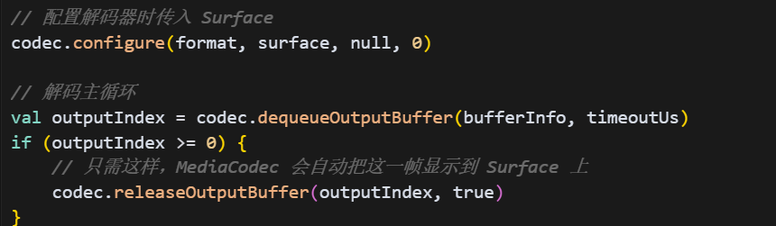

### 3.4 音频播放器

好的，我们有BaseDecoder 封装了解码的通用流程，现在我们需要有一个视频播放器VideoDecoder其 继承自 BaseDecoder，只需关注“音频解码相关的细节”。

- check检查，initExtractor返回一个音频读取器，负责读取音轨资源
  - 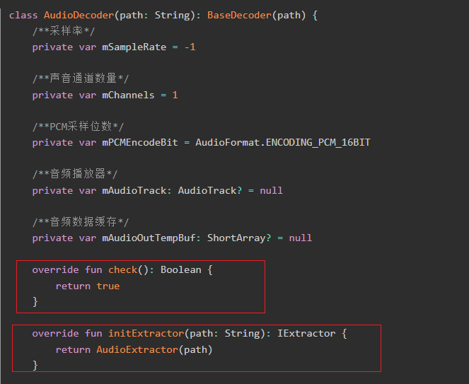
- initSpecParams，通过MediaFormat 获取音频的采样率、通道数、采样位数（PCM编码位宽），这些参数决定了后续 AudioTrack中 的配置。
  - 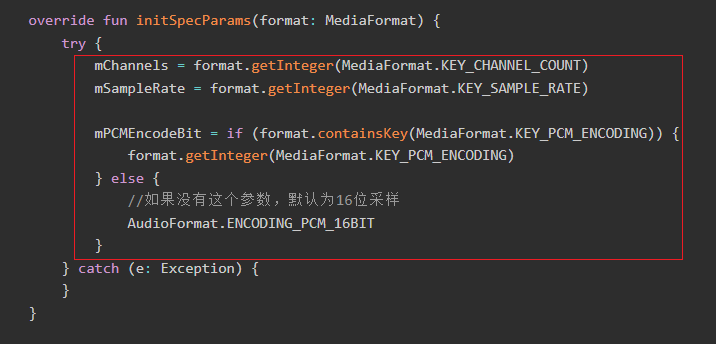
- configure配置解码器，区别于视频：音频解码不需要 Surface，直接传 null
  - 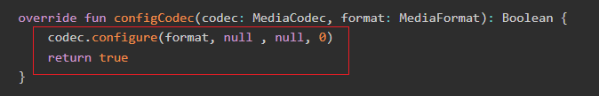
- initRender，初始化音频渲染器（AudioTrack）
  - 需要根据采样率、通道数、采样位数，计算最小缓冲区大小
  - 将ByteBuffer 类型大小转换为ShortArray类型大小，因为 AudioTrack 常用 16bit PCM
  - 创建 AudioTrack 实例，并调用 play() 启动播放
  - 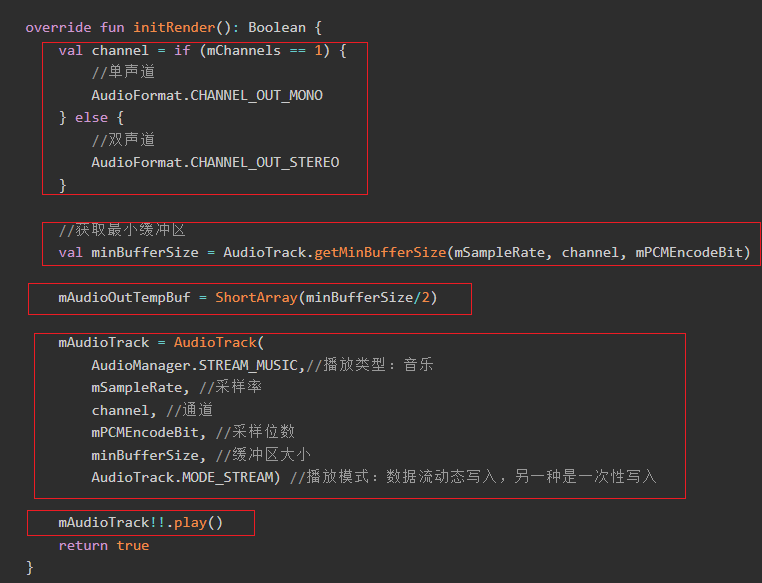
- render渲染音频数据
  - 每次解码出一帧 PCM 数据（在 render() 方法里）
  - 需要把 ByteBuffer 转成 ShortArray（因为 AudioTrack 常用 16bit PCM）。
  - 调用 mAudioTrack.write() 把数据写入 AudioTrack，系统会自动播放
  - 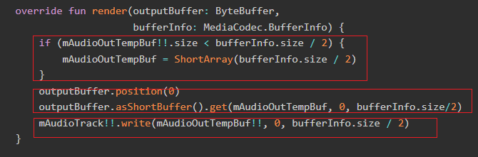
- 手动释放资源：解码结束后，停止并释放 AudioTrack，防止内存泄漏
  - 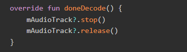

> 有点好奇，为什么需要把 ByteBuffer 转成 ShortArray
>
> PCM 16bit：音频解码后最常见的格式是16位有符号整型（short），也就是每个采样点用2个字节（16位）表示
>
> ByteBuffer 里的数据是“字节流”，比如 [0x01, 0x02, 0x03, 0x04, ...]。
>
> ShortArray 是“采样点流”，每两个字节合成一个 short（16bit），比如 [0x0201, 0x0403, ...]（注意字节序）。
>
> 转换过程就是把 ByteBuffer 里的每两个字节，合成一个 short，放到 ShortArray 里，这样就符合我们期望的PCM 16bit

### 3.5 音视频播放

以上，基本实现了音视频的播放流程，如无意外，在页面上调用以上音视频解码器，就可以实现播放了。

简单看下页面和相关调用。

main_activity.xml

- 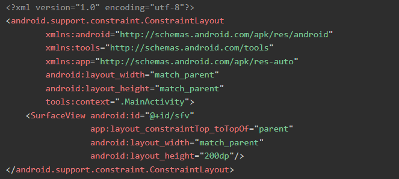

MainActivity.kt

- 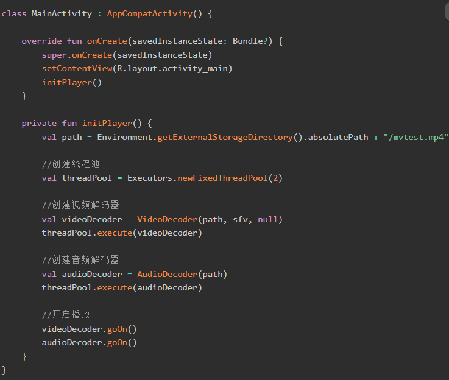

至此，基本上实现音视频的解码和播放。但是如果你真正把代码跑起来的话，你会发现：**视频和音频为什么不同步啊，视频就像倍速播放一样，一下就播完了，但是音频却很正常。**

这就要引出下一个不可避免的问题了，那就是音视频同步。

### 3.6 音视频同步

好，现在终于来到了我们这一节最终的内容了

我们得理解，为什么音视频不同步？

- 由于视频和音频是两个独立的任务在运行，视频和音频的解码速度也不一样，解码出来的数据也不一定马上就可以显示出来。

因此我们需要时间戳去同步他们的渲染时间

- 解码有两个重要的时间参数：PTS（显示时间戳）和DTS（解码时间戳），分别用于表示该帧应该被“显示/播放”的时间点和该帧应该被“解码”的时间点，有DTS是因为有些视频编码（如H.264）有B帧，B帧依赖于前后的I/P帧，所以解码顺序和显示顺序可能不同。
- 所以，我们这里应该使用的是PTS
- 播放器中一般存在三个时间，音频的时间，视频的时间，还有另外一个就是系统时间。这样可以用来实现同步的时间源就有三个：
  - 视频时间戳
  - 音频时间戳
  - 外部时间戳

- 视频PTS：通常情况下，由于人类对声音比较敏感，并且视频解码的PTS通常不是连续，而音频的PTS是比较连续的，如果以视频为同步信号源的话，基本上声音都会出现异常，而画面的播放也会像倍速播放一样。
- 音频PTS：那么剩下的两个选择中，以音频的PTS作为同步源，让画面适配音频是比较不错的一种选择。但是这里不采用，而是使用系统时间作为同步信号源。因为如果以音频PTS作为同步源的话，需要比较复杂的同步机制，音频和视频两者之间也有比较多的耦合
- 系统时间：系统时间作为统一信号源则非常适合，音视频彼此独立互不干扰，同时又可以保证基本一致。

好，我们怎么基于系统时间实现音视频同步呢？

- 我们的核心目标是：让音频和视频“对齐”地播放，画面和声音不会错位。原理是：每一帧（无论音频还是视频）都有一个时间戳（PTS），你要让它在“正确的时间”被播放出来。

> 好，我们怎么理解这里的视频帧和音频帧？
>
> 视频帧
>
> - 假设视频帧率是60fps，每帧间隔16.67ms
> - 每一帧的PTS就是：
>   - 第0帧：PTS = 0ms
>   - 第1帧：PTS = 16.67ms
>   - 第2帧：PTS = 33.33ms
> - 播放器只要在系统时间到达对应PTS时，把这一帧渲染出来即可
>
> 音频帧
>
> - 假设音频采样率是44.1kHz，AAC编码每帧1024采样点，这表示AAC会把1024采样点 × 16bit = 2048字节编辑为一个AAC帧，如果是双声道还要 * 2.
> - 每一帧音频的时长 = 1024 / 44100 ≈ 23.22ms
> - 音频帧的PTS也是递增的：
>   - 第0帧：PTS = 0ms
>   - 第1帧：PTS = 23.22ms
>   - 第2帧：PTS = 46.44ms
> - 我们不用关心视频的播放，对于音频，播放器只要在系统时间到达音频帧的PTS时，把这一帧送到音频设备即可。
>
> 这样他们就分为彼此异步的两个部分，彼此互不影响。

我们的同步分为两个部分，一个是音视频的同步，基于比对实现。另一个是暂停播放后的同步，基于矫正实现

好啊，先看看比对

- 不断记录系统的流逝时间，比对PTS，没到就睡眠，到了就渲染
  - 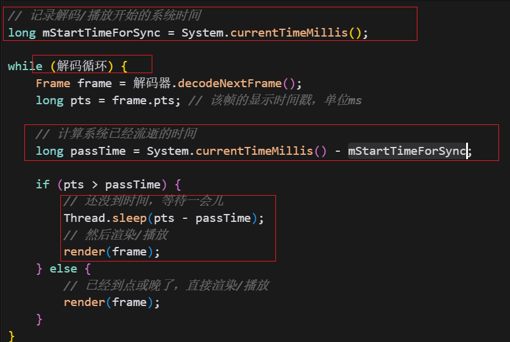

但是他存在一个问题呢，考虑到用户有暂停播放器的操作，当你暂停播放器时，系统时间还在走，但已经解析出来的帧的PTS是已经固定的，不会往前走。此时System.currentTimeMillis() - mStartTimeForSync算出系统流逝时间在不断走，会远远超过PTS。

所以我们期望：暂停期间的时间不应该算进“已流逝时间”，要把这段时间“扣掉”。

因此我们需要矫正

- 校准同步基准点，记录暂停和恢复中间的流逝时间，加到同步基准点时间上。
  - 
- 当然，还有另一种方式，用恢复播放时的系统时间，减去当前正要播放的帧的PTS，得出的值就是mStartTimeForSync。其实就是把记录暂停的时间点替换为了帧的PTS，而非使用System.currentTimeMillis()

好，我们来看代码

- 在不考虑暂停、恢复的情况下，什么时候进行时间同步呢？答案是：数据解码出来以后，渲染之前。

- 解码器进入解码状态以后，来到【解码步骤：3. 将解码好的数据从缓冲区拉取出来】，这时如果数据是有效的，那么进入比对。
  - 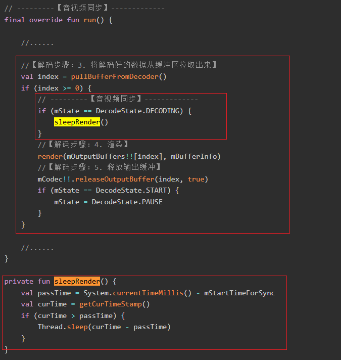

- 那么矫正的代码呢？
  - 这里采用第二种，把记录暂停的时间点替换为了帧的PTS

  - 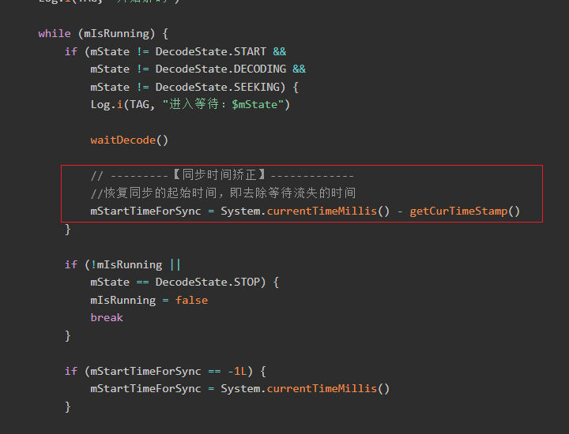

至此，从解码到播放，再到音视频同步，一个简单的播放器就做完了。

## 04.底层原理

## 05.深度思考

### 5.1 关键问题探究

### 5.2 设计对比

## 06.实践验证

### 6.1 行为验证代码

### 6.2 性能测试

## 07.应用场景

### 7.1 最佳实践

### 7.2 使用禁忌

## 08.总结提炼

### 8.1 核心收获

### 8.2 知识图谱

### 8.3 延伸思考

## 09.参考资料

1. 
2. 
3. 

## 其他介绍

### 01.关于我的博客

- csdn：http://my.csdn.net/qq_35829566

- 掘金：https://juejin.im/user/499639464759898

- github：https://github.com/jjjjjjava

- 邮箱：[934137388@qq.com]

