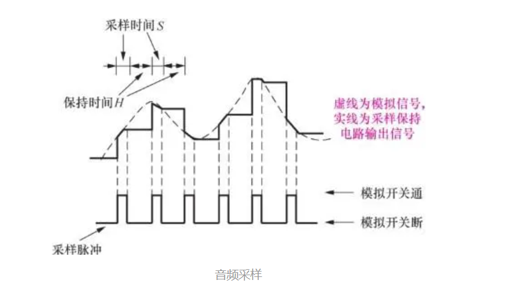
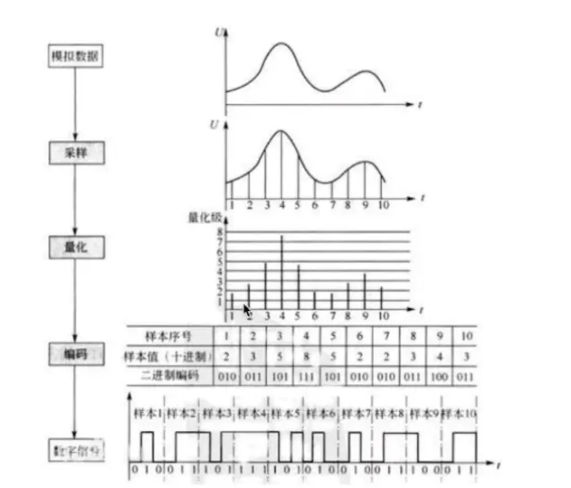
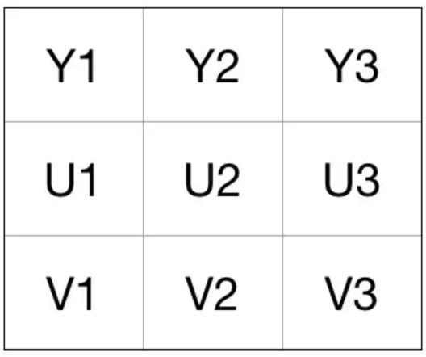
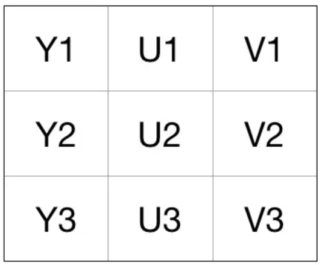
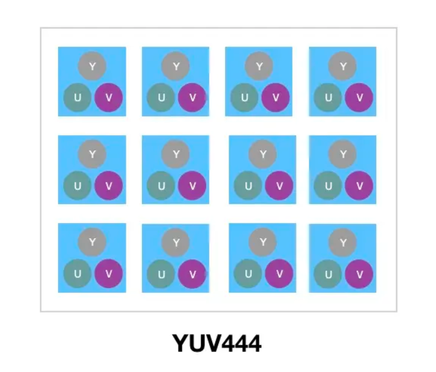
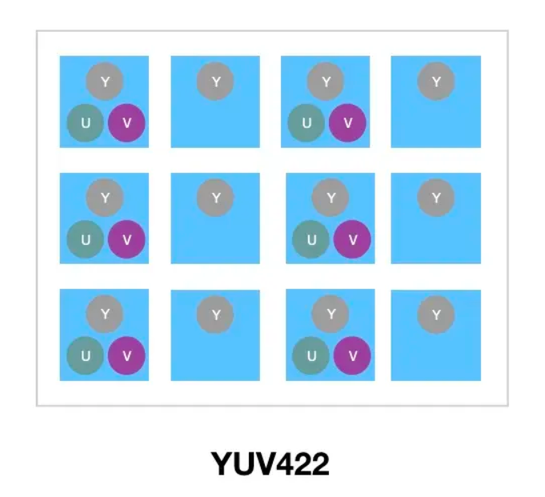
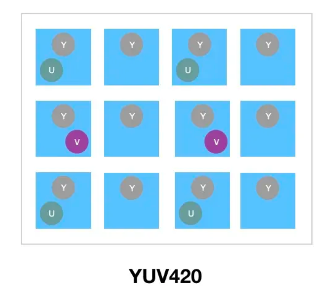
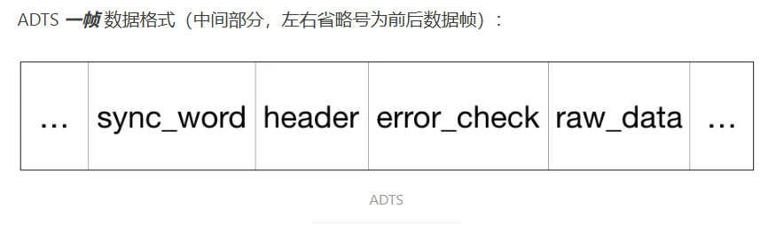

[toc]

## 前言

> 学习要符合如下的标准化链条：了解概念->探究原理->深入思考->总结提炼->底层实现->延伸应用"

## 01.学习概述

- **学习主题**：
- **知识类型**：
  - [ ] ✅Android/ 
    - [ ] ✅01.基础组件与机制 
      - [ ] ✅四大组件
      - [ ] ✅IPC机制
      - [ ] ✅消息机制
      - [ ] ✅事件分发机制
      - [ ] ✅View与渲染体系（含Window、复杂控件、动画）
      - [ ] ✅存储与数据安全（SharedPreferences/DataStore/Room/Scoped Storage）
    - [ ] ✅02. 架构与工程化
      - [ ] ✅架构模式（MVC/MVP/MVVM/MVI）
      - [ ] ✅依赖注入（Koin/Hilt/Dagger）
      - [ ] ✅路由与模块化（ARouter、Navigation）
      - [ ] ✅Gradle与构建优化
      - [ ] ✅插件化与动态化
      - [ ] ✅插桩与监控框架
    - [ ] ✅03.性能优化与故障诊断
      - [ ] ✅ANR分析与优化
      - [ ] ✅启动耗时优化
      - [ ] ✅内存泄漏监控
      - [ ] ✅监控与诊断工具
    - [ ] ✅04.Jetpack与生态框架
      - [ ] ✅Room
      - [ ] ✅Paging
      - [ ] ✅WorkManager
      - [ ] ✅Compose
    - [ ] ✅05.Framework与系统机制
      - [ ] ✅ActivityManagerService (含ANR触发机制)
      - [ ] ✅Binder机制
  - [ ] ✅音视频开发/
    - [x] ✅01.基础知识
    - [ ] ✅02.OpenGL渲染视频
    - [ ] ✅03.FFmpeg音视频解码
  - [ ] ✅ Java/
    - [ ] ✅01.基础知识
    - [ ] ✅02.集合框架
    - [ ] ✅03.异常处理
    - [ ] ✅04.多线程与并发
    - [ ] ✅06.JVM
  - [ ] ✅ Kotlin/
    - [ ] ✅01.基础语法
    - [ ] ✅02.高阶扩展
    - [ ] ✅03.协程和流
  - [ ] ✅ Flutter/
    - [ ] ✅01.基础基础语法
    - [ ] ✅02.状态管理
    - [ ] ✅03.路由与依赖注入
    - [ ] ✅04.原生通信
  - [ ] ✅ 自我管理/
    - [ ] ✅01.内观
  - [ ] ✅ 项目经验/
    - [ ] ✅01.启动逻辑
    - [ ] ✅02.云值守
    - [ ] ✅03.智控平台
- **学习来源**：
- **重要程度**：⭐⭐⭐⭐⭐
- **学习日期**：2025.
- **记录人**：@panruiqi

### 1.1 学习目标

- 了解概念->探究原理->深入思考->总结提炼->底层实现->延伸应用"

### 1.2 前置知识

- [ ] 

## 02.核心概念

### 2.1 是什么？

音视频基础知识介绍


### 2.2 解决什么问题？


### 2.3 基本特性


## 03.概念介绍

### 3.1 视频是什么？

动画书

- 本来是一本静态的小人书，通过翻动以后，就会变成一个有趣的小动画，如果画面够多，翻动速度够快的话，这其实就是一个小视频。
  - 

- 而视频的原理正是如此，由于人类眼睛的特殊结构，画面快速切换时，画面会有残留，感觉起来就是连贯的动作。所以，**视频就是由一系列图片构成的**。

视频帧

- 帧，是视频的一个基本概念，表示一张画面，如上面的翻页动画书中的一页，就是一帧。一个视频就是由许许多多帧组成的。
- 注意：视频有I帧，P帧，B帧的区别，这些是视频压缩的算法，我们在后面视频编码的时候会说，他可以很大程度提高视频的编码效率。

帧率

- 帧率，即单位时间内帧的数量，单位为：帧/秒 或fps（frames per second）。如动画书中，一秒内包含多少张图片，图片越多，画面越顺滑，过渡越自然。
- 帧率的一般以下几个典型值：
  - 24/25 fps：1秒 24/25 帧，一般的电影帧率。
  - 30/60 fps：1秒 30/60 帧，游戏的帧率，30帧可以接受，60帧会感觉更加流畅逼真。
  - 一般来说，60FPS已经够用了，所以特别高的帧率在视频中没有太大的意义。

色彩空间

- 我们看到的画面就是色彩，红，蓝等等诸多的色彩，那么我们该怎么描述我们的色彩呢？红色，纯红？还是0xFF0000？其实，可以通过色彩空间来描述色彩空间分为两种：RGB和YUV

- RGB：

  - R就是red，G就是green，B就是Blue。红绿蓝三原色。
  - 如果我们把每个分量用0~255的整数表示（8位），也就是0x00~0xFF的十六进制，那么我们可以如下表示色彩
  - 纯红，就是0xFF0000。R=255, G=0, B=0；纯黑就是：0x000000，R=0, G=0, B=0；

- YUV

  - 这个要着重讲，一种亮度与色度分离的色彩格式。现在主流的视频采用的是YUV的色彩搭配而非RGB，因为其数据存储效率比较高。而图片则采用RGB。

  - 早期的电视都是黑白的，即只有亮度值，即Y。有了彩色电视以后，加入了UV两种色度，形成现在的YUV，也叫YCbCr。

    - Y（Luminance，亮度）：表示明暗（灰度），人眼对亮度最敏感。

    - U/V（Chrominance，色度）：表示颜色的细节（U偏蓝，V偏红）。

  > 我们该怎么理解：YUV显示颜色呢？
  >
  > - RGB就像你用三种颜料（红绿蓝）直接调出所有颜色。
  > - YUV就像你先画出黑白素描（亮度Y），再用两种淡淡的色粉（U/V）给画面上色。

  - 为什么YUV存储效率高？
    - 人眼对亮度敏感，对色度不敏感，因此减少部分UV的数据量，人眼却无法感知出来，这样可以通过压缩UV的分辨率，在不影响观感的前提下，减小视频的体积。
    - 比如：假如一张图片是100x100像素，RGB需要存3个通道（红绿蓝），总共3万字节。按照YUV420规则，YUV可以只用1万字节存亮度，U/V各用2500字节（分辨率减半），总共1.5万字节，节省了一半空间。

  > ##### RGB和YUV的换算
  >
  > ```
  > Y = 0.299R ＋ 0.587G ＋ 0.114B 
  > U = －0.147R － 0.289G ＋ 0.436B
  > V = 0.615R － 0.515G － 0.100B
  > ——————————————————
  > R = Y ＋ 1.14V
  > G = Y － 0.39U － 0.58V
  > B = Y ＋ 2.03U
  > ```

### 3.2 音频是什么？

音频

- 音频就是我们听到的声音，物理上是空气的振动（声波）。声波在自然界中是连续变化的（模拟信号），比如你说话时，声带振动产生的波形是平滑的、没有断点的

我们该怎么用计算机语言来描述音频呢？

- 难点：计算机只能处理间断的数字信号（0和1），不能直接处理连续的模拟信号。我们该怎么用间断的数字信号来表示模拟信号呢？

- 很简单， PCM（脉冲编码调制），也就是音频数字化方法。他的关键是：定时采样+量化+编码

- 定时采样

  - 把连续的声音波形，每隔一小段时间测量一次振幅（声音的高低）。

  - 这个“每秒测量多少次”叫采样率（如44100Hz，表示每秒采样44100次）。采样率要大于原声波频率的2倍，人耳能听到的最高频率为20kHz，所以为了满足人耳的听觉要求，采样率至少为40kHz，通常为44.1kHz，更高的通常为48kHz。

  - 采样率越高，声音还原得越真实，但数据量也越大

- 量化

  - 每次采样得到的振幅是一个连续的模拟值，但计算机只能存有限的数字。

  - 所以要把振幅“分成若干级”，比如16位量化就是把振幅分成65536级。

  - 这样每个采样点的振幅就用一个整数来表示

- 编码

  - 把每个采样点的量化值用二进制编码（比如16位、8位等）。

  - 这样一串二进制数就代表了这段声音

- 如果采的足够近，感觉就很像微积分中的用无数小矩形近似曲线下的面积了。
  - 

详细说明

- 上面提到：把每个采样点的量化值用二进制编码（比如16位、8位等）。其实就是用一个固定的位数来记录这些振幅值。

  - | 位数 | 最小值      | 最大值     |
    | ---- | ----------- | ---------- |
    | 8    | 0           | 255        |
    | 16   | -32768      | 32767      |
    | 32   | -2147483648 | 2147483647 |

  - **位数越多，记录的值越准确，还原度越高。**

- 最后就是编码了。由于数字信号是由0，1组成的，因此，需要将幅度值转换为一系列0和1进行存储，也就是编码，最后得到的数据就是数字信号：一串0和1组成的数据。

- 整个过程如下：

  - 

- 声道数

  - 声道数，是指支持能**不同发声**（注意是不同声音）的音响的个数。
  - 单声道：1个声道
  - 双声道：2个声道
  - 立体声道：默认为2个声道
  - 立体声道（4声道）：4个声道

- 码率：码率，是指一个数据流中每秒钟能通过的信息量，单位bps（bit per second），码率 = 采样率 * 采样位数 * 声道数

### 3.3 为什么要编码？

这里不要和上面的编码产生误解，上面的编码是指将量化的数据用计算机二进制编码描绘出来。而这里是指：压缩编码。

我们知道，在计算机的世界中，一切都是0和1组成的，音频和视频数据也不例外。由于音视频的数据量庞大，如果按照裸流数据存储的话，那将需要耗费非常大的存储空间，也不利于传送。而音视频中，其实包含了大量0和1的重复数据，因此可以通过一定的算法来压缩这些0和1的数据

特别在视频中，由于画面是逐渐过渡的，因此整个视频中，包含了大量画面/像素的重复，这正好提供了非常大的压缩空间。

因此，编码可以大大减小音视频数据的大小，让音视频更容易存储和传送。

### 3.4 视频编码

我们先来看看视频的编码

视频编码有哪些格式？也就是说有哪些算法？

- 视频编码格式有很多，比如H26x系列和MPEG系列的编码，其中，H26x（1/2/3/4/5）系列由ITU（International Telecommunication Union）国际电传视讯联盟主导
- MPEG（1/2/3/4）系列由MPEG（Moving Picture Experts Group, ISO旗下的组织）主导。
- 当然，他们也有联合制定的编码标准，那就是现在主流的编码格式H264，当然还有下一代更先进的压缩编码标准H265。

好，我们先来了看看H264编码

- H264是目前最主流的视频编码标准，所以我们后续的文章中主要以该编码格式为基准。

首先要理解H264中的视频帧

- 我们上面有说到，视频帧分为I帧，P帧，B帧？视频帧在H264中，三种类型的帧数据分别为
  - **I帧**（Intra Frame，完整帧）：I帧是一个完整的图片，不依赖其他帧，单独拿出来就能还原出一张图片
  - **P帧**（Predicted Frame，前向预测帧）：P帧只保存和前面I帧或P帧的“差异”，不能单独还原，必须结合前面的帧一起解码。这样可以大大减少数据量
  - **B帧（Bidirectional Predicted Frame，双向预测帧）**：B帧相对于P帧更加压缩，其保存和前后两页都不同的地方，其他地方都参考前后两页。其压缩率最高，但解码时需要前后帧都在。

- 好，理解完I帧，P帧，B帧的概念。我们来接着看下面的概念

  - GOP（Group of Pictures，图像组）：

    - GOP就是一组连续的视频帧，通常以一个I帧开始，后面跟若干P帧/B帧。
    - 例如：I P B B P B B I ...，每个I帧到下一个I帧之间就是一个GOP。
    - GOP的作用：便于压缩和管理，播放器seek（快进/快退）时通常跳到GOP的起始I帧

  - IDR（Instantaneous Decoder Refresh， 关键帧）：他是一种特殊的I帧。当解码器遇到IDR帧时，会清空之前的参考帧，重新开始解码，防止前面帧出错影响后续帧，他通常是GOP中的首个I帧

    - 所有IDR帧都是I帧，但不是所有I帧都是IDR帧
    - I帧：完整帧，可以独立解码。

    - IDR帧：关键的I帧，解码器遇到它会“重置”，保证后续解码不受前面错误影响

- 好了，我们补充说明了帧的概念，现在要看看下面的
  - DTS（Decoding Time Stamp，解码时间戳）：表示“这一帧什么时候送进解码器解码”。主要用于解码顺序。
  - PTS（Presentation Time Stamp，显示时间戳）：表示“这一帧什么时候显示在屏幕上”。主要用于播放顺序。
  - 为什么解码顺序和显示顺序不一样？这是因为B帧的特殊性，B帧需要参考前后帧。例如：帧的显示顺序是I B P，但解码顺序必须是I P B（先解码I和P，B才能解码）。

好，我们讲了帧的基础概念，接着是H264的帧的色彩空间

- H264采用的是YUV色彩空间

- YUV有两种存储方式：

  - Planar（平面存储）：所有Y分量集中存储，接着是所有U，再是所有V。结构类似于：YYYYYYYYY...UUUUUU...VVVVVV...

    - 

  - Packed（打包存储）：每个像素的Y、U、V交错存储，结构类似于： YUVYUVYUV...

    - 

  - 现在用的较多的存储方式是Planar，这是因为下面的原因

    - 便于压缩和处理：Y、U、V分量分开，方便做分辨率降采样、压缩、硬件加速。

    - 主流视频格式（如H264、VP8/9、HEVC）都用Planar。

- 上面说过，由于人眼对色度敏感度低，所以可以通过省略一些色度信息，即亮度共用一些色度信息，进而节省存储空间。因此，我们可以压缩UV的分辨率，基于不同的UV压缩方案，planar又区分了以下几种格式： YUV444、 YUV422、YUV420

  - YUV 4:4:4采样，每一个Y对应一组UV分量。
    - 
  - YUV 4:2:2采样，每两个Y共用一组UV分量。
    - 
  - YUV 4:2:0采样，每四个Y共用一组UV分量。
    - 
  - 其中，**最常用的就是YUV420**。我们上面有说到存储方式：Planar，YUV420采用的就是Planar，但是他有以下两种变种存储方式
    - YUV420P（三平面，Planar）：Y分量一块，U分量一块，V分量一块。数据组成为YYYYYYYYUUVV（如I420）或YYYYYYYYVVUU（如YV12）。
    - YUV420SP（两平面，Semi-Planar）：Y分量一块，UV交错一块。分为两种类型YYYYYYYYUVUV（如NV12）或YYYYYYYYVUVU（如NV21）
    - FFmpeg解码输出：通常是YUV420P（I420），Android摄像头采集：通常输出NV21（YUV420SP）。
  - 没啥意思，Planar和Packed的区别就是Y是否要和UV交叉存储，这里的Planar变种存储就是在Y不和UV交叉存储的前提下，U和V是否要交叉存储，对视频内容本身来说，UV交叉存储和分开存储没有本质区别，只是内存排布不同。

然后我们来看看H264的压缩算法，其分为两个部分。

- 一个是帧间压缩，作用在多帧之间（P帧、B帧），也就是我们的I帧，B帧，P帧。
- 另一个是帧内压缩，作用于单独一帧，比如我们的I帧，把一帧分成很多小块，如果一大片都是白色，预测时就能用“上一行/左边的像素”来表示，剩下的只需存“变化很小的残差”。比如：其如果显示的是绝大多数都是白色的，这些白色的色彩块就可以用一个像素来表示。

### 3.5 音频编码

原始PCM音频数据体积很大，比如CD音质的1分钟音频就要10MB左右，因此也需要对其进行压缩编码。

- 和视频编码一样，音频也有许多的编码格式，如：WAV、MP3、WMA、APE、FLAC等等，当然还有AAC，AAC（Advanced Audio Coding）是MP3的升级版，音质更好，压缩率更高。被广泛用于MP4、HLS、流媒体、移动设备等场景

AAC的两种封装格式：ADIF和ADTS

- ADIF（Audio Data Interchange Format）
  - 特征：只有一个统一的头部（header），后面是连续的音频数据。结构：header + raw_data，他适合存储在文件中（如磁盘文件），必须从头开始解码，不能中途插入。
-  ADTS（Audio Data Transport Stream）
  - 特征：每一帧都有自己的头部（header），可以在任意位置开始解码，适合流式传输（如网络、广播）。结构：ADTS header + frame data][ADTS header + frame data]..
  - 因为其有多个头部，导致其同步性好，丢包/seek时容易恢复，因此广泛适用于流媒体、实时传输、HLS、RTMP等场景，主流AAC流都是ADTS格式。
  - 

### 3.6 音视频容器

细心的读者可能已经发现，前面我们介绍的各种音视频的编码格式，没有一种是我们平时使用到的视频格式，比如：mp4、rmvb、avi、mkv、mov...

没错，这些我们熟悉的视频格式，其实是包裹了音视频编码数据的容器，用来把以特定编码标准编码的视频流和音频流混在一起，成为一个文件。

例如：mp4支持H264、H265等视频编码和AAC、MP3等音频编码。

### 3.7 硬解码和软解码

硬解和软解的区别

- 我们在一些播放器中会看到，有硬解码和软解码两种播放形式给我们选择，但是我们大部分时候并不能感觉出他们的区别，对于普通用户来说，只要能播放就行了。
- 那么他们的底层到底有什么区别？
  - 在手机或者PC上，都会有CPU、GPU或者解码器等硬件。通常，我们的计算都是在CPU上进行的，也就是我们软件的执行芯片，而GPU主要负责画面的显示（是一种硬件加速）。当然，除了GPU和CPU外，还有专门的硬件芯片，如手机SoC里的Video Decoder
  - 所谓软解码，就是指利用CPU的计算能力来解码，通常如果CPU的能力不是很强的时候，一则解码速度会比较慢，二则手机可能出现发热现象。但是，由于使用统一的算法，兼容性会很好
  - 硬解码，指的是利用手机上专门的解码芯片来加速解码。通常硬解码的解码速度会快很多，但是由于硬解码由各个厂家实现，质量参差不齐，非常容易出现兼容性问题

Android平台上的硬解码

- MediaCodec 是Android 4.1(api 16)版本引入的编解码接口，是所有想在Android上开发音视频的开发人员绕不开的坑
- 硬解码的坑：
  - 不同手机厂商实现不一致，兼容性问题多。
  - 某些机型/系统版本的硬解有bug。
  - 需要做软解/硬解自动切换，保证播放体验。

相对于FFmpeg，Android原生硬解码还是相对容易入门一些，所以接下来，我将会从MediaCodec入手，讲解如何实现视频的编解码，以及引入OpenGL实现对视频的编辑，最后才引入FFmpeg来实现软解，算是一个比较常规的音视频开发入门流程吧

## 04.底层原理


## 05.深度思考

### 5.1 关键问题探究


### 5.2 设计对比


## 06.实践验证

### 6.1 行为验证代码


### 6.2 性能测试


## 07.应用场景

### 7.1 最佳实践


### 7.2 使用禁忌


## 08.总结提炼

### 8.1 核心收获


### 8.2 知识图谱


### 8.3 延伸思考


## 09.参考资料

1. [【Android 音视频开发打怪升级：音视频硬解码篇】一、音视频基础知识](https://www.jianshu.com/p/1749d2d43ecb)
2. []()
3. []()

## 其他介绍

### 01.关于我的博客

- csdn：http://my.csdn.net/qq_35829566

- 掘金：https://juejin.im/user/499639464759898

- github：https://github.com/jjjjjjava

- 邮箱：[934137388@qq.com]

