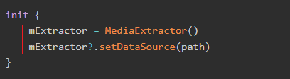
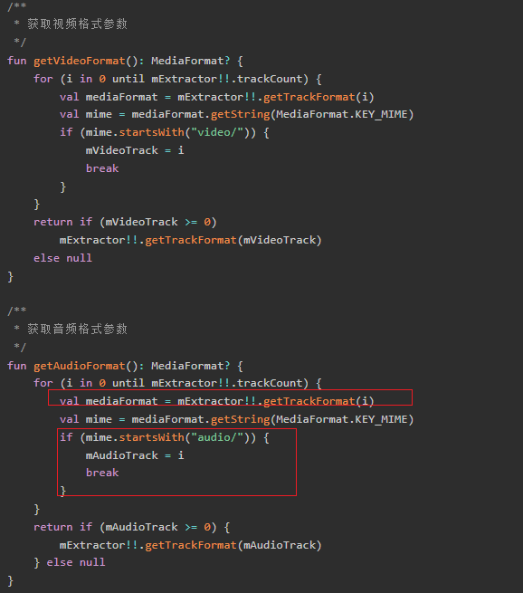
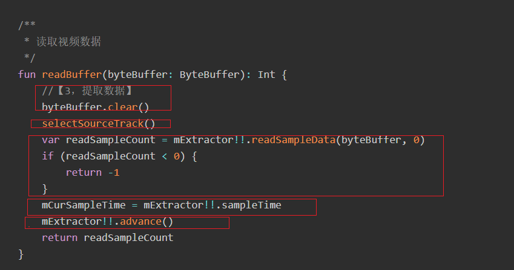
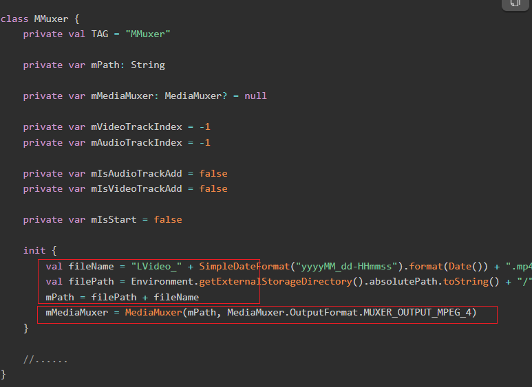
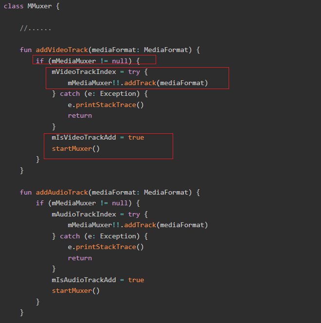
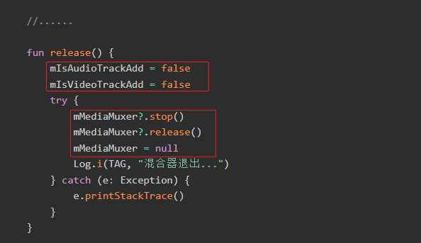
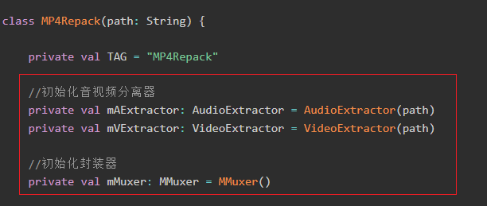
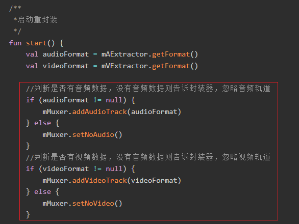
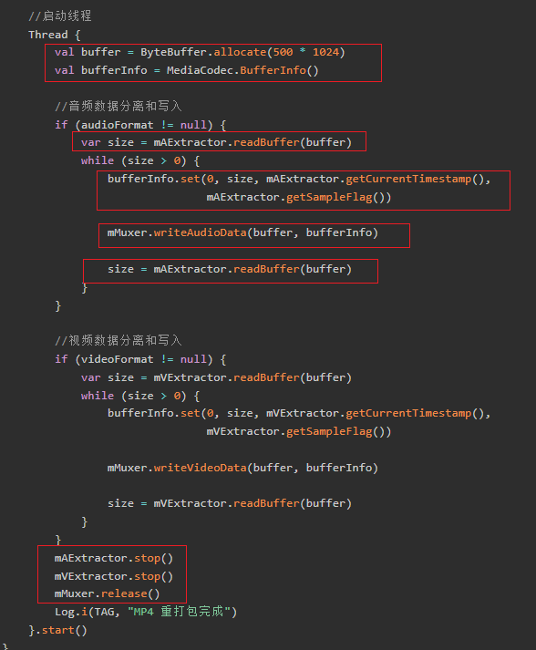
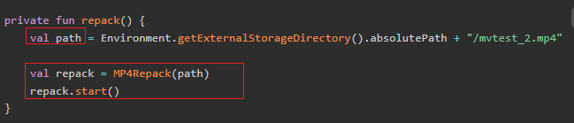

[toc]

## 前言

> 学习要符合如下的标准化链条：了解概念->探究原理->深入思考->总结提炼->底层实现->延伸应用"

## 01.学习概述

- **学习主题**：
- **知识类型**：
  - [ ] ✅Android/ 
    - [ ] ✅01.基础组件与机制 
      - [ ] ✅四大组件
      - [ ] ✅IPC机制
      - [ ] ✅消息机制
      - [ ] ✅事件分发机制
      - [ ] ✅View与渲染体系（含Window、复杂控件、动画）
      - [ ] ✅存储与数据安全（SharedPreferences/DataStore/Room/Scoped Storage）
    - [ ] ✅02. 架构与工程化
      - [ ] ✅架构模式（MVC/MVP/MVVM/MVI）
      - [ ] ✅依赖注入（Koin/Hilt/Dagger）
      - [ ] ✅路由与模块化（ARouter、Navigation）
      - [ ] ✅Gradle与构建优化
      - [ ] ✅插件化与动态化
      - [ ] ✅插桩与监控框架
    - [ ] ✅03.性能优化与故障诊断
      - [ ] ✅ANR分析与优化
      - [ ] ✅启动耗时优化
      - [ ] ✅内存泄漏监控
      - [ ] ✅监控与诊断工具
    - [ ] ✅04.Jetpack与生态框架
      - [ ] ✅Room
      - [ ] ✅Paging
      - [ ] ✅WorkManager
      - [ ] ✅Compose
    - [ ] ✅05.Framework与系统机制
      - [ ] ✅ActivityManagerService (含ANR触发机制)
      - [ ] ✅Binder机制
  - [ ] ✅音视频开发/
    - [x] ✅01.基础知识
    - [ ] ✅02.OpenGL渲染视频
    - [ ] ✅03.FFmpeg音视频解码
  - [ ] ✅ Java/
    - [ ] ✅01.基础知识
    - [ ] ✅02.集合框架
    - [ ] ✅03.异常处理
    - [ ] ✅04.多线程与并发
    - [ ] ✅06.JVM
  - [ ] ✅ Kotlin/
    - [ ] ✅01.基础语法
    - [ ] ✅02.高阶扩展
    - [ ] ✅03.协程和流
  - [ ] ✅ Flutter/
    - [ ] ✅01.基础基础语法
    - [ ] ✅02.状态管理
    - [ ] ✅03.路由与依赖注入
    - [ ] ✅04.原生通信
  - [ ] ✅ 自我管理/
    - [ ] ✅01.内观
  - [ ] ✅ 项目经验/
    - [ ] ✅01.启动逻辑
    - [ ] ✅02.云值守
    - [ ] ✅03.智控平台
- **学习来源**：
- **重要程度**：⭐⭐⭐⭐⭐
- **学习日期**：2025.
- **记录人**：@panruiqi

### 1.1 学习目标

- 了解概念->探究原理->深入思考->总结提炼->底层实现->延伸应用"

### 1.2 前置知识

- [ ] 

## 02.核心概念

### 2.1 是什么？

如何重封装一个视频，如何把AAC和H264封装为一个MP4文件？

### 2.2 解决什么问题？

### 2.3 基本特性

## 03.原理机制

### 3.1 音视频解封

回顾我们之前学的MediaExtractor，我们经过他解封出我们的音频和视频数据，他的主要流程分为下面几步

初始化

- 创建MediaExtractor实例，设置其数据源
  - 

获取音视频信息

- 没啥好说，解析path对应文件，找到音视频轨道，内部包含对应的音视频信息
  
  - 
  
  > 怎么理解这里的通过getTrackFormat获取音视频信息？
  >
  > 为什么可以获取？
  >
  > - MP4、MKV、TS等多媒体封装格式，每个轨道（音频、视频、字幕等）在文件头部都存有详细的参数信息。
  >
  > - MediaExtractor 解析文件时，会读取这些头部信息，解析出每个轨道的参数。
  >
  > - getTrackFormat 就是把这些参数封装成 MediaFormat 对象返回给你
  >
  > 获取到什么？
  >
  > - KEY_MIME：编码类型（如 "audio/mp4a-latm"）
  >
  > - KEY_SAMPLE_RATE：采样率（如 44100）
  >
  > - KEY_CHANNEL_COUNT：声道数（如 2）
  >
  > - KEY_BIT_RATE：比特率
  >
  > - KEY_AAC_PROFILE：AAC配置
  >
  > - 还有视频相关的如宽高、帧率等

读取分离音视频数据

- 具体如下：
  - 清空传入的byteBuffer，准备写入新数据
  - 选择当前要读取的轨道（音频或视频）
  - 用mExtractor.readSampleData把一帧（或一段）数据读进byteBuffer，返回实际读取的字节数
  - 如果返回<0，说明数据读完了
  - 记录当前帧的时间戳（微秒），用于同步/渲染
  - advance()让Extractor指针移动到下一帧
  - 

> advance做了什么？
>
> - 调用 advance() 后，Extractor会移动到下一个帧（sample），即第N+1帧
>
> 这个移动到下一帧，索引保存在哪？
>
> - 在 Android 的 MediaExtractor 里，“当前帧的索引”并不是直接暴露给开发者的变量，而是由 MediaExtractor 内部在 native 层（C++）维护的

### 3.2 音视频封装

Android原生提供了一个封装器MediaMuxer，用于将已经编码好的音视频流数据封装到指定格式的文件中，MediaMuxer支持MP4、Webm、3GP三种封装格式。一般使用MP4格式。其使用也比较简单，分为下面几个步骤：

初始化

- 指定输出文件路径和格式（如MP4），创建 MediaMuxer 实例
  - 

添加音视频轨道

- 通过 addTrack(mediaFormat) 添加音频/视频轨道，返回轨道索引，这里只是申明了有对应的格式的轨道，写入了音视频信息，真正的音视频的数据并没有写入到轨道中。轨道格式（MediaFormat）通常来自解码器或提取器（Extractor）
  - 
  - 可以只添加音轨或视频轨道（setNoAudio/setNoVideo），支持纯音频或纯视频文件
  - 

写入数据，就是向上面的增加的音视频轨道中增加数据

- 通过 writeSampleData(trackIndex, byteBuffer, bufferInfo) 写入编码后的音视频数据，这里的bufferInfo包含用于同步的信息，决定了数据在文件中的时序。每条数据都要带上正确的 bufferInfo（尤其是PTS），否则音视频会不同步。
  - 

释放资源

- 必须调用 stop 和 release，否则生成的文件不完整，无法正常播放
  - 

### 3.3 整合解封和封装流程

通过上面两个步骤，我们有了最基本的解封和封装的工具了，接下来只需要将它们整合起来就可以了。

新建一个重打包类MP4Repack

初始化阶段

- 分别初始化音频、视频分离器和封装器。
  - 

轨道判断与添加

- 判断源文件是否有音频/视频轨道，动态添加或忽略轨道。
  - 

分离与写入（核心）

- 具体如下：
  - 分离：调用mAExtractor.readBuffer不断从音频分离器读取数据，写入到封装器。同时设置bufferInfo，每一帧都要带上正确的时间戳和帧类型。
  - 写入
  - 

> BufferInfo参数
>
> bufferInfo.set(offset, size, pts, flags)
>
> - offset：数据起始偏移，通常为0。
>
> - size：当前帧数据大小。
>
> - pts：当前帧的时间戳（单位：微秒，Extractor直接获取）。
>
> - flags：帧类型（如关键帧、普通帧等，Extractor直接获取）。

### 3.4 调用MediaRepack重封装工具实现重封装

重封装的调用非常简单

- 如下：
  - 

## 04.底层原理

## 05.深度思考

### 5.1 关键问题探究

### 5.2 设计对比

## 06.实践验证

### 6.1 行为验证代码

### 6.2 性能测试

## 07.应用场景

### 7.1 最佳实践

### 7.2 使用禁忌

## 08.总结提炼

### 8.1 核心收获

### 8.2 知识图谱

### 8.3 延伸思考

## 09.参考资料

1. 
2. 
3. 

## 其他介绍

### 01.关于我的博客

- csdn：http://my.csdn.net/qq_35829566

- 掘金：https://juejin.im/user/499639464759898

- github：https://github.com/jjjjjjava

- 邮箱：[934137388@qq.com]

