[toc]

## 前言

> 学习要符合如下的标准化链条：了解概念->探究原理->深入思考->总结提炼->底层实现->延伸应用"

## 01.学习概述

- **学习主题**：
- **知识类型**：
  - [ ] ✅Android/ 
    - [ ] ✅01.基础组件与机制 
      - [ ] ✅四大组件
      - [ ] ✅IPC机制
      - [ ] ✅消息机制
      - [ ] ✅事件分发机制
      - [ ] ✅View与渲染体系（含Window、复杂控件、动画）
      - [ ] ✅存储与数据安全（SharedPreferences/DataStore/Room/Scoped Storage）
    - [ ] ✅02. 架构与工程化
      - [ ] ✅架构模式（MVC/MVP/MVVM/MVI）
      - [ ] ✅依赖注入（Koin/Hilt/Dagger）
      - [ ] ✅路由与模块化（ARouter、Navigation）
      - [ ] ✅Gradle与构建优化
      - [ ] ✅插件化与动态化
      - [ ] ✅插桩与监控框架
    - [ ] ✅03.性能优化与故障诊断
      - [ ] ✅ANR分析与优化
      - [ ] ✅启动耗时优化
      - [ ] ✅内存泄漏监控
      - [ ] ✅监控与诊断工具
    - [ ] ✅04.Jetpack与生态框架
      - [ ] ✅Room
      - [ ] ✅Paging
      - [ ] ✅WorkManager
      - [ ] ✅Compose
    - [ ] ✅05.Framework与系统机制
      - [ ] ✅ActivityManagerService (含ANR触发机制)
      - [ ] ✅Binder机制
  - [ ] ✅音视频开发/
    - [ ] ✅01.基础知识
    - [ ] ✅02.OpenGL渲染视频
    - [ ] ✅03.FFmpeg音视频解码
  - [ ] ✅ Java/
    - [ ] ✅01.基础知识
    - [ ] ✅02.集合框架
    - [ ] ✅03.异常处理
    - [ ] ✅04.多线程与并发
    - [ ] ✅06.JVM
  - [ ] ✅ Kotlin/
    - [ ] ✅01.基础语法
    - [ ] ✅02.高阶扩展
    - [ ] ✅03.协程和流
  - [ ] ✅ Flutter/
    - [ ] ✅01.基础基础语法
    - [ ] ✅02.状态管理
    - [ ] ✅03.路由与依赖注入
    - [ ] ✅04.原生通信
  - [ ] ✅ 自我管理/
    - [ ] ✅01.内观
  - [ ] ✅ 项目经验/
    - [ ] ✅01.启动逻辑
    - [ ] ✅02.云值守
    - [ ] ✅03.智控平台
- **学习来源**：
- **重要程度**：⭐⭐⭐⭐⭐
- **学习日期**：2025.
- **记录人**：@panruiqi

### 1.1 学习目标

- 了解概念->探究原理->深入思考->总结提炼->底层实现->延伸应用"

### 1.2 前置知识

- [ ] 

## 02.核心概念

### 2.1 是什么？

### 2.2 解决什么问题？

### 2.3 基本特性

## 03.原理机制

### 3.1 如何使用OpenGL渲染视频画面？

如何使用OpenGl渲染视频画面，他和使用图片渲染有什么区别呢？图片是静态的，视频是动态的。视频的每一帧是静态的，但是他是YUV，要转换为RGB

继承 [03. 音视频_OpenGL_初步了解OpenGL ES.md](03. 音视频_OpenGL_初步了解OpenGL ES.md) 中的使用图片渲染的逻辑，我们这里只看他们之间的差异

首先是着色器的构建的差异

- 片元着色器
  - 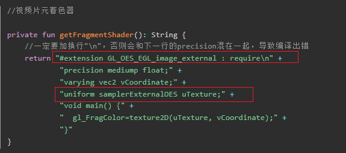
- 对比一下图片的片元着色器
  - 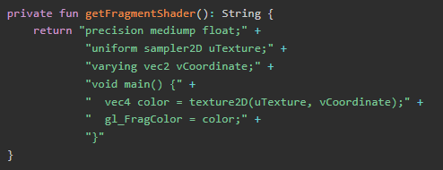

- 多了两个
  - \#extension GL_OES_EGL_image_external : require，声明使用Android的OpenGL ES扩展，允许采样外部纹理（如视频帧）。
  - uniform samplerExternalOES uTexture;：拓展纹理类型，专门用于采样外部源（如Camera、MediaCodec、SurfaceTexture等）

好啊，什么是拓展纹理？

- 很多视频源（如Camera、MediaCodec解码输出）本身是YUV格式，不能直接作为OpenGL的普通纹理采样，因为普通纹理采样需要RGB格式。正常需要做一个YUV到RGB的转换
- 通过samplerExternalOES，GPU驱动会自动把YUV数据转换为RGB，开发者无需手动做YUV-RGB转换。

接着的是传入纹理数据这一步

- 对于图片渲染：其只要把图片数据上传到纹理，后续每帧直接采样即可，图片内容不会变，不需要每帧更新
- 对于视频渲染：视频帧不断变化，需要每帧都“更新”纹理内容。因此不能用glTexImage2D每帧上传（效率低），而是用SurfaceTexture和samplerExternalOES实现高效的“零拷贝”更新

- 好，我们要先初始化我们的SurfaceTexture
  - 用SurfaceTexture(id)把OpenGL的纹理ID和SurfaceTexture关联起来
  - 视频解码器（MediaCodec）可以把解码后的YUV帧直接渲染到这个SurfaceTexture上，无需CPU拷贝
  - 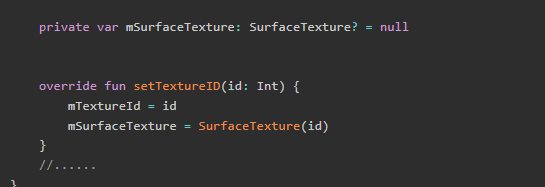

- 在updateTexture方法中，我们调用mSurfaceTexture?.updateTexImage()，通知SurfaceTexture把最新的视频帧“贴”到你绑定的纹理ID上
  - 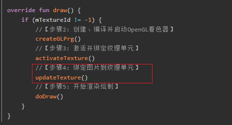
  - 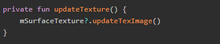

还记得在硬解码第二篇封装基础解码框架中，提到MediaCodec要提供一个Surface，作为一个渲染表面。而Surface正需要一个SurfaceTexture。

因此，我们可以把这个SurfaceTexture传给外部使用。

- 先在IDrawer中添加一个方法

  - 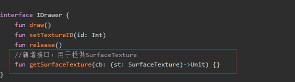

- 通过一个高阶函数参数，把SurfaceTexture回传出去。具体如下：

  - getSurfaceTexture(cb)：外部调用这个方法，传入一个回调函数，通过这个回调外部可以拿到SurfaceTexture 
  - 当 VideoDrawer 创建好 SurfaceTexture 后，调用mSftCb?.invoke，执行上面的回调函数，把 SurfaceTexture 传给外部
  - 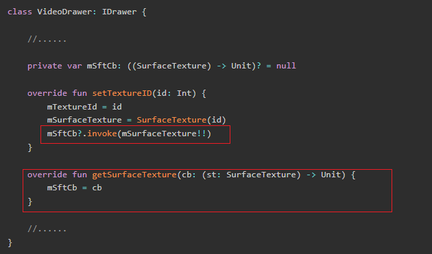

- 外部：

  - MediaCodec解码器需要一个Surface作为输出目标
    - MediaCodec本身不负责渲染，真正的渲染能力是依赖于OpenGL，其只是把解码后的数据“输出”到你指定的Surface。

  - Surface / SurfaceTexture

    - 你先用OpenGL生成一个纹理ID，然后用SurfaceTexture(textureId)把这个纹理和SurfaceTexture绑定。
    - 再用new Surface(surfaceTexture)把SurfaceTexture包装成Surface对象。

    > 这里怎么理解？
    >
    > 感觉Surface / SurfaceTexture像是代理模式啊
    >
    > - 充当代理角色
    > - Surface本身是Android的通用渲染目标，可以被MediaCodec、Camera等用作输出
    > - 我们通过SurfaceTexture把Surface的内容直接“映射”到OpenGL的纹理ID上

  - 把Surface传给MediaCodec
    - MediaCodec解码器初始化时，把这个Surface作为输出目标传进去。

  - OpenGL处理
    - OpenGL真正负责“渲染”——也就是把纹理内容绘制到屏幕上
    - MediaCodec解码后的视频帧会自动渲染到Surface（本质上就是SurfaceTexture）。
    - SurfaceTexture会把最新的视频帧内容“贴”到你绑定的OpenGL纹理上。
    - OpenGL会在渲染过程中采样这个纹理ID，决定每个像素的最终颜色。

上面是主要的差异，那么真正使用OpenGL播放视频如何处理呢？

- 基本与使用SurfaceView进行播放差不多，多了初始化OpenGL和Surface。

  - xml定义
  - 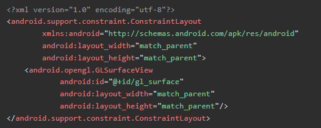
  - 这里的lambda表达式是Surface，也就是 new Surface(surfaceTexture) 传递进去。内部执行这个，传递mSurfaceTexture
  - 接着拿这个Surface配置给MediaCodec
  - 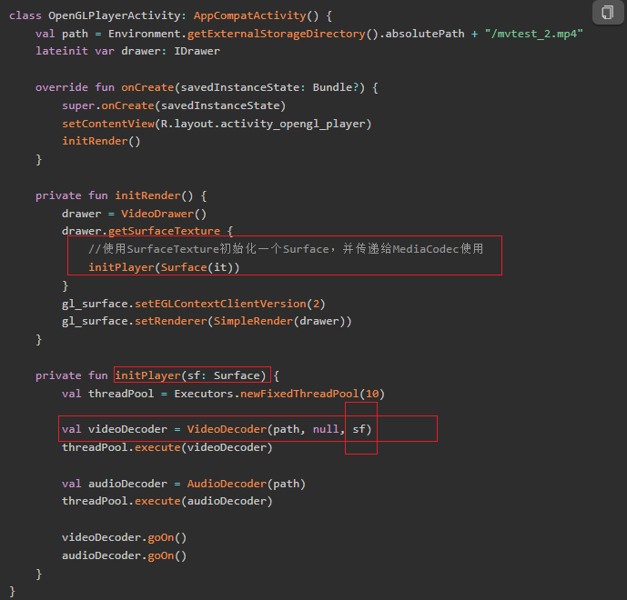

  > 如果使用以上代码开始播放视频，你会发现，视频画面被拉伸到GLSurfaceView窗口的大小，也就是全屏铺满，接下来就看看如何矫正视频画面，让画面比例和实际一样。
  >
  > 

### 3.2 画面比例拉伸的原因及矫正的原理

我们上面画面被拉伸了，这不是我们所期望的。我们要处理这个问题，但是在此之前，我们要先理解为什么会出现这个问题呢？

- OpenGL的世界坐标是一个 **标准化坐标系（NDC, Normalized Device Coordinates）** ，xyz坐标范围都在（-1～1），默认起始和结束位置分别对应世界坐标的平面的四个角。
- 此时，如果直接把一个图像或物体映射到这个范围，它会铺满整个屏幕，但 **不考虑屏幕长宽比**。这导致结果可能拉伸或压缩，产生 **画面变形**。
- 举例：一个原本是正方形的图像，如果屏幕是 16:9，直接映射 [-1,1] 就会变成矩形 → 拉伸或压缩。

好，我们知道这个问题是标准化坐标系导致的了，那么我们如何才能解决这个问题呢？那么我们要先知道顶点处理的过程，也就是顶点着色器要进行的处理过程，先看一下我们之前的理解：

- 顶点处理核心是再屏幕上确定物体的几何形状，也就是把我替从自己的空间一步步变换到屏幕空间
  - 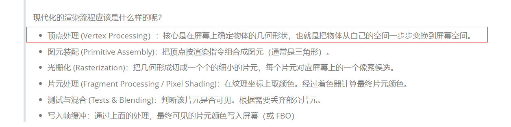

- 好，这里的一步步有哪些呢？他其实会经历以下几个矩阵变换：
  - **模型矩阵（Model Matrix）**： 把物体从局部坐标系 → 世界坐标系（控制物体的位置、旋转、缩放）
  - **视图矩阵（View Matrix）**把世界坐标系 → 摄像机坐标系，相机相当于观察世界的眼睛，控制视角方向和位置
  - **投影矩阵（Projection Matrix）** 把摄像机坐标系 → 裁剪空间（Clip Space），裁剪就是把不在视锥体（相机可见区域）的顶点/三角形丢掉或裁切。他有以下两种投影方式：
    - **透视投影**：模拟人眼效果：远处物体小，近处物体大，用 **视锥体**（frustum）定义裁剪空间。近平面大小和上下左右边界决定视野范围 → 影响长宽比和画面缩放。
    - **正交投影**：物体大小不随距离改变

- OpenGL对画面比例进行调整，就依赖于这里的投影矩阵，他有两种类型，分别是透视投影和正交投影
- 投影矩阵起到什么作用？
  - 投影规定了裁剪空间的范围，也就是物体的可视空间范围
  - 将裁剪空间内的物体投影到屏幕上

- 要讲清楚OpenGL的投影并不是一件简单的事，会涉及到OpenGL中关于各类空间的定义，这里简单列一下：
  - 局部空间（Local / Object Space）：每个物体都有自己的坐标系，原点通常在物体中心。用于描述物体内部的形状
  - 世界空间（World Space）：物体被放到场景里之后，就有了世界坐标。可以用 **模型矩阵（Model Matrix）** 把局部坐标变换到世界坐标。举例：一个立方体原本在局部空间中心 `(0,0,0)`，放到世界空间 `(10,0,5)`，就移动到这个位置。
  - 观察空间（View / Camera Space）：相机就是观察者，观察空间是以 **相机为原点** 的坐标系。可以用用 **视图矩阵（View Matrix）** 把世界坐标变换到观察空间。对于不同相机位置和朝向，看同一个物体，坐标就不一样。
  - 裁剪空间（Clip Space）：经过投影矩阵（Projection Matrix）变换后得到的空间，其决定哪些物体在可视范围内，超出范围的顶点/图元会被裁剪掉
  - 屏幕空间（Screen Space）：最终映射到显示器或手机屏幕上的像素坐标。透视除法：`(x/w, y/w, z/w)` → 标准化设备坐标 [-1,1]，真正决定物体显示在屏幕上哪个位置。

我们来深度理解一下透视投影吧

- 下图可以看到，透视投影的原理其实就是人眼看物体的成像原理。从相机向前看，有一个视角空间的，类似人眼的观察角度。人看到的物体是投影在视网膜上，相机看到的则是投影在近平面（距离相机比较近的平面）上的成像。
  - 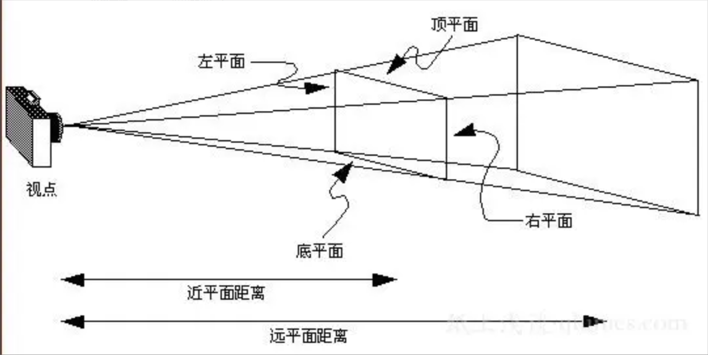

我们可以看到，这里是依赖于摄像机的位置和朝向的，那么相机位置和朝向是什么？

- 相机位置

  - 相机其实就是一个“观察点”，决定了你从哪里看场景。
  - 它位于 **世界坐标系** 中，所以设置相机位置时，是相对于世界坐标原点 `(0,0,0)` 的。
  - 你设置相机位置 (0,0,5)，就是位于 Z 轴上，离原点 5 个单位远。然后你从这个位置看向原点（0,0,0）。

- 相机朝向

  - **朝向** = 相机“看向哪里”，由一个 **方向向量** 指定。
  - 通常有三个向量：
    - **视线方向（Forward / LookAt）**：相机正对的方向。
    - **上方向（Up）**：相机正上方指向，决定画面“哪边是上”。
    - **右方向（Right）**：由 Forward × Up 得到，确保三者正交，无需提供。
  - 类比的话：相机就是人的头部，Forward = 眼睛看向的方向，Up = 头顶方向
  - 如果是`up = (0,1,0)` → 头顶朝上，画面正常；如果 up = (0,-1,0)`头顶朝下，画面上下颠倒

- 小结：**相机位置** = 世界中观察点坐标。**Forward/LookAt** = 相机看的方向。**Up 向量** = 相机“正上方”方向，用来确定画面旋转。这三者组合，最终决定从这个视角看到的画面是怎样的。

  > 我没理解这里的视线方向（Forward / LookAt），对于Forward，他不是只有-1，+1吗？他的-1表示什么？+1表示什么呢？
  >
  > 你的理解是错误的，Forward是一个方向向量，表示“相机正对的方向”。它不是一个固定的数值，而是一个三维向量，比如 (0, 0, -1) 或 (1, 0, 0) 等
  >
  > 因此你可以让你的相机看向任何方向，比如斜着看 (1, 1, -1)，只要是一个方向向量即可。

近平面和远平面：这个很好理解，看回上面透视投影的图片，在相机的右边有两个平面，靠近相机的为近平面，较远的一面为远平面。

那么裁剪空间呢？

- 可以看到远平面和近平面的四边的连线最后都汇集到相机的位置。这些连线和两个平面包围组成的空间就是上面所说的裁剪空间，即可见空间。
- 在这个空间中的物体，其表面与相机位置的连线，穿过近平面留下的点，组成的图像，就是物体在近平面上的投影，也就是在手机屏幕看到的成像。
- 并且，距离相机的位置越远，投影会越小，这和人眼的成像一模一样。
  - 这是效果图
  - 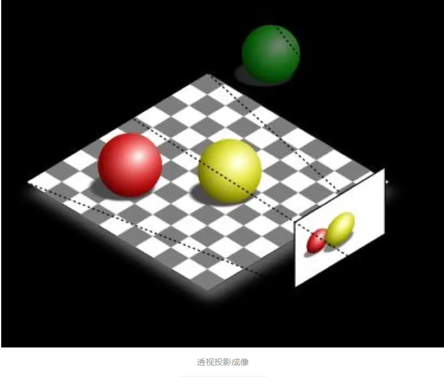

- 正因为透视投影这种和人眼一样的成像原理，所以经常应用在3D渲染中。

那么正交投影呢？

- 和透视投影一样，正交投影也有相机、近平面和远平面，不同的是，相机的视线不在是聚焦在一点上，而是平行线。所以近平面与远平面中间的可视窗体是一个长方体。
  - 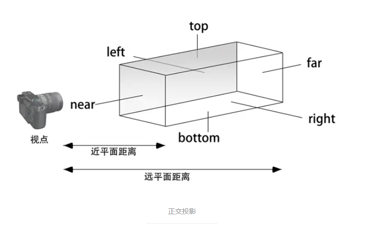

- 也就是说，正交投影的视觉不再像人眼了，所有在裁剪空间中的物体，无论远近，只要是大小一样，在近平面上的投影都是一样的，不再有近大远小的效果。
  - 这是效果图
  - 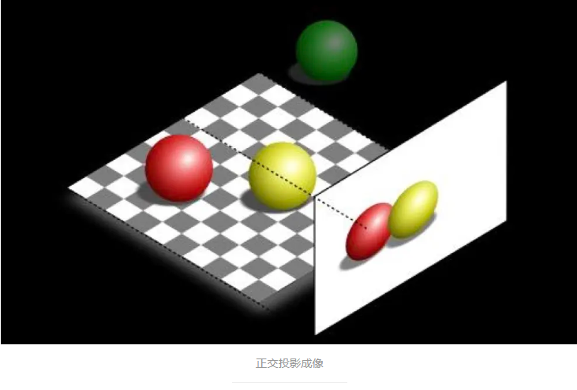

好，现在我们就知道我们解决这个问题的原理了：**画面变形的原因**：直接映射 NDC [-1,1]，不考虑屏幕比例。我们可以通过正交投影矩阵，调整 `left/right` 与 `top/bottom` 的比例来矫正画面。

OpenGL 提供了 Matrix.orthoM 函数来生成正交投影矩阵：

- 这里的left，right，bottom，top就是设置近平面的大小
  - left / right → 水平方向：**左边界/右边界到原点的水平距离**（X 轴方向）。
  - bottom / top → 垂直方向：**下边界/上边界到原点的垂直距离**（Y 轴方向）。
  - 这里的“原点”不是屏幕中心，而是 **摄像机位置投影到近平面的交点**，也就是近平面中心。
  - 

### 3.3 画面比例纠正的实现

好，那么我们如何通过这个API来实现呢？

我们要先看看矩阵变化

- 首先来看一个简单的矩阵乘法：
  - 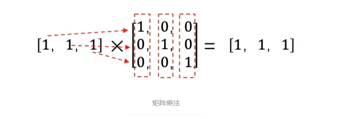
- 那么如果我们希望缩放呢？
  - 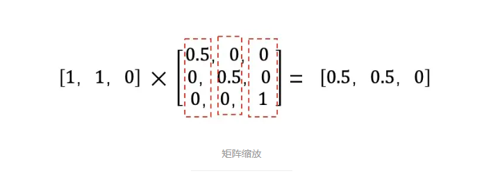
- 好，如果把这三个分别看作x,y,z呢？
  - 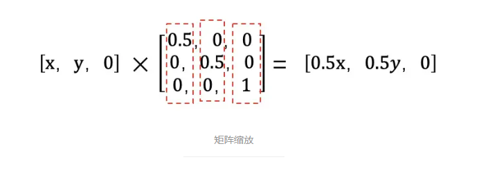
- 既然视频画面是被拉伸了，那么最直接的方法就是通过缩放，把画面被拉伸的方向缩小回来，而矩阵乘法正好可以满足缩放的需求。

看回正交投影的方法：

- 举个例子：假设，视频的宽高为1000x500，而GLSurfaceView的宽高为1080x1920。
  - 这是正交矩阵
  - 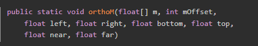
  - 那么我们正交投影参数为
  - 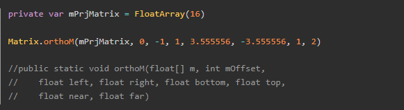

- 至于为什么？他妈的有点难算，我懒得看了，太烦了，下次遇到这个问题，让Cursor给我参数就行
- 还是稍微看看吧：我们期望正确缩放后的水平宽高为：1080x540（500x1080/1000），缩放了多少倍呢？是540/500 = 1.08吗？错！！！如果不进行缩放处理的情况下，画面被拉伸铺满，画面的高度应该是1920，所以正确的缩放倍数应该是1920/540=3.555556（不能除尽）

好，我们做好前面的准备了，接下来看看代码中如何实现，她需要下面几个步骤

| 步骤               | 代码位置                                                | 作用                                                         |
| ------------------ | ------------------------------------------------------- | ------------------------------------------------------------ |
| **① 接收原始尺寸** | `setVideoSize`                                          | 保存视频宽高                                                 |
| **② 接收窗口尺寸** | `setWorldSize`                                          | 保存 `GLSurfaceView` 宽高                                    |
| **③ 计算投影矩阵** | `initDefMatrix`                                         | 比较视频宽高比与窗口宽高比，得出 `actualRatio` 并调用 `Matrix.orthoM` 生成正交投影矩阵 |
| **④ 传给 Shader**  | `glUniformMatrix4fv(mVertexMatrixHandler, … mMatrix …)` | 将计算好的 `uMatrix` 传入顶点着色器                          |
| **⑤ 顶点变换**     | 顶点着色器：`gl_Position = aPosition * uMatrix;`        | 顶点坐标乘投影矩阵，得到矫正后的裁剪坐标                     |

IDrawer新增两个接口，分别用于设置视频的原始宽高，以及设置OpenGL窗口宽高

- 两个接口
  - setVideoSize(videoW: Int, videoH: Int)：让渲染器（Drawer）知道视频内容的实际分辨率
  - setWorldSize(worldW: Int, worldH: Int)：设置OpenGL窗口（通常是GLSurfaceView）的宽高（像素），让Drawer知道当前显示区域的实际大小
  - 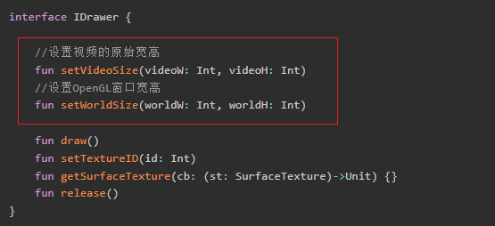

计算投影矩阵

- 分情况处理：

  - 如果视频比例比窗口更“宽”，就让 **X 范围固定 [-1,1]**，Y 按比例拉伸。
  - 如果视频比例比窗口更“高”，就让 **Y 范围固定 [-1,1]**，X 按比例拉伸。

  - 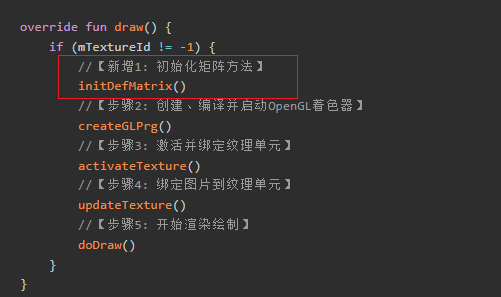
  - 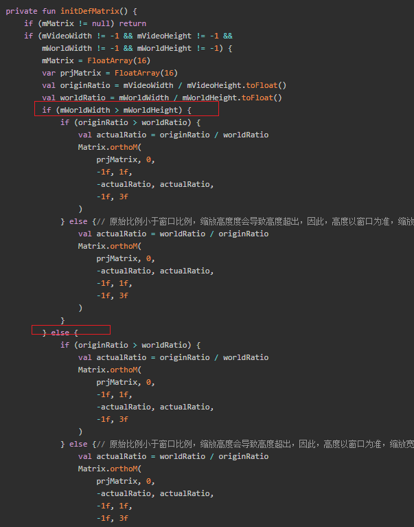

传给顶点着色器

- 如下：
  - 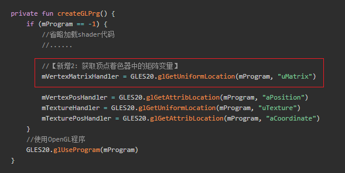
  - 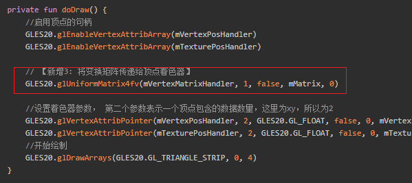

顶点着色器进行矩阵变化，缩放视图

- 如下：
  - 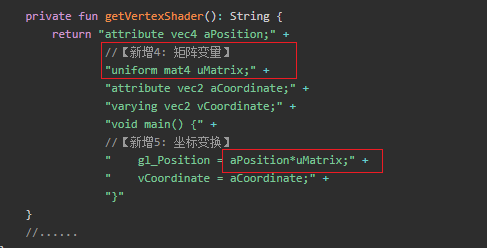

ok，外部如何调用呢？

- 如下
  - 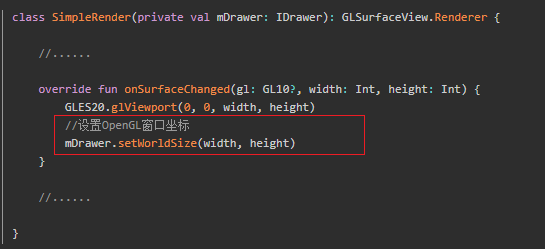
  - 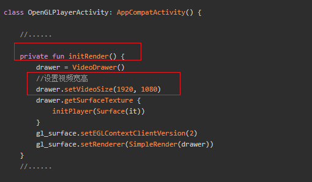

至此，一个正确的图形被显示了出来

- 如下
  - 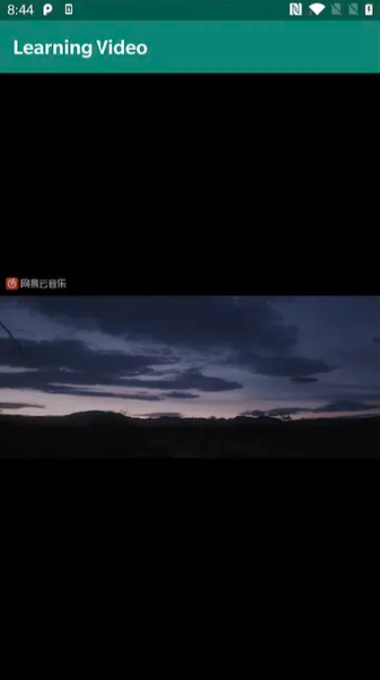

### 3.4 视频滤镜

在很多视频应用中都会看到滤镜，可以改变视频的风格。那么这些滤镜是怎么实现的呢？

其实原理非常简单，无非就是改变画面图片的颜色。

下面就实现一个非常简单滤镜：黑白画面，只需改变片元着色器即可：

- 把rgb做了一个简单的均值，然后赋值给rgb都赋值为这个均值，就可以得到一个黑白的颜色。然后赋值给片元，一个简单的黑白滤镜就完成了
  - 
  - 关键代码
  - 

## 04.底层原理

## 05.深度思考

### 5.1 关键问题探究

### 5.2 设计对比

## 06.实践验证

### 6.1 行为验证代码

### 6.2 性能测试

## 07.应用场景

### 7.1 最佳实践

### 7.2 使用禁忌

## 08.总结提炼

### 8.1 核心收获

### 8.2 知识图谱

### 8.3 延伸思考

## 09.参考资料

1. 
2. 
3. 

## 其他介绍

### 01.关于我的博客

- csdn：http://my.csdn.net/qq_35829566

- 掘金：https://juejin.im/user/499639464759898

- github：https://github.com/jjjjjjava

- 邮箱：[934137388@qq.com]

