[toc]

## 前言

> 学习要符合如下的标准化链条：了解概念->探究原理->深入思考->总结提炼->底层实现->延伸应用"

## 01.学习概述

- **学习主题**：
- **知识类型**：
  - [ ] ✅Android/ 
    - [ ] ✅01.基础组件与机制 
      - [ ] ✅四大组件
      - [ ] ✅IPC机制
      - [ ] ✅消息机制
      - [ ] ✅事件分发机制
      - [ ] ✅View与渲染体系（含Window、复杂控件、动画）
      - [ ] ✅存储与数据安全（SharedPreferences/DataStore/Room/Scoped Storage）
    - [ ] ✅02. 架构与工程化
      - [ ] ✅架构模式（MVC/MVP/MVVM/MVI）
      - [ ] ✅依赖注入（Koin/Hilt/Dagger）
      - [ ] ✅路由与模块化（ARouter、Navigation）
      - [ ] ✅Gradle与构建优化
      - [ ] ✅插件化与动态化
      - [ ] ✅插桩与监控框架
    - [ ] ✅03.性能优化与故障诊断
      - [ ] ✅ANR分析与优化
      - [ ] ✅启动耗时优化
      - [ ] ✅内存泄漏监控
      - [ ] ✅监控与诊断工具
    - [ ] ✅04.Jetpack与生态框架
      - [ ] ✅Room
      - [ ] ✅Paging
      - [ ] ✅WorkManager
      - [ ] ✅Compose
    - [ ] ✅05.Framework与系统机制
      - [ ] ✅ActivityManagerService (含ANR触发机制)
      - [ ] ✅Binder机制
  - [ ] ✅音视频开发/
    - [ ] ✅01.基础知识
    - [ ] ✅02.OpenGL渲染视频
    - [ ] ✅03.FFmpeg音视频解码
  - [ ] ✅ Java/
    - [ ] ✅01.基础知识
    - [ ] ✅02.集合框架
    - [ ] ✅03.异常处理
    - [ ] ✅04.多线程与并发
    - [ ] ✅06.JVM
  - [ ] ✅ Kotlin/
    - [ ] ✅01.基础语法
    - [ ] ✅02.高阶扩展
    - [ ] ✅03.协程和流
  - [ ] ✅ Flutter/
    - [ ] ✅01.基础基础语法
    - [ ] ✅02.状态管理
    - [ ] ✅03.路由与依赖注入
    - [ ] ✅04.原生通信
  - [ ] ✅ 自我管理/
    - [ ] ✅01.内观
  - [ ] ✅ 项目经验/
    - [ ] ✅01.启动逻辑
    - [ ] ✅02.云值守
    - [ ] ✅03.智控平台
- **学习来源**：
- **重要程度**：⭐⭐⭐⭐⭐
- **学习日期**：2025.
- **记录人**：@panruiqi

### 1.1 学习目标

- 了解概念->探究原理->深入思考->总结提炼->底层实现->延伸应用"

### 1.2 前置知识

- [ ] 

## 02.核心概念

### 2.1 是什么？

我们回顾之前的流程

- 我们要把H264的一帧解析为YUV，然后将其渲染处理，我们具体是把YUV设置给Surface，此时我们释放输出缓冲区，系统会自动把YUV渲染出来。

- 看见关键词了吗？渲染。我们可以使用cpu来进行渲染，但是我们手机上还有一种硬件，GPU，他非常擅长并行浮点运算，可以用来对许许多多的像素做并行运算，因此可以用GPU来进行渲染实现硬件加速。

那么OpenGL是什么呢？

- 我们跟cpu沟通容易，因为CPU可以直接执行机器语言（01指令），但GPU有自己专用的指令集，幸好，为了让开发者方便地控制GPU，业界提供了OpenGL（和OpenGL ES）这样的API标准，我们可以调用这个API，由他来控制GPU执行相关的渲染任务。

- 好，现在引出了OpenGL ES概念，其全称：OpenGL for Embedded Systems，是OpenGL 的子集，是针对手机 PAD等小型设备设计的，删减了不必须的方法、数据类型、功能，减少了体积，优化了效率。

> 那么什么是渲染呢？渲染就是计算出屏幕中每个像素应该填充什么颜色。
>
> 
>
> 那么为什么GPU更快呢？因为GPU（图形处理器）的架构专门为“并行处理大量数据”设计。二屏幕上有成千上万个像素，每个像素的颜色计算可以独立并行进行。对于GPU，其有成百上千个“小核心”，可以同时处理成千上万个像素的着色计算。
>
> 
>
> 现代化的渲染流程应该是什么样的呢？
>
> - 顶点处理 (Vertex Processing）：核心是在屏幕上确定物体的几何形状，也就是把物体从自己的空间一步步变换到屏幕空间。
> - 图元装配 (Primitive Assembly)：把顶点按渲染指令组合成图元（通常是三角形）。
> - 光栅化 (Rasterization)：把几何形成切成一个个的细小的片元，每个片元对应屏幕上的一个像素候选。
> - 片元处理 (Fragment Processing / Pixel Shading)：在纹理坐标上取颜色。经过着色器计算最终片元颜色。
> - 测试与混合 (Tests & Blending)：判断该片元是否可见。根据需要丢弃部分片元。
> - 写入帧缓冲：通过上面的处理，最终可见的片元颜色写入屏幕（或 FBO）

### 2.2 解决什么问题？

如何和GPU通信，让其执行渲染的任务

### 2.3 基本特性

## 03.原理机制

### 3.1 基础知识_OpenGL ES坐标系

在音视频开发中，涉及到的坐标系主要有两个：世界坐标和纹理坐标。

先来看两张图

- 世界坐标系：OpenGL ES 渲染时，所有要渲染的点最终都会被转换到一个标准化的二维坐标系上的一个坐标，他决定“屏幕上哪里要显示内容”。
  - 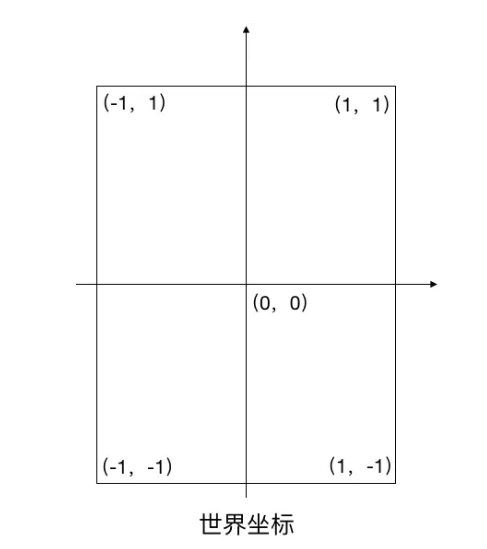
- 纹理坐标：OpenGL ES 渲染时，有了要渲染的点后，还要知道要渲染的颜色，纹理坐标上的一个点代表在这个点渲染什么色彩。
  - 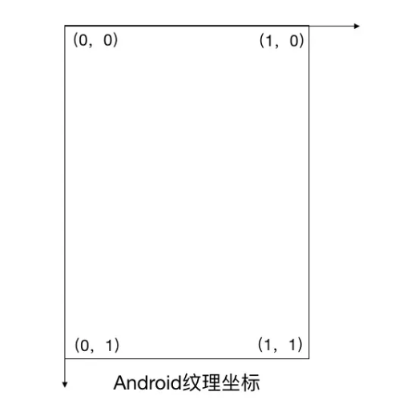

- 映射：你需要把每个世界坐标点和一个纹理坐标点对应起来，这样OpenGL在渲染时才能知道“在屏幕的某个位置要显示图片的哪个部分”。（世界坐标确定哪些点要被渲染，纹理坐标确定每个点要渲染什么颜色）（这里说的也有些歧义，其实是世界坐标被光栅化为纹理坐标）

> 提问：为什么要分开呢？因为我觉得直接一个坐标，然后坐标上存放色彩是最好的选择，色彩值为空，代表不渲染这个点，存放色彩值代表渲染，这样效率不是更高吗？一个坐标系，既可以决定在哪渲染，也可以决定渲染什么色彩。
>
> 好问题，你需要先真正理解世界坐标和纹理坐标，才能理解这个问题
>
> - **世界坐标（Vertex Position）**：描述的是**几何形状**——顶点在屏幕中的位置
> - **纹理坐标（TexCoord）**： 描述的是**取样规则**——对应该形状的每个像素从**哪块图片**上取颜色。
>
> - 这种职责分离的直接好处是：**同一套顶点位置可以搭配不同纹理**。例如：一个立方体的世界坐标可以不变，只换纹理就能贴不同材质（金属、木头、石头）。
>
> 好，我们来看GPU的渲染过程，GPU其实只需要少量几何数据+纹理，就可以通过光栅化将少量顶点组成的几何形状切分为几十万个像素，同时通过插值计算出他们的纹理坐标，并自动取样渲染。这个是GPU提供的能力。
>
> 而把“颜色直接存在世界坐标”中，实际上是在描述**整个屏幕每个像素的颜色**，也就是说你直接生成了最终渲染结果，这样相当于你放弃了矢量式的描述（顶点+纹理）以及其高效处理，直接提前生成最终像素。这不仅浪费内存（尤其在 4K、8K 时代），也失去 GPU 逐像素计算和重用的能力。

### 3.2 OpenGL 着色器语言 GLSL

OpenGL 2.0之前，渲染是固定管线（Fixed Pipeline），你只能调用固定函数，无法灵活控制顶点变换或像素着色。但是OpenGL 2.0之后出现了可编程渲染管线（Programmable Pipeline），他允许你用 **GLSL** 编写小程序控制渲染过程。

GLSL 类似 C 语言，但运行在 GPU 上，是并行执行的。你可以用它告诉GPU“每个顶点怎么处理，每个像素怎么着色”。

但是我们要先理解两类着色器：顶点着色器和片元着色器

- 顶点着色器 (Vertex Shader)对应 **世界坐标系**，用于决定“顶点在屏幕上的位置”，可以做平移、旋转、缩放、投影等操作。
- 片元着色器 (Fragment Shader)对应 **纹理坐标系**，用于决定“每个像素显示什么颜色”，可以做纹理采样、光照、颜色混合。

- 整个渲染过程就是：若干个顶点进入GPU → 顶点着色器算出位置 ，也就是几何形状→ 光栅化生成片元 → 片元着色器算出每个片元的颜色→ 输出到屏幕。

我们来看看示例代码

- 顶点着色器
  - 在顶点着色器中，传入了一个vec4的顶点坐标xyzw，然后直接传递给内建变量gl_Position，即直接根据顶点坐标渲染，不做位置变换。
  - 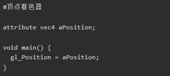
- 片元着色器
  
  - 在片元着色器中，直接给gl_FragColor赋值，依然是一个vec4类型的数据，这里表示rgba颜色值，这里为完全不透明的红色。
  
- 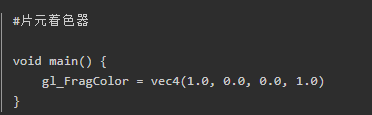
  
  - > RGBA由四个分量组成，分别代表：
    >
    > - R（Red）：红色分量，取值范围通常是0~255
    >
    > - G（Green）：绿色分量，取值范围通常是0~255
    >
    > - B（Blue）：蓝色分量，取值范围通常是0~255
    >
    > - A（Alpha）：透明度分量，取值范围通常是0~1（有时也用0~255）
    >
    > A分量表示颜色的不透明度，1（或255）表示完全不透明，0表示完全透明。
  
- 这样，两个简单的着色器串联起来后，每一个片元（像素）都会被填充为红色，最后屏幕会显示一个红色的画面。

小结：

- **可编程渲染管线**让你灵活控制渲染流程。
- **顶点着色器**负责顶点位置 → 世界坐标 → 屏幕坐标。
- **片元着色器**负责像素颜色 → 插值后的纹理坐标 → 颜色输出。
- **GPU并行执行**：每个顶点/像素都是独立计算，提高效率。

### 3.3 Android OpenGL ES_像素渲染流程

我们先来看一下主要的渲染流程。

- 在 Android 中，OpenGL ES 渲染主要流程如下：
  - **初始化**：创建 GLSurfaceView 并设置渲染器。
  - **准备数据**：顶点坐标、纹理坐标、纹理 ID。
  - **准备着色器**：顶点着色器控制顶点位置，片元着色器控制像素颜色。
  - **编译和绑定着色器**：将 GLSL 代码编译、连接成程序并启用。
  - **传入顶点和纹理数据**：通过属性绑定到 GPU。
  - **绘制**：调用 `glDrawArrays` 或 `glDrawElements` 执行渲染。
  - **循环渲染**：`onDrawFrame` 每帧回调执行，GPU 并行计算每个顶点和像素。

好，我们来详细看看

创建 GLSurfaceView 并设置渲染器。

- 我们首先有专门用于OpenGL渲染的GLSurfaceView
  - 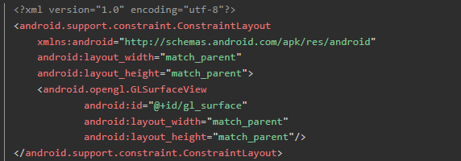
- 然后这创建drawer是代理对象，我们下面能看到他的作用。
- 然后`setEGLContextClientVersion(2)`：告诉 OpenGL ES 版本为 2.0。然后`setRenderer(...)`：设置渲染器对象（实现 GLSurfaceView.Renderer 接口）
  - 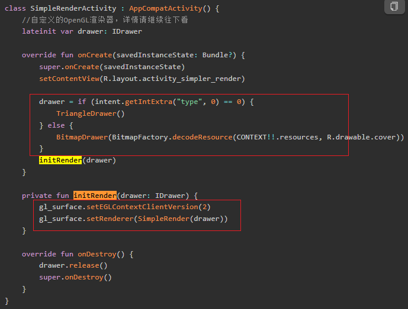

- 好，这个Renderer实现GLSurfaceView.Renderer，这表示它是一个渲染器，他回调三个方法，这里通过代理模式交给mDrawer处理
  - `onSurfaceCreated` → GL环境创建时回调，做资源初始化
  - `onSurfaceChanged` → Surface尺寸变化时回调，设置绘制区域（viewport）
  - `onDrawFrame` → 每帧绘制
  - 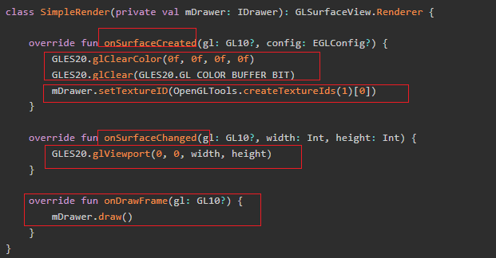
  - 这些回调都在同一个线程里执行，这是 OpenGL ES 的线程安全要求。
- 好啊，这里我们可以发现有趣的，OpenGL ES的渲染操作（比如GLSurfaceView.Renderer的回调）不要求在主线程执行，而是由GLSurfaceView内部维护的“GL线程”来执行。

数据准备

- 设置世界坐标和纹理坐标
  - 这里世界坐标是一个三角形，纹理坐标也是，对着坐标系可以看出来
  - 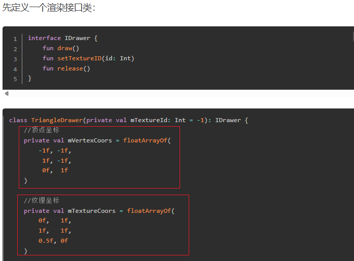

- ByteBuffer 转换：Java 数组无法直接传给 GPU，需要包装成 `FloatBuffer`，也就是把上面的顶点的坐标，纹理的坐标数据转换为FloatBuffer。
  - 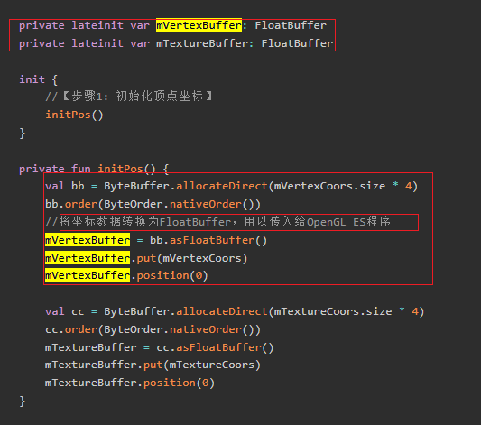

准备着色器

- 我们注意到在onDrawFrame回调方法中会调用mDrawer.draw
- 好，他里面会首先创建编译和启动OpenGL着色器
  - 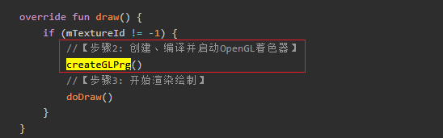
- 创建顶点着色器和片元着色器，其实就是构造着色器，指定他们执行操作的GLSL语言，也就是下面return的String
  - 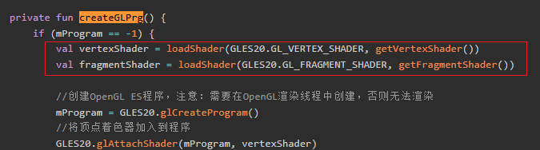
  - 
- 咦，是不是很眼熟，没错就是我们上面的代码。
  - 
  - 

编译和绑定着色器：将 GLSL 代码编译、连接成程序并启用。

- 创一个容纳GLSL的程序，然后把顶点着色器和片元着色器地方GLSL代码分别加入进去，接着把他们 “链接”成一个完整的渲染程序，最后编译成GPU能执行的程序
  - 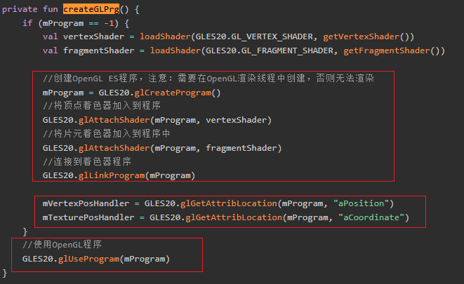
  - 在OpenGL ES在编译和链接着色器这个过程中，其会为上面代码中的每个attribute变量分配一个内部引用。你需要用glGetAttribLocation拿到这个引用，也就是我们这里的mVertexPosHandler等。后续把数据赋值给这个引用

  > 这个怎么理解呢？
  >
  > 你这里可以看到，我们需要一个aPosition的属性
  >
  > - 
  >
  > 但是他的值呢？他的值是这个
  >
  > - 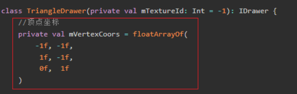
  >
  > 我们给他编译到程序中，我们需要拿到aPosition属性的引用。这样后面才可以把这些数据赋值给aPosition这个属性。

**传入顶点和纹理数据**：

- 上面完成了着色器代码的创建和编译，接着我们开始尝试渲染绘制
  - 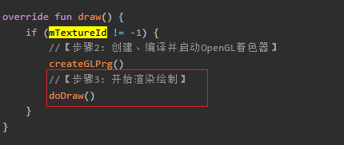
- 通过glEnableVertexAttribArray告诉OpenGL，后面要用到这两个属性（顶点坐标和纹理坐标）
- glVertexAttribPointer设置着色器参数（传递数据方式）
  - mVertexPosHandler / mTexturePosHandler：着色器中attribute在代码中的引用。
  - 2：着色器的属性有2个分量（比如x, y）
  - false：不需要归一化
  - 0：步长（stride），0表示连续存储，也就是连续着取，有步长则每次取完跳跃步长。
  - mVertexBuffer / mTextureBuffer：实际存储数据的缓冲区
  - 这一步相当于“告诉GPU，如果他需要数据时，那么对于aPosition和aCoordinate这两个属性，需要从上面准备的数据的位置，每次取2个float，分别放到顶点/纹理这两个属性上。此时我们定义的program执行时就会不断这样获取数据。
  - 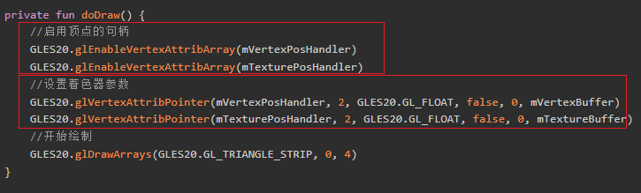
- 这是上面准备的数据位置
  - 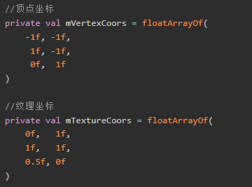

然后是实际的绘制的操作

- 让GPU按照你提供的数据和着色器，开始绘制图形，
  - GLES20.GL_TRIANGLE_STRIP：绘制方式（这里是三角带，适合画矩形）。
  - 0：从第0个顶点开始。
  - 3：总共绘制3个顶点（下面是4个顶点，为什么会有不同？）
  - 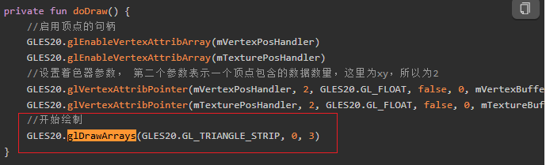

好，这就是一次的绘制了也就是一次draw的工作。

这是一帧的操作，可以我们1s钟要处理60帧啊，这个怎么处理呢？其实接下来每帧都会调用onDrawFrame，进行draw的工作，重复上面的流程。

- 如下
  - 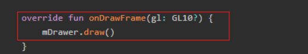
  - 

通过以上步骤，就可以在屏幕上看到一个红色的三角形了。

- 如下
  - 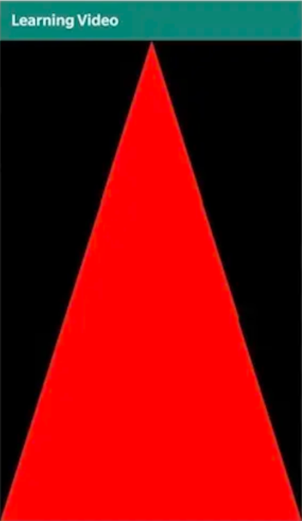

### 3.3 Android OpenGL ES_图片渲染流程

绘制三角形时我们只是直接在片元着色器里写死颜色值，并没有使用纹理。那么纹理到底有什么用呢？

当我们希望可以绘制一张图片的时候，就会用到纹理了。纹理可以用来把一张位图(Bitmap)的像素内容上传到 GPU，作为“采样源”，然后在片元着色器中根据纹理坐标读取颜色，就可以实现图片的显示

接下来，就用纹理来显示一张图片，看看纹理到底怎么使用。下面按照和上面像素渲染流程中相同的顺序拆解。

我们先看看之前被我们忽略的代码：

初始化纹理资源

- 我们再Surface创建阶段，使用createTextureIds创建了纹理ID，并使用setTextureID设置
  - 首先GLES20.glClearColor(0f, 0f, 0f, 0f)设置“清屏”时用的颜色（RGBA），这里是全透明黑色
  - GLES20.glClear(GLES20.GL_COLOR_BUFFER_BIT)，用上面设置的颜色清空屏幕。
  - 
- 看看createTextureIds，其通过GLES20.glGenTextures(count, texture, 0)，向OpenGL申请count个纹理ID，返回一个Int数组。glGenTextures会在GPU里分配纹理对象，并返回它们的编号（ID），后续所有纹理操作都要用这个ID。
  
  - 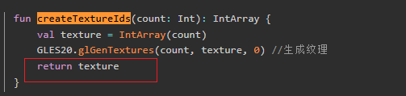
- 把生成的纹理ID保存到成员变量，后续绘制时会用到
  
  - 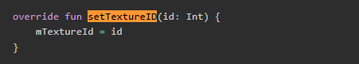
  
  > 搞不懂啊，我们返回的是一个int， 但是我们分配的是多个纹理ID。这怎么做到对应记录的呢？
  >
  > 因为这个只分配了一个纹理ID，如果你要多个，就会返回数组。你这里保存的也应该是数组的引用

接着是纹理状态下数据的准备

- 和三角形不同，这里需要一个**矩形**来显示整张图片：
- 顶点坐标
  - 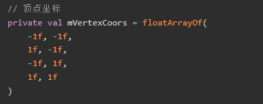
- 纹理坐标
  - 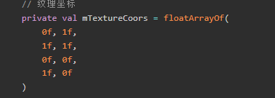
- 这里最终仍然需要通过 `FloatBuffer` 封装传给 GPU。
- 会不会好奇为什么坐标是这样的，就不能是0,1   0,0   1,1  1,0吗？我们回头再说

准备着色器

- 我们的顶点着色器和片元着色器和上面不一样

  - 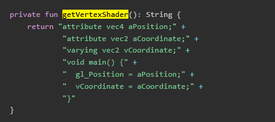
  - 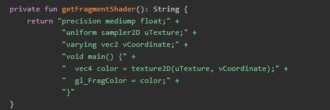

- 对应这一块代码

  - 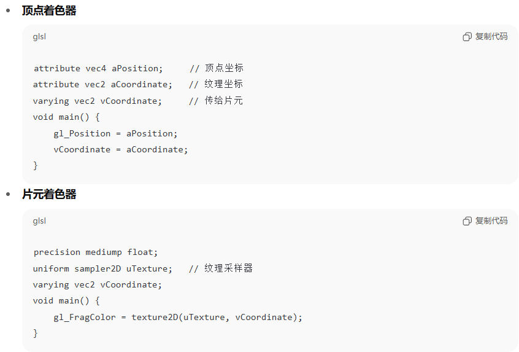

- 首先是顶点着色器

  - 每个顶点都会执行一次，比如你画一个矩形有4个顶点，这个main函数就会被执行4次。
  - aPosition：顶点位置，外部传入

  - aCoordinate：纹理坐标（同样由外部传入）

  - gl_Position：设置当前顶点的最终位置（必须赋值）

  - vCoordinate：用于把纹理坐标从顶点着色器“传递”到片元着色器。这里通过vCoordinate = aCoordinate，把坐标传了下去

- 然后是片元着色器，其负责决定每个像素（片元）的最终颜色

  - 每个像素（片元）都会执行一次，比如你画一个矩形，屏幕上有几万个像素，这个main函数就会被执行几万次。

  - uniform sampler2D uTexture：传入的2D纹理（外部绑定的图片/像素数据）

  - vCoordinate：插值后的纹理坐标（由顶点着色器传来，OpenGL自动为每个像素算出合适的坐标）。

  - vec4 color = texture2D(uTexture, vCoordinate)：用纹理坐标采样纹理，得到颜色

  - gl_FragColor：OpenGL规定的输出，决定这个像素最终显示什么颜色，这里 通过gl_FragColor = color输出颜色到屏幕
  
> 我们该怎么理解这样的一个过程？
  >
  > - 顶点着色器：
  >   - 对每个顶点（比如4个），输出屏幕位置和纹理坐标。
  >
  > - 光栅化（OpenGL自动完成）：
  >   - 把顶点组成的三角形“填充”为像素（片元），并为每个像素自动插值出纹理坐标。
  >
  > - 片元着色器：
  >   - 对每个像素，拿到插值后的纹理坐标，从纹理采样颜色，输出到屏幕
  >
  > 我很疑惑：为什么4个点可以控制整个图片？
  >
  > - OpenGL会自动根据4个顶点的纹理坐标，为每个像素“插值”出一个合适的纹理坐标，所以片元着色器不是只处理4个点，而是处理所有被三角形覆盖的像素。比如一个大矩形可能覆盖几万个像素，每个像素都会执行一次片元着色器。其坐标由OpenGL自动计算和填入。

编译和绑定着色器

- 创一个容纳GLSL的程序，然后把顶点着色器和片元着色器地方GLSL代码分别加入进去，接着把他们 “链接”成一个完整的渲染程序，最后编译成GPU能执行的程序
- 上面的这个过程和我们之前一样，因为其实我们只改变了顶点着色器和片元着色器的代码，最终同样是加入到GLSL程序中。
- 不过，我们这里要获取的属性的索引更多了，因为我们用到的更多了
- 顶点坐标，纹理坐标和纹理采样器
  - 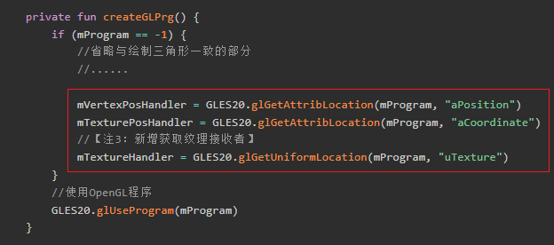

传入顶点和纹理数据

- 相对于之前的，我们要先进行两步初始化操作
  - 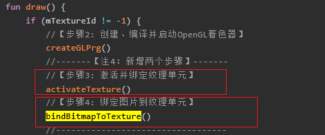
- 先看看activateTexture
  - 激活0号纹理单元
  - 把mTextureId这个2D纹理对象绑定到当前激活的纹理单元。
  - 把当前使用的纹理单元编号（这里是0，对应GL_TEXTURE0）传递给着色器中的uTexture，也就是让着色器知道要采样哪个纹理单元
  - 配置过滤与环绕
  - 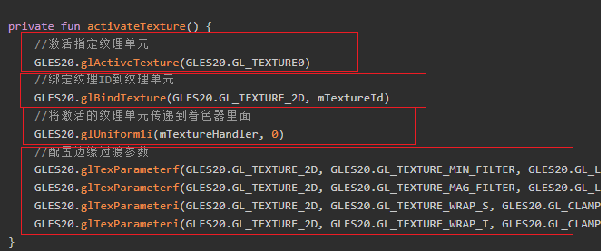
- 然后是bindBitmapToTexture
  - 上传 Bitmap 数据到 GPU，也就是我们之前的bitmap
  - 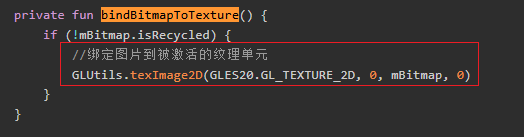

- 然后传入顶点与纹理坐标数据，和上面一致

绘制

- 绘制4个顶点
  - 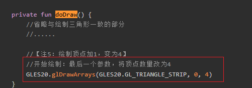

小结，流程如下

- 首先是CPU侧准备阶段
  - 创建Program：我们先**创建 Program**，编译 **顶点着色器** 与 **片元着色器**。`glAttachShader`、`glLinkProgram` 生成一个 GPU 可执行的 Program。
  - 然后**准备数据**，准备顶点坐标数组（屏幕位置，通常是标准化设备坐标 NDC）和 纹理坐标数组 (u,v)。并上传到 GPU 缓冲区：`glGenBuffers`、`glBufferData`。
  - 创建/绑定纹理：`glGenTextures`、`glBindTexture`，设置采样参数（缩放、环绕）。最后`glTexImage2D` 把图像数据bitmap加载到GPU中

- 然后是触发流程
  - 每一帧的渲染回调，最终调用glDrawArrays，触发GPU的绘制流程
  - 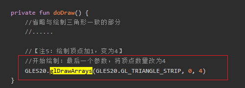
- 最后是GPU侧渲染流程
  - 先执行顶部着色器的代码，对每一个顶点执行一次。获取输入：顶点位置 + 纹理坐标。输出：裁剪坐标 `gl_Position` + 传递给下一阶段的 varyings（纹理坐标）。
    - 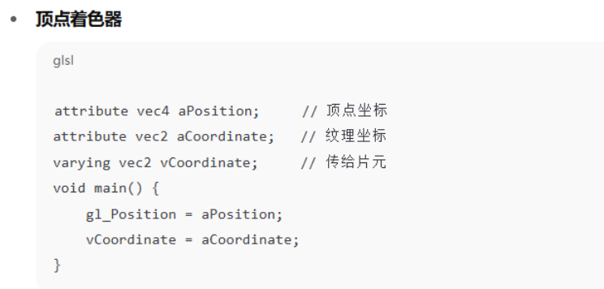
  - 着色器要先获取输入的数据
    - 我们这里配置了着色器的参数，其知晓从哪个位置取出数据
      - 
    - 这是我们的数据
      - 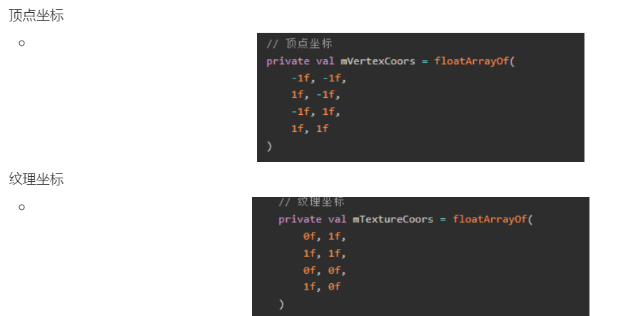
  - 顶点着色器拿到输入数据执行代码，他会构建一个几何图形表示渲染范围，同时把纹理坐标传递下去。
  - **图元装配 (Primitive Assembly)**：把 4 个点组装成 2 个三角形。
  - 光栅化 (Rasterization)：把三角形区域切成**屏幕像素网格**（片元）。对每个片元：自动做 **重心坐标插值**，算出该像素的纹理坐标 (u,v) 及其他 varying，然后输出给片元着色器。
  - **片元着色器 (Fragment Shader)**：获取光栅化结果当作输入，对每一个片元执行一次（可能是几十万次）。根据插值得到的 (u,v) 从纹理采样颜色：`texture2D(texture, uv)`。输出颜色给下一阶段。
  - 测试与混合 (Per-Fragment Operations)：深度测试、模板测试、Alpha 混合等。通过的像素写入 **帧缓冲 (Framebuffer)**
- 显示
  - GPU 把渲染完成的帧缓冲交给显示系统 (SurfaceFlinger / WindowSystem)。
  - 屏幕刷新时显示出来。

### 3.5 绘制模式

来吧，我们来理解一下这里的GLES20.GL_TRIANGLE_STRIP：绘制方式和3个顶点，以及和下面4个顶点的差异

- 首先是3个顶点绘制
  - 这是代码
  - 
  - 这是结果
  - 
- 然后是4个顶点绘制
  - 这是代码
  - 
  - 这是结果
  - 

还有啊，4个顶点绘制的时候他的数据是这样的

- 顶点坐标
  - 
- 纹理坐标
  - 
- 会不会好奇为什么坐标是这样的，就不能是0,1   0,0   1,1  1,0吗？我们回头再说

好啊，为什么会这样？

我们先来看第一个问题，绘制模式和3个，4个顶点的问题

OpenGL ES所有的画面都是由三角形构成的，比如一个四边形由两个三角形构成，其他更复杂的图形也都可以分割为大大小小的三角形。

因此，顶点坐标也是根据三角形的连接来设置的。其绘制方式有三种：

- GL_TRIANGLES：独立顶点的构成三角形
  - 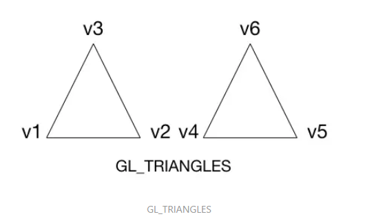
- GL_TRIANGLE_STRIP：复用顶点构成三角形
  -  
- GL_TRIANGLE_FAN：复用第一个顶点构成三角形
  - 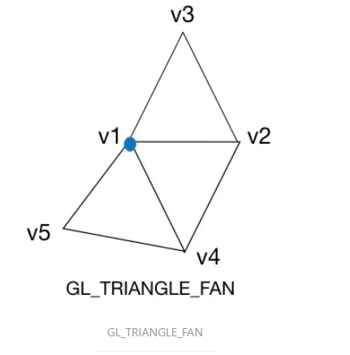

通常情况下，一般使用GL_TRIANGLE_STRIP绘制模式。那么一个四边形的顶点顺序看起来是这样子的（v1-v2-v3）（v2-v3-v4）

- 也就是下面的
  - 
  - 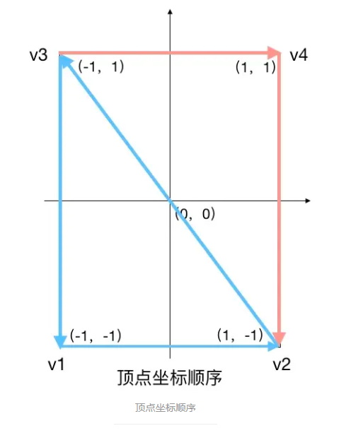

对应的纹理坐标也要和顶点坐标顺序一致，否则会出现颠倒，变形等异常

- 也就是下面的
  - 
  - 

## 04.底层原理

## 05.深度思考

### 5.1 关键问题探究

### 5.2 设计对比

## 06.实践验证

### 6.1 行为验证代码

### 6.2 性能测试

## 07.应用场景

### 7.1 最佳实践

### 7.2 使用禁忌

## 08.总结提炼

### 8.1 核心收获

### 8.2 知识图谱

### 8.3 延伸思考

## 09.参考资料

1. 
2. 
3. 

## 其他介绍

### 01.关于我的博客

- csdn：http://my.csdn.net/qq_35829566

- 掘金：https://juejin.im/user/499639464759898

- github：https://github.com/jjjjjjava

- 邮箱：[934137388@qq.com]

