[toc]

## 前言

> 学习要符合如下的标准化链条：了解概念->探究原理->深入思考->总结提炼->底层实现->延伸应用"

## 01.学习概述

- **学习主题**：
- **知识类型**：
  - [ ] ✅Android/ 
    - [ ] ✅01.基础组件与机制 
      - [ ] ✅四大组件
      - [ ] ✅IPC机制
      - [ ] ✅消息机制
      - [ ] ✅事件分发机制
      - [ ] ✅View与渲染体系（含Window、复杂控件、动画）
      - [ ] ✅存储与数据安全（SharedPreferences/DataStore/Room/Scoped Storage）
    - [ ] ✅02. 架构与工程化
      - [ ] ✅架构模式（MVC/MVP/MVVM/MVI）
      - [ ] ✅依赖注入（Koin/Hilt/Dagger）
      - [ ] ✅路由与模块化（ARouter、Navigation）
      - [ ] ✅Gradle与构建优化
      - [ ] ✅插件化与动态化
      - [ ] ✅插桩与监控框架
    - [ ] ✅03.性能优化与故障诊断
      - [ ] ✅ANR分析与优化
      - [ ] ✅启动耗时优化
      - [ ] ✅内存泄漏监控
      - [ ] ✅监控与诊断工具
    - [ ] ✅04.Jetpack与生态框架
      - [ ] ✅Room
      - [ ] ✅Paging
      - [ ] ✅WorkManager
      - [ ] ✅Compose
    - [ ] ✅05.Framework与系统机制
      - [ ] ✅ActivityManagerService (含ANR触发机制)
      - [ ] ✅Binder机制
  - [ ] ✅音视频开发/
    - [ ] ✅01.基础知识
    - [ ] ✅02.OpenGL渲染视频
    - [ ] ✅03.FFmpeg音视频解码
  - [ ] ✅ Java/
    - [ ] ✅01.基础知识
    - [ ] ✅02.集合框架
    - [ ] ✅03.异常处理
    - [ ] ✅04.多线程与并发
    - [ ] ✅06.JVM
  - [ ] ✅ Kotlin/
    - [ ] ✅01.基础语法
    - [ ] ✅02.高阶扩展
    - [ ] ✅03.协程和流
  - [ ] ✅ Flutter/
    - [ ] ✅01.基础基础语法
    - [ ] ✅02.状态管理
    - [ ] ✅03.路由与依赖注入
    - [ ] ✅04.原生通信
  - [ ] ✅ 自我管理/
    - [ ] ✅01.内观
  - [ ] ✅ 项目经验/
    - [ ] ✅01.启动逻辑
    - [ ] ✅02.云值守
    - [ ] ✅03.智控平台
- **学习来源**：
- **重要程度**：⭐⭐⭐⭐⭐
- **学习日期**：2025.
- **记录人**：@panruiqi

### 1.1 学习目标

- 了解概念->探究原理->深入思考->总结提炼->底层实现->延伸应用"

### 1.2 前置知识

- [ ] 

## 02.核心概念

### 2.1 是什么？

什么是GL？有什么作用？

- 我们先来弄清楚 OpenGL、GPU、EGL 和显示之间的关系。
  - 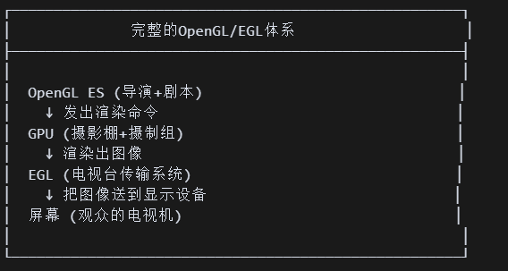
- ok，EGL其实就是把GPU渲染出的存放在显存中图像送到显示设备中

### 2.2 解决什么问题？

### 2.3 基本特性

## 03.原理机制

### 3.1 EGL中的核心概念

我们知道，EGL的职责是：负责和底层驱动连通，将图像从显存送到屏幕上显示。

考虑他的职责，他有如下主要概念

- EGLDisplay：EGLDisplay 是物理显示硬件在 EGL 中的逻辑连接，在Android上，它连接到SurfaceFlinger（系统合成器）
- EGLConfig：在创建Surface和Context之前选择，用于告诉系统你要什么最终的屏幕输出规格（也就是最终的屏幕渲染格式），系统给你匹配
  - 这里用户要求为configAttribs，然后从调用系统方法eglChooseConfig，系统根据你的需求，输出匹配的配置规格到configs中。然后这里用户直接选择了configs[0]
  - 

- EGLContext：他是OpenGL状态机的实例，保存shader、texture等OpenGL渲染时需要的GPU资源
  - 拥有资源池，OpenGl状态，绑定信息等。
  - 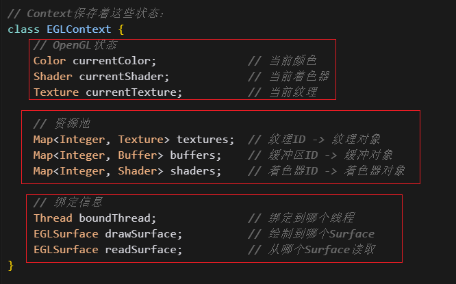
  - 举例，这是实际的使用
  - 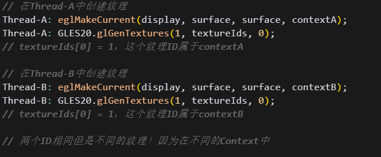
  - 默认情况下，资源属于单个Context。但是可以通过共享Context：可以让多个Context访问同一个资源池
- EGLSurface：很不好理解，我们要先看看三种不同的Surface概念
  - Android Surface (java层)：其实是一片位于系统内存中的共享内存缓冲区
    - 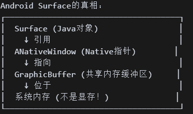
  - EGLSurface (EGL层)：他是对Android Surface的封装，他更像是一个配置对象。用于在EGL调用eglSwapBuffers交换前后缓冲时，告诉EGL，请把GPU显存的Framebuffer内容复制到 Android Surface对应的系统内存缓冲区
    - 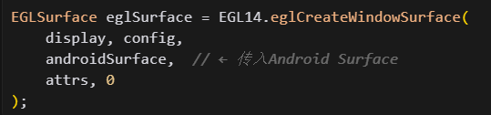
    - 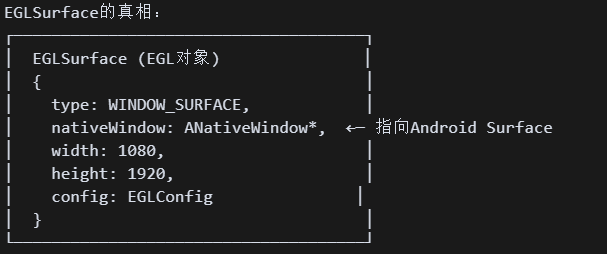
  - Framebuffer (GPU显存)：GPU真正的渲染目标
    - 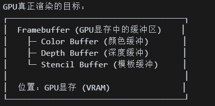

> 那么系统渲染的流程是什么样的呢？
>
> - 第一阶段：OpenGL渲染命令 → GPU执行
>   - 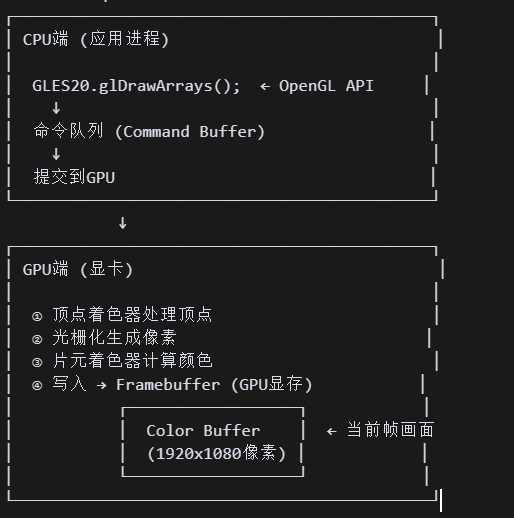
> - 第二阶段：eglSwapBuffers → 从显存到系统内存
>   - 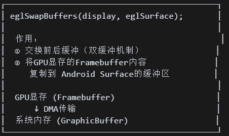
> - 第三阶段：SurfaceFlinger合成 → 显示到屏幕
>   - 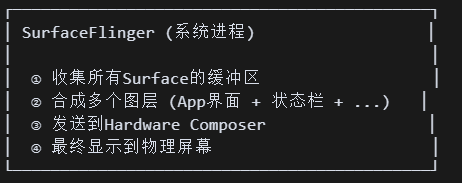
> - 这个渲染过程中存在三个画面
>   - 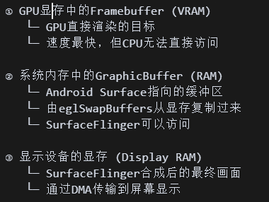

### 3.2 如何使用EGL？

我们先思考一个问题，带着问题去学习。

> 提问：如果同时有两个GLSurfaceView在渲染视频画面，OpenGL为什么能够正确的把画面分别绘制到两个GLSurfaceView中？
>
> 仔细回想一下OpenGL ES的每个API，有没有哪个API是指定当前画面是渲染到哪个GLSurfaceView的？没有！

我们先来看看实际开发中如何使用EGL，然后再看看对EGL的封装EGLCore，这样避免我们陷入到代码的细节中，而忽略了整体的流程

好，我们来看一个GLSurfaceView

- 他拥有一个GL渲染线程，一个用户的渲染器Renderer
  - 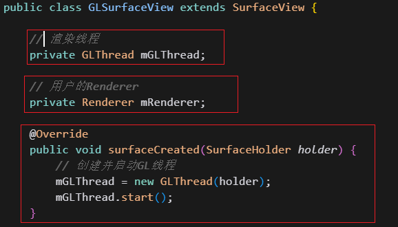

- 这是渲染线程的run方法，内部会初始化EGL的四个组件。然后将其和当前的线程绑定。并执行用户的期望的渲染操作。
  - 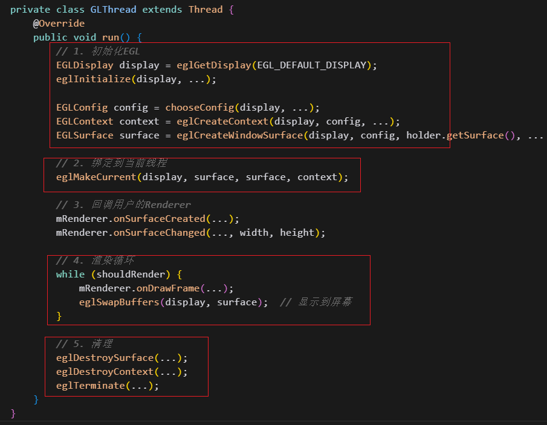
- 这是层次结构：GLSurfaceView封装了Renderer和GLThread，并底层封装了EGL
  - 

那么其完整的工作流程如下：

- 创建GLSurfaceView
  - 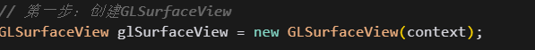
- 设置其渲染器
  - 在SurfaceCreated操作中初始化OpenGL，创建着色器，纹理等资源
  - DrawFrame中循环绘制
  - 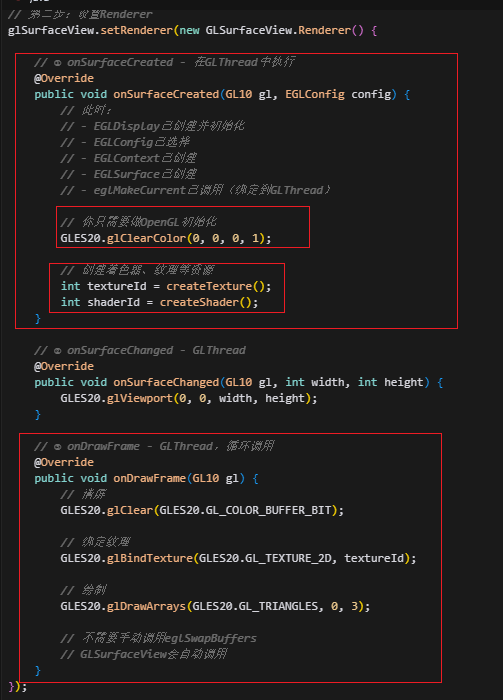
- 添加到布局，也就是使用它
  - 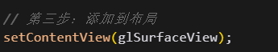
- 好，这是实际的执行过程。
  - 我们SurfaceCreated的时候创建GL线程，执行其run方法
  - 内部初始化EGL，执行Context和OpenGl线程的绑定
  - GL Thread渲染时，用户绘制，执行上面的系统渲染的流程。
  - 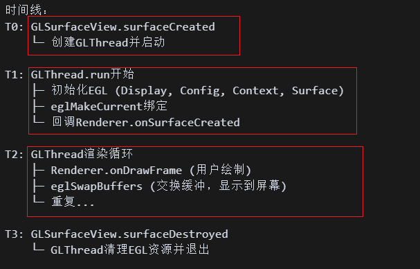

### 3.3 EGL的实际代码

好，我们来看看封装EGL核心API，内部涉及到如何初始化EGL四大组件，如何进行绑定等。

首先，对EGL初始化的核心（也就是上面介绍的EGL的核心知识）内容进行封装，命名为 EGLCore

我们先来看成员变量

- EGLDisplay ,EGLContext ,EGLConfig的引用
  - 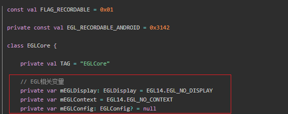

然后是init阶段，用于完成 EGL 初始化，最终得到可用的 `mEGLDisplay`、`mEGLContext`、`mEGLConfig`

- 预处理
  - 避免重复初始化：如果 `mEGLDisplay` 已经不是 `EGL_NO_DISPLAY`，说明 EGL 已经初始化过了。
  - 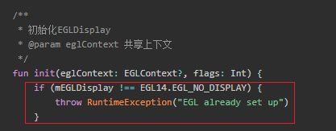
  - 处理共享上下文：`eglContext` 参数可以传入一个已存在的 `EGLContext`。如果传入 null，则使用 `EGL_NO_CONTEXT`。其用于允许多个 EGLContext 共享资源（纹理、缓冲等），常用于多线程渲染。
  - 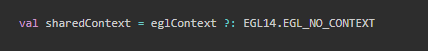
- 获取和配置mEGLDisplay
  - 创建Display：`eglGetDisplay` 用于获取默认显示设备的连接。如果返回 `EGL_NO_DISPLAY`，说明系统无法提供 EGLDisplay，需要抛异常。
  - 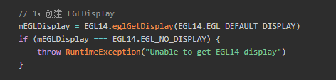
  - 初始化Display：`eglInitialize` 会初始化 EGL 并返回版本号（放在 `version[0]` 和 `version[1]`）。初始化失败则重置 `mEGLDisplay` 并抛出异常。
  - 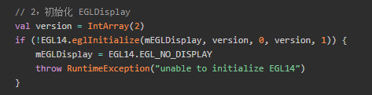

- 获取和配置`mEGLContext`和`mEGLConfig`

  - 检查是否已有 Context：只有 `mEGLContext` 是 `EGL_NO_CONTEXT` 才会创建新上下文。
  - 获取 EGLConfig调用下面讲的 `getConfig(flags, 2)`，选择符合条件的配置（颜色深度、版本、是否可录制），可以先跳到下面看。
  - attr2List设置 Context 属性：指定创建 OpenGL ES 2.0 上下文。`EGL_NONE` 表示属性列表结束。
  - 创建 Context：`mEGLDisplay`：已初始化的显示，`config`：选择好的配置，`sharedContext`：共享上下文，`attr2List`：上下文属性，返回一个新的 `EGLContext`。
  - 保存Config 和 Context
  - 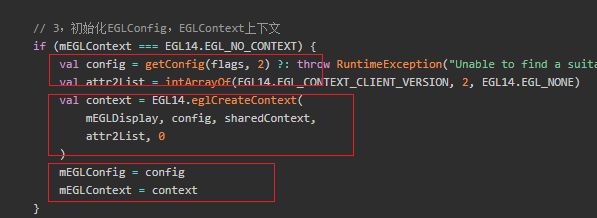

  

- 获取EGL配置信息：

  - `getConfig()` 就是**告诉系统我要 RGBA 各 8 位的颜色格式 + 至少 GLES2/可选 GLES3 + 可选可录制**，
     然后用 `eglChooseConfig` 找到最合适的配置并返回
  - 好，我们来看看内部的逻辑
  - `renderableType` 就是一组 bit 标志，告诉系统“我要能跑哪种 GLES 版本”。我们先确定EGLS版本，是2还是3
  - 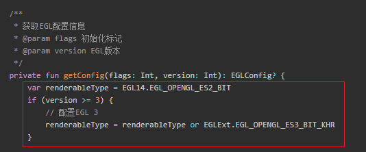
  - 准备属性列表，以`key, value` 形式。
  - `EGL_RED_SIZE, 8` 代表“红色通道 8bit”。绿色、蓝色、透明度同理。
  - EGL_NONE 结尾：EGL 要求属性列表一定以 `EGL_NONE` 作为结束标志。
  - `EGL_NONE, 0` 预留：数组倒数第 3、4 个位置空出来，为后面可选的录制标记占位。
  - 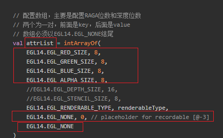
  - 如果需要可录制，也就是如果外部调用 `init` 时传入的 `flags` 包含 `FLAG_RECORDABLE`，就把刚才预留的那两格改成：Key：`EGL_RECORDABLE_A` Value：1. 
  - 这是 Android 特有的扩展，表示**这个 EGLSurface 可以直接交给 MediaCodec 进行硬件编码**（比如录屏、视频录制）。
  - 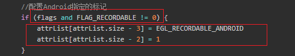
  - 让系统挑选配置
  - `eglChooseConfig` 会在系统支持的 EGL 配置表里筛选出**至少满足我们要求**的配置。
  - 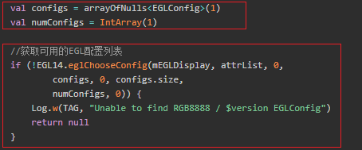
  - 对应如下
  - 
  - 返回结果：return configs[0]
  - 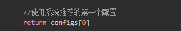

好了，我们init了我们的EGLDisplay，EGLConfig，，EGLContext了。但是我们好像遗落了我们的EGLSurface

我们的EGLSurface有两种创建方法：分别对应**可见窗口渲染**和**离屏渲染**

- 首先是窗口渲染
  - 参数必须是 Android 的 `Surface` 或 `SurfaceTexture`。
  - `surfaceAttr` 目前为空，仅以 `EGL_NONE` 结尾表示属性列表结束。
  - `eglCreateWindowSurface` 会创建一个 EGLSurface，绑定到 **显示设备的窗口**。
  - 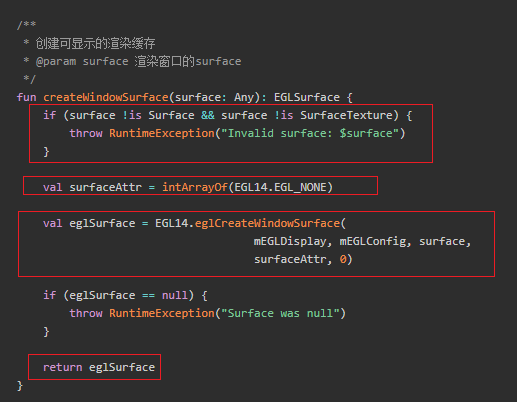
- 离屏渲染
  - **离屏渲染**没有绑定到屏幕窗口，而是创建一个内存中的缓冲区。所以不用绑定到Surface，也不用判断
  - `EGL_WIDTH` / `EGL_HEIGHT` 指定缓冲区大小。
  - 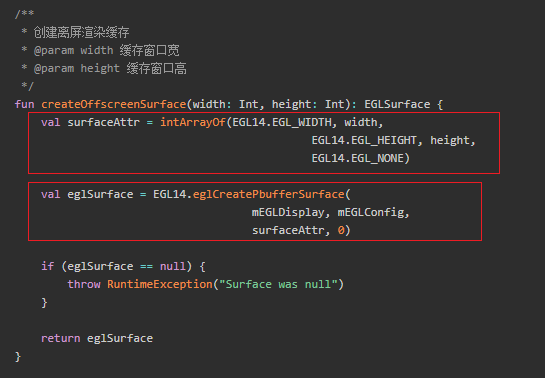
- 两者输出目标不同，一个是屏幕窗口，一个是内存缓冲区

> 怎么理解窗口渲染和离屏渲染？
>
> - 窗口渲染：就像你在画板上画画，大家都能看到。
>
> - 离屏渲染：就像你在草稿纸上画画，画完后再决定要不要展示给别人，或者用来做别的事情。
> - 我们需要离屏渲染，是因为有很多场景下，渲染的结果不是直接给用户看的，而是要保存、处理、编码、或者作为后续渲染的输入。这让 OpenGL 的能力不仅仅局限于“显示”，还能用于“处理”和“生成”各种图像数据。

绑定线程和表面

- 如下：
  - 检测是否初始化了EGLDisplay
  - 我们通过eglMakeCurrent，将mEGLDisplay, eglSurface, eglSurface, mEGLContext他们绑定起来。
  - 这样，我们的OpenGL ES线程执行的命令就会渲染到绘制表面 (drawSurface)上，这一步并没有最终将其显示出来
  - 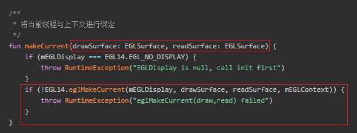

渲染控制

- 将渲染缓存（Back Buffer）提交到实际的硬件显示设备

  - 为什么是swap呢？这是因为EGL 的双缓冲机制
  - OpenGL ES 在 **后台缓冲区** 绘制，调用 `eglSwapBuffers` → 前后台缓冲交换，用户能看到最新渲染的帧
  - 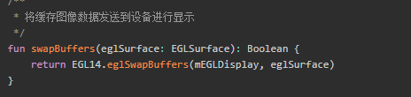

- 设置 当前帧的显示时间戳（纳秒）。

  - 我们知道我们之前在OpenGL中会设置他的播放时间
  - 但是这里是renderFrame（）后调用的，用于给画面打上“播放时间标签”
  - 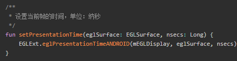

- 那么整个的逻辑是什么样的呢？

  - renderFrame
  - setPresentationTime
  - swapBuffers

最后是我们的EGL 资源清理和销毁阶段了

- 销毁EGLSurface，并解除上下文绑定

  - 先调用 `eglMakeCurrent(...EGL_NO_CONTEXT...)`：解除当前线程对该 Surface 的绑定，避免后续操作访问已销毁的 Surface
  - 调用eglDestroySurface销毁指定的 EGLSurface，释放它占用的 GPU / 显存资源。
  - 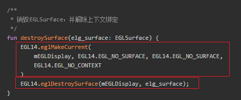

- 释放资源

  - 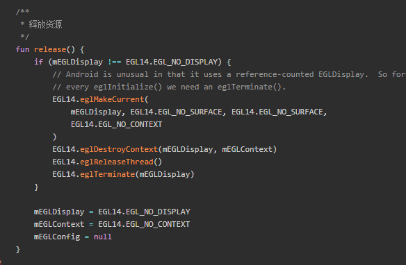

> 好啊，现在我们回过头来看看这个问题：如果同时有两个GLSurfaceView在渲染视频画面，OpenGL怎么知道在哪个线程中把内容画到哪个Surface上？
>
> 好，我们现在来构建一个场景
>
> - 两个线程都调用了 GLES20.glClearColor()，不过一个设置为红色，一个设置为绿色。OpenGL怎么知道要操作哪个Surface？
>   - 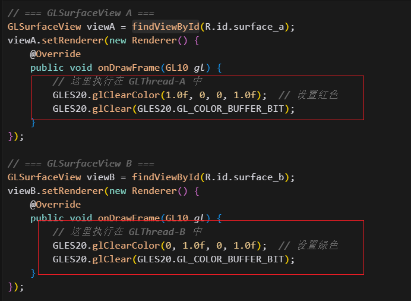
>
> 这依赖于`eglMakeCurrent，其底层原理，
>
> - 线程启动时的绑定过程
>   - 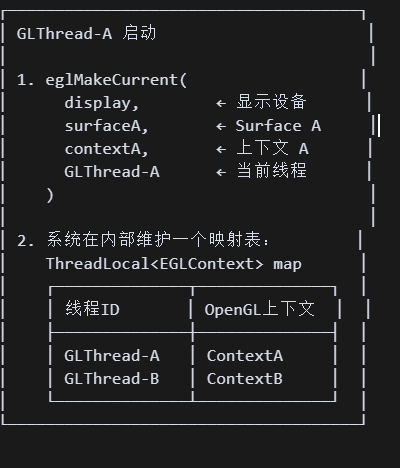
> - API调用时的自动切换：当你在 GLThread-A 中调用GLES20.glGenTextures(1, textureIds, 0);
>   - 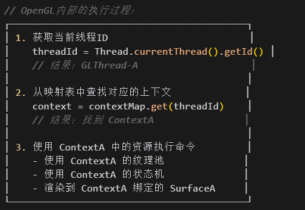
> - 所以，其本质是：contextA持有对应资源的引用，我们在对应线程中执行相应命令时，会通过线程ID找到对应的context并使用其持有的资源引用执行相关的命令。

3.4 

## 04.底层原理

## 05.深度思考

### 5.1 关键问题探究

### 5.2 设计对比

## 06.实践验证

### 6.1 行为验证代码

### 6.2 性能测试

## 07.应用场景

### 7.1 最佳实践

### 7.2 使用禁忌

## 08.总结提炼

### 8.1 核心收获

### 8.2 知识图谱

### 8.3 延伸思考

## 09.参考资料

1. 
2. 
3. 

## 其他介绍

### 01.关于我的博客

- csdn：http://my.csdn.net/qq_35829566

- 掘金：https://juejin.im/user/499639464759898

- github：https://github.com/jjjjjjava

- 邮箱：[934137388@qq.com]

