[toc]

## 前言

> 学习要符合如下的标准化链条：了解概念->探究原理->深入思考->总结提炼->底层实现->延伸应用"

## 01.学习概述

- **学习主题**：
- **知识类型**：
  - [ ] **知识类型**：
    - [ ] ✅Android/ 
      - [ ] ✅01.基础组件
      - [ ] ✅02.IPC机制
      - [ ] ✅03.消息机制
      - [ ] ✅04.View原理
      - [ ] ✅05.事件分发机制
      - [ ] ✅06.Window
      - [ ] ✅07.复杂控件
      - [ ] ✅08.性能优化
      - [ ] ✅09.流行框架
      - [ ] ✅10.数据处理
      - [ ] ✅11.动画
      - [ ] ✅12.Groovy
    - [ ] ✅音视频开发/
      - [ ] ✅01.基础知识
      - [ ] ✅02.OpenGL渲染视频
      - [ ] ✅03.FFmpeg音视频解码
    - [ ] ✅ Java/
      - [ ] ✅01.基础知识
      - [ ] ✅02.Java设计思想
      - [ ] ✅03.集合框架
      - [ ] ✅04.异常处理
      - [ ] ✅05.多线程与并发编程
      - [ ] ✅06.JVM
    - [ ] ✅ Kotlin/
      - [ ] ✅01.基础语法
      - [ ] ✅02.高阶扩展
      - [ ] ✅03.协程和流
    - [ ] ✅ Flutter/
      - [ ] ✅01.基础部分
    - [ ] ✅ 故障分析与处理/
      - [ ] ✅01.基础知识
    - [ ] ✅ 自我管理/
      - [ ] ✅01.内观
    - [ ] ✅ 业务逻辑/
      - [ ] ✅01.启动逻辑
      - [ ] ✅02.云值守
      - [ ] ✅03.智控平台
- **学习来源**：
- **重要程度**：⭐⭐⭐⭐⭐
- **学习日期**：2025.
- **记录人**：@panruiqi

### 1.1 学习目标

- 了解概念->探究原理->深入思考->总结提炼->底层实现->延伸应用"

### 1.2 前置知识

- [ ] 

## 02.核心概念

### 2.1 是什么？

Flutter是由Google开发，用于**跨平台应用开发（iOS、Android、Web、桌面）**。用于单一代码多平台运行。

那么我们有问题了，用H5不一样的吗？

Flutter可以直接编译为原生代码，避免桥接层开销，同时其自绘引擎保证跨平台UI完全一致

### 2.2 解决什么问题？

### 2.3 基本特性

**Flutter中的三棵树**：Flutter的渲染机制由三棵树组成：Widget Tree、Element Tree、Render Tree（渲染树）。

- 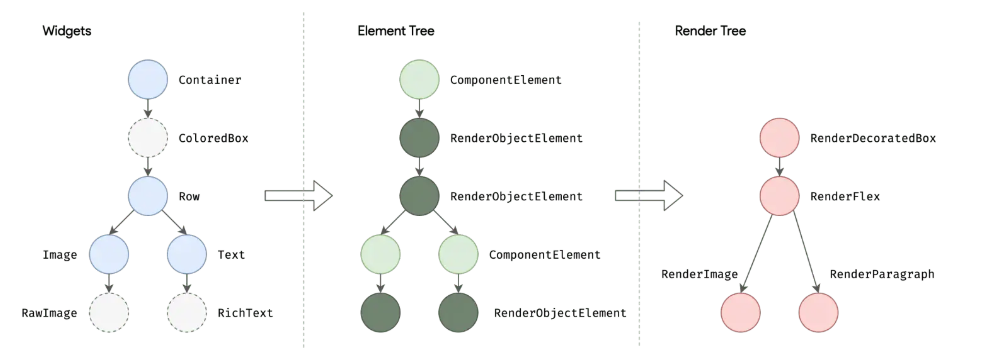

## 03.原理机制

### 3.1 widget介绍

Flutter 的核心理念："Everything is a Widget“

- 在 Flutter 中，一切皆 Widget：
  - 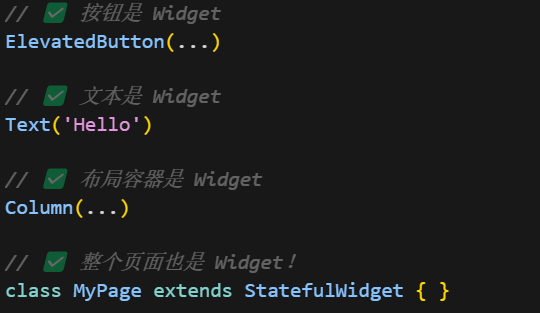

- 比如这里可以看到，页面也是一个Widget，他是一个StatefulWidget。
  - 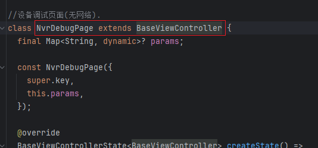
  - 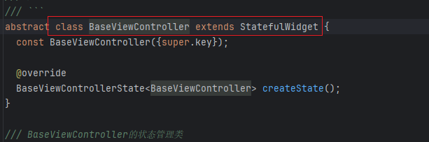

好，那么Widget本质是什么呢？

- Widget 不是真正的 UI 元素，而是UI 的配置信息：
- 我们通过下面声明了一个UI的配置，他拥有文本内容，然后文字的样式
  - 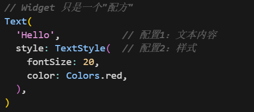

值得注意的是，Widget只是声明，距离真正的UI还有很长一段距离，他需要经过三棵树的变化才能最终被渲染出来。

### 3.2 Flutter 的三棵树架构

我们上面简单提到过**Flutter中的三棵树**，也就是Flutter的渲染机制由三棵树组成：Widget Tree、Element Tree、Render Tree（渲染树）

好，我们现在看一个例子，来说明这个三棵树。

- 这是代码：Scaffold包裹，内部是body，body通过buildContent创建出来。

  - 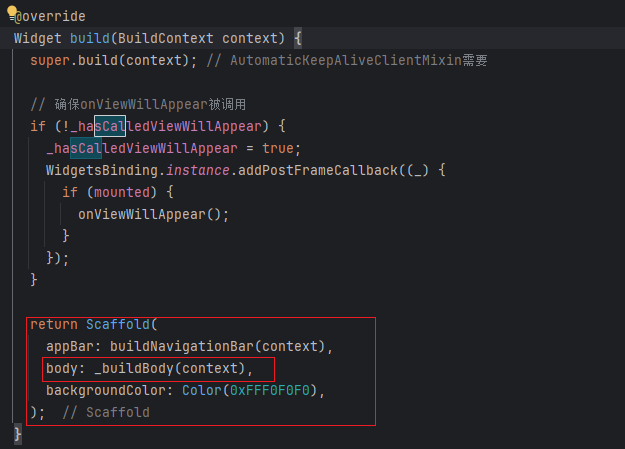
  - 这是其buildContent
- 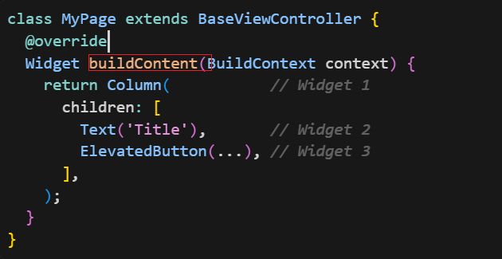
  
  > Scaffold 是什么？
  >
  > Scaffold 就是 Flutter 提供的一个页面结构模板
  >
  > - 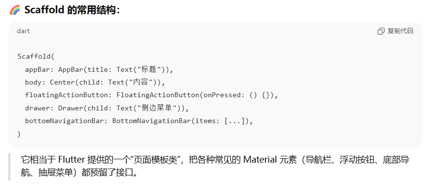

好，他对应的是下面的层次结构

- 对应下面3个树
  - 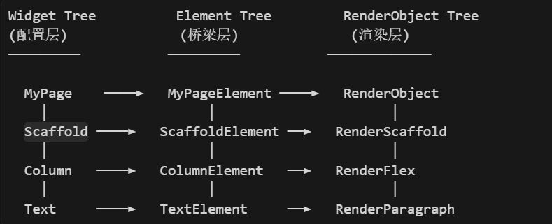

### 3.3 StatefulWidget 的渲染流程

好，我们看了一些基础知识了，接下来我们来看看其真正的底层的渲染流程是什么样的。

第一步：我们创建Widget对象

- 我们的下面的方法
  - 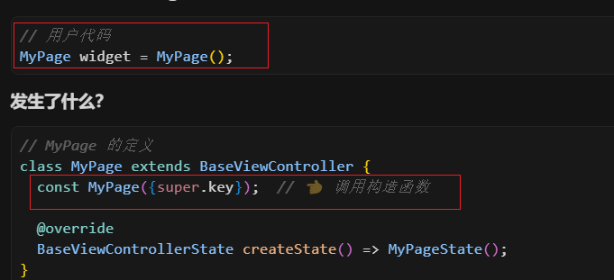
  - 这里调用 const MyPage() 可以复用同一个Key值相同的实例（性能优化）。
  - 好，这里我们创建的Widget 只是一个配置对象，非常轻量

第二步：Flutter 调用 createElement()

- 此时系统会自动创建一个与Widget对应的Element
  - 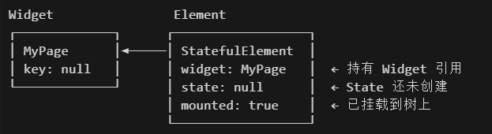
  - 其会持有Widget和State的引用，同时其自身会被添加到 Element Tree 中

第三步：Element 调用 widget.createState()

- Flutter执行的源码类似下面的，创建State，更新State的引用
  - 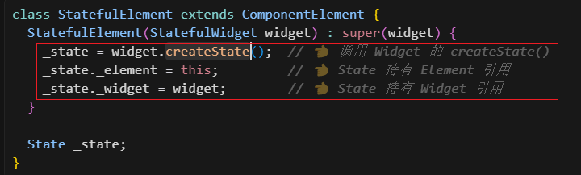
  - 这个创建就相当于
  - 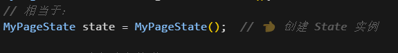
  - 其实创建的就是下面的State（不过这里是抽象类）
  - 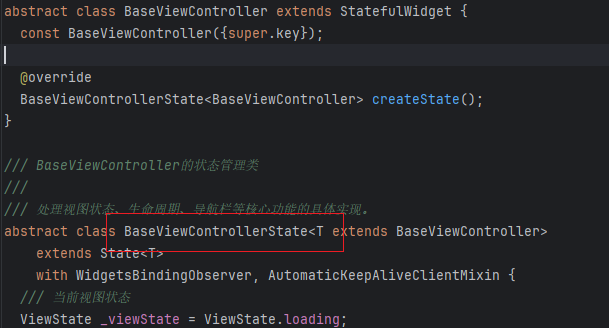
- 此时
  - 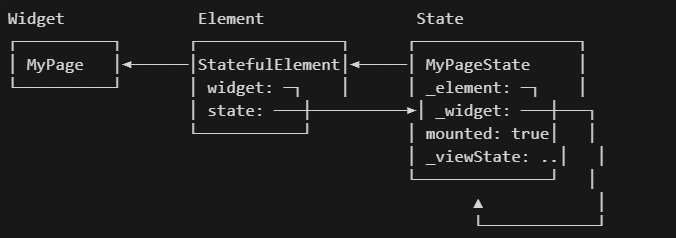
  - 这图有问题啊， 要记得：Element持有Widget。 和State。同时State持有Element和Widget。

第四步：State初始化

- StatefulElement中在createState后，会尝试调用_state.initState方法
  - 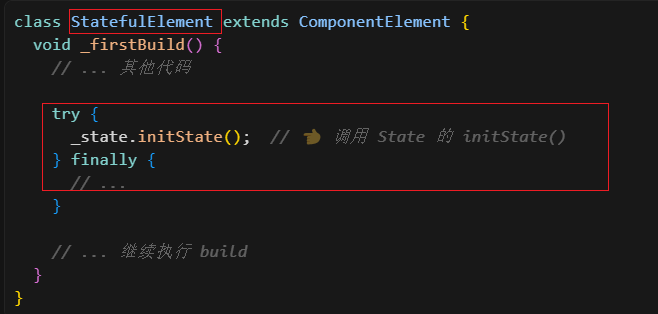
- 我们的代码中：加载数据，添加点击事件监听器等
  - 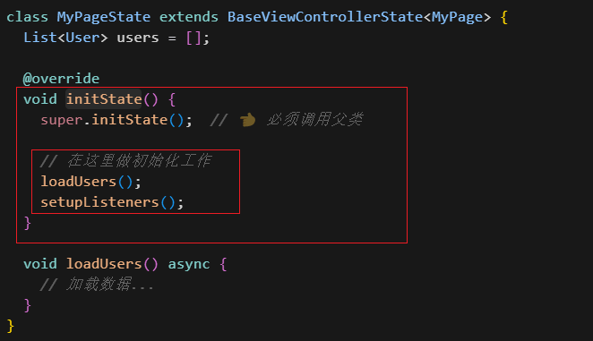
  - 父类执行：添加生命周期监听器并提供onViewDidLoad方法，供我们再第一帧加载出来时调用
  - 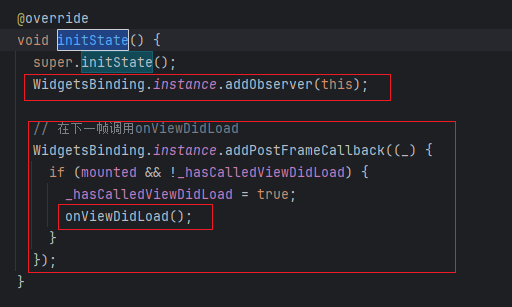
  - 

第五步：State 构建 UI（build）

- Flutter 源码（StatefulElement），调用state的build方法
  - 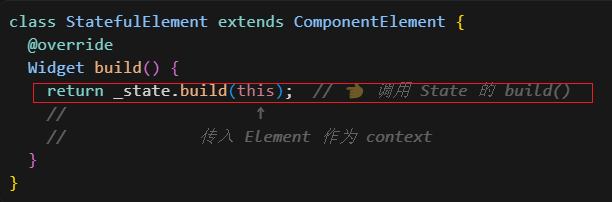
- 我的代码
  - 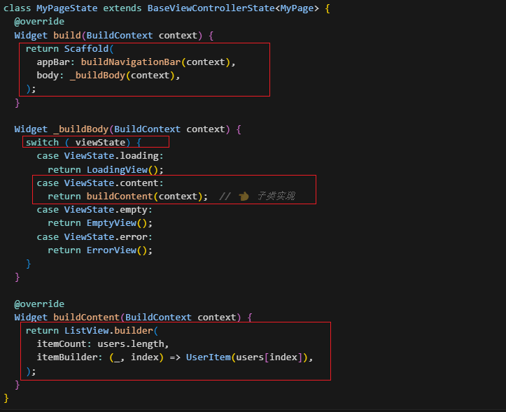
  - build方法返回一个 Widget 树，顶层是Scaffold。内部有AppBar和Body。
  - 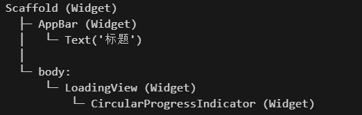

第五步：系统自动递归构建子Widget

- 我们上面构建的Body中是一个ListView，需要构建其子条目，也就是子Widget
- 这是伪代码，先构建了Scafflod这个Widget，然后递归构建其子Widget。
  - 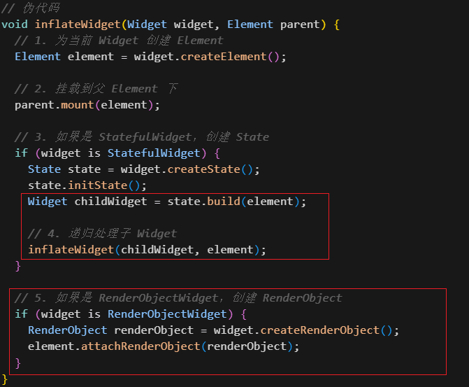
- 这就是其Element树
  - 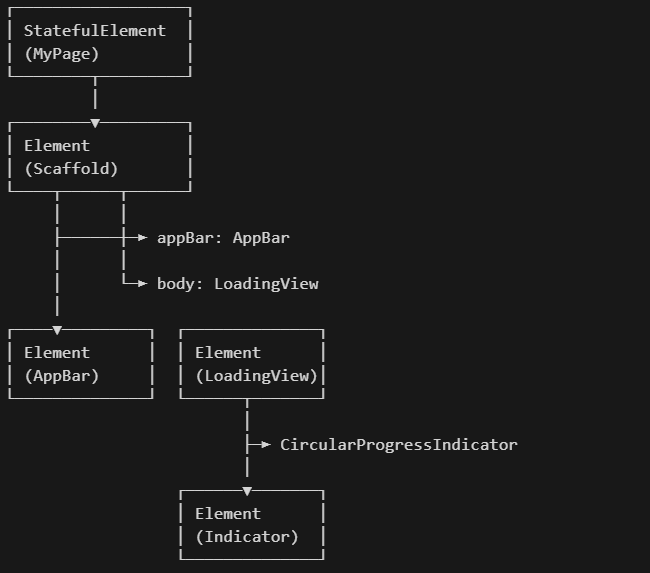

第七步：创建 RenderObject

- 我们注意到，上面第五步的伪代码中有一个关键判断，如果是 RenderObjectWidget ，那么会创建RenderObject
  - 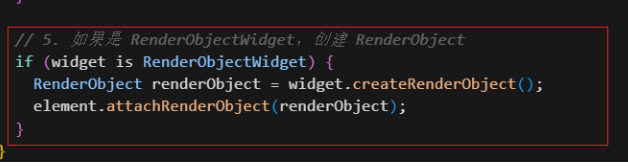
- 什么是RenderObjectWidget 呢？我们要看看Widget的分类
  - 哦，也就是说我们常见 的Column，Row等都是
  - 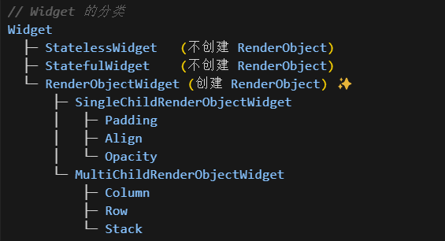
  - 注意：Widget和RenderObject不是一对一的关系。也就是说不是所有 Widget 都有 RenderObject
- 为什么会这样呢？
  - 因为 StatefulWidget/StatelessWidget 只是"组合 Widget"，不参与渲染。

第八步：布局和绘制

- 好，我们终于生成了我们的RenderObject树，接下来就是最终的绘制过程了。
- 我们主要调用下面的两个方法
  - 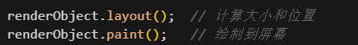
- 我们看看Layout
  - 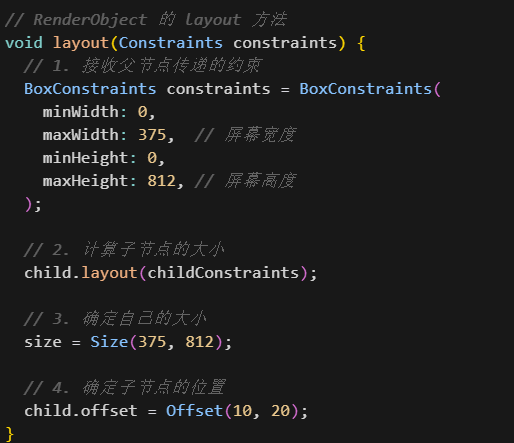
- 布局流程（从上到下传递约束，从下到上返回大小）：
  - 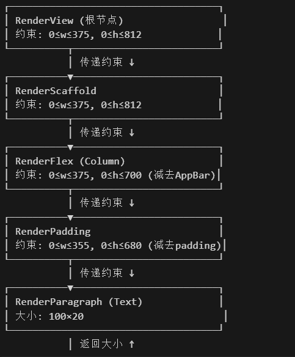

- 我们知道各个位置的大小和位置了，接下来就是绘制了
- 看看Paint阶段，没啥好说，先绘制自己，再绘制子节点
  - 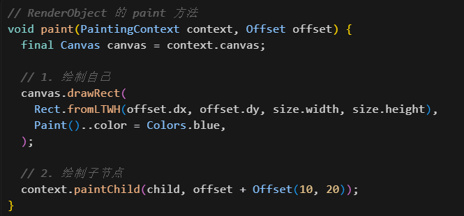

好，我们来看看小结

- 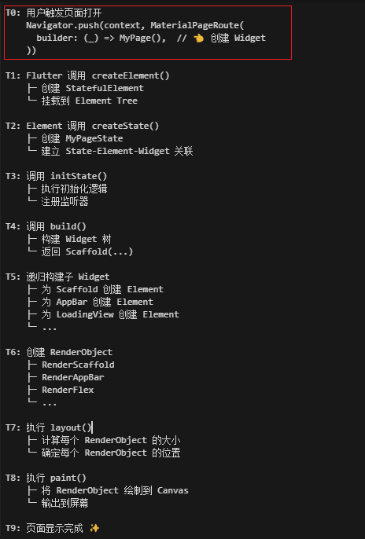

### 3.4 setState() 触发的更新流程

假如我们调用了setState

- 如下
  - 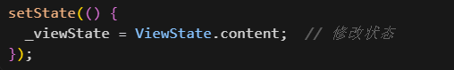

此时会全量更新，就是完全重新更新一遍吗？

不，不会这样的。

- 先是置为脏位，然后重新调用state.build创建Widget树。Element会对比新旧Widget树，如果Widget未变，则复用其对应的Element，否则创建新的Element。然后最后更新RenderObject，触发重新布局和绘制。
  - 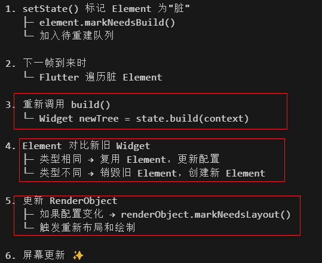

好，我们来细致的看一下。

第一步：我们代码中修改状态

- 触发状态的变更
  - 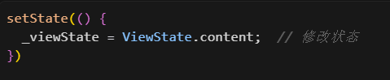

第二步：系统内部标记为脏（dirty）

- 标记为脏，假如到重建队列中
  - 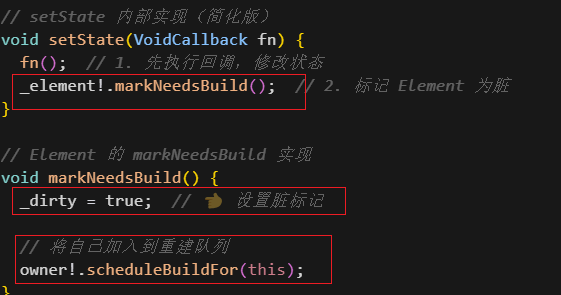
- 等价于
  - 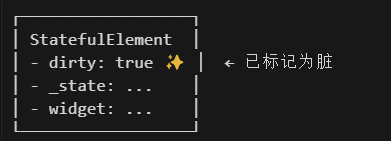

第三步：系统在下一帧时，重新调用build创建新的widget树

- 我们在这一阶段，调用State的build，创建了新的Widget树
  - 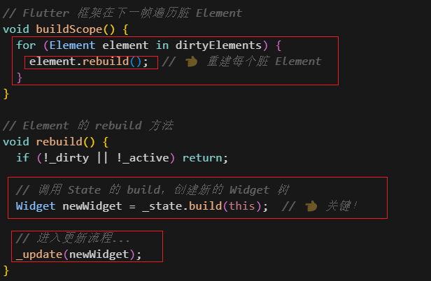

- 此时，对于我们下面的用户代码
  - 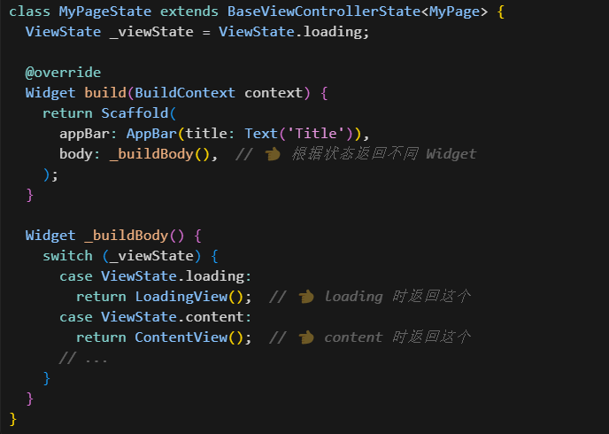
- 其Widget树更新为
  - 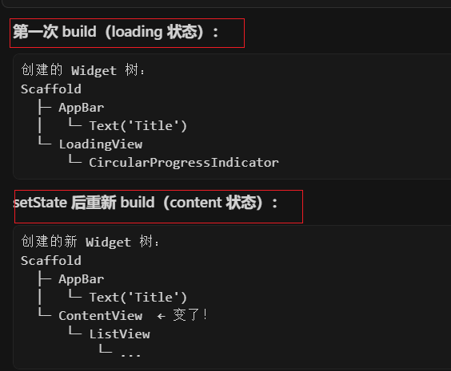

第四步：Element对比新旧Widget树

- 对比子树，复用条件（两个都要满足）：

  - runtimeType 相同   例如：都是 Text
  - key 相同       例如：都是 ValueKey('id1')

  - 如果满足 → 复用 Element，调用 update()

  - 如果不满足 → 销毁旧 Element，创建新 Element

第五步：决定复用或重建 Element

- 对于类型相同，key相同，复用其Element，只更新 RenderObject
  - 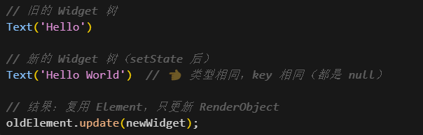
  - 这是内存变化
  - 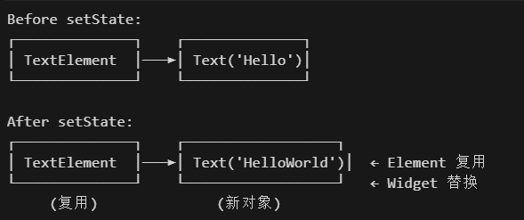

- 对于需要 重建的Element
  - 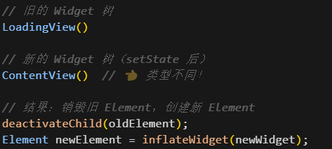
  - 其内存变化如下，从LoadingViewElement转变为ContentViewElement
  - 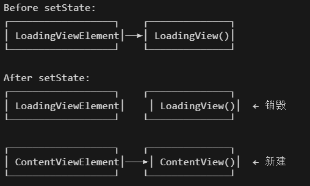

第六步：更新 RenderObject，触发布局和绘制

- 我们来到了我们的最后一步，也就是实际渲染对象的创建了
- 考虑第五步中的oldElement.update，其执行如下：
  - 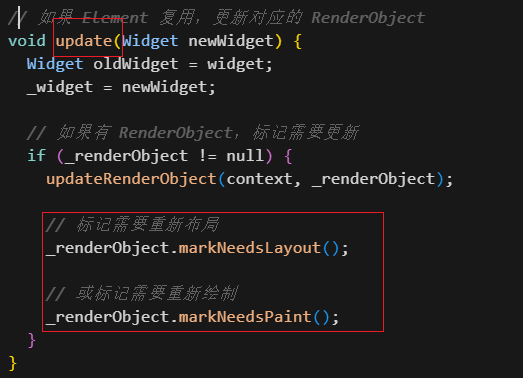

### 3.5 Question

Q1:build() 方法为什么会被多次调用？

- 因为 Widget 是不可变的，每次状态变化都需要创建新的 Widget 树。
  - 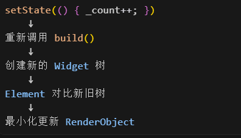

Q2:为什么不是所有 Widget 都有 RenderObject？

- 因为很多 Widget 只是"组合 Widget"，不需要真正渲染。
  - 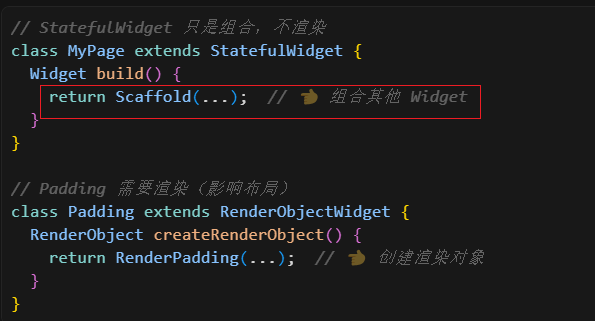

Q3：为什么要分成 Widget、Element、State 三个对象？

- 为了职责分离

  - | 对象    | 职责     | 生命周期                |
    | :------ | :------- | :---------------------- |
    | Widget  | 配置信息 | 短暂（频繁重建）        |
    | Element | 管理协调 | 长期（尽量复用）        |
    | State   | 状态数据 | 长期（与 Element 同步） |

## 04.底层原理

## 05.深度思考

### 5.1 关键问题探究

### 5.2 设计对比

## 06.实践验证

### 6.1 行为验证代码

### 6.2 性能测试

## 07.应用场景

### 7.1 最佳实践

### 7.2 使用禁忌

## 08.总结提炼

### 8.1 核心收获

### 8.2 知识图谱

### 8.3 延伸思考

## 09.参考资料

1. 
2. 
3. 

## 其他介绍

### 01.关于我的博客

- csdn：http://my.csdn.net/qq_35829566

- 掘金：https://juejin.im/user/499639464759898

- github：https://github.com/jjjjjjava

- 邮箱：[934137388@qq.com]

