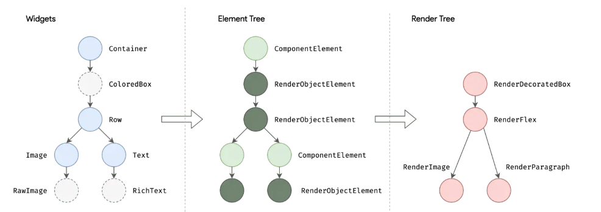

[toc]

## 前言

> 学习要符合如下的标准化链条：了解概念->探究原理->深入思考->总结提炼->底层实现->延伸应用"

## 01.学习概述

- **学习主题**：
- **知识类型**：
  - [ ] **知识类型**：
    - [ ] ✅Android/ 
      - [ ] ✅01.基础组件
      - [ ] ✅02.IPC机制
      - [ ] ✅03.消息机制
      - [ ] ✅04.View原理
      - [ ] ✅05.事件分发机制
      - [ ] ✅06.Window
      - [ ] ✅07.复杂控件
      - [ ] ✅08.性能优化
      - [ ] ✅09.流行框架
      - [ ] ✅10.数据处理
      - [ ] ✅11.动画
      - [ ] ✅12.Groovy
    - [ ] ✅音视频开发/
      - [ ] ✅01.基础知识
      - [ ] ✅02.OpenGL渲染视频
      - [ ] ✅03.FFmpeg音视频解码
    - [ ] ✅ Java/
      - [ ] ✅01.基础知识
      - [ ] ✅02.Java设计思想
      - [ ] ✅03.集合框架
      - [ ] ✅04.异常处理
      - [ ] ✅05.多线程与并发编程
      - [ ] ✅06.JVM
    - [ ] ✅ Kotlin/
      - [ ] ✅01.基础语法
      - [ ] ✅02.高阶扩展
      - [ ] ✅03.协程和流
    - [ ] ✅ Flutter/
      - [ ] ✅01.基础部分
    - [ ] ✅ 故障分析与处理/
      - [ ] ✅01.基础知识
    - [ ] ✅ 自我管理/
      - [ ] ✅01.内观
    - [ ] ✅ 业务逻辑/
      - [ ] ✅01.启动逻辑
      - [ ] ✅02.云值守
      - [ ] ✅03.智控平台
- **学习来源**：
- **重要程度**：⭐⭐⭐⭐⭐
- **学习日期**：2025.
- **记录人**：@panruiqi

### 1.1 学习目标

- 了解概念->探究原理->深入思考->总结提炼->底层实现->延伸应用"

### 1.2 前置知识

- [ ] 

## 02.核心概念

### 2.1 是什么？

Flutter是由Google开发，用于**跨平台应用开发（iOS、Android、Web、桌面）**。用于单一代码多平台运行。

那么我们有问题了，用H5不一样的吗？

Flutter可以直接编译为原生代码，避免桥接层开销，同时其自绘引擎保证跨平台UI完全一致

### 2.2 解决什么问题？

### 2.3 基本特性

**Flutter中的三棵树**：Flutter的渲染机制由三棵树组成：Widget Tree、Element Tree、Render Tree（渲染树）。

- 

- 三棵树介绍
  - 所有Widget组成Widget Tree。其描述UI结构，是不可变的配置。
  - 通过调用Widget的`createElement()`方法，创建Element Tree，其持有Widget和对应的RenderObject，是Widget实例化后的实体。
  - 每个Element调用 `createRenderObject()`形成Render Tree，Render Tree中的RenderObject负责渲染、布局、绘制。

- Widget Tree 与 Element Tree **一一对应**；
- Element Tree 与 Render Tree **不一定一一对应**，后者偏渲染优化。

## 03.原理机制

### 3.1 widget介绍

widget在Flutter中是  UI 的**配置描述**，而不是实际的渲染对象。他有如下特点：

- 是**不可变对象（immutable）**。
- 仅用于声明 UI 结构与属性（例如颜色、大小、布局等）。
- 不直接进行渲染，渲染依赖三棵树的后续处理（Widget Tree → Element Tree → Render Tree）

好的，我们来考量一下Android中的View体系。

- 在Android中：
  - 布局 XML 通过 `LayoutInflater` → 解析为 **View 对象树**。
  - **View** 是一个有状态的对象，持有属性、事件处理和绘制逻辑。
  - **ViewGroup** 也是 View，可以容纳其他 View。

- 所以，Android 的 View配合xml后 是 **声明+状态+渲染三合一**。

那么Flutter呢？

- 在Flutter中
  - **Widget** 仅是描述，也就类似xml的声明
  - `createElement()` 会生成 **Element Tree**，用于保存 Widget 与 RenderObject 之间的关系。
  - 最后 `createRenderObject()` 生成 **Render Tree**，才真正用于渲染。
- Flutter将 **声明（Widget）、状态（State/Element）、渲染（RenderObject）** 完全分离。

### 3.2 StatelessWidget 和 StatefulWidget

StatelessWidget

- 定义：UI 固定，不会因状态变化而更新。

StatefulWidget

- 定义：UI 会随状态变化而更新。
- 通过 `State` 保存可变数据，调用 `setState()` 触发 `build()` 重建。

### 3.3 BuildContext

- Flutter 的 `BuildContext`：
  - 代表 Widget 在 Widget 树中的位置。
  - 提供**向上查找父级 Widget** 的能力，例如 `context.findAncestorWidgetOfExactType<Scaffold>()`。
- Android 对应：
  - `Context`（Application/Activity/Service 等）本质是环境上下文，不记录 View 树关系。
  - 真正类似的是 `View.getParent()`、`View.getRootView()`、`View.findViewById()`，用于在 **View 树** 中查找父级/子级。

所以，Flutter 的 `BuildContext` 更接近 **View 树上下文** 而非 Android 的全局 `Context`。

### 3.4 State

- Flutter `State`：
  - 创建：`initState()`
  - 更新：`didUpdateWidget()`
  - 销毁：`dispose()`
  - 构建：`build()`
- Android View：
  - 构建：`onFinishInflate()` / 构造函数
  - 附着：`onAttachedToWindow()`
  - 绘制：`onDraw()`
  - 销毁：`onDetachedFromWindow()`

**对比：**

- Flutter `build()` ≈ Android `onDraw()`（但更接近于一次完整布局与渲染的声明式重建）。
- Flutter `setState()` ≈ Android `invalidate()`（触发重绘）。
- Flutter `didUpdateWidget()` ≈ Android `onLayout()` 之后更新状态的场景。

## 04.底层原理

## 05.深度思考

### 5.1 关键问题探究

### 5.2 设计对比

## 06.实践验证

### 6.1 行为验证代码

### 6.2 性能测试

## 07.应用场景

### 7.1 最佳实践

### 7.2 使用禁忌

## 08.总结提炼

### 8.1 核心收获

### 8.2 知识图谱

### 8.3 延伸思考

## 09.参考资料

1. 
2. 
3. 

## 其他介绍

### 01.关于我的博客

- csdn：http://my.csdn.net/qq_35829566

- 掘金：https://juejin.im/user/499639464759898

- github：https://github.com/jjjjjjava

- 邮箱：[934137388@qq.com]

