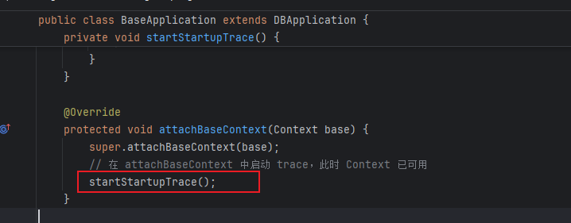
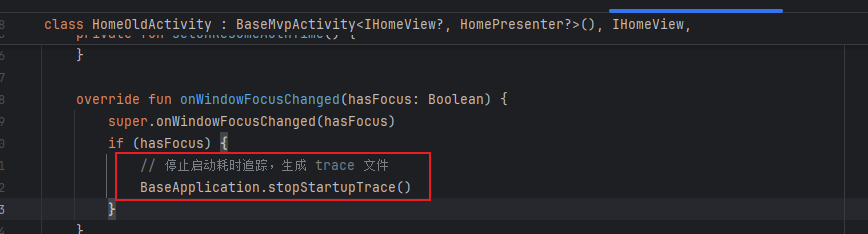
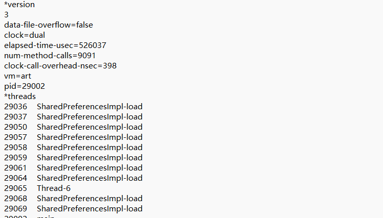
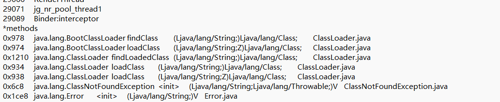
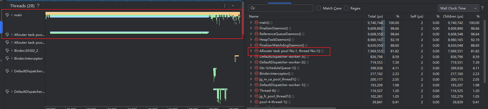
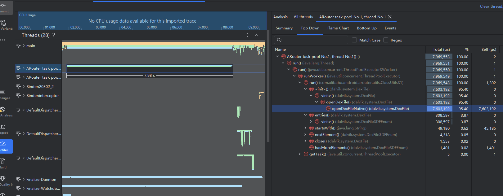
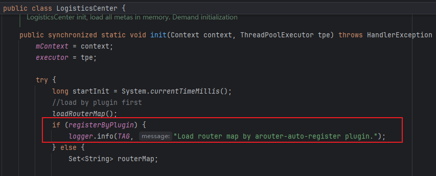
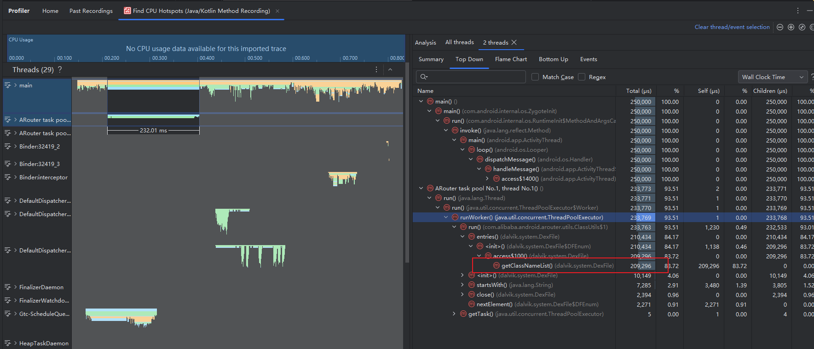
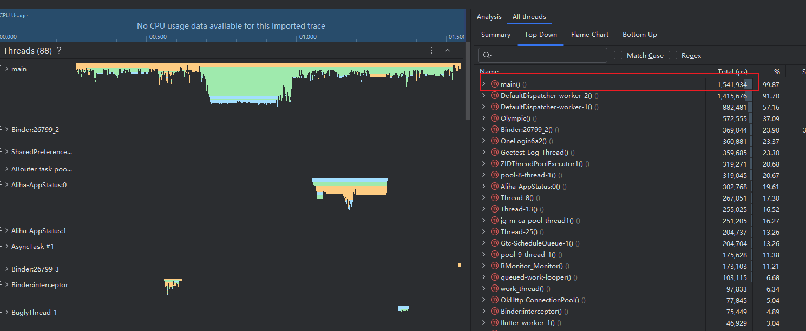

[toc]

## 01.功能概述

- **功能ID**：`FEAT-20260106-001`  
- **功能名称**：
- **目标版本**：v0.2.0
- **提交人**：@panruiqi  
- **状态**：
  - [x] ⌛ 设计中 /
  - [ ] ⌛ 开发中 / 
  - [ ] ✅ 已完成 / 
  - [ ] ❌ 已取消  
- **价值评估**：  
  - [x] ⭐⭐⭐⭐⭐ 核心业务功能  
  - [ ] ⭐⭐⭐⭐ 用户体验优化  
  - [ ] ⭐⭐⭐ 辅助功能增强  
  - [ ] ⭐⭐ 技术债务清理  
- **功能描述** 
  - 


## 02.需求分解

目的：深度理解需求，拆分出功能点

### 2.1 用户场景

- **主要场景**：  用户反馈启动速度很慢，希望优化启动速度。初步判断是冷启动耗时问题

### 2.2 功能需求提取

- 核心功能
  - 冷启动优化

## 03.冷启动耗时统计

狭义上的冷启动是指：用户点击到首帧渲染的时间，我们这里取用用户点击到HomeActivity成功加载并显示的时间。

### 3.1启动过程

```
用户点击图标
    ↓
Launcher 进程发送 Intent 给 AMS
    ↓
AMS 检查目标进程是否存在 → 不存在（冷启动）
    ↓
AMS 请求 Zygote fork 新进程
    ↓
Zygote fork 出 App 进程
    ↓
App 进程执行 ActivityThread.main()
    ↓
创建 Application 对象
    ↓
Application.attachBaseContext()  ← 你们开始追踪的位置
    ↓
Application.onCreate()
    ↓
启动目标 Activity
    ↓
Activity.onCreate() → onStart() → onResume()
    ↓
ViewRootImpl.performTraversals() 执行 measure/layout/draw
    ↓
首帧渲染完成
    ↓
onWindowFocusChanged(true)  ← 你们停止追踪的位置
```

分为系统部分和用户部分。

系统部分我们无法处理，我们只能从Application的attachBaseContext位置开始追踪，直到HomeActivity首帧渲染完成后调用onWindowFocusChanged位置停止。

### 3.2 用户启动过程统计

#### 1.添加冷启动耗时统计代码

- Application的attachBaseContext位置开始追踪

  - 

  - ```
    /**
         * 开始启动耗时追踪
         * 使用采样模式，减少对性能的影响
         * 只在主进程启动
         */
        private void startStartupTrace() {
            if (BuildConfig.DEBUG && !sStartupTraceStarted) {
                // 只在主进程启动 trace
                if (!isMainProcess()) {
                    KLog.d(TAG, "非主进程，跳过启动耗时追踪");
                    return;
                }
                try {
                    sStartupTraceStarted = true;
                    // 使用采样模式：文件最大8MB，采样间隔1000微秒
                    if (Build.VERSION.SDK_INT >= Build.VERSION_CODES.LOLLIPOP) {
                        // 使用外部存储目录，方便 adb pull
                        File externalDir = getExternalFilesDir(null);
                        if (externalDir == null) {
                            KLog.e(TAG, "启动耗时追踪失败: getExternalFilesDir 返回 null");
                            return;
                        }
                        File traceFile = new File(externalDir, "startup_trace.trace");
                        KLog.w(TAG, "═══════════════════════════════════════════════════════");
                        KLog.w(TAG, "启动耗时追踪开始！(主进程 PID: " + android.os.Process.myPid() + ")");
                        KLog.w(TAG, "trace文件路径: " + traceFile.getAbsolutePath());
                        KLog.w(TAG, "═══════════════════════════════════════════════════════");
                        Debug.startMethodTracingSampling(traceFile.getAbsolutePath(), 8 * 1024 * 1024, 1000);
                    }
                } catch (Exception e) {
                    KLog.e(TAG, "启动耗时追踪失败: " + e.getMessage());
                    e.printStackTrace();
                }
            }
        }
    ```

- HomeOldActivity的onWindowFocusChanged位置停止追踪。

  - 

  - ```
     /**
         * 停止启动耗时追踪
         * 在 HomeActivity.onWindowFocusChanged 中调用
         */
        public static void stopStartupTrace() {
            KLog.w(TAG, "stopStartupTrace 被调用, sStartupTraceStarted=" + sStartupTraceStarted + ", sStartupTraceStopped=" + sStartupTraceStopped + ", PID=" + android.os.Process.myPid());
            if (BuildConfig.DEBUG && sStartupTraceStarted && !sStartupTraceStopped) {
                try {
                    sStartupTraceStopped = true;
                    Debug.stopMethodTracing();
                    KLog.w(TAG, "═══════════════════════════════════════════════════════");
                    KLog.w(TAG, "启动耗时追踪已停止！");
                    KLog.w(TAG, "trace文件位置: /sdcard/Android/data/com.kedacom.ovopark/files/startup_trace.trace");
                    KLog.w(TAG, "导出命令: adb pull /sdcard/Android/data/com.kedacom.ovopark/files/startup_trace.trace");
                    KLog.w(TAG, "然后将 .trace 文件拖入 Android Studio 进行分析");
                    KLog.w(TAG, "═══════════════════════════════════════════════════════");
                } catch (Exception e) {
                    KLog.e(TAG, "停止启动耗时追踪失败: " + e.getMessage());
                    e.printStackTrace();
                }
            } else {
                KLog.w(TAG, "stopStartupTrace 条件不满足，未执行停止操作");
            }
        }
    ```

#### 2.追踪原理

所以，这里的关键就在于 `Debug.startMethodTracingSampling(traceFile.getAbsolutePath(), 8 * 1024 * 1024, 1000);` 和  `Debug.stopMethodTracing();`

方法签名

- ```
  Debug.startMethodTracingSampling(
      traceFile.getAbsolutePath(),  // 参数1: trace 文件保存路径
      8 * 1024 * 1024,              // 参数2: 缓冲区大小 (8MB)
      1000                          // 参数3: 采样间隔 (1000微秒 = 1毫秒)
  );
  ```

从 Java 层到 Native 层的调用链

- ```
  ┌─────────────────────────────────────────────────────────────────┐
  │                        Java Framework 层                         │
  │  Debug.startMethodTracingSampling()                             │
  │         ↓                                                        │
  │  VMDebug.startMethodTracingSampling()  (native method)          │
  └─────────────────────────────────────────────────────────────────┘
                                ↓ JNI 调用
  ┌─────────────────────────────────────────────────────────────────┐
  │                        Native 层 (C++)                           │
  │  dalvik_system_VMDebug.cc                                       │
  │         ↓                                                        │
  │  Trace::Start()                                                 │
  │         ↓                                                        │
  │  创建 Sampling Thread (采样线程)                                  │
  └─────────────────────────────────────────────────────────────────┘
                                ↓
  ┌─────────────────────────────────────────────────────────────────┐
  │                        ART Runtime                               │
  │  Sampling Thread 定时采集所有线程的调用栈                          │
  └─────────────────────────────────────────────────────────────────┘
  
  ```

采样模式核心原理

- 采样线程工作机制

  - ```
    ┌──────────────────────────────────────────────────────────────┐
    │                    Sampling Thread                            │
    │                                                               │
    │   while (tracing_enabled) {                                  │
    │       sleep(1000μs);  // 等待采样间隔                          │
    │                                                               │
    │       for (每个 Java 线程) {                                   │
    │           暂停线程;                                            │
    │           获取当前调用栈 (stack walk);                         │
    │           记录到 buffer;                                       │
    │           恢复线程;                                            │
    │       }                                                       │
    │   }                                                           │
    │                                                               │
    │   将 buffer 写入 .trace 文件                                   │
    └──────────────────────────────────────────────────────────────┘
    
    ```

- 调用栈采样过程：

  - 假设代码正在执行

  - ```
    main()
      └── Application.onCreate()
            └── initSDK()
                  └── ARouter.init()
                        └── ClassUtils.getFileNameByPackageName()  ← 采样时刻
    
    ```

  - 采样线程会记录这一瞬间的完整调用栈：

  - ```
    时间戳: 1000μs
    线程: main
    调用栈:
      [0] ClassUtils.getFileNameByPackageName()
      [1] ARouter.init()
      [2] initSDK()
      [3] Application.onCreate()
      [4] main()
    
    ```

- 采样数据的统计原理

  - 这就是为什么采样模式是估算而非精确测量。

  - ```
    采样次数 × 采样间隔 ≈ 方法执行时间
    
    例如：
    - ARouter.init() 被采样到 8000 次
    - 采样间隔 = 1000μs = 1ms
    - 估算耗时 = 8000 × 1ms = 8000ms = 8秒
    
    ```

采样模式 vs 追踪模式

- 如果是追踪模式

  - ```
    ┌─────────────────────────────────────────────────────────────┐
    │                    Tracing Mode                              │
    │                                                              │
    │   每个方法被 ART 插桩：                                        │
    │                                                              │
    │   void foo() {                                               │
    │       TRACE_METHOD_ENTER("foo");  // ART 自动插入             │
    │       ... 原始代码 ...                                        │
    │       TRACE_METHOD_EXIT("foo");   // ART 自动插入             │
    │   }                                                          │
    │                                                              │
    │   每次进入/退出都写入 buffer → 开销大                          │
    └─────────────────────────────────────────────────────────────┘
    
    ```

.trace 文件格式

- 生成的 .trace 文件是二进制格式，包含：

  - ```
    ┌─────────────────────────────────────────────────────────────┐
    │                    .trace 文件结构                           │
    ├─────────────────────────────────────────────────────────────┤
    │  Header                                                      │
    │  ├── magic number                                           │
    │  ├── version                                                │
    │  ├── 采样间隔                                                │
    │  └── 开始时间戳                                              │
    ├─────────────────────────────────────────────────────────────┤
    │  Method Table (方法表)                                       │
    │  ├── method_id_1 → "com/example/Foo.bar()V"                │
    │  ├── method_id_2 → "com/example/Baz.qux()I"                │
    │  └── ...                                                    │
    ├─────────────────────────────────────────────────────────────┤
    │  Thread Table (线程表)                                       │
    │  ├── thread_id_1 → "main"                                  │
    │  ├── thread_id_2 → "AsyncTask #1"                          │
    │  └── ...                                                    │
    ├─────────────────────────────────────────────────────────────┤
    │  Sample Records (采样记录)                                   │
    │  ├── [timestamp, thread_id, stack_depth, method_ids...]    │
    │  ├── [timestamp, thread_id, stack_depth, method_ids...]    │
    │  └── ...                                                    │
    └─────────────────────────────────────────────────────────────┘
    
    ```

  - 

  - 

  - Android Studio 的 Profiler 就是解析这个文件，然后可视化展示。

#### 2.结果查看

- 通过 adb shell am force-stop com.kedacom.ovopark进行完全关闭，然后点击直至app进入HomeOldActivity

- 生成trace文件，通过 adb pull /sdcard/Android/data/com.kedacom.ovopark/files/startup_trace.trace命令拉取到主机端。

- 查看火焰图
  - 
  - 
  - 我们可以注意到：整体时间9.74s。其中ARouter的openDexFileNative方法占据了7.603s。

#### 3.问题确认

这个方法是什么？

- 调用链路

  - ```
    ARouter.init()
        ↓
    LogisticsCenter.init() 
        ↓
    ClassUtils.getFileNameByPackageName()   ← 扫描所有 dex 文件
        ↓
    DexFile.<init>()
        ↓
    DexFile.openDexFile()
        ↓
    DexFile.openDexFileNative()   ← Native 方法，真正打开 dex 文件
        ↓
    DexFile.entries()             ← 遍历 dex 中所有类名
        ↓
    DexFile$DFEnum.nextElement()  ← 逐个获取类名
    
    ```

- openDexFileNative 是什么？

  - 这是一个JNI Native方法

  - ```
    // Java 层声明
    private static native Object openDexFileNative(
        String sourceName,           // dex 文件路径
        String outputName,           // odex 输出路径（可为 null）
        int flags,                   // 打开标志
        ClassLoader loader,          // 类加载器
        DexPathList.Element[] elements  // dex 路径列表元素
    );
    
    ```

  - 它的作用是：在 Native 层打开并解析 DEX 文件，返回一个可以用于类加载的句柄。

底层原理详解

-  DEX 文件是什么？

  - ```
    ┌─────────────────────────────────────────────────────────────┐
    │                      DEX 文件结构                            │
    ├─────────────────────────────────────────────────────────────┤
    │  Header (文件头)                                             │
    │  ├── magic: "dex\n035\0"                                   │
    │  ├── checksum                                               │
    │  ├── file_size                                              │
    │  └── 各区域偏移量                                            │
    ├─────────────────────────────────────────────────────────────┤
    │  String IDs (字符串索引表)                                   │
    │  ├── "com/alibaba/android/arouter/routes/ARouter$$Root"    │
    │  ├── "com/ovopark/xxx/Activity"                            │
    │  └── ...                                                    │
    ├─────────────────────────────────────────────────────────────┤
    │  Type IDs (类型索引表)                                       │
    ├─────────────────────────────────────────────────────────────┤
    │  Proto IDs (方法原型表)                                      │
    ├─────────────────────────────────────────────────────────────┤
    │  Field IDs (字段索引表)                                      │
    ├─────────────────────────────────────────────────────────────┤
    │  Method IDs (方法索引表)                                     │
    ├─────────────────────────────────────────────────────────────┤
    │  Class Defs (类定义表)  ← ARouter 需要遍历这个               │
    │  ├── class_idx: 指向类名                                    │
    │  ├── access_flags: public/private 等                       │
    │  ├── superclass_idx: 父类                                   │
    │  └── ...                                                    │
    ├─────────────────────────────────────────────────────────────┤
    │  Data (数据区)                                               │
    │  └── 字节码、注解、调试信息等                                 │
    └─────────────────────────────────────────────────────────────┘
    
    ```

- openDexFileNative 的执行流程

  - ```
    ┌─────────────────────────────────────────────────────────────────┐
    │                    openDexFileNative 执行流程                    │
    └─────────────────────────────────────────────────────────────────┘
                                  │
                                  ▼
    ┌─────────────────────────────────────────────────────────────────┐
    │  1. 打开文件                                                     │
    │     open("/data/app/com.kedacom.ovopark/base.apk", O_RDONLY)   │
    └─────────────────────────────────────────────────────────────────┘
                                  │
                                  ▼
    ┌─────────────────────────────────────────────────────────────────┐
    │  2. 内存映射 (mmap)                                              │
    │     将 DEX 文件映射到内存，避免全部读入                           │
    │     mmap(NULL, file_size, PROT_READ, MAP_PRIVATE, fd, 0)       │
    └─────────────────────────────────────────────────────────────────┘
                                  │
                                  ▼
    ┌─────────────────────────────────────────────────────────────────┐
    │  3. 验证 DEX 文件                                                │
    │     - 检查 magic number ("dex\n035\0")                         │
    │     - 验证 checksum                                             │
    │     - 验证文件结构完整性                                         │
    └─────────────────────────────────────────────────────────────────┘
                                  │
                                  ▼
    ┌─────────────────────────────────────────────────────────────────┐
    │  4. 解析 Header                                                  │
    │     - 读取各区域偏移量                                           │
    │     - 构建内部数据结构                                           │
    └─────────────────────────────────────────────────────────────────┘
                                  │
                                  ▼
    ┌─────────────────────────────────────────────────────────────────┐
    │  5. 创建 DexFile 对象                                            │
    │     - 返回一个 cookie (Native 指针)                             │
    │     - Java 层通过这个 cookie 访问 DEX 内容                       │
    └─────────────────────────────────────────────────────────────────┘
    
    ```

- 为什么 ARouter 调用这个方法很慢？

  - ```
    // 伪代码
    public static Set<String> getFileNameByPackageName(Context context, String packageName) {
        Set<String> classNames = new HashSet<>();
        
        // 1. 获取所有 APK/DEX 路径
        List<String> sourcePaths = getSourcePaths(context);
        
        // 2. 遍历每个 DEX 文件
        for (String path : sourcePaths) {
            DexFile dexFile = new DexFile(path);  // ← 调用 openDexFileNative
            
            // 3. 遍历 DEX 中的所有类名
            Enumeration<String> entries = dexFile.entries();
            while (entries.hasMoreElements()) {
                String className = entries.nextElement();
                
                // 4. 过滤出 ARouter 生成的类
                if (className.startsWith("com.alibaba.android.arouter.routes")) {
                    classNames.add(className);
                }
            }
            
            dexFile.close();
        }
        
        return
    
    ```

路由表是由注解处理器（RouteProcessor）在编译期生成的类文件，加载路由表，其实就是`加载 RouteProcessor 生成的类文件`。路由表的加载有两种方式：插件加载和 Dex 加载。

所以这里的问题就在于，在启动app时，进行运行时加载，此时会遍历打开每个dex文件，遍历dex中的所有类名，然后过滤出每个ARouter生成的类文件。

## 04.冷启动优化其一：Arouter优化

### 4.1 优化思路

我们可以怎么优化？

方案A：异步初始化 ARouter

- 既然插件不兼容，可以直接将 ARouter 初始化移到子线程：

  - ```
    // BaseApplication.onCreate() 中
    new Thread(() -> {
        ARouter.init(BaseApplication.this);
    }).start();
    ```

- 注意：需要确保在使用 ARouter 跳转前初始化完成。可以加一个标志位：

  - ```
    private static volatile boolean sARouterInited = false;
    
    // 初始化
    new Thread(() -> {
        ARouter.init(BaseApplication.this);
        sARouterInited = true;
    }).start();
    
    // 使用前检查
    public static void waitARouterInit() {
        while (!sARouterInited) {
            try { Thread.sleep(10); } catch (Exception e) {}
        }
    }
    ```

- 即使这样，预计耗时仍然高达8s左右。

方案B：我们可以通过插件进行编译时加载路由表

- ARouter.init() → LogisticsCenter.init()，在 LogisticsCenter 的 init() 方法中，会判断当前路由表加载方式是否为插件，不是的话则`从 Dex 中加载路由表`，是的话则`由插件从 Jar 中加载路由表`。
  - 

- 这是其原理：编译时执行字节码扫描和插桩
  - 字节码扫描
    - RegisterTransform.transform()会调用ScanClassVisitor.visit() 遍历所有 class 文件的字节码。

    - 找到所有实现了 IRouteRoot、IInterceptorGroup、IProviderGroup 接口的类（即注解处理器生成的路由表类）。

    - 把这些类名收集到 ScanSetting.classList
  - 字节码插桩

    - RegisterCodeGenerator.insertInitCodeIntoJarFile() 把收集到的路由表类名插入到 LogisticsCenter 的 loadRouterMap() 方法中。
    - 这样，ARouter 初始化时直接调用 loadRouterMap()，就能一次性注册所有路由表，无需再扫描 dex

### 4.2 优化流程

#### 1.第一层_使用方案二处理

build.gradle中引入arouter-register插件：`classpath "com.alibaba:arouter-register:1.0.2"`

报错：不兼容AGP8。

好的，接下来进入第二层，尝试解决这个arouter-register不兼容AGP8的问题

#### 2.第二层_方案 A：使用 ARouter 的 AGP8 兼容方案

在 app 模块 build.gradle 中，确保使用 kapt/annotationProcessor 即可，不需要额外插件。

ARouter 在 1.5.2+ 版本已经优化了初始化性能，即使不用 register 插件，也比之前快很多。


- 优化结果：ARouter降低至2.33s
  - 

#### 3.第二层_方案B：降级 AGP 版本

- 编译时多出报错，其他的项目要求高于AGP8

#### 4.第二层_方案C：引入兼容AGP8的arouter-register

地址：https://github.com/JailedBird/ArouterGradlePlugin/tree/main#

操作流程

- 根目录 build.gradle - 引入插件依赖：

  - ```
    buildscript {
        dependencies {
            // 引入插件 JAR
            classpath "com.github.JailedBird.ArouterGradlePlugin:arouter-gradle-plugin:v1.0.4"
        }
    }
    
    ```

- App 模块 ovoparkApp/build.gradle - 应用插件：

  - ```
    // 使用插件（只在 app 模块应用）
    apply plugin: 'io.github.JailedBird.ARouterPlugin'
    
    ```

问题：

- 但是编译到最后一步开始处理文件时显示：不支持Java21.

  - ```
    Unsupported class file major version 65
    at org.objectweb.asm.ClassReader.<init>
    ```

问题定位

- 问题定位
  - 看报错信息：Unsupported class file major version 65
  - 看堆栈：org.objectweb.asm.ClassReader.<init> → 问题出在 ASM 库
  - 查 ASM 版本支持：
    - ASM 9.4 → 支持到 Java 20 (version 64)
    - ASM 9.5+ → 支持 Java 21 (version 65)

- 问题根因

  - ```
    ovopark 项目 (Java 21 编译)
            ↓
    生成 .class 文件 (major version 65)
            ↓
    ARouter 插件扫描这些 .class 文件
            ↓
    使用 ASM 库的 ClassReader 读取
            ↓
    ASM 版本太旧，不认识 version 65
            ↓
    报错: Unsupported class file major version 65
    
    ```

  - 原版用的是 compileOnly("org.ow2.asm:asm:9.4")：ASM 9.4 最高支持 Java 20 (major version 64)；遇到 Java 21 的 class 文件就报错

为什么识别不了java21文件？

- .class 文件结构：每个 .class 文件开头都有固定格式：

  - ```
    ┌────────────────────────────────────────┐
    │  Magic Number: 0xCAFEBABE (4 bytes)    │  ← 标识这是 Java class 文件
    ├────────────────────────────────────────┤
    │  Minor Version (2 bytes)               │
    ├────────────────────────────────────────┤
    │  Major Version (2 bytes)               │  ← 这就是版本号！
    ├────────────────────────────────────────┤
    │  ... 后面是常量池、字段、方法等 ...      │
    └────────────────────────────────────────┘
    ```

- ASM 读取时的检查：ASM 的 ClassReader 源码大概是这样：

  - ```
    public ClassReader(byte[] classFile) {
        // 读取前 8 个字节
        int magic = readInt(0);        // 0xCAFEBABE
        int minorVersion = readShort(4);
        int majorVersion = readShort(6);  // 比如 65
        
        // 版本检查！
        if (majorVersion > MAX_SUPPORTED_VERSION) {
            throw new IllegalArgumentException(
                "Unsupported class file major version " + majorVersion
            );
        }
        // ... 继续解析
    }
    ```

- 为什么要检查？因为每个 Java 版本可能引入新的字节码指令或 class 文件结构，旧版 ASM 不知道如何解析这些新结构，强行解析可能导致错误结果，所以直接拒绝："我不认识这个版本，不处理"。

  - ```
    .class 文件头部写着: "我是 Java 21 编译的 (version 65)"
                    ↓
    ASM 9.4 读取后: "65? 我最高只认识 64，不干了！"
                    ↓
    抛出异常: Unsupported class file major version 65
    ```

好的，接下来进入第三层，尝试解决这个三方arouter-register不支持Java21的问题

#### 5.第三层：方案A：拉取三方库源码自己修改

第一步：定位问题

- 看报错信息：Unsupported class file major version 65
- 看堆栈：org.objectweb.asm.ClassReader.<init> → 问题出在 ASM 库
- 查 ASM 版本支持：
  - ASM 9.4 → 支持到 Java 20 (version 64)
  - ASM 9.5+ → 支持 Java 21 (version 65)

第二步：找到依赖位置

- 查看插件的 build.gradle.kts：

- ```
  dependencies {
      compileOnly("org.ow2.asm:asm:9.4")  // ← 这里版本太低
  }
  ```

第三步：修改源码

- 修改 1：升级 ASM 版本

  - ```
    // 改为
    implementation("org.ow2.asm:asm:9.7")
    ```

- 修改 2：compileOnly → implementation

  - 为什么？因为 Gradle 插件运行时用的是宿主环境的类，compileOnly 不打包进 JAR，运行时可能用到 Gradle 自带的旧版 ASM。

- 修改 3：更新 ASM API 常量（如果有）

  - 检查源码中是否有硬编码的 ASM API 版本：

  - ```
    // ScanUtils.kt / InjectUtils.kt
    ClassVisitor(Opcodes.ASM7, ...)  // 旧版
    ClassVisitor(Opcodes.ASM9, ...)  // 改为 ASM9，支持更高版本
    ```

第四步：重新发布：参考这个流程：https://blog.csdn.net/csdnzouqi/article/details/126490643

- commit到github仓库
- 发布一个新的tag的release版本
- 然后到jitpack上https://jitpack.io/#jjjjjjava/ArouterGradlePlugin。Get it。
- 经过远端处理成功后，就可以在项目中引入了。

总结：

- 这个问题的根因是 ASM 库版本太低，不支持 Java 21 的 class 文件格式。
- 解决方案是：
  - 升级 ASM 依赖到 9.7
  - 把 compileOnly 改成 implementation 确保打包进插件
  - 检查源码中硬编码的 Opcodes.ASM7 改成 ASM9
  - 重新发布插件"

### 4.3优化结果

问题背景

- "我们项目升级到 Java 21 后，ARouter 初始化耗时 8 秒，占启动时间的 82%。根因是运行时扫描 Dex 文件查找路由表类，非常耗时。"

解决方案：编译时插桩

- 测试环境是小米8手机

- "通过引入 ARouter 编译时插桩插件，ARouter.init() 耗时从 8 秒降到 100ms 以内，提升了 98%；整体冷启动从 9.4 秒优化到 1.54 秒，提升了 83%，启动速度快了 6 倍。"
  - 

原理说明（6 步）

- 插件入口：Gradle 构建时调用 PluginLaunch.apply()，只在 App 模块执行

- 注册 Transform：调用 registerTransform() 注册自定义的 RegisterTransform，Transform 是 AGP 提供的编译期字节码处理扩展点

- Transform 执行：拿到所有编译产物（jar 和 class 文件）

- 字节码扫描：

  - 用 ASM 的 ClassVisitor 遍历所有 class 文件
  - 找到实现 IRouteRoot、IInterceptorGroup、IProviderGroup 接口的类
  - 收集这些类名到列表中

- 字节码插桩

  - 把收集到的类名插入到 LogisticsCenter.loadRouterMap() 方法中

  - 生成类似这样的代码：

  - ```
    public static void loadRouterMap() {
        register("com.alibaba.android.arouter.routes.ARouter$$Root$$app");
        register("com.alibaba.android.arouter.routes.ARouter$$Root$$lib_common");
        // ... 所有路由表类
    }
    
    ```

- 运行时效果

  - ARouter.init() 直接调用 loadRouterMap()
  - 无需扫描 Dex，直接注册所有路由表

遇到的问题

- 原插件不支持AGP8.0，使用三方插件，但是用的 ASM 9.4 不支持 Java 21 字节码（major version 65），我 fork 后升级 ASM 到 9.7，并把 compileOnly 改成 implementation 确保打包进插件 JAR，解决了兼容性问题。"


## 05.代码优化

### 5.1 代码重构和规范检查

目的：移除冗余代码和注释；统一命名规范和代码风格；添加必要的文档注释


### 5.2 代码性能优化

目的：检查是否有不必要的重复计算；优化内存使用（避免内存泄漏）；优化UI渲染性能


### 5.3 安全性检查 

目的： 输入参数验证；异常边界处理；数据安全性检查


## 06.设计方案优化

### 6.1 检查是否有更优雅的实现方式


### 6.2 评估是否可以进一步复用现有组件


### 6.3 考虑未来扩展性（如果要加新的筛选条件）


### 6.4 检查用户体验的改进空间

## 07.测试验证

### 7.1 性能基准

- 页面加载时间：不超过原有基准+200ms
- 筛选响应时间：UI操作响应 < 100ms  
- 内存使用：新增功能内存占用 < 5MB
- 网络请求：不增加额外的API调用次数

### 7.2 风险控制

快速回滚预案：

- 功能开关：可以快速关闭新功能
- 数据回滚：本地存储格式向下兼容
- 代码回滚：保留可工作的上一版本

监控告警：

- API错误率异常告警
- 页面崩溃率监控
- 用户行为异常检测

数据埋点：

- 

## 08.文档记录

### 8.1 技术文档


### 8.2 用户文档

