[toc]

## 前言

> 学习要符合如下的标准化链条：了解概念->探究原理->深入思考->总结提炼->底层实现->延伸应用"

## 01.学习概述

- **学习主题**：
- **知识类型**：
  - [ ] ✅Android/ 
    - [ ] ✅01.基础组件与机制 
      - [ ] ✅四大组件
      - [ ] ✅IPC机制
      - [ ] ✅消息机制
      - [ ] ✅事件分发机制
      - [ ] ✅View与渲染体系（含Window、复杂控件、动画）
      - [ ] ✅存储与数据安全（SharedPreferences/DataStore/Room/Scoped Storage）
    - [ ] ✅02. 架构与工程化
      - [ ] ✅架构模式（MVC/MVP/MVVM/MVI）
      - [ ] ✅依赖注入（Koin/Hilt/Dagger）
      - [ ] ✅路由与模块化（ARouter、Navigation）
      - [ ] ✅Gradle与构建优化
      - [ ] ✅插件化与动态化
      - [ ] ✅插桩与监控框架
    - [ ] ✅03.性能优化与故障诊断
      - [ ] ✅ANR分析与优化
      - [ ] ✅启动耗时优化
      - [ ] ✅内存泄漏监控
      - [ ] ✅监控与诊断工具
    - [ ] ✅04.Jetpack与生态框架
      - [ ] ✅Room
      - [ ] ✅Paging
      - [ ] ✅WorkManager
      - [ ] ✅Compose
    - [ ] ✅05.Framework与系统机制
      - [ ] ✅ActivityManagerService (含ANR触发机制)
      - [ ] ✅Binder机制
  - [ ] ✅音视频开发/
    - [ ] ✅01.基础知识
    - [ ] ✅02.OpenGL渲染视频
    - [ ] ✅03.FFmpeg音视频解码
  - [ ] ✅ Java/
    - [ ] ✅01.基础知识
    - [ ] ✅02.集合框架
    - [ ] ✅03.异常处理
    - [ ] ✅04.多线程与并发
    - [ ] ✅06.JVM
  - [ ] ✅ Kotlin/
    - [ ] ✅01.基础语法
    - [ ] ✅02.高阶扩展
    - [ ] ✅03.协程和流
  - [ ] ✅ Flutter/
    - [ ] ✅01.基础基础语法
    - [ ] ✅02.状态管理
    - [ ] ✅03.路由与依赖注入
    - [ ] ✅04.原生通信
  - [ ] ✅ 自我管理/
    - [ ] ✅01.内观
  - [ ] ✅ 项目经验/
    - [ ] ✅01.启动逻辑
    - [ ] ✅02.云值守
    - [ ] ✅03.智控平台
- **学习来源**：
- **重要程度**：⭐⭐⭐⭐⭐
- **学习日期**：2025.
- **记录人**：@panruiqi

### 1.1 学习目标

- 了解概念->探究原理->深入思考->总结提炼->底层实现->延伸应用"

### 1.2 前置知识

- [ ] OpenGL：

## 02.核心概念

### 2.1 是什么？

前言：

- 我们回顾之前的流程，整个视频的播放流程是什么样的呢？
- 解码，渲染。我们前面看了解码了，我们有了对应的YUV帧，那么什么是渲染呢？
- 渲染本质就是计算出每个像素该用什么样的色彩（RGB）。好，也就是把我们解码出的YUV帧解析为RGB帧。这个很容易，就是简单的加减乘除运算，这是他们的换算公式
  - 

为什么要用OpenGL，OpenGL是什么？

- 我们上面的渲染当然可以用cpu，但是如果是1980 * 1080这种百万，千万级别的像素，用cpu处理起来就太慢了，就像几个大学生不断做乘除题目。  幸好我们有gpu，许多个小学生， 让他们做乘除题目。用GPU来进行渲染实现硬件加速。
- 我们跟cpu沟通容易，因为CPU可以直接执行机器语言（01指令），但GPU有自己专用的指令集，我们不能直接控制他们啊。OpenGL就是一个API，供我们访问控制GPU的API，我们可以通过他来控制GPU执行相关的渲染任务。


- 好，现在引出了OpenGL ES概念，其全称：OpenGL for Embedded Systems，是OpenGL 的子集，是针对手机 PAD等小型设备设计的，删减了不必须的方法、数据类型、功能，减少了体积，优化了效率。

我们知道OpenGL是我们控制GPU执行渲染操作的API，那么GPU的渲染过程是什么样的呢？

- 现代化的渲染流程如下
  - 顶点处理 (Vertex Processing）：核心是在屏幕上确定物体的几何形状。
  - 图元装配 (Primitive Assembly)：把顶点按渲染指令组合成图元（通常是三角形），比如一个矩形由两个三角形组成。
  - 光栅化 (Rasterization)：把几何形成切成一个个的细小的片元，每个片元对应屏幕上的一个像素候选。
  - 片元处理 (Fragment Processing / Pixel Shading)：在纹理坐标上取颜色。经过着色器计算最终片元颜色。
  - 测试与混合 (Tests & Blending)：判断该片元是否可见。根据需要丢弃部分片元。
  - 写入帧缓冲：通过上面的处理，最终可见的片元颜色写入屏幕（或 FBO）


### 2.2 解决什么问题？

如何和GPU通信，让其执行渲染的任务

### 2.3 基本特性


## 03.原理机制

### 3.1 基础知识_OpenGL ES坐标系

在音视频开发中，涉及到的坐标系主要有三个：Android屏幕坐标系，这是我们直观感受到的，手指触碰到的坐标系。然后是世界坐标和纹理坐标。

先来看看Android的屏幕坐标系

- 这是Android的屏幕坐标系，坐标原点在左上角

  - ```
    原点：左上角 (0, 0)
    X 轴：向右增长
    Y 轴：向下增长 ← 注意
    单位：像素（px）
    范围：[0, screenWidth] × [0, screenHeight]
    
    示例（1080×2340 屏幕）：
    ┌─────────────────────┐
    │(0,0)          (1080,0)│
    │                       │
    │      屏幕中心         │
    │     (540,1170)        │
    │                       │
    │(0,2340)    (1080,2340)│
    └─────────────────────┘
    ```

再来看看世界坐标系，也就是Android屏幕中各点在顶点处理时，OpenGL视角中的位置

- 如下：坐标原点在屏幕中心，那么屏幕中的540,1170；这里就是0,0
  - 

  - ```
    原点：中心 (0, 0)
    X 轴：向右增长
    Y 轴：向上增长 ← 注意：与 Android 相反！
    单位：归一化（无单位）
    范围：[-1, 1] × [-1, 1]
    
    示例：
    ┌─────────────────────┐
    │(-1,1)          (1,1) │
    │                       │
    │      原点 (0,0)       │
    │                       │
    │                       │
    │(-1,-1)        (1,-1) │
    └─────────────────────┘
    ```

再来看纹理坐标，纹理坐标就是Android屏幕中各点在片元处理时，OpenGL视角中的位置

- 纹理坐标：OpenGL ES 渲染时，有了要渲染的点后，还要知道要渲染的颜色，纹理坐标上的一个点代表在这个点渲染什么色彩。
  - 

### 3.2 GPU渲染流程

好，假设我们要绘制一个纯色的三角形，以其举例。

第一步：cpu侧首先得准备顶点坐标，纹理坐标和色彩数据三个数据（纯色的，不用贴图）

- 如下
  - 

第二步：数据要被送到GPU的显存中

第三步：顶点着色器接收数据，并进行相关处理，给出空间变化后的输出

- 这里gl_Position = a_Position是指不经过空间变化。如果经过空间变化，让其乘以矩阵即可。
  - 

第四步：GPU自身接收顶点着色器的输出数据，对其进行光栅化

- 光栅化负责把若干个顶点坐标切成成千上万个像素，并通过插值计算每个像素对应的纹理坐标（也就是其所拥有的颜色）类似这个
  - 

- 这是插值计算过程。
  - 
  - 

第五步：片元着色器渲染

- 上面把插值计算的纹理坐标送进来，对于每个像素，拥有其纹理坐标后，就可以从图片上取色，放置在对应的屏幕位置。这里我们有对应像素的屏幕位置，以及其需要的纹理坐标。我们只需要去纹理坐标中取色，然后放到屏幕的对应位置像素上即可
  - 
- 怎么就放到屏幕上了？举例理解一下吧，比如我们有一个GLSurfaceView，他其实就是SurfaceView + EGL。
  - Surface创建时，由SurfaceFlinger分配给Surface一连串的GraphicBuffer。（这个是公有的）
  - EGL会创建一个默认的FBO，FBO关联到这一连串的GraphicBuffer中，同时通过eglMakeCurrent于让OpenGL知道EGLContext以及GPU的最终渲染目标
  - 通过eglSwapBuffers告诉OpenGL控制GPU渲染数据到GraphicBuffer中
  - 渲染完成后，通过Binder告知SurfaceFlinger获取渲染结果，其会自动将它混合显示到屏幕上

提问：我觉得直接一个坐标系，存放1080 * 2340的数据，然后坐标上存放色彩是最好的选择，色彩值为空，代表不渲染这个点，存放色彩值代表渲染，这样效率不是更高吗？一个坐标系，既可以决定在哪渲染，也可以决定渲染什么色彩。

- 把“颜色直接存在世界坐标”中，实际上是在描述**整个屏幕每个像素的颜色**，也就是说你直接生成了最终渲染结果，这样相当于你放弃了矢量式的描述（顶点+纹理）以及其高效处理，直接提前生成最终像素。这不仅浪费内存（尤其在 4K、8K 时代），也失去 GPU 逐像素计算和重用的能力。
- GPU其实只需要少量几何数据+纹理，就可以通过光栅化将少量顶点组成的几何形状切分为几十万个像素，同时通过插值计算出他们的纹理坐标，并自动取样渲染。这个是GPU提供的能力。执行过程如下：
  - 
- 这是他们的对比
  - 

### 3.3 OpenGL 着色器语言 GLSL

OpenGL提供了API让我们可以一定程度上控制GPU。但是，如果我们想控制GPU执行我们自定义的程序，该如何处理呢？这就需要GLSL语言了。我们可以通过OpenGL提供的API去控制GPU执行我们希望执行的GLSL程序。

GLSL 类似 C 语言，但运行在 GPU 上。我们可以通过它来控制GPU“每个顶点怎么处理，每个像素怎么着色”。

我们要先理解两类着色器：顶点着色器和片元着色器，着色器本质就是代码

- 顶点着色器 (Vertex Shader)用在 **世界坐标系** 中，用于决定“顶点在屏幕上的位置”，可以做平移、旋转、缩放、投影等操作。
- 片元着色器 (Fragment Shader)对应 **纹理坐标系**，用于决定“每个像素显示什么颜色”，可以做纹理采样、光照、颜色混合。


我们来看看示例代码

- 顶点着色器
  - 在顶点着色器中，传入了一个vec4的顶点坐标xyzw，然后直接传递给内建变量gl_Position，即直接根据顶点坐标渲染，不做位置变换。
  - 
- 片元着色器
  
  - 在片元着色器中，直接给gl_FragColor赋值，依然是一个vec4类型的数据，这里表示rgba（Red，Green，Blue，Alpha透明度）颜色值，这里为完全不透明的红色。
  
  - 
  
- 这样，两个简单的着色器串联起来后，每一个片元（像素）都会被填充为红色，最后屏幕会显示一个红色的画面。

### 3.4 Android OpenGL渲染流程_其一：代码架构设计

好，我们先来简要看一下主要的渲染流程。在 Android 中，OpenGL ES 渲染主要流程如下：

- **初始化**：创建 GLSurfaceView 并设置渲染器（也就是生命周期回调）。
- 准备着色器相关代码和数据
  - **准备数据**：顶点坐标、纹理坐标、纹理 ID。
  - **准备着色器**：顶点着色器控制顶点位置，片元着色器控制像素颜色。
  - **编译和绑定着色器**：将 GLSL 代码编译、连接成程序并启用。
  - **传入顶点和纹理数据**：通过属性绑定到 GPU。
- 实际渲染
  - **循环渲染**：`onDrawFrame` 每帧回调执行，GPU 并行计算每个顶点和像素。
  - **绘制**：调用 `glDrawArrays` 或 `glDrawElements` 执行渲染。

我们先来看一下我们的需求：绘制一个红色的三角形

- 具体如下
  - 

好，我们怎么设计我们代码的架构呢？

- 架构如下

  - ```
    ┌─────────────────────────────────────────┐
    │  第1层：SimpleRenderActivity            │  ← 界面展示层
    │  职责：生命周期、资源管理、业务逻辑       │
    └──────────────┬──────────────────────────┘
                   │ 创建并配置
                   ↓
    ┌─────────────────────────────────────────┐
    │  第2层：SimpleRender (Renderer)         │  ← 协调层
    │  职责：响应OpenGL生命周期、协调绘制流程   │
    └──────────────┬──────────────────────────┘
                   │ 委托调用
                   ↓
    ┌─────────────────────────────────────────┐
    │  第3层：IDrawer 接口                     │  ← 抽象层
    │  职责：定义绘制器标准规范、解耦实现       │
    └──────────────┬──────────────────────────┘
                   │ 具体实现
                   ↓
    ┌─────────────────────────────────────────┐
    │  第4层：TriangleDrawer                  │  ← 实现层
    │  职责：准备数据、创建程序、执行绘制       │
    └─────────────────────────────────────────┘
    ```

- 第一层：SimpleRenderActivity + GLSurfaceView构成的界面展示层

  - 职责：提供Activity和View。同时初始化Surface以及EGL相关。并通过GL线程自动执行其绘制的整个生命周期

  - 这里的核心有两个

    - onCreate中的设计模式的 策略模式

    - ```
      drawer = if (intent.getIntExtra("type", 0) == 0) {
          TriangleDrawer()      // 绘制三角形
      } else {
          BitmapDrawer(...)     // 绘制位图
      }
      ```

    - 初始化渲染器

    - ```
      private fun initRender(drawer: IDrawer) {
          gl_surface.setEGLContextClientVersion(2)  // 使用OpenGL ES 2.0
          gl_surface.setRenderer(SimpleRender(drawer))  // 设置渲染器
      }
      ```

    - 这里的setRenderer是重中之重

- 第二层：SimpleRender（渲染协调层）

  - 职责：响应GLSurfaceView的生命周期回调

  - 设计理念：他通过自身的三大核心回调控制渲染的整个流程。Renderer只负责协调，不负责具体绘制，其通过委托模式将绘制任务交给Drawer

  -  onSurfaceCreated - 一次性初始化

    - ```
      override fun onSurfaceCreated(gl: GL10?, config: EGLConfig?) {
          GLES20.glClearColor(0f, 0f, 0f, 0f)  // 设置清屏颜色（黑色透明）
          GLES20.glClear(GLES20.GL_COLOR_BUFFER_BIT)  // 清空颜色缓冲区
          mDrawer.setTextureID(OpenGLTools.createTextureIds(1)[0])  // 创建纹理ID
      }
      ```

  -  onSurfaceChanged - 尺寸适配

    - ```
      override fun onSurfaceChanged(gl: GL10?, width: Int, height: Int) {
          GLES20.glViewport(0, 0, width, height)  // 设置视口大小
      }
      ```

  - onDrawFrame - 持续渲染

    - ```
      override fun onDrawFrame(gl: GL10?) {
          mDrawer.draw()  // 委托绘制器执行绘制
      }
      ```

- 第三层：IDrawer（绘制抽象层）

  - 职责：这一层定义统一的绘制的能力

  - 能力如下：

    - ```
      interface IDrawer {
          fun draw()                    // 执行绘制
          fun setTextureID(id: Int)    // 设置纹理ID
          fun release()                // 释放资源
      }
      ```

  - 设计模式：通过这个接口我们可以实现：1. 策略模式，不同绘制策略可互换。 2.委托模式，Renderer委托Drawer执行绘制。

  - 此时，假如我们想实现不同的绘制策略，那么更改为不同接口实现即可

    - ```
      Renderer ───依赖──→ IDrawer接口
                            ↑
                            │ 实现
                ┌───────────┼───────────┐
                │           │           │
         TriangleDrawer  BitmapDrawer  VideoDrawer
      ```

- 第四层：TriangleDrawer（具体实现层）

  - 职责：负责实际的顶点和纹理数据准备，顶点和纹理着色器程序创建，实际的绘制执行。
  - 具体的代码，我们后面结合着说。

我们现在有几个问题。疑问一：Surface、SurfaceView、GLSurfaceView的关系？疑问二：setRenderer到底做了什么？我们逐个来解答

疑问一：Surface、SurfaceView、GLSurfaceView的关系

- Surface本质是对BufferQueue的封装，BufferQueue是一个GraphicFrame队列。内部的每pop出来的一个都是一个GraphicFrame，可以存储一帧
  - 本质是跨进程的共享内存
  - 他是生产者-消费者模型，生产者：应用进程（Canvas/OpenGL绘制）。消费者：SurfaceFlinger（合成显示）
  - 通过Binder进程可以通知SurfaceFlinger读取数据显示到屏幕上
  - 

- SurfaceView 是持有独立的Surface引用的View。他独立窗口层，不在View树绘制流程中，其使用子线程绘制，不阻塞主线程。

- GLSurfaceView继承SurfaceView，在其基础上封装了GLThread - 独立的渲染线程，EGLHelper - 自动管理EGL上下文，Renderer回调 - 标准化生命周期。（这个详细的我们要在setRenderer中看），如下

  - ```
    class GLSurfaceView : SurfaceView {
        // 继承自 SurfaceView，拥有独立 Surface
        
        // 新增的核心功能：
        private var mGLThread: GLThread  // 独立的 OpenGL 渲染线程
        private var mEGLHelper: EGLHelper  // EGL 上下文管理器
        private var mRenderer: Renderer  // 用户自定义渲染器
    }
    ```

- GLSurfaceView做了什么额外的事情？

  - 手动使用EGL的代码

  - ```
    // 如果不用 GLSurfaceView，你需要这样写：
    val eglDisplay = EGL14.eglGetDisplay(EGL14.EGL_DEFAULT_DISPLAY)
    val config = chooseEGLConfig(eglDisplay)
    val eglContext = EGL14.eglCreateContext(eglDisplay, config, ...)
    val eglSurface = EGL14.eglCreateWindowSurface(eglDisplay, config, surface, ...)
    EGL14.eglMakeCurrent(eglDisplay, eglSurface, eglSurface, eglContext)
    
    // ... OpenGL 绘制 ...
    
    EGL14.eglSwapBuffers(eglDisplay, eglSurface)  // 交换缓冲区
    ```

  - GLSurfaceView 封装后

  - ```
    // 只需要这两行！
    glSurfaceView.setEGLContextClientVersion(2)
    glSurfaceView.setRenderer(renderer)
    ```

  - 这里的核心是setRenderer。

疑问二：setRenderer到底做了什么？

- 简要看看源码

  - ```
    // GLSurfaceView.java (简化版)
    public void setRenderer(Renderer renderer) {
        checkRenderThreadState();  // 检查不要重复设置
        
        // 【步骤1】保存 Renderer 引用
        mRenderer = renderer;
        
        // 【步骤2】创建并启动 GLThread
        mGLThread = new GLThread(mThisWeakRef);
        mGLThread.start();  // ← 这里启动了渲染线程！
    }
    ```

- GLThread 的工作流程呢

  - ```
    // GLThread.java (简化版)
    class GLThread extends Thread {
        @Override
        public void run() {
            try {
                // ═══════════════════════════════════
                // ✅ 步骤1：初始化 EGL
                // ═══════════════════════════════════
                mEglHelper = new EGLHelper();
                mEglHelper.start();  // 创建 EGL Display
                
                // ═══════════════════════════════════
                // ✅ 步骤2：创建 OpenGL 上下文和 Surface
                // ═══════════════════════════════════
                mEglHelper.createGL();  
                // 内部执行：
                // - eglChooseConfig()
                // - eglCreateContext()
                // - eglCreateWindowSurface()
                // - eglMakeCurrent()
                
                // ═══════════════════════════════════
                // ✅ 步骤3：首次回调 onSurfaceCreated
                // ═══════════════════════════════════
                mRenderer.onSurfaceCreated(gl, mEglHelper.mEglConfig);
                
                // ═══════════════════════════════════
                // ✅ 步骤4：回调 onSurfaceChanged
                // ═══════════════════════════════════
                mRenderer.onSurfaceChanged(gl, mWidth, mHeight);
                
                // ═══════════════════════════════════
                // ✅ 步骤5：进入渲染循环
                // ═══════════════════════════════════
                while (true) {
                    if (mPaused) {
                        mEglHelper.finish();  // 暂停时释放 EGL
                        wait();  // 等待恢复
                        continue;
                    }
                    
                    if (sizeChanged) {
                        mRenderer.onSurfaceChanged(gl, w, h);
                        sizeChanged = false;
                    }
                    
                    // 【核心】调用用户的绘制方法
                    mRenderer.onDrawFrame(gl);
                    
                    // 交换前后缓冲区，显示到屏幕
                    mEglHelper.swap();  // eglSwapBuffers()
                    
                    // 控制帧率（vsync 同步）
                    waitForVSync();
                }
                
            } finally {
                // 线程结束时清理资源
                mEglHelper.finish();
            }
        }
    }
    ```

### 3.5 Android OpenGL渲染流程_其二：TriangleDrawer实现

先看看着色器相关的部分

首先是预准备的代码资源

- 第一：顶点着色器，对于一个完整的顶点着色器的处理，其代码如下

  - ```
    // 输入：顶点属性（从Java层传入）
    attribute vec4 aPosition;      // 顶点坐标
    attribute vec2 aCoordinate;    // 纹理坐标
    
    // 输出：传递给片元着色器的数据
    varying vec2 vTexCoord;        // 纹理坐标（会被GPU自动插值）
    
    void main() {
        // 设置顶点的最终位置（必须）
        gl_Position = aPosition;
        
        // 传递纹理坐标给片元着色器
        vTexCoord = aCoordinate;
    }
    ```

- 第二：片元着色器，对于一个完整的片元着色器的处理，其代码如下

  - ```
    // 输入：从顶点着色器传来的数据（已插值）
    varying vec2 vTexCoord;        // 纹理坐标
    
    // 输入：全局uniform变量
    uniform sampler2D uTexture;    // 纹理采样器
    
    void main() {
        // 从纹理采样颜色，并设置为最终像素颜色
        gl_FragColor = texture2D(uTexture, vTexCoord);
    }
    ```

- 我们来看看他们配合下的执行流程，具体如下

  - ```
    ┌──────────────────────────────────────┐
    │  Java层准备数据                      │
    │  - 3个顶点坐标                       │
    │  - 3个纹理坐标                       │
    └────────────┬─────────────────────────┘
                 ↓
    ┌──────────────────────────────────────┐
    │  顶点着色器（执行3次）                │
    │  顶点1: gl_Position=(-1,-1), vTexCoord=(0,1)
    │  顶点2: gl_Position=(1,-1),  vTexCoord=(1,1)
    │  顶点3: gl_Position=(0,1),   vTexCoord=(0.5,0)
    └────────────┬─────────────────────────┘
                 ↓
    ┌──────────────────────────────────────┐
    │  GPU自动光栅化 + 插值                │
    │  - 三角形覆盖10000个像素             │
    │  - 为每个像素插值计算vTexCoord       │
    └────────────┬─────────────────────────┘
                 ↓
    ┌──────────────────────────────────────┐
    │  片元着色器（执行10000次）            │
    │  像素1: vTexCoord≈(0.3,0.8) → 采样→颜色
    │  像素2: vTexCoord≈(0.5,0.7) → 采样→颜色
    │  ...（每个像素都执行）                │
    └────────────┬─────────────────────────┘
                 ↓
             屏幕显示
    ```

- 看看着色器变量的类型
  - attribute（属性）：顶点着色器的输入，如下

  - ```
    attribute vec4 aPosition;      // 每个顶点的位置不同
    attribute vec2 aCoordinate;    // 每个顶点的纹理坐标不同
    ```

  - uniform（统一变量）：全局常量，对所有顶点/片元都相同，只能读取，不能修改。如下

  - ```
    uniform mat4 uMatrix;          // 变换矩阵（所有顶点用同一个）
    uniform sampler2D uTexture;    // 纹理对象（所有像素用同一个）
    ```

  - varying（变化量）：顶点着色器 → 片元着色器传递数据，其是GPU自动插值，如下

  - ```
    // 顶点着色器中
    varying vec2 vTexCoord;
    vTexCoord = aCoordinate;  // 设置值
    
    // 片元着色器中
    varying vec2 vTexCoord;   // 接收插值后的值
    ```

上面是着色器代码资源，看看项目中实际对着色器的操作

- 第一步：loadShader方法，这是着色器的创建和编译方法

  - ```
        private fun loadShader(type: Int, shaderCode: String): Int {
            //根据type创建顶点着色器或者片元着色器
            /**
            *	GLES20.GL_VERTEX_SHADER：创建顶点着色器
    			GLES20.GL_FRAGMENT_SHADER：创建片元着色器
            **/
            val shader = GLES20.glCreateShader(type)
            //将资源加入到着色器中，并编译
            GLES20.glShaderSource(shader, shaderCode)
            GLES20.glCompileShader(shader)
    
            return shader
        }
    ```

  - 分为两个过程，创建着色器，将code加载进着色器中。

  - 创建着色器用于在GPU显存中分配空间

  - ```
    GPU端：
    ┌────────────────┐
    │ 创建着色器对象  │ ← 在GPU显存中分配空间
    │ ID: 1          │
    └────────────────┘
    
    Java端：
    shader = 1  ← 保存ID引用
    ```

  - 加载则是将GLSL源码上传到GPU

  - ```
    val shaderCode = "attribute vec4 aPosition;" +
                     "void main() {" +
                     "  gl_Position = aPosition;" +
                     "}"
    GLES20.glShaderSource(shader, shaderCode)
    ```

  - 编译则是GPU将GLSL源码编译成GPU可执行的机器码，类比gcc编译C代码 → 二进制可执行文件

- 第二步：看看链接的过程

  - ```
    顶点着色器 (ID: 1)     片元着色器 (ID: 2)
        ↓                      ↓
        └──────────┬───────────┘
                   ↓
           glCreateProgram()
             创建程序对象
             (ID: 3)
                   ↓
           glAttachShader()
             附加着色器
                   ↓
           glLinkProgram()
             链接程序
                   ↓
          OpenGL Program
          （可执行的渲染程序）
    ```

- 第三步：获取链接后程序中的变量句柄

  - ```
    mVertexPosHandler = GLES20.glGetAttribLocation(mProgram, "aPosition")
    mTexturePosHandler = GLES20.glGetAttribLocation(mProgram, "aCoordinate")
    ```

  - 其获取着色器中attribute变量的位置索引，用于后续传递顶点数据

- 第四步：使用程序

  - `GLES20.glUseProgram(mProgram)`，激活这个OpenGL程序，后续的绘制命令会使用这个程序的着色器

- 小结，这是完整流程

  - ```
    ┌─────────────────────────────────────────────┐
    │ 步骤1: 创建顶点着色器                        │
    │   vertexShader = glCreateShader(GL_VERTEX)  │
    └────────────┬────────────────────────────────┘
                 ↓
    ┌─────────────────────────────────────────────┐
    │ 步骤2: 加载着色器源码                        │
    │   glShaderSource(vertexShader, code)        │
    └────────────┬────────────────────────────────┘
                 ↓
    ┌─────────────────────────────────────────────┐
    │ 步骤3: 编译着色器                            │
    │   glCompileShader(vertexShader)             │
    └────────────┬────────────────────────────────┘
                 ↓
            （片元着色器同样处理）
                 ↓
    ┌─────────────────────────────────────────────┐
    │ 步骤4: 创建程序对象                          │
    │   mProgram = glCreateProgram()              │
    └────────────┬────────────────────────────────┘
                 ↓
    ┌─────────────────────────────────────────────┐
    │ 步骤5: 附加着色器                            │
    │   glAttachShader(mProgram, vertexShader)    │
    │   glAttachShader(mProgram, fragmentShader)  │
    └────────────┬────────────────────────────────┘
                 ↓
    ┌─────────────────────────────────────────────┐
    │ 步骤6: 链接程序                              │
    │   glLinkProgram(mProgram)                   │
    └────────────┬────────────────────────────────┘
                 ↓
    ┌─────────────────────────────────────────────┐
    │ 步骤7: 获取变量句柄                          │
    │   handler = glGetAttribLocation(...)        │
    └────────────┬────────────────────────────────┘
                 ↓
    ┌─────────────────────────────────────────────┐
    │ 步骤8: 使用程序                              │
    │   glUseProgram(mProgram)                    │
    └────────────┬────────────────────────────────┘
                 ↓
             开始绘制
    ```

再看看顶点和片元数据的传递

- 先看看代码

  - ```
    private fun initPos() {
        // ① 分配直接内存（堆外内存）
        val bb = ByteBuffer.allocateDirect(mVertexCoors.size * 4)
        
        // ② 设置字节序为本地序
        bb.order(ByteOrder.nativeOrder())
        
        // ③ 转换为FloatBuffer
        mVertexBuffer = bb.asFloatBuffer()
        
        // ④ 写入数据
        mVertexBuffer.put(mVertexCoors)
        
        // ⑤ 重置读取位置
        mVertexBuffer.position(0)
    }
    ```

- 我们已经有mVertexCoors作为数据，为什么还要再分配直接内存？

- 很简单，因为mVertexCoors是new的，是堆内的内存，GPU没法直接访问需要拷贝访问。因此我们需要直接内存，将数据拷贝进去，让GPU可以直接访问

- 这是内存布局对比

  - ```
    allocate()（堆内存）：
    ┌─────────────────────────────┐
    │ Java进程                     │
    │ ┌─────────────────────────┐ │
    │ │ JVM堆                    │ │
    │ │ ┌─────────────────────┐ │ │
    │ │ │ ByteBuffer.allocate││ │ │
    │ │ └─────────────────────┘ │ │
    │ └─────────────────────────┘ │
    └─────────────────────────────┘
            ↓ GPU访问时
    ┌─────────────────────────────┐
    │ 本地内存（临时拷贝）         │ ← 需要拷贝！
    └─────────────────────────────┘
            ↓
          GPU读取
    
    allocateDirect()（直接内存）：
    ┌─────────────────────────────┐
    │ Java进程                     │
    │ ┌─────────────────────────┐ │
    │ │ 本地内存（堆外）         │ │ ← GPU直接访问
    │ │ ┌─────────────────────┐ │ │
    │ │ │ByteBuffer.allocate │ │ │
    │ │ │Direct              │ │ │
    │ │ └─────────────────────┘ │ │
    │ └─────────────────────────┘ │
    └─────────────────────────────┘
            ↓ 零拷贝
          GPU直接读取 ✅
    ```

- 看看完整的数据传递流程

  - ```
    private fun doDraw() {
        // 1. 启用顶点属性数组
        GLES20.glEnableVertexAttribArray(mVertexPosHandler)
        GLES20.glEnableVertexAttribArray(mTexturePosHandler)
        
        // 2. 传递顶点数据到GPU
        GLES20.glVertexAttribPointer(
            mVertexPosHandler,  // 位置索引
            2,                  // 每个顶点2个分量(x, y)
            GLES20.GL_FLOAT,    // 数据类型：float
            false,              // 不需要归一化
            0,                  // 步长：0=紧密排列
            mVertexBuffer       // 数据源：DirectBuffer
        )
        
        GLES20.glVertexAttribPointer(
            mTexturePosHandler, 
            2, 
            GLES20.GL_FLOAT, 
            false, 
            0, 
            mTextureBuffer
        )
        
        // 3. 执行绘制
        GLES20.glDrawArrays(GLES20.GL_TRIANGLE_STRIP, 0, 3)
    }
    
    
    
    glVertexAttribPointer(
        index,      // 着色器中attribute变量的位置（通过glGetAttribLocation获取）
        size,       // 每个顶点的分量数（1, 2, 3, 4）
        type,       // 数据类型（GL_FLOAT, GL_INT等）
        normalized, // 是否归一化（false：保持原值）
        stride,     // 步长：下一个顶点的字节偏移（0=紧密排列）
        buffer      // 数据源：必须是DirectBuffer
    )
    ```

好，我们来看看实际的绘制命令

- 如下

  - ```
    private fun doDraw() {
        // 1. 启用顶点属性
        GLES20.glEnableVertexAttribArray(mVertexPosHandler)
        GLES20.glEnableVertexAttribArray(mTexturePosHandler)
        
        // 2. 传递数据
        GLES20.glVertexAttribPointer(mVertexPosHandler, 2, GLES20.GL_FLOAT, false, 0, mVertexBuffer)
        GLES20.glVertexAttribPointer(mTexturePosHandler, 2, GLES20.GL_FLOAT, false, 0, mTextureBuffer)
        
        // 3. 执行绘制
        GLES20.glDrawArrays(GLES20.GL_TRIANGLE_STRIP, 0, 3)
    }
    ```

- glEnableVertexAttribArray启用顶点属性。glVertexAttribPointer标记对应的属性句柄使用mVertexBuffer这个直接内存中的数据

- `GLES20.glDrawArrays(mode, first, count)` 执行绘制，mode是图元装配模式，first是起始顶点索引，count是顶点数量

最后来看看资源的释放

- **OpenGL资源在GPU显存中，不受Java GC管理**，所以我们必须手动释放

- 看看release方法

  - ```
    override fun release() {
        // 1. 禁用顶点属性数组
        GLES20.glDisableVertexAttribArray(mVertexPosHandler)
        GLES20.glDisableVertexAttribArray(mTexturePosHandler)
        
        // 2. 解绑纹理
        GLES20.glBindTexture(GLES20.GL_TEXTURE_2D, 0)
        
        // 3. 删除纹理对象
        GLES20.glDeleteTextures(1, intArrayOf(mTextureId), 0)
        
        // 4. 删除着色器程序
        GLES20.glDeleteProgram(mProgram)
    }
    ```

  


创建 GLSurfaceView 并设置其回调函数。

- 我们首先有专门用于OpenGL渲染的GLSurfaceView
  - 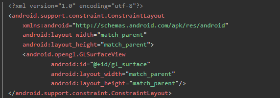
- 然后这创建drawer是自定义的OpenGL渲染器，实现了IDrawer接口
- 然后`setEGLContextClientVersion(2)`：告诉 OpenGL ES 版本为 2.0。然后`setRenderer(...)`：设置渲染器对象（实现 GLSurfaceView.Renderer 接口）
  - 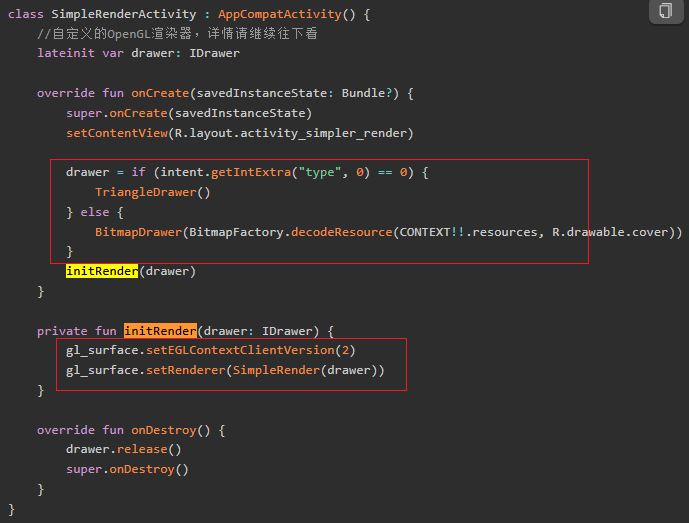
- 好，这个Renderer实现GLSurfaceView.Renderer，这表示它是一个渲染器。
- 哎呀，什么渲染器，其实本质就是一个回调接口，Renderer 就是告诉 GLSurfaceView："在这些时机，请调用我的方法"。他回调三个方法。本质就是生命周期控制方法
  - `onSurfaceCreated` → GL环境创建时回调，做资源初始化
  - `onSurfaceChanged` → Surface尺寸变化时回调，设置绘制区域（viewport）
  - `onDrawFrame` → 每帧绘制
  - 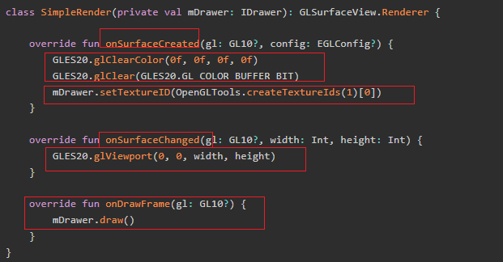
  - 这里有些内容通过代理模式交给mDrawer执行。
- 这里我们要记住，OpenGL ES的渲染操作（比如GLSurfaceView.Renderer的回调）不要求在主线程执行，而是由GLSurfaceView内部维护的“GL线程”来执行。

类定义

- 定义一个渲染接口。然后TriangleDrawer实现这个接口，表示其具备下面的能力集：绘制，设置纹理ID，release释放
  - 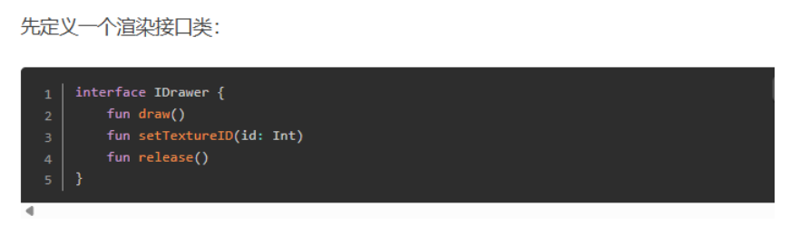

数据准备

- 设置世界坐标和纹理坐标
  - 这里世界坐标是一个三角形，纹理坐标也是，对着坐标系可以看出来
  - 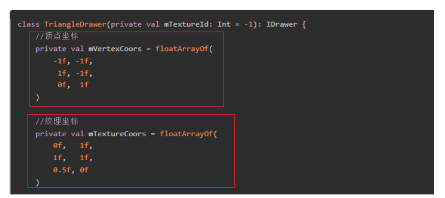

- ByteBuffer 转换：Java 数组无法直接传给 GPU，需要包装成 `FloatBuffer`，也就是把上面的顶点的坐标，纹理的坐标数据转换为FloatBuffer。
  - 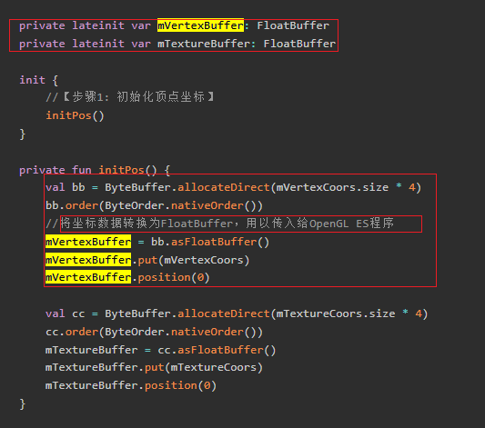

准备着色器

- 我们注意到在onDrawFrame回调方法中会调用mDrawer.draw
- 好，他里面会首先创建编译和启动OpenGL着色器
  - 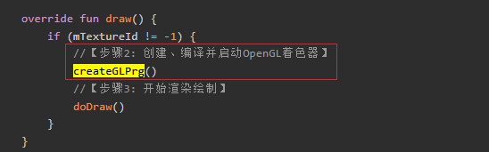
- 创建顶点着色器和片元着色器，其实就是构造着色器，指定他们执行操作的GLSL语言，也就是下面return的String
  - 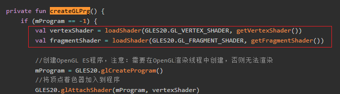
  - 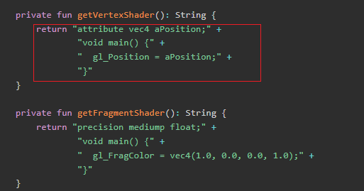
- 咦，是不是很眼熟，没错就是我们上面的代码。
  - 
  - 

编译和绑定着色器：将 GLSL 代码编译、连接成程序并启用。

- 创一个容纳GLSL的程序，然后把顶点着色器和片元着色器地方GLSL代码分别加入进去，接着把他们 “链接”成一个完整的渲染程序，最后编译成GPU能执行的程序
  - 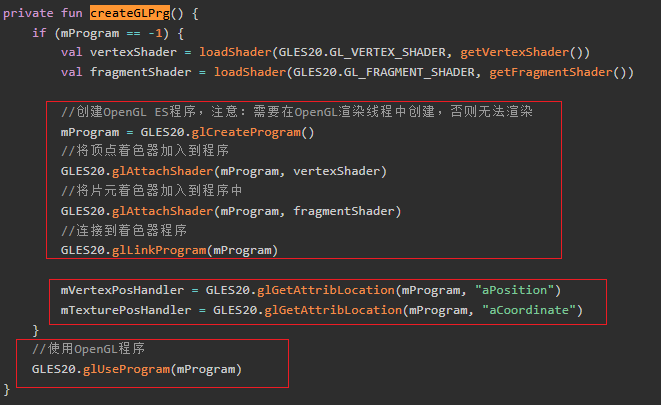
  - 在OpenGL ES在编译和链接着色器这个过程中，其会为上面代码中的每个attribute变量分配一个内部引用。你需要用glGetAttribLocation拿到这个引用，也就是我们这里的mVertexPosHandler等。后续把数据赋值给这个引用

  > 这个怎么理解呢？
  >
  > 你这里可以看到，我们需要一个aPosition的属性
  >
  > - 
  >
  > 但是他的值呢？他的值是这个
  >
  > - 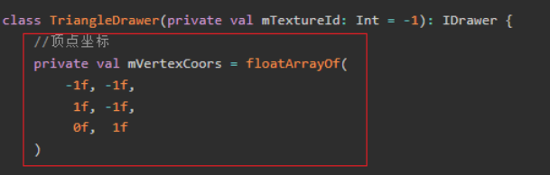
  >
  > 我们给他编译到程序中，我们需要拿到aPosition属性的引用。这样后面才可以把这些数据赋值给aPosition这个属性。

**传入顶点和纹理数据**：

- 上面完成了着色器代码的创建和编译，接着我们开始尝试渲染绘制，调用doDraw方法。
  - 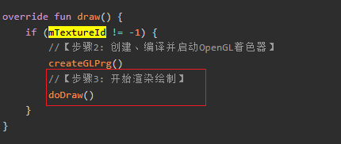
- 通过glEnableVertexAttribArray告诉OpenGL，后面要用到这两个属性（顶点坐标和纹理坐标）
- glVertexAttribPointer设置着色器参数（传递数据方式）
  - mVertexPosHandler / mTexturePosHandler：着色器中attribute在代码中的引用。
  - 2：着色器的属性有2个分量（比如x, y）
  - false：不需要归一化
  - 0：步长（stride），0表示连续存储，也就是连续着取，有步长则每次取完跳跃步长。
  - mVertexBuffer / mTextureBuffer：实际存储数据的缓冲区
  - 这一步相当于“告诉GPU，如果他需要数据时，那么对于aPosition和aCoordinate这两个属性，需要从上面准备的数据的位置，每次取2个float，分别放到顶点/纹理这两个属性上。此时我们定义的program执行时就会不断这样获取数据。
  - 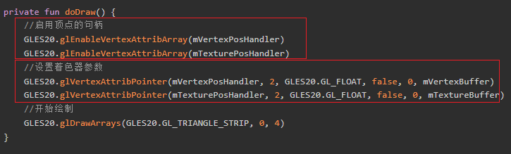
- 这是上面准备的数据位置
  - 初始数据
  - 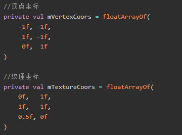
  - 数据转换为FloatBuffer后放入GPU中
  - 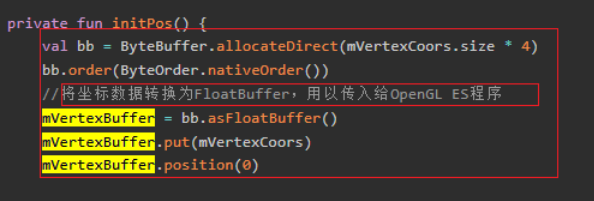

然后是实际的绘制的操作

- 让GPU按照你提供的数据和着色器，开始绘制图形，
  - GLES20.GL_TRIANGLE_STRIP：绘制方式（这里是三角带，适合画矩形）。
  - 0：从第0个顶点开始。
  - 3：总共绘制3个顶点（下面是4个顶点，为什么会有不同？）
  - 

好，这就是一次的绘制了也就是一次draw的工作。

这是一帧的操作，可以我们1s钟要处理60帧啊，这个怎么处理呢？其实接下来每帧都会调用onDrawFrame，进行draw的工作，重复上面的流程。

- 如下
  - 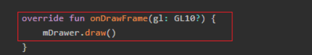
  - 

通过以上步骤，就可以在屏幕上看到一个红色的三角形了。

- 如下
  - 

### 3.3 Android OpenGL ES_图片渲染流程

绘制三角形时我们只是直接在片元着色器里写死颜色值，并没有使用纹理。那么纹理到底有什么用呢？

当我们希望可以绘制一张图片的时候，就会用到纹理了。纹理可以用来把一张位图(Bitmap)的像素内容上传到 GPU，作为“采样源”，然后在片元着色器中根据纹理坐标读取颜色，就可以实现图片的显示

接下来，就用纹理来显示一张图片，看看纹理到底怎么使用。下面按照和上面像素渲染流程中相同的顺序拆解。

我们先看看之前被我们忽略的代码：

初始化纹理资源

- 我们再Surface创建阶段，使用createTextureIds创建了纹理ID，并使用setTextureID设置
  - 首先GLES20.glClearColor(0f, 0f, 0f, 0f)设置“清屏”时用的颜色（RGBA），这里是全透明黑色
  - GLES20.glClear(GLES20.GL_COLOR_BUFFER_BIT)，用上面设置的颜色清空屏幕。
  - 
- 我们来一点点拆分着看。
- 看看createTextureIds，其通过GLES20.glGenTextures(count, texture, 0)，向OpenGL申请count个纹理ID，返回一个Int数组。glGenTextures会在GPU里分配纹理对象，并返回它们的编号（ID），后续所有纹理操作都要用这个ID。
  
  - 
- 把生成的纹理ID保存到成员变量，后续绘制时会用到

  - 

> 我们该怎么理解这里的纹理相关的知识呢？
>
> 我们先看看基础知识：纹理对象、纹理单元、纹理目标
>
> - 纹理对象：本质是GPU显存中存储的一块图像数据
>   - 
> - 纹理单元：GPU的工作插槽，你的上面的纹理对象如果想被处理，那么要先被放到这个纹理单元里
>   - 为什么需要多个单元？让着色器可以从多个纹理单元同时采样，避免频繁切换纹理，提高性能
>   - 感觉类似多线程处理多个数据
> - 纹理目标：纹理目标就像是插槽的类型，不同类型的插槽接受不同类型的设备
>   - 常见有下面的类型
>   - 
>   - 为什么要这样？因为不同类型的纹理数据结构不同，同时GPU处理方式不同
>
> 好，我们先看看他的整体的架构
>
> - 我们申请的GPU纹理对象，通过glBindTexture和纹理单元关联。我们通过glActiveTexture激活纹理单元，通过glUnifor1i传递给着色器
>   - 
>
> 好，我们来看看他的完整的工作流程：从创建到使用
>
> - 第一步：创建纹理对象
>
>   - OpenGL从可用ID池中分配一个整数（如5），此时就是只有 ID，没有对象，没有内存
>
>   - 
>
> - 第二步：激活纹理单元
>
>   - 选择当前要操作的纹理单元，后续的 glBindTexture 会绑定到这个单元
>   - 
>
> - 第三步：绑定纹理到目标
>
>   - 纹理单元0的GL_TEXTURE_2D目标，现在绑定了纹理5，类似于现在选中对象
>   - 绑定时会创建纹理对象，后续绑定：激活该纹理对象（设置为当前操作目标），但是目前还是没有内存
>   - 绑定后，后续操作（配置参数、上传数据）都作用于这个纹理
>   - 
>
> - 第四步：配置纹理参数（设置照片的显示方式）
>
>   - 
>
> - 第五步：上传纹理数据（把照片内容传给GPU）
>
>   - 
>   - GPU内部操作：
>     - 分配显存空间：根据宽高和格式计算需要的显存大小
>     - 上传像素数据：从CPU内存复制到GPU显存
>     - 创建纹理对象：完整的纹理对象现在创建完成
>     - 记录映射关系：ID=5 → GPU显存中的纹理数据
>   - GPU中存储如下
>     - 
>   - 这一步有纹理对象有内存了。
>
> 小结
>
> - 纹理机制相关代码如下
>
>   - ```
>     1. glGenTextures(1, textures, 0)
>        └─ 从"名称空间"分配一个唯一 ID
>        └─ 此时：只有 ID，没有对象，没有内存
>     
>     2. glBindTexture(GL_TEXTURE_2D, textureId)
>        └─ 第一次绑定：创建纹理对象
>        └─ 后续绑定：激活该纹理对象（设置为当前操作目标）
>     
>     3. glTexImage2D(...)
>        └─ 分配 GPU 内存
>        └─ 上传数据到纹理对象
>     
>     4. 纹理单元（Texture Unit）
>        └─ GPU 的"插槽"（如 GL_TEXTURE0, GL_TEXTURE1）
>        └─ glActiveTexture(GL_TEXTURE0)：选择插槽
>        └─ glBindTexture(...)：将纹理对象绑定到当前插槽
>     
>     5. 纹理目标（Texture Target）
>        └─ GL_TEXTURE_2D：2D 纹理
>        └─ GL_TEXTURE_CUBE_MAP：立方体贴图
>        └─ 定义纹理的类型/行为
>     ```
>
> 好，我们看一下实际项目中如何使用，来理解一下流程
>
> - 第一步：onDrawFrame中关联纹理单元和着色器
>   - 中间缺少了我们上面上传纹理数据的步骤
>   - 这里使用时，不能使用纹理ID，要用纹理单元的编号
>   - 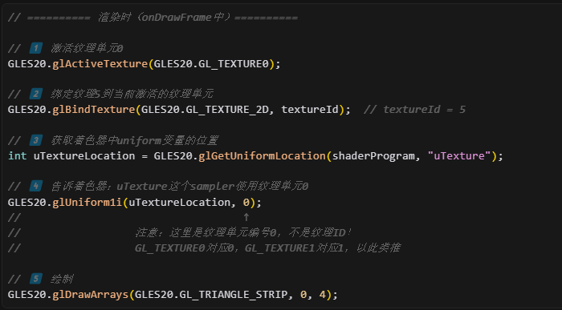
> - 第二步：着色器采样纹理处理
>   - 这是纹理着色器的代码
>   - 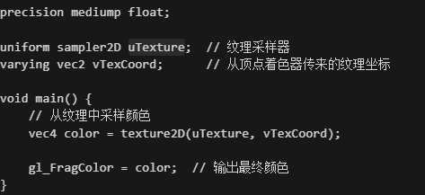
>   - 当GPU读取到这个uTexture时，发现它绑定到纹理单元0
>   - 从纹理单元0的 GL_TEXTURE_2D 目标获取纹理（纹理ID=5）
>   - 根据纹理坐标 vTexCoord 从纹理中采样像素
>   - 返回采样的颜色值


接着是纹理状态下数据的准备

- 和三角形不同，这里需要一个**矩形**来显示整张图片：
- 顶点坐标
  - 
- 纹理坐标
  - 
- 这里最终仍然需要通过 `FloatBuffer` 封装传给 GPU。
- 会不会好奇为什么坐标是这样的，就不能是0f,1f   0f,0f   1f,1f  1f,0f坐标吗？我们回头再说

准备着色器

- 我们的顶点着色器和片元着色器和上面不一样

  - 
  - 

- 对应这一块代码

  - 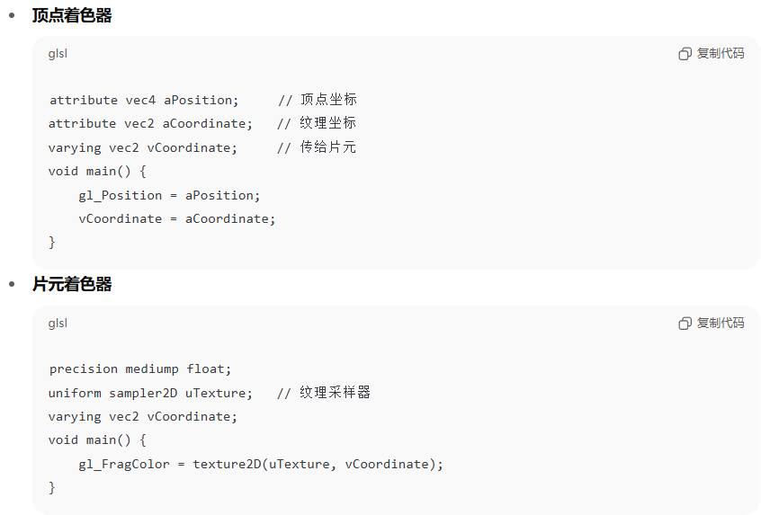

- 首先是顶点着色器

  - 每个顶点都会执行一次，比如你画一个矩形有4个顶点，这个main函数就会被执行4次。
  - aPosition：顶点位置，外部传入

  - aCoordinate：纹理坐标（同样由外部传入）

  - gl_Position：设置当前顶点的最终位置（必须赋值）

  - vCoordinate：用于把纹理坐标从顶点着色器“传递”到片元着色器。这里通过vCoordinate = aCoordinate，把坐标传了下去

- 然后是片元着色器，其负责决定每个像素（片元）的最终颜色

  - 每个像素（片元）都会执行一次，比如你画一个矩形，屏幕上有几万个像素，这个main函数就会被执行几万次。

  - uniform sampler2D uTexture：传入的2D纹理（外部绑定的图片/像素数据）

  - vCoordinate：插值后的纹理坐标（由顶点着色器传来，OpenGL自动为每个像素算出合适的坐标）。

  - vec4 color = texture2D(uTexture, vCoordinate)：用纹理坐标采样纹理，得到颜色

  - gl_FragColor：OpenGL规定的输出，决定这个像素最终显示什么颜色，这里 通过gl_FragColor = color输出颜色到屏幕
  
> 我们该怎么理解这样的一个过程？
  >
  > - 顶点着色器：
  >   - 对每个顶点（比如4个），输出屏幕位置和纹理坐标。
  >
  > - 光栅化（OpenGL自动完成）：
  >   - 把顶点组成的三角形“填充”为像素（片元），并为每个像素自动插值出纹理坐标。
  >
  > - 片元着色器：
  >   - 对每个像素，拿到插值后的纹理坐标，从纹理采样颜色，输出到屏幕
  >
  > 我很疑惑：为什么4个点可以控制整个图片？
  >
  > - OpenGL会自动根据4个顶点的纹理坐标，为每个像素“插值”出一个合适的纹理坐标，所以片元着色器不是只处理4个点，而是处理所有被三角形覆盖的像素。比如一个大矩形可能覆盖几万个像素，每个像素都会执行一次片元着色器。其坐标由OpenGL自动计算和填入。

编译和绑定着色器

- 创一个容纳GLSL的程序，然后把顶点着色器和片元着色器地方GLSL代码分别加入进去，接着把他们 “链接”成一个完整的渲染程序，最后编译成GPU能执行的程序
- 上面的这个过程和我们之前一样，因为其实我们只改变了顶点着色器和片元着色器的代码，最终同样是加入到GLSL程序中。
- 不过，我们这里要获取的属性的索引更多了，因为我们用到的更多了
- 顶点坐标，纹理坐标和纹理采样器
  - 

传入顶点和纹理数据

- 相对于之前的，我们要先进行两步初始化操作
  - 
- 先看看activateTexture
  - 激活0号纹理单元
  - 把mTextureId这个2D纹理对象绑定到当前激活的纹理单元。
  - 把当前使用的纹理单元编号（这里是0，对应GL_TEXTURE0）传递给着色器中的uTexture，也就是让着色器知道要采样哪个纹理单元
  - 配置过滤与环绕
  - 
- 然后是bindBitmapToTexture
  - 上传 Bitmap 数据到 GPU，也就是我们之前的bitmap
  - 

- 然后传入顶点与纹理坐标数据，和上面一致

绘制

- 绘制4个顶点
  - 

小结，流程如下

- 首先是CPU侧准备阶段
  - 创建Program：我们先**创建 Program**，编译 **顶点着色器** 与 **片元着色器**。`glAttachShader`、`glLinkProgram` 生成一个 GPU 可执行的 Program。
  - 然后**准备数据**，准备顶点坐标数组（屏幕位置，通常是标准化设备坐标 NDC）和 纹理坐标数组 (u,v)。并上传到 GPU 缓冲区：`glGenBuffers`、`glBufferData`。
  - 创建/绑定纹理：`glGenTextures`、`glBindTexture`，设置采样参数（缩放、环绕）。最后`glTexImage2D` 把图像数据bitmap加载到GPU中

- 然后是触发流程
  - 每一帧的渲染回调，最终调用glDrawArrays，触发GPU的绘制流程
  - 
- 最后是GPU侧渲染流程
  - 先执行顶部着色器的代码，对每一个顶点执行一次。获取输入：顶点位置 + 纹理坐标。输出：裁剪坐标 `gl_Position` + 传递给下一阶段的 varyings（纹理坐标）。
    - 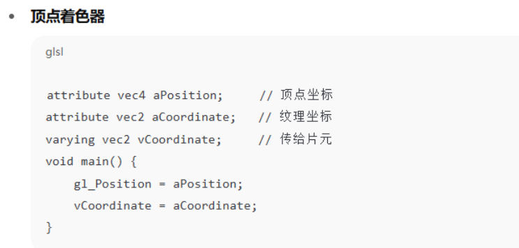
  - 着色器要先获取输入的数据
    - 我们这里配置了着色器的参数，其知晓从哪个位置取出数据
      - 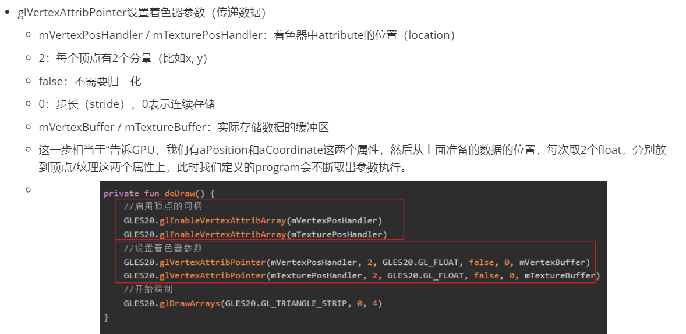
    - 这是我们的数据
      - 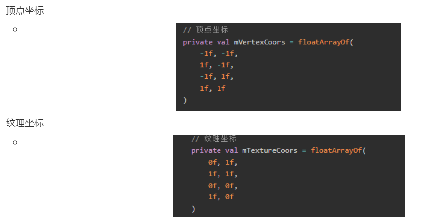
  - 顶点着色器拿到输入数据执行代码，他会构建一个几何图形表示渲染范围，同时把纹理坐标传递下去。
  - **图元装配 (Primitive Assembly)**：把 4 个点组装成 2 个三角形。
  - 光栅化 (Rasterization)：把三角形区域切成**屏幕像素网格**（片元）。对每个片元：自动做 **重心坐标插值**，算出该像素的纹理坐标 (u,v) 及其他 varying，然后输出给片元着色器。
  - **片元着色器 (Fragment Shader)**：获取光栅化结果当作输入，对每一个片元执行一次（可能是几十万次）。根据插值得到的 (u,v) 从纹理采样颜色：`texture2D(texture, uv)`。输出颜色给下一阶段。
  - 测试与混合 (Per-Fragment Operations)：深度测试、模板测试、Alpha 混合等。通过的像素写入 **帧缓冲 (Framebuffer)**
- 显示
  - GPU 把渲染完成的帧缓冲交给显示系统 (SurfaceFlinger / WindowSystem)。
  - 屏幕刷新时显示出来。

### 3.5 绘制模式

来吧，我们来理解一下这里的GLES20.GL_TRIANGLE_STRIP：绘制方式和3个顶点，以及和下面4个顶点的差异

- 首先是3个顶点绘制
  - 这是代码
  - 
  - 这是结果
  - 
- 然后是4个顶点绘制
  - 这是代码
  - 
  - 这是结果
  - 

还有啊，4个顶点绘制的时候他的数据是这样的

- 顶点坐标
  - 
- 纹理坐标
  - 
- 会不会好奇为什么坐标是这样的，就不能是0,1   0,0   1,1  1,0吗？我们回头再说

好啊，为什么会这样？

我们先来看第一个问题，绘制模式和3个，4个顶点的问题

OpenGL ES所有的画面都是由三角形构成的，比如一个四边形由两个三角形构成，其他更复杂的图形也都可以分割为大大小小的三角形。

因此，顶点坐标也是根据三角形的连接来设置的。其绘制方式有三种：

- GL_TRIANGLES：独立顶点的构成三角形
  - 
- GL_TRIANGLE_STRIP：复用顶点构成三角形
  -  
- GL_TRIANGLE_FAN：复用第一个顶点构成三角形
  - 

通常情况下，一般使用GL_TRIANGLE_STRIP绘制模式。那么一个四边形的顶点顺序看起来是这样子的（v1-v2-v3）（v2-v3-v4）

- 也就是下面的
  - 
  - 

对应的纹理坐标也要和顶点坐标顺序一致，否则会出现颠倒，变形等异常

- 也就是下面的
  - 
  - 

## 04.底层原理


## 05.深度思考

### 5.1 关键问题探究


### 5.2 设计对比


## 06.实践验证

### 6.1 行为验证代码


### 6.2 性能测试


## 07.应用场景

### 7.1 最佳实践


### 7.2 使用禁忌


## 08.总结提炼

### 8.1 核心收获


### 8.2 知识图谱


### 8.3 延伸思考


- 

## 09.参考资料

1. []()
2. []()
3. []()

## 其他介绍

### 01.关于我的博客

- csdn：http://my.csdn.net/qq_35829566

- 掘金：https://juejin.im/user/499639464759898

- github：https://github.com/jjjjjjava

- 邮箱：[934137388@qq.com]

