[toc]

## 前言

> 学习要符合如下的标准化链条：了解概念->探究原理->深入思考->总结提炼->底层实现->延伸应用"

## 01.学习概述

- **学习主题**：
- **知识类型**：
  - [ ] ✅Android/ 
    - [ ] ✅01.基础组件与机制 
      - [ ] ✅四大组件
      - [ ] ✅IPC机制
      - [ ] ✅消息机制
      - [ ] ✅事件分发机制
      - [ ] ✅View与渲染体系（含Window、复杂控件、动画）
      - [ ] ✅存储与数据安全（SharedPreferences/DataStore/Room/Scoped Storage）
    - [ ] ✅02. 架构与工程化
      - [ ] ✅架构模式（MVC/MVP/MVVM/MVI）
      - [ ] ✅依赖注入（Koin/Hilt/Dagger）
      - [ ] ✅路由与模块化（ARouter、Navigation）
      - [ ] ✅Gradle与构建优化
      - [ ] ✅插件化与动态化
      - [ ] ✅插桩与监控框架
    - [ ] ✅03.性能优化与故障诊断
      - [ ] ✅ANR分析与优化
      - [ ] ✅启动耗时优化
      - [ ] ✅内存泄漏监控
      - [ ] ✅监控与诊断工具
    - [ ] ✅04.Jetpack与生态框架
      - [ ] ✅Room
      - [ ] ✅Paging
      - [ ] ✅WorkManager
      - [ ] ✅Compose
    - [ ] ✅05.Framework与系统机制
      - [ ] ✅ActivityManagerService (含ANR触发机制)
      - [ ] ✅Binder机制
  - [ ] ✅音视频开发/
    - [ ] ✅01.基础知识
    - [ ] ✅02.OpenGL渲染视频
    - [ ] ✅03.FFmpeg音视频解码
  - [ ] ✅ Java/
    - [ ] ✅01.基础知识
    - [ ] ✅02.集合框架
    - [ ] ✅03.异常处理
    - [ ] ✅04.多线程与并发
    - [ ] ✅06.JVM
  - [ ] ✅ Kotlin/
    - [ ] ✅01.基础语法
    - [ ] ✅02.高阶扩展
    - [ ] ✅03.协程和流
  - [ ] ✅ Flutter/
    - [ ] ✅01.基础基础语法
    - [ ] ✅02.状态管理
    - [ ] ✅03.路由与依赖注入
    - [ ] ✅04.原生通信
  - [ ] ✅ 自我管理/
    - [ ] ✅01.内观
  - [ ] ✅ 项目经验/
    - [ ] ✅01.启动逻辑
    - [ ] ✅02.云值守
    - [ ] ✅03.智控平台
- **学习来源**：
- **重要程度**：⭐⭐⭐⭐⭐
- **学习日期**：2025.
- **记录人**：@panruiqi

### 1.1 学习目标

- 了解概念->探究原理->深入思考->总结提炼->底层实现->延伸应用"

### 1.2 前置知识

- [ ] 

## 02.核心概念

### 2.1 是什么？


### 2.2 解决什么问题？


### 2.3 基本特性


## 03.原理机制

### 3.1 使用OpenGL渲染视频画面_其一：原理分析

好，我们在 [03. 音视频_OpenGL_01.初步了解OpenGL ES.md](03. 音视频_OpenGL_01.初步了解OpenGL ES.md) 中使用纹理绘制图片上传的是静态的图片，那么假如我们希望使用OpenGL渲染视频画面呢？该如何处理？

- 首先他和使用图片渲染有什么区别呢？图片是静态的，视频是动态的，视频可以看作是一帧一帧的图片组成的
- 好的，我们的实现思路就是用解码器，将视频解码为YUV帧，然后一帧充当图片渲染出来。

好的，新的问题，我们既然可以将视频不断的解析出的帧当作图片渲染，那么我们当时图片是如何当作纹理上传进GPU显存中的呢？

- 这是代码

  - ```
    // 1. 从资源加载Bitmap（在Java堆内存中）
    val bitmap = BitmapFactory.decodeResource(resources, R.drawable.image)
    
    // 2. 绑定纹理
    GLES20.glBindTexture(GLES20.GL_TEXTURE_2D, textureId)
    
    // 3. 上传Bitmap数据到GPU（这里发生CPU→GPU拷贝）
    GLUtils.texImage2D(GLES20.GL_TEXTURE_2D, 0, bitmap, 0)
    //     ↑
    //     这个调用内部执行了内存拷贝！
    
    // 4. 释放Bitmap（堆内存可以回收了）
    bitmap.recycle()
    ```

- 对应原理

  - 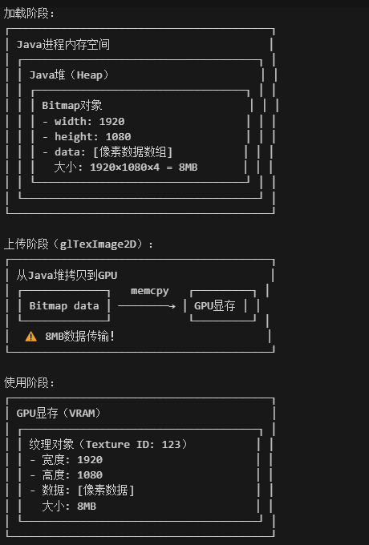

- 也就是说，静态图片纹理的加载 不断涉及CPU到GPU的数据传输

好，我现在要问一个问题，视频一帧作为纹理绑定，也可以使用这个传输吗？

- 我的观点是不行，因为很简单，静态图片只用上传一次即可。而对于视频，其60FPS，1s需要上传60次，对于一个1080p图片（1920×1080×4字节 = 8MB），通过PCIe总线传输到GPU，传输时间：约8-16ms，这严重影响到我们视频的渲染性能。

好，那么，对于视频的一帧，我们该如何将其作为纹理绑定呢？我们来看一下核心的思路

- 核心思路是双Surface
  - 一个Surface充当离屏渲染，存放MediaCodec的解码结果，并且让GPU可以直接读取数据进行渲染。
  - 另一个Surface是GLSurfaceView拥有的，用于存放GPU渲染的结果，并通过eglSwapBuffers交换前后缓冲区显示到屏幕上

好的，我们来看一下流程

- 阶段一：MediaCodec作为生产者，将解码后的YUV数据写入到第一个Surface离屏缓冲中
  - 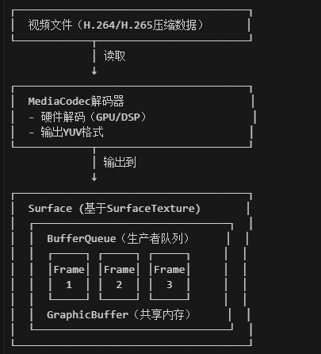

- 阶段二：SurfaceTexture连接，这一阶段我们需要一个SurfaceTexture作为消费者，绑定到OpenGL纹理ID并监听BufferQueue，有新帧到来时，通过updateTexImage，将纹理对象中存储纹理数据的指针指向这个共享内存
  - 注意，这里不是取出上传到GPU纹理，也不用像之前一样在GPU中分配纹理数据存储空间，因为BufferQueue是共享内存，可以直接读取，所以直接建立指针的指向关系就可以了。
  - 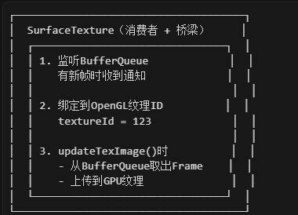
  - 这一阶段结果是这样的
  - 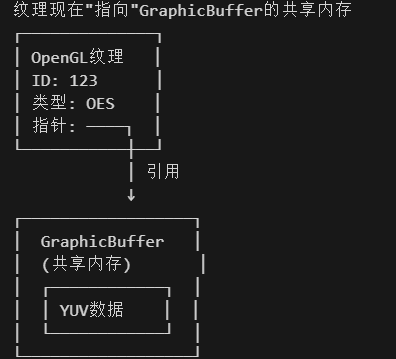
  - 也就是对于第一个Surface，MediaCodec和OpenGL的访问是这样的
  - 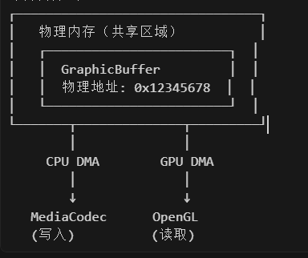

- 阶段三：OpenGL处理，此时GPU执行GLSL代码，使用上面的数据进行渲染流程，并输出到帧缓冲区（FBO）  ，并最终渲染到GLSurfaceView的Surface  ，也就是第二个Surface
  - 这是流程
  - 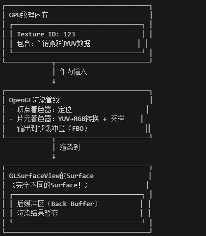

- 阶段四：显示到屏幕，Binder通知SurfaceFlinger并最终显示
  - 这是流程
  - 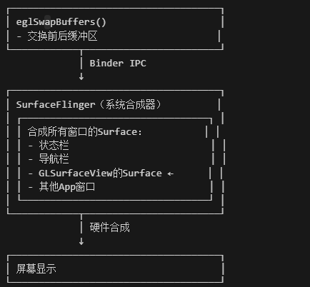

好，进一步思考，如果我们期望渲染视频时可以带上多个滤镜呢？

- 这个本质就是视频后处理，我们应该将其渲染到FBO中，再由FBO渲染到屏幕

- 代码如下：

  - ```
    // 使用FBO实现视频特效
    class VideoEffectDrawer : IDrawer {
        private var mFBO: Int = -1           // 帧缓冲对象
        private var mFBOTexture: Int = -1    // FBO的纹理附件
        
        override fun draw() {
            // 第一步：渲染到FBO（离屏）
            GLES20.glBindFramebuffer(GLES20.GL_FRAMEBUFFER, mFBO)
            
            surfaceTexture.updateTexImage()
            drawVideoToFBO()  // 渲染视频到FBO纹理
            
            // 第二步：从FBO读取，应用特效，渲染到屏幕
            GLES20.glBindFramebuffer(GLES20.GL_FRAMEBUFFER, 0)
            
            applyEffect(mFBOTexture)  // 使用FBO纹理作为输入
            drawToScreen()  // 渲染到屏幕
        }
        
        private fun applyEffect(texture: Int) {
            // 在片元着色器中应用特效
            // 例如：模糊、锐化、美颜、滤镜等
        }
    }
    ```

- 这里可以使用多层FBO进行多层的滤镜处理，不过开销有点大
  
  - 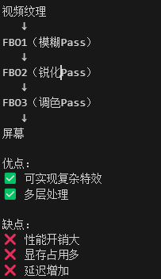

### 3.2 使用OpenGL渲染视频画面_其二：实际代码

继承  [03. 音视频_OpenGL_01.初步了解OpenGL ES.md](03. 音视频_OpenGL_01.初步了解OpenGL ES.md) 中的使用图片渲染的逻辑，我们这里只看他们之间的差异

首先是着色器的构建

- 片元着色器
  
  - 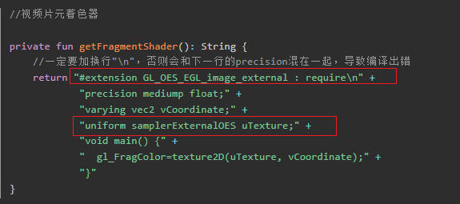
  
  - 核心是这个
  
  - \#extension GL_OES_EGL_image_external : require，声明使用Android的OpenGL ES扩展，允许采样外部纹理（如视频帧）。
  - uniform samplerExternalOES uTexture;：拓展纹理类型，专门用于采样外部源（如Camera、MediaCodec、SurfaceTexture等）

接着的是纹理数据的传入

- 第一步：我们要先初始化我们的SurfaceTexture
  - 用SurfaceTexture(id)创建SurfaceTexture，并把OpenGL的纹理ID和SurfaceTexture关联起来
  - 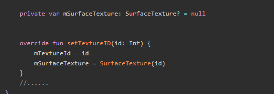
- 第二步：将SurfaceTexture绑定使用MediaCodec输出的Surface上
  - 先在IDrawer中添加一个方法
  - 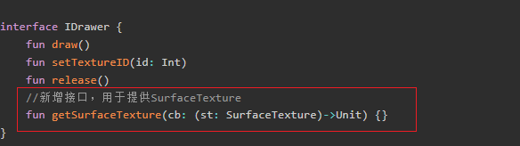
  - 通过一个高阶函数参数，把SurfaceTexture回传出去。具体如下：
  - getSurfaceTexture(cb)：外部调用这个方法，传入一个回调函数，通过这个回调外部可以拿到SurfaceTexture 
  - 当 VideoDrawer 创建好 SurfaceTexture 后，调用mSftCb?.invoke，执行上面的回调函数，把 SurfaceTexture 传给外部
  - 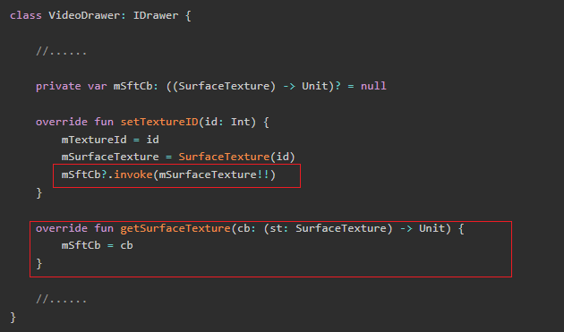
  - 好，看看外部如何使用
  - 这里的lambda表达式是Surface，也就是 new Surface(surfaceTexture) 传递进去。内部执行这个，传递mSurfaceTexture
  - 接着拿这个Surface配置给MediaCodec
  - 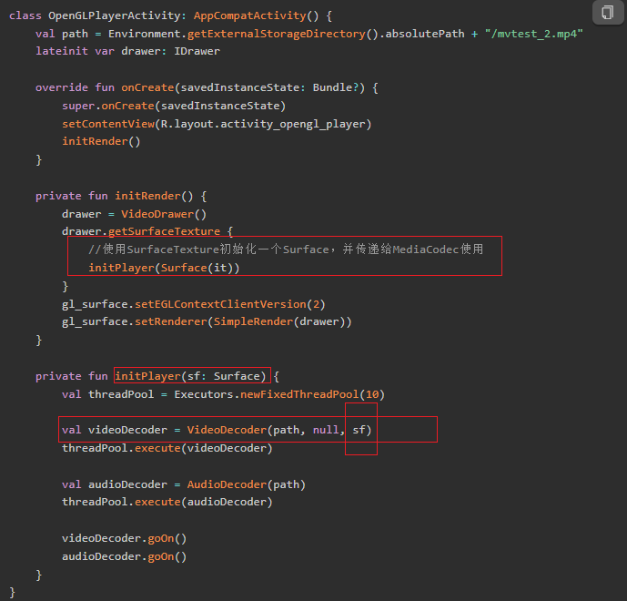
- 第三步：将视频帧作为纹理更新，在updateTexture方法中，我们调用mSurfaceTexture?.updateTexImage()，通知SurfaceTexture把最新的视频帧“贴”到你绑定的纹理ID上
  - 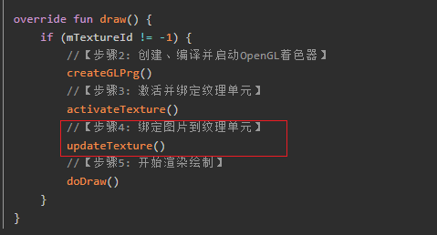
  - 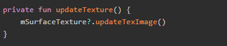


好的，这是显示结果，你会发现，视频画面被拉伸到GLSurfaceView窗口的大小，也就是全屏铺满，接下来就看看如何矫正视频画面，让画面比例和实际一样。

- 如下
  - 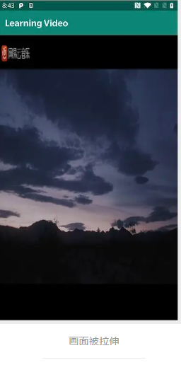

### 3.3 视频比例拉伸_其一：原因及深入理解矩阵变换

引子：

- 场景：想象一下：你有一个 1000×500 的横向视频，要在 1080×1920 的竖屏手机上播放。画面会被拉伸，这是为什么呢？

- 核心原因：在OpenGL的NDC坐标系中，其世界坐标 (-1~1) 直接映射到屏幕，也就是顶点坐标直接映射到屏幕四个角，此时不管屏幕多大，都会铺满 ，进而导致变形，也就是OpenGL 不知道你的视频原始比例，它只会无脑拉伸铺满屏幕。

- 处理思路：我理解为什么会拉伸，你的视频从1000 × 500变成了1080 × 1920。你应该做的是将其变为1080 * 对应的等比放大的高，也就是宽占据0,1,。高度要占据中间的一小部分 。这是因为你的宽高比大于1080/1920，如果小于它，那么就应该让其先高后宽。

好，我们这个处理是通过正交矩阵完成他的缩放的，但是学习正交矩阵之前，我们要先学习矩阵的基础，也就是深入理解矩阵变换

第一部分：矩阵乘法的几何意义

- **矩阵乘法的本质**：用矩阵的每一行，对坐标向量进行**加权组合**。

- 举例：

  - ```
    点坐标        缩放矩阵        结果
    ┌   ┐        ┌       ┐      ┌   ┐
    │ 2 │   ×    │ 0.5  0│  =   │ 1 │
    │ 3 │        │ 0  0.5│      │1.5│
    └   ┘        └       ┘      └   ┘
    
    计算过程：
    新X = 2 × 0.5 + 3 × 0   = 1
    新Y = 2 × 0   + 3 × 0.5 = 1.5
    ```

  - 第一行 `[0.5, 0]` 控制 X 坐标：只保留原 X 的 0.5 倍

  - 第二行 `[0, 0.5]` 控制 Y 坐标：只保留原 Y 的 0.5 倍

  - 结果：点从 (2, 3) 缩小到 (1, 1.5)

- 矩阵类型：单位矩阵 和 缩放矩阵

  - 单位矩阵，不做任何变化

  - ```
    ┌ 1  0 ┐
    │ 0  1 │
    └      ┘
    
    任何坐标 × 单位矩阵 = 原坐标
    ```

  - 缩放矩阵：

  - ```
    ┌ Sx  0  ┐    Sx: X轴缩放倍数
    │ 0   Sy ┐    Sy: Y轴缩放倍数
    └        ┘
    ```

- 好，我们看看OpenGL中实际的顶点缩放过程

  - 在 OpenGL 中，顶点坐标是 4 维的（齐次坐标）：

  - ```
    顶点坐标（右上角）:
    ┌   ┐
    │ 1 │  ← X 坐标
    │ 1 │  ← Y 坐标
    │ 0 │  ← Z 坐标（2D渲染通常为0）
    │ 1 │  ← W 分量（齐次坐标，通常为1）
    └   ┘
    ```

  - 应用 Y 轴缩放 3 倍的矩阵

  - ```
    缩放矩阵（4×4）:
    ┌ 1  0  0  0 ┐
    │ 0  3  0  0 │  ← 这个3控制Y轴缩放
    │ 0  0  1  0 │
    └ 0  0  0  1 ┘
    
    矩阵乘法：
    ┌ 1  0  0  0 ┐   ┌ 1 ┐   ┌ 1×1 + 0×1 + 0×0 + 0×1 ┐   ┌ 1 ┐
    │ 0  3  0  0 │ × │ 1 │ = │ 0×1 + 3×1 + 0×0 + 0×1 │ = │ 3 │
    │ 0  0  1  0 │   │ 0 │   │ 0×1 + 0×1 + 1×0 + 0×1 │   │ 0 │
    └ 0  0  0  1 ┘   └ 1 ┘   └ 0×1 + 0×1 + 0×0 + 1×1 ┘   └ 1 ┘
    
    简化：
    X = 1 × 1 = 1  （没变）
    Y = 3 × 1 = 3  （放大3倍！）
    ```

第二部分：正交投影矩阵详解

- OpenGL中，我们通过Matrix.orthoM()计算生成正交投影矩阵，来压缩我们的视频高度。

- 这是方法签名

  - ```
    /**
     * Computes an orthographic projection matrix.
     *
     * @param m returns the result - 正交投影矩阵（输出）
     * @param mOffset 偏移量，默认为 0
     * @param left 左平面距离（世界坐标）
     * @param right 右平面距离（世界坐标）
     * @param bottom 下平面距离（世界坐标）
     * @param top 上平面距离（世界坐标）
     * @param near 近平面距离（相机坐标）
     * @param far 远平面距离（相机坐标）
     */
    public static void orthoM(float[] m, int mOffset,
        float left, float right, float bottom, float top,
        float near, float far)
    ```

- 生成的矩阵结构

  - ```
    ┌  2/(right-left)        0              0         -(right+left)/(right-left) ┐
    │       0          2/(top-bottom)       0         -(top+bottom)/(top-bottom) │
    │       0                0        -2/(far-near)   -(far+near)/(far-near)     │
    └       0                0              0                    1                ┘
        ↑                    ↑                                   ↑
      X轴缩放             Y轴缩放                            X/Y轴平移
      
      简化版
      
      ┌  2/(right-left)        0        ... ┐
    │       0          2/(top-bottom)  ... │
    │      ...             ...         ... │
    └      ...             ...         ... ┘
    ```

- 好，我们看看代码实际处理

  - 需求：1000×500 视频 → 1080×1920 屏幕

  - 步骤一：计算宽高比

  - ```
    val videoRatio = 1000f / 500f = 2.0
    val glRatio = 1080f / 1920f = 0.5625
    ```

  - 步骤2：判断缩放方向

  - ```
    videoRatio (2.0) > glRatio (0.5625)
    → 视频更"扁"（横向），应该缩放高度
    ```

  - 步骤3：计算缩放倍数

  - ```
    val actualRatio = videoRatio / glRatio
                    = 2.0 / 0.5625
                    = 3.555556
    ```

  - 步骤4：设置投影参数

  - ```
    Matrix.orthoM(
        prjMatrix, 0,
        -1f, 1f,              // left, right → X不缩放
        -3.555556f, 3.555556f, // bottom, top → Y扩大范围
        -1f, 3f               // near, far
    )
    ```

  - 步骤5：计算矩阵元素

  - ```
    X轴缩放 = 2 / (right - left)
            = 2 / (1 - (-1))
            = 2 / 2
            = 1.0  （不缩放，宽度铺满）
    
    Y轴缩放 = 2 / (top - bottom)
            = 2 / (3.555556 - (-3.555556))
            = 2 / 7.111112
            = 0.2812  （缩小到28%）
    ```

  - 这是生成的矩阵（简化版）

  - ```
    ┌  1.0      0      ... ┐
    │  0     0.2812    ... │
    │ ...      ...     ... │
    └ ...      ...     ... ┘
    ```

- 好，我们来看看他的处理结果

  - 这是原始的顶点

  - ```
    (-1,  1) ──────── (1,  1)   顶部
       │                 │
       │                 │
       │      (0,0)      │      中心
       │                 │
       │                 │
    (-1, -1) ──────── (1, -1)   底部
    ```

  - 这是应用正交矩阵后的显示范围，原本占满屏幕 [-1, 1]，现在只占 [-0.28, 0.28]，画面缩小，上下出现黑边！

  - ```
    (-1, 0.28) ────── (1, 0.28)  ← 顶部缩小到0.28
         │               │
         │    (0,0)      │        中心不变
         │               │
    (-1,-0.28) ────── (1,-0.28)  ← 底部缩小到-0.28
    ```

第三部分：比例判断逻辑详解

- 我们上面判断缩放方向，现在有一个问题：如何决定缩放哪个维度（宽或高）？关键是比较两个比例：`videoRatio = 视频宽 / 视频高`     `glRatio = 屏幕宽 / 屏幕高`

- 我们来分析一下四种实际应用情况

  - 情况1：横屏 + 视频更扁

  - ```
    屏幕：1920×1080（横屏）  glRatio = 1.78
    视频：1000×500（超扁）   videoRatio = 2.0
    
    videoRatio > glRatio → 缩放高度
    
    ┌────────────────────┐
    │      黑边区域       │
    ├────────────────────┤ ← 视频
    │                    │
    ├────────────────────┤
    │      黑边区域       │
    └────────────────────┘
    ```

  - 情况2：横屏 + 视频更高

  - ```
    屏幕：1920×1080（横屏）  glRatio = 1.78
    视频：500×1000（竖向）   videoRatio = 0.5
    
    videoRatio < glRatio → 缩放宽度
    
    ┌────┬─────┬────┐
    │黑边│视频│黑边│
    │    │    │    │
    │    │    │    │
    └────┴─────┴────┘
    ```

  - 情况3：竖屏 + 视频更扁（原文例子）

  - ```
    屏幕：1080×1920（竖屏）  glRatio = 0.5625
    视频：1000×500（横向）   videoRatio = 2.0
    
    videoRatio > glRatio → 缩放高度
    
    ┌─────────────┐
    │  黑边区域    │
    ├─────────────┤
    │   视频区     │
    ├─────────────┤
    │  黑边区域    │
    └─────────────┘
    ```

  - 情况4：竖屏 + 视频更高

  - ```
    屏幕：1080×1920（竖屏）  glRatio = 0.5625
    视频：500×1000（竖向）   videoRatio = 0.5
    
    videoRatio < glRatio → 缩放宽度
    
    ┌──┬────┬──┐
    │黑│    │黑│
    │边│视频│边│
    │  │    │  │
    │  │    │  │
    └──┴────┴──┘
    ```

- 等比缩放策略

  - 核心原则：
    - **铺满一边**：让一个维度完全占据屏幕；
    - **缩放另一边**：按比例缩小另一个维度；
    - **居中显示**：缩小的维度自动居中

- 好，这是实际的代码逻辑

  - ```
    fun calculateOrthoMatrix(
        videoWidth: Int,
        videoHeight: Int,
        screenWidth: Int,
        screenHeight: Int
    ): FloatArray {
        val matrix = FloatArray(16)
        val videoRatio = videoWidth / videoHeight.toFloat()
        val screenRatio = screenWidth / screenHeight.toFloat()
        
        when {
            // 横屏模式
            screenWidth > screenHeight -> {
                if (videoRatio > screenRatio) {
                    // 视频更扁 → 缩放高度
                    val actualRatio = videoRatio / screenRatio
                    Matrix.orthoM(
                        matrix, 0,
                        -1f, 1f,
                        -actualRatio, actualRatio,
                        -1f, 3f
                    )
                } else {
                    // 视频更高 → 缩放宽度
                    val actualRatio = screenRatio / videoRatio
                    Matrix.orthoM(
                        matrix, 0,
                        -actualRatio, actualRatio,
                        -1f, 1f,
                        -1f, 3f
                    )
                }
            }
            // 竖屏模式
            else -> {
                if (videoRatio > screenRatio) {
                    // 视频更扁 → 缩放高度
                    val actualRatio = videoRatio / screenRatio
                    Matrix.orthoM(
                        matrix, 0,
                        -1f, 1f,
                        -actualRatio, actualRatio,
                        -1f, 3f
                    )
                } else {
                    // 视频更高 → 缩放宽度
                    val actualRatio = screenRatio / videoRatio
                    Matrix.orthoM(
                        matrix, 0,
                        -actualRatio, actualRatio,
                        -1f, 1f,
                        -1f, 3f
                    )
                }
            }
        }
        
        return matrix
    }
    ```

### 3.4 视频比例拉伸_其二：坐标系统与变化

在处理 OpenGL 视频渲染和触摸事件时，需要在**三个不同的坐标系统**之间转换：

1. **Android 屏幕坐标系**：用户触摸的物理坐标
2. **OpenGL NDC 坐标系**：OpenGL 渲染的标准化坐标
3. **视频纹理坐标系**：视频像素的实际坐标

第一步：三大坐标系统介绍

- 其实我们在 [03. 音视频_OpenGL_01.初步了解OpenGL ES.md](03. 音视频_OpenGL_01.初步了解OpenGL ES.md) 中有介绍过三大坐标系统的基础知识，我们在此不做过多的赘述

第二步：坐标变化完整链路

- 需求：用户触摸事件，点击到屏幕坐标，我们如何判断其对应NDC的位置呢？

- 原理：这是完整的链路

  - ```
    用户点击屏幕 → 屏幕坐标 → NDC坐标 → 视频坐标 → 像素坐标
       (物理)      (像素值)    (归一化+缩放+y轴翻转)    (逆矩阵)    (实际像素)
    ```

- 步骤1：屏幕坐标 → NDC 坐标

  - ```
    // 输入：屏幕坐标
    val screenX = 540f  // 屏幕宽度中心
    val screenY = 960f  // 屏幕高度中心
    
    // 公式推导：
    // 1. 归一化到 [0, 1]
    val normalizedX = screenX / screenWidth  // 540 / 1080 = 0.5
    val normalizedY = screenY / screenHeight // 960 / 1920 = 0.5
    
    // 2. 缩放到 [0, 2]
    val scaledX = normalizedX * 2  // 0.5 * 2 = 1.0
    val scaledY = normalizedY * 2  // 0.5 * 2 = 1.0
    
    // 3. 平移到 [-1, 1]
    val ndcX = scaledX - 1  // 1.0 - 1 = 0.0
    val ndcY = scaledY - 1  // 1.0 - 1 = 0.0
    
    // 4. Y轴翻转（关键！）
    val finalNdcY = -ndcY  // -(0.0) = 0.0
    
    // 合并公式：
    val ndcX = (screenX / screenWidth) * 2 - 1
    val ndcY = -((screenY / screenHeight) * 2 - 1)
    ```

  - **结果**：(540, 960) → (0, 0) NDC坐标，正是屏幕中心！

  - Y 轴翻转的必要性

  - ```
    屏幕坐标系（Y向下）    转换后（Y仍向下）    翻转后（Y向上）= NDC
        (0, 0)                 (-1, -1)             (-1, 1)  ✓
          │                        │                    ▲
          │                        │                    │
          ▼                        ▼                    │
      (1080,1920)                (1, 1)              (1, -1)
    
    没有翻转：上下颠倒    加负号后：符合OpenGL标准
    ```

- 步骤2：NDC 坐标 → 视频坐标，这一步需要**应用逆矩阵**，将屏幕显示的缩放还原：

  - 这一步这样理解就好了，把视频所占的-1,1；-0.28，0.28区域，当作一个-1,1; -1,1的范围。通过逆矩阵可以判断是否在其内

  - ```
    // 假设正交矩阵缩放了 Y 轴 0.28 倍
    val orthoScaleY = 0.28f
    val inverseScaleY = 1f / orthoScaleY  // 3.57
    
    // 应用逆变换
    val videoX = ndcX * 1.0  // X没有缩放
    val videoY = ndcY * inverseScaleY  // Y反向缩放
    
    // 判断是否在视频范围内
    if (videoX in -1f..1f && videoY in -1f..1f) {
        // 有效点击
    } else {
        // 点击在黑边区域
    }
    ```

  - 这是效果：

  - ```
    点击位置    NDC坐标    方法1(逆矩阵)      
    (540,400)    0.583    0.583×3.57=2.08    
                          2.08>1 ✗           
                          
    (540,691)    0.28     0.28×3.57=1.0      
                          1.0==1 ✓           
                          
    (540,960)    0.0      0.0×3.57=0.0      
                          0 in [-1,1] ✓      
    ```

- 步骤3：视频坐标 → 像素坐标 （疑惑，这一步到底要做什么呢？）

  - 这一步的目的就是把触摸屏幕中的坐标，在经过（归一化，*2，-1，翻转）计算为NDC坐标系下坐标，并且通过逆矩阵计算其在视频区域内部后，将其逆矩阵得到的结果换算成视频区域内部的点击位置。

  - 就是从逻辑坐标到实际像素的映射，属于最终落点转换。

  - ```
    // 视频坐标范围：(-1, 1)
    // 像素坐标范围：(0, videoWidth) × (0, videoHeight)
    
    // X轴转换
    val pixelX = ((videoX + 1) / 2) * videoWidth
    // 示例：(-1+1)/2 * 1000 = 0（左边界）
    //      (1+1)/2 * 1000 = 1000（右边界）
    
    // Y轴转换（再次翻转！）
    val pixelY = ((1 - videoY) / 2) * videoHeight
    // 示例：(1-1)/2 * 500 = 0（顶部）
    //      (1-(-1))/2 * 500 = 500（底部）
    ```

  - 为什么 Y 轴又要翻转？

  - ```
    NDC坐标系（Y向上）    视频像素坐标（Y向下）
       Y=1  顶部              Y=0   顶部
        ↑                      │
        │                      ↓
       Y=-1 底部              Y=500 底部
    
    需要翻转才能对应正确！
    ```

- 代码实现

  - ```
    /**
     * 屏幕坐标转换为视频像素坐标
     */
    fun screenToVideoPixel(
        screenX: Float,
        screenY: Float,
        screenWidth: Int,
        screenHeight: Int,
        videoWidth: Int,
        videoHeight: Int,
        orthoScaleX: Float = 1f,  // X轴缩放倍数
        orthoScaleY: Float = 1f   // Y轴缩放倍数
    ): Pair<Int, Int>? {
        
        // 步骤1: 屏幕坐标 → NDC坐标
        val ndcX = (screenX / screenWidth) * 2 - 1
        val ndcY = -((screenY / screenHeight) * 2 - 1)
        
        // 步骤2: NDC坐标 → 视频归一化坐标（应用逆矩阵）
        val videoX = ndcX / orthoScaleX
        val videoY = ndcY / orthoScaleY
        
        // 步骤3: 判断是否在视频范围内
        if (videoX !in -1f..1f || videoY !in -1f..1f) {
            return null  // 点击在黑边区域
        }
        
        // 步骤4: 视频坐标 → 像素坐标
        val pixelX = ((videoX + 1) / 2 * videoWidth).toInt()
        val pixelY = ((1 - videoY) / 2 * videoHeight).toInt()
        
        return Pair(pixelX, pixelY)
    }
    
    // 使用示例
    val result = screenToVideoPixel(
        screenX = 540f,
        screenY = 960f,
        screenWidth = 1080,
        screenHeight = 1920,
        videoWidth = 1000,
        videoHeight = 500,
        orthoScaleY = 0.28f  // Y轴缩放了0.28倍
    )
    
    result?.let { (x, y) ->
        println("点击了视频的像素位置: ($x, $y)")
    } ?: println("点击在黑边区域")
    ```

  - 所以可以看到，这里显示的是： `println("点击了视频的像素位置: ($x, $y)")` 点击了视频的像素位置。

### 3.5 视频比例拉伸_其三：着色器中矩阵应用详解

第一部分：矩阵传递的完整流程

- 核心：矩阵变换需要在 **CPU 端（Kotlin）** 和 **GPU 端（GLSL 着色器）** 之间协同工作。

- 这是完整的数据流动图
  - cpu计算矩阵，获取GPU中存放矩阵的位置，并且通过glUniformMatrix4fv把矩阵数据上传到GPU

  - ```
    ┌─────────────────────────────────────────────────────────────┐
    │                     CPU 端（Kotlin/Java）                    │
    ├─────────────────────────────────────────────────────────────┤
    │                                                             │
    │  1. 计算正交矩阵                                             │
    │     Matrix.orthoM(prjMatrix, 0, -1f, 1f, -3.56f, 3.56f...) │
    │     ↓                                                       │
    │     FloatArray(16) = [1.0, 0, 0, 0,                        │
    │                       0, 0.28, 0, 0,                       │
    │                       0, 0, ..., ...]                      │
    │                                                             │
    │  2. 获取着色器中的矩阵变量位置                                │
    │     mVertexMatrixHandler = glGetUniformLocation(           │
    │         mProgram, "uMatrix"                                │
    │     )                                                       │
    │     ↓                                                       │
    │     返回变量位置索引，如 3                                   │
    │                                                             │
    │  3. 传递矩阵数据到 GPU                                       │
    │     glUniformMatrix4fv(                                    │
    │         mVertexMatrixHandler,  // 位置索引                  │
    │         1,                     // 传递1个矩阵               │
    │         false,                 // 不转置                   │
    │         mMatrix,               // 矩阵数据                  │
    │         0                      // 偏移量                    │
    │     )                                                       │
    │                                                             │
    └─────────────┬───────────────────────────────────────────────┘
                  │  传递数据到GPU显存
                  ▼
    ┌─────────────────────────────────────────────────────────────┐
    │                     GPU 端（GLSL 着色器）                    │
    ├─────────────────────────────────────────────────────────────┤
    │                                                             │
    │  顶点着色器（Vertex Shader）                                 │
    │  ┌─────────────────────────────────────────────────────┐   │
    │  │ attribute vec4 aPosition;  // 顶点坐标输入            │   │
    │  │ uniform mat4 uMatrix;      // 接收CPU传来的矩阵 ←────┼─  │
    │  │                                                       │   │
    │  │ void main() {                                        │   │
    │  │     gl_Position = aPosition * uMatrix;  // 矩阵乘法   │   │
    │  │     //           ↑           ↑                       │   │
    │  │     //         顶点         变换矩阵                  │   │
    │  │     //                                               │   │
    │  │     // 结果：变换后的顶点坐标，传递给光栅化阶段        │   │
    │  │ }                                                     │   │
    │  └─────────────────────────────────────────────────────┘   │
    │                                                             │
    └─────────────────────────────────────────────────────────────┘
    ```

第二部分：着色器代码详解

-  GLSL 顶点着色器

  - attribute 类型 是每个顶点不同，即：不共享的变量

  - uniform 类型 是每个顶点相同，即：共享的变量

  - ```
    attribute vec4 aPosition;     // 顶点坐标（输入）
    uniform mat4 uMatrix;         // 变换矩阵（全局常量）
    attribute vec2 aCoordinate;   // 纹理坐标（输入）
    varying vec2 vCoordinate;     // 传递给片元着色器
    
    void main() {
        // 关键：顶点坐标 × 变换矩阵
        gl_Position = aPosition * uMatrix;
        vCoordinate = aCoordinate;
    }
    ```

第三部分：Kotlin项目中上传矩阵数据

- 步骤1：获取着色器变量位置

  - ```
    private fun createGLPrg() {
        if (mProgram == -1) {
            // 1. 编译顶点着色器
            val vertexShader = loadShader(GLES20.GL_VERTEX_SHADER, getVertexShader())
            
            // 2. 编译片元着色器
            val fragmentShader = loadShader(GLES20.GL_FRAGMENT_SHADER, getFragmentShader())
            
            // 3. 创建程序并链接
            mProgram = GLES20.glCreateProgram()
            GLES20.glAttachShader(mProgram, vertexShader)
            GLES20.glAttachShader(mProgram, fragmentShader)
            GLES20.glLinkProgram(mProgram)
            
            // 4. 获取矩阵变量的位置 ← 关键步骤
            mVertexMatrixHandler = GLES20.glGetUniformLocation(mProgram, "uMatrix")
            
            // 验证是否成功获取
            if (mVertexMatrixHandler == -1) {
                throw IllegalStateException("无法找到 uMatrix 变量！")
            }
            
            // 5. 获取其他变量位置
            mVertexPosHandler = GLES20.glGetAttribLocation(mProgram, "aPosition")
            mTexturePosHandler = GLES20.glGetAttribLocation(mProgram, "aCoordinate")
            mTextureHandler = GLES20.glGetUniformLocation(mProgram, "uTexture")
        }
        
        // 6. 激活程序
        GLES20.glUseProgram(mProgram)
    }
    ```

  - 这里的核心API是glGetUniformLocation

  - ```
    /**
     * 获取 uniform 变量在着色器中的位置
     * 
     * @param program 着色器程序ID
     * @param name 着色器中的变量名（必须完全匹配）
     * @return 变量位置索引，-1 表示未找到
     */
    GLES20.glGetUniformLocation(program: Int, name: String): Int
    ```

- 步骤2：传递矩阵数据

  - ```
    private fun doDraw() {
        // 1. 启用顶点属性数组
        GLES20.glEnableVertexAttribArray(mVertexPosHandler)
        GLES20.glEnableVertexAttribArray(mTexturePosHandler)
        
        // 2. 【关键】传递矩阵数据到 GPU
        GLES20.glUniformMatrix4fv(
            mVertexMatrixHandler,  // 矩阵变量位置
            1,                     // 传递的矩阵数量（通常为1）
            false,                 // 是否转置矩阵（OpenGL ES 必须为 false）
            mMatrix,               // 矩阵数据（FloatArray(16)）
            0                      // 数组偏移量
        )
        
        // 3. 传递顶点坐标
        GLES20.glVertexAttribPointer(
            mVertexPosHandler, 2, GLES20.GL_FLOAT, false, 0, mVertexBuffer
        )
        
        // 4. 传递纹理坐标
        GLES20.glVertexAttribPointer(
            mTexturePosHandler, 2, GLES20.GL_FLOAT, false, 0, mTextureBuffer
        )
        
        // 5. 绘制
        GLES20.glDrawArrays(GLES20.GL_TRIANGLE_STRIP, 0, 4)
    }
    ```

  - 这里的核心API是`glUniformMatrix4fv()`

  - ```
    /**
     * 将矩阵数据传递给 uniform 变量
     * 
     * @param location uniform 变量位置（glGetUniformLocation 返回值）
     * @param count 传递的矩阵数量
     * @param transpose 是否转置（OpenGL ES 必须为 false）
     * @param value 矩阵数据（float数组，长度必须是 16*count）
     * @param offset 数组偏移量
     */
    GLES20.glUniformMatrix4fv(
        location: Int, 
        count: Int, 
        transpose: Boolean, 
        value: FloatArray, 
        offset: Int
    )
    ```

  - 我们看看示例的矩阵数据

  - ```
    // 示例矩阵数据
    val matrix = floatArrayOf(
        1.0f, 0.0f, 0.0f, 0.0f,  // 第1列
        0.0f, 0.28f, 0.0f, 0.0f, // 第2列（Y缩放0.28）
        0.0f, 0.0f, 1.0f, 0.0f,  // 第3列
        0.0f, 0.0f, 0.0f, 1.0f   // 第4列
    )
    ```

第四部分：GPU 中的矩阵乘法的执行

- 这是着色器代码 `gl_Position = aPosition * uMatrix;`

- 这一行代码在 GPU 中执行的实际运算：

  - ```
    输入顶点：aPosition = (x, y, z, w) = (1.0, 1.0, 0.0, 1.0)
    
    矩阵：uMatrix = 
    ┌  1.0   0.0   0.0   0.0 ┐
    │  0.0  0.28   0.0   0.0 │
    │  0.0   0.0   1.0   0.0 │
    └  0.0   0.0   0.0   1.0 ┘
    
    矩阵乘法：
    ┌ x' ┐   ┌  1.0   0.0   0.0   0.0 ┐   ┌ 1.0 ┐
    │ y' │ = │  0.0  0.28   0.0   0.0 │ × │ 1.0 │
    │ z' │   │  0.0   0.0   1.0   0.0 │   │ 0.0 │
    └ w' ┘   └  0.0   0.0   0.0   1.0 ┘   └ 1.0 ┘
    
    计算过程：
    x' = 1.0*1.0 + 1.0*0.0 + 0.0*0.0 + 1.0*0.0 = 1.0
    y' = 1.0*0.0 + 1.0*0.28 + 0.0*0.0 + 1.0*0.0 = 0.28  ← 缩小了！
    z' = 1.0*0.0 + 1.0*0.0 + 0.0*1.0 + 1.0*0.0 = 0.0
    w' = 1.0*0.0 + 1.0*0.0 + 0.0*0.0 + 1.0*1.0 = 1.0
    
    结果：gl_Position = (1.0, 0.28, 0.0, 1.0)
    ```

- GPU通过自己的多个核心，将这个矩阵乘法对**每个顶点**并行执行！

  - ```
    4个顶点同时计算（GPU 并行）：
    ┌──────────────┬──────────────┬──────────────┬──────────────┐
    │ 核心1        │ 核心2        │ 核心3        │ 核心4        │
    ├──────────────┼──────────────┼──────────────┼──────────────┤
    │ (-1,1)×Matrix│ (1,1)×Matrix │ (-1,-1)×Matrix│ (1,-1)×Matrix│
    │      ↓       │      ↓       │      ↓       │      ↓       │
    │ (-1,0.28)    │ (1,0.28)     │ (-1,-0.28)   │ (1,-0.28)    │
    └──────────────┴──────────────┴──────────────┴──────────────┘
             同时完成，非常快！
    ```

好，经过上面缩放后，一个正确的图形被显示了出来

- 如下
  - 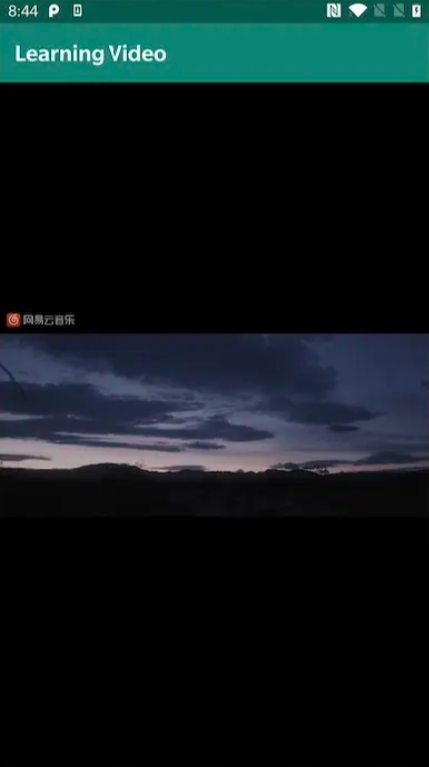

### 3.6 项目实战


## 04.底层原理


## 05.深度思考

### 5.1 关键问题探究


### 5.2 设计对比


## 06.实践验证

### 6.1 行为验证代码


### 6.2 性能测试


## 07.应用场景

### 7.1 最佳实践


### 7.2 使用禁忌


## 08.总结提炼

### 8.1 核心收获


### 8.2 知识图谱


### 8.3 延伸思考


## 09.参考资料

1. []()
2. []()
3. []()

## 其他介绍

### 01.关于我的博客

- csdn：http://my.csdn.net/qq_35829566

- 掘金：https://juejin.im/user/499639464759898

- github：https://github.com/jjjjjjava

- 邮箱：[934137388@qq.com]


好，从用户点开 App 那一刻开始，一步步走。

------

### 第一阶段：初始化（主线程）

**Activity.onCreate → initRender()**


```kotlin
// 第293-311行
private fun initRender() {
    // ① 创建Drawer实例（此时什么都没发生，只是new了个对象）
    drawer = VideoDrawer()
    //    → 构造函数中 init { initPos() }
    //    → 分配 FloatBuffer（堆外内存），灌入顶点坐标和纹理坐标
    //    → 此时：mTextureId=-1, mProgram=-1, mSurfaceTexture=null

    // ② 注册回调（只是存下lambda，还没执行）
    drawer.getSurfaceTexture {
        initPlayer(Surface(it))    // 这个lambda等SurfaceTexture创建好才会触发
    }
    //    → VideoDrawer内部：mSftCb = cb（存下回调）

    // ③ 配置GLSurfaceView并启动GL线程
    gl_surface.setEGLContextClientVersion(2)          // 使用OpenGL ES 2.0
    gl_surface.setRenderer(SimpleRender(drawer))       // 设置Renderer
    //    → GLSurfaceView内部：创建GL线程，创建EGL上下文，绑定Surface2
    //    → 触发 onSurfaceCreated 回调
}
```

此时主线程的工作**暂停等待**，GL 线程开始工作。

------

### 第二阶段：GL 线程初始化

**SimpleRender.onSurfaceCreated()**


```kotlin
override fun onSurfaceCreated(gl: GL10?, config: EGLConfig?) {
    GLES20.glClearColor(0f, 0f, 0f, 0f)    // 背景色设为黑色

    // ④ 从纹理池申请一个ID
    val textureIds = IntArray(1)
    GLES20.glGenTextures(1, textureIds, 0)
    //    → 拿到一个整数ID，比如 1

    // ⑤ 传给Drawer
    mDrawer.setTextureID(textureIds[0])
}
```

**VideoDrawer.setTextureID()**（第 268-272 行）


```kotlin
override fun setTextureID(id: Int) {
    // ⑥ 保存纹理ID
    mTextureId = id    // mTextureId = 1

    // ⑦ 用这个ID创建SurfaceTexture（绑定到BufferQueue）
    mSurfaceTexture = SurfaceTexture(id)

    // ⑧ 触发之前注册的回调，把SurfaceTexture传出去
    mSftCb?.invoke(mSurfaceTexture!!)
    //    → 执行Activity中的lambda
}
```

**回调触发，回到 Activity（主线程）**


```kotlin
// 第305-308行，这个lambda现在被执行了
drawer.getSurfaceTexture {
    // ⑨ 用SurfaceTexture创建Surface（包装producer端）
    // ⑩ 初始化播放器
    initPlayer(Surface(it))
}
```

**Activity.initPlayer()**（第 313-324 行）


```kotlin
private fun initPlayer(sf: Surface) {
    val threadPool = Executors.newFixedThreadPool(10)

    // ⑪ 创建视频解码器，传入Surface1
    val videoDecoder = VideoDecoder(path, null, sf)
    //    → 内部：MediaCodec.configure(format, sf, ...)
    //    → MediaCodec拿到Surface1，解码输出直写GraphicBuffer
    threadPool.execute(videoDecoder)

    // ⑫ 创建音频解码器
    val audioDecoder = AudioDecoder(path)
    threadPool.execute(audioDecoder)

    // ⑬ 开始解码
    videoDecoder.goOn()
    audioDecoder.goOn()
}
```

------

### 第三阶段：GL 线程继续初始化

**SimpleRender.onSurfaceChanged()**（第 502-506 行）


```kotlin
override fun onSurfaceChanged(gl: GL10?, width: Int, height: Int) {
    // ⑭ 设置视口（告诉OpenGL渲染区域大小）
    GLES20.glViewport(0, 0, width, height)    // 比如 1080, 1920

    // ⑮ 把屏幕尺寸传给Drawer（用于计算正交矩阵）
    mDrawer.setWorldSize(width, height)
    //    → mWorldWidth=1080, mWorldHeight=1920
}
```

------

### 第四阶段：每帧渲染循环（GL 线程，反复执行）

**SimpleRender.onDrawFrame()**


```kotlin
override fun onDrawFrame(gl: GL10?) {
    // ⑯ 清屏
    GLES20.glClear(GL_COLOR_BUFFER_BIT or GL_DEPTH_BUFFER_BIT)

    // ⑰ 驱动Drawer执行
    mDrawer.draw()
}
```

**VideoDrawer.draw()**（第 385-398 行）—— 核心 5 步


```kotlin
override fun draw() {
    if (mTextureId != -1) {    // mTextureId=1，通过检查

        // ⑱ 步骤1: 计算正交矩阵（只算一次）
        initDefMatrix()
        //    → 首次：mMatrix==null，进入计算
        //    → originRatio = 1920/1080 = 1.78
        //    → worldRatio = 1080/1920 = 0.5625
        //    → originRatio > worldRatio → 视频更扁 → 缩放高度
        //    → actualRatio = 1.78/0.5625 = 3.16
        //    → orthoM(-1,1,-3.16,3.16,-1,3)
        //    → 之后：mMatrix!=null，直接return

        // ⑲ 步骤2: 编译着色器+组装程序（只编译一次）
        createGLPrg()
        //    → 首次：mProgram==-1，进入编译
        //    → loadShader(顶点) + loadShader(片元)
        //    → glCreateProgram + glAttachShader×2 + glLinkProgram
        //    → glGetAttribLocation("aPosition") → mVertexPosHandler
        //    → glGetAttribLocation("aCoordinate") → mTexturePosHandler
        //    → glGetUniformLocation("uTexture") → mTextureHandler
        //    → glGetUniformLocation("uMatrix") → mVertexMatrixHandler
        //    → 之后：mProgram!=-1，跳过编译
        //    → 每帧都执行：glUseProgram(mProgram)

        // ⑳ 步骤3: 激活纹理
        activateTexture()
        //    → glActiveTexture(GL_TEXTURE0)           激活0号单元
        //    → glBindTexture(OES, mTextureId)         绑定OES纹理到0号
        //    → glUniform1i(mTextureHandler, 0)        告诉着色器去0号取
        //    → glTexParameterf × 4                    配置缩放+边缘

        // ㉑ 步骤4: 更新纹理
        updateTexture()
        //    → mSurfaceTexture.updateTexImage()
        //    → 从BufferQueue取最新帧 → EGLImage → 绑定到OES纹理
        //    → 如果没有新帧，不做任何事

        // ㉒ 步骤5: 绑定数据+绘制
        doDraw()
        //    → glEnableVertexAttribArray × 2          启用两个属性通道
        //    → glUniformMatrix4fv(矩阵)               上传正交矩阵到GPU
        //    → glVertexAttribPointer(顶点坐标buffer)   绑定顶点数据到槽位
        //    → glVertexAttribPointer(纹理坐标buffer)   绑定纹理坐标到槽位
        //    → glDrawArrays(TRIANGLE_STRIP, 0, 4)     绘制！
    }
}
```

**绘制之后，GLSurfaceView 自动调用 eglSwapBuffers**


```
→ 交换前后缓冲
→ Binder通知SurfaceFlinger
→ SurfaceFlinger合成（视频画面 + 系统UI）
→ 硬件显示
→ 一帧完成，等待下一次 onDrawFrame
```

------

### 完整时序汇总


```
主线程                    GL线程                    解码线程
  │                         │                         │
  ├─ new VideoDrawer()      │                         │
  ├─ initPos()              │                         │
  ├─ getSurfaceTexture(cb)  │                         │
  ├─ setRenderer()─────────→│                         │
  │                         ├─ onSurfaceCreated       │
  │                         ├─ glGenTextures          │
  │                         ├─ setTextureID(id)       │
  │                         │  ├─ new SurfaceTexture  │
  │  ←─ cb.invoke(st) ─────│  └─ 触发回调            │
  ├─ new Surface(st)        │                         │
  ├─ new VideoDecoder(sf)───│─────────────────────────→│
  ├─ goOn()                 │                         ├─ MediaCodec.start()
  │                         ├─ onSurfaceChanged       │
  │                         ├─ setWorldSize           │
  │                         │                         │
  │                         ├─ onDrawFrame ←──────────┤ 解码写入GraphicBuffer
  │                         │  ├─ initDefMatrix       │
  │                         │  ├─ createGLPrg         │
  │                         │  ├─ activateTexture     │
  │                         │  ├─ updateTexImage      │
  │                         │  ├─ doDraw              │
  │                         │  └─ swapBuffers→屏幕    │
  │                         │                         │
  │                         ├─ onDrawFrame（重复）     │
  │                         ├─ ...                    │
```

------

这就是从 App 启动到每帧上屏的完整代码执行流。有哪里不清楚的吗？