[toc]

## 前言

> 学习要符合如下的标准化链条：了解概念->探究原理->深入思考->总结提炼->底层实现->延伸应用"

## 01.学习概述

- **学习主题**：
- **知识类型**：
  - [ ] ✅Android/ 
    - [ ] ✅01.基础组件与机制 
      - [ ] ✅四大组件
      - [ ] ✅IPC机制
      - [ ] ✅消息机制
      - [ ] ✅事件分发机制
      - [ ] ✅View与渲染体系（含Window、复杂控件、动画）
      - [ ] ✅存储与数据安全（SharedPreferences/DataStore/Room/Scoped Storage）
    - [ ] ✅02. 架构与工程化
      - [ ] ✅架构模式（MVC/MVP/MVVM/MVI）
      - [ ] ✅依赖注入（Koin/Hilt/Dagger）
      - [ ] ✅路由与模块化（ARouter、Navigation）
      - [ ] ✅Gradle与构建优化
      - [ ] ✅插件化与动态化
      - [ ] ✅插桩与监控框架
    - [ ] ✅03.性能优化与故障诊断
      - [ ] ✅ANR分析与优化
      - [ ] ✅启动耗时优化
      - [ ] ✅内存泄漏监控
      - [ ] ✅监控与诊断工具
    - [ ] ✅04.Jetpack与生态框架
      - [ ] ✅Room
      - [ ] ✅Paging
      - [ ] ✅WorkManager
      - [ ] ✅Compose
    - [ ] ✅05.Framework与系统机制
      - [ ] ✅ActivityManagerService (含ANR触发机制)
      - [ ] ✅Binder机制
  - [ ] ✅音视频开发/
    - [ ] ✅01.基础知识
    - [ ] ✅02.OpenGL渲染视频
    - [ ] ✅03.FFmpeg音视频解码
  - [ ] ✅ Java/
    - [ ] ✅01.基础知识
    - [ ] ✅02.集合框架
    - [ ] ✅03.异常处理
    - [ ] ✅04.多线程与并发
    - [ ] ✅06.JVM
  - [ ] ✅ Kotlin/
    - [ ] ✅01.基础语法
    - [ ] ✅02.高阶扩展
    - [ ] ✅03.协程和流
  - [ ] ✅ Flutter/
    - [ ] ✅01.基础基础语法
    - [ ] ✅02.状态管理
    - [ ] ✅03.路由与依赖注入
    - [ ] ✅04.原生通信
  - [ ] ✅ 自我管理/
    - [ ] ✅01.内观
  - [ ] ✅ 项目经验/
    - [ ] ✅01.启动逻辑
    - [ ] ✅02.云值守
    - [ ] ✅03.智控平台
- **学习来源**：
- **重要程度**：⭐⭐⭐⭐⭐
- **学习日期**：2025.
- **记录人**：@panruiqi

### 1.1 学习目标

- 了解概念->探究原理->深入思考->总结提炼->底层实现->延伸应用"

### 1.2 前置知识

- [ ] 

## 02.核心概念

### 2.1 是什么？

什么是GL？有什么作用？

- 我们先来弄清楚 OpenGL、GPU、EGL 和显示之间的关系。
  - 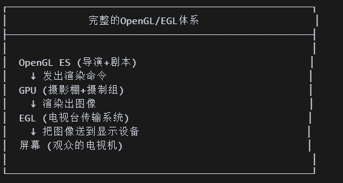
- ok，EGL其实就是把GPU渲染出的存放在显存中图像送到显示设备中
- EGL的作用：他本质就是个适配器，用于适配OpenGL和Android窗口，让OpenGL知道使用什么资源，渲染到什么位置，并最终交给谁去显示。

### 2.2 解决什么问题？

### 2.3 基本特性

## 03.原理机制

### 3.1 EGL中的核心概念

由上其作用，我们可以看出，EGL的职责是：负责和底层驱动连通，将图像从显存送到屏幕上显示。

考虑他的职责，他有如下主要概念

- EGLDisplay：EGLDisplay 是物理显示硬件在 EGL 中的逻辑连接，在Android上，它连接到SurfaceFlinger（系统合成器）

- EGLConfig：在创建Surface和Context之前选择，用于告诉系统你要什么最终的屏幕输出规格（也就是最终的屏幕渲染格式），系统给你匹配
  - 这里用户要求为configAttribs，然后从调用系统方法eglChooseConfig，系统根据你的需求，输出匹配的配置规格到configs中。然后这里用户直接选择了configs[0]
  - 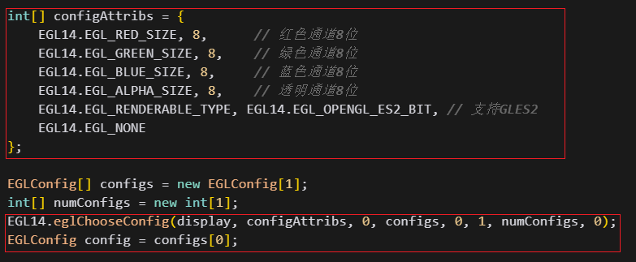

- EGLContext：他是OpenGL状态机的实例，保存shader、texture等OpenGL渲染时需要的GPU资源
  - 拥有资源池，OpenGl状态，绑定信息等。
  - 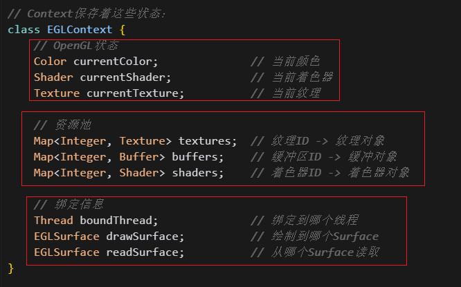
  - 举例，这是实际的使用，通过EGLContext去区分不同的纹理。
  - 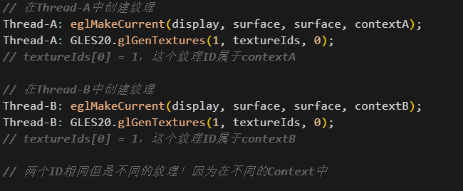
  - 默认情况下，资源属于单个Context。但是可以通过共享Context：可以让多个Context访问同一个资源池
  
- EGLSurface：很不好理解

  - 我们要先看看现代Android系统的图形系统架构
  - 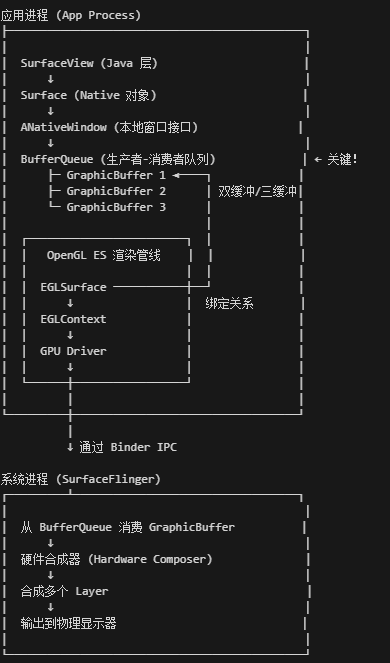
  - 可以看到，假设我们Kotlin中创建了一个SurfaceView。其在Native层拥有一个Surface。
  - Surface创建时，SurfaceFlinger为其分配BufferQueue，我们可以通过EGL，将这个BufferQueue绑定到EGLSurface中，然后GPU渲染时，EGLSurface 动态地从 BufferQueue 获取一个 GraphicBuffer作为当前的渲染目标，渲染完成后归还，再获取下一个
  - 同时其可以通过BinderIPC，将"有新的一帧ready了"的信号送到系统进程SurfaceFlinger中。SurfaceFlinger通过共享内存消费这个一帧，并尝试合成显示到物理显示器上。
  - 这里的GraphicBuffer使用 DMA-BUF（Direct Memory Access Buffer），即：GPU 和 CPU 可以直接访问同一块物理内存

- 好，我们现在来理解一下EGLSurface，EGLSurface是一个包含指针的轻量级结构体，他类似一个适配器，用于连通OpenGL ES和Android的平台窗口系统。

  - OpenGL 说："画一个红色三角形"

  - EGLSurface 说："好的，我告诉 GPU 画到 GraphicBuffer #2"

  - GPU 说："收到，开始渲染到这个位置"
  - 他用于告诉 GPU："把渲染结果送到这个地址"

- 这是整个的渲染流程

  - 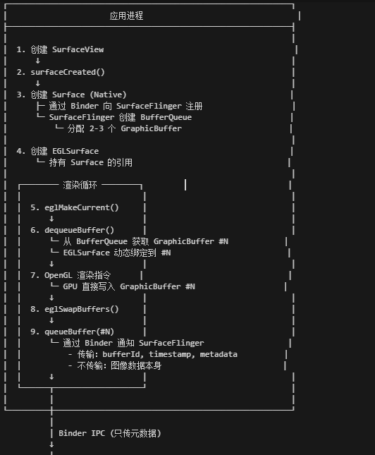
  - 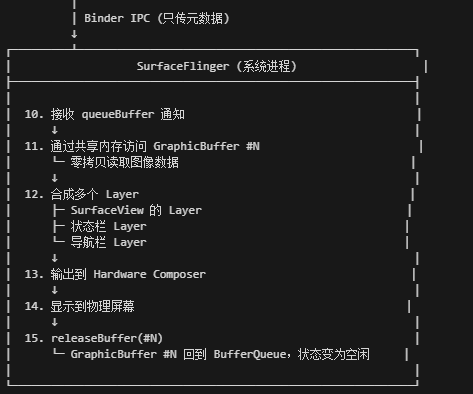

### 3.2 如何使用EGL？

我们先思考一个问题，带着问题去学习。

> 提问：如果同时有两个GLSurfaceView在渲染视频画面，OpenGL为什么能够正确的把画面分别绘制到两个GLSurfaceView中？
>
> 仔细回想一下OpenGL ES的每个API，有没有哪个API是指定当前画面是渲染到哪个GLSurfaceView的？没有！

我们先来最简化看看实际开发中如何使用EGL，然后再看看对EGL的封装EGLCore，这样避免我们陷入到代码的细节中，而忽略了整体的流程

好，我们来看一个建议的自定义的GLSurfaceView，其继承自SurfaceView

- 他拥有一个GL渲染线程，并在SurfaceCreated的时候创建GL线程
  - 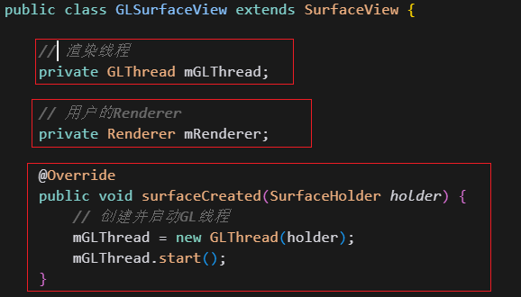
- 这是渲染线程的run方法，内部会初始化EGL的四个组件。然后将其和当前的线程绑定。
  - 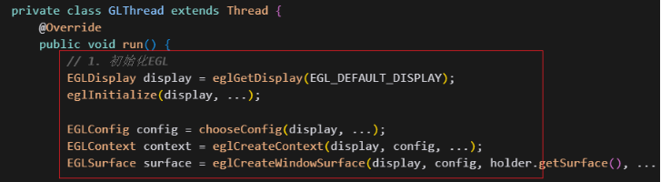
- 接着run方法中会执行渲染循环，这里面有两个我们没学过的核心方法：eglMakeCurrent 和 eglSwapBuffers
  - 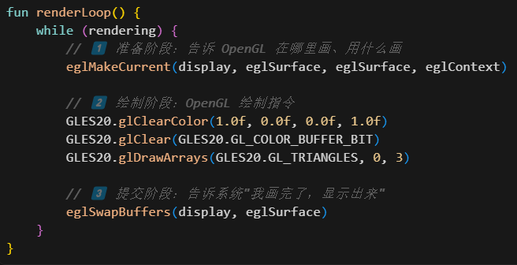
- eglMakeCurrent主要用于让OpenGL知道EGLContext以及GPU的最终渲染目标，大致如下
  - 获取共享的GraphicBuffer，配置给EGLSurface和GPU渲染目标
  - 切换线程的OpenGL上下文，加载给GPU
  - 此时OpenGL知道，在哪个线程里，使用哪些资源，渲染到哪个缓冲区
  - 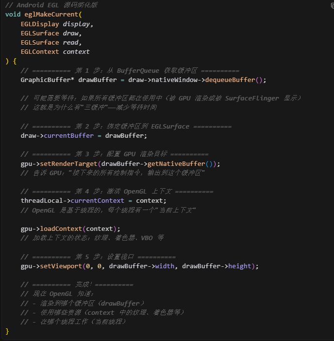

- eglSwapBuffers用于告诉OpenGL，我画完了，把这幅画显示出来，给我一块新画布继续画
  - 等待GPU完成渲染
  - 通过Binder告知SurfaceFlinger获取渲染结果，其会自动将它混合显示到屏幕上
  - 然后获取下一个缓冲区，配置为GPU下一帧的渲染目标
  - 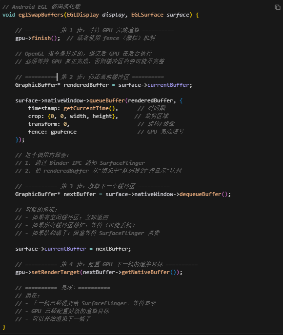

好的，我们知道了EGL的作用了：他本质就是个适配器，用于适配OpenGL和Android窗口，让OpenGL知道使用什么资源，渲染到什么位置，并最终交给谁去显示。

这里面有几个核心的内容：EGL的初始化，eglMakeCurrent， eglSwapBuffers。

### 3.3 EGL的实际代码_EGLCore

好，我们来看看封装EGL核心API，内部涉及到如何初始化EGL四大组件，如何进行绑定等。

首先，对EGL初始化的核心（也就是上面介绍的EGL的核心知识）内容进行封装，命名为 EGLCore

我们先来看成员变量

- EGLDisplay ,EGLContext ,EGLConfig的引用
  - 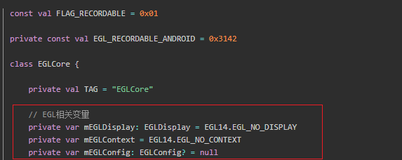

然后是init阶段，用于完成 EGL 初始化，最终得到可用的 `mEGLDisplay`、`mEGLContext`、`mEGLConfig`，我们只挑重点看

- 获取和配置mEGLDisplay
  - 创建Display：
  - 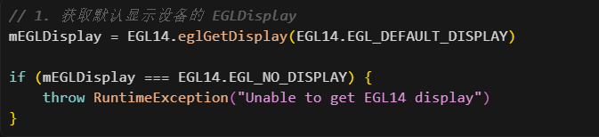
  - EGL14.EGL_DEFAULT_DISPLAY 是什么？
  - 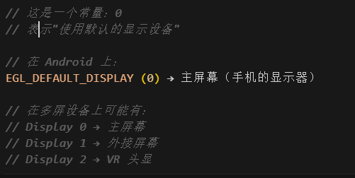
- 初始化Display：`eglInitialize` 会初始化 EGL 并返回版本号（放在 `version[0]` 和 `version[1]`）。初始化失败则重置 `mEGLDisplay` 并抛出异常。
    - 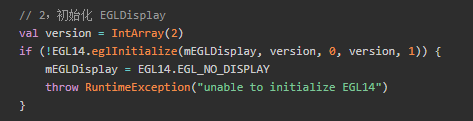
- 选择EGLConfig（配置渲染规格）
  - 首先配置自己期望的参数列表
  - 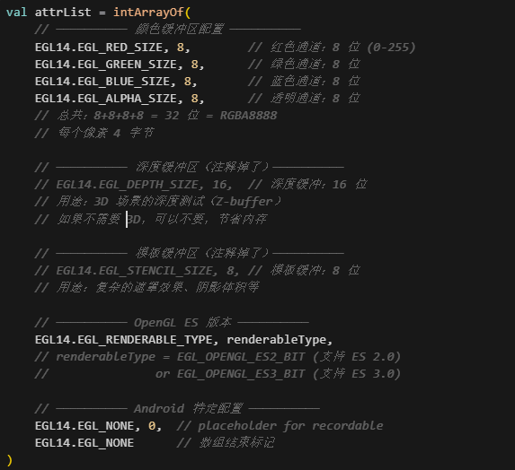
  - 然后是选择Config的过程
  - 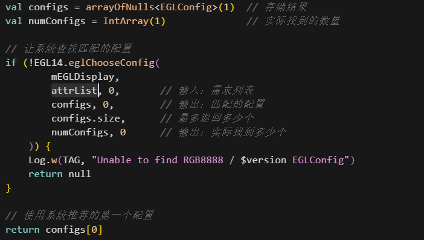
  - 这是内部的查找过程
  - 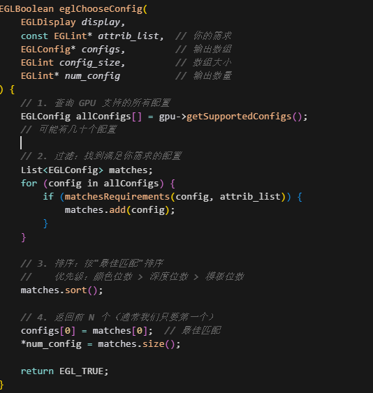
- 创建EGLContext（创建 OpenGL 上下文）
  - 首先配置期望的EGLContext的属性
  - 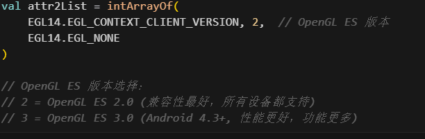
  - 然后是创建context
  - 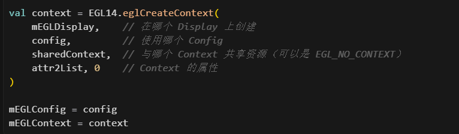
  - 这里要注意的是共享资源，可以这样配置来共享资源
  - 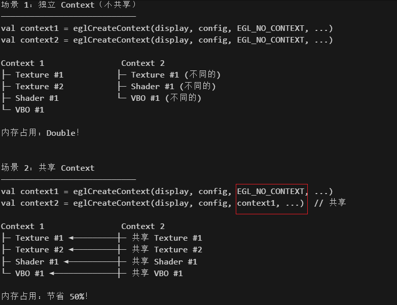

- 好的，这是上面的小结
  - 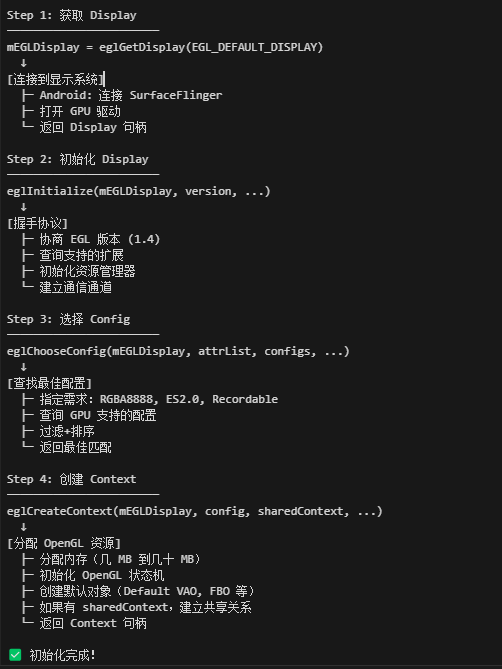

好了，我们init了我们的EGLDisplay，EGLConfig，，EGLContext了。但是我们好像遗落了我们的EGLSurface

我们的EGLSurface有两种创建方法：分别对应**可见窗口渲染WindowSurface**和**离屏渲染PbufferSurface**

> 我们要先来理解什么是可见窗口渲染，什么是离屏渲染，我们来看一下。
>
> 首先是可见窗口渲染，上面我们说过了。这里再说一下
>
> - 对于WindowSurface ，其完整数据流如下
>   - Surface创建时，由SurfaceFlinger分配给Surface一连串的GraphicBuffer。（这个是公有的）
>   - 通过eglMakeCurrent于让OpenGL知道EGLContext以及GPU的最终渲染目标
>   - GPU渲染数据到GraphicBuffer中
>   - 通过eglSwapBuffers告诉OpenGL，绘制完成后，通过Binder告知SurfaceFlinger获取渲染结果，其会自动将它混合显示到屏幕上
>   - 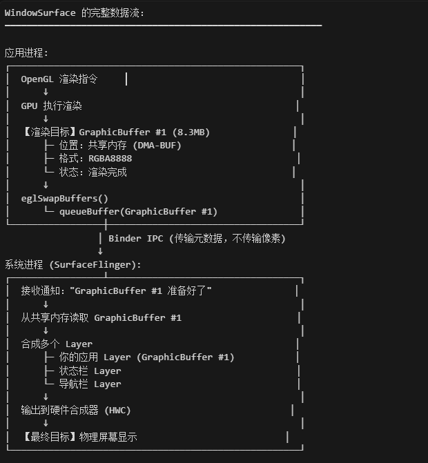
>   - 其最终会渲染到屏幕上。
>
> 那么对于离屏渲染呢？
>
> - 对于PbufferSurface，其完整数据流如下
>   - 其渲染的目标是应用的私有GraphicBuffer。
>   - 你也无需通过eglSwapBuffers，并最终通过Binder告知SurfaceFlinger获取渲染结果
>   - 你有多个可选操作，glReadPixels() 读取像素到 CPU ；glCopyTexSubImage2D() 拷贝到纹理 ；直接作为纹理输入给其他渲染。
>   - 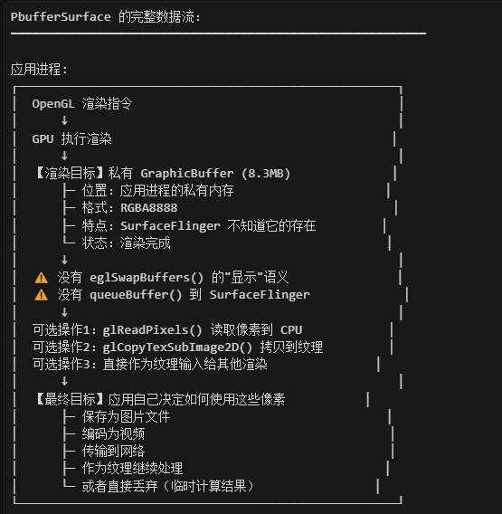
>
> 好的，我们这里可以看到，关键点在于渲染的输出目标不同，如果是WindowSurface ，那么创建时，由SurfaceFlinger分配给Surface一连串的GraphicBuffer，这是共享内存。如果是PbufferSurface，那么创建时，SurfaceFlinger不会分配，其只能使用自身私有的GraphicBuffer。

好，我们来看一下可见窗口的创建过程

- 具体过程如下
  - 类型检查，只接受Surface和SurfaceTexture
  - 创建EGLSurface（指定在哪个Display上， 使用什么Config，连接到哪个Surface（也就是哪个GraphicBuffer），自什么属性列表）
  - 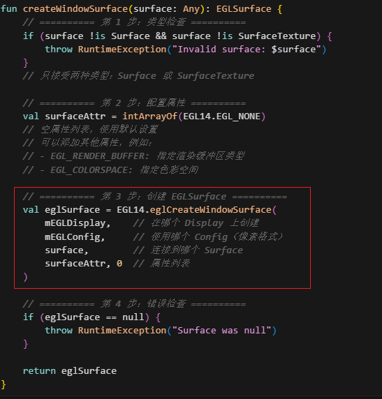

> 好啊，我们怎么理解这里的Surface和SurfaceTexture？
>
> Surface 本质是对 BufferQueue 生产端接口的封装，对于SurfaceView，SurfaceFlinger为其分配的GraphicBuffer，实际上是由其所拥有的Surface代为掌握，确切的来说，Surface掌握的是GraphicBuffer的生产者接口，
>
> - 这是SurfaceView 的完整结构。
>   - SurfaceView是Java层，通过SurfaceHolder持有Surface。
>   - 对于Native层的Surface，其拥有生产者接口，使得可以通过其将数据放入GraphicBuffer中
>   - SurfaceFlinger持有消费者接口，通过Binder的IPC通信唤醒SurfaceFlinger，其会从BufferQueue获取GraphicBuffer ，合成所有Layer，并最终输出到屏幕。
>   - 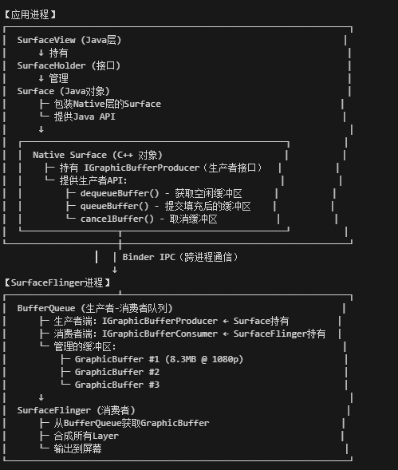
> - 你可以通过调用Surface相关方法来生产和消费BufferQueueu。lockCanvas() → 获取可写的 Buffer（dequeue）；unlockCanvasAndPost() → 提交 Buffer（queue）。
>
> 好，那么SurfaceTexture呢？SurfaceTexture是BufferQueue的消费端。他用于消费BufferQueue，将其转换为 OpenGL ES 纹理（Texture），和SurfaceFlinger不一样，一个是消费到屏幕，一个是消费作为纹理。
>
> - 这是大致的流程：
>   - 获取GraphicBuffer：在调用 updateTexImage() 时，主动从 BufferQueue dequeue 获取最新的 GraphicBuffer
>   - 纹理绑定：将 GraphicBuffer 的底层内存（共享内存）， 通过 EGLImage 绑定到 OpenGL Texture 对象
>   - GPU访问：GPU 渲染时通过 DMA 直接访问共享内存
>   - 格式转换：GPU 纹理单元在采样时硬件实时转换，如：YUV->RGB
>
> 好，现在有几个问题
>
> - GraphicBuffer 的数据类型不应该是渲染后的RGB吗？
>   - 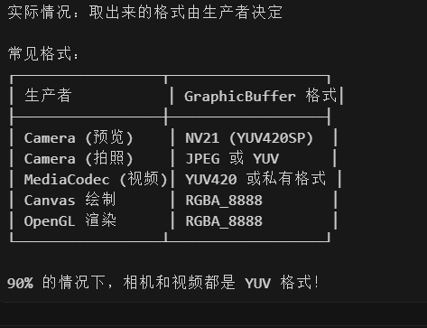
> - GraphicBuffer的数据结构
>   - 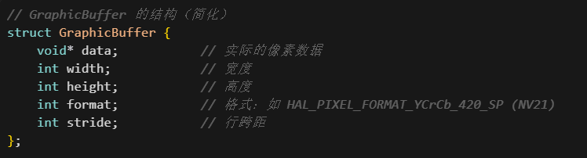
>
> 那么GLSurfaceView呢？
>
> - GLSurfaceView = SurfaceView + OpenGL ES 渲染线程管理
> - 也就是说： GLSurfaceView 是 Android 提供的封装类，它继承自 SurfaceView，只不过他内部自动处理了 EGL 初始化和渲染线程管理
> - 这是对比图，看的出来，你只用去实现Renderer接口就行
>   - 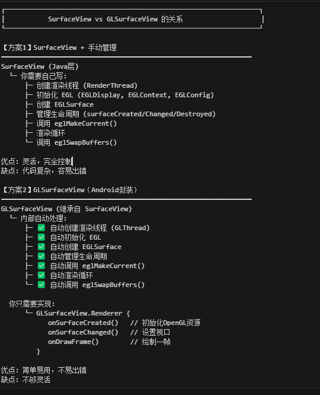

好，接下来我们看一下离屏窗口的创建过程
- 需要自己分配内存作为离屏缓冲区。
  - 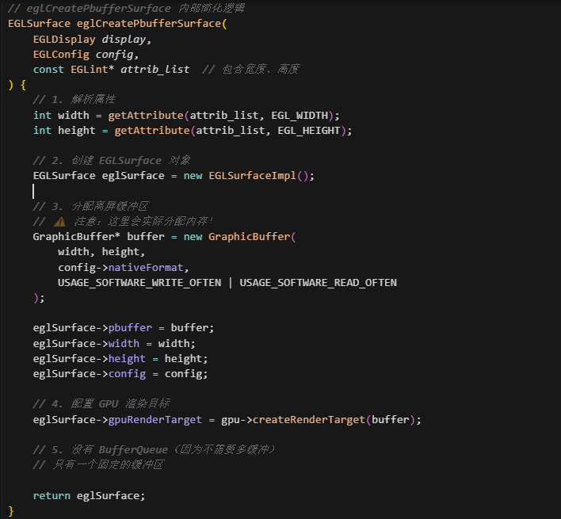

看一下makeCurrentn呢，没啥好说的，调用eglMakeCurrent，这个逻辑参考上面

- 如下：
  - 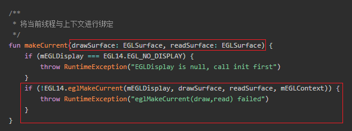

swapBuffers,同理

- 如下
  - 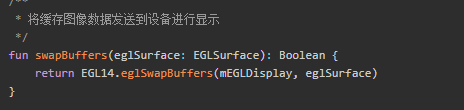

setPresentationTime

- 设置 当前帧的显示时间戳（纳秒）。
- 我们知道我们之前在OpenGL中会设置他的播放时间
  - 但是这里是renderFrame（）后调用的，用于给画面打上“播放时间标签”
  - 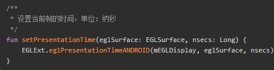

最后是我们的EGL 资源清理和销毁阶段了

- 销毁EGLSurface，并解除上下文绑定

  - 先调用 `eglMakeCurrent(...EGL_NO_CONTEXT...)`：解除当前线程对该 Surface 的绑定，避免后续操作访问已销毁的 Surface
  - 调用eglDestroySurface销毁指定的 EGLSurface，释放它占用的 GPU / 显存资源。
  - 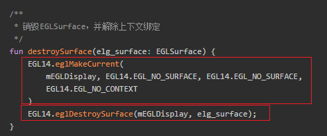

- 释放资源

  - 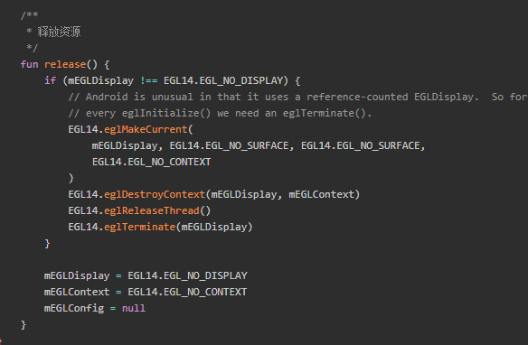

> 好啊，现在我们回过头来看看这个问题：如果同时有两个GLSurfaceView在渲染视频画面，OpenGL怎么知道在哪个线程中把内容画到哪个Surface上？
>
> 好，我们现在来构建一个场景
>
> - 两个线程都调用了 GLES20.glClearColor()，不过一个设置为红色，一个设置为绿色。OpenGL怎么知道要操作哪个Surface？
>   - 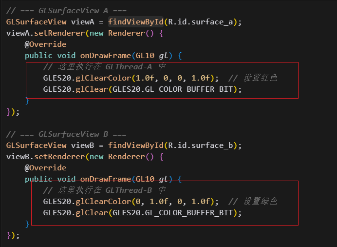
>
> 这依赖于`eglMakeCurrent，其底层原理，
>
> - 线程启动时的绑定过程
>   - 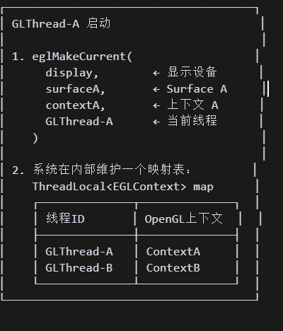
> - API调用时的自动切换：当你在 GLThread-A 中调用GLES20.glGenTextures(1, textureIds, 0);
>   - 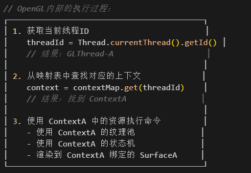
> - 所以，其本质是：contextA持有对应资源的引用，我们在对应线程中执行相应命令时，会通过线程ID找到对应的context并使用其持有的资源引用执行相关的命令。

### 3.4 EGL的实际代码_EGLSurfaceHolder

- 代码很简单，最重要的就是持有了EGLSurface和EGLCore，通过代理模式，交给EGLCore处理
  - 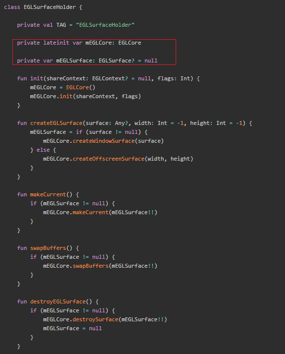

### 3.5 CustomerGLRenderer_使用EGL实现自定义渲染

在讲解具体代码之前，我们先理解为什么要自己实现一个渲染器：

- GLSurfaceView的局限性：渲染目标只能是屏幕窗口，难以实现离屏渲染（如视频录制）
- 自定义EGL渲染器的优势：可以渲染到任意Surface（窗口/离屏/视频编码器），可以实现多线程渲染、共享Context等高级特性

好，看一下整体的结构设计

- 三层结构，渲染器管理层持有渲染线程和用于显示的SurfaceView引用。 渲染线程是一个状态机，同时持有EGL封装。EGL操作层持有EGLCore
  - 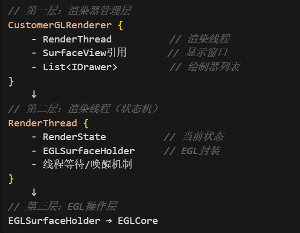

我们为什么这样设计呢？

- 首先，这源自于我们对SurfaceView的使用，UI线程拥有View，SurfaceView的生命周期回调在UI线程，CustomerGLRenderer作为"转发器"，将生命周期事件转发给渲染线程
- CustomerGLRenderer持有渲染线程。管理渲染线程的启动和停止，通过状态改变 + notify/wait 机制通信
- 渲染线程持有EGLSurfaceHolder，他通过EGLCore封装了EGL的操作；
- 渲染线程是个状态机，通过获取View的生命周期事件更改自身状态，状态机决定何时渲染、何时等待、何时停止。当渲染线程开启渲染循环时，会其中调用OpenGL控制渲染流程，并通过EGL让OpenGL知道使用什么资源，渲染到什么位置，并最终交给谁去显示。
- 这是应用的架构
  - 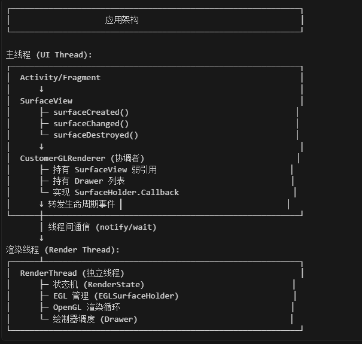

好，我们先看一下CustomerGLRenderer，其是一个转发器和生命周期管理器，其负责接收 Surface 生命周期事件 转发事件给渲染线程，以及启动和管理渲染线程   

看看他的代码

- 成员变量部分

  - 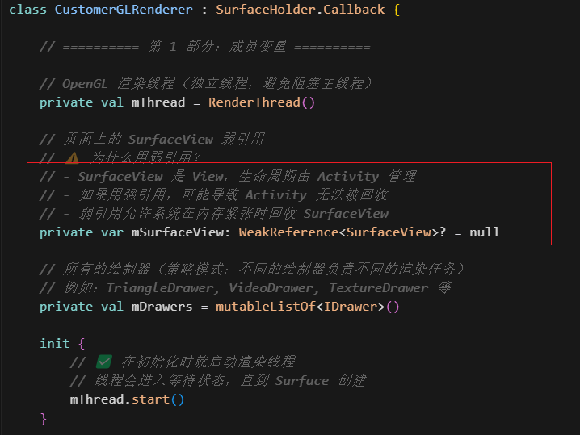

  > - 这里的IDrawer表示其是一个渲染器，这是定义
  >   - 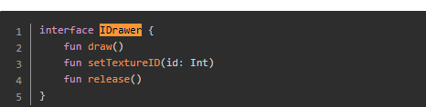
  > - 这是实现这个接口的视频渲染器
  >   - 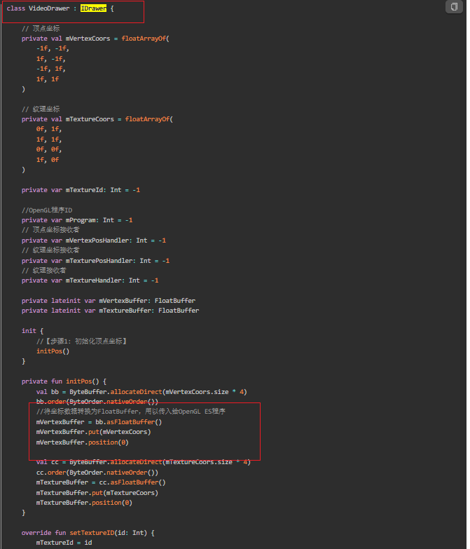
  > - ok，看完就知道了，其实就是规定一个标准化的流程，具体是调用OpenGL ES去控制GPU操作。
  > - 我们暂且先忽略这个问题

- 设置Surface，监听其生命周期并转发给mThread
  - 这里可以看见，既要监听Surface的生命周期，也要监听View的attach和detach状态。
  - 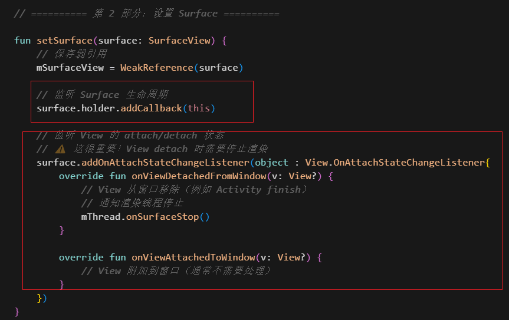
  - 这是Callback的实现
  - 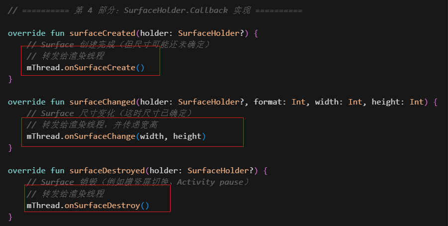

我们看完了CustomerGLRenderer，接下来看一下RenderThread，也就是真正的调用EGL和OpenGL执行渲染的渲染线程了。

RenderThread是一个状态机 + EGLHolder + 通过inner使用外部的IDrawer（OpenGL调用者），我们主线程中可以借助CustomerGLRenderer通过wait/notify将其与主线程同步

先来看看他的状态转换

- 这是他的状态转换图
  - 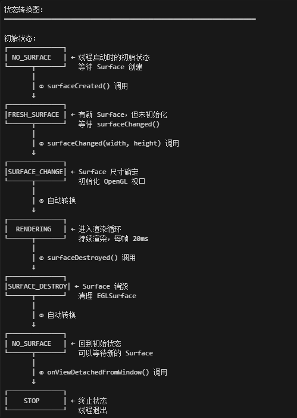

看看代码

- 线程同步机制，没啥好说的
  - 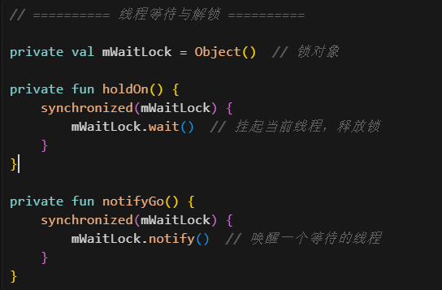
  - 这是主线程通过转发回调控制其挂起和唤醒
  - 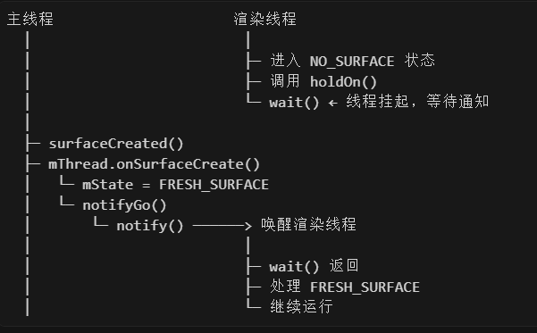
- 生命周期控制方法，外部通过调用其生命周期控制方法，改变他的状态
  - 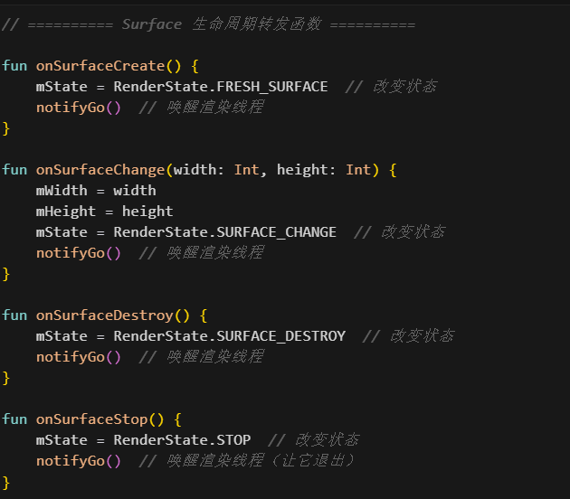
- 渲染循环（核心）
  - 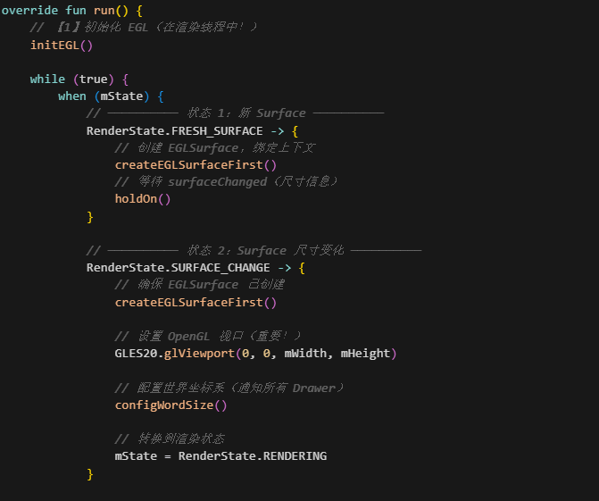
  - 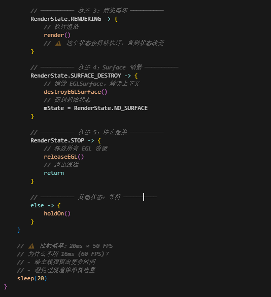

- EGL相关操作
  - 这是其初始化操作，这个mEGLSurface不是真的EGLSurface，而是EGLSurfaceHolder。
  - 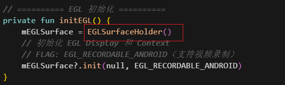
  - 这是EGLSurface的创建操作
  - 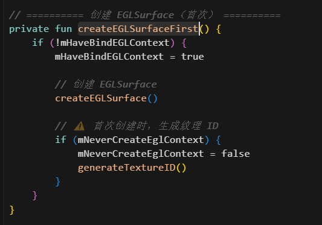
  - 内部的createEGLSurface就是下面这个
  - 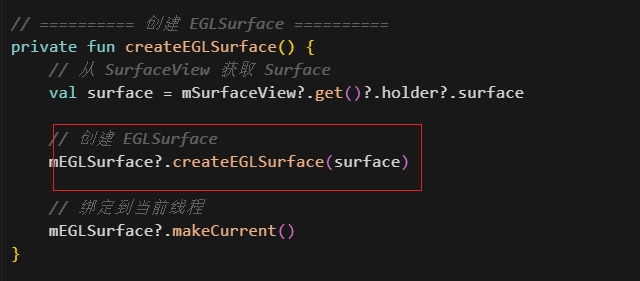
  - 销毁和释放操作
  - 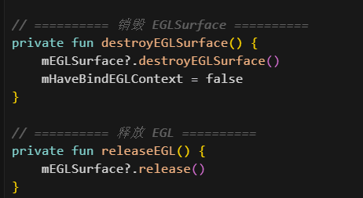
- 好，接着是OpenGL的操作
  - 生成纹理ID
  - 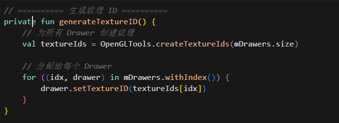
  - 配置世界坐标系
  - 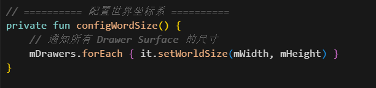
  - 渲染一帧
  - 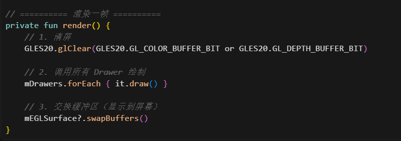

### 3.6 CustomerGLRenderer的实际应用

我们先来看看我们的需求

- 同时播放两个视频，并叠加显示
  - 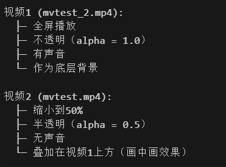
- 先看一下两者的数据流
- 视频1的数据流，将mvtest_2.mp4通过MediaCodec解码获得YUV帧，作为生产者输出到Surface的BufferQueue中。然后用OpenGL作为消费者，将其设置为纹理。GPU消费他，渲染到SurfaceView的BufferQueue中。
  - 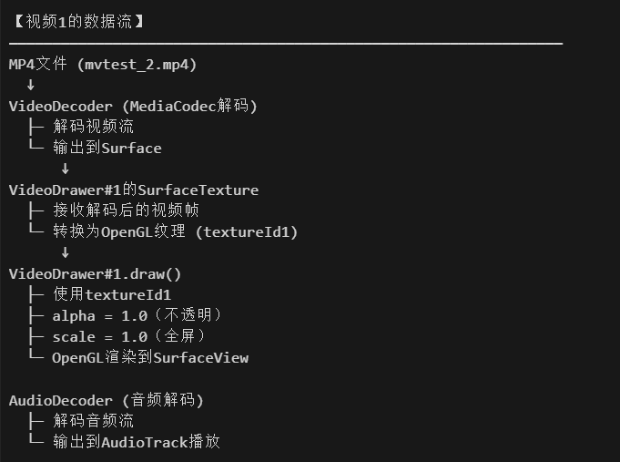
- 视频2的数据流
  - 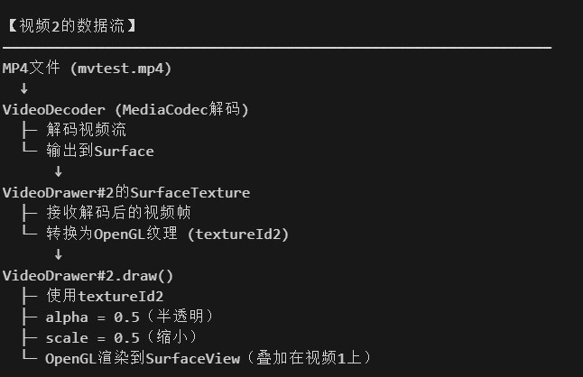
- 最终合成，两个Drawer在同一个渲染线程、同一个EGLContext中工作，它们使用不同的纹理，但绘制到同一个EGLSurface中
  - 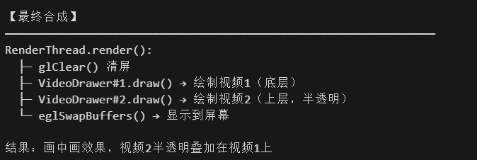
  - 这是理论上的渲染过程，对mDrawers，在渲染线程中顺序调用内部的Drawer
  - 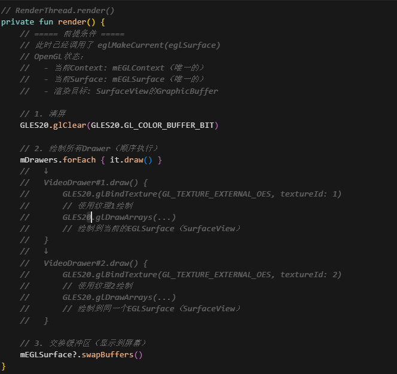

> 好，那么整体的数据流呢
>
> - 这是流向图
>
>   - 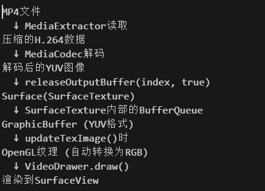
>
> - 首先是视频解码，借助VideoDecoder实现
>
>   - VideoDecoder内部有MediaExtractor读取和MediaCodec解码
>   - MP4文件 → MediaExtractor读取 → H.264数据 → MediaCodec解码 → YUV图像
>
> - 然后是数据送入SurfaceTexture
>
>   - releaseOutputBuffer(index, true) 时，MediaCodec会自动将解析出的 YUV图像作为生产者送到SurfaceTexture内部的BufferQueue
>   - BufferQueue内部的GraphicBuffer是YUV格式
>
> - 接着是SurfaceTexture的updateTexImage，将这个SurfaceTexture中内容作为纹理送给GPU处理
>
>   - 从BufferQueue dequeue获取最新的GraphicBuffer
>
>   - 通过EGLImage绑定到OpenGL Texture
>
>   - GPU通过DMA直接访问共享内存
>
>   - GPU硬件实时转换YUV->RGB
>
> - 最后线程内部的状态机调用OpenGL控制渲染流程，通过EGL让OpenGL知道使用什么资源，渲染到什么位置
>
>   - 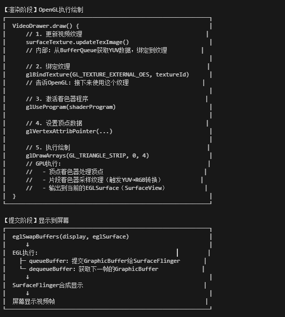
>
> - 然后这个过程中我们依次调用Drawer1和Drawer2的draw流程，渲染到最后的目标共享内存中。此时GraphicBuffer包含叠加画面

ok，我们来逐步看看代码

- Activity 初始化
  - 这个过程中创建两个视频绘制器，然后设置渲染目标
  - 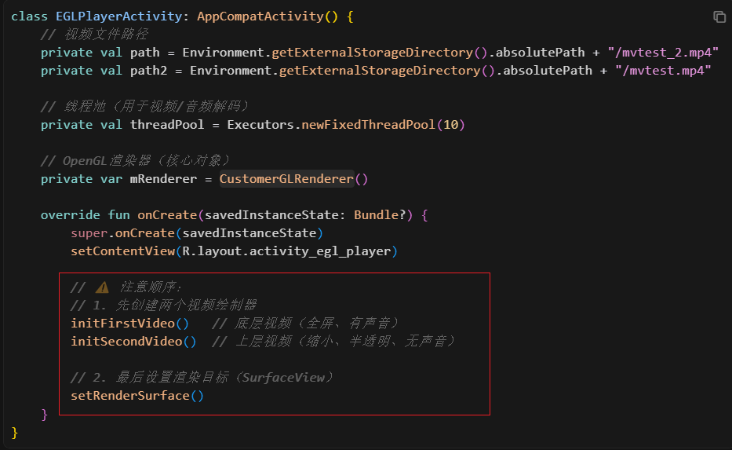
  - 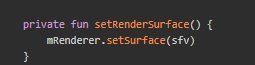
- 看一下这里的initFirstVideo
  - 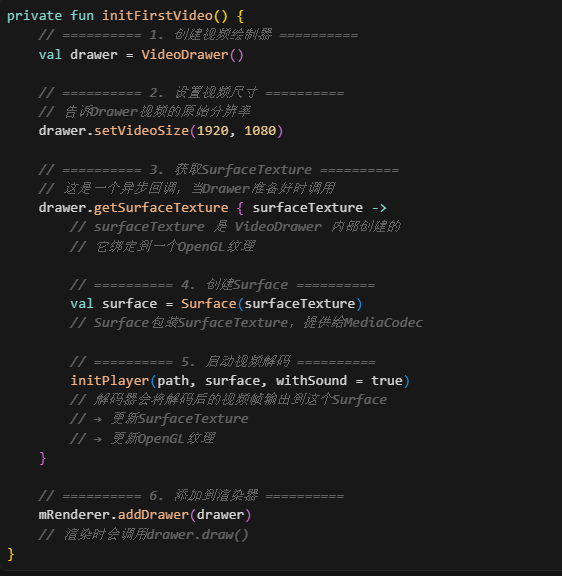
- 这里调用initPlayer启用视频解码，
- initSecondVideo
  - 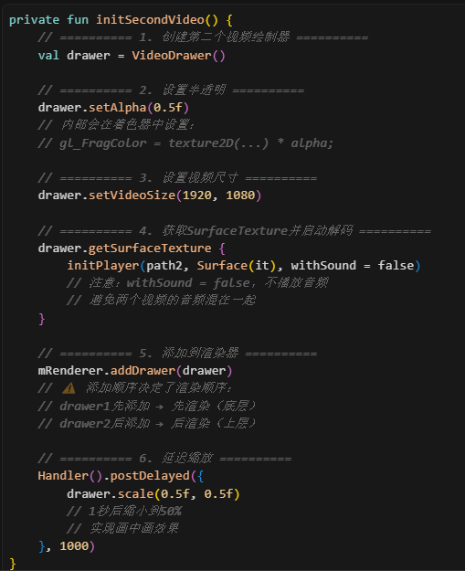
- 启动解码器
  - 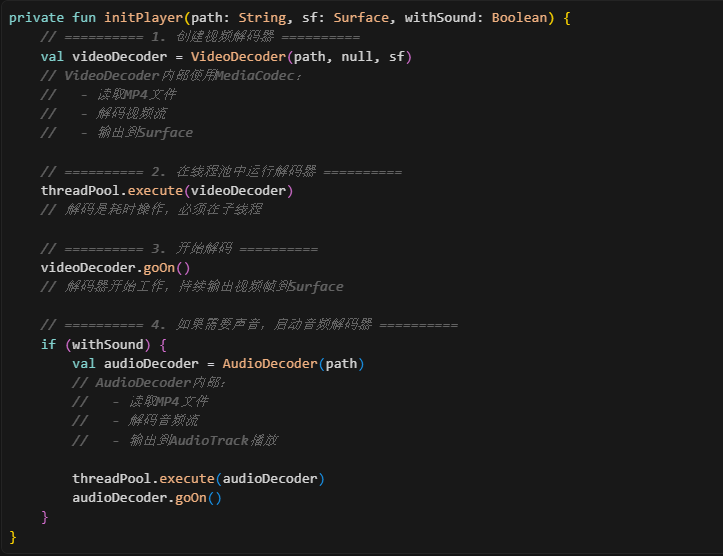

## 04.底层原理

如何理解：Surface，SurfaceView，SurfaceTexture，SurfaceFlinger。

如何理解视频的播放呢？

- 视频的播放过程，其实主要只有两个：解码和渲染。解码借助MediaCodec实现，渲染借助OpenGL和EGL
  - 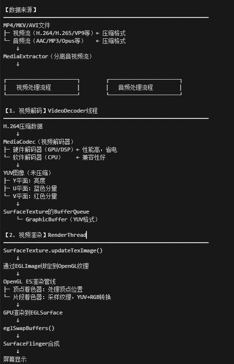

## 05.深度思考

### 5.1 关键问题探究

### 5.2 设计对比

## 06.实践验证

### 6.1 行为验证代码

### 6.2 性能测试

## 07.应用场景

### 7.1 最佳实践

### 7.2 使用禁忌

## 08.总结提炼

### 8.1 核心收获

### 8.2 知识图谱

### 8.3 延伸思考

## 09.参考资料

1. 
2. 
3. 

## 其他介绍

### 01.关于我的博客

- csdn：http://my.csdn.net/qq_35829566

- 掘金：https://juejin.im/user/499639464759898

- github：https://github.com/jjjjjjava

- 邮箱：[934137388@qq.com]

