[toc]

## 前言

> 学习要符合如下的标准化链条：了解概念->探究原理->深入思考->总结提炼->底层实现->延伸应用"

## 01.学习概述

- **学习主题**：
- **知识类型**：
  - [ ] ✅Android/ 
    - [ ] ✅01.基础组件与机制 
      - [ ] ✅四大组件
      - [ ] ✅IPC机制
      - [ ] ✅消息机制
      - [ ] ✅事件分发机制
      - [ ] ✅View与渲染体系（含Window、复杂控件、动画）
      - [ ] ✅存储与数据安全（SharedPreferences/DataStore/Room/Scoped Storage）
    - [ ] ✅02. 架构与工程化
      - [ ] ✅架构模式（MVC/MVP/MVVM/MVI）
      - [ ] ✅依赖注入（Koin/Hilt/Dagger）
      - [ ] ✅路由与模块化（ARouter、Navigation）
      - [ ] ✅Gradle与构建优化
      - [ ] ✅插件化与动态化
      - [ ] ✅插桩与监控框架
    - [ ] ✅03.性能优化与故障诊断
      - [ ] ✅ANR分析与优化
      - [ ] ✅启动耗时优化
      - [ ] ✅内存泄漏监控
      - [ ] ✅监控与诊断工具
    - [ ] ✅04.Jetpack与生态框架
      - [ ] ✅Room
      - [ ] ✅Paging
      - [ ] ✅WorkManager
      - [ ] ✅Compose
    - [ ] ✅05.Framework与系统机制
      - [ ] ✅ActivityManagerService (含ANR触发机制)
      - [ ] ✅Binder机制
  - [ ] ✅音视频开发/
    - [ ] ✅01.基础知识
    - [ ] ✅02.OpenGL渲染视频
    - [ ] ✅03.FFmpeg音视频解码
  - [ ] ✅ Java/
    - [ ] ✅01.基础知识
    - [ ] ✅02.集合框架
    - [ ] ✅03.异常处理
    - [ ] ✅04.多线程与并发
    - [ ] ✅06.JVM
  - [ ] ✅ Kotlin/
    - [ ] ✅01.基础语法
    - [ ] ✅02.高阶扩展
    - [ ] ✅03.协程和流
  - [ ] ✅ Flutter/
    - [ ] ✅01.基础知识
      - [ ] ✅Dart 语言基础
      - [ ] ✅Widget 基础与生命周期
      - [ ] ✅Flutter 基础组件
      - [ ] ✅布局与约束
      - [ ] ✅绘制与渲染体系
      - [ ] ✅状态管理
      - [ ] ✅事件处理与手势系统
      - [ ] ✅原生通信
    - [ ] ✅02.路由与导航
    - [ ] ✅03.性能优化与故障诊断
    - [ ] ✅04.异步编程
    - [ ] ✅05.项目经验与案例沉淀
  - [ ] ✅ 自我管理/
    - [ ] ✅01.内观
  - [ ] ✅ 项目经验/
    - [ ] ✅01.启动逻辑
    - [ ] ✅02.云值守
    - [ ] ✅03.智控平台
- **学习来源**：
- **重要程度**：⭐⭐⭐⭐⭐
- **学习日期**：2025.
- **记录人**：@panruiqi

### 1.1 学习目标

- 了解概念->探究原理->深入思考->总结提炼->底层实现->延伸应用"

### 1.2 前置知识

- [ ] 

## 02.核心概念

### 2.1 是什么？

先理解，什么是FBO？先回看EGL

- 还记得前面说的EGL吗？其创建的EGLSurface有两种类型，分别是可见窗口渲染和离屏渲染。如果是WindowSurface ，那么创建时，由SurfaceFlinger分配给Surface一连串的GraphicBuffer，这是共享内存。如果是PbufferSurface，那么创建时，SurfaceFlinger不会分配，其只能使用自身私有的GraphicBuffer，且不注册到SurfaceFlinge。

- 我们理解的过程就是EGL告知OpenGL渲染的目标后，GPU渲染的数据就会放置到对应的Surface的GraphicBuffer（其是一片共享内存）中

FBO是什么？

- 其实我们上面的理解有偏差，缺少了一步。
- 其实渲染步骤都是：**GPU管线渲染到FBO，而非直接所谓的渲染到GraphicBuffer**。而最终渲染到GraphicBuffer也只是用户没有自定义FBO，使用的默认FBO在渲染的过程中和EGLSurface相关联，使其最终渲染到GraphicBuffer。而如果用户自定义了FBO，那么他可以关联绑定的位置，可以是GPU中私有的Texture或者其他。

### 2.2 解决什么问题？

我们用几个实际现实中的业务需求，来看看他有什么作用

第一个需求：抖音的短视频平台的美颜效果，可以加贴纸，加磨皮，加美白。这种实时视频的多层滤镜叠加该怎么实现？

- 考量没有用FBO
  - 渲染到屏幕，屏幕读回cpu，cpu上传到GPU作为纹理，这就可以添加一层滤镜了。
  - 多层滤镜要多次重复上面的行为。
  - 这里的核心损耗是CPU和GPU间的数据传输
  - 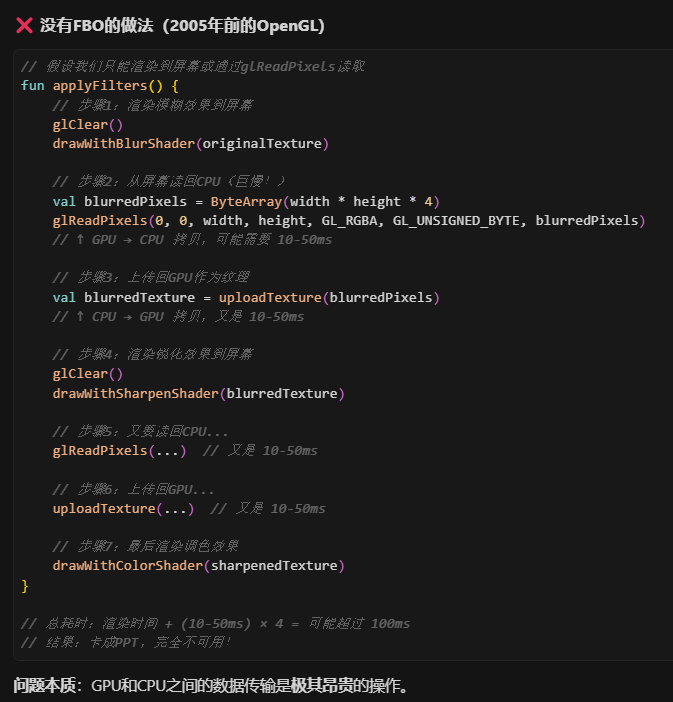
- 好，使用FBO避免这个问题
  - 纯GPU内部流转，零拷贝。让GPU直接渲染到纹理上
  - 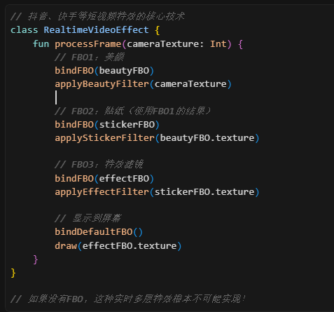

好，我们看看现代Android的常用的库中如何使用他

- GPUImage滤镜库
  - 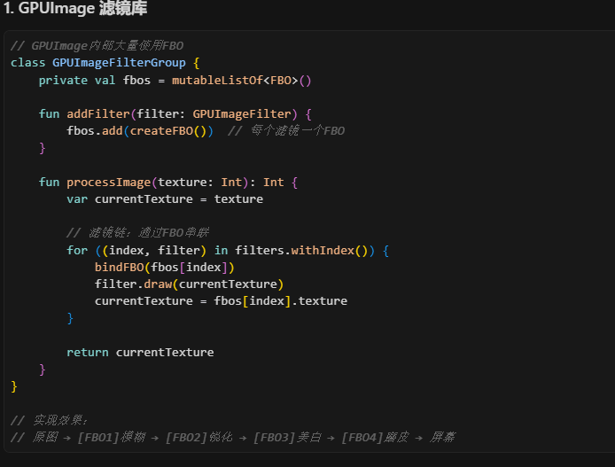

我现在有一个疑问，我们之前在学习Surface，SurfaceView，SurfaceTexture时知道SurfaceTexture可以将Surface中内容作为纹理提交给GPU使用，这个也是通过共享内存，也是零拷贝的。那么我们可不可以使用SurfaceTexture实现呢？

这是我们的思路

- 准备：要有一个共享的QueueBuffer。使用Surface向其生产，使用SurfaceTexture向其消费。
- 流程：GPU获取原始数据，渲染到这个Surface上，然后通过SurfaceTexture的UpdateImage，将其作为纹理交给GPU使用，因为是共享内存，GPU可以直接访问。GPU使用时就可以处理加一层滤镜。然后就是重复上面的循环了。

- 嗯，仔细思考一下，其实呢，这个就是EGL的离屏渲染啊。

好，我们对比一下这个方案和FBO的方案。

- 这是EGL方案的代码
  - 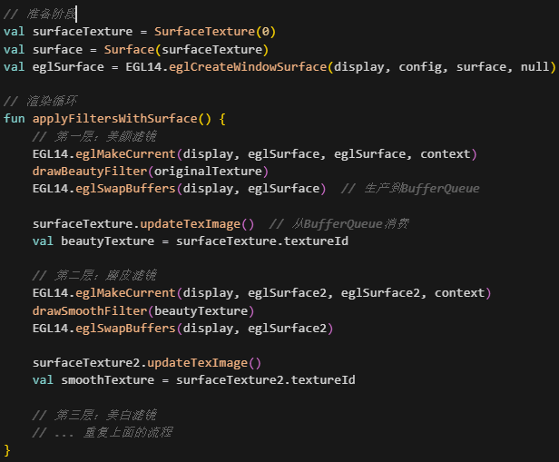
- 这是FBO方案的代码
  - 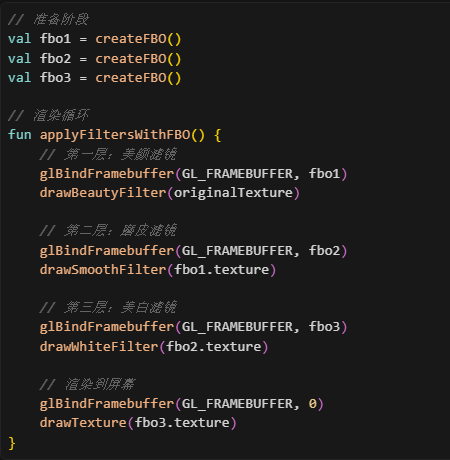
- EGL存在一个问题，需要频繁的入队和出队，这个队列的同步操作，需要cpu和锁的消耗。
  - 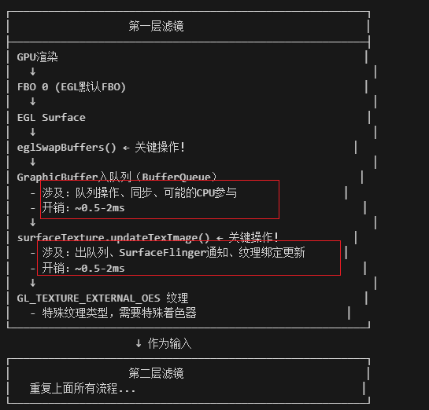
  - 这里要进行阻塞，事件通知，同步等操作，还要cpu的阻塞运行等，太耗时了。
  - 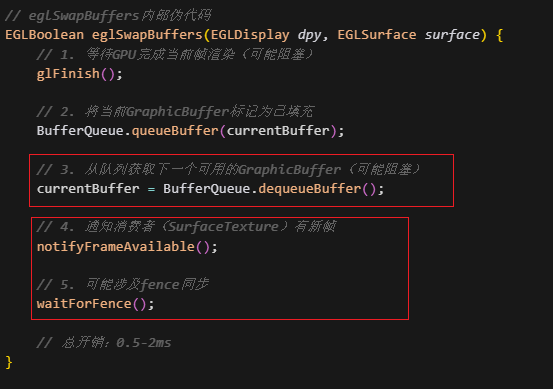
- 而FBO只用GPU内部寄存器切换指针即可。
  - 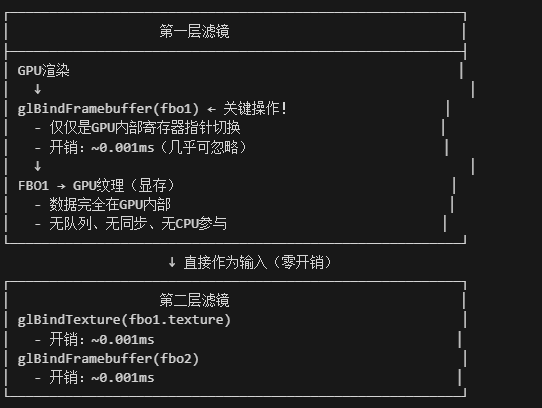

- 进行数据对比
  - 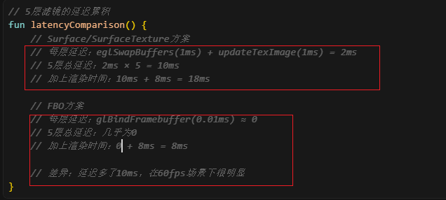

### 2.3 基本特性

## 03.原理机制

### 3.0 预分析

这是需求

- 利用FBO实现实时视频的灵魂出窍效果，他实际分为下面三个实现部分

  - 原图正常显示

  - 同时显示一个放大+半透明的"灵魂"层

  - 灵魂层需要基于原图实时生成
  - 

我们上篇文章学习了EGL，知道EGL可以建立一个离屏渲染的缓冲区，这种离屏渲染的方式通常用于模拟整个渲染窗口，比如可以用于FFmpeg软编码，将显示在虚拟窗口中的画面编码成H264。

但是这里不应该使用EGL，因为这个的要求是实时显示，EGL因为其队列管理和状态同步，时间延迟较大。对于这种实时的视频滤镜，我们通常使用的是FBO

### 3.1 FBO简介

FBO，全称Frame Buffer Object，帧缓存对象。他是一个缓存对象，存储了多个缓冲的索引。这里的关键是索引，其不直接记录数据，而是记录数据的索引。

这是他的特性介绍：

- 他内部有多种类型的缓冲，分别为颜色缓冲（Color buffers）, 深度缓冲（Depth buffer）, 模板缓冲（Stencil buffer）。
- 颜色缓冲就是纹理，深度缓冲就是存储3D视图的深度信息，模板缓冲存储模板值（也就是遮罩）
- 对于2D场景，也就是视频滤镜，其只需要颜色缓冲。而3D场景，也就是游戏画面，需要具备所有类型的缓冲。
- 这是其简易的内存视图
  - 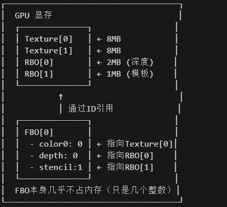

### 3.2 FBO基础用法

第一步：createFBOTexture新建纹理，用于FBO充当离屏渲染，接收渲染结果，其内部执行如下：

- 申请纹理ID，激活纹理单元。申请纹理ID会在GPU纹理池中分配一个可用的纹理ID。然后激活会让GL_TEXTURE_2D这个纹理单元和对应的纹理ID绑定。
  - 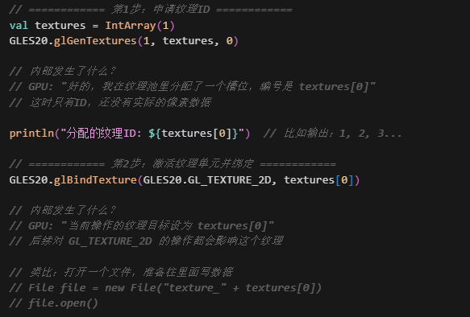
- 分配纹理存储空间，在GPU显存中分配一块内存，其内部存放的像素数据为null，也就是白纸内存，充当离屏缓冲，同时也将其地址存储到对应的纹理单元和纹理ID中了。
  - 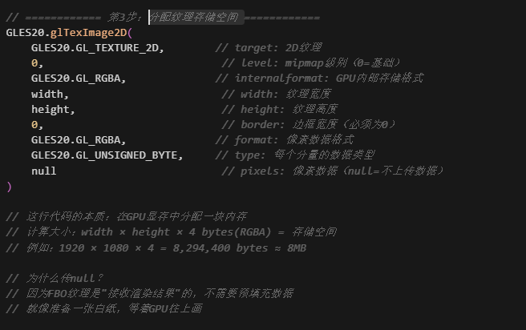
- 设置纹理过滤参数，也就是设置离屏缓冲的参数
  - 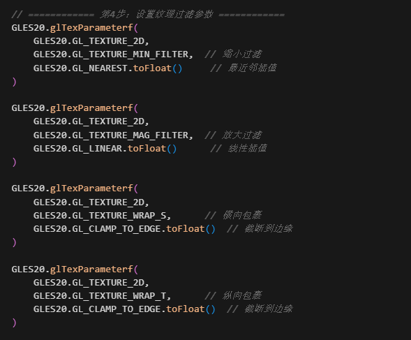
- 解绑纹理，防止后续的操作误修改这个纹理
  - 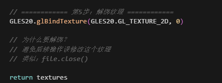
- 此时这个纹理被关联到纹理ID为5上，然后我们上面解绑，是将GL_TEXTURE_2D这个纹理单元和对应的纹理ID_0绑定。

第二步：创建FBO

- 创建一个空的FBO，内部无任何索引
  - 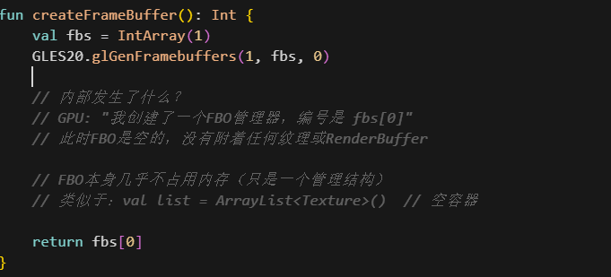

第三步：绑定FBO-建立连接

- 激活FBO
  - 先将GLES20.GL_FRAMEBUFFER和fb绑定。
  - 然后将上面的空白纹理通过ID附着到这个GLES20.GL_FRAMEBUFFER目标FBO上，也就是建立索引关系
  - 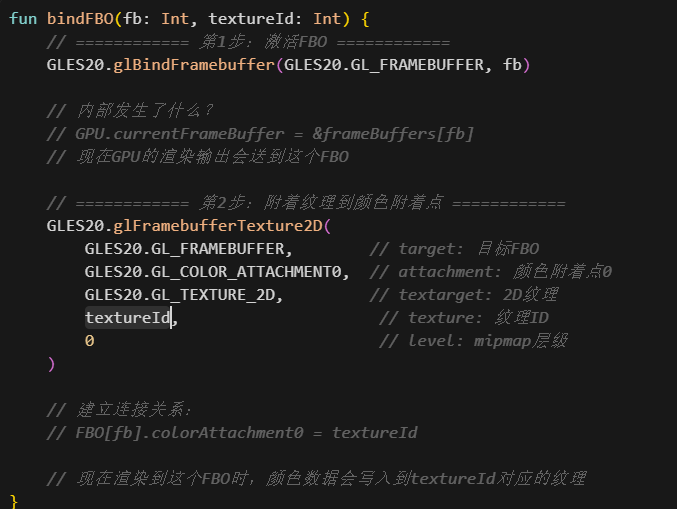
- 这就是大致的结果，所以bind就是让FBO拥有的颜色缓冲索引执行我们再显存中分配的纹理存储空间。
  - 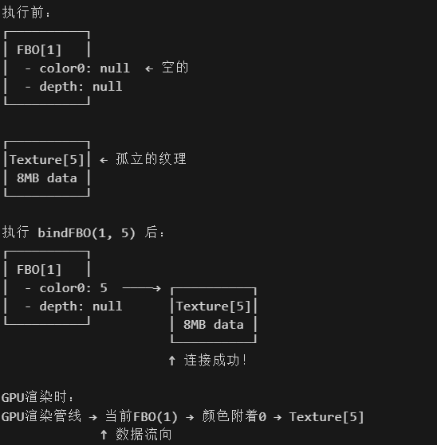

第四步：解绑FBO，不需要使用自定义FBO时回到默认FBO

- 就是绑定默认FBO，以及0纹理。
  - 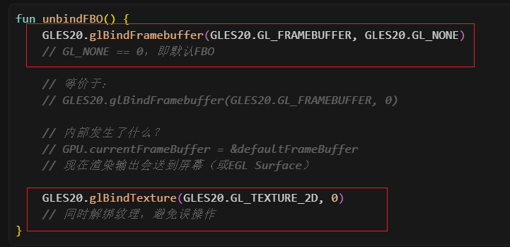

第五步：删除FBO，彻底不用时的清除操作

- 解绑FBO，删除FBO，解绑纹理，删除纹理
  - 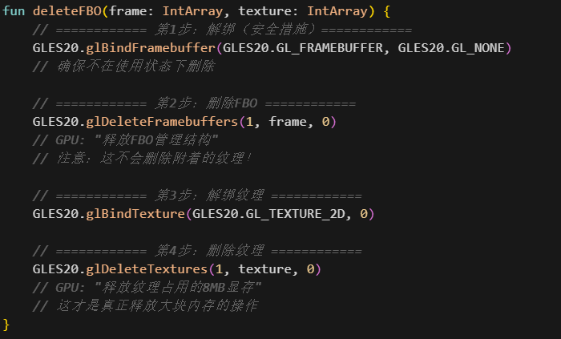

### 3.3 使用FBO实现“灵魂出窍”滤镜_原理和实现思路

需求，实现下图：

- 灵魂出窍图
  - 
- 视觉效果拆解
  - 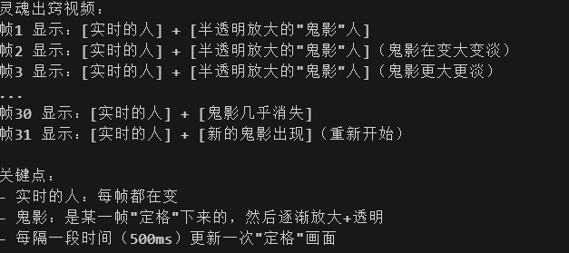

冻结一帧的技术原理

- 传统渲染流程
  - 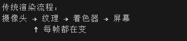
- 保持一帧画面
  - 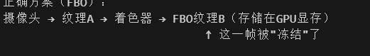

这是实现的思路

- 双通道渲染
  - 每隔500ms，往"虚拟屏幕"渲染一次，保存当前画面
  - 在"真实屏幕"渲染时，从"虚拟屏幕"读取定格画面
  - 真实屏幕 = 实时画面 + 虚拟屏幕的定格画面（处理后）
  - 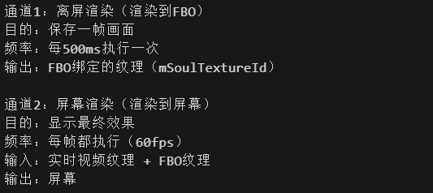
- 他依赖于这里的双纹理（注意类型，一个是Android相机的特殊纹理，一个是普通2D纹理）
  - 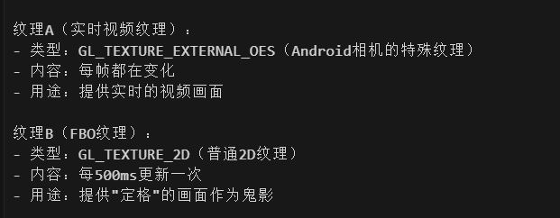

这是数据的执行流

- 每500ms更新一次FBO纹理。渲染时使用双纹理单元渲染，由着色器采样FBO纹理，进行缩放和透明度计算，并混合双纹理色彩。最终输出到屏幕
  - 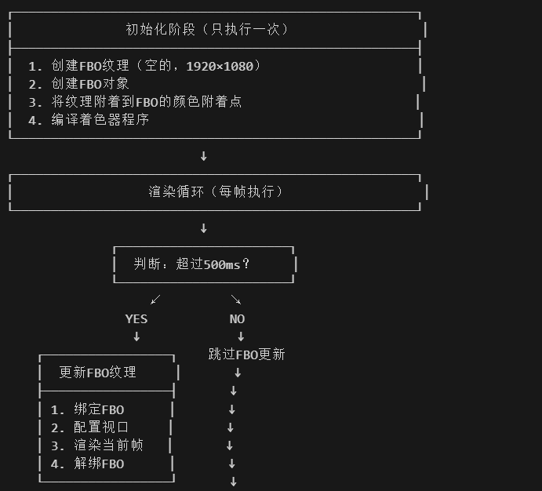
  - 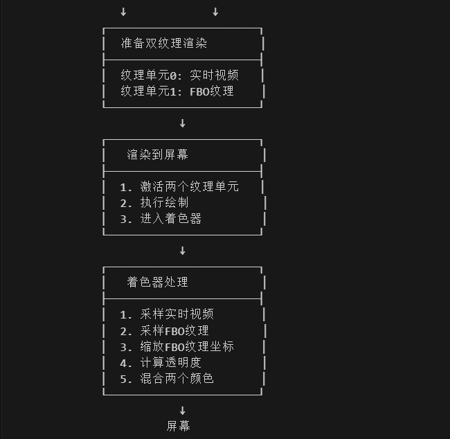

着色器中如何使用纹理？

- 激活，然后分别采用，最后用mix统一混合
  - 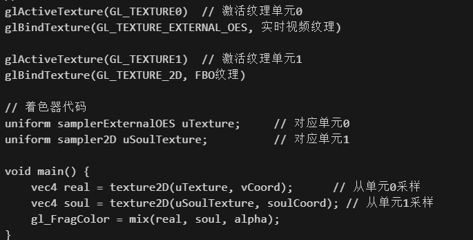

缩放原理设计

- 先看看基础概念：纹理坐标系
  - 这是着色器访问的纹理坐标
  - 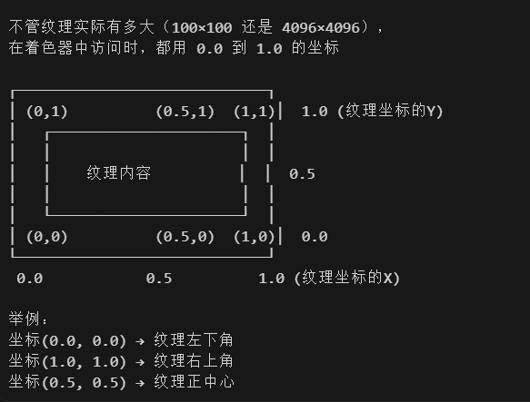
  - 这是屏幕坐标 vs 纹理坐标的映射
  - 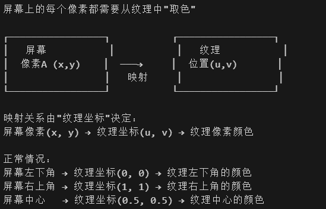
- 放大的本质是什么？
  - 放大是只采样纹理的一部分，然后拉伸到整个屏幕
  - 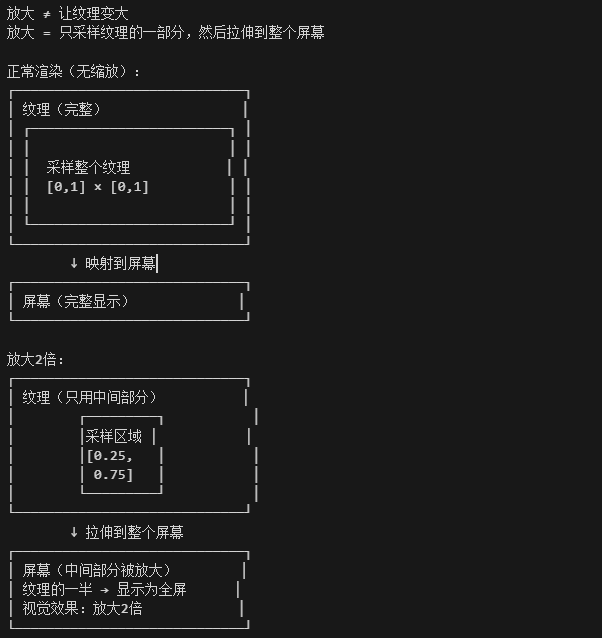
  - 数学原理呢？想要放大 scale 倍，采样范围 = [center - 0.5/scale, center + 0.5/scale]
  - 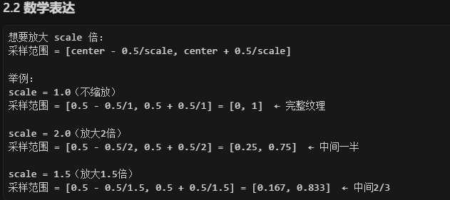

- 好，我们的这个怎么放大呢？假设放大1.5倍，就是0只采样[0.33, 0.67]区域，拉伸到[0, 1]
  - 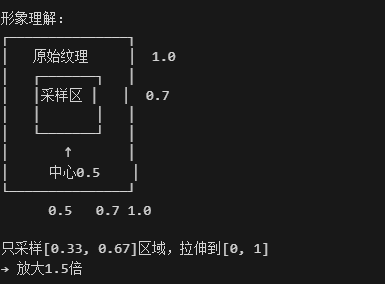

透明度渐变设计

- 简单的公式
  - 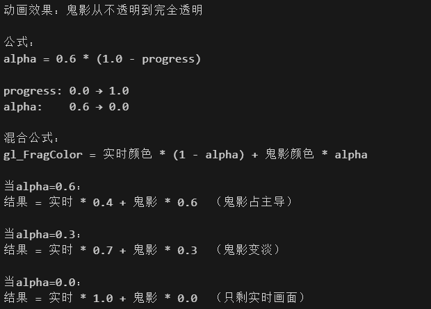

好，来小结一下我们的核心思想：

- 
  - 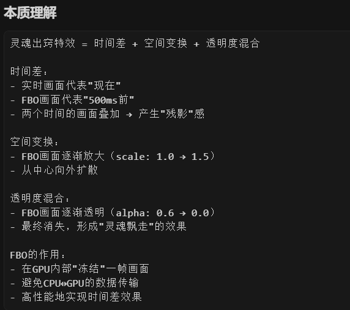

### 3.4 代码执行流详解

分为三个阶段：初始化，渲染循环，清理阶段

好的，阶段1，看看初始化阶段

- 成员变量声明
  - 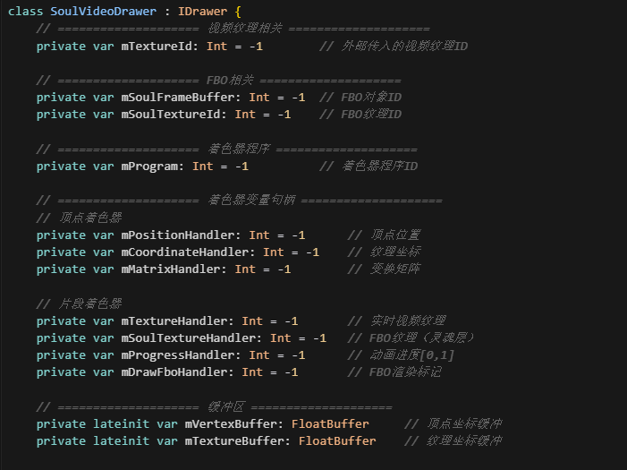
  - 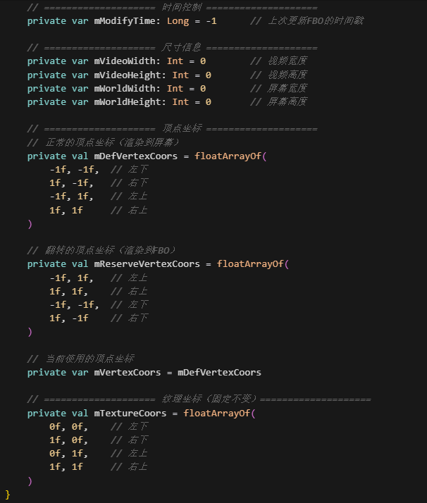

- 这是整体逻辑
  - 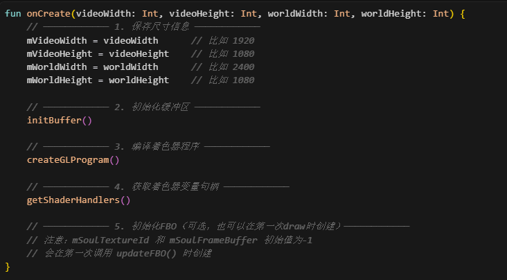
- 看看缓冲区初始化，缓冲区就是顶点坐标数据 和 纹理坐标数据
  - 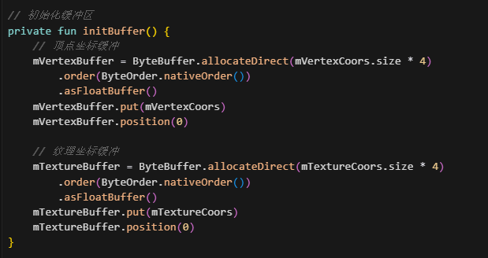
- 看看编译着色器程序
  - 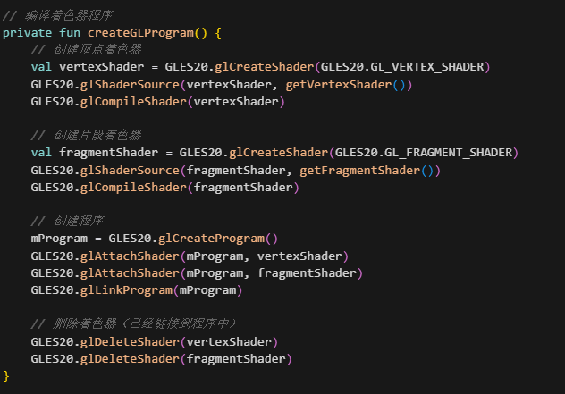
- 获取着色器变量句柄（也就是GPU中对应变量的地址）
  - 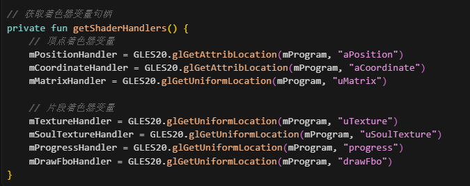

- 好，此时我们的着色器相关已经准备好了，包括着色器程序，着色器的缓冲区，着色器中变量句柄

渲染循环流程阶段

- 这是整体逻辑
  - 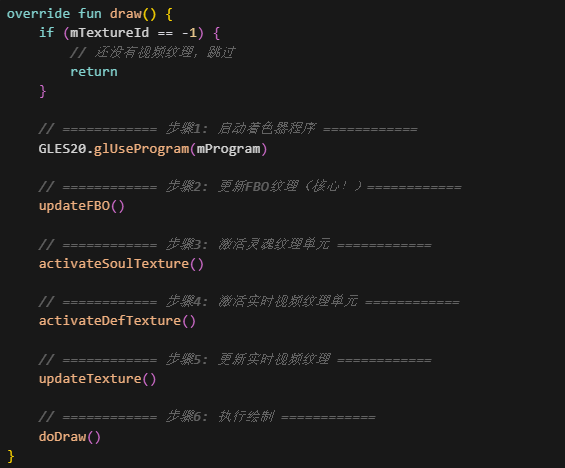
- updateFBO，更新FBO纹理
  - 

## 04.底层原理

## 05.深度思考

### 5.1 关键问题探究

### 5.2 设计对比

## 06.实践验证

### 6.1 行为验证代码

### 6.2 性能测试

## 07.应用场景

### 7.1 最佳实践

### 7.2 使用禁忌

## 08.总结提炼

### 8.1 核心收获

### 8.2 知识图谱

### 8.3 延伸思考

## 09.参考资料

1. 
2. 
3. 

## 其他介绍

### 01.关于我的博客

- csdn：http://my.csdn.net/qq_35829566

- 掘金：https://juejin.im/user/499639464759898

- github：https://github.com/jjjjjjava

- 邮箱：[934137388@qq.com]

