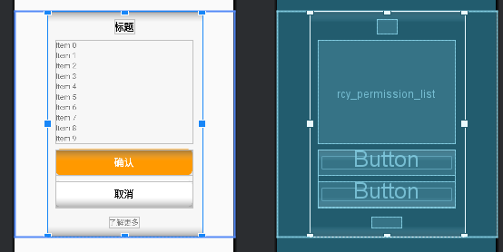

[toc]

## 01.01. PermissionTipsDialog视图逻辑

- 视图显示如下：
  - 
  - 
  
- 如果让我实现，我该怎么实现这个呢？
  
  - 一个FrameLayout，高度是包裹内容，宽是match_parent。
  - 然后内部一个Wrap_Content，宽度是给定的LinearLayout，垂直方向。
  - 然后在里面去配置标题，RecyclerView，两个Button按钮。
  
- 对应代码：

  - ```
    <?xml version="1.0" encoding="utf-8"?>
    <FrameLayout xmlns:android="http://schemas.android.com/apk/res/android"
        xmlns:tools="http://schemas.android.com/tools"
        xmlns:wheel="http://schemas.android.com/apk/res-auto"
        android:layout_width="match_parent"
        android:layout_height="wrap_content"
        android:layout_gravity="center"
        android:gravity="center"
        android:orientation="vertical">
    
        <LinearLayout
            android:id="@+id/ll_normalArea"
            android:layout_width="@dimen/alert_width"
            android:layout_height="wrap_content"
            android:layout_gravity="center"
            android:background="@drawable/bg_f7f7f7_radius_12"
            android:gravity="center"
            android:orientation="vertical"
            android:padding="@dimen/dp_15">
    
            <TextView
                android:id="@+id/title_text"
                android:layout_width="wrap_content"
                android:layout_height="wrap_content"
                android:ellipsize="end"
                android:gravity="center"
                android:maxLines="3"
                android:textColor="@color/black"
                android:textSize="@dimen/sp_17"
                android:textStyle="bold"
                tools:text="标题" />
    
            <TextView
                android:id="@+id/content_text"
                android:layout_width="wrap_content"
                android:layout_height="wrap_content"
                android:layout_marginTop="10dp"
                android:gravity="center"
                android:textAlignment="center"
                android:textColor="#797979"
                android:textSize="@dimen/sp_14"
                android:visibility="gone" />
    
            <androidx.recyclerview.widget.RecyclerView
                android:id="@+id/rcy_permission_list"
                android:layout_width="match_parent"
                android:layout_height="wrap_content"
                android:layout_marginTop="@dimen/dp_10" />
    
            <LinearLayout
                android:layout_width="match_parent"
                android:layout_height="wrap_content"
                android:layout_marginTop="@dimen/dp_10"
                android:gravity="center"
                android:orientation="vertical">
    
                <Button
                    android:id="@+id/confirm_button"
                    android:layout_width="match_parent"
                    android:layout_height="@dimen/dp_44"
                    android:background="@drawable/circle_bg_orange_r8"
                    android:text="@string/dialog_ok"
                    android:textColor="@color/white"
                    android:textSize="@dimen/sp_17"
                    android:textStyle="bold" />
    
                <Button
                    android:id="@+id/cancel_button"
                    android:layout_width="match_parent"
                    android:layout_height="@dimen/dp_44"
                    android:layout_marginTop="@dimen/dp_10"
                    android:background="@drawable/bg_white_radius_8"
                    android:text="@string/cancel"
                    android:textColor="@color/black"
                    android:textSize="@dimen/sp_17"
                    android:textStyle="bold" />
    
            </LinearLayout>
    
            <TextView
                android:id="@+id/tv_know_more"
                android:layout_width="wrap_content"
                android:layout_height="wrap_content"
                android:layout_marginTop="@dimen/dp_17"
                android:text="@string/know_more_info"
                android:textColor="@color/color_7F7F7F"
                android:textSize="@dimen/sp_13" />
        </LinearLayout>
    </FrameLayout>
    ```

    